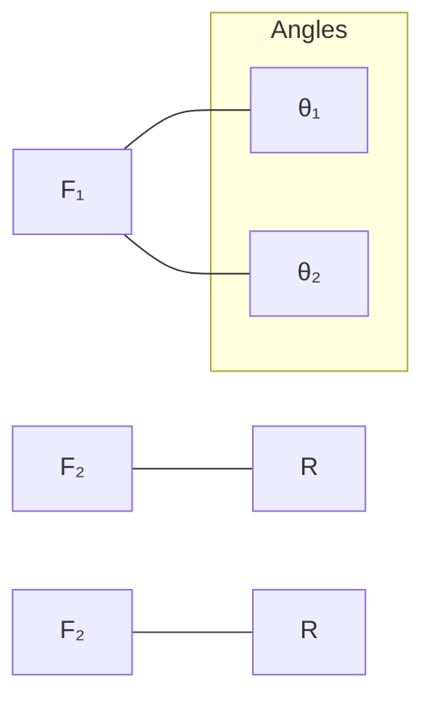

# Mathematics Applications

## Scientific Section

By a group of supervisors

Interactive E-learning Application  
GPS

----

### The Main Book

**First Term**  
**2 SEC. 2024**

----

[Maths Applications - Scientific Section - Interactive E-learning Application - GPS]

[The image shows a stylized drawing of a cable-stayed bridge over water with reflection, with arrows indicating directions or forces on the bridge cables.]

----

*Publisher: EL-MOASSER*


---


# CONTENTS

* Revision on vectors

## Unit One  Statics.

### Lesson 1  
Forces - Resultant of two forces meeting at a point .................................................. 10

### Lesson 2  
Forces resolution into two components ............................................................... 21

### Lesson 3  
The resultant of coplanar forces meeting at a point .................................................. 26

### Lesson 4  
Equilibrium of a rigid body under the effect of two forces / three forces meeting at a point  
(The triangle of forces rule - Lami's rule) .......................................................... 37

### Lesson 5  
Follow: The equilibrium  
(Meeting lines of action of three equilibrium forces) ............................................... 49

## Unit Two  Geometry and measurement.

### Lesson 1  
The straight lines and the planes in the space .......................................................... 59

### Lesson 2  
The pyramid ........................................................................................................ 66

### Lesson 3  
The cone ............................................................................................................. 78

### Lesson 4  
The circle ........................................................................................................... 87


---


# Revision on vectors

The quantities which we deal with in our life are divided into two kinds of quantities:

**(1) Scalar quantities:**  
They are the quantities which are completely determined if we knew their magnitude only as a real number.  
As: length, mass, time, temperature degree, volume, distance.

**(2) Vector quantity:**  
It is a quantity determined by a real number (the magnitude of this quantity) besides the direction.  
_i.e._ The vector quantity is determined completely if we knew its magnitude and its direction.

* **Directed line segment:**  
  It is a straight line segment having an initial point and an ending point, with direction defined from the initial point to the ending point.

* **The norm of the directed line segment** \(\overrightarrow{AB}\):  
  The norm of \(\overrightarrow{AB}\) is the length of \(\overrightarrow{AB}\) and it is denoted by \(\|\overrightarrow{AB}\|\).

* The two directed line segments are equivalent if they have:  
  - The same length (the norm) and the same direction.

* \(\overrightarrow{AB} \neq \overrightarrow{BA}\) (they have opposite directions)

* \(\overrightarrow{AB} = - \overrightarrow{BA}\)

* \(\|\overrightarrow{AB}\| = \|\overrightarrow{BA}\|\)


---


* The position vector of a given point (A) with respect to the origin point (O) is the directed line segment \(\overrightarrow{OA}\), it is denoted by \(\vec{A}\).

### For example:

#### In the opposite figure:

If \(\overrightarrow{OA}\) is the position vector of the point (A) = \((x, y)\) then:

* \(\|\vec{A}\| =\) the length of \(\overrightarrow{OA} = \sqrt{x^2 + y^2}\)

* If \(\|\vec{A}\| = 1\) length unit (unity), then \(\vec{A}\) is called the **unit vector**.

* \(\vec{i} = (1, 0)\), \(\vec{j} = (0, 1)\) are two unit vectors (called two basic unit vectors) in the two directions of the two coordinate axes.

* \(\vec{O} = (0, 0)\) it is the zero vector which has no direction and it is denoted by \(\vec{O}\).

* \(\vec{A} = (x, y)\) is called the **Cartesian form** of the vector \(\vec{A}\).

* \(\vec{A} = x \vec{i} + y \vec{j}\) expresses the vector \(\vec{A}\) in terms of the two basic unit vectors.

* \(\vec{A} = \left(\|\vec{A}\|, \theta \right)\) is called the **polar form** of the vector \(\vec{A}\).

* \(\theta\) is the measure of the angle made by the vector \(\overrightarrow{OA}\) with the positive direction of the x-axis; it is called the **polar angle**.

* \(x = \|\vec{A}\| \cos \theta\), then \(\cos \theta = \frac{x}{\|\vec{A}\|}\)

* \(y = \|\vec{A}\| \sin \theta\), then \(\sin \theta = \frac{y}{\|\vec{A}\|}\)

* If \(\vec{A} = (x_1, y_1)\), \(\vec{B} = (x_2, y_2)\), then:

  - \(\vec{A} = \vec{B}\) if and only if \(x_1 = x_2\), \(y_1 = y_2\)

  - \(\vec{A} \pm \vec{B} = (x_1 \pm x_2, y_1 \pm y_2)\)

  - \(\overrightarrow{AB} = \vec{B} - \vec{A} = (x_2 - x_1, y_2 - y_1)\)

  - \(k \vec{A} = k (x, y) = (k x, k y)\)

* \(\vec{A} \parallel k \vec{A}\) with regard that:

| If       | Condition | Then                                                                 | Note          |
|----------|-----------|----------------------------------------------------------------------|---------------|
| \(k > 0\) | then      | \(\vec{A}\) and \(k \vec{A}\) have the **same direction**            | where \(k \neq 0\) |
| \(k < 0\) | then      | \(\vec{A}\) and \(k \vec{A}\) have **opposite direction**            |               |

----

#### Figure description:

A 2D coordinate system with origin \(O\), x-axis and y-axis labeled. A point \(A(x,y)\) is shown in the first quadrant with vector \(\overrightarrow{OA}\) making an angle \(\theta\) with the positive x-axis.


---


# Adding and subtracting vectors geometrically:

| Diagram 1 | Diagram 2 | Diagram 3 | Diagram 4 |
|-----------|-----------|-----------|-----------|
| !Triangle with points A, B, C and vectors AB, BC, AC | !Parallelogram with points A, B, C, D and vectors AB, BD, AD, AC | !Triangle with points A, B, C, D and vectors AB, AC, AD, BD, CD | !Triangle with points A, B, C and vectors AB, AC, CB |

Equations:
$$\overrightarrow{AB} + \overrightarrow{BC} = \overrightarrow{AC}$$  
$$\overrightarrow{AB} + \overrightarrow{BC} + \overrightarrow{CA} = \overrightarrow{0}$$  

$$\overrightarrow{AB} + \overrightarrow{BD} = \overrightarrow{AD}$$  
$$\overrightarrow{AB} + \overrightarrow{AC} = \overrightarrow{AD}$$  

$$\overrightarrow{AB} + \overrightarrow{AC} = 2 \overrightarrow{AD}$$  
$$\overrightarrow{BD} + \overrightarrow{CD} = \overrightarrow{0}$$  

$$\overrightarrow{AB} - \overrightarrow{AC} = \overrightarrow{CB}$$  

----

# Physical applications:

## The resultant force \(\vec{R}\)

* The resultant of a set of forces acting on a body is operated as the operation of adding vectors.

$$\vec{R} = \vec{F}_1 + \vec{F}_2 + \vec{F}_3 + \ldots$$

### For example:

If we define a unit vector \(\hat{e}\) in the direction of the motion of the body then:

----

### In the case of motion of the body on a rough plane

| The friction force | The pushing force \(\vec{F}\) |
|-------------------|-------------------------------|
| 3 newton          | 5 newton                      |

The resultant force:

$$\vec{R} = 5 \hat{e} + (-3 \hat{e}) = 2 \hat{e}$$

*i.e.* The magnitude of the resultant = 2 newton

* The direction of the resultant is in the direction of the motion of the body.

----

### In the case of vertical motion

| Forces | Description |
|--------|-------------|
| Resultant force | \(50 \hat{e} + (-30 \hat{e}) = 20 \hat{e}\) |
| Magnitude of the resultant | 20 Kg.wt. |

* The direction of resultant is in the direction of the weight.

* The gravitational force (the weight) is shown acting downward.

* The resistance force \(r = 3 \text{ kg.wt.}\)

* Weight \(w = 50 \text{ kg.wt.}\)

----

* If the two forces have the same magnitude and the same line of action but in two opposite directions then the resultant \(\vec{R} = \vec{0}\).

* If the resultant of a set of concurrent forces = \(\vec{0}\), this means the set of forces are in equilibrium.


---


# Example 1

1. Write the vector \(\vec{A} = \left(3, -\sqrt{3}\right)\) in the polar form.

2. Write in terms of the two basic unit vectors the vector \(\vec{A}\) whose norm = 10 length unit and act in the direction of Western North.

### Solution

1. 
\[
\|\vec{A}\| = \sqrt{9 + 3} = 2\sqrt{3}
\]

\[
\cos \theta = \frac{x}{\|\vec{A}\|} = \frac{3}{2\sqrt{3}} = \frac{\sqrt{3}}{2} > 0
\]

\[
\sin \theta = \frac{y}{\|\vec{A}\|} = \frac{-\sqrt{3}}{2\sqrt{3}} = -\frac{1}{2} < 0
\]

\(\therefore \theta\) lies in the 4th quadrant

\[
\therefore \theta = 360^\circ - 30^\circ = 330^\circ
\]

\[
\therefore \vec{A} = \left(2\sqrt{3}, 330^\circ\right)
\]

2. 
\[
\|\vec{A}\| = 10, \quad \theta = 135^\circ
\]

\[
x = \|\vec{A}\| \cos \theta = 10 \cos 135^\circ = -5 \sqrt{2}
\]

\[
y = \|\vec{A}\| \sin \theta = 10 \sin 135^\circ = 5 \sqrt{2}
\]

\[
\therefore \vec{A} = \left(-5 \sqrt{2}, 5 \sqrt{2}\right)
\]

\[
\therefore \vec{A} = -5 \sqrt{2} \, \mathbf{i} + 5 \sqrt{2} \, \mathbf{j}
\]

# Example 2

If the forces \(\vec{F}_1 = 2 \mathbf{i} + 3 \mathbf{j}\), \(\vec{F}_2 = a \mathbf{i} + \mathbf{j}\), \(\vec{F}_3 = 5 \mathbf{i} + b \mathbf{j}\) act on a particle,

Find the values of \(a\) and \(b\) if these forces:

1. Their resultant = \(5 \mathbf{i} - 2 \mathbf{j}\)

2. Are in equilibrium.

### Solution

The resultant is

\[
\vec{F}_1 + \vec{F}_2 + \vec{F}_3 = (2 \mathbf{i} + 3 \mathbf{j}) + (a \mathbf{i} + \mathbf{j}) + (5 \mathbf{i} + b \mathbf{j}) = (2 + a + 5) \mathbf{i} + (3 + 1 + b) \mathbf{j}
\]

1. For the resultant \(5 \mathbf{i} - 2 \mathbf{j}\):

\[
(7 + a) \mathbf{i} + (4 + b) \mathbf{j} = 5 \mathbf{i} - 2 \mathbf{j}
\]

\[
7 + a = 5 \quad \Rightarrow \quad a = -2
\]

\[
4 + b = -2 \quad \Rightarrow \quad b = -6
\]

2. For the forces to be in equilibrium:

\[
\vec{R} = \vec{0}
\]

\[
(7 + a) \mathbf{i} + (4 + b) \mathbf{j} = \vec{0}
\]

\[
a = -7, \quad b = -4
\]


---


# Unit One

## Statics

* Forces - Resultant of two forces meeting at a point.

* Forces resolution into two components.

* The resultant of coplanar forces meeting at a point.

* Equilibrium of a rigid body under the effect of two forces / three forces meeting at a point.  
  (The triangle of forces rule - Lami's rule).

* Follow: The equilibrium  
  (Meeting lines of action of three equilibrium forces).


---


# Lesson 1

## Forces - Resultant of two forces meeting at a point

### The force

> "The force is defined as the effect of a natural body upon another one" by pushing, attraction, pressure or repulsion.

The natural body is a body consisting of material (mass) and volume not equal to zero.  
The natural bodies can be classified into two kinds:

* **Rigid bodies (solid bodies):** They are the bodies whose shapes do not change whatever the forces which are acting on them as solid metals, rocks, .......... .
* **Deformable bodies:** They are the bodies whose shapes can be disfigured as strings, liquids, gases, rubber and clay and our study in this unit will be continued to rigid bodies only.

### Kinds of forces

There are different kinds of forces, as:

1. **Tension force (T):**  
   As the force in the string (or the rope) when carrying a body at it.

(Tension in the string)


---


# Lesson One

## 2) Pressure force (P):

As the force that appears when a body stabilized on a surface.

## 3) Reaction force (r):

As the reaction of a smooth surface on a body stabilized on it.

## 4) Attraction forces and repulsion forces:

As the forces which formed between magnetic poles, electric charges and astronomical objects.

## 5) Gravitational forces (weights):

If we let a body in the air, then it will drop down towards the Earth because the attraction force of the Earth attracts any body towards it.  
This force is called gravitational force or weights.  
* Notice that: the weight (W) = the body mass × acceleration of gravity = m × g

----

## Expressing force

The force is a vector quantity so it can be represented by the same way as the vectors.

**i.e. The force can be expressed as follow:**

1. \(\vec{F} = (X, y)\) ⇒ the cartesian form.
2. \(\vec{F} = X \hat{i} + y \hat{j}\) ⇒ in terms of the fundamental unit vectors.
3. \(\vec{F} = (\|\vec{F}\|, \theta)\) ⇒ the polar form.

<table>
  <thead>
    <tr>
      <th colspan="3">Vector Diagram</th>
    </tr>
  </thead>
  <tbody>
    <tr>
      <td>y</td>
      <td rowspan="3"></td>
      <td>(X, y)</td>
    </tr>
<tr>
      <td></td>
      <td></td>
    </tr>
<tr>
      <td>O</td>
      <td></td>
    </tr>
  </tbody>
</table>

----

## Determination of the force

The force is a vector which passes through a fixed point.  
*i.e.* It acts in a given straight line.

**i.e. The force is determined by:**

1. The magnitude of the force.
2. The direction of the force.
3. The point of action of the force.

----

### For example:

The football player kicks the ball by a determined force (magnitude of the force) in a determined direction (direction of the force) in a certain point on the surface of the ball (Point of action of the force).

----

<table>
  <thead>
    <tr>
      <th colspan="2">Force on a ball example</th>
    </tr>
  </thead>
  <tbody>
    <tr>
      <td></td>
      <td>
        The football player kicks the ball by a determined force (magnitude of the force) in a determined direction (direction of the force) at a certain point on the surface of the ball (point of action of the force).
      </td>
    </tr>
  </tbody>
</table>

----

<table>
  <thead>
    <tr>
      <th>r (Reaction)</th>
    </tr>
  </thead>
  <tbody>
    <tr>
      <td>
        <div>↑</div>
        <div>Reaction force vector acting upward on the body</div>
        <div>■</div>
        <div>↓</div>
        <div>Pressure force vector acting downward on the surface</div>
      </td>
    </tr>
  </tbody>
</table>


---


# UNIT 1

## The magnitude of the force

### 1) The measurement units:

* The magnitude of the force (The numerical value of the force) is measured by units which are called weight units.  
  As: gram weight (gm.wt.), kilogram weight (kg.wt.)  
  where  
  $$1 \text{ kg.wt.} = 1000 \text{ gm.wt.} = 10^3 \text{ gm.wt.}$$

* There are other units to measure the magnitude of force (they are called absolute units)  
  As: The dyne, the newton:  
  where  
  $$1 \text{ newton} = 100\,000 \text{ dyne} = 10^5 \text{ dyne}$$

* The weight units connect with the absolute units by the relation:  
  $$1 \text{ kg.wt.} = 9.8 \text{ newton}, \quad 1 \text{ gm.wt.} = 980 \text{ dyne}$$  
  (unless something else mentioned)

### 2) The direction of the force:

It is the direction of the vector which represents this force and it is determined by the measure of the polar angle of the force vector in the case of the coplanar forces in the same plane.  
* The polar angle is the positive directed angle which the vector makes with the positive direction of X-axis.

### 3) The point of action of the force:

The action of the force is determined by its point of action. If you try to open the door of a room or close it with a force near the line of hinges, you will find it difficult to rotate it.  
As you are far from the line of hinges, the difficulty becomes less. As shown in the figure.

## The line of action of the force

The line of action of the force is the line passing through the point of action parallel to the direction of the force.

**For example:**  
- The tension line in a string is the string itself.  
- The line of action of the weight of a body is the vertical line passing through the center of gravity of the body.

----

[The image on the right shows a door with force vectors labeled F applied at different points, illustrating difficulty in rotation near hinges. Below it is a diagram showing tension line, center of gravity of the body, weight's line, and weight acting vertically downward.]


---


# Lesson One

## Displacing (or translation) of the point of action of the force (force penetration)

If the force **F** acts on a rigid body and A is the point of its action, then we can displace this point to another point on the body "B" or "C" or .... on the line of action of the force without changing in its influence on the body.

*i.e.* Any point lying on the line of action of a force can be considered as a point of action of this force.

----

## Resultant of two forces meeting at a point

The resultant of two or more forces is a single force that has the same effect as the two or more forces.

----

## Finding the resultant of two forces meeting at a point (geometrically)

**This method depends on the parallelogram rule to add two forces:**

If two forces (**F₁**, **F₂**) meeting at a point are represented in magnitude and direction by two sides of a parallelogram meeting at this point, then their resultant (**R**) is represented in magnitude and direction by the diagonal of the parallelogram which starts from the same point.

$$
\vec{R} = \vec{F_1} + \vec{F_2}
$$

----

### Example 1

**F₁ and F₂ are two forces acting on the point O from a solid body, where F₁ = 500 newton and acts on the direction of East, F₂ = 300 newton and acts in the direction 60° North of West, find their resultant graphically.**

### Solution

* We use the drawing scale one cm per 100 newton.

* Draw **OA** to represent **F₁** and **OB** to represent **F₂**, where  
  $$\|OA\| = 5 \text{ cm}, \quad \|OB\| = 3 \text{ cm}.$$

* Then complete the parallelogram OACB, then **OC** represents the resultant **R**.

----

### Diagrams description:

- A parallelogram diagram with points A, B, C, D, showing vectors **F₁** along AB, **F₂** along AD, and resultant **R** along AC.
- A force diagram showing points A, B, C on a line with force **F** acting.
- A force system with a spring and forces labeled C, B, A, and F.
- A coordinate system with directions North, South, East, West, showing vectors **F₁** along East, **F₂** at 60° North of West, and resultant **R**.


---


# Unit 1

* By measuring, we find that \( \| \overrightarrow{OC} \| = 4.4 \, \text{cm} \) approximately, \( m(\angle AOC) = 37^\circ \)  
\(\therefore \overrightarrow{R}\) acts at O and its magnitude = 440 newton in the direction 37° North of east approximately.

----

### Remark

If \(\overrightarrow{F_1}\) and \(\overrightarrow{F_2}\) act at the point O and if they are represented by the two vectors \(\overrightarrow{AO}\) and \(\overrightarrow{OB}\) as in the opposite figure, then according to the rule of addition of two vectors, \(\overrightarrow{AB}\) represents the resultant of these two vectors. But the line of action of the resultant of \(\overrightarrow{F_1}\) and \(\overrightarrow{F_2}\) must pass through O.

Therefore, we draw from O the directed line segment \(\overrightarrow{OC}\) equivalent to \(\overrightarrow{AB}\) which represents the resultant of these two forces perfectly.

<table>
  <tr>
    <td>
      <b>Diagram description:</b><br>
      Parallelogram with points A, B, C, D and O inside.<br>
      Vectors:<br>
      - \(\overrightarrow{F_1}\) from O to A<br>
      - \(\overrightarrow{F_2}\) from O to B<br>
      - \(\overrightarrow{R}\) from O to C<br>
      - \(\overrightarrow{R}\) from B to C<br>
      Notes:<br>
      - "Represents the resultant in magnitude and direction only" near \(\overrightarrow{R}\) from O to C<br>
      - "Represents the resultant perfectly" near \(\overrightarrow{R}\) from B to C
    </td>
  </tr>
</table>

----

## Finding the resultant of two forces meeting at a point analytically

Let the two forces \(\overrightarrow{F_1}\) and \(\overrightarrow{F_2}\) meet at O and \(\alpha\) is the measure of the angle between the directions of the two forces.

If \(\overrightarrow{OA}\) and \(\overrightarrow{OB}\) represent the two forces \(\overrightarrow{F_1}\) and \(\overrightarrow{F_2}\), then \(\overrightarrow{OC}\) represents the resultant \(\overrightarrow{R}\).

Let \(\theta\) be the measure of the angle between the resultant \(\overrightarrow{R}\) and the force \(\overrightarrow{F_1}\), then from our study of the cosine law in trigonometry, we can get the resultant of the two forces \(\overrightarrow{F_1}\) and \(\overrightarrow{F_2}\) in magnitude and direction from the following relations:

$$
R = \sqrt{F_1^2 + F_2^2 + 2 F_1 F_2 \cos \alpha} \quad , \quad \tan \theta = \frac{F_2 \sin \alpha}{F_1 + F_2 \cos \alpha}
$$

where \(F_1\), \(F_2\), and \(R\) are the magnitudes of \(\overrightarrow{F_1}\), \(\overrightarrow{F_2}\), and \(\overrightarrow{R}\).

<table>
  <tr>
    <td>
      <b>Diagram description:</b><br>
      Rectangle with points O, A, B, C, D.<br>
      Vectors:<br>
      - \(\overrightarrow{F_1}\) from O to A<br>
      - \(\overrightarrow{F_2}\) from O to B<br>
      - \(\overrightarrow{R}\) from O to C<br>
      Angles:<br>
      - \(\alpha\) between \(\overrightarrow{F_1}\) and \(\overrightarrow{F_2}\)<br>
      - \(180^\circ - \alpha\) between \(\overrightarrow{F_2}\) and \(\overrightarrow{R}\)
    </td>
  </tr>
</table>

----

## Special cases

### 1) If the two forces are perpendicular (i.e. \(\alpha = 90^\circ\)):

\[
\cos \alpha = 0, \quad \sin \alpha = 1
\]

Substituting in the two previous relations, we get that:

$$
R = \sqrt{F_1^2 + F_2^2} \quad , \quad \tan \theta = \frac{F_2}{F_1}
$$

<table>
  <tr>
    <td>
      <b>Diagram description:</b><br>
      Rectangle with points O, A, B, C.<br>
      Vectors:<br>
      - \(\overrightarrow{F_1}\) from O to A<br>
      - \(\overrightarrow{F_2}\) from O to B<br>
      - \(\overrightarrow{R}\) from O to C<br>
      Angle \(\theta\) between \(\overrightarrow{F_1}\) and \(\overrightarrow{R}\)
    </td>
  </tr>
</table>


---


# Lesson One

## 2. If the two forces are equal in magnitude (i.e. \( F_1 = F_2 = F \)):

In this case, the parallelogram OACB exchanges to a rhombus, then:

$$
R = OC = 2 \, OM = 2 \, OA \cos \frac{\alpha}{2} = 2F \cos \frac{\alpha}{2}
$$

i.e.

$$
R = 2F \cos \frac{\alpha}{2}, \quad \theta = \frac{\alpha}{2} \quad \text{(where } \vec{R} \text{ bisects the angle between the two forces)}
$$

Notice that: \(\alpha = 120^\circ\), so \(R = F\).

----

## 3. If the two forces have the same line of action and the same direction \((i.e. \alpha = 0^\circ)\):

\[
\cos \alpha = 1
\]

Substituting:

$$
R = \sqrt{F_1^2 + F_2^2 + 2 F_1 F_2 \times 1} = \sqrt{(F_1 + F_2)^2} = F_1 + F_2
$$

i.e.

\[
R = F_1 + F_2
\]

and the direction of the resultant is the same direction of the line of action of the two forces.

*In this case, \(R\) is called the greatest or the maximum value of the resultant.*

----

## 4. If the two forces have the same line of action but in opposite directions \((i.e. \alpha = 180^\circ)\):

\[
\cos \alpha = -1
\]

Substituting:

$$
R = \sqrt{F_1^2 + F_2^2 + 2 F_1 F_2 \times (-1)} = \sqrt{F_1^2 + F_2^2 - 2 F_1 F_2} = \sqrt{(F_1 - F_2)^2} = |F_1 - F_2|
$$

i.e.

\[
R = |F_1 - F_2|
\]

and the direction of the resultant is the direction of the greater force in magnitude.

*In this case, \(R\) is called the smallest or the minimum value of the resultant.*

----

## 5. If the two forces are equal in magnitude and have the same line of action but in opposite directions:

In this case: \(F_1 = F_2 = F\), \(\alpha = 180^\circ\)

\[
\cos \alpha = -1
\]

\[
R = \sqrt{F^2 + F^2 - 2 F^2} = 0
\]

i.e. The resultant is zero vector.


---


# Unit 1

## 6) If the resultant is perpendicular to the first force (i.e. \(\theta = 90^\circ\)):

- \(\therefore \theta = 90^\circ\)
- \(\therefore R^2 = F_2^2 - F_1^2\) (Pythagoras' theorem)
- \(\cot \theta = 0\)
- \(\therefore \frac{F_1 + F_2 \cos \alpha}{F_2 \sin \alpha} = 0\)
- \(\therefore F_1 + F_2 \cos \alpha = 0\)
- \(\therefore \cos \alpha = -\frac{F_1}{F_2}\)
- \(\therefore \alpha\) is an obtuse angle, \(F_1 < F_2\)

> *i.e.* When the resultant is perpendicular to one of the two forces it is perpendicular to the smallest force.

----

## Example 2

Two forces of magnitudes 5 newton and 3 newton act at a point and include an angle of measure \(60^\circ\), find their resultant in magnitude and direction analytically.

### Solution

\[
\therefore R = \sqrt{F_1^2 + F_2^2 + 2 F_1 F_2 \cos \alpha}
\]

\[
\therefore R = \sqrt{25 + 9 + 2 \times 5 \times 3 \times \cos 60^\circ} = 7 \text{ newton}
\]

\[
\therefore \tan \theta = \frac{F_2 \sin \alpha}{F_1 + F_2 \cos \alpha}
\]

\[
\therefore \tan \theta = \frac{3 \sin 60^\circ}{5 + 3 \cos 60^\circ} = \frac{3 \sqrt{3}}{13}
\]

\[
\therefore \theta \approx 21^\circ 47'
\]

\(\therefore\) The magnitude of \(\vec{R}\) is 7 newton and includes an angle of measure \(21^\circ 47'\) with the first force.

----

## Example 3

Two perpendicular forces act at a point such that \(F_1 = 6\) newton and \(F_2 = 2.5\) newton. Find their resultant in magnitude and find its direction.

### Solution

\[
\therefore R = \sqrt{F_1^2 + F_2^2}
\]

\[
\therefore R = \sqrt{(6)^2 + (2.5)^2} = 6.5 \text{ newton}
\]

\[
\therefore \tan \theta = \frac{F_2}{F_1} = \frac{2.5}{6} = \frac{5}{12}
\]

\[
\therefore \theta = 22^\circ 37'
\]

\(\therefore\) The magnitude of \(\vec{R}\) is 6.5 newton and includes an angle of measure \(22^\circ 37'\) with the first force.


---


# Lesson One

## Example 4

Two forces of magnitudes 50 newton and 100 newton act at a point. Their resultant is perpendicular to the first force. Find the measure of the angle included between the two forces and the magnitude of the resultant.

### Solution

- \( F_1 = 50 \) newton, \( F_2 = 100 \) newton.
- The resultant is perpendicular to the first force.
- \( F_1 + F_2 \cos \alpha = 0 \)  
  \( 50 + 100 \cos \alpha = 0 \)
- \( \cos \alpha = \frac{-50}{100} = -\frac{1}{2} \)  
  \( \therefore \alpha = 120^\circ \)

- Magnitude of resultant:  
  \[
  R = \sqrt{(F_1)^2 + (F_2)^2 + 2 (F_1)(F_2) \cos \alpha}
  \]
  \[
  R = \sqrt{(50)^2 + (100)^2 + 2 \times 50 \times 100 \cos 120^\circ} = 50 \sqrt{3} \text{ newton}
  \]

### Another solution:

- Let \(\overrightarrow{OA}\) represent the force whose magnitude is 50 newton,  
  \(\overrightarrow{OB}\) represents the force whose magnitude is 100 newton.
- The resultant is perpendicular to the first force.
- \(\triangle OAC\) is right-angled triangle at \(O\).
- \[
  \cos A = \frac{OA}{AC} = \frac{50}{100} = \frac{1}{2}
  \]
- \[
  m(\angle A) = 60^\circ
  \]
- \[
  m(\angle AOB) = 120^\circ
  \]
  and it is the measure of the angle between the two forces.
- \[
  R^2 = (100)^2 - (50)^2 \quad \Rightarrow \quad R = \sqrt{(100)^2 - (50)^2} = 50 \sqrt{3} \text{ newton}
  \]

----

## Example 5

Two forces act at a point. The greatest value of their resultant = 32 kg.wt. and the smallest value of their resultant is 12 kg.wt. Find the magnitude of each of them, then find the magnitude of their resultant if the measure of the included angle between them is \(60^\circ\).

### Solution

- Let the great force = \(F_1\) and the small force = \(F_2\).
- \[
  F_1 + F_2 = 32 \quad (1)
  \]
- \[
  F_1 - F_2 = 12 \quad (2)
  \]
- From (1) and (2):  
  \[
  F_1 = 22 \text{ kg.wt.} \quad \text{and} \quad F_2 = 10 \text{ kg.wt.}
  \]
- If \(\alpha = 60^\circ\), then  
  \[
  R = \sqrt{(22)^2 + (10)^2 + 2 \times 22 \times 10 \cos 60^\circ} = 2 \sqrt{201} \text{ kg.wt.}
  \]

----

### Diagram description for Example 4:

- Triangle \(OAC\) is right-angled at \(O\).
- \(OA = 50\), \(OB = 100\), \(OC\) is perpendicular to \(OB\).
- Resultant vector \(R\) is shown perpendicular to the first force \(OA\).
- The angle between the two forces \( \angle AOB = 120^\circ \).


---


# Unit 1

## Example 6

Two forces are equal in magnitude. The magnitude of their resultant is \(70 \sqrt{3}\) newton and the measure of the angle between them is 60°. Find the magnitude of each of the two forces.

### Solution

- The two forces are equal in magnitude.
- \[
R = 2F \cos \frac{\alpha}{2}
\]
- \[
70 \sqrt{3} = 2F \cos 30^\circ
\]
- \[
F = 70 \text{ newton}
\]
- The two forces are 70 newton and 70 newton.

----

## Example 7

Two forces of magnitude 6 and \(F\) kg.wt. act at a particle such that the measure of the angle between them is 135°.  
Find the magnitude of their resultant if the line of action of the resultant inclines by an angle of measure 45° with the force \(F\).

### Solution

\[
\tan \theta = \frac{F_1 \sin \alpha}{F_2 + F_1 \cos \alpha}
\]

where \(\theta\) is the measure of the angle between the resultant and the force \(F\).

\[
\tan 45^\circ = \frac{6 \sin 135^\circ}{F + 6 \cos 135^\circ}
\]

\[
1 = \frac{3 \sqrt{2}}{F - 3 \sqrt{2}}
\]

\[
F - 3 \sqrt{2} = 3 \sqrt{2}
\]

\[
F = 6 \sqrt{2} \text{ kg.wt.}
\]

\[
R = \sqrt{(F_1)^2 + (F_2)^2 + 2 F_1 F_2 \cos \alpha}
\]

\[
R = \sqrt{(6)^2 + (6 \sqrt{2})^2 + 2 \times 6 \times 6 \sqrt{2} \cos 135^\circ} = 6 \text{ kg.wt.}
\]

----

## Example 8

Two forces acting at a point. If their magnitudes are 4 \(F\) and 3 \(F\), find the measure of the angle between them if the magnitude of the resultant is \(\sqrt{13} F\).

### Solution

\[
R^2 = (F_1)^2 + (F_2)^2 + 2 (F_1)(F_2) \cos \alpha
\]

\[
(\sqrt{13} F)^2 = (4F)^2 + (3F)^2 + 2 \times 4F \times 3F \times \cos \alpha
\]

\[
13 F^2 = 16 F^2 + 9 F^2 + 24 F^2 \cos \alpha
\]

\[
-12 F^2 = 24 F^2 \cos \alpha
\]

\[
\cos \alpha = \frac{-12 F^2}{24 F^2} = -\frac{1}{2}
\]

\[
\alpha = 120^\circ
\]


---


# Lesson One

## Example 9

Two forces of magnitude 7 kg.wt. and F kg.wt. act at a particle and the measure of the included angle between their directions is 120°  
If the magnitude of their resultant is \(7 \sqrt{3}\) kg.wt.  
Find the value of F and the measure of the angle which the resultant makes with the first force.

### Solution

\[
R^2 = F_1^2 + F_2^2 + 2 F_1 F_2 \cos \alpha
\]

\[
(7 \sqrt{3})^2 = 7^2 + F^2 + 2 \times 7 \times F \cos 120^\circ
\]

\[
147 = 49 + F^2 - 7F
\]

\[
F^2 - 7F - 98 = 0
\]

\[
(F - 14)(F + 7) = 0
\]

\[
F = 14 \text{ kg.wt.}
\]

\[
\tan \theta = \frac{F_2 \sin \alpha}{F_1 + F_2 \cos \alpha} = \frac{14 \sin 120^\circ}{7 + 14 \cos 120^\circ} = \frac{7 \sqrt{3}}{0} \quad \text{(undefined)}
\]

\[
\cot \theta = 0
\]

\[
\theta = 90^\circ
\]

i.e. The resultant is perpendicular to the first force.

----

## Example 10

Two forces of magnitudes 5 and \(5 \sqrt{2}\) kg.wt. act at a point.  
The first towards East, the second is towards Western North. Prove that the magnitude of the resultant = the magnitude of the first force and find the measure of the angle which the resultant makes with each of the two forces.

### Solution

\[
F_1 = 5 \text{ kg.wt.}, \quad F_2 = 5 \sqrt{2} \text{ kg.wt.}
\]

From the figure, \(\alpha = 135^\circ\)

\[
R = \sqrt{(F_1)^2 + (F_2)^2 + 2 F_1 F_2 \cos \alpha}
\]

\[
R = \sqrt{25 + 50 + 2 \times 5 \times 5 \sqrt{2} \times \cos 135^\circ}
\]

\[
R = 5 \text{ kg.wt.} = F_1
\]

\[
\tan \theta = \frac{F_2 \sin \alpha}{F_1 + F_2 \cos \alpha}
\]

\[
\tan \theta = \frac{5 \sqrt{2} \sin 135^\circ}{5 + 5 \sqrt{2} \cos 135^\circ} = \frac{5}{0} \quad \text{(undefined)}
\]

\[
\cot \theta = 0
\]

\[
\theta = 90^\circ
\]

\[
\vec{R} \text{ is perpendicular to } \vec{F_1}
\]

i.e. Towards North and makes an angle of measure \(135^\circ - 90^\circ = 45^\circ\) with \(\vec{F_2}\).

----

### Diagram Description

- A coordinate system with directions marked: East (right), West (left), North (up), South (down).
- Force \(F_1\) points East.
- Force \(F_2\) points towards Western North at an angle of 135° from East (or 45° from North towards West).
- The angle between \(F_1\) and \(F_2\) is 135°.


---


# Unit 1

## Example 11

Two equal forces intersect at a point and the magnitude of their resultant equals 8 newton, if one of them is reversed, then the magnitude of their resultant equals 6 newtons. Find the magnitude of each force.

### Solution

$$
R_1 = 2F \cos \frac{\alpha}{2} = 8
$$

$$
\therefore F \cos \frac{\alpha}{2} = 4 \quad (1)
$$

$$
R_2 = 2F \cos \left(\frac{180^\circ - \alpha}{2}\right) = 6
$$

$$
\therefore F \sin \frac{\alpha}{2} = 3 \quad (2)
$$

(First case)  
(Second case)

By squaring the two equations (1), (2) and adding:

$$
F^2 \cos^2 \frac{\alpha}{2} + F^2 \sin^2 \frac{\alpha}{2} = 16 + 9
$$

$$
\therefore F^2 = 25
$$

$$
\therefore F = 5 \text{ newton}
$$

The magnitude of each force is 5 newton.

----

### Notice that the two equations can be solved as the following:

Dividing equation (2) by equation (1):

$$
\tan \frac{\alpha}{2} = \frac{3}{4} \quad \Rightarrow \quad \sin \frac{\alpha}{2} = \frac{3}{5}
$$

By substituting in equation (2):

$$
F \times \frac{3}{5} = 3 \quad \Rightarrow \quad F = 5 \text{ newton}
$$

The magnitude of each force is 5 newton.

----

### Another solution (Geometrically):

- The two forces are equal.
- \( R_1, R_2 \) bisect the angle between the two forces.
- \( R_1 \perp R_2 \)
- \( (R_1)^2 + (R_2)^2 = (2F)^2 \)
- \( 64 + 36 = 4F^2 \)
- \( F^2 = 25 \quad \Rightarrow \quad F = 5 \)

The magnitude of the two forces are 5, 5 newton.

----

### Diagrams description:

- First case: Two forces \( F \) at an angle \( \alpha \) with resultant \( R_1 \).
- Second case: One force reversed, angle \( 180^\circ - \alpha \), resultant \( R_2 \).
- Right triangle with sides 3, 4, 5 representing sine and cosine relations.
- Parallelogram showing vector addition with forces \( F \), \( R_1 = 8 \), \( R_2 = 6 \), and \( 2F \).


---


# Lesson 2

## Forces resolution into two components

### Resolution of a known force into two known directions

Suppose that the force \(\vec{R}\) acts at a point \(O\) and it is required to resolve \(\vec{R}\) into two components \(\vec{F_1}\) and \(\vec{F_2}\). Let \(\theta_1\) and \(\theta_2\) be the measure of angles of inclination of \(\vec{F_1}\) and \(\vec{F_2}\) to the direction of \(\vec{R}\).

Therefore, we draw using a drawing scale the vector \(\overrightarrow{OC}\) to represent the force \(\vec{R}\), then we draw from \(O\) the two rays \(\overrightarrow{OX}\) and \(\overrightarrow{OY}\) making two angles \(\theta_1\) and \(\theta_2\) with \(\overrightarrow{OC}\) and in different sides of it.

Then we draw from \(C\) two rays, one is parallel to \(\overrightarrow{OX}\) and the other is parallel to \(\overrightarrow{OY}\) to get the parallelogram \(OACB\) as in the shown figure, thus the vector \(\overrightarrow{OA}\) represents the component \(\vec{F_1}\) and \(\overrightarrow{OB}\) represents the component \(\vec{F_2}\) and the vector \(\overrightarrow{AC}\) represents \(\vec{F_2}\) also.

By using the sine rule on \(\triangle OAC\), where \(m(\angle ACO) = \theta_2\) and \(\sin(\angle OAC) = \sin[180^\circ - (\theta_1 + \theta_2)] = \sin(\theta_1 + \theta_2)\),

$$
\frac{F_1}{\sin \theta_2} = \frac{F_2}{\sin \theta_1} = \frac{R}{\sin(\theta_1 + \theta_2)}
$$

i.e.,

$$
F_1 \text{ (the magnitude of the component of } \vec{R}, \text{ which inclines by } \theta_1 \text{ on } \vec{R}) = \frac{R \sin \theta_2}{\sin(\theta_1 + \theta_2)}
$$

**And**

$$
F_2 \text{ (the magnitude of the component of } \vec{R}, \text{ which inclines by } \theta_2 \text{ on } \vec{R}) = \frac{R \sin \theta_1}{\sin(\theta_1 + \theta_2)}
$$

----

### Figure description:

- A parallelogram \(OACB\) is shown.
- Vector \(\vec{R}\) is represented by \(\overrightarrow{OC}\).
- Two rays \(\overrightarrow{OX}\) and \(\overrightarrow{OY}\) originate from \(O\), making angles \(\theta_1\) and \(\theta_2\) with \(\overrightarrow{OC}\).
- \(\overrightarrow{OA}\) and \(\overrightarrow{OB}\) represent the components \(\vec{F_1}\) and \(\vec{F_2}\).
- The angles \(\theta_1\) and \(\theta_2\) are marked between the vectors as described.


---


# UNIT 1

## Example 1

Resolve the force of magnitude 20 newton into two components, one of them inclined on the given force with an angle of measure 30° and the other force inclined by an angle of measure 45° on the other side of the force, then approximate the answer to the nearest one decimal.

### Solution

$$
F_1 = \frac{R \sin \theta_2}{\sin(\theta_1 + \theta_2)} = \frac{20 \sin 45^\circ}{\sin 75^\circ} \simeq 14.6 \text{ newton}
$$

$$
F_2 = \frac{R \sin \theta_1}{\sin(\theta_1 + \theta_2)} = \frac{20 \sin 30^\circ}{\sin 75^\circ} \simeq 10.4 \text{ newton}
$$

<table>
  <tr>
    <td colspan="3" style="text-align:center;">Diagram showing force R at an angle with components F1 and F2</td>
  </tr>
<tr>
    <td>F1</td>
    <td>O</td>
    <td>R</td>
  </tr>
<tr>
    <td>→</td>
    <td>30°</td>
    <td>45°</td>
  </tr>
</table>

----

## Example 2

In the opposite figure:

A light of weight 10 Newton is suspended by two strings \( \overline{AC} \), \( \overline{BC} \) fixed in two horizontal points with equal two angles, the measure of each of them is 20°.

1. Resolve the weight of the light in each of the two directions \( \overline{AC} \), \( \overline{BC} \).
2. What happens if the magnitude of the components of the weight in the two directions of the strings, if its angle decreased with horizontal less than 20°, and what do you deduce to the magnitude of the component of the weight, when the string becomes horizontal.

### Solution

1. The weight (10 newton) acts vertically downwards, and from the figure:

$$
\frac{W_1}{\sin 70^\circ} = \frac{W_2}{\sin 70^\circ} = \frac{10}{\sin 140^\circ}
$$

Therefore,

$$
W_1 = W_2 = \frac{10 \sin 70^\circ}{\sin 140^\circ} \simeq 15 \text{ newton}
$$

2. If the measure of the angle decreased with horizontal less than 20°, then the magnitude of the component will increase to become unlimited when the strings are horizontal.

<table>
  <tr>
    <td colspan="5" style="text-align:center;">Diagram showing a weight suspended by two strings AC and BC at 20° angles</td>
  </tr>
<tr>
    <td>B</td>
    <td>20°</td>
    <td>C</td>
    <td>20°</td>
    <td>A</td>
  </tr>
<tr>
    <td>F2</td>
    <td></td>
    <td>10 (weight)</td>
    <td></td>
    <td>F1</td>
  </tr>
</table>

----

## Resolution of the force into two perpendicular directions

Let the force \( \vec{R} \) act at the point O and we want to resolve this force into two perpendicular forces \( \vec{F_1} \) and \( \vec{F_2} \) such that \( \vec{F_1} \) inclines by \( \theta \) on the direction of \( \vec{R} \).

In this case, the parallelogram becomes a rectangle.

Applying the sine rule on \( \triangle OAC \) we get:

<table>
  <tr>
    <td colspan="5" style="text-align:center;">Diagram showing force R at point O with perpendicular components F1 and F2</td>
  </tr>
<tr>
    <td>Y</td>
    <td>B</td>
    <td>C</td>
  </tr>
<tr>
    <td>F2</td>
    <td>90° - \theta</td>
    <td>R</td>
  </tr>
<tr>
    <td>O</td>
    <td>F1</td>
    <td>90° - \theta</td>
  </tr>
<tr>
    <td>X</td>
    <td>A</td>
    <td></td>
  </tr>
</table>


---


# Lesson Two

$$
\frac{F_1}{\sin(90^\circ - \theta)} = \frac{F_2}{\sin \theta} = \frac{R}{\sin 90^\circ}
$$

$$
\frac{F_1}{\cos \theta} = \frac{F_2}{\sin \theta} = \frac{R}{1} = R
$$

Thus,  
$$F_1 = R \cos \theta \quad , \quad F_2 = R \sin \theta$$

> **Note:**  
> \(F_1\) (the magnitude of the component in the given direction) = \(R \cos \theta\), and \(F_2\) (the magnitude of the component in the perpendicular direction to the given direction) = \(R \sin \theta\)

The component \(\overrightarrow{F_1}\) sometimes is called the projection of \(\overrightarrow{R}\) in the direction of \(\overrightarrow{OA}\) and the component \(\overrightarrow{F_2}\) is called the projection of \(\overrightarrow{R}\) in the direction of \(\overrightarrow{OB}\).

----

## Remarks

1. The magnitude of the component adjacent to the given angle = **R cos (this angle)**,  
   the magnitude of the other perpendicular component to the previous component = **R sin (this angle)**

### In the opposite figure:

If the component \(\overrightarrow{F_2}\) inclines on the direction of \(\overrightarrow{R}\) by an angle of measure \(\theta\), then

$$
F_2 = R \cos \theta \quad , \quad F_1 = R \sin \theta
$$

----

2. The component of \(\overrightarrow{R}\) in the same direction of \(\overrightarrow{R}\) = The same force \(\overrightarrow{R}\) and its component in the perpendicular direction to its direction = \(\overrightarrow{0}\).

Because in this case, the measure of the angle between \(\overrightarrow{R}\) and the first component = zero, then the magnitude of the first component =  
$$
R \cos 0^\circ = R \times 1 = R
$$  
and the magnitude of the perpendicular component on the previous component =  
$$
R \sin 0^\circ = R \times 0 = 0
$$

----

3. If \(\overrightarrow{i}\) and \(\overrightarrow{j}\) are two perpendicular unit vectors in the directions \(\overrightarrow{OX}\) and \(\overrightarrow{OY}\) where \(O\) is the origin point.

Then  
$$
\overrightarrow{F_1} = (R \cos \theta) \overrightarrow{i} \quad , \quad \overrightarrow{F_2} = (R \sin \theta) \overrightarrow{j}
$$

Therefore,  
$$
\overrightarrow{R} = \overrightarrow{F_1} + \overrightarrow{F_2} = (R \cos \theta) \overrightarrow{i} + (R \sin \theta) \overrightarrow{j}
$$

----

### Figures described:

- First figure: Vector \(\overrightarrow{R}\) at angle \(\theta\) from horizontal axis \(OA\), with components \(\overrightarrow{F_1}\) along \(OA\) and \(\overrightarrow{F_2}\) perpendicular to it along \(OB\).
- Second figure: \(\overrightarrow{F_2} = 0\), \(\overrightarrow{F_1} = \overrightarrow{R}\), showing the case when angle is zero.
- Third figure: Vector \(\overrightarrow{R}\) decomposed into components along perpendicular unit vectors \(\overrightarrow{i}\) and \(\overrightarrow{j}\) in directions \(OX\) and \(OY\).


---


# Unit 1

(4) If \(\vec{F} = (F, \theta)\), then \(\vec{F} = F \cos \theta \, \hat{i} + F \sin \theta \, \hat{j}\)

(5) If \(\theta \in \left]0, \frac{\pi}{2}\right[\), then the magnitude of the two components \((R \cos \theta)\), \((R \sin \theta)\) is less than the magnitude of the force (R) because \(\theta \in \left]0, \frac{\pi}{2}\right[\), thus \(0 < \sin \theta < 1\), \(0 < \cos \theta < 1\).

(6) If a body of weight (w) is placed on a smooth inclined plane with the horizontal by an angle \(\theta\), then we can resolve the weight (w) which acts vertically downwards into two components.

* \(F_1\) (The magnitude of the component in the direction of the line of the greatest slope)  
  \(= w \sin \theta\)

* \(F_2\) (The magnitude of the component in the perpendicular direction on the plane)  
  \(= w \cos \theta\)

----

## Example 3

**Resolve the force of magnitude \(8 \sqrt{2}\) newton which acts at the point O in the direction of Eastern North into two components. One of them in the East direction and the other in the North direction.**

### Solution

- The two components inclined on the direction of the force by angles of measures \(45^\circ\) and \(45^\circ\), then they are perpendicular.

- The magnitude of the component which is in the East direction  
  \[
  F \cos 45^\circ = 8 \sqrt{2} \times \frac{1}{\sqrt{2}} = 8 \text{ newton}.
  \]

- The magnitude of the component in North direction  
  \[
  F \sin 45^\circ = 8 \sqrt{2} \times \frac{1}{\sqrt{2}} = 8 \text{ newton}.
  \]

----

### Diagrams described:

- Inclined plane diagram showing weight \(w\) acting vertically downward, with components \(F_1 = w \sin \theta\) along the slope and \(F_2 = w \cos \theta\) perpendicular to the plane.

- Cartesian coordinate system with force \(\vec{F}\) acting at 45° between East and North directions, showing components along East and North axes.


---


# Lesson Two

## Example 4

A force of magnitude \(10 \sqrt{3}\) kg.wt. was resolved into two perpendicular components, one of them is of magnitude 15 kg.wt. Find the magnitude of the other component.

### Solution

Let the direction of the given component \(\vec{F_1}\) inclines on the direction of the force by an angle of measure \(\theta\).

- The magnitude of this component \(\vec{F_1} = 10 \sqrt{3} \cos \theta\)
- Given: \(15 = 10 \sqrt{3} \cos \theta\)
- Therefore, \(\cos \theta = \frac{15}{10 \sqrt{3}} = \frac{\sqrt{3}}{2}\)
- Hence, \(\theta = 30^\circ\)

The magnitude of the other component \(F_2 = 10 \sqrt{3} \sin 30^\circ = 10 \sqrt{3} \times \frac{1}{2} = 5 \sqrt{3}\) kg.wt.

----

### Another solution:

\[
R = \sqrt{F_1^2 + F_2^2}
\]

\[
\left(10 \sqrt{3}\right)^2 = 15^2 + F_2^2
\]

\[
F_2^2 = 75
\]

\[
F_2 = 5 \sqrt{3} \text{ kg.wt.}
\]

----

## Example 5

A body of weight 50 newton is placed on a smooth inclined plane by \(30^\circ\) with the horizontal. Find the two components of the weight in the direction of the line of the greatest slope and the direction perpendicular to it.

### Solution

From the figure, we notice that: \(m(\angle BCD) = m(\angle BAC) = 30^\circ\)

- \(F_1 =\) (the magnitude of the component in the direction of the line of the greatest slope)

\[
= W \sin 30^\circ = 50 \times \frac{1}{2} = 25 \text{ newton}
\]

- \(F_2 =\) (the magnitude of the component in the perpendicular direction to the plane)

\[
= W \cos 30^\circ = 50 \times \frac{\sqrt{3}}{2} = 25 \sqrt{3} \text{ newton}
\]

----

[The page contains two diagrams illustrating the force components and angles, showing vectors \(F_1\), \(F_2\), and the angles \(30^\circ\) and \(\theta\).]


---


# Lesson 3

## The resultant of coplanar forces meeting at a point

### 1. The geometrical method

Suppose that the system of coplanar forces \(\vec{F}_1, \vec{F}_2, \vec{F}_3, \vec{F}_4\) acts at point M as in the opposite figure.

To find the resultant of these forces:

* Use an appropriate drawing scale.
* From any point as A draw the vector \(\overrightarrow{AB}\) to represent \(\vec{F}_1\) (in magnitude and direction).
* From point B draw the vector \(\overrightarrow{BC}\) to represent \(\vec{F}_2\).
* From point C draw the vector \(\overrightarrow{CD}\) to represent \(\vec{F}_3\).
* At last, from point D draw the vector \(\overrightarrow{DE}\) to represent \(\vec{F}_4\).

Match the first point (A) to the last point (E) to be the vector \(\overrightarrow{AE}\) which represents the resultant \(\vec{R}\) in magnitude and direction, where

$$
\vec{R} = \vec{F}_1 + \vec{F}_2 + \vec{F}_3 + \vec{F}_4
$$

* Find the length of \(\overrightarrow{AE}\) and \(m(\angle EAB)\). Assume it is the included angle between the resultant and the first force, and using the drawing scale we can find the magnitude and the direction of \(\vec{R}\).
* Then the resultant of the set of forces is a force of magnitude \(R\) and acts at point M in direction \(\overrightarrow{AE}\).

> **Notice that:**  
> The vector \(\overrightarrow{AE}\) which represents \(\vec{R}\) has an opposite direction to the other directions of vectors which represent the forces, and the polygon ABCDE is called "The force polygon".

----

### Figures described:

- A diagram showing four forces \(\vec{F}_1, \vec{F}_2, \vec{F}_3, \vec{F}_4\) acting at point M with resultant \(\vec{R}\).
- A polygon ABCDE formed by vectors \(\overrightarrow{AB} = \vec{F}_1\), \(\overrightarrow{BC} = \vec{F}_2\), \(\overrightarrow{CD} = \vec{F}_3\), \(\overrightarrow{DE} = \vec{F}_4\), and \(\overrightarrow{AE} = \vec{R}\).


---


# Lesson Three

> **Remark**  
> If the first and last points are congruent in the force polygon, then \(\vec{R} = \vec{0}\) and the set of forces are equilibrium.  
> *i.e.* The adjusted and sufficient condition to equilibrium a set of concurrent forces is a representing of these forces geometrically by the sides of a closed polygon taken in the same direction.

## 2 The analytical method

Suppose that the system of coplanar forces \(\vec{F}_1, \vec{F}_2, \vec{F}_3, \ldots, \vec{F}_n\) meet at the point \(O\) and the point \(O\) is the origin point of a coplanar Cartesian axis.

And \(\theta_1, \theta_2, \theta_3, \ldots, \theta_n\) are the polar angles of the forces \(\vec{F}_1, \vec{F}_2, \vec{F}_3, \ldots, \vec{F}_n\) respectively, let \(\vec{i}\) and \(\vec{j}\) be the fundamental unit vectors in the two directions \(\overrightarrow{OX}\) and \(\overrightarrow{OY}\), then:

\[
\vec{F}_1 = (F_1, \theta_1) = F_1 \cos \theta_1 \, \vec{i} + F_1 \sin \theta_1 \, \vec{j}
\]

\[
\vec{F}_2 = (F_2, \theta_2) = F_2 \cos \theta_2 \, \vec{i} + F_2 \sin \theta_2 \, \vec{j}
\]

\[
\vec{F}_3 = (F_3, \theta_3) = F_3 \cos \theta_3 \, \vec{i} + F_3 \sin \theta_3 \, \vec{j}
\]

and so on till:

\[
\vec{F}_n = (F_n, \theta_n) = F_n \cos \theta_n \, \vec{i} + F_n \sin \theta_n \, \vec{j}
\]

Therefore:

\[
\vec{R} = \vec{F}_1 + \vec{F}_2 + \vec{F}_3 + \ldots + \vec{F}_n
\]

Then by adding we get:

\[
\vec{R} = (F_1 \cos \theta_1 \, \vec{i} + F_1 \sin \theta_1 \, \vec{j}) + (F_2 \cos \theta_2 \, \vec{i} + F_2 \sin \theta_2 \, \vec{j}) + (F_3 \cos \theta_3 \, \vec{i} + F_3 \sin \theta_3 \, \vec{j}) + \ldots + (F_n \cos \theta_n \, \vec{i} + F_n \sin \theta_n \, \vec{j})
\]

\[
= (F_1 \cos \theta_1 + F_2 \cos \theta_2 + F_3 \cos \theta_3 + \ldots + F_n \cos \theta_n) \vec{i} + (F_1 \sin \theta_1 + F_2 \sin \theta_2 + F_3 \sin \theta_3 + \ldots + F_n \sin \theta_n) \vec{j}
\]

\[
\text{i.e.} \quad \vec{R} = \left( \sum_{r=1}^n F_r \cos \theta_r \right) \vec{i} + \left( \sum_{r=1}^n F_r \sin \theta_r \right) \vec{j}
\]

The expression \(\sum_{r=1}^n F_r \cos \theta_r\) is called the algebraic sum of the components in the direction \(\overrightarrow{OX}\) and is denoted by \(X\), and the expression \(\sum_{r=1}^n F_r \sin \theta_r\) is called the algebraic sum of the components in the direction \(\overrightarrow{OY}\) and is denoted by \(Y\). Hence, we can write the previous equation in the form:

\[
\vec{R} = X \vec{i} + Y \vec{j}
\]

----

[The page also contains a diagram showing the forces \(\vec{F}_1, \vec{F}_2, \vec{F}_3, \ldots, \vec{F}_n\) acting at point \(O\) with angles \(\theta_1, \theta_2, \theta_3, \ldots, \theta_n\) measured from the \(x\)-axis, and unit vectors \(\vec{i}\) and \(\vec{j}\) along the \(x\) and \(y\) axes respectively.]


---


# Unit 1

And let **R** be the magnitude of \(\vec{R}\) and \(\alpha\) is the measure of the polar angle of the resultant \(\vec{R}\), then:

$$
R = \sqrt{X^2 + Y^2} \quad \text{and} \quad \tan \alpha = \frac{Y}{X}
$$

where \(\vec{R} = (R, \alpha)\)

----

## Remarks

1. Notice the difference between \(X\) and \(\vec{i}\):

   * \(X\) is the algebraic sum of the components of forces in the direction of \(\overrightarrow{OX}\)
   * \(\vec{i}\) is the fundamental unit vector in the direction of \(\overrightarrow{OX}\)

2. If \(X = 0\), then \(\vec{R} = Y \vec{j}\)

   * and \(\theta = 90^\circ\), if \(\vec{R}\) is in the direction \(\overrightarrow{OY}\)
   * \(\theta = 270^\circ\), if \(\vec{R}\) is in the direction \(-\overrightarrow{OY}\)

3. If \(Y = 0\), then \(\vec{R} = X \vec{i}\)

   * and \(\theta = 0^\circ\), if \(\vec{R}\) is in the direction \(\overrightarrow{OX}\)
   * \(\theta = 180^\circ\), if \(\vec{R}\) is in the direction \(-\overrightarrow{OX}\)

4. If \(X = 0\) and \(Y = 0\), then \(\vec{R} = \vec{0}\)

   In this case, the set of coplanar concurrent forces are in equilibrium.

5. To determine the direction of the resultant, consider that:

<table>
<thead>
<tr>
  <th>X</th>
  <th>Y</th>
  <th>Quadrant</th>
  <th>\(\theta\)</th>
</tr>
</thead>
<tbody>
<tr>
  <td>+</td>
  <td>+</td>
  <td>1<sup>st</sup></td>
  <td>measure of the acute angle</td>
</tr>
<tr>
  <td>-</td>
  <td>+</td>
  <td>2<sup>nd</sup></td>
  <td>180° - measure of the acute angle</td>
</tr>
<tr>
  <td>-</td>
  <td>-</td>
  <td>3<sup>rd</sup></td>
  <td>180° + measure of the acute angle</td>
</tr>
<tr>
  <td>+</td>
  <td>-</td>
  <td>4<sup>th</sup></td>
  <td>360° - measure of the acute angle</td>
</tr>
</tbody>
</table>

6. The resultant of set of forces \(\vec{F}_1, \vec{F}_2, \vec{F}_3\)

   $$
   \vec{R} = \vec{F}_1 + \vec{F}_2 + \vec{F}_3
   $$

   and if

   $$
   \vec{R} = \vec{0}
   $$

   then the set of forces are in equilibrium.

----

### For Example:

If

$$
\vec{F}_1 = 5 \vec{i} + 2 \vec{j}, \quad \vec{F}_2 = -6 \vec{i} + 3 \vec{j}
$$

and

$$
\vec{F}_3 = \vec{i} - 5 \vec{j}
$$

then

$$
\vec{R} = \vec{F}_1 + \vec{F}_2 + \vec{F}_3 = \vec{0}
$$

Therefore, the forces are in equilibrium.


---


# Lesson Three

## Example 1

If the forces \(\vec{F_1} = 5 \vec{i} - 4 \vec{j}\), \(\vec{F_2} = -6 \vec{i} + a \vec{j}\) and \(\vec{F_3} = b \vec{i} + 7 \vec{j}\) are meeting at a point and are in equilibrium. Find the value of each of: \(a\) and \(b\).

### Solution

- The forces are in equilibrium  
  \[
  \vec{F_1} + \vec{F_2} + \vec{F_3} = \vec{0}
  \]
- Substitute the forces:  
  \[
  (5 \vec{i} - 4 \vec{j}) + (-6 \vec{i} + a \vec{j}) + (b \vec{i} + 7 \vec{j}) = \vec{0}
  \]
- Grouping components:  
  \[
  (-1 + b) \vec{i} + (3 + a) \vec{j} = \vec{0}
  \]
- Equate components to zero:  
  \[
  -1 + b = 0 \implies b = 1
  \]
  \[
  3 + a = 0 \implies a = -3
  \]

----

## Example 2

In each of the following three figures, a set of forces meeting at a point \(O\) and their magnitudes are in newton unit.  
Determine the magnitude and the direction of the resultant of each of them.

### Figures

| Fig. (1)                          | Fig. (2)                          | Fig. (3)                          |
|----------------------------------|---------------------------------|----------------------------------|
| Forces: 3, \(5\sqrt{2}\), 8      | Forces: 3, \(4\sqrt{3}\), \(2\sqrt{3}\) | Forces: \(3\sqrt{3}\), \(7\sqrt{3}\), 6, \(2\sqrt{3}\) |
| Angles: 0°, 45°, 90°             | Angles: 0°, 30°, 30°             | Angles: 30°, 30°, 60°, 0°        |

### Solution

**In Fig. (1):**  
The three forces whose magnitudes are 8, \(5\sqrt{2}\), and 3 newton and their polar angles are of measures 0°, 45°, and 90° respectively.

- The algebraic sum of the components in the direction of \(OX\) is:  
  \[
  X = 8 \cos 0^\circ + 5\sqrt{2} \cos 45^\circ + 3 \cos 90^\circ
  \]
  \[
  = 8 \times 1 + 5\sqrt{2} \times \frac{1}{\sqrt{2}} + 3 \times 0 = 8 + 5 + 0 = 13 \text{ newton}
  \]

- The algebraic sum of the components in the direction of \(OY\) is:  
  \[
  Y = 8 \sin 0^\circ + 5\sqrt{2} \sin 45^\circ + 3 \sin 90^\circ
  \]
  \[
  = 8 \times 0 + 5\sqrt{2} \times \frac{1}{\sqrt{2}} + 3 \times 1 = 0 + 5 + 3 = 8 \text{ newton}
  \]

- Resultant vector:  
  \[
  \vec{R} = 13 \vec{i} + 8 \vec{j}
  \]
  \[
  R = \sqrt{X^2 + Y^2} = \sqrt{169 + 64} = \sqrt{233} \approx 15.264 \text{ newton}
  \]

- Direction angle \(\alpha\):  
  \[
  \tan \alpha = \frac{Y}{X} = \frac{8}{13}
  \]
  Since \(X > 0\) and \(Y > 0\), \(\vec{R}\) lies in the first quadrant. Using a calculator:  
  \[
  \alpha \approx 31^\circ 36'
  \]

----

[Diagram of Fig. (1) showing forces 3, \(5\sqrt{2}\), and 8 at angles 90°, 45°, and 0° respectively]  
[Diagram of Fig. (2) showing forces 3, \(4\sqrt{3}\), and \(2\sqrt{3}\) at angles 90°, 30°, and 330° respectively]  
[Diagram of Fig. (3) showing forces \(3\sqrt{3}\), \(7\sqrt{3}\), 6, and \(2\sqrt{3}\) at angles 150°, 120°, 60°, and 30° respectively]


---


# Unit 1

## In Fig. (2):

The three forces whose magnitudes are \(3\), \(4\sqrt{3}\), and \(2\sqrt{3}\) newton and their polar angles are of measures \(180^\circ\), \(270^\circ\), and \(330^\circ\) respectively.

$$
X = 3 \cos 180^\circ + 4 \sqrt{3} \cos 270^\circ + 2 \sqrt{3} \cos 330^\circ
$$

$$
= 3 \times (-1) + 4 \sqrt{3} \times 0 + 2 \sqrt{3} \times \frac{\sqrt{3}}{2} = -3 + 0 + 3 = \text{zero}
$$

$$
Y = 3 \sin 180^\circ + 4 \sqrt{3} \sin 270^\circ + 2 \sqrt{3} \sin 330^\circ
$$

$$
= 3 \times 0 + 4 \sqrt{3} \times (-1) + 2 \sqrt{3} \times \left(-\frac{1}{2}\right)
$$

$$
= 0 - 4 \sqrt{3} - \sqrt{3} = -5 \sqrt{3} \text{ newton}.
$$

Therefore,

$$
\vec{R} = -5 \sqrt{3} \mathbf{j}
$$

Then,

$$
R = 5 \sqrt{3} \text{ newton and } \alpha = 270^\circ
$$

----

## In Fig. (3):

Four forces of magnitudes \(7 \sqrt{3}\), \(3 \sqrt{3}\), \(6\), and \(2 \sqrt{3}\) newton and their polar angles are of measures \(30^\circ\), \(150^\circ\), \(240^\circ\), and \(270^\circ\) respectively.

$$
X = 7 \sqrt{3} \cos 30^\circ + 3 \sqrt{3} \cos 150^\circ + 6 \cos 240^\circ + 2 \sqrt{3} \cos 270^\circ
$$

$$
= 7 \sqrt{3} \times \frac{\sqrt{3}}{2} + 3 \sqrt{3} \times \left(-\frac{\sqrt{3}}{2}\right) + 6 \times \left(-\frac{1}{2}\right) + 2 \sqrt{3} \times 0
$$

$$
= 10.5 - 4.5 - 3 + 0 = 3 \text{ newton},
$$

$$
Y = 7 \sqrt{3} \sin 30^\circ + 3 \sqrt{3} \sin 150^\circ + 6 \sin 240^\circ + 2 \sqrt{3} \sin 270^\circ
$$

$$
= 7 \sqrt{3} \times \frac{1}{2} + 3 \sqrt{3} \times \frac{1}{2} + 6 \times \left(-\frac{\sqrt{3}}{2}\right) + 2 \sqrt{3} \times (-1)
$$

$$
= \frac{7 \sqrt{3}}{2} + \frac{3 \sqrt{3}}{2} - 3 \sqrt{3} - 2 \sqrt{3} = \text{zero}
$$

Therefore,

$$
\vec{R} = 3 \mathbf{i}, \quad \text{then } R = 3 \text{ newton}, \quad \alpha = 0
$$

----

### Another solution for the figure (3):

Using the analyzing of the forces into two perpendicular directions:

$$
X = 7 \sqrt{3} \cos 30^\circ - 3 \sqrt{3} \cos 30^\circ - 6 \cos 60^\circ
$$

$$
= 7 \sqrt{3} \times \frac{\sqrt{3}}{2} - 3 \sqrt{3} \times \frac{\sqrt{3}}{2} - 6 \times \frac{1}{2} = 3 \text{ newton}.
$$

$$
Y = 3 \sqrt{3} \sin 30^\circ + 7 \sqrt{3} \sin 30^\circ - 6 \sin 60^\circ - 2 \sqrt{3}
$$

$$
= 3 \sqrt{3} \times \frac{1}{2} + 7 \sqrt{3} \times \frac{1}{2} - 6 \times \frac{\sqrt{3}}{2} - 2 \sqrt{3} = 0
$$

Therefore,

$$
R = \sqrt{(3)^2 + (0)^2} = 3 \text{ newton}.
$$

$$
\tan \alpha = \frac{Y}{X} = \frac{0}{3} = 0 \quad \therefore \quad \alpha = 0^\circ
$$


---


# Lesson Three

## Example 3

Five coplanar forces meeting at a point, their magnitudes are 12, 9, 5√2, 7√2 and 7 kg.wt., act in the directions: East, North, Western North, Western South and South respectively. Prove that the set of these forces are in equilibrium.

### Solution

The forces are  
$$(12, 0^\circ), (9, 90^\circ), (5\sqrt{2}, 135^\circ), (7\sqrt{2}, 225^\circ), (7, 270^\circ)$$

$$X = 12 \cos 0^\circ + 9 \cos 90^\circ + 5\sqrt{2} \cos 135^\circ + 7\sqrt{2} \cos 225^\circ + 7 \cos 270^\circ$$  
$$= 12 \times 1 + 0 + 5\sqrt{2} \times \left(-\frac{1}{\sqrt{2}}\right) + 7\sqrt{2} \times \left(-\frac{1}{\sqrt{2}}\right) + 0$$  
$$= 12 - 5 - 7 = 0$$

$$Y = 12 \sin 0^\circ + 9 \sin 90^\circ + 5\sqrt{2} \sin 135^\circ + 7\sqrt{2} \sin 225^\circ + 7 \sin 270^\circ$$  
$$= 0 + 9 + 5\sqrt{2} \times \frac{1}{\sqrt{2}} + 7\sqrt{2} \times \left(-\frac{1}{\sqrt{2}}\right) + 7 \times (-1)$$  
$$= 9 + 5 - 7 - 7 = 0$$

Therefore,  
$$X = 0, \quad Y = 0 \implies \vec{R} = \vec{0}$$

The set of forces are in equilibrium.

----

## Example 4

Four coplanar forces meeting at a point and their magnitudes are \(F\), \(2F\), \(3\sqrt{3}F\) and \(4F\) kg.wt. The measure of the angle between the first and second forces is \(60^\circ\) and between the second and the third is \(90^\circ\) and between the third and the fourth is \(150^\circ\). Find the magnitude and the direction of \(\vec{R}\).

### Solution

Let \(OX\) be the direction of the first force, then the forces in polar form are  
$$(F, 0^\circ), (2F, 60^\circ), (3\sqrt{3}F, 150^\circ), (4F, 300^\circ)$$  
respectively.

$$X = F \cos 0^\circ + 2F \cos 60^\circ + 3\sqrt{3}F \cos 150^\circ + 4F \cos 300^\circ$$  
$$= F \times 1 + 2F \times \frac{1}{2} + 3\sqrt{3}F \times \left(-\frac{\sqrt{3}}{2}\right) + 4F \times \frac{1}{2}$$  
$$= F + F - \frac{9}{2}F + 2F = -\frac{1}{2}F$$

$$Y = F \sin 0^\circ + 2F \sin 60^\circ + 3\sqrt{3}F \sin 150^\circ + 4F \sin 300^\circ$$  
$$= F \times 0 + 2F \times \frac{\sqrt{3}}{2} + 3\sqrt{3}F \times \frac{1}{2} + 4F \times \left(-\frac{\sqrt{3}}{2}\right)$$  
$$= 0 + \sqrt{3}F + \frac{3\sqrt{3}}{2}F - 2\sqrt{3}F = \frac{\sqrt{3}}{2}F$$

----

### Diagrams (descriptions)

- Example 3 diagram:  
  A coordinate system with directions East, North, West, South marked. Forces are shown at angles 0°, 90°, 135°, 225°, and 270° with magnitudes 12, 9, 5√2, 7√2, and 7 respectively.

- Example 4 diagram:  
  A coordinate system with forces at 0°, 60°, 150°, and 300° with magnitudes \(F\), \(2F\), \(3\sqrt{3}F\), and \(4F\) respectively, showing the resultant vector \(\vec{R}\).


---


# UNIT 1

$$
\vec{R} = -\frac{1}{2} F \hat{i} + \frac{\sqrt{3}}{2} F \hat{j} \quad \therefore R = \sqrt{\left(\frac{1}{2}F\right)^2 + \left(\frac{\sqrt{3}}{2}F\right)^2} = \sqrt{F^2} = F
$$

$$
\therefore R = F, \quad \tan \alpha = \frac{Y}{X} = \frac{\sqrt{3}F/2}{-2/F} = -\sqrt{3}
$$

$$
\therefore X < 0, \quad Y > 0 \quad \therefore \alpha = 180^\circ - 60^\circ = 120^\circ
$$

_i.e._ The resultant magnitude is \(F\) and its direction between 2\textsuperscript{nd} and 3\textsuperscript{rd} forces making an angle of measure \(30^\circ\) with the 3\textsuperscript{rd} force.

*Try to solve this example using the analyzing of the forces into two perpendicular directions.*

----

## Example 5

**Three forces of magnitudes \(2F\), \(4F\), \(6F\) act at a point in directions parallel to the sides of an equilateral triangle in the same cyclic order. Find the magnitude and the direction of the resultant.**

### Solution

Let the forces act at the point \(O\) in the directions \(\overrightarrow{OX}, \overrightarrow{OL}, \overrightarrow{OM}\) which are parallel to the directions \(\overrightarrow{AB}, \overrightarrow{BC}, \overrightarrow{CA}\) in the equilateral triangle \(ABC\).

Then the forces in the polar form are:

\[
(2F, 0^\circ), \quad (4F, 120^\circ), \quad (6F, 240^\circ)
\]

Calculate the components:

\[
X = 2F \cos 0^\circ + 4F \cos 120^\circ + 6F \cos 240^\circ
\]

\[
= 2F \times 1 + 4F \times \left(-\frac{1}{2}\right) + 6F \times \left(-\frac{1}{2}\right) = -3F
\]

\[
Y = 2F \sin 0^\circ + 4F \sin 120^\circ + 6F \sin 240^\circ
\]

\[
= 2F \times 0 + 4F \times \frac{\sqrt{3}}{2} + 6F \times \left(-\frac{\sqrt{3}}{2}\right) = -\sqrt{3}F
\]

Therefore,

\[
\vec{R} = -3F \hat{i} - \sqrt{3}F \hat{j}
\]

Magnitude of resultant:

\[
R = \sqrt{X^2 + Y^2} = \sqrt{(-3F)^2 + \left(-\sqrt{3}F\right)^2} = \sqrt{12F^2} = 2\sqrt{3}F
\]

Direction:

\[
\tan \alpha = \frac{Y}{X} = \frac{-\sqrt{3}F}{-3F} = \frac{1}{\sqrt{3}}
\]

Since \(X\) and \(Y\) are negative, then \(\alpha = 210^\circ\).

_i.e._ Resultant magnitude is \(2\sqrt{3}F\) and its direction between the two forces of magnitudes \(6F\), \(4F\) making an angle of measure \(30^\circ\) with the force \(6F\).

*Try to solve this example using the resolution of the forces into two perpendicular directions.*


---


# Lesson Three

## Example 6

**ABCDEF is a regular hexagon. Forces of magnitudes**  
$$6, \quad 2\sqrt{3}, \quad 6, \quad 2\sqrt{3}$$  
**newton act along** \(\overrightarrow{AB}\), \(\overrightarrow{AC}\), \(\overrightarrow{AD}\), and \(\overrightarrow{AE}\) **respectively.**  
Find the magnitude and the direction of the resultant of these forces.

----

### Solution

Suppose \(\overrightarrow{OX}\) is the direction of the first force.

Then the polar form of the forces are:  
\[
(6, 0^\circ), \quad \left(2\sqrt{3}, 30^\circ\right), \quad (6, 60^\circ), \quad \left(2\sqrt{3}, 90^\circ\right)
\]

\[
\begin{aligned}
X &= 6 \cos 0^\circ + 2\sqrt{3} \cos 30^\circ + 6 \cos 60^\circ + 2\sqrt{3} \cos 90^\circ \\
&= 6 \times 1 + 2\sqrt{3} \times \left(\frac{\sqrt{3}}{2}\right) + 6 \times \frac{1}{2} + 2\sqrt{3} \times 0 = 12 \text{ newton}
\end{aligned}
\]

\[
\begin{aligned}
Y &= 6 \sin 0^\circ + 2\sqrt{3} \sin 30^\circ + 6 \sin 60^\circ + 2\sqrt{3} \sin 90^\circ \\
&= 6 \times 0 + 2\sqrt{3} \times \frac{1}{2} + 6 \times \frac{\sqrt{3}}{2} + 2\sqrt{3} \times 1 = 6\sqrt{3} \text{ newton}
\end{aligned}
\]

\[
\overrightarrow{R} = 12 \mathbf{i} + 6\sqrt{3} \mathbf{j}
\]

\[
R = \sqrt{X^2 + Y^2} = \sqrt{12^2 + \left(6\sqrt{3}\right)^2} = 6\sqrt{7} \text{ newton}
\]

\[
\tan \alpha = \frac{Y}{X} = \frac{6\sqrt{3}}{12} = \frac{\sqrt{3}}{2}
\]

Since \(X > 0, Y > 0\),  
\[
\alpha = 40^\circ 53' 36''
\]

**i.e.** The resultant magnitude is \(6\sqrt{7}\) N,  
and its direction is between \(\overrightarrow{AC}\) and \(\overrightarrow{AD}\) making an angle of measure \(10^\circ 53' 36''\) with \(\overrightarrow{AC}\).

----

### Another solution:

**Using the resolution of the forces into two perpendicular directions:**

\[
X = 6 \cos 60^\circ + 2\sqrt{3} \cos 30^\circ + 6
\]

\[
= 6 \times \frac{1}{2} + 2\sqrt{3} \times \frac{\sqrt{3}}{2} + 6 = 12 \text{ newton}
\]

\[
Y = 6 \sin 60^\circ + 2\sqrt{3} \sin 30^\circ + 2\sqrt{3}
\]

\[
= 6 \times \frac{\sqrt{3}}{2} + 2\sqrt{3} \times \frac{1}{2} + 2\sqrt{3} = 6\sqrt{3} \text{ newton}
\]

\[
R = \sqrt{12^2 + \left(6\sqrt{3}\right)^2} = 6\sqrt{7} \text{ newton}
\]

\[
\tan \alpha = \frac{Y}{X} = \frac{6\sqrt{3}}{12} = \frac{\sqrt{3}}{2}
\]

\[
\alpha = 40^\circ 53' 36''
\]

**i.e.** The resultant magnitude is \(6\sqrt{7}\) N, and its direction between \(\overrightarrow{AC}\) and \(\overrightarrow{AD}\) making an angle of measure \(10^\circ 53' 36''\) with \(\overrightarrow{AC}\).

----

### Diagrams (descriptions):

- A regular hexagon \(ABCDEF\) is shown with forces acting along \(\overrightarrow{AB}\), \(\overrightarrow{AC}\), \(\overrightarrow{AD}\), and \(\overrightarrow{AE}\).
- The forces have magnitudes \(6\), \(2\sqrt{3}\), \(6\), and \(2\sqrt{3}\) respectively.
- Angles of \(30^\circ\) between the directions are marked.
- Coordinate axes \(x\) and \(y\) are drawn with the direction of the first force along \(OX\).


---


# UNIT 1

## Example 7

Four coplanar forces meeting at a point their magnitudes are \( F_1, 6\sqrt{2}, 8\sqrt{2}, F_2 \) gm.wt.  
The first force in the East direction, the second force is in the direction of Eastern North, the third is in the direction of Western North and the fourth acts in South direction.  
If their resultant is 7 gm.wt. in magnitude and acts in the East direction, find the value of \( F_1 \) and \( F_2 \).

### Solution

The magnitude of the resultant is 7 gm. wt. and acts towards East

\[
\therefore X = 7 \text{ and } Y = 0
\]

\[
\therefore F_1 \cos 0^\circ + 6\sqrt{2} \cos 45^\circ + 8\sqrt{2} \cos 135^\circ + F_2 \cos 270^\circ = 7
\]

\[
\therefore F_1 \times 1 + 6\sqrt{2} \times \frac{1}{\sqrt{2}} + 8\sqrt{2} \times \left(-\frac{1}{\sqrt{2}}\right) + F_2 \times 0 = 7
\]

\[
\therefore F_1 + 6 - 8 + 0 = 7 \quad \therefore F_1 = 9 \text{ gm. wt.}
\]

\[
F_1 \sin 0^\circ + 6\sqrt{2} \sin 45^\circ + 8\sqrt{2} \sin 135^\circ + F_2 \sin 270^\circ = 0
\]

\[
\therefore F_1 \times 0 + 6\sqrt{2} \times \frac{1}{\sqrt{2}} + 8\sqrt{2} \times \frac{1}{\sqrt{2}} + F_2 \times (-1) = 0
\]

\[
\therefore 6 + 8 - F_2 = 0 \quad \therefore F_2 = 14 \text{ gm. wt.}
\]

*Try to solve this example using the resolution of the forces into two perpendicular directions.*

----

## Example 8

Five coplanar forces meeting at a point their magnitudes are \( F, 9, 5\sqrt{2}, 7\sqrt{2}, K \) (kg.wt.)  
The measure of the angle between the first force and the second force is \( 90^\circ \), between the second and the third is \( 45^\circ \), between the third and the fourth is \( 90^\circ \) and between the fourth and the fifth \( 45^\circ \). If the system of forces is in equilibrium, find the value of \( F \) and \( K \).

### Solution

Let \(\overrightarrow{OX}\) be the direction of the first force,  
then the forces in the polar form are:

\[
(F, 0^\circ), (9, 90^\circ), (5\sqrt{2}, 135^\circ), (7\sqrt{2}, 225^\circ), (K, 270^\circ)
\]

\[
\therefore \text{the forces are in equilibrium}
\]

\[
\therefore X = Y = 0
\]

----

### Diagrams (from Example 7 and 8)

**Example 7 force directions:**

| Direction | Force Magnitude | Angle (degrees) |
|-----------|-----------------|-----------------|
| East      | \(F_1\) = 6\(\sqrt{2}\) | 0               |
| Eastern North | 8\(\sqrt{2}\)          | 45              |
| Western North | 8\(\sqrt{2}\)          | 135             |
| South     | \(F_2\)                 | 270             |

**Example 8 force directions:**

| Force | Magnitude | Angle (degrees) |
|-------|-----------|-----------------|
| F     | F         | 0               |
| 2nd   | 9         | 90              |
| 3rd   | \(5\sqrt{2}\) | 135             |
| 4th   | \(7\sqrt{2}\) | 225             |
| 5th   | K         | 270             |


---


# Lesson Three

$$
\begin{aligned}
&X = F \cos 0^\circ + 9 \cos 90^\circ + 5 \sqrt{2} \cos 135^\circ + 7 \sqrt{2} \cos 225^\circ + K \cos 270^\circ \\
&\therefore F + 9 \times 0 + 5 \sqrt{2} \times -\frac{1}{\sqrt{2}} + 7 \sqrt{2} \times -\frac{1}{\sqrt{2}} + K \times 0 = 0 \quad \therefore F = 12 \\
&Y = F \sin 0^\circ + 9 \sin 90^\circ + 5 \sqrt{2} \sin 135^\circ + 7 \sqrt{2} \sin 225^\circ + K \sin 270^\circ \\
&\therefore 12 \times 0 + 9 \times 1 + 5 \sqrt{2} \times \frac{1}{\sqrt{2}} + 7 \sqrt{2} \times -\frac{1}{\sqrt{2}} + K \times -1 = 0 \quad \therefore K = 7
\end{aligned}
$$

## Example 9

ABCD is a rectangle in which \( AB = 8 \, \text{cm} \), \( BC = 6 \, \text{cm} \), \( F \in \overline{CD} \) where \( FD = 6 \, \text{cm} \).

The forces of magnitudes 6, 20, \( 13 \sqrt{2} \), and 2 newton act along \( \overline{AB} \), \( \overline{CA} \), \( \overline{AF} \), \( \overline{AD} \) respectively. Find the magnitude and the direction of the resultant of these forces.

### Solution

In \(\triangle ABC\):

$$
(AC)^2 = 6^2 + 8^2 = 100 \quad \therefore AC = 10 \, \text{cm}
$$

$$
\sin \theta = \frac{6}{10} = \frac{3}{5}, \quad \cos \theta = \frac{8}{10} = \frac{4}{5}
$$

\(\triangle AFD\) is an isosceles triangle

$$
m(\angle AFD) = 45^\circ \quad i.e. \quad \alpha = 45^\circ
$$

Suppose \(\overline{AB}\) is the direction of the first force and in the direction of \(\mathbf{i}\).

The measures of the polar angles of the forces are \(0^\circ\), \(180^\circ + \theta\), \(\alpha\), \(90^\circ\) respectively.

$$
\begin{aligned}
X &= 6 \cos 0^\circ + 20 \cos (180^\circ + \theta) + 13 \sqrt{2} \cos \alpha + 2 \cos 90^\circ \\
&= 6 \times 1 + 20 \times (-\cos \theta) + 13 \sqrt{2} \times \cos 45^\circ + 2 \times 0 \\
&= 6 - 20 \times \frac{4}{5} + 13 \sqrt{2} \times \frac{1}{\sqrt{2}} + 0 \\
&= 6 - 16 + 13 = 3 \text{ newton}
\end{aligned}
$$

$$
\begin{aligned}
Y &= 6 \sin 0^\circ + 20 \sin (180^\circ + \theta) + 13 \sqrt{2} \sin \alpha + 2 \sin 90^\circ \\
&= 6 \times 0 + 20 \times (-\sin \theta) + 13 \sqrt{2} \times \sin 45^\circ + 2 \times 1 \\
&= 0 - 20 \times \frac{3}{5} + 13 \sqrt{2} \times \frac{1}{\sqrt{2}} + 2 \\
&= 0 - 12 + 13 + 2 = 3 \text{ newton}
\end{aligned}
$$

$$
\begin{aligned}
R &= \sqrt{X^2 + Y^2} = \sqrt{3^2 + 3^2} = 3 \sqrt{2} \text{ newton} \\
\tan \ell &= \frac{Y}{X} = \frac{3}{3} = 1 \quad \text{where } \ell \text{ is the measure of the polar angle of } \mathbf{R} \text{ in this example} \\
&X > 0, \quad Y > 0 \quad \therefore \ell = 45^\circ
\end{aligned}
$$

i.e. \(\mathbf{R}\) is in the direction of \(\overline{AF}\).

----

[The image shows a rectangle ABCD with AB = 8 cm, BC = 6 cm, and point F on CD such that FD = 6 cm. Forces of magnitudes 6, 20, \(13\sqrt{2}\), and 2 newton act along vectors \(\overline{AB}\), \(\overline{CA}\), \(\overline{AF}\), and \(\overline{AD}\) respectively. The coordinate axes are shown with angles and force magnitudes labeled.]


---


# Another solution:

## Using the analyzing of the forces into two perpendicular directions:

From Pythagoras' theorem:

$$
AC = 10 \text{ cm}.
$$

$$
\sin \theta = \frac{6}{10} = \frac{3}{5}, \quad \cos \theta = \frac{8}{10} = \frac{4}{5}
$$

- \(\triangle AFD\) is an isosceles triangle
- \(m(\angle \alpha) = 45^\circ\)

$$
X = 13 \sqrt{2} \cos \alpha + 6 - 20 \cos \theta
$$

$$
= 13 \sqrt{2} \times \frac{1}{\sqrt{2}} + 6 - 20 \times \frac{4}{5} = 3 \text{ newton}.
$$

$$
Y = 13 \sqrt{2} \sin \alpha + 2 - 20 \sin \theta
$$

$$
= 13 \sqrt{2} \times \frac{1}{\sqrt{2}} + 2 - 20 \times \frac{3}{5} = 3 \text{ newton}.
$$

$$
R = \sqrt{(3)^2 + (3)^2} = 3 \sqrt{2} \text{ newton}, \quad \tan \ell = \frac{3}{3} = 1
$$

- Since \(X > 0, Y > 0\), then \(\ell = 45^\circ\)

> *i.e.* The resultant is in the direction of \(\overrightarrow{AF}\).

----

The page also contains a diagram showing the forces and angles with points labeled A, B, C, D, F, and various force components along x and y axes, illustrating the vector components and angles used in the calculations.


---


# Lesson 4

## Equilibrium of a rigid body under the effect of two forces / three forces meeting at a point  
*(The triangle of forces rule - Lami’s rule)*

----

### First  
**Equilibrium of a rigid body under the action of two forces:**

**The conditions of equilibrium of a rigid body under the action of two forces**

The rigid body is in equilibrium under the action of two forces only, if the two forces:  
1. Are equal in magnitude.  
2. Are opposite in direction.  
3. Their lines of action are on the same straight line.

----

### Examples on the equilibrium of a body under the action of two forces:

#### (1) A body suspended by a light string:  
If a weight (W) is suspended by a light string. It balances under the action of two forces which are: weight (W) acting vertically downwards and the tension in the string (T) acting vertically upwards therefore:  
$$ T = W $$

<table>
  <tr>
    <td></td>
    <td>↑ T</td>
  </tr>
<tr>
    <td>●</td>
    <td>↓ W</td>
  </tr>
</table>

#### (2) A body of weight W placed on a horizontal smooth plane:  
If a body of weight (W) is placed on a smooth horizontal plane. It balances under the action of two forces which are: weight (W) acting vertically downwards and the reaction of the horizontal smooth plane (r) acting vertically upwards as shown in the figure.  

We deduce that:  
$$ r = W $$

<table>
  <tr>
    <td></td>
    <td>↑ r</td>
  </tr>
<tr>
    <td>■</td>
    <td>↓ W</td>
  </tr>
</table>


---


# UNIT 1

## Remarks

1. If a rigid body is acted upon by two forces equal in magnitude, opposite in direction and their lines of action are on the same straight line, they have no effect on the body neither in case of rest nor motion.

2. **In the opposite figure:**  
   If a string passes over a smooth pulley, and two bodies A and B are suspended from its two terminals such that the string is tensioned, then the two tensions in the two terminals of the string are equal in magnitude.

   ```
   Diagram:
       Pulley with string passing over it
       Tensions T acting upward on both sides
       Body A and Body B hanging from the string terminals
   ```

3. **In the opposite figure:**  
   If a string passes through a smooth ring to be suspended freely in it, then the tensions in each of the two branches of the string AB, AC are equal in magnitude.

   ```
   Diagram:
       Smooth ring with string passing through it
       Tensions T acting along branches AB and AC
   ```

----

## Second: Equilibrium of a rigid body under the action of three forces acting at a point

If three coplanar forces as $\vec{F_1}$, $\vec{F_2}$, and $\vec{F_3}$ are acting at a point and they are in equilibrium as shown in the figure, and if $\vec{R_{1,2}}$ is the resultant of the two forces $\vec{F_1}$ and $\vec{F_2}$, then the two forces, $\vec{R_{1,2}}$ and $\vec{F_3}$ are balanced. Then from the conditions of the equilibrium of two forces, we deduce that $\vec{R_{1,2}}$ and $\vec{F_3}$ are equal in magnitude, opposite in direction and they have the same line of action.

**Generally:**  
If three forces acting at a point are in equilibrium, then the resultant of any two forces of them is equal in magnitude to the third force and acts in the opposite direction of it and they have the same line of action.

```
Diagram:
    Three forces F1, F2, F3 acting at a point with resultant R1,2 of F1 and F2
```

----

## Example 1

$\vec{F_1}$, $\vec{F_2}$, and $\vec{F_3}$ are three coplanar forces meeting at a point, their magnitudes are 12, $12\sqrt{3}$, and 24 newton respectively. If these forces are balanced, find the measures of the angles among the three lines of action of the three forces.

### Solution

Suppose the measure of the angle between the lines of action of $\vec{F_1}$ and $\vec{F_2}$ be $\theta_3$.

- The three forces are balanced.
- $R_{1,2} = F_3 = 24$ and act in the opposite direction.
- $$(R_{1,2})^2 = F_1^2 + F_2^2 + 2 F_1 F_2 \cos \theta_3$$

```
Diagram:
    Forces F1, F2, F3 acting at a point with angles θ1, θ2, θ3 between them
```


---


# Lesson Four

$$
\therefore (24)^2 = (12)^2 + \left(12 \sqrt{3}\right)^2 + 2 \times 12 \times 12 \sqrt{3} \cos \theta_3
$$

$$
\therefore 576 = 144 + 432 + 288 \sqrt{3} \cos \theta_3
$$

$$
\therefore \cos \theta_3 = 0 \quad \therefore \theta_3 = 90^\circ
$$

Similarly, suppose the measure of the angle between the lines of action of $\vec{F}_2$ and $\vec{F}_3$ is $\theta_1$,  
$$
\therefore \text{the three forces are balanced.}
$$

$$
\therefore R_{2,3} = F_1 = 12 \text{ and act in the opposite direction.}
$$

$$
\therefore (R_{2,3})^2 = F_2^2 + F_3^2 + 2 F_2 F_3 \cos \theta_1
$$

$$
\therefore 144 = 432 + 576 + 2 \times 12 \sqrt{3} \times 24 \cos \theta_1 \quad \therefore \cos \theta_1 = -\frac{\sqrt{3}}{2}
$$

$$
\therefore \theta_1 = 150^\circ
$$

$$
\therefore \theta_2 \text{ (the measure of the angle between the lines of action of } \vec{F}_1 \text{ and } \vec{F}_3) = 360^\circ - (90^\circ + 150^\circ) = 120^\circ
$$

* We know that, the adjusted and sufficient condition to equilibrium of a rigid body under acting of a set of concurrent forces is a representing of these forces geometrically by the sides of a closed polygon, then we can deduce the following rule.

----

## Rule (1)

If three forces are acting at a point and can be represented by the sides of a triangle taken in the same cyclic order, then the forces are in equilibrium.

### In the opposite figure:

If $\vec{F}_1$, $\vec{F}_2$ and $\vec{F}_3$ are three coplanar forces meeting at A and the vectors $\overrightarrow{AB}$, $\overrightarrow{BC}$ and $\overrightarrow{CA}$ represent these forces in magnitude and direction,

$$
\therefore \overrightarrow{AC} = \overrightarrow{AB} + \overrightarrow{BC}
$$

$$
\therefore \overrightarrow{AC} \text{ represents the resultant of the two forces } \vec{F}_1 \text{ and } \vec{F}_2
$$

but $\overrightarrow{CA}$ represents $\vec{F}_3$,

$$
\therefore \overrightarrow{AC} + \overrightarrow{CA} = \vec{0}
$$

$$
\therefore \vec{F}_3 \text{ equals in magnitude and opposite in direction to the resultant of } \vec{F}_1 \text{ and } \vec{F}_2
$$

i.e. $\vec{F}_3$ is balanced with the resultant of the two forces $\vec{F}_1$ and $\vec{F}_2$.

$$
\therefore \text{The three forces are in equilibrium}
$$

<table>
  <tr>
    <td colspan="4" style="text-align:center;">Diagram of forces and vectors</td>
  </tr>
<tr>
    <td>A</td>
    <td>→</td>
    <td>F<sub>1</sub></td>
    <td>→ B</td>
  </tr>
<tr>
    <td>A</td>
    <td>→</td>
    <td>F<sub>3</sub></td>
    <td>→ D</td>
  </tr>
<tr>
    <td>B</td>
    <td>→</td>
    <td>F<sub>2</sub></td>
    <td>→ C</td>
  </tr>
<tr>
    <td>D</td>
    <td>→</td>
    <td>F<sub>1</sub> + F<sub>2</sub></td>
    <td>→ C</td>
  </tr>
</table>


---


# UNIT 1

## Remark

The three coplanar non collinear forces acting at a point. In order to be in equilibrium, their magnitude should be formed to be lengths of sides of a triangle.  
_i.e._ The greatest magnitude of these forces should be less than the sum of the other two magnitudes of the other two forces because in any triangle, the longest side should be less than the sum of two lengths of the other two sides.  

**For example:**  
The three forces whose magnitudes are 3, 4 and 9 force unit cannot be in equilibrium because the numbers 3, 4 and 9 cannot be lengths of sides of any triangle because \(9 > 3 + 4\) but the forces whose magnitudes are 4, 7, 8 could be in equilibrium, but we cannot say that they are in equilibrium because that is depending on their magnitudes and their directions also.  
* Three forces act at a point equilibrate if the magnitude of the greatest force equals the sum of the magnitudes of the other two forces in case they act on the same straight line.

----

## Rule (2) _The triangle of forces rule_

If a rigid body is in equilibrium under the action of three forces acting at a point and a triangle is drawn whose sides are parallel to the lines of action of the forces and taken in the same cyclic order, then the lengths of the sides of the triangle are proportional to the magnitudes of the corresponding forces.

And if we symbolized the forces' magnitude by \(F_1\), \(F_2\), and \(F_3\), and \(\triangle ABC\) was the triangle whose sides are parallel to the lines of action of three forces then \(AB\), \(BC\), and \(CA\) represent the forces \(F_1\), \(F_2\), and \(F_3\) respectively in the magnitude and the direction where the body is in equilibrium, then

$$
\frac{F_1}{AB} = \frac{F_2}{BC} = \frac{F_3}{AC}
$$

and \(\triangle ABC\) is called "the triangle of forces".  

It is noted that we can draw an infinite number of similar triangles; each of them is called the triangle of forces.

----

## Example 2

**Three forces of magnitudes \(F_1\), \(F_2\), and 96 kg.wt. act on a particle. They are represented by the directed line segments \(AB\), \(BC\), and \(CA\) respectively in \(\triangle ABC\), where \(AB = 8 \text{ cm}\), \(BC = 10 \text{ cm}\), and \(CA = 12 \text{ cm}\). Find the value of each of \(F_1\) and \(F_2\).**

### Solution

* The forces are represented by the directed line segments of a triangle taken in one direction.  
* The three forces are balanced, then using the triangle of forces rule we get:

$$
\frac{F_1}{AB} = \frac{F_2}{BC} = \frac{96}{CA}
$$

$$
\therefore \quad \frac{F_1}{8} = \frac{F_2}{10} = \frac{96}{12}
$$

$$
\therefore F_1 = 64 \text{ kg.wt.}, \quad F_2 = 80 \text{ kg.wt.}
$$


---


# Lesson Four

## Important remarks:

1. It is possible to draw the triangle of forces, such that two of its sides are on the line of action of two forces and the third side is parallel to the line of action of the third force.

   **As in the opposite figure:**

   \(\triangle ABC\) is the triangle of forces.

   ```
   Diagram:
   Triangle ABC with forces F1, F2, F3 acting along sides:
   - Side AB parallel to F1
   - Side BC parallel to F2
   - Side CA parallel to F3
   ```

2. * If the triangle of forces of three equilibrium forces is a right-angled triangle and it has an angle of measure \(30^\circ\), then the ratio among its side lengths is \(1 : 2 : \sqrt{3}\).

   * If the triangle of forces is isosceles right-angled triangle, then the ratio among its side lengths is \(1 : 1 : \sqrt{2}\).

   ```
   Diagrams:
   - Right angled triangle with angles 30°, 60°, 90° and sides 1, 2, √3
   - Isosceles right angled triangle with angles 45°, 45°, 90° and sides 1, 1, √2
   ```

## Enrich knowledge

If a triangle is drawn in which its sides are perpendicular to the directions of the equilibrium, then the ratio between each force and the length of the side perpendicular to it is equal.

**In the opposite figure:**

$$
\vec{W} \perp AC, \quad \vec{T_1} \perp BC, \quad \vec{T_2} \perp AB
$$

$$
\therefore \quad \frac{W}{AC} = \frac{T_1}{BC} = \frac{T_2}{AB}
$$

This rule is called **perpendicular of forces triangle**.

```
Diagram:
Triangle ABC with forces W, T1, T2 acting such that:
- W perpendicular to AC
- T1 perpendicular to BC
- T2 perpendicular to AB
```

## Rule (3) - Lami's rule

If three coplanar forces meeting at a point and acting upon a particle are in equilibrium, then the magnitude of each force is proportional to the sine of the angle between the two other forces.

If the symbols of the magnitudes of the forces are \(F_1, F_2, F_3\), and \(\theta_1, \theta_2, \theta_3\) are the measures of the opposite angles for them respectively as shown in the opposite figure:

Then \(\triangle BCA\) is the triangle of forces.

```
Diagram:
Triangle BCA with forces F1, F2, F3 acting at vertices and opposite angles θ1, θ2, θ3 respectively.
```


---


$$
\therefore \quad \frac{F_1}{BC} = \frac{F_2}{CA} = \frac{F_3}{AB} \quad \quad (1)
$$

and from sin law:

$$
\therefore \quad \frac{BC}{\sin(180 - \theta_1)} = \frac{CA}{\sin(180 - \theta_2)} = \frac{AB}{\sin(180 - \theta_3)}
$$

$$
i.e. \quad \frac{BC}{\sin \theta_1} = \frac{CA}{\sin \theta_2} = \frac{AB}{\sin \theta_3} \quad \quad (2)
$$

From (1), (2) we deduce that

$$
\frac{F_1}{\sin \theta_1} = \frac{F_2}{\sin \theta_2} = \frac{F_3}{\sin \theta_3}
$$

----

### Example 3

**Three coplanar forces of magnitudes \(F_1\), \(F_2\) and 18 newton meeting at a particle in balance. If the measure of the angle between the line of action of 1st and 2nd forces is 90° and between the 2nd and the 3rd is 120° Find the value of each of \(F_1\) and \(F_2\).**

#### Solution

The measure of the angle between the 1st and 3rd forces = \(360^\circ - (90^\circ + 120^\circ) = 150^\circ\)

Due to Lami's rule we get:

$$
\frac{F_1}{\sin 120^\circ} = \frac{F_2}{\sin 150^\circ} = \frac{F_3}{\sin 90^\circ}
$$

$$
\therefore \quad \frac{F_1}{\frac{\sqrt{3}}{2}} = \frac{F_2}{\frac{1}{2}} = \frac{18}{1}
$$

$$
\therefore \quad F_1 = 18 \times \frac{\sqrt{3}}{2} = 9 \sqrt{3} \text{ newton}
$$

$$
F_2 = 18 \times \frac{1}{2} = 9 \text{ newton}
$$

----

### Equilibrium of a body placed on a smooth inclined plane

If a body of weight (W) is placed on a smooth inclined plane which inclines by an angle of measure \(\theta\) with the horizontal, then the body will be under the action of two forces:

* (1) The weight force \(\vec{W}\) acting vertically downwards.
* (2) The reaction force \(\vec{r}\) of the inclined plane and it acts in direction perpendicular to the plane.

These two forces cannot be in equilibrium because they have two different lines of action. Therefore, in order to be in equilibrium, a third force must act on the body.

It may be in one of the following forms:


---


# Lesson Four

| (1) The force is in the direction of the line of the greatest slope upwards. | (2) The force acts horizontally. | (3) The force inclines by \(\alpha\) with the plane upwards. | (4) The force inclines by \(\alpha\) with the horizontal upward. |
|---|---|---|---|
| Diagram: Force \(F\) acts along the slope line at angle \(\theta\) with horizontal; reaction \(r\) perpendicular to plane; weight \(W\) vertically downward. | Diagram: Force \(F\) acts horizontally; reaction \(r\) perpendicular to plane; weight \(W\) vertically downward. | Diagram: Force \(F\) inclines by \(\alpha\) with the plane upwards; reaction \(r\) perpendicular to plane; weight \(W\) vertically downward. | Diagram: Force \(F\) inclines by \(\alpha\) with the horizontal upward; reaction \(r\) perpendicular to plane; weight \(W\) vertically downward. |

> **Remark**  
> The reaction of the smooth plane (\(r\)) is perpendicular to the plane.

----

## Example 4

A body of weight 5 kg.wt. is placed on a smooth plane inclined to the horizontal at an angle of measure 30°. It is pulled up the plane under the action of a force of magnitude \(F\) which its line of action coincides with the line of the greatest slope up the plane. Find \(F\) and the reaction of the plane.

### Solution

The body is in equilibrium under the action of forces of magnitudes \(F\), \(r\), and 5 kg.wt. as shown in the figure.

The measure of the angle between the two lines of action of the two first forces = 90°  
Between the 2nd and the 3rd = \(180^\circ - 30^\circ = 150^\circ\)  
Between the 3rd and the 1st = \(90^\circ + 30^\circ = 120^\circ\)

Applying Lami's rule we get:

$$
\frac{F}{\sin 150^\circ} = \frac{r}{\sin 120^\circ} = \frac{5}{\sin 90^\circ}
$$

i.e.,

$$
\frac{F}{\frac{1}{2}} = \frac{r}{\frac{\sqrt{3}}{2}} = \frac{5}{1}
$$

Therefore,

$$
F = 5 \times \frac{1}{2} = 2 \frac{1}{2} \text{ kg.wt.}
$$

$$
r = 5 \times \frac{\sqrt{3}}{2} = \frac{5 \sqrt{3}}{2} \text{ kg.wt.}
$$

----

### Figure for Example 4

- Inclined plane at 30° to horizontal  
- Forces acting on the body:  
  - \(F\) acting up the plane along the slope line  
  - \(r\) reaction force perpendicular to the plane  
  - Weight 5 kg.wt. acting vertically downward  
- Angles between forces:  
  - Between \(F\) and \(r\): 90°  
  - Between \(r\) and weight: 150°  
  - Between weight and \(F\): 120°


---


# UNIT 1

## Example 5

A body of weight 20 kg.wt. is placed on a smooth plane inclined to the horizontal with an angle of measure \(\alpha\) where \(\cos \alpha = \frac{4}{5}\).

The body is kept in equilibrium by a horizontal force of magnitude \(F\).

Find \(F\) and the reaction of the plane.

### Solution

The weight is in equilibrium under the action of forces of magnitudes \(F\), \(r\), and 20 kg.wt. Therefore, the measure of the angle between the 1st and 2nd forces = \(90^\circ + \alpha\), and between the 2nd and 3rd = \(180^\circ - \alpha\), and between the 3rd and the first = \(90^\circ\).

Applying Lami's rule we get:

$$
\frac{F}{\sin(180^\circ - \alpha)} = \frac{r}{\sin 90^\circ} = \frac{20}{\sin(90^\circ + \alpha)}
$$

i.e.,

$$
\frac{F}{\sin \alpha} = \frac{r}{1} = \frac{20}{\cos \alpha}
$$

Since \(\cos \alpha = \frac{4}{5}\), 

\[
\sin \alpha = \frac{3}{5}
\]

\[
\therefore \quad \frac{F}{\frac{3}{5}} = \frac{r}{1} = \frac{20}{\frac{4}{5}}
\]

\[
\therefore F = 20 \times \frac{3}{5} \times \frac{5}{4} = 15 \text{ kg.wt.}
\]

\[
r = 20 \times \frac{5}{4} = 25 \text{ kg.wt.}
\]

----

## General examples on the equilibrium of three coplanar concurrent forces

## Example 6

A weight of 200 gm.wt. is suspended by two strings of lengths 90 cm and 120 cm fixed in two horizontal points; the distance between them is 150 cm. Find the value of the tension in each of the two strings in case of equilibrium.

### Solution

\[
(90)^2 + (120)^2 = (150)^2
\]

\[
\therefore \triangle ABC \text{ is right-angled at } C, \text{ from the figure we get:}
\]

\[
\sin \theta_1 = \frac{90}{150} = \frac{3}{5}, \quad \sin \theta_2 = \frac{120}{150} = \frac{4}{5}
\]

----

### Figures described:

- For Example 5:  
  - A force diagram showing three forces \(F\), \(r\), and 20 kg.wt. acting at a point with angles \(\alpha\) and \(90^\circ\) between them.  
  - A right triangle with sides 3, 4, and 5 representing the trigonometric ratios for \(\alpha\).

- For Example 6:  
  - A triangle \(ABC\) with right angle at \(C\), sides \(90\) cm, \(120\) cm, and \(150\) cm.  
  - Angles \(\theta_1\) and \(\theta_2\) opposite to sides 90 cm and 120 cm respectively.  
  - Two tensions \(T_1\) and \(T_2\) acting along the strings from points \(A\) and \(B\) suspending a weight of 200 gm.wt.


---


# Lesson Four

## Using Lami's rule:

$$
\frac{T_1}{\sin(180^\circ - \theta_1)} = \frac{T_2}{\sin(180^\circ - \theta_2)} = \frac{200}{\sin 90^\circ}
$$

$$
\therefore \frac{T_1}{\sin \theta_1} = \frac{T_2}{\sin \theta_2} = \frac{200}{\sin 90^\circ}
$$

$$
\therefore \frac{T_1}{\frac{3}{5}} = \frac{T_2}{\frac{4}{5}} = \frac{200}{1}
$$

$$
\therefore T_1 = \frac{200}{1} \times \frac{3}{5} = 120 \text{ gm.wt.}, \quad T_2 = \frac{200}{1} \times \frac{4}{5} = 160 \text{ gm.wt.}
$$

----

## Another solution:

By using the triangle of forces rule: Draw \( \overline{DF} \parallel \overline{CB} \), then \(\triangle DFC\) is the triangle of forces.

$$
\therefore \frac{T_1}{CF} = \frac{T_2}{FD} = \frac{200}{DC}
$$

$$
\therefore T_1 = 200 \times \frac{CF}{DC} = 200 \sin \theta_1 = 200 \times \frac{3}{5} = 120 \text{ gm.wt.}
$$

$$
T_2 = 200 \times \frac{FD}{DC} = 200 \sin \theta_2 = 200 \times \frac{4}{5} = 160 \text{ gm.wt.}
$$

----

## Third solution: (By resolution):

- The three forces are in equilibrium.
- The resultant of the two tensions = The third force and in the opposite direction.
- \( \vec{T_1} \) and \( \vec{T_2} \) are the two components of \( \vec{R} \) and they are perpendicular.

$$
\therefore T_1 = R \cos \theta_2 = 200 \times \frac{3}{5} = 120 \text{ gm.wt.}
$$

$$
T_2 = R \sin \theta_2 = 200 \times \frac{4}{5} = 160 \text{ gm.wt.}
$$

----

## Fourth solution: (By perpendicular of forces triangle):

- \(\triangle ABC\) is perpendicular of forces triangle.

$$
\therefore \frac{T_1}{90} = \frac{200}{150} = \frac{T_2}{120}
$$

$$
\therefore T_1 = 120 \text{ gm.wt.}, \quad T_2 = 160 \text{ gm.wt.}
$$

----

## Example 7

A weight of 80 gm.wt. is suspended by a string fixed in a vertical wall. The weight is pulled by a force perpendicular to the string till it becomes in equilibrium when it is inclined on the wall by an angle of measure \(30^\circ\). Find, in case of equilibrium, the magnitude of the force and the tension in the string.

----

### Diagrams description:

- First diagram shows a Y-shaped string with points B, D, A at the top, C at the bottom, and F in the middle. The forces \(T_1\) and \(T_2\) act along the strings BA and BC respectively, with angles \(\theta_1\) and \(\theta_2\). The weight 200 gm.wt. acts downward at C. Lengths are marked as 150 cm (BA), 120 cm (AC), and 90 cm (BC).

- Second diagram shows the same setup with a right angle marked at R between the two tension forces \(T_1\) and \(T_2\), indicating perpendicular components.


---


# Unit 1

## Solution

Due to Lami's rule we get:  
$$\frac{F}{\sin 150^\circ} = \frac{T}{\sin 120^\circ} = \frac{80}{\sin 90^\circ}$$

Therefore,  
$$\frac{F}{\frac{1}{2}} = \frac{T}{\frac{\sqrt{3}}{2}} = 80$$

$$\therefore F = 80 \times \frac{1}{2} = 40 \text{ gm.wt.}, \quad T = 80 \times \frac{\sqrt{3}}{2} = 40 \sqrt{3} \text{ gm.wt.}$$

### Another solution: (By triangle of forces)

Draw the line of action of **F** to meet the wall at C, then \(\triangle CAB\) is the triangle of forces.  
Due to the triangle of forces rule we get:  
$$\frac{F}{CA} = \frac{T}{AB} = \frac{80}{BC}$$

In \(\triangle CAB\):  
$$CA : AB : BC = 1 : \sqrt{3} : 2$$

Therefore,  
$$\frac{F}{1} = \frac{T}{\sqrt{3}} = \frac{80}{2}$$

$$\therefore F = 40 \text{ gm.wt.}, \quad T = 40 \sqrt{3} \text{ gm.wt.}$$

----

## Example 8

A light string **AB** of length 8 cm. Its terminal A is fixed at a point. A weight of 300 gm.wt. is suspended at the other terminal B. Find the magnitude of the needed force to keep the weight in equilibrium at a distance of 4 cm. From the horizontal line passing through A, also find the tension in the string in each of the two cases.  
(1) If the force is horizontal.  
(2) If the direction of the force is perpendicular to **AB**.

### Solution

#### The first case:

If the force is horizontal, we can take \(\triangle ABC\) as the triangle of forces.

$$\therefore \frac{T}{AB} = \frac{F}{AC} = \frac{300}{BC}$$

Calculate \(AC\):  
$$AC = \sqrt{(8)^2 - (4)^2} = 4 \sqrt{3} \text{ cm}$$

Therefore,  
$$\frac{T}{8} = \frac{F}{4 \sqrt{3}} = \frac{300}{4}$$

$$\therefore T = 600 \text{ gm.wt.}, \quad F = 300 \sqrt{3} \text{ gm.wt.}$$

#### The second case:

If the direction of the force is perpendicular to **AB**.

Due to Lami's rule:  
$$\frac{T}{\sin 150^\circ} = \frac{F}{\sin 120^\circ} = \frac{300}{\sin 90^\circ}$$

Therefore,  
$$T = \frac{300 \sin 150^\circ}{\sin 90^\circ}$$

$$\therefore T = 150 \text{ gm.wt.}, \quad F = \frac{300 \sin 120^\circ}{\sin 90^\circ} = 150 \sqrt{3} \text{ gm.wt.}$$

----

### Diagrams description:

- First diagram (top right): Forces \(F\), \(T\), and weight 80 gm.wt. acting at angles 120°, 150°, and 90° respectively, with a wall shown.
- Second diagram (middle right): Triangle \(CAB\) with angles and forces labeled.
- Third diagram (bottom right): Triangle \(ABC\) with lengths 8 cm, 4 cm, and forces \(T\), \(F\), and weight 300 gm.wt.
- Fourth diagram (bottom right): Triangle \(ACD\) with angles 30°, 60°, 120°, 150°, and forces \(T\), \(F\), and weight 300 gm.wt.


---


# Lesson Four

> **Remark**  
> If the line of action of one force of three equilibrium forces is extended to divide the angle between the two lines of action of the other two forces into two angles, then we can apply Lami's rule as follows:  
> $$
> \frac{F_1}{\sin \theta_1} = \frac{F_2}{\sin \theta_2} = \frac{F_3}{\sin(\theta_1 + \theta_2)}
> $$  
>  
> [Diagram showing three forces \(F_1\), \(F_2\), and \(F_3\) acting at a point with angles \(\theta_1\) and \(\theta_2\) between them]

## Example 9

A body of weight 18 kg.wt. is placed on a smooth plane inclined to the horizontal by an angle of measure 30°. It is pulled upwards under the action of a force (F) inclined with the line of greatest slope of the plane by an angle of measure 30°. Find the magnitude of this force and the reaction of the plane.

### Solution

The body is in equilibrium under the action of the three forces of magnitudes \(F\), \(r\), and 18 kg.wt. where:  
- The measure of the angle between the 1st and 2nd forces is 60°  
- The angle between the 2nd and the 3rd is 150°  
- The angle between the 3rd and the 1st is \(30^\circ + 90^\circ + 30^\circ = 150^\circ\) also.

Applying Lami's rule we get:

$$
\frac{F}{\sin 150^\circ} = \frac{r}{\sin 150^\circ} = \frac{18}{\sin 60^\circ}
$$

i.e.,

$$
\frac{F}{\frac{1}{2}} = \frac{r}{\frac{1}{2}} = \frac{18}{\frac{\sqrt{3}}{2}}
$$

Therefore,

$$
F = r = 18 \times \frac{1}{2} \div \frac{\sqrt{3}}{2} = 6 \sqrt{3} \text{ kg.wt.}
$$

----

### Another solution:

- The line of action of the weight \(\vec{W}\) is the line of action of the resultant of the two forces \(\vec{F}\) and \(r\), and it bisects the angle between them.  
- \(F = r\)  
- \(R = 2F \cos \frac{\alpha}{2}\)  

Therefore,

$$
18 = 2F \cos 30^\circ
$$

$$
18 = 2F \times \frac{\sqrt{3}}{2}
$$

$$
F = \frac{18}{\sqrt{3}} = 6 \sqrt{3} \text{ kg.wt.}
$$

Thus,

$$
F = r = 6 \sqrt{3} \text{ kg.wt.}
$$

----

[Two diagrams illustrating the forces and angles:  
- First diagram shows forces \(r\), \(F\), and weight 18 kg.wt. with angles 30°, 60°, and 150° marked.  
- Second diagram shows forces \(r\), \(F\), and resultant \(R\) with angles 30°, 60°, and 150° marked.]


---


# UNIT 1

## Example 10

A light string is fastened from its terminals at two points B and C such that **BC** is equilibrium horizontal. A small smooth ring of weight 20 gm.wt. slides on the string till the angle between the two branches of the string in equilibrium becomes 90° in measure. Prove that the lengths of the two branches of the string are equal, then find the value of the tension in each of them.

### Solution

- The ring is smooth.
- The values of tension in the two branches of the string are equal.

$$
\text{i.e. Tension in the branch } AB = \text{tension in the branch } AC = T
$$

Using Lami's rule we get:

$$
\frac{T}{\sin \theta_2} = \frac{T}{\sin \theta_1} = \frac{20}{\sin 90^\circ}
$$

Therefore,

$$
\sin \theta_1 = \sin \theta_2
$$

$$
\theta_1 = \theta_2 = \frac{90^\circ}{2} = 45^\circ
$$

$$
T = 10 \sqrt{2}
$$

Since \( AD \perp BC \) and \( \theta_1 = \theta_2 = 45^\circ \),

$$
AB = AC
$$

Therefore, the lengths of the two branches of the string are equal.

----

## Example 11

A body of weight \( W \) newton is suspended by two strings. The first inclines on the vertical by an angle of measure 30° and passes over a fixed smooth pulley and carries at its free end a weight \( 16 \sqrt{3} \) newton. The second string inclines on the vertical by an angle of measure \( \theta \) and passes over another fixed smooth pulley and carries at its terminal a body of weight 16 newton. Find in equilibrium case the value of \( W \) and the value of \( \theta \).

### Solution

Using Lami's rule:

$$
\frac{T_1}{\sin \theta} = \frac{T_2}{\sin 30^\circ} = \frac{W}{\sin(\theta + 30^\circ)}
$$

$$
\frac{16 \sqrt{3}}{\sin \theta} = \frac{16}{\sin 30^\circ} = \frac{W}{\sin(\theta + 30^\circ)}
$$

$$
\sin \theta = \frac{16 \sqrt{3} \sin 30^\circ}{16} = \frac{\sqrt{3}}{2}
$$

Therefore,

$$
\theta = 60^\circ
$$

$$
\frac{16}{\sin 30^\circ} = \frac{W}{\sin (60^\circ + 30^\circ)}
$$

Therefore,

$$
W = 32 \text{ newton}
$$


---


# Lesson 5

## Follow: The equilibrium  
(Meeting lines of action of three equilibrium forces)

----

### Rule (4)

If a rigid body is in equilibrium under the action of three coplanar non-parallel forces, then the lines of action of these forces meet at a point.

**For example, in the opposite figure:**

If a uniform rod of weight (W) is in equilibrium on a smooth vertical wall and on rough horizontal ground then:

1. The weight of the rod acts vertically downwards at its midpoint. (centre of gravity)  
2. The reaction of the smooth vertical wall (r₁) which is perpendicular to the wall in direction of **BD**  
3. The reaction of the rough ground (r₂) with unknown direction, and to determine its direction, we draw **AD** passes through the point D (The point of intersection between **W**, **r₁**)

----

### Remarks

1. The weight of the uniform sphere acts at its geometric centre (centre of gravity)  
2. If **AB** is a rod, its end A is attached to a hinge fixed at a vertical wall and the other end B is attached to a string fixed at the point C which lies above A exactly and we notice that:

----

<table>
  <tr>
    <td colspan="3" rowspan="5" style="vertical-align:top;">
      <b>Diagram Description:</b><br>
      A right-angled triangle with points A, B, C, and D.<br>
      - Point A is at the bottom right corner.<br>
      - Point B is at the bottom left corner, attached to a vertical wall.<br>
      - Point C is vertically above A.<br>
      - Point D is on the hypotenuse connecting B and A.<br>
      - Force W acts vertically downward from point A.<br>
      - Reaction r₁ acts perpendicular to the wall at point B, horizontally to the right.<br>
      - Reaction r₂ acts along the line AD, direction unknown.<br>
    </td>
  </tr>
</table>

----

**Note:** The figure illustrates the forces acting on the rod in equilibrium, showing the intersection of the three force lines at point D.


---


# UNIT 1

$$
\begin{cases}
(BC)^2 = (AB)^2 + (AC)^2, & \text{then } \angle BAC \text{ is right-angled.} \\
(BC)^2 < (AB)^2 + (AC)^2, & \text{then } \angle BAC \text{ is acute.} \\
(BC)^2 > (AB)^2 + (AC)^2, & \text{then } \angle BAC \text{ is obtuse.}
\end{cases}
$$

| Right-angled Triangle | Acute Triangle | Obtuse Triangle |
|-----------------------|----------------|-----------------|
| Triangle with right angle at A, side BC opposite right angle | Triangle with acute angle at A | Triangle with obtuse angle at A |

----

**(3)** If \(\triangle ABC\) is a \(30^\circ - 60^\circ\) triangle

$$
\therefore AB = \frac{1}{2} AC, \quad BC = \frac{\sqrt{3}}{2} AC
$$

Diagram: Triangle \(ABC\) with angles \(30^\circ\) at \(C\), \(60^\circ\) at \(A\), and right angle at \(B\).

----

**(4)** If \(\triangle ABC\) is right-angled at \(B\),

\(BD\) is a median of it,

then

$$
BD = \frac{1}{2} AC
$$

Diagram: Triangle \(ABC\) right-angled at \(B\), with \(D\) midpoint of \(AC\).

----

## Example 1

A metallic sphere of weight 2 kg.wt. and of radius length 30 cm is suspended at a point \(B\) on its surface by a string of length 30 cm. Its other end \(A\) is fixed at a point in a vertical wall to be in equilibrium as it rests on the wall. Find the magnitude of the tension in the string and the magnitude of the reaction of the wall.

### Solution

The sphere is at rest under the action of three forces:

1. The weight of the sphere whose magnitude is 2 kg.wt. acts vertically downwards at its centre \(M\).

2. The reaction of the wall of magnitude \(r\), acts at the point of touch of the sphere with the wall (C) in the direction perpendicular to the wall, hence it passes through the centre of the sphere \(M\).

Diagram: Circle representing the sphere with center \(M\), point \(B\) on the surface where the string is attached, string \(AB\) fixed to the wall at \(A\), reaction force \(r\) perpendicular to the wall at \(C\), weight 2 acting vertically downward at \(M\), tension \(T\) along the string \(AB\).


---


# Lesson Five

(3) The tension in the string of magnitude \( T \) acts in the direction of \(\overrightarrow{BA}\).

- The lines of action of the weight force and the reaction force meet at \( M \).
- The line of action of the tension force in the string should pass through the point \( M \),  
  *i.e.* \(\overrightarrow{AB}\) passes through the point \( M \), then \(\triangle MAC\) is the triangle of forces where  
  \( MA = MB + BA = 60 \text{ cm} \), \( CM = 30 \text{ cm} \).

- \(\triangle AMC\) is a right-angled triangle of \((30^\circ - 60^\circ)\) angles.

- \[
  AC = 30 \sqrt{3} \text{ cm}
  \]

- \[
  \frac{T}{60} = \frac{r}{30} = \frac{2}{30 \sqrt{3}}
  \]

- \[
  T = \frac{4 \sqrt{3}}{3} \text{ kg.wt.}, \quad r = \frac{2 \sqrt{3}}{3} \text{ kg.wt.}
  \]

**Drill**  
Try to solve the previous problem by Lami's rule.

----

## Example 2

\(\overrightarrow{AB}\) is a uniform rod of length 60 cm, and its weight 24 kg.wt., acting at (D) the midpoint of \(\overrightarrow{AB}\). The end \( A \) of the rod is attached to a hinge fixed at a vertical wall. The other end \( B \) is attached to a light string; its other end is fixed at the point \( C \) on a vertical wall above \( A \) at a distance 80 cm from \( A \). If the rod is in equilibrium horizontally, find the magnitude of the tension in the string and the magnitude and direction of the reaction of the hinge at \( A \).

### Solution

From \(\triangle ABC\):  
\[
BC = \sqrt{(60)^2 + (80)^2} = 100 \text{ cm}
\]

The rod is in equilibrium under the effect of three forces:

1. Its weight 24 kg.wt., acts vertically downwards at the point \( D \) (the midpoint of \(\overrightarrow{AB}\)).

2. The tension in the string (\( T \)) acts in the direction of \(\overrightarrow{BC}\).

3. The reaction of the hinge at \( A \) (its magnitude = \( r \)).

- The two lines of action of the weight and the tension meet at the point \( M \).
- The line of action of the reaction of the hinge passes through the point \( M \) also.
- \( D \) is the midpoint of \(\overrightarrow{AB}\), \( MD \parallel AC \).
- \( M \) is the midpoint of \(\overrightarrow{BC}\).

----

### Diagram Description

- Triangle \( ABC \) with right angle at \( A \).
- \( AB = 60 \text{ cm} \), \( AC = 80 \text{ cm} \), \( BC = 100 \text{ cm} \).
- Point \( D \) is midpoint of \( AB \), point \( M \) is midpoint of \( BC \).
- Weight 24 kg.wt. acts vertically downward at \( D \).
- Tension \( T \) acts along \( BC \) from \( B \) to \( C \).
- Reaction \( r \) acts at hinge \( A \).
- \( MD \parallel AC \).


---


# Unit 1

∴ AM is a median of ΔABC which is right at A  
∴ AM = \(\frac{1}{2}\) BC = 50 cm.  
∴ ΔAMC is the triangle of forces  
\[
\therefore \frac{T}{MC} = \frac{r}{AM} = \frac{24}{CA}
\]
i.e.  
\[
\frac{T}{50} = \frac{r}{50} = \frac{24}{80}
\]
\[
\therefore r = T = 24 \times \frac{50}{80} = 15 \text{ kg.wt.}
\]

From ΔAMD:  
\[
\tan \theta = \frac{40}{30} = \frac{4}{3}
\]
\[
\therefore \theta \approx 53^\circ 8'
\]

∴ The reaction of the hinge at A inclines to the rod with an angle of measure \(53^\circ 8'\).

----

## Example 3

**A uniform rod of length 50 cm. and weight 120 gm. wt., is suspended at its two ends freely by two strings, their other two ends are fixed at one point. If the lengths of the two strings are 30 cm. and 40 cm. respectively. Find the magnitude of the tension in each of the two strings.**

### Solution

The rod is in equilibrium under the effect of three forces:  
their magnitudes are \(T_1\), \(T_2\) and 120 gm.wt., where \(\overline{AC}\) is the line of action of \(T_1\) and \(\overline{BC}\) is the line of action of \(T_2\). They are meeting at the point C.

∴ The action line of the weight of the rod should pass through C also.  
\[
(AB)^2 = 2500, \quad (AC)^2 + (CB)^2 = 900 + 1600 = 2500
\]
∴ \(m(\angle ACB) = 90^\circ\)  
∴ D is the midpoint of the hypotenuse \(\overline{AB}\)  
∴ \(DC = DA = DB\)  
∴ \(m(\angle ACD) = m(\angle DAC), \quad m(\angle DCB) = m(\angle DBC)\)

Applying Lami's rule we get:  
\[
\frac{T_1}{\sin(\alpha)} = \frac{T_2}{\sin(\theta)} = \frac{120}{\sin 90^\circ}
\]

\[
\frac{T_1}{\frac{30}{50}} = \frac{T_2}{\frac{40}{50}} = 120
\]

\[
\therefore T_1 = 120 \times \frac{30}{50} = 72 \text{ gm.wt.}, \quad T_2 = 120 \times \frac{40}{50} = 96 \text{ gm.wt.}
\]

----

## Example 4

**\(\overline{AB}\) is a uniform rod of length 140 cm. and weight 480 gm.wt. Its end A is attached to a hinge fixed on a vertical wall. A force \(\vec{F}\) acts horizontally at the other end B to make the rod at rest at a position in which the rod inclines to the horizontal at an angle of measure \(30^\circ\). Find the magnitude of \(\vec{F}\), and the magnitude and the direction of the reaction of the hinge at A.**

----

[Diagram description:  
- Triangle with points A, B, C, D.  
- Rod AB length 50 cm in Example 3, with strings AC = 30 cm and BC = 40 cm.  
- Angles and tensions \(T_1\), \(T_2\) marked.  
- Weight 120 gm at midpoint D.]


---


# Lesson Five

## Solution

The rod is at rest under the effect of three forces:

1. Its weight 480 gm.wt. acts vertically downwards at the point D (the midpoint of \(\overline{AB}\))
2. The horizontal force \(\vec{F}\) at B
3. The reaction of the hinge at A of magnitude \(r\)

- The lines of action of the forces of weight and the horizontal force are meeting at the point M (*i.e.* in the direction of \(\overline{MA}\))
- The line of action of the reaction of the hinge should pass through the point M also
- \(\triangle CMA\) is the triangle of forces.

$$
\frac{F}{CM} = \frac{r}{MA} = \frac{480}{AC} \quad \therefore \quad m(\angle ABC) = 30^\circ
$$

$$
AC = \frac{1}{2} AB = 70 \text{ cm}, \quad BC = \frac{\sqrt{3}}{2} AB = 70 \sqrt{3} \text{ cm}
$$

- D is the midpoint of \(\overline{AB}\), \(DM \parallel AC\)
- M is the midpoint of \(\overline{BC}\), therefore \(MC = 35 \sqrt{3} \text{ cm}\)

$$
AM = \sqrt{(70)^2 + \left(35 \sqrt{3}\right)^2} = 35 \sqrt{7} \text{ cm}
$$

$$
\therefore \quad \frac{F}{35 \sqrt{3}} = \frac{r}{35 \sqrt{7}} = \frac{480}{70}
$$

$$
F = 240 \sqrt{3} \text{ gm.wt.}, \quad r = 240 \sqrt{7} \text{ gm.wt.}
$$

- \(\triangle AMC\) is right-angled triangle at C

$$
\tan(\angle AMC) = \frac{AC}{MC} = \frac{70}{35 \sqrt{3}} = \frac{2}{\sqrt{3}}
$$

$$
m(\angle AMC) \approx 49^\circ 6'
$$

- The reaction of the hinge makes an angle of measure \(49^\circ 6'\) with the horizontal.

----

## Example 5

**A uniform rod rests with its two ends on two smooth planes inclined to the horizontal at two angles of measures \(60^\circ\) and \(30^\circ\). Find the measure of the angle which the rod makes with the horizontal at the equilibrium position and if the weight of the rod equals 24 newton. Determine the magnitudes of the two reactions of the two planes.**

### Solution

The rod is in equilibrium under the action of three forces:

1. The weight 24 newton acts vertically downwards at the point M (the midpoint of \(\overline{AB}\))
2. The reaction of the first plane \(r_1\)

[The solution continues on the next page.]

----

### Figures description:

- First figure (top right): A rod \(\overline{AB}\) inclined at \(30^\circ\) with horizontal, with points C and M marked, and forces \(F\) horizontally at B, weight 480 gm.wt. vertically down at D (midpoint of \(\overline{AB}\)), and reaction \(r\) at A.
- Second figure (bottom right): A rod resting on two planes inclined at \(60^\circ\) and \(30^\circ\) to the horizontal, with forces \(r_1\) and \(r_2\) acting perpendicular to the planes, weight 24 N acting vertically down at midpoint M.


---


# UNIT 1

### (3) The reaction of the second plane \( r_2 \)

* The lines of action of the two forces of reactions meet at the point C.
* The line of action of the weight of the rod passes through the same point "C" either.
* If D is the point of meeting the two planes, then \(\angle A\), \(\angle D\) and \(\angle B\) are right-angles.
* The figure ACBD is a rectangle.
* If M is the midpoint of \(\overline{AB}\),
* M is the point of intersection of the two diagonals of the rectangle.
* \(\overline{CD}\) is a diagonal in the rectangle passing through M,
* \(\overline{CD}\) is vertical \(\therefore m(\angle CDX) = 90^\circ\)
* \(m(\angle MDA) = 30^\circ\)
* \(MD = MA\)
* \(m(\angle DAM) = 30^\circ\)
* \(m(\angle YAD) = 60^\circ\)
* \(m(\angle YAM) = 30^\circ\)

* The rod makes an angle of measure \(30^\circ\) with the horizontal.

From \(\triangle ADC\): \(m(\angle ACD) = 60^\circ\)

Applying Lami's rule we get:

$$
\frac{r_1}{\sin 150^\circ} = \frac{r_2}{\sin 120^\circ} = \frac{24}{\sin 90^\circ}
$$

\[
\therefore r_1 = 12 \text{ newton}, \quad r_2 = 12 \sqrt{3} \text{ newton}.
\]


---


# Lesson Five

The line of action of the reaction of the ground must pass through the point **E**,  
then \(\triangle DBE\) is the triangle of forces where:

$$
DE = AC = \sqrt{3} \text{ metre}, \quad BD = \frac{1}{2} BC = 1 \text{ metre}
$$

$$
BE = \sqrt{(1)^2 + (\sqrt{3})^2} = 2 \text{ metre}
$$

Applying the triangle of forces rule we get:

$$
\frac{r_1}{DB} = \frac{r_2}{BE} = \frac{8 \sqrt{3}}{ED} \quad \Rightarrow \quad \frac{r_1}{1} = \frac{r_2}{2} = \frac{8 \sqrt{3}}{\sqrt{3}}
$$

$$
\therefore r_1 = 8 \text{ kg.wt.}, \quad r_2 = 16 \text{ kg.wt.}
$$

Therefore, the pressure on the wall = 8 kg.wt., the pressure on the ground = 16 kg.wt.

> **Remark**  
> The pressure of the two ends of the ladder on the floor and the wall equals in magnitude the reactions of the floor and the wall on the two ends of the ladder.

----

## Example 7

**AB** is a uniform rod of length 120 cm and weight 15 kg.wt., its end **A** is attached to a hinge fixed at a point on a vertical wall.  
The rod is kept in equilibrium horizontally by attaching it at a point **C** on it where \(AC = 80 \text{ cm}\) by a string. The other end of the string is fixed at a point **D** on the vertical wall above **A** and at a distance \(80 \sqrt{3} \text{ cm}\) from it. Calculate the magnitude of each of the tension in the string and the reaction of the hinge.

### Solution

The rod is kept in equilibrium under the effect of three forces:

1. Its weight 15 kg.wt., acts vertically downwards at  
   \(M\) (the midpoint of **AB**)
2. The tension force in the string (T)
3. The reaction of the hinge (r)

- The lines of action of the weight and the tension are meeting at the point **E**.
- Therefore, the line of action of the reaction of the hinge passes through the point **E** also.
- Therefore, \(\triangle AED\) is the triangle of forces.

$$
CD = \sqrt{(80)^2 + \left(80 \sqrt{3}\right)^2} = 160 \text{ cm}
$$

$$
\triangle CME \sim \triangle CAD : \quad \frac{CM}{CA} = \frac{CE}{CD} = \frac{ME}{AD}
$$

$$
\therefore \frac{20}{80} = \frac{CE}{160} = \frac{ME}{80 \sqrt{3}} \quad \Rightarrow \quad CE = 40 \text{ cm}, \quad ME = 20 \sqrt{3}, \quad ED = 120 \text{ cm}
$$

$$
AE = \sqrt{(60)^2 + \left(20 \sqrt{3}\right)^2} = 40 \sqrt{3} \text{ cm}
$$

----

### Diagram description:

- Triangle \(ADE\) is right-angled at \(A\).
- \(AD = 120 \text{ cm}\) (vertical wall segment).
- \(DE = 80 \sqrt{3} \text{ cm}\) (vertical segment from \(D\) to \(E\)).
- \(CE = 40 \text{ cm}\) (horizontal segment).
- \(ME = 20 \sqrt{3} \text{ cm}\) (horizontal segment).
- \(AB = 120 \text{ cm}\) horizontal rod.
- \(M\) is midpoint of \(AB\), \(AM = 60 \text{ cm}\), \(MB = 60 \text{ cm}\).
- Forces acting: weight 15 kg.wt. at \(M\), tension \(T\) in string at \(E\), reaction \(r\) at hinge \(A\).


---


# Unit 1

Applying the triangle of forces rule:

$$
\frac{r}{40 \sqrt{3}} = \frac{T}{120} = \frac{15}{80 \sqrt{3}}
$$

$$
\therefore r = 7.5 \text{ kg.wt.}
$$

$$
\therefore T = 7.5 \sqrt{3} \text{ kg.wt.}
$$

## Example 8

A string of length 24 cm, is fixed from its ends at two pins A and B in a horizontal line, the distance between them is 12 cm. The string passes inside a smooth ring to be suspended in it, its weight is 144 dyne, then the ring is pulled horizontally by a force **F** till it becomes down B directly.

Find the magnitude of tension in each of the two branches of the string, find also the magnitude of **F**.

### Solution

Supposing that \( BM = l \) cm.

$$
\therefore MA = (24 - l) \text{ cm}
$$

$$
\therefore (24 - l)^2 = l^2 + (12)^2
$$

$$
\therefore l = 9 \text{ cm}
$$

$$
\text{Let } m(\angle MAB) = \theta
$$

$$
\therefore \cos \theta = \frac{4}{5}, \quad \sin \theta = \frac{3}{5}
$$

- The ring is smooth.
- The tension in the two branches \(\overline{MB}\) and \(\overline{MA}\) are equal in magnitude.
- The ring is in equilibrium under the effect of four forces which are:

$$
(F, 0^\circ), \quad (T, 90^\circ), \quad (T, 180^\circ - \theta), \quad (144, 270^\circ)
$$

$$
\therefore X = 0
$$

$$
\therefore F \cos 0^\circ + T \cos 90^\circ + T \cos (180^\circ - \theta) + 144 \cos 270^\circ = 0
$$

$$
F \times 1 + T \times 0 + T \times (-\cos \theta) + 144 \times 0 = 0
$$

$$
F - \frac{4}{5} T = 0 \quad (1)
$$

$$
\therefore Y = 0
$$

$$
F \sin 0^\circ + T \sin 90^\circ + T \sin (180^\circ - \theta) + 144 \times \sin 270^\circ = 0
$$

$$
F \times 0 + T \times 1 + T \sin \theta + 144 \times (-1) = 0
$$

$$
T + \frac{3}{5} T - 144 = 0
$$

$$
T \left(1 + \frac{3}{5}\right) = 144
$$

$$
\therefore T = 90 \text{ dyne}
$$

Substituting in (1):

$$
\therefore F = \frac{4}{5} \times 90 = 72 \text{ dyne}
$$

----

> **Notice that**  
> The ring is in equilibrium under the effect of four forces, so it will be solved by using the method you studied in lesson 3  
> \( X = 0, Y = 0 \)

----

### Diagram description:

- A horizontal line segment AB of length 12 cm.
- A string of length 24 cm passes through a smooth ring at point M.
- The ring is pulled horizontally by force **F** to the right.
- The weight of the ring is 144 dyne acting vertically downward.
- Angles and tensions \(T\) are shown on the branches of the string.
- \(MB = 9 \text{ cm}\), \(AM = 15 \text{ cm}\).
- Angle \(\theta\) is marked at points A and B with values corresponding to the cosine and sine ratios.


---


# Lesson Five

## Another solution:

- The weight and the vertical tension on the same straight line.
- Their resultant can be calculated as \( (144 - T) \).

Using Lami's rule:

$$
\frac{F}{\sin(90^\circ + \theta)} = \frac{T}{\sin 90^\circ} = \frac{144 - T}{\sin(180^\circ - \theta)}
$$

$$
\frac{F}{\cos \theta} = \frac{T}{1} = \frac{144 - T}{\sin \theta}
$$

$$
\frac{F}{\left(\frac{4}{5}\right)} = T = \frac{144 - T}{\left(\frac{3}{5}\right)}
$$

$$
\frac{3}{5} T = 144 - T
$$

$$
\frac{8}{5} T = 144
$$

$$
T = 90 \text{ dyne}, \quad F = 90 \times \frac{4}{5} = 72 \text{ dyne}
$$

----

## Third solution:

- The weight and the vertical tension on the same straight line.
- Their resultant can be calculated as \( (144 - T) \) and the \(\triangle ABM\) becomes the triangle of forces.

$$
\frac{144 - T}{9} = \frac{T}{15} = \frac{F}{12}
$$

$$
3T = 720 - 5T
$$

$$
T = 90 \text{ dyne}
$$

$$
F = 72 \text{ dyne}
$$

and

$$
\frac{144 - T}{3} = \frac{T}{5}
$$

$$
8T = 720
$$

$$
\frac{90}{15} = \frac{F}{12}
$$

----

### Diagrams description:

- First diagram shows a force triangle with vectors labeled \(T\), \(F\), and \(144 - T\), with angles \(\theta\) and sides 12 cm, 9 cm, and 15 cm.
- Second diagram shows a right triangle \(ABM\) with sides 12 cm, 9 cm, and 15 cm, and forces \(F\), \(T\), and \(144 - T\) applied along the sides.


---


# Unit Two  
## Geometry and Measurement

Lesson 1  
The straight lines and the planes in the space.

Lesson 2  
The pyramid.

Lesson 3  
The cone.

Lesson 4  
The circle.


---


# Lesson 1  
## The straight lines and the planes in the space

### Geometrical concepts and axioms

#### 1) The straight line:
Is an infinite set of points, and we can determine it exactly if we know any two different points on it.

*For example:*  
**In the opposite figure:**  
The two points "A, B" passing through one and only one straight line which is \(\overleftrightarrow{AB}\) while the two points "C, D" passing through another straight line which is \(\overleftrightarrow{CD}\).

> *i.e.* The straight line is determined by two different points on it.

**Remark**  
\[
\overrightarrow{AB} \subset \overleftrightarrow{AB} \subset \overleftrightarrow{AB}
\]

#### 2) The plane:
Is an infinite set of points representing a surface with no ends where any straight line passing through two points on it lies completely on that surface and we denote it by capital letters as \(X, Y\) or .......... and we can denote it using at least three non-collinear points on the plane as: \(ABC\).

> *i.e.* The plane is determined by three distinct non-collinear points.

----

### Figures described:

- A stadium grandstand with rows of seats shown in perspective, illustrating straight lines and planes.
- A diagram showing two intersecting lines \(\overleftrightarrow{AB}\) and \(\overleftrightarrow{CD}\) with points A, B, C, D, and M.
- A diagram showing a plane with points A, B, C, D, and X, illustrating the concept of a plane determined by three points.


---


# UNIT 2

## Remarks

1. The geometrical shapes as the triangle, the square, the circle and ... is an infinite set of points and these shapes are called planed geometrical shapes because each of them is a subset of its plane.

2. Where the plane extends into infinity in all directions, we can represent it using a planed geometrical shape on it as a square or a circle or a parallelogram or ...

### 3. The space:

Is an infinite set of points, it contains all the geometric figures and planes, surfaces and solids while the solids as the sphere and the cylinder and the cube, ... etc. are a set of infinite points but we can’t contain it in one plane, but we can contain it in the space and the faces of these solids formed from some planed parts as the cube or non-planed as the sphere.

## Remarks

* Any point in the space passing through it an infinite number of the straight lines.
* Any point in the space passing through it an infinite number of the planes.
* Any two points in the space passing through them one and only one straight line.
* Any two points in the space passing through them an infinite number of the planes.

----

## Determination of the plane in the space

**The plane is determined in each of the following cases:**

### 1. Three distinct non-collinear points:

**In the opposite figure:**

The points A, B, C are non-collinear so that we can determine the plane (X) or ABC from that we can deduce:

There is one and only one plane which passes through three non-collinear points.

----

<table>
  <tr>
    <td colspan="3" style="text-align:center;">Diagram of points A, B, C and plane X</td>
  </tr>
<tr>
    <td style="text-align:center;">A</td>
    <td></td>
    <td></td>
  </tr>
<tr>
    <td></td>
    <td style="text-align:center;">C</td>
    <td style="text-align:center;">B</td>
  </tr>
<tr>
    <td style="text-align:center;">X</td>
    <td></td>
    <td></td>
  </tr>
</table>

----

<table>
  <tr>
    <td colspan="4" style="text-align:center;">Diagram of planes and lines in space</td>
  </tr>
<tr>
    <td style="text-align:center;">Y</td>
    <td style="background:#f0c0c0; text-align:center;">X</td>
    <td style="text-align:center;">Z</td>
    <td style="text-align:center;">A</td>
  </tr>
<tr>
    <td></td>
    <td style="background:#f0c0c0; text-align:center;">B</td>
    <td></td>
    <td></td>
  </tr>
</table>


---


# Lesson One

## 2) A straight line and a point not belonging to it:

**In the opposite figure:**

If \( A \notin \overline{BC} \), then the point \( A \) and the straight line \( \overline{BC} \) determine the plane \( (Y) \) or \( ABC \).

----

## 3) Two intersecting straight lines:

**In the opposite figure:**

\[
\overline{AB} \cap \overline{CD} = \{E\}
\]

Then \( \overline{AB} \) and \( \overline{CD} \) determine the plane \( (Z) \).

----

## 4) Two parallel and non-coincident straight lines:

**In the opposite figure:**

\[
\overline{AB} \parallel \overline{CD}, \quad \overline{AB} \cap \overline{CD} = \emptyset
\]

Then \( \overline{AB} \) and \( \overline{CD} \) determine the plane \( (L) \).

----

## Example 1

**In the opposite figure:**

If \( M \notin \) the plane \( ABCD \)

Find:

1. Four straight lines passing through the point \( A \).
2. Three planes passing through the point \( A \).
3. The straight lines passing through the two points \( A \) and \( B \) together.
4. Two planes each of them passing through the two points \( A \) and \( B \) together.
5. Four planes passing through the point \( M \).
6. The number of the planes which determine the solid in the figure.

----

## Solution

1. \( \overline{AB}, \overline{AC}, \overline{AD}, \overline{AM} \)  
2. \( ABCD, ABM, ADM \)  
3. \( \overline{AB} \)  
4. \( ABCD, ABM \)  
5. \( MAB, MBC, MCD, MAD \)  
6. Five planes.

----

### Figures description:

- Figure for point \( A \) and line \( \overline{BC} \) determining plane \( (Y) \) or \( ABC \).
- Figure for intersecting lines \( \overline{AB} \) and \( \overline{CD} \) intersecting at \( E \), determining plane \( (Z) \).
- Figure for parallel lines \( \overline{AB} \) and \( \overline{CD} \) determining plane \( (L) \).
- Solid figure with points \( A, B, C, D, M \) illustrating the example.


---


# Unit 2

## Relative positions of lines and planes in the space

### 1. The relative positions of two different straight lines in the space:

<table>
  <thead>
    <tr>
      <th>Intersecting straight lines</th>
      <th>Parallel straight lines</th>
      <th>Skew straight lines</th>
    </tr>
  </thead>
  <tbody>
    <tr>
      <td>
        Two straight lines lie on the same plane and have one point in common.<br><br>
        * \(L_1, L_2\) are intersecting.<br>
        * \(L_1 \cap L_2 = \{A\}\)<br>
        * They lie in one plane.
      </td>
      <td>
        Two straight lines lie on the same plane and doesn’t have any common point.<br><br>
        * \(L_1 \parallel L_2\)<br>
        * \(L_1 \cap L_2 = \emptyset\)<br>
        * They lie in one plane.
      </td>
      <td>
        Two straight lines can’t be lie in one plane.<br><br>
        * \(L_1, L_2\) are skew.<br>
        * \(L_1 \cap L_2 = \emptyset\)<br>
        * They do not lie in one plane.
      </td>
    </tr>
  </tbody>
</table>

> **Notice that:**  
> The two skew straight lines are not parallel and not intersecting because they are not in one plane.

### 2. The relative positions for the straight line and the plane in the space:

<table>
  <thead>
    <tr>
      <th>The straight line is parallel to the plane</th>
      <th>The straight line intersects the plane</th>
      <th>The straight line lies completely in the plane</th>
    </tr>
  </thead>
  <tbody>
    <tr>
      <td>
        * The straight line \(L\) // the plane \(X\)<br><br>
        \( \text{i.e. } L \cap X = \emptyset \)
      </td>
      <td>
        * The straight line \(L\) intersects the plane \(X\) in one point.<br><br>
        \( \text{i.e. } L \cap X = \{A\} \)
      </td>
      <td>
        * The straight line \(L\) lies completely in the plane \(X\) \((L \subset X)\)<br><br>
        \( \text{i.e. } L \cap X = L \)
      </td>
    </tr>
  </tbody>
</table>

> **Notice that:**  
> If a straight line intersects a plane in more than one point, then the straight line lies completely in the plane.


---


# Lesson One

### 3. The relative positions for two different planes in the space:

<table>
  <thead>
    <tr>
      <th>Two parallel planes</th>
      <th>Two intersecting planes</th>
      <th>Two coincident planes</th>
    </tr>
  </thead>
  <tbody>
    <tr>
      <td>
        Plane X // plane Y<br>
        <i>i.e.</i> \( X \cap Y = \emptyset \)
      </td>
      <td>
        The two planes intersecting at a straight line L<br>
        <i>i.e.</i> \( X \cap Y = L \)
      </td>
      <td>
        The two planes are in common in all points (Coincide)<br>
        <i>i.e.</i> \( X \cap Y = X = Y \)
      </td>
    </tr>
  </tbody>
</table>

----

### Remarks

1. If there are two planes that have a common point, then they have in common a straight line passing through this point.  
   **In the opposite figure:**  
   The two planes X and Y have a common point (A), then:  
   The two planes X and Y have a common straight line (L)  
   <i>i.e.</i> \( X \cap Y = L \) where \( A \in L \)

2. If there are three planes intersected "each two with each other", then their intersected straight lines will be parallel or intersecting at one point.

<table>
  <thead>
    <tr>
      <th><i>L<sub>1</sub> // L<sub>2</sub> // L<sub>3</sub></i></th>
      <th><i>L<sub>1</sub> \cap L<sub>2</sub> \cap L<sub>3</sub> = \{A\}</i></th>
    </tr>
  </thead>
  <tbody>
    <tr>
      <td>
        [Diagram showing three parallel lines \(L_1, L_2, L_3\) on three planes]
      </td>
      <td>
        [Diagram showing three lines \(L_1, L_2, L_3\) intersecting at point A]
      </td>
    </tr>
  </tbody>
</table>


---


# Unit 2

### (3)  
If two straight lines are parallel to a third in the space, then they all are parallel.  
i.e. If \( L_1 \parallel L_3 \), \( L_2 \parallel L_3 \), then \( L_1 \parallel L_2 \).

```
Diagram:
Three parallel lines L1, L2, L3 with arrows indicating parallelism.
```

### (4)  
All vertical straight lines in the space are parallel but not all horizontal straight lines in the space are parallel.

```
Diagram 1:  
A cuboid with vertical lines L1, L2, L3, L4 all parallel (vertical arrows).  
Label: Horizontal surface.

Diagram 2:  
A parallelogram with horizontal lines L1, L2, L3 which are not parallel (arrows showing different directions).  
Label: Horizontal surface.
```

- All the vertical straight lines \( L_1, L_2, L_3 \) and \( L_4 \) are parallel.  
- The horizontal straight lines \( L_1, L_2 \) and \( L_3 \) are not parallel.

### (5)  
If the straight lines contain the diagonals of a quadrilateral intersected at a point, then all its sides lie in one plane.

```
Diagram 1:  
Quadrilateral ABCD with diagonals intersecting at M.

Diagram 2:  
A skew quadrilateral ABCD with diagonals not intersecting.
```

- The sides of the quadrilateral ABCD lie in one plane, because  
  $$ \overrightarrow{AC} \cap \overrightarrow{BD} = \{M\} $$
- The sides of the quadrilateral ABCD don’t lie in one plane, because  
  $$ \overrightarrow{AC} \cap \overrightarrow{BD} = \emptyset $$  
  ( \( \overrightarrow{AC} \), \( \overrightarrow{BD} \) are skew )

----

## Example 2

In the opposite figure:  
ABCD \( \hat{A} \hat{B} \hat{C} \hat{D} \) is a cuboid, complete the following:

1. \( \overrightarrow{BC} \parallel \) the plane ..........  
2. \( \overrightarrow{AB} \) and .......... are skew.  
3. The plane \( AB \hat{B} \hat{A} \parallel \) the plane ..........

```
Diagram:  
Cuboid ABCD with vertices labeled and diagonal shaded.
```


---


# Lesson One

(4) The plane \( \overline{AB} \cap \) the plane \( \overline{ACD} = \) ..........

(5) The plane \( ABC \cap \) the plane \( \overline{ACD} = \) ..........

(6) The plane \( \overline{ADD} \cap \) the plane \( \overline{AB} \cap \) the plane \( ABCD = \) ..........

## Solution

(1) \( \overline{ADD} \) or \( \overline{ABC} \)  
(2) \( \overline{DD} \) or \( \overline{AD} \) (Find other answers)  
(3) \( DC \cap D \)  
(4) \( \overline{AB} \)  
(5) \( \overline{DC} \)  
(6) \(\{A\}\)

----

## Example 3

### In the opposite figure:

The plane \( X \cap \) the plane \( Y = \) the straight line \( L \)  
\( A \in X, C \in Y, B \in L \)

### Choose the correct answer from those given:

1. The plane \( ABC \cap \) the plane \( X = \) ........  
2. The plane \( ABC \cap \) the plane \( Y = \) ........  
3. The plane \( ABC \cap \) the plane \( X \cap \) the plane \( Y = \) ........

| Options | \( \overline{AB} \) | \( \overline{BC} \) | \( \overline{CA} \) | \(\{B\}\) |
|---------|---------------------|---------------------|---------------------|-----------|
| (1)     | ✓                   | ✓                   | ✓                   | ✓         |
| (2)     | ✓                   | ✓                   | ✓                   | ✓         |
| (3)     | ✓                   | ✓                   | ✓                   | ✓         |

### Solution

(1) \( \overline{AB} \)  
(2) \( \overline{BC} \)  
(3) \(\{B\}\)

----

## Example 4

### In the opposite figure:

If the plane \( ABC \parallel \) the plane \( \overline{ABC} \), \( D \) and \( E \) are the midpoints of \( \overline{BC} \) and \( BC \) respectively, \( F \in \overline{AA} \).

1. Find four planes passing through the point \( A \).

2. Choose the correct answer from those given:

(1) \( A \) ........ the plane \( DFE \)  
(2) \( \overline{AA} \) ........ the plane \( DFE \)  
(3) \( \overline{AA}, \overline{BC} \) are two ........ straight lines. (parallel, skew, intersecting, perpendicular)  
(4) The plane \( DFE \cap \) The plane \( \overline{ABC} = \) ........  
(5) The plane \( DEF \cap \) The plane \( \overline{AB} \overline{A} = \) ........  
(6) The plane \( AEA \cap \) The plane \( \overline{BBC} = \) ........

### Solution

1. The planes are: \( AA\overline{BB} \), \( AA\overline{CC} \), \( AA\overline{E} \), \( ABC \)  
2.  
- (1) \( \in \)  
- (2) \( \subset \)  
- (3) skew  
- (4) \( \overline{AD} \)  
- (5) \( \overline{AA} \)  
- (6) \( \overline{DE} \)

----

[The page contains two geometric diagrams illustrating the planes and points described in the examples.]


---


# Lesson 2  
## The pyramid

### The definition of the pyramid

Is a solid has one base as a polygon and all its other faces are triangles with a common vertex and the pyramid is called a triangular, quadrilateral, pentagonal or ........ according to the number of sides of the polygon of its base.

**For example:**

<table>
  <thead>
    <tr>
      <th>Triangular pyramid</th>
      <th>Quadrilateral pyramid</th>
      <th>Pentagonal pyramid</th>
    </tr>
  </thead>
  <tbody>
    <tr>
      <td>
        <p>Its base is a triangle</p>
        <pre>
          M
         /|\
        / | \
       C--|--A
        \ | /
         \|/
          B
        Base
        </pre>
      </td>
      <td>
        <p>Its base is a quadrilateral</p>
        <pre>
           M
          /|\
         / | \
        D--E--A
        |  |  |
        C--B-- 
        </pre>
      </td>
      <td>
        <p>Its base is a pentagon</p>
        <pre>
           M
          /|\
         / | \
        D--E--A
       /   |   \
      C----B---- 
        </pre>
      </td>
    </tr>
  </tbody>
</table>

----

### By using the opposite figure: we can explain some concepts of the pyramid:

* MABCD is a quadrilateral pyramid.  
  Its lateral faces are the triangles MAB, MBC, MCD, MAD, and its base is a polygon ABCD.

* The lateral faces of the pyramid: are always triangles but the base could be a triangle or a quadrilateral or a pentagon or ........

* The vertex of the pyramid: Is the common point for all lateral faces of the pyramid.  
  In the figure: The point "M" is the vertex of the pyramid MABCD.

<pre>
        M
       /|\
      / | \
     D--|--A
     |  |  |
     C--B--X
        N
</pre>


---


# Lesson Two

* **The lateral edge of the pyramid**:  
  Is a line segment joining between the vertex of the pyramid and any vertex of its base vertices, as \( \overline{MA}, \overline{MB}, \overline{MC}, \overline{MD} \), as in the figure.

* **The height of the pyramid**:  
  Is the distance between the vertex of the pyramid and its base surface.  
  *i.e.* Is the length of the perpendicular from the vertex of the pyramid to its base surface.  
  (\( \overline{MN} \) is the height of the pyramid as in the figure)

* **The slant height of the pyramid**:  
  Is the distance between the vertex of the pyramid and one of its base sides.  
  *i.e.* Is the length of the perpendicular line segment from the vertex to one of the base sides of the pyramid.  
  (\( \overline{MX} \) is a slant height of the pyramid MABCD where \( \overline{MX} \perp \overline{AB} \))

> ### Remarks
> * The perpendicular straight line to a plane is perpendicular to any straight line in that plane, then the perpendicular straight line to the base of the pyramid is perpendicular to any straight line in it.
> * The regular polygon is a polygon in which its sides are equal in length and its angles are equal in measure.
> * The geometrical centre of any regular polygon is the centre of inscribed circle or the circumcircle for it.
> * The geometrical centre of the parallelogram and its special cases is the point of intersection of the diagonals.
> * The geometrical centre of the triangle is the point of intersection of its medians.

## Special cases of the pyramid

### 1) The right pyramid:

The pyramid is right if the position of perpendicular from the vertex of the pyramid to the base is passing through its geometrical centre.

**For example:**  
* In the pyramid MABCD as in the figure: If N is the geometrical centre of the base ABCD and \( \overline{MN} \perp \) the plane of the base ABCD, then the pyramid MABCD is called a right pyramid.

<table>
  <tr>
    <td colspan="3" style="text-align:center;">Diagram of pyramid MABCD</td>
  </tr>
<tr>
    <td style="text-align:center;">M</td>
    <td></td>
    <td></td>
  </tr>
<tr>
    <td>D</td>
    <td style="text-align:center;">N</td>
    <td>A</td>
  </tr>
<tr>
    <td>C</td>
    <td style="text-align:center;">B</td>
    <td></td>
  </tr>
</table>


---


# 2 The regular pyramid :

Is the pyramid in which its base is a regular polygon whose centre is the position of the perpendicular from the vertex of the pyramid to the base.  
*i.e.* A right pyramid of a base as a regular polygon.

## For example :

In the pyramid MABCD as in the figure:  
if N is the geometrical centre of the regular base ABCD "square" and MN ⟂ the plane of the base,  
then the pyramid MABCD is a regular pyramid.

## Properties of the regular pyramid :

1. Its lateral edges are equal in length.  
2. Its slant heights are equal in length.  
3. Its lateral faces are congruent isosceles triangles.

## Remarks

* Every regular pyramid is a right pyramid but not vice versa.  
* Not necessary that the lateral edges of the right pyramid are equal in length.  
* Not necessary that the slant heights of the right pyramid are equal in length.  
* The regular triangular pyramid is called a triangular pyramid of regular faces if its all faces are equilateral triangles and any one of them is its base.

## Example 1

**MABCD is a regular quadrilateral pyramid, the length of its base side is 12 cm, and its height length equals 8 cm. Find the length of its slant height.**

### Solution

Let X be a midpoint of \( \overline{AB} \)  
∴ MABCD is a regular quadrilateral pyramid  
∴ MA = MB  
∴ \( \overline{MX} \perp \overline{AB} \)  
∴ \( \overline{MX} \) is the slant height of the pyramid  

In \( \triangle ABC \): X is a midpoint of \( \overline{AB} \), N is a midpoint of \( \overline{AC} \)  
∴ \( XN = \frac{1}{2} BC \)  
∴ \( XN = 6 \text{ cm} \)  
∴ \( MN \perp \) The plane ABCD  
∴ \( MN \perp XN \)  
∴ \( \triangle MXN \) is right at N  

\[
(XM)^2 = (XN)^2 + (MN)^2
\]

\[
(XM)^2 = 36 + 64 = 100
\]

∴ \( XM = 10 \text{ cm} \)

----

### Figures description:

- First figure: Pyramid MABCD with base ABCD a square, N is the centre of the base, MN is perpendicular to the base.
- Second figure: Pyramid MABCD with base side 12 cm, height 8 cm, X midpoint of AB, N midpoint of AC, showing right triangle MXN with right angle at N, and slant height XM = 10 cm.


---


# Example 2

**MABC** is a regular triangular pyramid with base \(\triangle ABC\), the length of its base length is 6 cm, and the length of its height is 4 cm. Find the length of its edge and its slant height.

## Solution

Let \(X\) be the midpoint of \(\overline{AB}\).

- \(\therefore\) MABC is a regular triangular pyramid.
- \(\therefore \triangle ABC\) is an equilateral triangle.
- \(\therefore X\) is the midpoint of \(\overline{AB}\) and \(\overline{CX} \perp \overline{AB}\).
- \(\therefore \triangle BXC\) is a right-angled triangle at \(X\).

\[
(XC)^2 = (BC)^2 - (BX)^2 = 36 - 9 = 27
\]

\[
XC = \sqrt{27} = 3\sqrt{3} \text{ cm}
\]

- \(\therefore N\) is the centre of \(\triangle ABC\).
- \(\therefore N\) is the point of intersection of the medians of \(\triangle ABC\).
- \(\therefore NX : NC = 1 : 2\).

\[
NX = \sqrt{3} \text{ cm}, \quad NC = 2\sqrt{3} \text{ cm}
\]

- \(\overline{MN} \perp\) The plane \(ABC\).
- \(\therefore \overline{MN} \perp \overline{XC}\).
- \(\triangle MNC\) is a right-angled triangle at \(N\).

\[
(MC)^2 = (MN)^2 + (NC)^2 = 16 + 12 = 28
\]

\[
MC = \sqrt{28} = 2\sqrt{7} \text{ cm}
\]

- \(\therefore\) The length of the edge of the pyramid \(= 2\sqrt{7} \text{ cm}\).
- \(\triangle MNC\) is a right-angled triangle at \(N\).

\[
(MX)^2 = (MN)^2 + (NX)^2 = 16 + 3 = 19
\]

\[
MX = \sqrt{19} \text{ cm}
\]

- \(\therefore X\) is a midpoint of \(\overline{AB}\) and \(\overline{MX} \perp \overline{AB}\).
- \(\therefore \overline{MX}\) is the slant height of the pyramid \(= \sqrt{19} \text{ cm}\).

----

[Diagram showing a triangular pyramid \(MABC\) with points \(X\) and \(N\) marked on the base and height lines, illustrating the perpendiculars and medians as described.]


---


# Unit 2

## Solids net

The solids net is used to make the solids by tracking the shape of the solid on the surface of the plane and folding this plane to form the solid.

### The pyramid net:

- one of the regular quadrilateral pyramid nets

| D |   | A |
|---|---|---|
| C |   | B |

→

| M | |
|---|---|
| D | A |
| C | B |

> **Remember**
> 
> (1) One of the cube nets  
> 
> ```
>   +---+---+---+---+
>   |   |   |   |   |
>   +---+---+---+---+
>   |   |   |   |   |
>   +---+---+---+---+
>   |   |   |   |   |
>   +---+---+---+---+
> ```
> Length unit = L
> 
> (2) One of the cuboid nets  
> 
> ```
> +-------+-------+-------+
> |       |       |       |
> +-------+-------+-------+
> |       |       |
> +-------+-------+
> ```
> Dimensions: x, y, z

----

> From the net of the regular quadrilateral pyramid we note that:
> 
> 1. It has 5 faces, four of them are lateral faces and one face to the base.
> 2. It has 8 edges, four of them are lateral edges.
> 3. It has 5 vertices, one of them (M) is called the vertex of the pyramid.

----

### Enrich your knowledge

**Euler relation:** For any solid in which its base is a polygon, then:

$$
\text{Number of its faces} + \text{number of its vertices} = \text{number of its edges} + 2
$$

**For example: In the pentagonal pyramid:**  
- number of its faces = 6 faces  
- number of its vertices = 6 vertices  
- number of its edges = 10 edges  

$$
\begin{aligned}
&\text{i.e. Number of its faces} + \text{number of its vertices} = 6 + 6 = 12 \\
&\text{number of its edges} + 2 = 10 + 2 = 12 \\
&\therefore \text{Number of faces} + \text{number of vertices} = \text{number of edges} + 2
\end{aligned}
$$

[Diagram of a pentagonal pyramid]


---


# Lesson Two

## Example 3

The opposite net represents a net of a regular quadrilateral pyramid. Find:

1. Height of the pyramid.
2. The slant height of the pyramid.

### Solution

The net is representing a regular quadrilateral pyramid. Its base ABCD is a square, its vertex M, and its height \( \overline{MN} \), where N is the point of intersection of the diagonals of the base.

- \( ABCD \) is a square.
- The length of its diagonal = its side length \( \times \sqrt{2} \).
- \( AC = 20 \times \sqrt{2} = 20\sqrt{2} \, \text{cm} \).
- \( AN = 10 \sqrt{2} \, \text{cm} \).
- MABCD is a right quadrilateral pyramid.
- \( \overline{MN} \perp \) The plane of the base ABCD.
- \( \overline{MN} \perp \overline{AN} \).
- \( \triangle ANM \) in which \( m(\angle ANM) = 90^\circ \).

\[
(MN)^2 = (AM)^2 - (AN)^2 = (26)^2 - \left(10 \sqrt{2}\right)^2 = 476
\]

\[
MN = \sqrt{476} = 2 \sqrt{119} \, \text{cm}
\]

- The height of the pyramid = \( 2 \sqrt{119} \, \text{cm} \).

Let X be the midpoint of \( \overline{AB} \).

- \( AX = 10 \, \text{cm} \).
- \( MA = MB \).
- \( \overline{MX} \perp \overline{AB} \).
- \( \triangle AXM \) in which \( m(\angle AXM) = 90^\circ \).

\[
(MX)^2 = (AM)^2 - (AX)^2 = (26)^2 - (10)^2 = 576
\]

\[
MX = \sqrt{576} = 24 \, \text{cm}
\]

- The slant height of the pyramid = 24 cm.

----

### The lateral area of regular pyramid - the total area of pyramid - the volume of pyramid:

* The lateral area of the pyramid = the sum of areas of the lateral faces.
* The lateral area of the regular pyramid = \( \frac{1}{2} \) base perimeter \( \times \) slant height.
* The total surface area of the pyramid = lateral area + area of the base.
* The volume of the pyramid = \( \frac{1}{3} \) base area \( \times \) height.


---


# Unit 2

## Finding the lateral area of regular pyramid

If the side length of the base in regular pyramid is \( L \) and the number of its base sides is \( n \) and its lateral height \( \hat{h} \), then from the net of this pyramid we find it has \( n \) congruent faces each one is an isosceles triangle and the area of each triangle =  
$$ \frac{1}{2} \times L \times \hat{h} $$

∴ The lateral area of the regular pyramid  
$$ = \frac{1}{2} \times L \times \hat{h} \times n $$

, ∵ perimeter of the base = \( n \times L \)

∴ The lateral area of the regular pyramid  
$$ = \frac{1}{2} \times \text{base perimeter} \times \text{slant height} $$

----

## Finding the volume of the pyramid

### Experiment activity

* Bring a hollow vessel in the shape of a right prism, and another one in the shape of a right pyramid where their bases are congruent and they have the same height as in the opposite figure.
* Fill the pyramid vessel with **grains** of rice or sand then put it in the prism.
* Repeat this process three times and you will note that:  
  The prism will be filled completely with the **grains** and that means:

Volume of the pyramid =  
$$ \frac{1}{3} \text{ volume of the prism has the same base and height} $$

∴ The volume of the prism = the base area × height

∴  
$$ \text{Volume of the pyramid} = \frac{1}{3} \times \text{base area} \times \text{height} $$

----

## Remarks

1. In the triangular pyramid of regular faces:  
   double the square of its edge length = 3 times the square of its height.

$$ 2L^2 = 3h^2 $$

Where \( L \) = edge length, \( h \) = the height

----

### Figures description:

- A regular pyramid with base side length \( L \) and lateral height \( \hat{h} \) is shown.
- The net of the pyramid is shown as a star-shaped figure with \( n \) congruent isosceles triangles.
- An illustration of a person pouring grains from a pyramid-shaped vessel into a prism-shaped vessel.


---


# Lesson Two

(2) The total surface area to the triangular pyramid of regular faces =  
$$L^2 \sqrt{3}$$  
where L is the length of edge.

(3) The volume of the triangular pyramid of regular faces =  
$$\frac{\sqrt{2}}{12} L^3$$  
where L is the edge length.

----

## Example 4

A regular quadrilateral pyramid the length of its base diagonal is  
$$60 \sqrt{2} \text{ cm}$$  
and its slant height is 50 cm. Find:

1. The height of the pyramid.  
2. L.S.A and T.S.A of the pyramid.  
3. Volume of the pyramid.

----

## Solution

* Let MABCD be a regular quadrilateral pyramid, the diagonals of its base intersected at N.

* The length of the base side =  
$$\frac{60 \sqrt{2}}{\sqrt{2}} = 60 \text{ cm}.$$

* E is the midpoint of \(\overline{AB}\).

1. The quadrilateral pyramid is regular.  
   - Its base has a square shape.  
   - \( \overline{MN} \perp \) the plane ABCD  
   - \( \overline{MN} \perp \overline{EN} \)  
   - \(\triangle MEN\) is right angled at N.  
   - E is the midpoint of \(\overline{AB}\), N is the midpoint of \(\overline{AC}\).  
   - \( EN = \frac{1}{2} BC = 30 \text{ cm} \).  
   - Height \( h = \sqrt{50^2 - 30^2} = 40 \text{ cm} \).

2. The L.S.A of the pyramid =  
$$\frac{1}{2} \times \text{base perimeter} \times \text{slant height}$$  
$$= \frac{1}{2} \times (60 \times 4) \times 50 = 6000 \text{ cm}^2.$$

* The area of the base =  
$$60 \times 60 = 3600 \text{ cm}^2.$$

* The T.S.A of the pyramid = L.S.A + base area =  
$$6000 + 3600 = 9600 \text{ cm}^2.$$

3. Volume of the pyramid =  
$$\frac{1}{3} \times \text{base area} \times \text{height} = \frac{1}{3} \times 3600 \times 40 = 48000 \text{ cm}^3.$$

----

[The page includes a labeled diagram of the pyramid MABCD with points A, B, C, D, E, M, N, showing the slant height of 50 cm, right angles, and midpoints as described in the solution.]


---


# UNIT 2

## Example 5

Use the opposite net to describe the formed solid, then find its total surface area and its volume.

----

### Solution

The net represents a regular quadrilateral pyramid, its base as a square of side length = 30 cm, and the length of its lateral edge = 39 cm.

Let the pyramid be MABCD, N is the point of intersection of the diagonals of the base, E is the midpoint of AB.

The lateral face MAB is an isosceles triangle.  
Therefore, **ME** is the slant height.

AE = 15 cm.

In triangle AEM, which is right-angled at E:

$$
ME = \sqrt{(MA)^2 - (AE)^2} = \sqrt{39^2 - 15^2} = 36 \text{ cm}
$$

MN is perpendicular to the plane ABCD,  
therefore,  
$$
MN \perp EN
$$

EN = \(\frac{1}{2}\) BC = 15 cm.

In triangle MEN, which is right-angled at N:

$$
MN = \sqrt{(ME)^2 - (EN)^2} = \sqrt{36^2 - 15^2} = 3 \sqrt{119} \text{ cm}
$$

The lateral surface area (L.S.A.) of the pyramid is:

$$
\frac{1}{2} \times \text{base perimeter} \times \text{slant height} = \frac{1}{2} \times (30 \times 4) \times 36 = 2160 \text{ cm}^2
$$

Area of the base:

$$
30 \times 30 = 900 \text{ cm}^2
$$

The total surface area (T.S.A.) of the pyramid is:

$$
\text{L.S.A.} + \text{base area} = 2160 + 900 = 3060 \text{ cm}^2
$$

The volume of the pyramid is:

$$
\frac{1}{3} \times \text{base area} \times \text{height} = \frac{1}{3} \times 900 \times 3 \sqrt{119} = 900 \sqrt{119} \text{ cm}^3
$$

----

### Figures description:

- The net diagram shows a square base of side 30 cm with four congruent triangular faces each having a lateral edge of 39 cm.
- The 3D pyramid diagram shows the apex M above the square base ABCD, with N as the intersection of diagonals, and E as the midpoint of AB. The slant height ME and height MN are indicated.


---


# Lesson Two

## Example 6

MABCD is a regular quadrilateral pyramid, its total surface area = \(360 \, \text{cm}^2\) and its slant height = 13 cm. Find the length of its base edge, then find its volume.

### Solution

Let the edge length of the squared base = \(X\) cm.

- The T.S.A of the pyramid = \(360 \, \text{cm}^2\).
- The base area + L.S.A = 360
- \(X \times X + \frac{1}{2} \times 4 \times X \times 13 = 360\)
- \(X^2 + 26X - 360 = 0\)
- \((X + 36)(X - 10) = 0\)
- \(X = -36\) (refused) or \(X = 10\)

\(\therefore\) The edge length of the pyramid base = 10 cm.

- \(EN = \frac{1}{2} BC = 5 \, \text{cm}\).
- \(MN = \sqrt{13^2 - 5^2} = 12 \, \text{cm}\).

\(\therefore\) Volume of the pyramid = \(\frac{1}{3} \times \text{base area} \times \text{height} = \frac{1}{3} \times (10)^2 \times 12 = 400 \, \text{cm}^3\).

----

## Example 7

A regular quadrilateral pyramid of volume \(48 \, \text{cm}^3\) and the length of its base edge = 6 cm, find its total surface area.

### Solution

Let MABCD be a regular quadrilateral pyramid.

- N is the intersection point of its base diagonal.
- E is the midpoint of \(\overline{AB}\).
- Volume of the pyramid = \(48 \, \text{cm}^3\).

\[
\frac{1}{3} \times \text{base area} \times \text{height} = 48
\]

\[
\frac{1}{3} \times 6 \times 6 \times h = 48
\]

\(\therefore h = 4 \, \text{cm}\).

- The height of the pyramid = \(MN = 4 \, \text{cm}\).
- \(EN = \frac{1}{2} BC = 3 \, \text{cm}\).
- \(\triangle MEN\) is right-angled at N.
- \(ME = \sqrt{4^2 + 3^2} = 5 \, \text{cm}\).

The T.S.A of the pyramid = L.S.A. + the base area

\[
= \frac{1}{2} \times \text{base perimeter} \times \text{slant height} + \text{base area}
\]

\[
= \frac{1}{2} \times (4 \times 6) \times 5 + 6 \times 6 = 96 \, \text{cm}^2
\]


---


# Unit 2

## Example 8

**MABC** is a triangular pyramid of regular faces, the length of each edge of its edges equals \(8 \sqrt{3}\) cm. Find:

1. The slant height of the pyramid.
2. Height of the pyramid.
3. T.S.A of the pyramid.
4. Volume of the pyramid.

### Solution

- The triangular pyramid is of regular faces.
- Each face is an equilateral triangle.
- The slant height of the pyramid

$$
= MD = AD = 8 \sqrt{3} \sin 60^\circ = 12 \text{ cm}.
$$

- \(E\) is the point of intersection of the medians of \(\triangle ABC\)

$$
AE = \frac{2}{3} AD = \frac{2}{3} \times 12 = 8 \text{ cm}.
$$

- \(ME \perp\) the plane \(ABC\)

$$
ME \perp AD
$$

- \(\triangle MAE\) is right-angled at \(E\)

$$
ME = \sqrt{(8 \sqrt{3})^2 - 8^2} = 8 \sqrt{2} \text{ cm}.
$$

- The height of the pyramid = \(8 \sqrt{2}\) cm.

- L.S.A. of the pyramid

$$
= \frac{1}{2} \text{ base perimeter} \times \text{slant height}
$$

$$
= \frac{1}{2} \times (3 \times 8 \sqrt{3}) \times 12 = 144 \sqrt{3} \text{ cm}^2.
$$

- Area of the base

$$
= \frac{1}{2} \times 8 \sqrt{3} \times 8 \sqrt{3} \sin 60^\circ = 48 \sqrt{3} \text{ cm}^2.
$$

- T.S.A. of the pyramid

$$
= 144 \sqrt{3} + 48 \sqrt{3} = 192 \sqrt{3} \text{ cm}^2.
$$

- Volume of the pyramid

$$
= \frac{1}{3} \text{ base area} \times \text{height}
$$

$$
= \frac{1}{3} \times 48 \sqrt{3} \times 8 \sqrt{2} = 128 \sqrt{6} \text{ cm}^3.
$$

----

### Notice that

- The triangular pyramid is of regular faces.
- \(2L^2 = 3h^2\)
- \(2 \times (8 \sqrt{3})^2 = 3 h^2\)
- \(h = 8 \sqrt{2}\)
- Height of the pyramid = \(8 \sqrt{2}\) cm.

----

## Example 9

A regular hexagonal pyramid in which the sum of areas of its lateral faces is seven times its base area.

Prove that: The volume of the pyramid = \(8 r^3\)

Where \(r\) is the radius of the inscribed circle of the base.


---


# Lesson Two

## Solution

Let the edge length of the base of the pyramid = \( L \) cm,  
height of the pyramid = \( h \), and its slant height = \(\hat{h}\).

- The sum of areas of its lateral faces = \( 7 \times \) base area  
- \(\frac{1}{2} \times \) base perimeter \(\times\) slant height = \( 7 \times \) base area  
- \(\frac{1}{2} \times 6L \times \hat{h} = 7 \times \frac{1}{2} \times L \times r \times 6\)  
- \(3L \hat{h} = 21 L r\)  
- \(\therefore \hat{h} = 7r\)

- \(MN \perp\) the plane ABCDEF  
- \(\therefore MN \perp NY\)  
- \(\triangle MNY\) is right-angled at \(N\)  
- \[
h = \sqrt{\hat{h}^2 - r^2} = \sqrt{(7r)^2 - r^2} = 4 \sqrt{3} r
\]

- Volume of the pyramid = \(\frac{1}{3} \times\) base area \(\times\) height  
\[
= \frac{1}{3} \times \frac{1}{2} \times L \times r \times 6 \times 4 \sqrt{3} r = 4 \sqrt{3} L r^2
\]

- \(r = L \sin 60^\circ\)  
- \[
L = \frac{2}{\sqrt{3}} r
\]

- Volume of the pyramid =  
\[
4 \sqrt{3} \times \frac{2}{\sqrt{3}} r \times r^2 = 8 r^3
\]

----

## Example 10

MABC is a triangular pyramid. Its vertex \(M\) is at distance \(4 \sqrt{5}\) cm from the base ABC where  
\(AB = 7\) cm, \(BC = 8\) cm, \(AC = 9\) cm. Find the volume of the pyramid.

### Solution

- The perimeter of \(\triangle ABC = 7 + 8 + 9 = 24\) cm.  
- Half the perimeter = 12 cm.  
- The area of \(\triangle ABC\)  
\[
= \sqrt{12(12-7)(12-8)(12-9)} = 12 \sqrt{5} \text{ cm}^2
\]

> **Remember that**  
> The area of \(\triangle ABC = \sqrt{S(S-AB)(S-BC)(S-AC)}\)  
> where \(S\) is half the perimeter of \(\triangle ABC\).

- The volume of the pyramid = \(\frac{1}{3} \times\) base area \(\times\) height  
\[
= \frac{1}{3} \times 12 \sqrt{5} \times 4 \sqrt{5} = 80 \text{ cm}^3
\]


---


# Lesson 3  
## The cone

----

### The definition of the cone  
Is a solid has only one base as a closed curve and one vertex, and its lateral surface formed from line segments drawn from its vertex to its curved base and each of them is called drawer of the cone.

<div>
  

<table>
    <thead>
      <tr>
        <th colspan="3">Diagram of a cone</th>
      </tr>
    </thead>
    <tbody>
      <tr>
        <td>Vertex of cone (M)</td>
        <td>Drawer of cone (lines from vertex to base)</td>
        <td>Base of cone (curved circle)</td>
      </tr>
    </tbody>
  </table>

</div>

----

### The right circular cone  
Is the solid formed from the rotation of a right-angled triangle with complete rotation about one of its right sides as an axis or is the space formed from the folding of a circular sector where their two radii coincide on each other.

----

### In the opposite figure:  
\(\triangle ABC\) is right angled triangle at \(B\), if it is rotated about the axis \(\overline{AB}\) with a full turn, the formed solid is called right circular cone, and the point \(A\) is called vertex of the cone, \(\overline{AC}\) is the drawer of the cone, \(\overline{AB}\) is axis of the cone, surface of circle \(B\) is the base of the cone.

<div>
  

<table>
    <thead>
      <tr>
        <th colspan="3">Diagram of right circular cone</th>
      </tr>
    </thead>
    <tbody>
      <tr>
        <td>Vertex of the cone (A)</td>
        <td>Axis of the cone (\(\overline{AB}\))</td>
        <td>Base of the cone (circle at B)</td>
      </tr>
<tr>
        <td colspan="3">Drawer of the cone (\(\overline{AC}\)) and radius of the base of the cone</td>
      </tr>
    </tbody>
  </table>

</div>


---


# Lesson Three

## Properties of the right circular cone:

1. The axis of the right circular cone is perpendicular to the plane of the base.  
   i.e. \(\overline{AB} \perp\) the plane of circle B

2. The height of the right circular cone is the length of the line segment joining between the vertex of the cone and the centre of its base and its length is always less than the length of the drawer of the cone.  
   If the length of \(\overline{AB} = h\) length unit, the length of \(\overline{AC} = L\) length unit.  
   Then the height of the cone \((h) = \sqrt{L^2 - r^2}\), then: \(h < L\)

> **Remark**  
> The right circular cone can be formed by the rotation of an isosceles triangle about its axis of symmetry by a half turn.  
> **In the opposite figure:**  
> If \(\triangle ABC\) is isosceles in which \(AB = AC\), \(\overline{AD}\) is the axis of symmetry of \(\triangle ABC\) and the triangle \(ABC\) is rotated about \(\overline{AD}\) by a half turn, then the formed solid is a right circular cone. Its base is the circle \(D\), and its drawer is \(\overline{AB}\) or \(\overline{AC}\), its height is \(\overline{AD}\) and its vertex is the point \(A\).

## Example 1

A right circular cone, the length of its drawer is 25 cm and its height is 24 cm.  
Find the perimeter and the area of the base of the cone. \(\left(\pi = \frac{22}{7}\right)\)

### Solution

- \(\overline{AB} \perp\) the plane of circle B  
- \(\overline{AB} \perp \overline{BC}\)  
- \(m(\angle ABC) = 90^\circ\)  
- \(BC = 7 \text{ cm}\)  
- \((BC)^2 = (AC)^2 - (AB)^2 = (25)^2 - (24)^2 = 49\)  
- \(r\) (the radius of the base) = 7 cm  
- The perimeter of the base = \(2 \pi r = 2 \times \frac{22}{7} \times 7 = 44 \text{ cm}\)  
- The area of the base = \(\pi r^2 = \frac{22}{7} \times 49 = 154 \text{ cm}^2\)

----

### Diagrams described:

- A right circular cone with vertex \(A\), base circle \(B C\), height \(h\) from \(A\) perpendicular to base at \(B\), radius \(r\) from \(B\) to \(C\), and slant height \(L\) from \(A\) to \(C\).
- An isosceles triangle \(ABC\) with axis of symmetry \(\overline{AD}\), rotated about \(\overline{AD}\) to form the cone with base circle \(D\).
- The example cone with drawer length 25 cm, height 24 cm, and radius 7 cm.


---


# Unit 2

## The right cone net:

- From the net of the right cone we note that:

  1. \( AB = AC = L \), where \( L \) is the length of drawer of the cone.
  
  2. The circular sector \( ABC \) represents the lateral surface of the cone and the length of \( BC = \) perimeter of the circle \( N = 2 \pi r \).
  
  3. Surface of the circle \( N \) represents the base of the cone.

----

### Remember

One of the right circular cylinder nets:

- A rectangle with height \( h \) and width \( x \).
- Two circles of radius \( r \) above and below the rectangle.

----

### Remember that

The circular sector is a part of the surface of a circle bounded by two radii and an arc of the circle.

* Area of the circular sector:
  
  $$
  \text{Area} = \frac{1}{2} L r
  $$
  
  (where \( L \) is the length of the arc of the sector)

* Area of the circular sector:
  
  $$
  \text{Area} = \frac{1}{2} \theta^{\text{rad}} r^2
  $$
  
  (where \( \theta^{\text{rad}} \) is the radian measure of the sector angle)

* Area of the circular sector:
  
  $$
  \text{Area} = \frac{x^\circ}{360^\circ} \times \pi r^2 = \frac{x^\circ}{360^\circ} \times \text{area of the circle}
  $$
  
  (where \( x^\circ \) is degree measure of the sector angle)

* Perimeter of the sector:
  
  $$
  = 2r + L \quad \text{length unit}
  $$

----

### Diagrams described:

- The right cone net shows a circular sector \( ABC \) with radius \( L \) and a circle \( N \) with radius \( r \).
- The right cone is shown with height \( L \) and base radius \( r \).
- The right circular cylinder net shows a rectangle with height \( h \) and width \( x \), and two circles of radius \( r \) above and below the rectangle.
- A circular sector diagram shows angle \( \theta \) between two radii \( r \) and arc length \( L \).
- A triangle diagram relates \( L \), \( r \), and \( \theta^{\text{rad}} \).


---


# Lesson Three

## Important remarks

1. If \( L > 2r \), then the cone net as shown, \( 0^\circ < \theta < 180^\circ \)

   - Diagram: A cone with height \( M \) and slant height \( L \) is shown.
   - The cone net is shown as a sector with radius \( L \) and central angle \( \theta \), with a circle of radius \( r \) below it.
   - The sector has two equal sides \( L \) and the angle \( \theta \) at the apex.
   - The circle radius is \( r \).

2. If \( L = 2r \), then the cone net as shown, \( \theta = 180^\circ \)

   - Diagram: A cone with height \( M \) and slant height \( L \) is shown.
   - The cone net is shown as a semicircle (half circle) with radius \( L \) and central angle \( \theta = 180^\circ \), with a circle of radius \( r \) below it.
   - The semicircle has two equal sides \( L \) and the angle \( \theta = 180^\circ \) at the apex.
   - The circle radius is \( r \).

3. If \( L < 2r \), then the cone net as shown, \( 180^\circ < \theta < 360^\circ \)

   - Diagram: A cone with height \( M \) and slant height \( L \) is shown.
   - The cone net is shown as a sector with radius \( L \) and central angle \( \theta \), with a circle of radius \( r \) below it.
   - The sector has two equal sides \( L \) and the angle \( \theta \) at the apex.
   - The circle radius is \( r \).

----

## Example 2

### In the opposite figure:

A piece of paper as a circular sector, the area of its surface = \( 25 \pi \, \text{cm}^2 \), and the measure of its central angle equals \( 90^\circ \) folded to touch \( \overline{MA} \) and \( \overline{MB} \) and formed a cone. Find the height of the cone to nearest tenth.

### Solution

- Area of the sector = \( \frac{1}{2} \theta^{\text{rad}} r^2 \)
- Given: \( \frac{1}{2} \theta^{\text{rad}} r^2 = 25 \pi \)
- Since \( \theta = 90^\circ = \frac{\pi}{2} \) radians, substitute:
  
  $$
  \frac{1}{2} \times \frac{\pi}{2} \times r^2 = 25 \pi
  $$

- Simplify:

  $$
  \frac{\pi}{4} r^2 = 25 \pi
  $$

- Divide both sides by \( \pi \):

  $$
  \frac{r^2}{4} = 25
  $$

- Multiply both sides by 4:

  $$
  r^2 = 100
  $$

- Therefore:

  $$
  r = 10 \text{ cm}
  $$

- Area of the sector can also be expressed as:

  $$
  \frac{1}{2} L r = 25 \pi
  $$

- Substitute \( r = 10 \):

  $$
  \frac{1}{2} \times L \times 10 = 25 \pi
  $$

- Simplify:

  $$
  5L = 25 \pi
  $$

- Therefore:

  $$
  L = 5 \pi \text{ cm}
  $$

- Also:

  $$
  r^2 = 100
  $$

- So:

  $$
  MA = 10 \text{ cm}
  $$

----

### Diagrams:

- Circular sector \( \angle AMB = 90^\circ \) with points \( A \), \( B \), and apex \( M \).
- Cone formed by folding the sector, with base radius \( r = 10 \) cm, slant height \( L = 5 \pi \) cm, and height \( MN \) perpendicular to base \( AB \).


---


# Unit 2

$$\therefore \text{ The length of } \overline{AB} = 5 \pi \text{ cm.}$$  
$$\therefore \text{ The circumference of the circle } N = 5 \pi \text{ cm.}$$  
$$\therefore 2 \pi r_N = 5 \pi \quad \therefore r_N = 2.5 \text{ cm.}$$  
$$\therefore \triangle ANM \text{ in which } m(\angle ANM) = 90^\circ, \quad NA = 2.5 \text{ cm.}$$  
$$MA = 10 \text{ cm.}$$  
$$\therefore MN = \sqrt{(MA)^2 - (NA)^2} = \sqrt{(10)^2 - (2.5)^2} \simeq 9.7 \text{ cm.}$$  
$$\therefore \text{ Height of the cone } = 9.7 \text{ cm.}$$  

----

## The lateral area - total area - volume of a right cone:

**If** \(r\) **is the radius of the cone base,** \(L\) **is the cone drawer,** \(h\) **is the height, then:**

* The lateral surface area (L.S.A.) of the right cone = \(\pi L r\)  
* The total surface area (T.S.A.) of the right cone = \(\pi r (L + r)\)  
* Volume of the right cone = \(\frac{1}{3} \pi r^2 h\)  

----

## Finding the lateral surface area and total surface area of the right cone

[Diagram of a cone and its net showing the sector ABC and circle with radius \(r\)]

From the net of the right cone, we deduce that:  
The lateral surface area of the right cone = the area of sector \(ABC\)

\[
= \frac{1}{2} \times \text{length of } BC \times AB
\]

\[
= \frac{1}{2} \times \text{perimeter of the cone base} \times AB
\]

\[
= \frac{1}{2} \times 2 \pi r \times L
\]

\[
= \pi L r
\]

$$\therefore \text{ The lateral surface area of the right cone } = \pi L r$$

Also,  
The total surface area of the right cone = the lateral surface area + the base area

\[
= \pi L r + \pi r^2
\]

$$\therefore \text{ The total surface area of the right cone } = \pi r (L + r)$$


---


# Lesson Three

## Finding the volume of the right cone

### Experiment activity
* Bring a hollow vessel as a right circular cylinder and another one as a right circular cone where their bases are congruent and they have the same height as in the opposite figure.

* Fill the cone vessel with grains of rice or sand then empty it into the cylinder vessel.

* Repeat this process three times and you will note that: the cylinder will be filled completely with the grains and that means:

> The volume of the cone = \(\frac{1}{3}\) volume of the cylinder has the same base and height

* The volume of the cylinder = base area \(\times\) height

Therefore,

> The volume of the right cone = \(\frac{1}{3}\) base area \(\times\) height  
> \(= \frac{1}{3} \pi r^2 h\)

----

## Example 3

A right circular cone, the length of its base diameter is 12 cm, and its height is 8 cm. Find:

1. The L.S.A. (Lateral Surface Area)  
2. The T.S.A. (Total Surface Area)  
3. The volume

### Solution

- \(AM \perp\) the circle plane  
- \(AM \perp MB\)  
- \(\triangle MAB\) is right-angled at \(M\)  
- \(r = \frac{12}{2} = 6 \text{ cm}\)  
- \(AB = \sqrt{8^2 + 6^2} = 10 \text{ cm}\)  
- \(L = 10 \text{ cm}\)

- The lateral surface area (L.S.A.) = \(\pi r L = \pi \times 6 \times 10 = 60 \pi \text{ cm}^2\)  
- Area of the base = \(\pi r^2 = 36 \pi \text{ cm}^2\)  
- The total surface area (T.S.A.) = \(60 \pi + 36 \pi = 96 \pi \text{ cm}^2\)  
- Volume of the cone = \(\frac{1}{3} \pi r^2 h = \frac{1}{3} \times \pi \times 36 \times 8 = 96 \pi \text{ cm}^3\)

----

### Diagram description:

- A right circular cone with height 8 cm, base diameter 12 cm (radius 6 cm).  
- Points labeled \(A\) at the apex, \(B\) and \(M\) on the base circle, with \(M\) at the midpoint of the base diameter \(AB\).


---


# UNIT 2

## Example 4

Use the opposite net to describe the formed solid and if the length of the arc \( \overset{\frown}{CC} = 30 \pi \) cm.  
Find the volume of this solid and its total surface area.

### Solution

The net represents a right cone.

- The length of \( \overset{\frown}{CC} = 30 \pi \)  
- \( 2 \pi r = 30 \pi \)  
- \( \therefore r = 15 \text{ cm} \).

- \( \triangle ABM \) is right-angled at \( M \).  
- \( h = \sqrt{25^2 - 15^2} = 20 \text{ cm} \).

- The volume = \( \frac{1}{3} \) base area \(\times\) height  
  \( = \frac{1}{3} \times \pi \times (15)^2 \times 20 = 1500 \pi \text{ cm}^3 \).

- The total surface area = \( \pi r (L + r) = \pi \times 15 \times (15 + 25) \)  
  \( = 600 \pi \text{ cm}^2 \).

----

## Example 5

A flask in the shape of a cone of capacity 6.16 litres and height 30 cm.  
Find the length of the radius of its base.  
\[
\left( \pi \approx \frac{22}{7} \right)
\]

### Solution

- The capacity of the flask = 6.16 litres.  
- Volume of the right cone = \( 6.16 \times 1000 \text{ cm}^3 \).  
- \( \frac{1}{3} \times \frac{22}{7} \times r^2 \times 30 = 6160 \).  
- \( \therefore r = 14 \text{ cm} \).

----

> **Remember that**  
> 1 litre = 1000 millilitre  
> = 1000 cm³ = 1 dm³

----

### Diagrams description:

- The first diagram shows a net of a cone with an arc \( \overset{\frown}{CC} \) labeled 25 cm, radius \( r \), and points \( A, C, C' \), and \( M \).
- The second diagram shows a right cone with height \( h \), radius \( r \), and slant height 25 cm, with points \( A, B, C, M \).


---


# Lesson Three

## Example 6

A pure gold alloy as a right cone of radius length 3 cm and lateral surface area = \(15 \pi \, \text{cm}^2\). Find the gold density if the mass of the alloy = 727 gm.  
\(\pi = 3.14\)

### Solution

- The L.S.A. of the cone = \(15 \pi\)  
- \(\pi L r = 15 \pi\)  
- \(\pi \times L \times 3 = 15 \pi\)  
- \(L = 5 \, \text{cm}\)  
- \(\triangle ABM\) is right-angled at M  
- \(h = AM = \sqrt{5^2 - 3^2} = 4 \, \text{cm}\)  
- Volume of the cone = \(\frac{1}{3} \pi r^2 h\)  
  \[
  = \frac{1}{3} \times \pi \times 3^2 \times 4 = 12 \pi = 37.68 \, \text{cm}^3
  \]
- The density = \(\frac{\text{mass}}{\text{volume}} = \frac{727}{37.68} \approx 19.3 \, \text{gm/cm}^3\)

----

## Example 7

A regular octagonal pyramid of silver, its base side length is 6 cm and its height 30 cm, melted and converted into a circular right cone whose length of its base radius is 9 cm. If 10% of the silver was missed through the melting process, find the height of the cone to nearest one decimal place.

### Solution

- The area of the regular octagon = \(\frac{8}{4} x^2 \cot \frac{\pi}{8}\)  
  \[
  = 2 \times (6)^2 \cot 22^\circ \approx 173.82 \, \text{cm}^2
  \]
- Volume of the pyramid = \(\frac{1}{3} \times \text{base area} \times \text{height}\)  
  \[
  = \frac{1}{3} \times 173.82 \times 30 = 1738.2 \, \text{cm}^3
  \]
- Volume of the silver in the cone  
  \[
  = \frac{90}{100} \times 1738.2 \approx 1564.4 \, \text{cm}^3
  \]
- \(\frac{1}{3} \pi \times (9)^2 \times h = 1564.4\)  
- \(h \approx 18.4 \, \text{cm}\)

----

> **Remember that**  
> The density = \(\frac{\text{mass}}{\text{volume}}\)

----

> **Remember that**  
> Area of the regular polygon whose number of sides = \(n\), and the length of its side \(x\) equals  
> \[
> \frac{n}{4} x^2 \cot \frac{\pi}{n}
> \]

----

### Diagram description for Example 6:

- A right circular cone labeled with:
  - Radius \(3 \, \text{cm}\) at the base
  - Slant height \(L = 5 \, \text{cm}\)
  - Height \(h = 4 \, \text{cm}\)
  - Right angle at point M in triangle ABM


---


# Unit 2

## Example 8

\(\triangle ABC\) is right-angled at \(A\), \(AB = 15 \, m\), \(AC = 20 \, m\). If the triangle is rotated a complete rotation around \(\overline{BC}\), describe the formed solid, then find the cost of painting this solid with a material resistant to erosion, if the cost of one square metre = 10 pounds and find the volume of this solid.  
\[
\pi = \frac{22}{7}
\]

### Solution

The solid will be two right cones with the same base.

From the figure:

\[
\triangle ABC \text{ is right angled at } A, \quad AD \perp BC
\]

\[
BC = \sqrt{(15)^2 + (20)^2} = 25 \text{ metres}
\]

\[
AD = \frac{15 \times 20}{25} = 12 \text{ metres}
\]

\[
BD = \sqrt{(15)^2 - (12)^2} = 9 \text{ metres}
\]

\[
CD = 25 - 9 = 16 \text{ metres}
\]

**According to the first cone whose vertex is \(B\):**

\[
L = 15 \, m, \quad r = 12 \, m, \quad h = 9 \, m
\]

\[
\therefore \text{The L.S.A.} = \pi L r = \pi \times 15 \times 12 = 180 \pi \, m^2
\]

\[
\text{the volume} = \frac{1}{3} \pi r^2 h = \frac{1}{3} \pi \times (12)^2 \times 9 = 432 \pi \, m^3
\]

**According to the second cone whose vertex is \(C\):**

\[
L = 20 \, m, \quad r = 12 \, m, \quad h = 16 \, m
\]

\[
\therefore \text{The L.S.A.} = \pi L r = \pi \times 20 \times 12 = 240 \pi \, m^2
\]

\[
\text{the volume} = \frac{1}{3} \pi r^2 h = \frac{1}{3} \pi \times (12)^2 \times 16 = 768 \pi \, m^3
\]

\[
\therefore \text{The total painting area} = \text{the sum of the lateral surface areas of the two cones}
\]

\[
= 180 \pi + 240 \pi = 420 \pi = 420 \times \frac{22}{7} = 1320 \, m^2
\]

\[
\therefore \text{The cost of the painting} = 1320 \times 10 = 13200 \, \text{L.E.}
\]

\[
\text{Volume of the solid} = \text{sum of volumes of the two cones} = 432 \pi + 768 \pi = 1200 \pi
\]

\[
= 1200 \times \frac{22}{7} = 3771 \frac{3}{7} \, m^3
\]

----

### Figure description:

A right triangle \(ABC\) with right angle at \(A\), \(AB = 15\,m\), \(AC = 20\,m\). The segment \(BC\) is the base. Point \(D\) lies on \(BC\) such that \(AD \perp BC\). The triangle is rotated around \(BC\) forming two cones joined at the base \(BC\). The heights and slant heights of the cones are labeled accordingly.


---


# Lesson 4  
## The circle

----

### Definition of the circle

> It is the set of points of the plane which are at a constant distance from a fixed point in the same plane.

* The fixed point is called "the centre of the circle". (M)  
* The constant distance is called "the radius length of the circle". (r)  
* The circle is usually denoted by (C)  

, where  
$$ C = \{ A : MA = r, r > 0 \} $$

----

### First  
#### Equation of the circle (In terms of its centre coordinates and radius length)

If \( A = (x, y) \) is a point on the circle whose centre is \( M(d, e) \),  
and the length of its radius = \( r \), in the perpendicular Cartesian coordinates using "the distance between two points" rule we find:

$$ \sqrt{(x - d)^2 + (y - e)^2} = r $$

i.e.  
$$ (x - d)^2 + (y - e)^2 = r^2 $$

"Equation of the circle"


---


# UNIT 2

## Remarks

1. If the centre of the circle is the origin point \((0, 0)\), then the equation of the circle is:

$$
x^2 + y^2 = r^2
$$

2. The position of the point \((x_1, y_1)\) in respect to the circle

\[
C : (x - d)^2 + (y - e)^2 = r^2
\]

* If \((x_1 - d)^2 + (y_1 - e)^2 = r^2\), then the point lies **on** the circle.

* If \((x_1 - d)^2 + (y_1 - e)^2 > r^2\), then the point lies **outside** the circle.

* If \((x_1 - d)^2 + (y_1 - e)^2 < r^2\), then the point lies **inside** the circle.

3. Two circles are congruent if the lengths of their radii are equal.

**For example:**  
If the circle equation of \(C_1\) is:  
$$
x^2 + y^2 = 49
$$  
the circle equation of \(C_2\) is  
$$
(x - 3)^2 + (y - 4)^2 = 49
$$  
then \(r_1 = r_2 = \sqrt{49} = 7\) length units, then the two circles are congruent, and the circle \(C_2\) is the image of the circle \(C_1\) by translation \((3, 4)\).

Where the image of point \((x, y)\) by translation \((a, b)\) is:  
\[
(x + a, y + b)
\]

----

## Second: The general form of the circle equation

The general form of the circle equation is:

$$
x^2 + y^2 + 2Lx + 2Ky + C = 0
$$

Where the centre \((M) = (-L, -K) = \left(-\frac{1}{2} \text{ coefficient of } x, -\frac{1}{2} \text{ coefficient of } y \right)\),

$$
r = \sqrt{L^2 + K^2 - C}, \quad L^2 + K^2 - C > 0
$$

**For example:**  
The circle whose equation is:  
$$
x^2 + y^2 + 8x - 4y - 16 = 0
$$  
its centre = \(\left(-\frac{1}{2} \text{ coefficient of } x, -\frac{1}{2} \text{ coefficient of } y\right) = (-4, 2)\),

$$
r = \sqrt{L^2 + K^2 - C} = \sqrt{16 + 4 - (-16)} = 6 \text{ length units}.
$$


---


# Lesson Four

## We can deduce the general form of the circle equation as follows:

We know that: The circle whose centre \((d, e)\), the length of its radius = \(r\) is:

$$(x - d)^2 + (y - e)^2 = r^2$$

i.e.

$$x^2 + y^2 - 2dx - 2ey + d^2 + e^2 - r^2 = 0$$

Let \(M(D, K) = (-L, -K)\)

$$\therefore x^2 + y^2 + 2Lx + 2Ky + L^2 + K^2 - r^2 = 0$$

$$\therefore L^2 + K^2 - r^2 = C \quad \text{(constant)}$$

\(\therefore\) The general form of the circle equation is:

$$x^2 + y^2 + 2Lx + 2Ky + C = 0$$

----

### Remarks

1. The general form of the circle equation \(x^2 + y^2 + 2Lx + 2Ky + C = 0\) is:
   * An equation of 2nd degree in \(x, y\)
   * Free of the term \(xy\), *i.e.* Coefficient of \(xy = 0\)
   * Coefficient of \(x^2 =\) coefficient of \(y^2 = 1\)

2. To be the equation of the 2nd degree in \(x, y\) representing a circle, it must satisfy the three conditions in the previous remark and

   $$L^2 + K^2 - C > 0$$

3. To identify the centre or the radius length of a circle using the general form, the coefficient of \(x^2 =\) the coefficient of \(y^2 = 1\), so we need to divide by this coefficient if it is not equal to 1.

----

## Special cases

1. **Equation of the circle passing through the origin point:**

   $$
   x^2 + y^2 + 2Lx + 2Ky = 0
   $$

   The equation is free of the absolute term *i.e.* \((C = 0)\)

2. **Equation of the circle whose centre lies on X-axis:**

   $$
   x^2 + y^2 + 2Lx + C = 0
   $$

   The equation is free of the term containing \(y\), *i.e.* \((K = 0)\)

3. **Equation of the circle whose centre lies on y-axis:**

   $$
   x^2 + y^2 + 2Ky + C = 0
   $$

   The equation is free of the term containing \(x\), *i.e.* \((L = 0)\)


---


# Unit 2

## 4. Equation of the circle touching X-axis:

If the circle whose centre \((-L, -K)\) touches X-axis then:  
the point of tangency A is: \((-L, 0)\) and \(r = |K|\)  
\[
\therefore C = L^2 + K^2 - r^2 = L^2 + K^2 - K^2 = L^2
\]  
Then the equation of the circle becomes:  
$$
x^2 + y^2 + 2Lx + 2Ky + L^2 = 0
$$

----

## 5. Equation of the circle touching y-axis:

If the circle whose centre \((-L, -K)\) touches y-axis, then the point of tangency B is \((0, -K)\) and \(r = |L|\)  
\[
\therefore C = L^2 + K^2 - r^2 = L^2 + K^2 - L^2 = K^2
\]  
Then the equation of the circle becomes:  
$$
x^2 + y^2 + 2Lx + 2Ky + K^2 = 0
$$

----

## 6. Equation of the circle touching the two coordinates:

If the circle whose centre is \((-L, -K)\) touches the two coordinate axes then \(r = |L| = |K|\)  
\[
\therefore C = L^2 + K^2 - r^2 = r^2 + r^2 - r^2 = r^2
\]  
\[
\therefore C = L^2 = K^2 = r^2
\]  
and the equation of the circle becomes:  
$$
x^2 + y^2 + 2Lx + 2Ky + C = 0
$$  
where \(|L| = |K| = r\), \(C = L^2 = K^2 = r^2\)

----

> ### Remember that:
> 1. The position of a straight line with respect to a circle (D) whose centre (M) and let \(\overline{MC} \perp L\) and intersects it at C  
> * If \(MC < r\), then L is a secant to the circle at two points.  
> * If \(MC = r\), then L is a tangent to the circle.  
> * If \(MC > r\), then L is outside the circle and doesn't intersect it at any point.


---


# Lesson Four

(2) If M, N are two circles of radii \(r_1, r_2\) respectively (where \(r_1 > r_2\))

<table>
<thead>
<tr>
<th>If the two circles M and N</th>
<th>Then</th>
</tr>
</thead>
<tbody>
<tr>
<td>(1) Distant</td>
<td>MN > \(r_1 + r_2\)</td>
</tr>
<tr>
<td>(2) Touching externally</td>
<td>MN = \(r_1 + r_2\)</td>
</tr>
<tr>
<td>(3) Intersecting</td>
<td>\(r_1 - r_2 < MN < r_1 + r_2\)</td>
</tr>
<tr>
<td>(4) Touching internally</td>
<td>MN = \(r_1 - r_2\)</td>
</tr>
<tr>
<td>(5) One inside the other</td>
<td>MN < \(r_1 - r_2\)</td>
</tr>
<tr>
<td>(6) Concentric</td>
<td>MN = zero</td>
</tr>
</tbody>
</table>

(3) The tangent to a circle is perpendicular to the radius drawn from the point of tangency.

(4) The two tangents which are drawn from the two endpoints of a diameter of a circle are parallel.

(5) The two tangent-segments drawn to a circle from a point outside it are equal in length.

(6) If \(A = (x_1, y_1)\), \(B = (x_2, y_2)\) then the midpoint of \(\overline{AB}\) is 

$$\left(\frac{x_1 + x_2}{2}, \frac{y_1 + y_2}{2}\right)$$

(7) The equation of the straight line passing through \((x_1, y_1)\) and its slope (m) is:

$$\frac{y - y_1}{x - x_1} = m$$

(8) The length of the perpendicular from the point \((x_1, y_1)\) on the straight line whose equation: \(a x + b y + c = 0\) equals

$$\frac{|a x_1 + b y_1 + c|}{\sqrt{a^2 + b^2}}$$

----

## Example 1

**Find the general form of the equation of the circle whose centre is \((-2, 3)\) and its radius length is 5 length units.**

### Solution

The equation of the circle is:

$$(x + 2)^2 + (y - 3)^2 = 5^2$$

After simplifying:

$$x^2 + y^2 + 4x - 6y - 12 = 0 \quad \text{"After simplify"}$$

**Another solution:**

\[
\begin{aligned}
L &= 2, \quad K = -3, \\
C &= L^2 + K^2 - r^2 = (2)^2 + (-3)^2 - (5)^2 = -12
\end{aligned}
\]

Therefore, the general form of the equation of the circle is:

$$x^2 + y^2 + 4x - 6y - 12 = 0$$

*"The same form we obtained before"*


---


# UNIT 2

## Example 2

Find the equation of the circle whose centre is the origin point and its diameter length = \(6\sqrt{2}\) length unit, then prove that the circle passing through the point \(\left(\sqrt{2}, -4\right)\).

### Solution

The equation of the circle is:  
$$x^2 + y^2 = \left(3\sqrt{2}\right)^2$$  
then  
$$x^2 + y^2 = 18$$  

By substituting the point \(\left(\sqrt{2}, -4\right)\),  
$$\text{L.H.S.} = \left(\sqrt{2}\right)^2 + (-4)^2 = 18 = \text{R.H.S.}$$  

Therefore, the point \(\left(\sqrt{2}, -4\right)\) lies on the circle.

----

## Example 3

Find the equation of the circle whose centre \(M = (3, -2)\) and passing through the point \(A = (-1, 1)\).

### Solution

$$r = MA = \sqrt{(3 + 1)^2 + (-2 - 1)^2} = 5 \text{ length unit}.$$

Therefore, the equation of the circle is:  
$$(x - 3)^2 + (y + 2)^2 = 25$$

----

## Example 4

Find the equation of the circle whose diameter \(\overline{AB}\) where \(A = (4, -1)\), \(B = (-2, 1)\).

### Solution

The centre of the circle \(M\) is the midpoint of \(AB\),  
$$M = \left(\frac{4 + (-2)}{2}, \frac{-1 + 1}{2}\right) = (1, 0)$$  

Radius:  
$$r = MA = \sqrt{(4 - 1)^2 + (-1 - 0)^2} = \sqrt{10} \text{ length unit}.$$

Therefore, the equation of the circle is:  
$$(x - 1)^2 + (y - 0)^2 = \left(\sqrt{10}\right)^2$$  
then:  
$$(x - 1)^2 + y^2 = 10$$

----

## Example 5

Find the centre and the length of the radius for each of the following circles:

1. \(x^2 + y^2 - 2x + 4y - 4 = 0\)  
2. \(x^2 + y^2 - 4y - 9 = 0\)  
3. \(7x^2 + 7y^2 + 42x - 14y + 28 = 0\)


---


# Lesson Four

## Solution

1.  
$$x^2 + y^2 - 2x + 4y - 4 = 0$$  
\[
\therefore L = -1, \quad K = 2, \quad C = -4
\]  
\[
\therefore \text{The centre} = (-L, -K) = (1, -2)
\]  
\[
r = \sqrt{L^2 + K^2 - C} = \sqrt{(-1)^2 + (2)^2 - (-4)} = 3 \text{ length unit}
\]

2.  
$$x^2 + y^2 - 4y - 9 = 0$$  
\[
\therefore L = 0, \quad K = -2, \quad C = -9
\]  
\[
\therefore \text{The centre} = (-L, -K) = (0, 2)
\]  
\[
r = \sqrt{L^2 + K^2 - C} = \sqrt{(0)^2 + (-2)^2 - (-9)} = \sqrt{13} \text{ length unit}
\]

3. By dividing by 7 to make the coefficient of \(x^2\) = the coefficient of \(y^2 = 1\)  
\[
\therefore \text{The equation will be: } x^2 + y^2 + 6x - 2y + 4 = 0
\]  
\[
\therefore L = 3, \quad K = -1, \quad C = 4
\]  
\[
\therefore \text{The centre} = (-L, -K) = (-3, 1)
\]  
\[
r = \sqrt{L^2 + K^2 - C} = \sqrt{(3)^2 + (-1)^2 - 4} = \sqrt{6} \text{ length unit}
\]

----

## Example 6

**Find the equation of the circle whose centre (3, -4) and touches X-axis**

### Solution

\[
L = -3, \quad K = 4
\]  
Since the circle touches x-axis,  
\[
r = |K|, \quad C = L^2
\]  
\[
r = 4 \text{ length unit}, \quad C = 9
\]  
We can find \(C\) using the relation:  
\[
C = L^2 + K^2 - r^2
\]  
Equation of the circle is:  
\[
x^2 + y^2 - 6x + 8y + 9 = 0
\]

----

## Example 7

**Find the equation of the circle whose the length of its radius is 5 units and touches y-axis at the point (0, 3)**

### Solution

- The circle touches y-axis at the point \((0, 3)\)  
- The centre = \((-L, 3)\), \(r = |L|\) length unit.  
  i.e. \(|L| = 5\)  
- \[
L = \pm 5, \quad C = K^2 = 9
\]  
- There are two circles, one of them has a centre \((-5, 3)\) and its equation:  
\[
x^2 + y^2 + 10x - 6y + 9 = 0
\]  
- The other has a centre \((5, 3)\) and its equation:  
\[
x^2 + y^2 - 10x - 6y + 9 = 0
\]


---


# Unit 2

## Example 8

**Find the equation of the circle which touches the two coordinate axes, and its centre is the point (-4, 4)**

### Solution

- The circle touches the two coordinate axes  
- \( C = L^2 = K^2 = 16 \)  
- The equation is:  
  $$ x^2 + y^2 + 8x - 8y + 16 = 0 $$

## Example 9

**Determine which of the following equations represent a circle:**

1. \( x^2 + 3y^2 - 2x + 4y + 5 = 0 \)  
2. \( 2x^2 - xy + 2y^2 + 5x - y - 2 = 0 \)  
3. \( x^2 + y^2 + 7x - y + 8 = 0 \)  
4. \( 2x^2 + 2y^2 - 6x + 4y + 9 = 0 \)  
5. \( x^2 + y^2 - 16x + 12y + 100 = 0 \)  
6. \( x^2 + 6x - 8y - 7 = 0 \)  

### Solution

1. The coefficient of \( x^2 \neq \) the coefficient of \( y^2 \)  
   - The equation doesn't represent a circle.

2. The equation has a term containing \( xy \)  
   - The equation doesn't represent a circle.

3. The coefficient of \( x^2 = \) the coefficient of \( y^2 \) and the equation is free of a term containing \( xy \)  
   - The equation may represent a circle.  
   - \( 2L = 7, \quad 2K = -1 \implies L = \frac{7}{2}, \quad K = -\frac{1}{2}, \quad C = 8 \)  
   - Check:  
     $$ L^2 + K^2 - C = \frac{49}{4} + \frac{1}{4} - 8 = \frac{50}{4} - 8 = \frac{9}{2} > 0 $$  
   - The equation represents a circle whose centre is  
     $$ \left( -\frac{7}{2}, \frac{1}{2} \right) $$  
   - Radius:  
     $$ r = \sqrt{\frac{9}{2}} = \frac{3\sqrt{2}}{2} \text{ length units} $$

4. (Not solved in the example)

5. (Not solved in the example)

6. (Not solved in the example)


---


# Lesson Four

(4)  
The coefficient of \( x^2 \) = The coefficient of \( y^2 \) and the equation is free of a term containing \( xy \).  
∴ The equation may represent a circle.  
Multiply by \(\frac{1}{2}\) to make the coefficient of \( x^2 \) = the coefficient of \( y^2 = 1 \)  
∴  
$$
x^2 + y^2 - 3x + 2y + \frac{9}{2} = 0
$$  
∴ \( 2L = -3 \), \( 2k = 2 \)  
∴  
$$
L = \frac{-3}{2}, \quad k = 1, \quad c = \frac{9}{2}
$$  
∴  
$$
L^2 + K^2 - C = \frac{9}{4} + 1 - \frac{9}{2} = \frac{-5}{4} < 0
$$  
∴ The equation doesn't represent a circle.

(5)  
The coefficient of \( x^2 \) = the coefficient of \( y^2 \), and the equation is free of a term containing \( xy \).  
∴ The equation may represent a circle.  
∴ \( 2L = -16 \), \( 2k = 12 \)  
∴  
$$
L = -8, \quad k = 6, \quad c = 100
$$  
∴  
$$
L^2 + K^2 - C = 64 + 36 - 100 = 0
$$  
∴ The equation doesn't represent a circle.

(6)  
The equation is free of the term \( y^2 \).  
∴ The equation doesn't represent a circle.

----

## Example 10

**Find the equation of the circle whose radius length = 3 units, and the two equations of the straight lines carrying two diameters are**  
$$
x + y = 2, \quad 2x - y = 7
$$

### Solution

The centre of the circle is the point of intersection of the two straight lines:  
$$
x + y = 2 \quad (1), \quad 2x - y = 7 \quad (2)
$$  
By adding:  
$$
3x = 9 \implies x = 3
$$  
By substitution:  
$$
y = -1
$$  
∴ The centre is the point \((3, -1)\)  
∴  
$$
L = -3, \quad K = 1, \quad C = L^2 + K^2 - r^2 = 9 + 1 - 9 = 1
$$  
∴ Equation of the circle is:  
$$
x^2 + y^2 - 6x + 2y + 1 = 0
$$

----

## Example 11

A circle whose centre \( M(-2, 7) \), and the length of its radius \( r = 5 \) units, state which of the following points lies on the circle, inside the circle, and outside the circle.  

\( A = (-1, 3) \), \( B = (0, -5) \), \( C = (2, 4) \)


---


# Unit 2

### Solution

- Equation of the circle is:  
  $$(x + 2)^2 + (y - 7)^2 = 25$$  
- By substituting the points A, B, and C in the L.H.S. of the equation:  
  - $(-1 + 2)^2 + (3 - 7)^2 = 17 < r^2$  
    - Point A (-1, 3) lies inside the circle.  
  - $(0 + 2)^2 + (-5 - 7)^2 = 148 > r^2$  
    - Point B (0, -5) lies outside the circle.  
  - $(2 + 2)^2 + (4 - 7)^2 = 25 = r^2$  
    - Point C (2, 4) lies on the circle.

----

### Example 13

**Determine the position of the circle**  
$$C_1 : (x - 3)^2 + (y - 2)^2 = 4$$  
**with respect to the circle**  
$$C_2 : x^2 + y^2 + 2x + 2y + 1 = 0$$

#### Solution

- For circle \(C_1\):  
  $$(x - 3)^2 + (y - 2)^2 = 4$$  
  - The centre \(M_1 = (3, 2)\), radius \(r_1 = \sqrt{4} = 2\) length unit.

- For circle \(C_2\):  
  $$x^2 + y^2 + 2x + 2y + 1 = 0$$  
  - The centre \(M_2 = (-1, -1)\), radius \(r_2 = \sqrt{1 + 1 - 1} = 1\) length unit.

- Sum of radii:  
  $$r_1 + r_2 = 2 + 1 = 3 \text{ length unit}$$

- Distance between centres:  
  $$M_1 M_2 = \sqrt{(3 + 1)^2 + (2 + 1)^2} = 5 \text{ length unit}$$

- Since  
  $$M_1 M_2 > r_1 + r_2$$  
  - The two circles are distant.


---


# Lesson Four

## Example 14

In the opposite figure:  
If the equation of \(\overrightarrow{AB}\) is:  
$$6x + 8y - 48 = 0$$  
intersects the two coordinate axes at \(A\) and \(B\),  
Find the equation of the circle passing through the points \(A\), \(O\), and \(B\).

### Solution

- \(m(\angle AOB) = 90^\circ\)  
- \(\overrightarrow{AB}\) is a diameter of the circle.  
- The equation of \(\overrightarrow{AB}\) is \(6x + 8y = 48\), i.e.  
  $$\frac{x}{8} + \frac{y}{6} = 1$$  
- The straight line cuts the X-axis at the point \(A = (8, 0)\)  
- Cuts the Y-axis at the point \(B = (0, 6)\)  
- Let \(M\) be the centre of the circle.  
- \(M\) is the midpoint of \(\overrightarrow{AB}\):  
  $$M = \left(\frac{8+0}{2}, \frac{0+6}{2}\right) = (4, 3)$$  
- Length of \(\overrightarrow{AB} = \sqrt{8^2 + 6^2} = 10\) length units.  
- Radius \(r = \frac{10}{2} = 5\) length units.  
- Equation of the circle is:  
  $$(x - 4)^2 + (y - 3)^2 = 25$$

----

## Example 15

Find the area of the equilateral triangle whose vertices pass through the circle:  
$$x^2 + y^2 + 6x - 2y - 15 = 0$$  
_"Where each length unit in the plane represents 4 cm."_

### Solution

- \(L = 3\), \(K = -1\), \(C = -15\)  
- Radius \(r = \sqrt{L^2 + K^2 - C} = \sqrt{9 + 1 + 15} = 5\) length units,  
- \(M\) is the centre of the circumcircle of \(\triangle ABC\).  

If \(\triangle ABC\) is equilateral by drawing \(MA\), \(MB\), \(MC\), then:  
- \(m(\angle BMC) = \frac{360^\circ}{3} = 120^\circ\), then:  
- Area of \(\triangle ABC = 3 \times\) area of \(\triangle MBC\).

----

### Figures description:

- Figure 1 (Example 14):  
  A circle centered at \(O\) with coordinate axes \(x, y\). Points \(A\) and \(B\) lie on the axes, with \(A\) on the x-axis and \(B\) on the y-axis, connected by a line segment \(\overrightarrow{AB}\).

- Figure 2 (Example 15):  
  An equilateral triangle \(ABC\) inscribed in a circle with center \(M\). The radius \(r\) is shown from \(M\) to each vertex \(A\), \(B\), and \(C\). The angle \(\angle BMC = 120^\circ\).


---


# Unit 2

$$
= 3 \times \frac{1}{2} \text{MB} \times \text{MC} \times \sin(\angle BMC)
$$

$$
= \frac{3}{2} r^2 \sin 120^\circ
$$

$$
= \frac{3}{2} \times 25 \sin 60^\circ = \frac{3}{2} \times 25 \times \frac{\sqrt{3}}{2} = \frac{75 \sqrt{3}}{4} \quad \text{square unit}.
$$

* Each length unit in the plane represents 4 cm.

* The square unit represents \(4^2 = 16 \text{ cm}^2\).

$$
\therefore \text{Area of } \triangle ABC = \frac{75 \sqrt{3}}{4} \times 16 = 300 \sqrt{3} \text{ cm}^2.
$$

----

### Remark

If the number of sides of a regular polygon = \(n\) sides, the length of the radius to the circle passing through its vertices = \(r\), then

$$
\boxed{
\text{Area of the regular polygon} = \frac{n}{2} r^2 \sin \left(\frac{360^\circ}{n}\right)
}
$$

----

### For example:

The regular hexagon polygon whose drawn inside a circle of radius length 8 cm, its area equals:

$$
\frac{6}{2} \times (8)^2 \times \sin \left(\frac{360^\circ}{6}\right)
= 3 \times 64 \times \sin 60^\circ
$$

$$
= 3 \times 64 \times \frac{\sqrt{3}}{2} = 96 \sqrt{3} \quad \text{square unit}.
$$

----

### Example 16

**Find the Cartesian equation of the circle passing through the points**  
\(A = (6, 3), B = (2, 3)\) and \(C = (4, 1)\), then determine its centre and length of its radius.

#### Solution

Let the equation be:

$$
x^2 + y^2 + 2Lx + 2Ky + C = 0
$$

* The points \(A, B\) and \(C\) lie on the circle.

From point \(A\):

$$
36 + 9 + 12L + 6K + C = 0 \quad \Rightarrow \quad 12L + 6K + C = -45 \quad (1)
$$

From point \(B\):

$$
4 + 9 + 4L + 6K + C = 0 \quad \Rightarrow \quad 4L + 6K + C = -13 \quad (2)
$$

From point \(C\):

$$
16 + 1 + 8L + 2K + C = 0 \quad \Rightarrow \quad 8L + 2K + C = -17 \quad (3)
$$

By subtracting (2) from (1):

$$
8L = -32 \quad \Rightarrow \quad L = -4
$$


---


# Lesson Four

and by subtracting (3) from (1)

$$
\therefore 4L + 4K = -28 \quad \quad \quad \quad \quad \quad \quad \quad \quad \quad \therefore L + K = -7
$$

$$
\therefore -4 + K = -7 \quad \quad \quad \quad \quad \quad \quad \quad \quad \quad \therefore K = -3
$$

by substitute in (3)

$$
\therefore -32 - 6 + c = -17 \quad \quad \quad \quad \quad \quad \therefore C = 21
$$

$$
\therefore \text{The equation is} : x^2 + y^2 - 8x - 6y + 21 = 0
$$

where the centre = (4, 3)

$$
r = \sqrt{16 + 9 - 21} = \sqrt{4} = 2 \text{ length unit.}
$$

----

## Example 17

**Find the equation of the circle whose touches X-axis and passing through the points (-1, 2), (-3, 4)**

### Solution

$$
\therefore \text{The circle touches X-axis} \quad \quad \quad \quad \quad \quad \quad \quad \quad \quad \therefore r = |K|, \quad C = L^2
$$

Let the equation of the circle be:

$$
x^2 + y^2 + 2Lx + 2Ky + L^2 = 0
$$

The circle passing through the point (-1, 2) then:

$$
1 + 4 - 2L + 4K + L^2 = 0 \quad \quad \quad \quad \quad \quad \therefore L^2 - 2L + 4K = -5 \quad \quad (1)
$$

The circle passing through the point (-3, 4) then:

$$
9 + 16 - 6L + 8K + L^2 = 0 \quad \quad \quad \quad \quad \quad \therefore L^2 - 6L + 8K = -25 \quad \quad (2)
$$

By multiplying the equation (1) by 2 then subtracting from the equation (2):

$$
\therefore L^2 - 2L = -15
$$

$$
\therefore L^2 + 2L - 15 = 0
$$

$$
(L - 3)(L + 5) = 0
$$

$$
\therefore L = 3 \quad \text{or} \quad L = -5
$$

$$
\therefore K = -2 \quad \text{or} \quad K = -10
$$

There are two circles; in one of them, 

$$
L = 3, \quad K = -2
$$

and its equation is:

$$
x^2 + y^2 + 6x - 4y + 9 = 0
$$

and in the other circle:

$$
L = -5, \quad K = -10
$$

and its equation is:

$$
x^2 + y^2 - 10x - 20y + 25 = 0
$$


---


# SCIENTIFIC SECTION

# Mathematics  
## Applications  
_By a group of supervisors_

----

### FIRST TERM  
## 2 SEC. 2024

----

### EXERCISES

[The image shows a stylized drawing of a cable-stayed bridge with arrows indicating directions, likely representing vectors or forces, but no further textual content or exercises are visible on the page.]


---


# CONTENTS

## Unit One Statics.

* *Accumulative exercise on vectors* ........................................... 7

1. Forces - Resultant of two forces meeting at a point ......................... 10

2. Forces resolution into two components ........................................ 21

3. The resultant of coplanar forces meeting at a point ................................ 30

4. Equilibrium of a rigid body under the effect of two forces / three forces meeting at a point (The triangle of forces rule - Lami’s rule) ................. 39

5. Follow: The equilibrium (Meeting lines of action of three equilibrium forces) ................................................................. 51

## Unit Two Geometry and measurement.

6. The straight lines and the planes in the space ................................... 61

7. The pyramid ........................................................................ 69

8. The cone ........................................................................... 80

9. The circle .......................................................................... 92


---


# Unit One  
## Statics

* Accumulative exercise on vectors.

* Forces - Resultant of two forces meeting at a point.

* Forces resolution into two components.

* The resultant of coplanar forces meeting at a point.

* Equilibrium of a rigid body under the effect of two forces / three forces meeting at a point.  
  (The triangle of forces rule - Lami's rule).

* Follow: The equilibrium  
  (Meeting lines of action of three equilibrium forces).


---


# Accumulative exercise on vectors

----

## Choose the correct answer from the given ones:

1. Norm of the vector $$ \vec{A} = -3 \hat{i} + 4 \hat{j} $$ equals ______ length unit.

   - (a) 3
   - (b) 4
   - (c) 5
   - (d) 1

2. The Cartesian form of the vector $$ \vec{B} = \left( 5 \sqrt{2}, 225^\circ \right) $$ is ______.

   - (a) (5, 5)
   - (b) (-5, -5)
   - (c) (5, -5)
   - (d) (-5, 5)

3. Measure of the polar angle of the vector $$ \vec{B} = -\hat{i} + \sqrt{3} \hat{j} $$ equals ______.

   - (a) 60°
   - (b) 90°
   - (c) 120°
   - (d) 150°

4. The polar form of the vector $$ \vec{A} = \sqrt{2} \hat{i} + \sqrt{2} \hat{j} $$ is ______.

   - (a) (2, 135°)
   - (b) (4, 45°)
   - (c) (2, 45°)
   - (d) (4, 135°)

5. The polar form of the vector $$ \vec{m} = 5 \hat{i} + 12 \hat{j} $$ is ______.

   - (a) (17, 67° 22' 48")
   - (b) (17, 22° 37' 12")
   - (c) (13, 67° 22' 48")
   - (d) (13, 22° 37' 12")

6. The vector that represents a force of magnitude 20 kg.wt. in the direction 30° South of East is written as ______.

   - (a) $$ \left( 10, -10 \sqrt{3} \right) $$
   - (b) $$ \left( 10 \sqrt{3}, -10 \right) $$
   - (c) $$ \left( -10, 10 \sqrt{3} \right) $$
   - (d) $$ \left( 10 \sqrt{3}, 10 \right) $$

7. If $$ \vec{F} = k \hat{i} + 2 \sqrt{2} \hat{j} $$ and $$ \| \vec{F} \| = 2 \sqrt{3} $$ newton, then $$ |k| = $$ ______.

   - (a) $$ 6 \sqrt{2} $$
   - (b) $$ 2 \sqrt{6} $$
   - (c) -2
   - (d) 2


---


* ● Remember ● Understand ● Apply ● Higher Order Thinking Skills

1. (8) If \(\vec{F}_1 = (5, -3)\), \(\vec{F}_2 = (7, 4)\), then the resultant of the two forces \(\vec{R} =\) ..........
   - (a) \( \vec{i} + 12 \vec{j} \)
   - (b) \(9 \vec{i} + 4 \vec{j}\)
   - (c) \(35 \vec{i} - 12 \vec{j}\)
   - (d) \(12 \vec{i} + \vec{j}\)

2. (9) If \(\vec{F}_1 = 5 \vec{i}\), \(\vec{F}_2 = 7 \vec{i} - 5 \vec{j}\), then \(\|\vec{R}\| =\) .......... force unit.
   - (a) 12
   - (b) 5
   - (c) 13
   - (d) \(\sqrt{73}\)

3. (10) If \(\vec{F}_1 = 2 \vec{i} + 3 \vec{j}\), \(\vec{F}_2 = \vec{i} + \vec{j}\), then the magnitude of their resultant equals .......... force unit.
   - (a) 3
   - (b) 4
   - (c) 5
   - (d) 7

4. (11) Two forces of magnitudes 5 newtons and 7 newtons acting in the direction of East, then their resultant equals ..........
   - (a) 12 newton due East.
   - (b) 2 newton due East.
   - (c) 12 newton due West.
   - (d) 2 newton due West.

5. (12) If \(\vec{F}_1\), \(\vec{F}_2\), and \(\vec{F}_3\) are three forces in equilibrium and meeting at one point where:
   \[
   \vec{F}_1 = (2, -5), \quad \vec{F}_2 = (-3, 2), \quad \text{then} \quad \vec{F}_3 = ..........
   \]
   - (a) (2, 1)
   - (b) (-1, -3)
   - (c) (1, 3)
   - (d) (3, 1)

6. (13) If the set of forces \(\vec{F}_1 = a \vec{i} + 7 \vec{j}\), \(\vec{F}_2 = -5 \vec{i} - b \vec{j}\), \(\vec{F}_3 = \vec{i} + \vec{j}\) are in equilibrium, then \((a, b) = ..........\)
   - (a) (2, 4)
   - (b) (1, 2)
   - (c) (-4, -8)
   - (d) (4, 8)

7. (14) If the set of forces \(\vec{F}_1 = 4 \vec{i} - 5 \vec{j}\), \(\vec{F}_2 = a \vec{i} + 3 \vec{j}\), \(\vec{F}_3 = 7 \vec{i} - b \vec{j}\) are in equilibrium, then \(a + b = ..........\)
   - (a) 13
   - (b) -13
   - (c) -11
   - (d) -2

8. (15) If the forces \(\vec{F}_1 = 4 \vec{i} + 5 \vec{j}\), \(\vec{F}_2 = a \vec{i} - 7 \vec{j}\), and \(\vec{F}_3 = 3 \vec{i} + b \vec{j}\) act at one point and the forces are in equilibrium, then \(a + 2b = ..........\)
   - (a) -5
   - (b) 5
   - (c) 7
   - (d) -3

9. (16) If \(\vec{F}_1 = 2 \vec{i} - 2 \vec{j}\), \(\vec{F}_2 = 4 \vec{i} - 8 \vec{j}\), their resultant \(\vec{R} = 2 a \vec{i} - 3 b \vec{j}\), then \(a + b = ..........\)
   - (a) 3
   - (b) \(3 \frac{1}{3}\)
   - (c) \(6 \frac{1}{3}\)
   - (d) 12

10. (17) If \(\vec{F}_1 = 5 \vec{i} + 3 \vec{j}\), \(\vec{F}_2 = a \vec{i} + 6 \vec{j}\), and \(\vec{F}_3 = -14 \vec{i} + b \vec{j}\) are three forces meeting at one point, \(\vec{R} = \left(10 \sqrt{2}, \frac{3}{4} \pi \right)\), then: \((a, b) = ..........\)
    - (a) (-1, 1)
    - (b) (2, 1)
    - (c) (-1, 2)
    - (d) (1, -1)


---


# Accumulative Exercise

## (18) In the opposite figure:

If the system is in equilibrium, then  
**F = ........ force units.**

| (a) 4 | (b) 7 | (c) 2.5 | (d) 3.5 |

<table>
  <thead>
    <tr>
      <th>7 - F</th>
      <th></th>
      <th>2 F - 5</th>
    </tr>
<tr>
      <td>Force units</td>
      <td></td>
      <td>Force units</td>
    </tr>
  </thead>
  <tbody>
    <tr>
      <td>←</td>
      <td>□</td>
      <td>→</td>
    </tr>
  </tbody>
</table>

----

## 2. Write in terms of the unit vector **ê** the resultant of the forces shown in each figure of the following figures:

| ![Left figure] | ![Middle figure] | ![Right figure] |
|----------------|-----------------|-----------------|
| 12 newton ← ● → 30 newton | 20 kg.wt. → ● → 25 kg.wt. | 80 gm.wt. ↑ ● ↓ 30 gm.wt. |

- The resultant is ........  
- The resultant is ........  
- The resultant is ........

----

## 3. In the opposite figure:

ABCD is a parallelogram, M is the point of intersection of its diagonals, then:

* $\overrightarrow{AB} + \overrightarrow{BC} = ........$
* $\overrightarrow{DA} + \overrightarrow{DC} = ........$
* $\overrightarrow{AM} + \overrightarrow{CM} = ........$
* $\overrightarrow{AB} + 2 \overrightarrow{BM} = ........$
* $\overrightarrow{AB} - \overrightarrow{AM} = ........$

<table>
  <tbody>
    <tr>
      <td colspan="3">
        <b>Diagram of parallelogram ABCD with diagonals intersecting at M:</b><br>
        <pre>
          D -------- A
          |\       /
          | \     /
          |  \ M /
          C -------- B
        </pre>
      </td>
    </tr>
  </tbody>
</table>


---


# Exercise 1

## Forces - Resultant of two forces meeting at a point

From the school book  
🔴 Remember 🟠 Understand 🟡 Apply 🔵 Higher Order Thinking Skills

----

### First Multiple choice questions

Choose the correct answer from the given ones:

1. The force is defined by ..........  
   (a) its magnitude.  
   (b) its direction.  
   (c) the point of action.  
   (d) all the previous.

2. Two forces act at a point. The magnitude of the two forces are 5, 3 newton and the angle between them 60°, then the magnitude of their resultant = .......... newton.  
   (a) 2  
   (b) 5  
   (c) 7  
   (d) 8

3. Two forces act at a point. The magnitude of the two forces \(8\sqrt{3}\), 8 newton and the measure of the included angle between them 150°, then the magnitude of their resultant = .......... newton.  
   (a) 64  
   (b) 32  
   (c) 16  
   (d) 8

4. Two perpendicular forces act at a point. The magnitude of the two forces 12, 5 newton, then the magnitude of their resultant = .......... newton.  
   (a) 17  
   (b) 7  
   (c) 13  
   (d) 14

5. Resultant of two forces 6 newton and 8 newton could be .......... newton.  
   (a) 20  
   (b) 15  
   (c) 12  
   (d) 1


---


# Exercise 1

**(6)** The magnitude of two forces are 4, 5 N. They act at a point and cosine of their included angle is $$\frac{-2}{5}$$, then the magnitude of their resultant \( R = \) .............. newtons.  
(a) 15  (b) 5  (c) 20  (d) 25

**(7)** Two forces act at a point. The magnitude of the two forces are 6, 3 newton and their resultant is perpendicular to one of them, then the magnitude of their resultant = .............. newton.  
(a) 3  (b) \(3\sqrt{3}\)  (c) 6  (d) \(6\sqrt{3}\)

**(8)** Two forces enclosing between them an angle of measure \(\theta\), then the magnitude of their resultant ..........  
(a) increase as the value of \(\theta\) increase.  
(b) doubled as the value of \(\theta\) doubled.  
(c) increase as the value of \(\theta\) decrease.  
(d) don't change as change of the value of \(\theta\)

**(9) In the opposite figure:**  
The magnitude of the resultant of the two forces in the figure = .......... newton.  
(a) 7  (b) 5  (c) 1  (d) \(\sqrt{7}\)

**(10) In the opposite figure:**  
Magnitude of the resultant of the two forces = .......... newton.  
(a) 2F  (b) F  (c) \(\sqrt{3} F\)  (d) zero

**(11)** The magnitude of the resultant of the two forces shown in the opposite figure is ..........  
(a) \(\frac{1}{2} F\)  (b) F  (c) \(\sqrt{3} F\)  (d) \(\sqrt{5} F\)

**(12)** If the resultant of the two forces \(F_1\), \(F_2\) bisects the angle between them. Which of the following statements is true?  
\[
\begin{cases}
① \quad \vec{F_1} = \vec{F_2} \\
② \quad \vec{F_1} = -\vec{F_2} \\
③ \quad \vec{R} = \vec{F_1} + \vec{F_2}
\end{cases}
\]

(a) only ①  (b) only ①, ③  (c) only ②, ③  (d) All the previous.

----

### Figures referenced in questions (9), (10), and (11):

- For (9): Two forces \(F_1 = 4\) newton and \(F_2 = 3\) newton act at a point with angles 30° and 60° from the x-axis respectively.
- For (10): Two forces \(F\) act at an angle of 120°.
- For (11): Two forces \(F\) act at an angle of 60°.


---


# UNIT 1

## Questions

(13) Two forces act at a point. The magnitude of the two forces are F, 2 newton and the measure of the angle between them is 60°, if their resultant equals \( 2 \sqrt{3} \) newton, then F = ______ newton.  
(a) 2  (b) 4  (c) 8  (d) 12

(14) The magnitude of two forces F, 2 newton and the measure of their included angle \( = \frac{2\pi}{3} \) and the magnitude of their resultant is F newton, then F = ______ newton.  
(a) 2  (b) 3  (c) 4  (d) \( 2 \sqrt{2} \)

(15) Two forces of equal magnitudes, enclosing between them an angle of measure \( \frac{\pi}{2} \). If the magnitude of their resultant is 8 N, then the value of each force measured in newton is ______.  
(a) \( 2 \sqrt{2} \)  (b) 4  (c) \( 4 \sqrt{2} \)  (d) 8

(16) Two equal forces in magnitude, the magnitude of their resultant = \( 7 \sqrt{3} \) newton and the measure of the included angle is \( \frac{\pi}{3} \), then the magnitude of each of them = ______ newton.  
(a) 3  (b) \( 5 \sqrt{3} \)  (c) 5  (d) 7

(17) The magnitude of two forces F, F kg.wt., the magnitude of their resultant 24 kg.wt. and inclined to the first force by an angle of measure 30°, then F = ______ kg.wt.  
(a) 8  (b) \( 8 \sqrt{3} \)  (c) \( 8 \sqrt{2} \)  (d) 12

(18) Two forces of magnitudes 8 and F gm.wt. The measure of the angle between them is \( \alpha \in ]0, \pi[ \), their resultant bisects the included angle between them, then F = ______ gm.wt.  
(a) 4  (b) 16  (c) \( 2 \sqrt{2} \)  (d) 8

(19) Two forces of magnitudes 3, F newton and the measure of the angle between them is 120°. If their resultant is perpendicular to the first force, so the value of F in newton is ______.  
(a) 1.5  (b) 3  (c) \( 3 \sqrt{3} \)  (d) 6

(20) The magnitude of two perpendicular forces are (2F - 5) and (F + 2) newton and the magnitude of their resultant is \( 3 \sqrt{5} \) newton, then F = ______ newton.  
(a) 7  (b) 4  (c) 6  (d) 3


---


> Exercise 1

(21) Two forces of magnitudes 6 N and 10 N, if the magnitude of their resultant is 14 N, then the measure of the angle between the forces is ..........
- (a) 15°
- (b) 30°
- (c) 60°
- (d) 45°

(22) Two equal forces, the magnitude of each of them is 6 N, the magnitude of their resultant is 6 N, then the angle between them equals ..........
- (a) 30°
- (b) 60°
- (c) 120°
- (d) 150°

(23) Two forces of magnitudes 6 N and 8 N, if the magnitude of their resultant is 2 N, then the measure of the angle between the two forces is ..........
- (a) 30°
- (b) 90°
- (c) 180°
- (d) 270°

(24) Magnitude of resultant of two forces of magnitudes 6, 2.5 newton is equal to 6.5 newton, then the angle between the two forces is ...............
- (a) an acute angle
- (b) an obtuse angle
- (c) a right angle
- (d) a straight angle

(25) The magnitude of two forces are 2 F, 5 F newton and the measure of their included angle is θ and their resultant is 3 F, then θ = ..........
- (a) zero
- (b) 60°
- (c) 90°
- (d) 180°

(26) Two forces of magnitudes 3 F and F newton and their resultant is 4 F newton, then the measure of the angle between them = ..........
- (a) 60°
- (b) 0°
- (c) 180°
- (d) 90°

(27) Two forces of magnitudes F and F act at a particle and their resultant is F, then the measure of the angle between the two forces = ..........
- (a) 120°
- (b) 60°
- (c) 45°
- (d) 90°

(28) The magnitude of two forces acting at a point F, \( \sqrt{3} F \) newton. If the magnitude of their resultant is 2 F newton, then the measure of their included angle equals ..........
- (a) 30°
- (b) 60°
- (c) 90°
- (d) 120°

(29) If \( \vec{R} = \vec{F_1} + \vec{F_2} \) and \( \| \vec{R} \| = \| \vec{F_1} \| - \| \vec{F_2} \| \), then the measure of the angle between \( \vec{F_1} \), \( \vec{F_2} \) equals ..........
- (a) zero
- (b) \( \frac{\pi}{4} \)
- (c) \( \frac{\pi}{2} \)
- (d) \( \pi \)

(30) If the magnitude of the resultant of two forces act at a point is maximum value, then the measure of the angle between the two forces equal ..........
- (a) 180°
- (b) 120°
- (c) zero
- (d) 60°


---


# Unit 1

- 🔴 Remember  
- 🟠 Understand  
- 🟡 Apply  
- 🔵 Higher Order Thinking Skills  

----

**(31)** The measure of the angle between $\vec{F_1}$ and the resultant of the two forces $(\vec{F_1} + \vec{F_2})$ and $(\vec{F_1} - \vec{F_2})$ is ........

(a) zero  
(b) $\pi$  
(c) $\frac{\pi}{2}$  
(d) $\frac{\pi}{3}$  

----

**(32)** If $\vec{R_1}$ is the resultant of the two forces $(\vec{F_1}, \vec{F_2})$ and $\vec{R_2}$ is the resultant of the two forces $(\vec{F_1}, -\vec{F_2})$, $\|\vec{F_1}\| = \|\vec{F_2}\|$, then .............

(a) $\vec{R_1} \perp \vec{R_2}$  
(b) $\vec{R_1} = \vec{R_2}$  
(c) $\|\vec{R_1}\| = \|\vec{R_2}\|$  
(d) $\vec{R_1} \parallel \vec{R_2}$  

----

**(33)** Two forces of magnitudes 4 and 6 newton. The measure of the angle between them is $90^\circ$, then the tangent of the angle between the resultant and the first force equal .........

(a) $\frac{2}{3}$  
(b) $\frac{3}{2}$  
(c) $2\sqrt{13}$  
(d) $\frac{\sqrt{6}}{2}$  

----

**(34)** The magnitudes of two perpendicular forces are 6, 8 newton then the measure of the angle between the resultant and the first force is .........

(a) $\sin^{-1} \frac{4}{3}$  
(b) $\cos^{-1} \frac{4}{3}$  
(c) $\tan^{-1} \frac{4}{3}$  
(d) $\tan^{-1} \frac{3}{4}$  

----

**(35)** Two forces of magnitudes $F$, $2F$ newton act at a point, if the resultant of them is perpendicular to one of them, then $R = .........$

(a) $\sqrt{5} F$  
(b) $\sqrt{3} F$  
(c) $3F$  
(d) $F$  

----

**(36)** Two forces of magnitudes $3\sqrt{2}$ and 6 newton and the measure of the angle between them is $135^\circ$, then the measure of the angle between their resultant and the second force is .........

(a) $30^\circ$  
(b) $45^\circ$  
(c) $60^\circ$  
(d) $90^\circ$  

----

**(37)** Two forces of magnitudes 12, 15 newton act at a particle and the measure of the enclosing angle between them is $0^\circ$, where $\cos \theta = -\frac{4}{5}$, then the measure of the included angle between the resultant and the first force = .........°

(a) zero  
(b) 30  
(c) 90  
(d) $36^\circ 52'$  

----

**(38)** The magnitude of two forces acting on a particle are 5, 8 newton, then the smallest value of their resultant = .......... newton.

(a) 2  
(b) 3  
(c) 7  
(d) 13  

----

**(39)** Two forces of magnitudes 9 newton, 1000 dyne, the maximum value of their resultant .........

(a) 1009 dyne.  
(b) 1009 newton.  
(c) 9.01 dyne.  
(d) 9.01 newton.  


---


# Exercise 1

* (40) Two forces of magnitudes 5 F newton, if the smallest resultant of them is 10 newton, F > 5, then F = .......... newton.  
  (a) 6  (b) 10  (c) 15  (d) 20

* (41) Two forces act at a point. The magnitude of the two forces are 5 F, 3 F. If the maximum value of their resultant is 40 newton, then the minimum value of their resultant .......... newton.  
  (a) 10  (b) 20  (c) 5  (d) zero

* (42) Two forces act at a point. The magnitudes of the two forces are 5, 3 newton, then the magnitude of their resultant measure by newton ∈ ..........  
  (a) [2 , 8]  (b) ]2 , 8[  (c) [3 , 5]  (d) ]3 , 5[

* (43) If θ is the angle between two forces of magnitudes 2 newton, 6 newton, θ ∈ ]0 , π], then the magnitude of their resultant measured by newton ∈ ..........  
  (a) ]4 , 8[  (b) [4 , 8[  (c) ]4 , 8]  (d) [4 , 8]

* (44) Two forces of equal magnitude and the magnitude of their resultant equal 16 newton when the measure of the angle between the two forces is $$\frac{\pi}{2}$$, then the maximum value of their resultant equal .......... newton.  
  (a) 32  (b) \(8\sqrt{2}\)  (c) \(16\sqrt{2}\)  (d) zero

* (45) Two forces of magnitude \(F_1\), \(F_2\) kg.wt., where \(F_1 > F_2\) and the magnitude of smallest and greatest resultant of them are 3 and 12 gm.wt. respectively, then  
  $$F_1^2 - F_2^2 = ..........$$  
  (a) 12  (b) 3  (c) 9  (d) 36

* (46) The magnitude of two forces are 12, 17 newton then the difference between the greatest and the smallest value of their resultant = .......... newton.  
  (a) 29  (b) 5  (c) 14  (d) 24

* (47) Two forces of magnitude F, \(\sqrt{3}\) F newton meeting at a point and the magnitude of their resultant is \(R_1\) when the measure of the angle between the two forces is 90°, and their resultant becomes \(R_2\) when the measure of the angle between the two forces is 150°, then ..........  
  (a) \(R_1 = R_2\)  (b) \(R_1 = 2 R_2\)  (c) \(R_1 = \frac{3}{5} R_2\)  (d) \(R_1 = \frac{1}{2} R_2\)

* (48) The direction of the resultant of the forces which is represented in the opposite figure is ..........  
  (a) \(\overrightarrow{OX}\)  (b) \(\overrightarrow{Ox}\)  (c) \(\overrightarrow{Oy}\)  (d) \(\overrightarrow{Oy}\)

----

### Figure for question (48):

- Two forces of magnitude 2 each act at point O.
- One force acts along the line \(x'\) at 25° above the horizontal.
- The other force acts along the line \(x\) at 25° above the horizontal in the opposite direction.
- The vertical axis is labeled \(y\) and \(y'\).


---


# Unit 1

- (49) Two forces act at a point and the magnitude of smallest and greatest resultant of them are 0 and 12 newton respectively, then  
  (a) magnitude of one force is three times magnitude of the other.  
  (b) magnitude of one force is twice magnitude of the other.  
  (c) the two forces are equal in magnitude.  
  (d) the two forces are perpendicular.

----

## Second Essay questions

1. Find the magnitude and the direction of the resultant of two perpendicular forces of magnitudes 8 and 15 kg.wt. acting at a particle.  
   $$\approx 17 \text{ kg.wt.}, \theta = 61^\circ 55' 39''$$

2. The magnitude of the resultant of two perpendicular forces is 50 newton. If the resultant makes with the first force an angle of measure 30°, find the magnitude of each of these two forces.  
   $$\approx 25 \sqrt{3}, 25 \text{ newton}$$

3. Two forces of magnitudes 30 and 16 newton act at a particle; if the magnitude of their resultant is 26 newton. Find the measure of the angle between these two forces.  
   $$\approx 120^\circ$$

4. Two forces are of magnitudes 9 and 6 kg.wt. act at a particle. The measure of the included angle is \(\alpha\), find \(\alpha\) if the magnitude of the resultant is \(3 \sqrt{7}\) kg.wt., find the measure of the angle between the resultant and the great force.  
   $$\alpha = 120^\circ, \theta = 40^\circ 53' 36''$$

5. Two forces acted at a point. If the magnitude of the first is 15 kg.wt. towards East and the second is of magnitude 18 kg.wt. in the direction 30° West of the North. Calculate the magnitude and the direction of the resultant.  
   $$\approx 3 \sqrt{31} \text{ kg.wt.}, \theta = 68^\circ 56' 54''$$

6. Two forces of magnitudes 12, \(F\) kg.wt. act on a point. The first force acts in direction of East and the second force acts in direction 60° South of the West. Find the magnitude of \(F\) and the magnitude of the resultant if it is known that the line of action of the resultant acts in the direction 30° South of the East.  
   $$\approx 6 \text{ kg.wt.}, 6 \sqrt{3} \text{ kg.wt.}$$

7. Two forces act at a particle and they include an angle of measure \(\alpha\) where  
   $$\tan \alpha = -\frac{1}{\sqrt{3}}$$  
   If the resultant is perpendicular to the small force and the magnitude of the great force equals 30 kg.wt. What is the magnitude of each of the small force and the resultant?  
   $$\approx 15 \sqrt{3} \text{ kg.wt.}, 15 \text{ kg.wt.}$$


---


# Exercise 1

## 8. Find the magnitude and the direction of the resultant in each of the following figures:

<table>
  <tr>
    <td>
      (1)<br>
      
    </td>
    <td>
      (2)<br>
      
    </td>
    <td>
      (3)<br>
      
    </td>
  </tr>
</table>

## 9.  
Two forces of magnitudes \( F \), 4 newton act on a particle and the measure of the angle between their directions is \(120^\circ\). The magnitude of their resultant equals \(4\sqrt{3}\) newton.  
Find the magnitude of \(\vec{F}\) and the measure of the angle that \(\vec{R}\) forms with \(\vec{F}\).  
> *Answer:* \(8\) newton, \(30^\circ\)

## 10.  
Two forces of magnitudes \(\sqrt{3} F\) and \(2 F\) act at a point. Find the measure of the angle included between them if their resultant is perpendicular to the small force and if \(F = 15\).  
Find the magnitude of the resultant.  
> *Answer:* \(150^\circ\), 15 newton

## 11.  
Two forces of magnitudes \(2\sqrt{2}\) and \(F\) newton act at a particle and the magnitude of their resultant is \(\sqrt{2}\) newton. If the resultant is perpendicular to the second force, find \(F\) and the measure of the angle between the two forces.  
> *Answer:* \(\sqrt{6}\) newton, \(150^\circ\)

## 12.  
Two forces of magnitudes 16 and \(F\) kg.wt. act on a particle and the measure of the angle between them is \(120^\circ\). If their resultant is inclined to the force 16 kg.wt. by an angle whose measure is \(30^\circ\), find the magnitude of \(F\) and the resultant.  
> *Answer:* 8 kg.wt., \(8\sqrt{3}\) kg.wt.

## 13.  
Three forces of magnitudes 5, 10, \(4\sqrt{7}\) N act on a particle. If the measure of the angle between the first and the second forces equals \(60^\circ\), find the magnitude of the maximum and the minimum resultant for the three forces.  
> *Answer:* \(9\sqrt{7}\) newton, \(\sqrt{7}\) newton

## 14.  
Two forces of magnitudes \(2F\) and \(3F\) newton. The angle between them is of measure \(\theta\). Find the value of \(\theta\) if the magnitude of their resultant is:

| Option | Resultant Magnitude |
|--------|--------------------|
| (1)    | \(3F\)             |
| (2)    | \(F\)              |
| (3)    | \(5F\)             |
| (4)    | \(\sqrt{13} F\)    |

> *Answer:* \(109^\circ\), 28°, 16°, 180°, zero, 90°


---


# UNIT 1

- 🔴 Remember  
- 🟠 Understand  
- 🟡 Apply  
- 🔵 Higher Order Thinking Skills

----

### 15  
Two forces of magnitudes 2, F newton, the angle between them is of measure 120°.  
Find F in each of the two cases:  
(1) 📖 The direction of the resultant is perpendicular to the second force.  
(2) The resultant inclines by 45° to the 2nd force.  
$$\Rightarrow 1, \sqrt{3} + 1 \text{ newton}$$

----

### 16  
\(F_1\) and \(F_2\) newton are magnitudes of two forces intersect at a point and their resultant equals R newton where \(R \in [2, 10]\), \(F_1 > F_2\), find each of \(F_1\) and \(F_2\), then find R when the measure of the angle between them is 120°.  
$$\Rightarrow 6, 4, 2\sqrt{7} \text{ newton}$$

----

### 17  
Two forces act at a point, the value of one is 3 N more than the other.  
If the magnitude of their resultant is \(3\sqrt{3}\) newton and is perpendicular to the smaller force. Find the magnitude of each force and the measure of the angle between them.  
$$\Rightarrow 3, 6 \text{ newton}, \alpha = 120^\circ$$

----

### 18  
The resultant of two forces \(F_1\) and \(F_2\) is \(\sqrt{10}\) newton when \(F_1 \perp F_2\) and their resultant becomes \(\sqrt{13}\) newton when the angle between \(F_1\) and \(F_2\) becomes 60°, find \(F_1\) and \(F_2\).  
$$\Rightarrow 1, 3 \text{ newton}$$

----

### 19  
📖 Two forces of equal magnitude meeting at a point and the magnitude of their resultant equals 12 kg.wt. If the direction of one of them is reversed then the magnitude of the resultant becomes 6 kg.wt. Find the magnitude of each force.  
$$\Rightarrow 3\sqrt{5}, 3\sqrt{5} \text{ kg.wt.}$$

----

### 20  
Two forces \(\vec{F_1}, \vec{F_2}\) meet at a point. Their resultant is R gm.wt. The angle between them is of measure 120°. If the direction of \(\vec{F_2}\) is reversed, the resultant will be \(R\sqrt{3}\) gm.wt., prove that \(F_1 = F_2\) and the resultant in the first case is perpendicular to the second case.

----

### 21  
4, F are two forces acting at a point and their resultant is 10 newton and makes an angle of measure 60° with the force 4 newton. Find the value of F.  
$$\Rightarrow 2\sqrt{19} \text{ newton}$$

----

### 22  
The difference between the magnitudes of two forces acting at a point is 15 newton, and their resultant = 35 newton in magnitude when the measure of the angle between the two forces = 120°, find the magnitude of each of the two forces.  
$$\Rightarrow 40, 25 \text{ newton}$$

----

### 23  
The sum of magnitudes of two forces is 4 newton when the measure of the angle between them is 60°, then the resultant becomes \(\sqrt{13}\) newton. Find the magnitude of each of the two forces.  
$$\Rightarrow 1, 3 \text{ newton}$$

----

### 24  
The sum of magnitudes of two forces acting at a point is 40 kg.wt. The magnitude of their resultant is 20 kg.wt. and it is perpendicular to the smaller force. Find the magnitude of each of the two forces and the cosine of the angle between them.  
$$\Rightarrow 15, 25 \text{ kg.wt.}, \cos \theta = -\frac{3}{5}$$


---


# Exercise 1

## 25  
Two forces of same magnitude \( F \) kg.wt. enclose between them an angle of measure \(120^\circ\). If the two forces are doubled and the measure of the angle between them became \(60^\circ\), then the magnitude of their resultant increases by 11 kg.wt., than the first case. Find the magnitude of \(F\).

\[
F = ?
\]

----

## 26  
\(F, 2F\) are two forces acting on a particle and enclose between them an angle of measure \(\alpha\). The magnitude of their resultant equals \(\sqrt{5} F (m+1)\) and if the measure of the angle between them becomes \((90^\circ - \alpha)\), then the magnitude of the resultant will be \(\sqrt{5} F (m-1)\).

**Prove that:**

\[
\tan \alpha = \frac{m-2}{m+2}
\]

----

# Third Higher skills

### 1. Choose the correct answer from those given:

* (1) If the ratio between the maximum and the minimum values of the resultant of two forces is \(7 : 3\), then the ratio between the two forces = ..........
  
  (a) \(7 : 4\)  
  (b) \(7 : 3\)  
  (c) \(5 : 3\)  
  (d) \(5 : 2\)

* (2) If the ratio among magnitudes of two forces and their resultant is \(4 : 3 : \sqrt{13}\) respectively, then the measure of the angle between the two forces = ..........

  (a) \(30^\circ\)  
  (b) \(60^\circ\)  
  (c) \(90^\circ\)  
  (d) \(120^\circ\)

* (3) If the resultant of two forces \(\vec{F_1}, \vec{F_2}\) is perpendicular on \(\vec{F_1}\), then the measure of the angle between the two forces \(\vec{F_1}, \vec{F_2}\) equals ..........

  (a) \(\cos^{-1}\left(\frac{F_1}{F_2}\right)\)  
  (b) \(\cos^{-1}\left(-\frac{F_1}{F_2}\right)\)  
  (c) \(\sin^{-1}\left(\frac{F_1}{F_2}\right)\)  
  (d) \(\sin^{-1}\left(-\frac{F_1}{F_2}\right)\)

* (4) If the resultant of two perpendicular forces makes an angle of measure \(\theta\) to the greater force, which of the following values could be a value of \(\theta\)?

  (a) \(90^\circ\)  
  (b) \(70^\circ\)  
  (c) \(45^\circ\)  
  (d) \(10^\circ\)

* (5) \(\vec{F_1}, \vec{F_2}\) are two forces acting at a point and their resultant is \(R\). If \(\vec{F_2}\) reversed then their resultant rotates with angle of measure \(90^\circ\), then ..........

  (a) \(F_1 = F_2\)  
  (b) \(F_1 = 2 F_2\)  
  (c) \(F_1 = \frac{1}{2} F_2\)  
  (d) nothing of the previous.

* (6) The magnitudes of two forces acting at a point are 4, \(F\) newton and the measure of their included angle is \(120^\circ\), then \(F\) which makes the resultant minimum equals ........ newton.

  (a) 1  
  (b) 2  
  (c) 3  
  (d) 4


---


# UNIT 1

● **Remember** ● **Understand** ● **Apply** ● **Higher Order Thinking Skills**

----

**(7)** If \(\theta_1\) is the measure of the angle between the resultant of two forces \(\vec{F_1}, \vec{F_2}\) and the force \(\vec{F_1}\) and \(\theta_2\) is the measure of the angle between the resultant of the two forces \(\left(\vec{F_1}, 2 \vec{F_2}\right)\) and the force \(\vec{F_1}\), then ..........  
(a) \(\theta_1 = \theta_2\)  (b) \(\theta_1 > \theta_2\)  (c) \(\theta_1 < \theta_2\)  (d) \(\theta_1 + \theta_2 = \frac{\pi}{2}\)

----

**(8)** The magnitudes of two forces acting at a point are \(F\), \(\sqrt{3} F\) newton and the magnitude of their resultant is \(F\) newton and \(\theta_1\) is the measure of the angle between \(F\), \(R\) and \(\theta_2\) is the measure between \(\sqrt{3} F\) and \(R\), then ..........  
(a) \(\theta_1 = \theta_2\)  (b) \(\theta_1 = \frac{1}{2} \theta_2\)  (c) \(\theta_1 = 3 \theta\)  (d) \(\theta_1 = 4 \theta_2\)

----

**(9)** The magnitudes of two forces acting at a point are \(F_1\), \(F_2\) where: \(3 \leq F_1 \leq 12\), \(4 \leq F_2 \leq 16\) and the magnitude of their resultant is \(R\) and the measure of their included angle is \(90^\circ\), then ..........  
(a) \(5 \leq R \leq 20\)  (b) \(7 \leq R \leq 28\)  (c) \(0 \leq R \leq 18\)  (d) \(1 \leq R \leq 4\)

----

**(10)** Two forces meet at a point, their magnitudes are \(F_1\), \(F_2\) where \(1 \leq F_1 \leq 9\), \(3 \leq F_2 \leq 7\) and the magnitude of their resultant \(R\), then ..........  
(a) \(2 \leq R \leq 16\)  (b) \(4 \leq R \leq 16\)  (c) \(6 \leq R \leq 16\)  (d) \(0 \leq R \leq 16\)

----

**(11)** The magnitudes of two forces acting at a point are \(F_1\), \(F_2\) where \(5 \leq F_1 \leq 20\), \(12 \leq F_2 \leq 21\) and the magnitude of their resultant is \(R\), the measure of the angle between them is \(\theta\) where \(0 \leq \theta \leq \frac{\pi}{2}\), then ..........  
(a) \(13 \leq R \leq 29\)  (b) \(0 \leq R \leq 41\)  (c) \(13 \leq R \leq 41\)  (d) \(17 \leq R \leq 29\)

----

2. One of two forces is half the other in magnitude, they have a certain resultant. If the small force increased by 4 kg.wt. and the great force becomes double, then their resultant stays in the same direction of the first case, find the magnitudes of the two forces and the ratio between the magnitudes of the two resultants in the two cases.  
*“4, 8 kg.wt., 1 : 2”*

----

3. \(\vec{F_1}\) and \(\vec{F_2}\) are two forces meeting at a point and their resultant is \(R\) newton. If the direction of \(\vec{F_2}\) becomes in the opposite direction, then the magnitude of the resultant becomes \(R \sqrt{3}\) newton and the resultant becomes perpendicular to the first resultant. Find the measure of the angle between the two forces.  
*“\(\alpha = 120^\circ\)”*


---


# Exercise 2  
## Forces resolution into two components

----

### First: Multiple choice questions

Choose the correct answer from the given ones:

1. **In the opposite figure:**

If the force of magnitude 10 N is resolved into two components \( \vec{F_1} \) and \( \vec{F_2} \) inclined to the force by two angles of measures 60° and 90° respectively, then \( F_2 = \) ....... N.

- (a) \( 5 \sqrt{3} \)
- (b) 10
- (c) \( 10 \sqrt{3} \)
- (d) 20

----

2. **In the opposite figure:**

If the force of magnitude 12 N is resolved into two components \( \vec{F_1} \) and \( \vec{F_2} \) inclined to the force by two angles of measures 30° and 90° respectively, then \( F_2 = \) ....... N.

- (a) 10
- (b) \( 10 \sqrt{3} \)
- (c) \( 6 \sqrt{3} \)
- (d) \( 4 \sqrt{3} \)

----

<table>
  <thead>
    <tr>
      <th colspan="3">Figure 1</th>
    </tr>
  </thead>
  <tbody>
    <tr>
      <td>Force magnitude: 10 N</td>
      <td>Angle between \( \vec{F_1} \) and force: 60°</td>
      <td>Angle between \( \vec{F_2} \) and force: 90°</td>
    </tr>
  </tbody>
</table>

<table>
  <thead>
    <tr>
      <th colspan="3">Figure 2</th>
    </tr>
  </thead>
  <tbody>
    <tr>
      <td>Force magnitude: 12 N</td>
      <td>Angle between \( \vec{F_1} \) and force: 30°</td>
      <td>Angle between \( \vec{F_2} \) and force: 90°</td>
    </tr>
  </tbody>
</table>


---


# UNIT 1

- **(3) In the opposite figure:**

  If the force of magnitude 12 N is resolved into two components \(\vec{F_1}\) and \(\vec{F_2}\), then \(F_1 = \dots\) newton.

  (a) \(12 \cos 75^\circ\)  
  (b) \(12 \cos 45^\circ\)  
  (c) \(6 \csc 45^\circ\)  
  (d) \(6 \csc 75^\circ\)

  ![Diagram: Force 12 N resolved into two components \(F_1\) and \(F_2\) with angles 30° and 45° shown.]

- **(4) In the opposite figure:**

  If the force of magnitude 50 newton is resolved into two components \(\vec{F_1}\) and \(\vec{F_2}\), then \(F_1 + F_2 = \dots\) newton.

  (a) 50  
  (b) 25  
  (c) \(50 \sqrt{2}\)  
  (d) \(50 \sqrt{3}\)

  ![Diagram: Force 50 N resolved into two perpendicular components \(F_1\) and \(F_2\) with a right angle.]

- **(5) In the opposite figure:**

  If the force \(\vec{F}\) is resolved into the two perpendicular components \(\vec{F_1}\) and \(\vec{F_2}\), the vector of the force \(\vec{F}\) bisects the angle between the directions of \(\vec{F_1}\) and \(\vec{F_2}\) and \(\|\vec{F_1}\| = 6 \sqrt{2}\) newton, then \(\|\vec{F}\| = \dots\) newton.

  (a) 6  
  (b) \(6 \sqrt{2}\)  
  (c) 12  
  (d) \(12 \sqrt{2}\)

  ![Diagram: Force \(\vec{F}\) bisects the angle between perpendicular components \(\vec{F_1}\) and \(\vec{F_2}\).]

- **(6) In the opposite figure:**

  If the force of magnitude 100 newton is resolved into two forces \(\vec{F_1}\) and \(\vec{F_2}\) and the force is measured by newton, then \((F_1, F_2) = \dots\)

  (a) \((50, 50 \sqrt{3})\)  
  (b) \((50 \sqrt{3}, 10)\)  
  (c) \((50, 50)\)  
  (d) \((10, 10)\)

  ![Diagram: Force 100 N resolved into two components \(F_1\) and \(F_2\) with angle 60°.]

- **(7) In the opposite figure:**

  A force of magnitude 20 newton acts in the direction 30° North of the East is resolved into two perpendicular components, then the magnitude of the component in North direction = \dots newton.

  (a) \(10 \sqrt{3}\)  
  (b) 20  
  (c) 10  
  (d) 5

  ![Diagram: Force 20 N at 30° North of East resolved into components along North and East.]


---


# Exercise 2

### (8) In the opposite figure:

A force of magnitude \( 20 \sqrt{2} \) kg.wt. acts in the Western North direction, is resolved into two components. One of them of magnitude \( F_1 \) in the Eastern North direction and the other of magnitude \( F_2 \) in the direction of West, then \( F_2 = \) ______ kg.wt.

(a) 30  
(b) 40  
(c) 50  
(d) \( 40 \sqrt{2} \)

----

### (9) In the opposite figure:

If a force \(\vec{F}\) is resolved into two components in the directions of the coordinate axes, then the magnitude of the component of this force in the direction of \( OX \) equals ______ newton.

(a) 10  
(b) 6  
(c) 8  
(d) \(\frac{40}{3}\)

----

### (10)

A force of magnitude \( 10 \sqrt{2} \) gm.wt. acts in the Eastern South direction, is resolved into two perpendicular components, then the magnitude of the component in the South direction = ______ gm.wt.

(a) 5  
(b) 10  
(c) \( 10 \sqrt{2} \)  
(d) \( 5 \sqrt{2} \)

----

### (11)

A force of magnitude 6 newton acts in direction of North. It is resolved into two perpendicular components, so its component in direction of the East of magnitude ______ newton.

(a) zero  
(b) 3  
(c) \( 3 \sqrt{2} \)  
(d) 6

----

### (12)

A force of magnitude \( 4 \sqrt{2} \) newton acts in direction of East. It is resolved into two perpendicular components, so its component in the direction of Northern East of magnitude ______ newton.

(a) zero  
(b) \( 4 \sqrt{2} \)  
(c) 4  
(d) 6

----

### (13)

The magnitude of a force is 6 newton and acts towards the North. It is resolved into two perpendicular components then its component in direction of Eastern North of magnitude ______ newton.

(a) 6  
(b) \( 3 \sqrt{2} \)  
(c) \( 2 \sqrt{3} \)  
(d) zero


---


# Unit 1

- 🔴 Remember  
- 🟠 Understand  
- 🟡 Apply  
- 🔵 Higher Order Thinking Skills  

----

**(14)** A force of magnitude \(5 \sqrt{3}\) newton acts in the direction 30° East of the North, is resolved into two perpendicular components, then the magnitude of its component in the East direction = .......... newton.

(a) \(\frac{5 \sqrt{3}}{2}\)  
(b) \(\frac{15}{2}\)  
(c) \(\frac{15 \sqrt{3}}{2}\)  
(d) \(15 \sqrt{3}\)  

----

**(15)** The magnitude of a force is 8 newton and acts in East direction. It is resolved into two components, the angle between the two components is 120°, then its component in South direction = .......... newton.

(a) 16  
(b) 8  
(c) \(8 \sqrt{3}\)  
(d) \(\frac{8 \sqrt{3}}{3}\)  

----

**(16)** A force of magnitude 40 newton acts vertically upwards is resolved into two components one of them is horizontal of magnitude 20 newton, then the magnitude of the other = .......... newton.

(a) 20  
(b) \(20 \sqrt{3}\)  
(c) \(20 \sqrt{5}\)  
(d) \(10 \sqrt{3}\)  

----

**(17)** Force of magnitude \(F\) newton is resolved into two components \(\vec{F_1}\) and \(\vec{F_2}\) and they make angles of measure 60°, 90° respectively but on different sides from the line of action of \(\vec{F}\), then \(F_1 =\) ............

(a) \(2 F_2\)  
(b) \(\frac{\sqrt{3}}{2} F_2\)  
(c) \(\frac{2}{\sqrt{3}} F_2\)  
(d) \(\frac{1}{2} F_2\)  

----

**(18) In the opposite figure:**

A vertical force of magnitude 75 newton is resolved into two components, one of them is horizontal of magnitude \(F_1\) and the other is of magnitude \(F_2\), then \(F_2 =\) .......... newton.

(a) 75  
(b) \(75 \sqrt{3}\)  
(c) 150  
(d) \(150 \sqrt{3}\)  

----

**(19) In the opposite figure:**

The force \(\vec{F}\) is the resultant of the two forces \(\vec{F_1}\), \(\vec{F_2}\), then

$$
\frac{F_1 + F_2}{F} = ..........
$$

(a) \(\sin 30^\circ + \sin 45^\circ\)  
(b) \(\frac{\sin 75^\circ + \sin 30^\circ}{\sin 75^\circ}\)  
(c) \(\frac{\sin 45^\circ + \sin 30^\circ}{\sin 75^\circ}\)  
(d) \(\frac{\sin 75^\circ}{\sin 30^\circ} + \frac{\sin 75^\circ}{\sin 45^\circ}\)  

----

[The page contains two small diagrams illustrating the forces and angles described in questions (18) and (19). The first diagram shows a vertical force of 75 N resolved into two components \(F_1\) (horizontal) and \(F_2\) at 30°. The second diagram shows forces \(F_1\), \(F_2\), and resultant \(F\) with angles 30° and 45° between them.]


---


# Exercise 2

**(20)** ABCDEF is a regular hexagon. A force of magnitude 20 newton acts in direction of \(\overrightarrow{AD}\), then the magnitudes of the components of the force in direction of \(\overrightarrow{AC}\), \(\overrightarrow{AF}\) respectively are:

- (a) \(10 \sqrt{3}, 10\)
- (b) \(5 \sqrt{3}, 10\)
- (c) \(10, 10 \sqrt{3}\)
- (d) \(20 \sqrt{3}, 20\)

----

**(21) In the opposite figure:**

The force \(\vec{F}\) has been resolved into two components \(\vec{F_1}, \vec{F_2}\), then

$$
\frac{F_1}{F_2} = \quad ?
$$

| Option | Expression                          |
|--------|-----------------------------------|
| (a)    | \(\frac{\sin \theta_2}{\sin \theta_1}\) |
| (b)    | \(\sin \left(\frac{\theta_2}{\theta_1}\right)\) |
| (c)    | \(\sin(\theta_1 + \theta_2)\)     |
| (d)    | \(\frac{\sin \theta_1}{\sin \theta_2}\) |

----

**(22) In the opposite figure:**

ABCDEF is a regular hexagon. Force of magnitude 15 N acts along \(\overrightarrow{AC}\) and it has been resolved into two components \(\vec{F_1}\) and \(\vec{F_2}\) as shown in the figure.

$$
F_1 : F_2 = \quad ?
$$

- (a) \(\sqrt{3} : 2\)
- (b) \(2 : 1\)
- (c) \(1 : 2\)
- (d) \(1 : \sqrt{3}\)

----

**(23) In the opposite figure:**

If a body of weight 10 newtons is placed on a smooth plane inclined to the horizontal at an angle of measure \(30^\circ\), then the component of the weight in direction of line of the greatest slope downward = \(\quad ?\) N.

- (a) \(5 \sqrt{2}\)
- (b) \(5 \sqrt{3}\)
- (c) 5
- (d) \(10 \sqrt{3}\)

----

[The page contains diagrams illustrating the forces and angles described in the problems, including a regular hexagon with labeled points and force vectors, and an inclined plane with a weight.]


---


# Unit 1

- **Remember**  
- **Understand**  
- **Apply**  
- **Higher Order Thinking Skills**

----

**(24)** If a body of weight (W) is placed on a smooth plane inclined to horizontal by angle (θ), so the component of its weight in direction of the plane equals ..........  
(a) W  
(b) W sin θ  
(c) W cos θ  
(d) W tan θ  

----

**(25)** If a body of weight (W) is placed on an inclined smooth plane makes an angle of measure (θ) with the horizontal, then its weight component in the perpendicular direction of the plane is ..........  
(a) W sin θ  
(b) W cos θ  
(c) W tan θ  
(d) W csc θ  

----

**(26)** If a body of weight (W) is placed on an inclined smooth plane makes an angle of measure (θ) with the vertical, then its weight component in direction of the plane is ..........  
(a) W sin θ  
(b) W cos θ  
(c) W  
(d) W tan θ  

----

**(27)** A body of weight (W) newton is placed on an inclined plane makes an angle of measure (θ) with the horizontal, then the components of its weight in direction line of greatest slope and its perpendicular are 7, 24 newton respectively, then the magnitude of the weight (W) = .......... newton.  
(a) 7  
(b) 24  
(c) 25  
(d) 31  

----

**(28)** A tractor drags a car with a force 1200 newtons.  
It's required to replace the tractor by another two tractors at B and C attached with two cables to the car and the angle between the two cables is 90°. If one of the two cables inclined to the tractor A at an angle 60°, then the tensions in the two cables B and C are .......... newtons.  

| Option | Tension in cable B | Tension in cable C |
|--------|--------------------|--------------------|
| (a)    | 600                | 600                |
| (b)    | 800                | 400                |
| (c)    | 600√3              | 600                |
| (d)    | 700                | 500                |

----

**(29)** A truck has broken down. Traffic officers try to pull the truck by using two dragging cars. The resultant of their tensions is a horizontal tension of magnitude 6000 newtons as shown in the figure. Then \( T_2 = \) .......... to the nearest newton.  

(a) 3105  
(b) 3606  
(c) 4392  
(d) 4293  


---


## Exercise 2

### (30) In the opposite figure:

A body of weight (W) newtons is placed on a plane inclined to the horizontal at an angle of measure \(\theta\). It is tied by a light string BC inclined to the plane at an angle of measure 20° above the plane. \(F_1\) and \(F_2\) are the components of the tension in direction of the plane and perpendicular to the plane then:

- (a) \(F_2 = T \cos \theta\)
- (b) \(F_1 = T \sin (20^\circ + \theta)\)
- (c) \(F_1 = T \cos (20^\circ + \theta)\)
- (d) \(T = F_1 \sec 20^\circ\)

----

### Second Essay questions

1. A force of magnitude 600 kg. wt. acts on a particle. Find its two components in two directions making with the force two angles of measures 30° and 45°  
   \(\quad \Rightarrow 439.23, 310.68 \text{ gm.wt.}\)

2. A force of magnitude 100 gm.wt. acts in the direction of Western North. Find its components in the North direction and in West direction.  
   \(\quad \Rightarrow 50 \sqrt{2}, 50 \sqrt{2} \text{ gm. wt.}\)

3. A force of magnitude 12 kg. wt. acting in the direction of Eastern North was resolved into two components. One in the direction of East and the other in the direction of Western North. Find these two components.  
   \(\quad \Rightarrow 12 \sqrt{2}, 12 \text{ kg.wt.}\)

4. Resolve a horizontal force of magnitude 160 gm.wt. in two perpendicular directions. One of them inclined to the horizontal with an angle of measure 30° upwards.  
   \(\quad \Rightarrow 80 \sqrt{3}, 80 \text{ gm.wt.}\)

5. A force of magnitude 300 dyne acts in the North direction. Find the magnitudes of the two perpendicular components if one of them acts in the direction 30° North of East.  
   \(\quad \Rightarrow 150, 150 \sqrt{3} \text{ dyne}\)

6. A force of magnitude 18 newton acts in the direction of South. Find its two components in the two directions 60° East of the South and the other direction towards 30° West of the South.  
   \(\quad \Rightarrow 9, 9 \sqrt{3} \text{ newton}\)

7. Resolve a force of magnitude 90 newton into two equal forces in magnitude and the measure of the angle between their lines of action is 60°.  
   \(\quad \Rightarrow 30 \sqrt{3} \text{ newton}\)

----

### Figure description:

- Triangle \(ABC\) with \(A\) at the bottom left, \(C\) at the top right.
- Plane \(AB\) inclined at angle \(\theta\) to horizontal.
- String \(BC\) inclined at 20° above the plane.
- Weight \(W\) acts vertically downward from point \(B\).
- Components of tension \(F_1\) along the plane and \(F_2\) perpendicular to the plane.
- Right angle marked at \(B\) between \(F_1\) and \(F_2\).


---


# UNIT 1

----

### 8  
A body of weight 80 newton is placed on a horizontal plane. Find the two perpendicular components of the weight if one of them inclines to the horizontal with 30° downwards.  
$$40, \quad 40\sqrt{3} \text{ newton}$$

----

### 9  
Two forces act at a point. \(\alpha\) is the angle between them and  
$$\tan \alpha = -\frac{1}{\sqrt{3}}$$  
If their resultant is perpendicular to the smaller force and the greater force 30 newton. Find the magnitude of the other force and the resultant.  
$$15\sqrt{3}, \quad 15 \text{ newton}$$

----

### 10  
Resolve a force of magnitude \(F\) newton in the North direction into two components, the first in the direction 30° North of East with magnitude 40 newton and the other is in the West direction. Find each of the magnitude of the force \(F\) and the magnitude of the other component.  
$$20, \quad 20\sqrt{3} \text{ newton}$$

----

### 11  
A rigid body of weight 42 newton is placed on a plane inclined to the horizontal with an angle of measure 60°. Find the two components of the weight of the body in the direction of the line of the greatest slope and the direction normal to it.  
$$21\sqrt{3}, \quad 21 \text{ newton}$$

----

### 12  
A body of weight 60 newton is placed on an inclined plane, at an angle of measure \(\theta\) where  
$$\tan \theta = \frac{3}{4}$$  
Find the magnitudes of the two components of the weight in the direction of the line of greatest slope of the plane and the perpendicular to it.  
$$36, \quad 48 \text{ newton}$$

----

### 13  
**In the opposite figure:**  
Resolve the vertical force of magnitude 120 gm.wt. into two components, one of them in the horizontal direction and the other inclined by an angle of measure 48° with the line of action of the force.  
$$133.27, \quad 179.34 \text{ gm.wt.}$$

*Figure description:*  
- A vertical force \(F_1\) of 120 gm.wt. acts downward from point C.  
- \(F_2\) acts along a line inclined at 48° from the horizontal line AB.  
- The force components are resolved along the horizontal and the inclined line.

----

### 14  
The opposite figure represents an angle of a bridge, the force \(\vec{F}\) of magnitude 30 newton is resolved into two perpendicular components, the magnitude of one of them is  
$$15\sqrt{3} \text{ newton}$$  
Find the magnitude of the other component.

*Figure description:*  
- A force \(\vec{F}\) is applied at an angle \(\theta\) on a bridge structure.  
- The force is resolved into two perpendicular components \(F_1\) and \(F_2\).  
- One component has magnitude \(15\sqrt{3}\) newton.

$$15 \text{ newton}$$


---


# Exercise 2

## 15. In the opposite figure:

A lamp of weight 20 newton suspended by two metal rods \(\overrightarrow{AC}\), \(\overrightarrow{BC}\) inclined to the horizontal by two equal angles, the measure of each is 5°:

1. Resolve the weight of the lamp into two components in the directions \(\overrightarrow{AC}\), \(\overrightarrow{BC}\) approximating the result to the nearest newton.

2. What happens to the magnitude of the components of the weight in the directions of the two metal rods if the measure of the inclination angle to the horizontal decreased to be smaller than 5°? And what do you expect to the components when the rods become horizontal? Justify your answer.

> *Answer hint:* \(114.74, 114.74\) newton

----

## 16.

An inclined plane of length 130 cm and height 50 cm. A rigid body of weight 390 gm.wt. is placed on it. Find the two components of the weight in the direction of the line of greatest slope of the plane and the perpendicular to it.

> *Answer hint:* \(150, 360\) gm.wt.

----

## 17. In the opposite figure:

A cruiser is pulled by two ships B and C using two strands hanged to a point A on the cruiser, the measure of the angle between the two strands equals 75°. If the measure of the angle between one of the strands and \(\overrightarrow{AD}\) equals 45° and the resultant of the forces used to pull the cruiser equals 5000 newton and acts on \(\overrightarrow{AD}\), find the tension in the two strands.

> *Answer hint:* \(2588.2, 3660.3\) newton

----

### Figures description:

- For Exercise 15:  
  Two rods \(AC\) and \(BC\) inclined at 5° to the horizontal, supporting a lamp of weight 20 N vertically downward.

- For Exercise 17:  
  Triangle with points A, B, C, and D, where the angle between strands B and C is 75°, angle between strand B and AD is 45°, and the resultant force on AD is 5000 N.


---


# Exercise 3

## The resultant of coplanar forces meeting at a point

*From the school book*

----

### First: Multiple choice questions

Choose the correct answer from those given:  
*(where* \( \mathbf{i} \) *and* \( \mathbf{j} \) *are the two fundamental unit vectors in two perpendicular directions)*

1. If  
   \[
   \mathbf{F}_1 = \mathbf{i} - \mathbf{j}, \quad \mathbf{F}_2 = 2\mathbf{i} - 4\mathbf{j}, \quad \mathbf{R} = 2a \mathbf{i} - 3b \mathbf{j}
   \]
   then \( a + b = \)  
   (a) 3  
   (b) \( 3 + \frac{1}{3} \)  
   (c) \( 3 + \frac{1}{6} \)  
   (d) 12

2. If  
   \[
   \mathbf{F}_1 = 3\mathbf{i} - 2\mathbf{j}, \quad \mathbf{F}_2 = a \mathbf{i} - \mathbf{j}, \quad \mathbf{F}_3 = 4\mathbf{i} - b \mathbf{j}, \quad \mathbf{R} = 6\mathbf{i} - 4\mathbf{j}
   \]
   then \( (a, b) = \)  
   (a) (1, -1)  
   (b) (-1, 1)  
   (c) (-1, -1)  
   (d) (1, 1)

3. If  
   \[
   \mathbf{F}_1 = 4 \mathbf{i}, \quad \mathbf{F}_2 = 8 \mathbf{i} - 5 \mathbf{j}
   \]
   then  
   \[
   \|\mathbf{R}\| = \quad \text{force unit}
   \]
   (a) 12  
   (b) 5  
   (c) 13  
   (d) \(\sqrt{73}\)

4. If  
   \[
   \mathbf{F}_1 = 3 \mathbf{i} + 2 \mathbf{j}, \quad \mathbf{F}_2 = a \mathbf{i} + 7 \mathbf{j}, \quad \mathbf{F}_3 = -12 \mathbf{i} + b \mathbf{j}
   \]
   are three coplanar forces meeting at a point and the resultant  
   \[
   \mathbf{R} = \left(6 \sqrt{2}, \frac{3}{4} \pi \right)
   \]
   then \( a - b = \)  
   (a) -3  
   (b) 3  
   (c) zero  
   (d) 6

5. Three coplanar forces  
   \[
   \mathbf{F}_1 = 6 \mathbf{i} + 7 \mathbf{j}, \quad \mathbf{F}_2 = a \mathbf{i} - 9 \mathbf{j}, \quad \mathbf{F}_3 = 5 \mathbf{i} + b \mathbf{j}
   \]
   act at a particle and they are in equilibrium, then  
   \[
   a + 2b = \quad ?
   \]
   (a) -9  
   (b) 5  
   (c) 7  
   (d) -7


---


# Exercise 3

**(6)** If \(\vec{F_1}\), \(\vec{F_2}\), and \(\vec{F_3}\) are three coplanar equilibrium forces meeting at a point, and  
\[
\vec{F_1} = 2\hat{i} - 3\hat{j}, \quad \vec{F_2} = 3\hat{i} + 5\hat{j},
\]
then \(\vec{F_3} = \) ..........  
(a) \(-5\hat{i} - 2\hat{j}\)  
(b) \(-5\hat{i} + 2\hat{j}\)  
(c) \(5\hat{i} + 2\hat{j}\)  
(d) \(5\hat{i} - 2\hat{j}\)

----

**(7)** If the resultant of the forces in the given figure acts in the direction of the y-axis, then \(F =\) ........ force unit.  
(a) 2  
(b) 6  
(c) 8  
(d) 14  

*Figure description:*  
A force system with three forces:  
- One force \(F\) at 30° above the negative x-axis (left side)  
- One force 6 at 30° above the positive x-axis (right side)  
- One force 8 along the negative y-axis  

----

**(8)** The resultant of the forces in the opposite figure acts in the direction of ..........  
(a) \(\overrightarrow{CD}\)  
(b) \(\overrightarrow{CE}\)  
(c) \(\overrightarrow{CF}\)  
(d) \(\overrightarrow{CA}\)  

*Figure description:*  
A polygon with points A, B, C, D, E, F and forces labeled as multiples of \(F\) acting along various edges.

----

**(9) In the opposite figure:**  
The magnitude of four coplanar forces are \(1, 2, 4\sqrt{3}, 3\sqrt{3}\) newton acting at point \(O\) in the direction of \(\overrightarrow{OX}\), \(\overrightarrow{OA}\), \(\overrightarrow{OB}\), and \(\overrightarrow{OY}\),  
with  
\[
m(\angle AOC) = 60^\circ, \quad m(\angle BOD) = 30^\circ,
\]  
then the magnitude and the direction of the resultant of the forces is ..........  
(a) \((4, 180^\circ)\)  
(b) \((4, 0^\circ)\)  
(c) \((3, 0^\circ)\)  
(d) \((5, 90^\circ)\)  

*Figure description:*  
Coordinate axes with points A, B, C, D, O, and angles 30° and 60° marked.

----

**(10) In the opposite figure:**  
ABCD is a square, the forces of magnitudes \(5, 8, 4\sqrt{2}\) newton act on \(\overline{AB}\), \(\overline{AD}\), and \(\overline{AC}\) respectively, then the polar form of the resultant is ..........  
(a) \((5, 54^\circ)\)  
(b) \((15, 60^\circ)\)  
(c) \((15, 53^\circ 8')\)  
(d) \((13, 90^\circ)\)  

*Figure description:*  
Square ABCD with forces labeled 5 on AB, 8 on AD, and \(4\sqrt{2}\) on diagonal AC.

----

**(11) In the opposite figure:**  
The direction of the resultant of the forces is ..........  
(a) South  
(b) East  
(c) West  
(d) North  

*Figure description:*  
Coordinate axes with forces labeled 12 (West), \(6\sqrt{2}\) (North and East), and a resultant marked with an asterisk.


---


# UNIT 1

- 🔴 Remember  
- 🟠 Understand  
- 🟡 Apply  
- 🔵 Higher Order Thinking Skills

----

## (12) In the opposite figure:

The magnitude of the resultant of the forces (R) = ............... newton.

(a) 20  
(b) \(10 \sqrt{2}\)  
(c) 10  
(d) zero

----

## (13) In the opposite figure:

Five equal forces each of magnitude 10 newton act at one vertex of a regular hexagon and in direction of the other vertices of the hexagon, then the magnitude of the resultant of these forces = .......... newton.

(a) 50  
(b) 20  
(c) \(30 \sqrt{3}\)  
(d) \(20 + 10 \sqrt{3}\)

----

## (14) In the opposite figure:

ABCDEF is a regular hexagon, the forces of magnitudes \(15, 5\sqrt{3}, 5\sqrt{3}, 15\) newton act on \(\overline{AB}, \overline{CA}, \overline{EA}, \overline{AF}\) respectively, then the magnitude of their resultant = ........ newton.

(a) 5  
(b) 10  
(c) 25  
(d) zero

----

## (15) In the opposite figure:

ABCDEF is a regular hexagon, forces of magnitudes \(2, 4\sqrt{3}, 8, 2\sqrt{3}\) and 4 kg.wt. act at point A in directions \(\overline{AB}, \overline{AC}, \overline{AD}, \overline{AE}\) and \(\overline{AF}\) respectively.

**First:** The magnitude of their resultant = ........ kg.wt.

(a) \(14 + 6 \sqrt{3}\)  
(b) 20  
(c) \(20 \sqrt{3}\)  
(d) \(20 + \sqrt{3}\)

**Second:** The direction of the resultant inclined by an angle of measure ........ with \(\overline{AB}\)

(a) 30°  
(b) 45°  
(c) 60°  
(d) 90°

----

## (16) If the resultant of the forces represented in the opposite figure acts in X-axis, then F = ........ newton.

(a) 10  
(b) 14  
(c) 18  
(d) 6


---


# Exercise 3

**(17)** The opposite figure represents some forces meeting at a point, then the magnitude of the resultant of these forces = ............. newton.

- (a) \( 15 \sqrt{2} \)
- (b) 5
- (c) \( 5 \sqrt{2} - 5 \)
- (d) zero

> Diagram: Three forces of 5 newton each, arranged such that one is horizontal to the left, one vertical downward, and one at 45° angle upward to the right.

----

**(18)** Three coplanar forces meeting at a point, their magnitudes are 40, 30, 40 newton. The first is in direction 60° West of North, the second is towards West, and the third in the direction 30° North of East, then the magnitude of their resultant equals .......... newton.

- (a) 30
- (b) 110
- (c) 60
- (d) 50

----

**(19) In the opposite figure:**

ABCD is a rectangle with \( AB = 4 \, \text{cm} \), \( BC = 3 \, \text{cm} \). Forces 4 N, 10 N, 6 N act along \(\overrightarrow{AB}\), \(\overrightarrow{AC}\), \(\overrightarrow{AD}\) respectively. The resultant of these forces makes with \(\overrightarrow{AB}\) an angle of measure ...........

- (a) 45°
- (b) 60°
- (c) 30°
- (d) \( \sin^{-1} \left(\frac{3}{5}\right) \)

> Diagram: Rectangle ABCD with AB = 4 cm (horizontal), BC = 3 cm (vertical). Forces labeled 4 N along AB, 10 N along AC (diagonal), and 6 N along AD (vertical).

----

**(20)** ABCD is a right trapezium at A and D, in which \( AD = CD = 4 \, \text{cm} \), \( AB = 7 \, \text{cm} \), \( M \in \overline{AB} \) where \( AM = 4 \, \text{cm} \). A set of forces with magnitudes 25, \( F \), and \( 15 \sqrt{2} \) gm.wt. act at \(\overrightarrow{CB}\), \(\overrightarrow{CM}\), and \(\overrightarrow{CA}\) respectively, and the norm of the resultant of these forces equals 45 gm.wt. Then the value of \( F = \) .......... gm.wt.

- (a) 10
- (b) 50
- (c) 20
- (d) 30

----

**(21)** The forces of magnitudes \( F \), 12, \( 8 \sqrt{2} \), \( 10 \sqrt{2} \), \( k \) newton act on a particle in the directions of East, North, Western North, Western South, and South respectively. If the magnitude of the resultant = 4 newton due to North, then \( F - K = \) .......... newton.

- (a) 24
- (b) 27
- (c) 12
- (d) 6


---


# Unit 1

----

### (22) In the opposite figure:

The forces of magnitude \( F, 5, K \) and \( 6\sqrt{10} \, N \) act in the rectangle ABCD in the directions \(\overrightarrow{CB}, \overrightarrow{CA}, \overrightarrow{CD}, \overrightarrow{HC}\).

Such that:  
\( AB = 6 \, cm \), \( BC = 8 \, cm \), \( AH = 6 \, cm \).

If these forces are in equilibrium, then \( K = \) .......... newton.

| (a) 12 | (b) 15 | (c) 18 | (d) 20 |

----

### (23) The coplanar forces of magnitudes \(5, 4, F, 3, k, 7 \, kg.wt.\) act at a particle and the measure of the angle between each two consecutive forces is \(60^\circ\). If the system is in equilibrium, then

$$ F + 2K = \text{........... kg.wt.} $$

| (a) 21 | (b) 6 | (c) 9 | (d) 15 |

----

### (24) The opposite figure represents a set of forces meeting at a point (O)

Mohamed took (O) as an origin of coordinate system and the positive direction of X-axis in direction of \(\overrightarrow{F_1}\).

The magnitude of the resultant was \( R_1 \) and made angle of measure \(\theta_1\) with the positive direction of X-axis and Ebrahim took (O) as an origin of coordinate system and the positive direction of X-axis in direction of \(\overrightarrow{F_2}\), the magnitude of the resultant was \( R_2 \) and made an angle of measure \(\theta_2\) with the positive direction of X-axis, then

| (a) \( R_1 = R_2, \quad \theta_1 = \theta_2 \) | (b) \( R_1 = R_2, \quad \theta_1 \neq \theta_2 \) |
|-----------------------------------------------|-------------------------------------------------|
| (c) \( R_1 \neq R_2, \quad \theta_1 = \theta_2 \) | (d) \( R_1 \neq R_2, \quad \theta_1 \neq \theta_2 \) |

----

## Second Essay questions

### 1. Find the resultant (magnitude and direction) of the set of forces in each of the following figures (where each force magnitude is in newton):

#### (1)

- Forces and angles:
  - \(12\sqrt{2}\) N at 135° (45° above negative x-axis)
  - 18 N at 90° (positive y-axis)
  - 27 N at 0° (positive x-axis)
  - 9 N at 270° (negative y-axis)
  - \(15\sqrt{2}\) N at 315° (45° below positive x-axis)

#### (2)

- Forces and angles:
  - 4 N vertically upward (y-axis)
  - \(3\sqrt{3}\) N at 240° (120° below negative x-axis)
  - \(2\sqrt{3}\) N at 330° (30° below positive x-axis)
  - 3 N at 270° (negative y-axis)

----

### Figures referenced:

- Rectangle ABCD with forces \(F, 5, K, 6\sqrt{10}\) acting along directions \(\overrightarrow{CB}, \overrightarrow{CA}, \overrightarrow{CD}, \overrightarrow{HC}\).
- Point O with forces \(F_1, F_2, F_3, F_4, F_5\) acting in various directions.


---


# Exercise 3

## 2
Three coplanar forces of magnitudes \(1\), \(2\), \(\sqrt{3}\) newton act at \(M\), their directions are \(\overrightarrow{MA}\), \(\overrightarrow{MB}\) and \(\overrightarrow{MC}\) respectively where  
- \(m(\angle AMB) = 60^\circ\)  
- \(m(\angle BMC) = 30^\circ\)  
- \(m(\angle AMC) = 90^\circ\)  

Find the resultant.  
> \(4\) newton, in direction of \(\overrightarrow{MB}\)

## 3
The forces \(8\), \(4\sqrt{3}\), \(6\sqrt{3}\) and \(14\) newton act at a point, the measure of the angle between the first force and the second force is \(30^\circ\), between the second and the third is \(120^\circ\) and between the third and the fourth is \(90^\circ\) taken in the same cyclic order.  
Find the magnitude and direction of the resultant of these forces.  
> \(4\) newton, in direction of 4th force

## 4
The coplanar forces of magnitudes \(2\), \(3\sqrt{2}\), \(2\sqrt{3}\) and \(\sqrt{3}\) newton act at a point.  
If the measures between the first force and the second force is \(45^\circ\), the measure between the second and the third is \(105^\circ\) and the measure between the third and the fourth is \(120^\circ\) taken in the same cyclic order, find the resultant of these forces.  
> \(\sqrt{13}\) newton, \(11^\circ 19'\) with 2nd force

## 5
Five coplanar forces meeting at a point, their magnitudes are \(9\), \(6\), \(4\sqrt{2}\), \(5\sqrt{2}\) and \(5\) newton act due to East, North, Western North, Western South and in the direction of South respectively.  
Prove that the set of forces are in equilibrium.

## 6
Three coplanar forces of magnitudes \(60\), \(88\) and \(60\) gm.wt. act at a point, the 1st is towards North, the second is in the direction \(30^\circ\) South of West and the 3rd in the direction \(30^\circ\) South of East.  
Find the magnitude of the resultant of these forces and its direction.  
> \(28\) gm.wt., \(30^\circ\) South of West

## 7
Four coplanar forces act on a particle:  
- The first of magnitude 4 newton acts in the Eastern direction,  
- The second of magnitude 2 newton acts in direction \(60^\circ\) North of the East,  
- The third of magnitude 5 newton acts in direction \(60^\circ\) North of the West,  
- The fourth of magnitude \(3\sqrt{3}\) newton acts in direction \(60^\circ\) West of the South.  

Find the magnitude and direction of their resultant.  
> \(4\) N, \(120^\circ\)

## 8
The forces of magnitudes \(2F\), \(3F\) and \(4F\) newton act on a particle in the directions parallel to the sides of an equilateral triangle in the same cyclic order.  
Find the magnitude and the direction of the resultant of these forces.  
> \(\sqrt{3}F\) newton, perpendicular to the force \(3F\)

## 9
ABC is an equilateral triangle. \(M\) is the point of intersection of its medians.  
The forces of magnitude \(15\), \(20\) and \(25\) newton act on a particle at the point \(M\) in the directions of \(\overrightarrow{MC}\), \(\overrightarrow{MB}\), \(\overrightarrow{MA}\).  
Find the magnitude and the direction of the resultant of these forces.  
> \(5\sqrt{3}\) newton, \(30^\circ\) with \(\overrightarrow{MA}\)


---


# UNIT 1

----

### 10  
\(\triangle ABC\) is an isosceles triangle where \( m(\angle BAC) = 120^\circ \), the forces of magnitudes  
\(4, 6\sqrt{3}, 4\) newton act at \(A\) in the directions \(\overrightarrow{AB}, \overrightarrow{CB}, \overrightarrow{CA}\) respectively.  
Find the magnitude and the direction of the resultant of these forces.  
> *Answer:* \(10 \sqrt{3}\) newton in the direction of \(\overrightarrow{CB}\)

----

### 11  
Four coplanar forces of magnitude \(2, 1, 4\) and \(3\sqrt{3}\) N act at a point \(A\) in directions of  
\(\overrightarrow{BC}, \overrightarrow{BA}, \overrightarrow{CA}\) and \(\overrightarrow{AD}\) where \(ABC\) is an equilateral triangle and \(D\) is the midpoint of \(\overrightarrow{BC}\).  
Find the magnitude and direction of their resultant.  
> *Answer:* \(1\) newton in the direction of \(\overrightarrow{AC}\)

----

### 12  
\(ABCD\) is a rectangle where \(AB = 4 \text{ cm}\), \(BC = 3 \text{ cm}\). The forces of magnitudes \(2, 5\) and \(3 \text{ kg.wt.}\) act at the point \(A\) in the directions \(\overrightarrow{AB}, \overrightarrow{AC}\) and \(\overrightarrow{AD}\) respectively.  
Find the resultant of these forces and the measure of its angle of inclination on \(\overrightarrow{AB}\).  
> *Answer:* \(6 \sqrt{2} \text{ kg.wt.}, 45^\circ\)

----

### 13  
\(ABCD\) is a rectangle in which \(AB = 8 \text{ cm}\), \(BC = 6 \text{ cm}\), \(E \in \overline{CD}\) where \(ED = 6 \text{ cm}\),  
a set of forces their magnitudes \(12, 40, 26\sqrt{2}\) and \(4\) newton act at \(\overrightarrow{AB}, \overrightarrow{CA}, \overrightarrow{AE}\) and \(\overrightarrow{AD}\) respectively.  
Find the magnitude and the direction of the resultant of these forces.  
> *Answer:* \(6 \sqrt{2}\) newton, \(45^\circ\) with \(\overrightarrow{AB}\)

----

### 14  
\(ABCD\) is a rectangle in which: \(AB = 21 \text{ cm}\), \(BC = 9 \text{ cm}\). The point \(O \in \overline{AB}\) where \(AO = 9 \text{ cm}\). Four forces of magnitudes \(4, 10, 6\) and \(12 \sqrt{2}\) kg.wt. act at the point \(O\)  
in the directions \(\overrightarrow{OB}, \overrightarrow{OC}, \overrightarrow{BC}\) and \(\overrightarrow{OD}\) respectively.  
Find the magnitude of the resultant of these forces and prove that it is parallel to \(\overrightarrow{BC}\).  
> *Answer:* \(24 \text{ kg.wt.}\)

----

### 15  
\(ABCDEF\) is a regular hexagon, the forces of magnitudes \(8, 6\sqrt{3}, 5, 4\sqrt{3}\) newton act on \(\overrightarrow{AB}, \overrightarrow{AC}, \overrightarrow{AD}\) and \(\overrightarrow{AE}\) respectively.  
Find the magnitude and the direction of their resultant.  
> *Answer:* \(\sqrt{651}\) newton, \(40^\circ 9'\) with \(\overrightarrow{AB}\)

----

### 16  
\(ABCDHE\) is a regular hexagon. Forces of magnitudes \(2, 4\sqrt{3}, 8, 2\sqrt{3}\) and \(4\) kg.wt. act at point \(A\) in directions \(\overrightarrow{AB}, \overrightarrow{AC}, \overrightarrow{AD}, \overrightarrow{AH}, \overrightarrow{AE}\) respectively.  
Find the magnitude and the direction of their resultant.  
> *Answer:* \(20 \text{ kg.wt.}, 60^\circ\) with \(\overrightarrow{AB}\)

----

### 17  
\(ABCDEF\) is a regular hexagon. \(M\) is the point of intersection of its diagonals.  
The forces of magnitudes \(4, 1, 4, 5, 2\) and \(3\) gm.wt. act at \(M\) in the directions of  
\(\overrightarrow{MA}, \overrightarrow{MB}, \overrightarrow{MC}, \overrightarrow{MD}, \overrightarrow{ME}\) and \(\overrightarrow{MF}\).  
Find the resultant of these forces and prove that it is in the direction of \(\overrightarrow{MD}\).  
> *Answer:* \(2 \text{ gm.wt.}\)


---


# Exercise 3

## 18  
ABC is a right-angled triangle at B where \( AB = 80 \, \text{cm} \), \( BC = 60 \, \text{cm} \), \( D \in AC \) where \( BD = DC \).  
The four forces of magnitudes 8, 12, 15 and 10 newton act at the point B in the directions \( \overrightarrow{AB} \), \( \overrightarrow{BC} \), \( \overrightarrow{CA} \) and \( \overrightarrow{BD} \) respectively.  
Find the resultant of these forces and prove that it acts in \( \overrightarrow{BD} \).  
> *Answer:* \( 15 \, \text{newton} \)

## 19  
ABCD is a square of side length 12 cm. \( H \in BC \) where \( BH = 5 \, \text{cm} \).  
Forces of magnitudes 2, 13, \( 4\sqrt{2} \), 9 gm.wt. act in directions of \( \overrightarrow{AB} \), \( \overrightarrow{AH} \), \( \overrightarrow{CA} \) and \( \overrightarrow{AD} \) respectively.  
Find the magnitude of the resultant of these forces.  
> *Answer:* \( 10 \sqrt{2} \, \text{gm.wt. in direction of } \overrightarrow{AC} \)

## 20  
ABCD is a square of side length 6 cm. The point E is the midpoint of \( BC \) and F is the midpoint of \( DC \).  
The five forces of magnitudes 2, \( 12\sqrt{5} \), \( 6\sqrt{2} \), \( 4\sqrt{5} \) and 4 kg.wt. act at the point A in the directions of \( \overrightarrow{AB} \), \( \overrightarrow{AE} \), \( \overrightarrow{CA} \), \( \overrightarrow{AF} \) and \( \overrightarrow{AD} \) respectively.  
Find the magnitude and the direction of the resultant of these forces.  
> *Answer:* \( 30 \, \text{kg.wt.}, 36^\circ 52' 12'' \)

## 21  
ABCD is a square, \( E \in AD \), four forces of magnitudes 4, \( 4\sqrt{3} \), \( 10\sqrt{2} \), F kg.wt. act at point B in the directions \( \overrightarrow{BA} \), \( \overrightarrow{BE} \), \( \overrightarrow{DB} \), \( \overrightarrow{BC} \). If these forces are in equilibrium, find \( m(\angle ABE) \) and the value of F.  
> *Answer:* \( 30^\circ, 2 \left( 5 - \sqrt{3} \right) \, \text{kg.wt.} \)

## 22  
The coplanar forces of magnitudes 5, 4, F, 3, K and 7 kg.wt. act at a particle and the measure of the angle between each two consecutive forces is \( 60^\circ \).  
Find the magnitude of F and K that makes the system in equilibrium.  
> *Answer:* \( 9, 6 \, \text{kg.wt.} \)

## 23  
The forces of magnitudes F, 6, \( 4\sqrt{2} \), \( 5\sqrt{2} \), K newton act on a particle in the directions of East, North, Western North, Western South and South respectively.  
Find the values of F and K if the magnitude of the resultant = 2 newton due to North.  
> *Answer:* \( 9, 3 \, \text{newton} \)

## 24  
Forces of magnitudes F, \( 4\sqrt{3} \), \( 12\sqrt{3} \), 36 gm.wt. act at a particle. The last three forces are in the directions of North, \( 60^\circ \) West of North, \( 60^\circ \) South of East respectively. If the resultant of these four forces = 8 gm.wt. in magnitude in the direction of East, determine the value of F and its direction.  
> *Answer:* \( 16 \, \text{gm.wt.}, 60^\circ \text{ North of East} \)

## 25  
The forces of magnitudes F, 8, K, 5, \( 8\sqrt{3} \) newton act at a point in the directions of East, \( 30^\circ \) East of North, North, West and South respectively.  
Find the values of F and K if the resultant is 4 newton in magnitude in the direction of \( 60^\circ \) North of East.  
> *Answer:* \( 3, 6\sqrt{3} \, \text{newton} \)


---


# Unit 1

----

### 26  
ABCD is a right trapezium at A and D, in which  
$$ AD = CD = 40 \text{ cm}, \quad AB = 70 \text{ cm} $$  
M lies on \(\overline{AB}\) where \(AM = 40 \text{ cm}\). A set of forces with magnitudes \(25\), \(F\), \(10\sqrt{2}\), and \(35\) gm.wt. act at \(\overline{CB}\), \(\overline{CM}\), \(\overline{CA}\), and \(\overline{CD}\) respectively, and the norm of the resultant of these forces equals \(50\) gm.wt. Find \(F\).  
> *Given:* \(F = 10 \text{ gm.wt.}\)

----

### 27  
**In each of the following figures find the magnitudes of \(F\) and \(K\) in newton that makes the system in equilibrium:**

(1)  
- Forces at angles \(60^\circ\), \(30^\circ\), \(30^\circ\) with magnitudes \(5\sqrt{3}\), \(7\sqrt{3}\) acting on axes \(x, y\) and points \(O\).  
- \(K\) and \(F\) are forces acting at specified directions.

(2)  
- Triangle with points \(A, B, C\) and forces \(F\), \(K\), and \(6\sqrt{3}\) acting at angles \(120^\circ\).

(3)  
- Polygon with forces \(F\), \(K\), and magnitudes \(2\sqrt{3}\), \(4\sqrt{3}\), and \(12\) acting at vertices \(A, B, C, D, E, F\).

----

### 28  
Coplanar forces of magnitudes \(F\), \(3\sqrt{2}\), \(2\sqrt{3}\), and \(\sqrt{3}\) newton act on a particle.  
- The first force acts in the east direction.  
- The angle between the first and the second force is \(45^\circ\).  
- The angle between the second and the third force is \(105^\circ\).  
- The angle between the third and the fourth force is \(120^\circ\).  
- If the magnitude of their resultant is \(3\sqrt{2}\) newton, then find the value of \(F\) and the measure of the angle between the resultant and the first force.  
> *Given:* \(3 \text{ newton}, 45^\circ\)

----

### 29  
AB CDEF is a regular hexagon.  
- Forces of magnitudes \(4\), \(2\sqrt{3}\), \(F\), \(2\sqrt{3}\), and \(K\) kg.wt. act in the directions of \(\overline{AB}\), \(\overline{AC}\), \(\overline{AD}\), \(\overline{AE}\), and \(\overline{AF}\) respectively.  
- If the resultant of these forces is of magnitude \(20\) kg.wt. in the direction of \(\overline{AD}\), find the values of \(F\) and \(K\).  
> *Given:* \(10, 4 \text{ kg.wt.}\)

----

### 30  
**In the opposite figure:**  
- Four coplanar forces act at the point \(O\) in the directions shown in the figure where \(\sin \theta = \frac{4}{5}\).  
- The resultant of these forces is \(8\sqrt{2}\) N and makes an angle of measure \(135^\circ\) with \(\overline{OX}\).  
- Find the values of \(F\) and \(K\).  
> *Given:* \(3, 14 \text{ newton}\)

----

### 31  
If  
$$ \vec{F}_1 = 5\hat{i} + 3\hat{j}, \quad \vec{F}_2 = a\hat{i} + 6\hat{j}, \quad \vec{F}_3 = -14\hat{i} + b\hat{j} $$  
are three coplanar forces meeting at a point and their resultant is  
$$ \vec{R} = \left(10\sqrt{2}, 135^\circ \right), $$  
then find the values of \(a\) and \(b\).  
> *Given:* \(a = -1, b = 1\)


---


# Exercise 4

## Equilibrium of a rigid body under the effect of two forces / three forces meeting at a point  
(The triangle of forces rule - Lami’s rule)

----

### Choose the correct answer from the given ones:

1. If three forces meeting at a point and acting up on a particle are in equilibrium, then the magnitude of each force is proportional to the .......... of the included angle between the other two forces.  
   (a) cosine  (b) sine  (c) tangent  (d) cotangent

2. If a body is in equilibrium under action of two forces \(\vec{F_1}, \vec{F_2}\), then ..........  
   (a) \(\vec{F_1} = \vec{F_2}\)  (b) \(F_1 = F_2\)  (c) \(\vec{F_1} + \vec{F_2} \neq 0\)  (d) \(\vec{F_1}, \vec{F_2}\) are not on the same line.

3. If a body is kept in equilibrium under action of several forces, then the least number of forces could cause equilibrium equals ..............  
   (a) 1  (b) 2  (c) 3  (d) 4

4. The least number of coplanar unequal in magnitude forces could be in equilibrium is ..........  
   (a) 1  (b) 2  (c) 3  (d) 14

5. If \(\vec{F_1}, \vec{F_2}\) and \(\vec{F_3}\) are three forces meeting at a point and they are in equilibrium, then the magnitude of the resultant of \(\vec{F_1}\) and \(\vec{F_2}\) = ..........  
   (a) \(F_1\)  (b) \(F_1 + F_2\)  (c) \(F_3\)  (d) zero


---


# Unit 1

- **(6)** Three equal forces in magnitude meeting at a point and they are in equilibrium, then the measure of the angle between each two forces = ..........
  - (a) 60°
  - (b) 90°
  - (c) 120°
  - (d) 150°

- **(7)** If **F** is in equilibrium with two perpendicular forces of magnitudes 8 newton and 15 newton, then F = .......... newton.
  - (a) 7
  - (b) 17
  - (c) 23
  - (d) \(7 \sqrt{2}\)

- **(8)** If a force of magnitude (F) is in equilibrium with two forces of magnitudes 5 and 3 newton and the measure of the angle between them is 60°, then F = .......... newton.
  - (a) \(\sqrt{19}\)
  - (b) \(\sqrt{34}\)
  - (c) 7
  - (d) 6

- **(9)** Which of the following sets of forces could be in equilibrium?
  1. 8 newton, 8 newton, 8 newton.
  2. 8 newton, 8 newton, 16 newton.
  3. 8 newton, 8 newton, 20 newton.
  - (a) ① only.
  - (b) ② only.
  - (c) ①, ②
  - (d) ②, ③

- **(10)** Which of the following systems of forces could **not** be in equilibrium?
  - (a) 10 newton, 10 newton, 5 newton
  - (b) 4 newton, 6 newton, 10 newton
  - (c) 11 newton, 7 newton, 8 newton
  - (d) 8 newton, 4 newton, 14 newton

- **(11)** Three coplanar forces not on the same straight line meeting at a point are in equilibrium, the magnitude of two forces of them are 7 and 3 newton, then the magnitude of the third could be .......... newton.
  - (a) 10
  - (b) 4
  - (c) 5
  - (d) 3

- **(12)** Three coplanar forces are in equilibrium act at a particle, the measure of the angle between the first two forces is 60°, and between the second and third forces is 150°, then the ratio between forces is ...............
  - (a) \(1 : 1 : \sqrt{3}\)
  - (b) \(1 : 2 : \sqrt{3}\)
  - (c) \(\sqrt{2} : \sqrt{3} : 1\)
  - (d) \(\sqrt{3} : \sqrt{3} : 1\)

- **(13)** The force which is in equilibrium with two perpendicular forces F, F newton makes with one of the two forces an angle of measure ..........°
  - (a) 90
  - (b) 120
  - (c) 135
  - (d) 150

- **(14)** Three coplanar forces of magnitudes 5, 6, 7 newton act at a particle. If the forces are in equilibrium, then the cosine of the angle between the second and the third force = ..........
  - (a) \(\frac{7}{5}\)
  - (b) \(-\frac{5}{7}\)
  - (c) \(\frac{15}{17}\)
  - (d) \(\frac{1}{2}\)


---


## Exercise 4

**(15)** If a body is in equilibrium under action of three forces as shown in the figure.  
Which of the following statements is true?

- ① \( \vec{F}_1 + \vec{F}_2 + \vec{F}_3 = \text{zero} \)  
- ② \( \overrightarrow{F_1} + \overrightarrow{F_2} + \overrightarrow{F_3} = \text{zero} \)  
- ③ \( \frac{F_1}{\sin \theta_1} = \frac{F_2}{\sin \theta_2} = \frac{F_3}{\sin \theta_3} \)

**Options:**  
(a) ①, ② only  
(b) ②, ③ only  
(c) ③ only  
(d) ①, ②, ③

----

**(16) In the opposite figure:**  
If the three coplanar forces meeting at a point and in equilibrium, then \( F = \) .......... N.

**Options:**  
(a) 10  
(b) 12  
(c) 20  
(d) 13

----

**(17)** Particle A is balanced under action of three forces as shown in the opposite figure where \( \vec{F} \) is balanced with two forces the magnitude of each is 8 newton and makes an angle of measure \(120^\circ\) with each of them, then \( F = \) .......... newton.

**Options:**  
(a) zero  
(b) 8  
(c) 16  
(d) \(8 \sin 120^\circ\)

----

**(18) In the opposite figure:**  
Three equilibrium forces of magnitudes \(F\), \(k\), and \(4\sqrt{2}\) newton, \(m(\angle BAC) = 90^\circ\), \(m(\angle BAD) = 135^\circ\), then \((F, K) =\) .........

**Options:**  
(a) \((4, 4)\)  
(b) \(\left(4, \sqrt{2}\right)\)  
(c) \(\left(\sqrt{2}, 4\right)\)  
(d) \((2, 2)\)

----

**(19) In the opposite figure:**  
A body is in equilibrium under action of three forces meeting at a point of magnitudes \(F_1\), \(F_2\), and \(F_3\) newton and the sides of the right-angled triangle are parallel to the lines of action of the forces in the same cyclic order, then

$$
F_1 : F_2 : F_3 = \ldots
$$

**Options:**  
(a) 3 : 4 : 5  
(b) 3 : 5 : 4  
(c) 4 : 5 : 3  
(d) 4 : 3 : 5

----

### Figures description:

- For (15): Three forces \( \vec{F}_1, \vec{F}_2, \vec{F}_3 \) acting at a point with angles \( \theta_1, \theta_2, \theta_3 \) between them.
- For (16): Triangle with forces \(F\), 10, and 12 acting at points \(A, B, C\).
- For (17): Three forces acting at a point, two forces of magnitude 8 N each, making \(120^\circ\) angles with each other, and a third force \(F\).
- For (18): Three forces \(F\), \(K\), and \(4\sqrt{2}\) acting at point \(A\) with angles \(90^\circ\) and \(135^\circ\).
- For (19): Right-angled triangle with sides 3 cm, 4 cm, and forces \(F_1, F_2, F_3\) acting parallel to the sides.


---


# UNIT 1

- 🔴 Remember  
- 🟠 Understand  
- 🟡 Apply  
- 🔵 Higher Order Thinking Skills

----

## (20) In the opposite figure:

A body of weight 90 gm.wt. is attached to the end of a string of 30 cm. long. The body is pulled by a horizontal force. It comes to equilibrium when it is 24 cm. apart from the wall AB then  
$$ T - F = \dots \text{ gm.wt.} $$

(a) 150  
(b) 120  
(c) 50  
(d) 30  

----

## (21) In the opposite figure:

A lamp of weight 280 gm.wt. is attached to the end of a string. It is in equilibrium under the effect of a force perpendicular to the string when it is inclined to the vertical by an angle of measure 60°, then  
$$ \frac{F}{T} = \dots $$

(a) 2  
(b) \( \frac{1}{2} \)  
(c) \( \frac{1}{\sqrt{3}} \)  
(d) \( \sqrt{3} \)  

----

## (22) In the opposite figure:

A body of weight (W) newton is suspended from the end of a string. The other end of the string is fixed to a vertical wall. The body is pulled by a horizontal force of magnitude (F) newton. The body is in equilibrium when the string makes an angle \( \theta \) to the wall. Which of the following statements is false in case of equilibrium?

(a) \( F = W \tan \theta \)  
(b) \( \vec{W} + \vec{F} + \vec{T} = \text{Zero} \)  
(c) \( T^2 = F^2 + W^2 \)  
(d) \( T = F + W \)  

----

## (23) In the opposite figure:

The weight of a body is 20 kg.wt, the body is in equilibrium then  
$$ \frac{T_1}{T_2} = \dots $$

(a) \( \frac{1}{2} \)  
(b) \( \frac{1}{\sqrt{2}} \)  
(c) \( \frac{2}{3} \)  
(d) \( \frac{\sqrt{3}}{2} \)  


---


# Exercise 4

**(24) In the opposite figure:**

If the body is in equilibrium when it is placed on an inclined smooth plane, then  
\( m(\angle \theta) = \)  
(a) 60°  
(b) 45°  
(c) 30°  
(d) 75°

----

**(25) In the opposite figure:**

If the body is in equilibrium under action of forces shown, then  
\( m(\angle \theta) = \)  
(a) 30°  
(b) 60°  
(c) 45°  
(d) 15°

----

**(26) In the opposite figure:**

A body of weight 18 newton is placed on a smooth plane inclined to the horizontal at an angle of measure 30°, it is kept in equilibrium by a horizontal force of magnitude F newton, then  
\( F + r = \) .......... newton.  
(a) \( 6 \sqrt{3} \)  
(b) \( 12 \sqrt{3} \)  
(c) \( 18 \sqrt{3} \)  
(d) \( 24 \sqrt{3} \)

----

**(27) In the opposite figure:**

A body of weight 18 newton is placed on a smooth plane inclined to the horizontal by an angle of measure 30°, it is kept in equilibrium by a force of magnitude F newton in the direction of the plane upward, then  
\( F + R = \) .......... newton.  
(a) \( 6 \sqrt{3} \)  
(b) \( 9 \sqrt{3} \)  
(c) \( 18 \sqrt{3} \)  
(d) \( 9 + 9 \sqrt{3} \)

----

**(28)** The weight of a body is 6 kg.wt. It is placed on a smooth inclined plane making an angle 30° to the horizontal and kept in equilibrium by a horizontal force, then the magnitude of this horizontal force = .......... kg.wt.  
(a) \( \sqrt{3} \)  
(b) \( 2 \sqrt{3} \)  
(c) \( 4 \sqrt{3} \)  
(d) 6

----

**(29)** The weight of a body is 6 newton. It is placed on a smooth inclined plane making an angle 30° to the horizontal and kept in equilibrium with a force of magnitude 49 newton which makes an angle of measure \(\theta\) upwards the line of greatest slope of the plane, then  
\[
\cos \theta = \quad ?
\]  
(a) \(\frac{3}{49}\)  
(b) \(\frac{3}{4}\)  
(c) \(\frac{3}{5}\)  
(d) \(\frac{4}{5}\)

----

### Figures (right side of the page):

1. For (24):  
A block on an inclined plane with angle \(\theta\), weight 14 N vertically downward, and a force 7 N along the plane upward.

2. For (25):  
A block on an inclined plane with angle \(\theta\), weight \(W\) vertically downward, a force \(r\) upward along the plane, and a force \(\frac{1}{2}W\) acting upward at an angle.

3. For (26):  
A block on an inclined plane at 30°, weight 18 N vertically downward, a horizontal force \(F\) acting to the right, and a force \(r\) acting upward along the plane.

4. For (27):  
A block on an inclined plane at 30°, weight 18 N vertically downward, a force \(F\) acting upward along the plane, and a force \(r\) acting upward along the plane.

----


---


# UNIT 1

● (30) The weight of a body is 20 kg.wt. It is placed on a smooth inclined plane making an angle \( \theta \) to the horizontal, where \(\sin \theta = \frac{3}{5}\) and it prevents sliding by a horizontal force \( F \), then \( F = \) .......... kg.wt.

- (a) 30  
- (b) 15  
- (c) 10  
- (d) \( 5 \sqrt{3} \)

----

### (31) In the opposite figure:

A body of weight (W) is hanged by two strings.  
The two strings are inclined to the horizontal as shown in the figure, then \( T_1 = \) ...............

- (a) \(\frac{1}{3} W\)  
- (b) \(\frac{1}{2} W\)  
- (c) \(\frac{\sqrt{3}}{3} W\)  
- (d) \(\frac{\sqrt{3}}{2} W\)

> **Figure description:**  
> A point where two strings meet, one string at 60° to horizontal (T2), the other at 30° to horizontal (T1), and a vertical weight W hanging down.

----

### (32) In the opposite figure:

A body of weight 150 gm.wt. is in equilibrium by suspending it by two perpendicular strings of lengths 60 cm and 45 cm, and the other two ends C and B are on a horizontal line, then:  
\( T_2 - T_1 = \) .......... gm.wt.

- (a) 120  
- (b) 90  
- (c) 60  
- (d) 30

> **Figure description:**  
> Two perpendicular strings meeting at point A, with lengths 45 cm (to B) and 60 cm (to C). Tensions \( T_2 \) and \( T_1 \) act along these strings. Weight 150 gm.wt. hangs vertically from A.

----

### (33) 

A body of weight 28 kg.wt. is suspended by two perpendicular strings. If the measure of the angle between one string and the line of the weight is 120°, then the magnitude of the tension of these strings equals .......... kg.wt.

- (a) 14  
- (b) 28  
- (c) \( 14 \sqrt{3} \)  
- (d) \( 28 \sqrt{3} \)

----

### (34) In the opposite figure:

A man of weight 70 kg.wt. is walking on a rope.  
If the rope is lowered 10° from the horizontal when the man becomes at the middle of the rope, then the tension in the rope (T) = .......... kg.wt.

- (a) \( \frac{70 \sin 20^\circ}{\sin 100^\circ} \)  
- (b) \( \frac{70 \sin 100^\circ}{\sin 160^\circ} \)  
- (c) \( \frac{70 \cos 100^\circ}{\sin 160^\circ} \)  
- (d) \( \frac{\sin 100^\circ}{70 \sin 160^\circ} \)

> **Figure description:**  
> A rope with two equal angles of 10° from horizontal on both sides (points C and A), man standing at middle point B with weight 70 kg.wt., tensions T acting on both sides of the rope.


---


# Exercise 4

## (35) In the opposite figure:

A man of weight (W) suspended vertically at C by two ropes **CB**, **CA** as shown in the figure and \( T_2 = 60 \) kg.wt.  
Then \( W = \) .......... kg.wt.

| (a) 87.7 | (b) 70.6 |  
|----------|----------|  
| (c) 60   | (d) 49.8 |

----

## (36) A body of weight \( 10 \sqrt{3} \) newton is suspended by two strings as shown in the figure, then the value of \(\theta\) which makes both tensions equal is .........

| (a) 15° | (b) 30° |  
|---------|---------|  
| (c) 45° | (d) 60° |

----

## Second Essay questions

1. Three forces of magnitudes \( F_1 \), \( F_2 \) and 75 newton intersecting at one point. They are represented by the line segments **AB**, **BC**, and **CA** of \(\triangle ABC\) respectively where:  
   \( AB = 3 \text{ cm} \), \( BC = 4 \text{ cm} \), and \( CA = 5 \text{ cm} \).  
   Find the value of each of \( F_1 \) and \( F_2 \).  
   > *Answer hint:* \( 45^\circ, 60 \) newton

2. Three coplanar forces of magnitudes 60, F, and K newton meeting at a point and in equilibrium. If the angle between the 1st and the 2nd force measures 120° and between the 2nd and the 3rd measures 90°,  
   Find the value of each of F and K.  
   > *Answer hint:* \( 30^\circ, 30 \sqrt{3} \) newton

3. A body of weight 12 kg.wt. is placed on a smooth plane inclined to the horizontal at an angle of measure 30°. It is kept in equilibrium by a horizontal force.  
   Find the magnitude of each of the force and the reaction of the plane.  
   > *Answer hint:* \( 4 \sqrt{3}, 8 \sqrt{3} \) kg.wt.

4. A body of weight (W) newton is placed on a smooth plane inclined with the horizontal at an angle of measure 30° and kept in equilibrium by the effect of a force of magnitude 36 newton acting in the direction of the line of greatest slope of the plane upwards. Find the magnitude of the weight W and the magnitude of the reaction of the plane.  
   > *Answer hint:* \( 72, 36 \sqrt{3} \) newton

5. The magnitudes of three coplanar concurrent forces are \( F_1 = 8 \) gm.wt., \( F_2 = 4 \sqrt{3} \) gm.wt., and \( F_3 = 4 \) gm.wt. If these forces are in equilibrium, then find the measures of the angles between these forces.  
   > *Answer hint:* \( 90^\circ, 120^\circ, 150^\circ \)

----

## Figures description:

- Figure for (35):  
  Triangle \( \triangle ABC \) with angles \( \angle A = 50^\circ \), \( \angle B = 20^\circ \), and point C vertically below A and B. Two tensions \( T_2 \) and \( T_1 \) act along ropes CB and CA respectively, with \( T_2 = 60 \) kg.wt.

- Figure for (36):  
  A weight of \( 10 \sqrt{3} \) newton suspended by two strings forming a triangle with one angle 60°, and the other angle \(\theta\) unknown. Two tensions \( T \) act along the strings.


---


# Unit 1

- 🔴 Remember  
- 🟠 Understand  
- 🟡 Apply  
- 🔵 Higher Order Thinking Skills  

----

### 6.  
If \( M \) is the point of intersection of the two diagonals of a square \( ABCD \),  
\( E \) is the midpoint of \(\overline{AB}\), \( F \) is the midpoint of \(\overline{BC}\) and \( F_1 \), \( F_2 \), and 42 are the magnitudes of three forces in equilibrium acting on \(\overline{ME}\), \(\overline{MF}\), \(\overline{MD}\).  
Calculate the value of \( F_1 \) and \( F_2 \).  
> *Answer:* \( 21 \sqrt{2}, 21 \sqrt{2} \text{ gm.wt.} \)

----

### 7. **In the opposite figure:**  
A weight of magnitude 10 newton is suspended by two strings, the first is inclined by an angle of measure \(30^\circ\) to the horizontal and the second is inclined by an angle of measure \(40^\circ\) to the horizontal.  
Find \( T_1 \), \( T_2 \) in case of equilibrium.  

> *Answer:* \( 8.15, 9.216 \text{ newton} \)

----

### 8.  
A string of length 40 cm is fixed from its two ends at two points on a horizontal line where the distance between them is 32 cm. A body of weight 180 kg.wt. is suspended at the midpoint of the string. Find the values of the tensions in the two branches of the string.  

> *Answer:* \( 150, 150 \text{ kg.wt.} \)

----

### 9.  
A body of weight 15 kg.wt. is placed on a smooth plane inclined to the horizontal at an angle of measure \(\sin^{-1} \frac{1}{2}\), a force inclined to the horizontal at an angle of measure \(60^\circ\) acted on the body to keep it in equilibrium. Find the magnitude of each of the force and the reaction of the plane.  

> *Answer:* \( 5 \sqrt{3}, 5 \sqrt{3} \text{ kg.wt.} \)

----

### 10.  
A body of weight \( W \) kg.wt. is placed on a smooth plane inclined to the horizontal at an angle of measure \(\cos^{-1} \frac{1}{2}\), it is kept in equilibrium by means of a force inclined to the horizontal at an angle of measure \(30^\circ\) upwards. Find the magnitude of each of the force and the reaction of the plane in terms of \( W \).  

> *Answer:* \( F = r = W \)

----

### 11.  
A weight of magnitude 200 gm.wt. is suspended by two strings of lengths 60 cm and 80 cm, from two points on one horizontal line where the distance between them is 100 cm. Find the magnitude of tension in each string in case of equilibrium.  

> *Answer:* \( 160, 120 \text{ gm.wt.} \)

----

### 12.  
A body of weight 6.5 newton is suspended by two strings of lengths 0.5 and 1.2 m. The two other ends are fixed at two points on a horizontal line such that the strings are perpendicular to each other. Find the tension in each of the two strings in case of equilibrium.  

> *Answer:* \( 6, 2.5 \text{ newton} \)

----

### 13.  
A weight of 50 gm.wt. is suspended by means of two perpendicular strings. If the tensions in the two strings are of magnitudes \( 25 \sqrt{3} \), 25 gm.wt., find the measures of the angles which the two strings are inclined to the vertical in case of equilibrium.  

> *Answer:* \( 30^\circ, 60^\circ \)


---


# Exercise 4

### 14
A weight of 200 gm.wt. is suspended at the end of a light string, the other end of which is attached to the ceiling of a room. The weight is pulled by a horizontal force until the string is inclined to the vertical by an angle of measure 30°.

Find the magnitude of each of the horizontal force and the tension in the string.

$$ \left( \frac{200 \sqrt{3}}{3}, \frac{400 \sqrt{3}}{3} \text{ gm.wt.} \right) $$

----

### 15
A weight of 60 gm.wt. is suspended at the end of a string and the other end is fixed at a point of a vertical wall. A horizontal force of magnitude \( F \) acts on the weight in a perpendicular direction to the wall, the weight becomes in equilibrium when the string is inclined to the wall with an angle of measure \( \theta \) where

$$ \tan \theta = \frac{3}{4} $$

Find the magnitude of each of \( F \) and the tension in the string.

$$ (45, 75 \text{ gm.wt.}) $$

----

### 16
A weight of 16 newton is suspended at the end of a light string and the other end is fixed at a point of a vertical wall. A force of magnitude \( F \) acts on the weight in a perpendicular direction of the string till it becomes in equilibrium when the string is inclined to the wall with an angle of measure 30°.

Find the magnitude of the force \( F \) and the tension of the string.

$$ 8, 8 \sqrt{3} \text{ newton} $$

----

### 17
The ball of a pendulum of weight 600 gm.wt. is displaced until the string makes an angle of measure 30° with the vertical under the action of a force perpendicular to the string.

Find the magnitude of each of the force and the tension in the string.

$$ 300, 300 \sqrt{3} \text{ gm.wt.} $$

----

### 18
A light string of length 170 cm, its end A is fixed at a point of a ceiling of a room. From the other end B there is a lamp of weight 34 gm.wt. Find the magnitude of each of the tension and the required force to make the lamp in equilibrium at a distance 80 cm down the ceiling in each of the following cases:

1. If the force is horizontal.

   $$ 72.25, 63.75 \text{ gm.wt.} $$

2. If the force is perpendicular to \( AB \)

   $$ 16, 30 \text{ gm.wt.} $$

----

### 19
A body of weight 6 N is placed on a smooth plane inclined to the horizontal by an angle \( \theta \). The body is kept in equilibrium by means of a force of magnitude \( 2 \sqrt{3} \) N, inclines to the line of greatest slope of the plane by an angle of measure \( \theta \) up.

Find the value of \( \theta \) and the magnitude of the normal reaction of the plane.

$$ \theta = 30^\circ, \quad r = 2 \sqrt{3} \text{ N} $$


---


# UNIT 1

### 20  
A body is in equilibrium on a smooth plane inclines to the horizontal at an angle under the action of a force acting in the direction of the plane upwards. Its magnitude equals half the magnitude of weight of the body. Find the measure of the angle of inclination of the plane and the magnitude of the reaction of the plane.  
$$ \text{Answer: } 30^\circ, \frac{\sqrt{3}}{2} W $$

----

### 21  
**In the opposite figure:**  
A body of weight 6 kg.wt. is placed on a smooth plane inclines to the horizontal by an angle of measure 30°. The body is kept in equilibrium by a tension force (T) of magnitude \( 2 \sqrt{3} \) kg.wt. The tension force acts along one end of the string of which is fixed by the body and the other end at a point on a vertical wall.  
Find the measure of the angle of inclination of the string to the plane and the magnitude of the reaction of the plane on the body.  

*Diagram description:*  
- A right triangle with a 30° angle between the plane and horizontal.  
- Weight 6 kg acting vertically down.  
- Tension force \( 2 \sqrt{3} \) acting along the string at an angle \(\theta\) to the plane.  
- Reaction force \(r\) perpendicular to the plane.

$$ \text{Answer: } 30^\circ, 2 \sqrt{3} \text{ kg.wt.} $$

----

### 22  
A body of weight 300 gm.wt. is placed on a smooth plane inclined to the horizontal with an angle whose tangent equals \( \frac{1}{\sqrt{3}} \). The body is prevented from sliding by a force from the line of the greatest slope an angle of measure 30° upwards.  
Find the magnitude of the force and the reaction of the plane.  

$$ \text{Answer: } 100 \sqrt{3}, 100 \sqrt{3} \text{ gm.wt.} $$

----

### 23  
A body of weight 800 gm.wt. is placed on a smooth plane inclines to the horizontal by an angle \(\theta\), where \(\sin \theta = 0.6\). The body is kept in equilibrium by a horizontal force.  
Find the magnitude of this force and the reaction of the plane on the body.  

$$ \text{Answer: } 600, 1000 \text{ gm.wt.} $$

----

### 24  
A smooth string of length 30 cm is attached by its end in the two points A, B such that AB is horizontal, \( AB = 18 \) cm. If a smooth ring of weight 150 gm.wt. slides on the string, prove that in the case of equilibrium the lengths of the two parts of the strings are equal, then find the tension in each part.  

$$ \text{Answer: } 93.75 \text{ gm.wt.} $$

----

### 25  
A body of weight 24 newton is suspended at one end of a string of length 130 cm, the other end is fixed at a point of a vertical wall. A horizontal force acts on the body to become in equilibrium. Find the magnitudes of the force and the tension in the string.  

1. When the body is at a distance = 50 cm from the wall.  
   $$ \text{Answer: } 10, 26 \text{ newton} $$

2. When the string is inclined to the wall with an angle of measure 30°.  
   $$ \text{Answer: } 8 \sqrt{3}, 16 \sqrt{3} \text{ newton} $$


---


# Exercise 4

### 26  
A body of weight 72 gm.wt. is suspended at one end of a string. The other end of the string is fixed at a point **A** on a vertical wall. Another string is attached to the first one at a point **B** 25 cm apart from **A** and pulled horizontally until the point **B** becomes 7 cm apart from the wall.  
Find the tension in the horizontal string and in each part of the first string.  

*Answer:*  
21, 75, 72 gm.wt.

----

### 27  
A particle of weight 200 gm.wt. is suspended by two light strings. One of them is inclined to the vertical by an angle of measure \(\theta\) and the other inclined to the vertical by an angle of measure 30°. If the magnitude of the tension in the first string is 100 gm.wt., then find \(\theta\) and the magnitude of the tension in the second string.  

*Answer:*  
60°, 100 \(\sqrt{3}\) gm.wt.

----

### 28  
The opposite figure represents a weight of magnitude 200 newton hanged vertically at a point **C** by two strings **BC** and **AC** which make with the horizontal the angles of measures 20°, 60° respectively. Find in the state of equilibrium the tension in the two strings to the nearest newton.  

*Answer:*  
102, 191 newton

----

### 29  
**Join with navigation:** The operation of saving a nautilus is done by using the captain chair which is hanged in a pulley. Two ropes **AB** and **AC** are passing over the pulley making two angles \(\alpha\), \(\beta\) with the horizontal whose measures are 25°, 15° respectively. If the tension in the rope **AB** equals 80 newton, find the weight of the nautilus and the chair together and the tension in the rope **AC** in the state of equilibrium.  

*Answer:*  
53, 75 newton

----

<table>
  <thead>
    <tr>
      <th colspan="3">Figure for Exercise 28</th>
    </tr>
  </thead>
  <tbody>
    <tr>
      <td colspan="3" style="text-align:center;">A horizontal ceiling with two strings hanging from points A and B</td>
    </tr>
<tr>
      <td style="width:33%; text-align:center;">A</td>
      <td style="width:34%; text-align:center;">C (weight 200 N hanging vertically)</td>
      <td style="width:33%; text-align:center;">B</td>
    </tr>
<tr>
      <td style="text-align:center;">Angle 60° between AC and horizontal</td>
      <td></td>
      <td style="text-align:center;">Angle 20° between BC and horizontal</td>
    </tr>
  </tbody>
</table>

<table>
  <thead>
    <tr>
      <th colspan="3">Figure for Exercise 29</th>
    </tr>
  </thead>
  <tbody>
    <tr>
      <td colspan="3" style="text-align:center;">Captain chair hanging from pulley with ropes AB and AC</td>
    </tr>
<tr>
      <td style="width:33%; text-align:center;">B (angle \(\alpha = 25^\circ\))</td>
      <td style="width:34%; text-align:center;">A (pulley)</td>
      <td style="width:33%; text-align:center;">C (angle \(\beta = 15^\circ\))</td>
    </tr>
  </tbody>
</table>


---


# UNIT 1

----

## In the opposite figure:

A weight of magnitude \( K \) is suspended by an end of a string, the other end is suspended by two strings passing over two smooth pulleys at \( B \), \( C \) and carries two weights of magnitudes \( 20 \sqrt{3} \) kg.wt. and 20 kg.wt.  
Find the value of the weight \( K \) and the measure of angle \( \theta \) in state of equilibrium.

----

### Third Higher skills

1. A body of weight 400 gm.wt. is suspended at point \( A \) by a string. From a point \( B \) on the string another string is attached and pulled horizontally by a second string \( BC \) passing over a smooth fixed pulley and carries at its other end a body of weight 300 gm.wt. Find the inclination of \( AB \) with the vertical and the tension in each of the two strings \( AB \), \( BC \).

----

2. \( AB \) is a light string, its two ends are fixed at two points on a horizontal line. \( C \) and \( D \) are two points of the string. Two weights \( K \) and 20 gm.wt. are suspended from \( C \) and \( D \) respectively. If the set of forces are in equilibrium when \( CD \) is horizontal and the two parts \( AC \) and \( BD \) of the string incline to the vertical by angles of measures 30° and 60° respectively. Find the magnitudes of tensions in the three parts of the string and the value of \( K \).

----

3. A box of weight 20 newton is suspended by a string as in the opposite figure. If the box can be fixed with the string through two methods, one of them is \( A, B \) and the other is \( C, D \). Which of these two methods can produce the less tension in the string to become the set in equilibrium?

----

### Figures description:

**Figure 1 (top right):**  
- Two smooth pulleys at points \( B \) and \( C \) fixed on a horizontal support.  
- Strings pass over these pulleys and meet at point \( A \), from which a weight \( K \) is suspended vertically downwards.  
- On the left pulley \( B \), a weight of magnitude \( 20 \sqrt{3} \) kg.wt. is suspended.  
- On the right pulley \( C \), a weight of 20 kg.wt. is suspended.  
- The angle between the string from \( B \) to \( A \) and the horizontal is 60°.  
- The angle between the string from \( C \) to \( A \) and the horizontal is \( \theta \).  
- The problem states the equilibrium condition and asks to find \( K \) and \( \theta \).  
- Note: \( K \) is indicated as \( K \) kg.wt.

----

**Figure 2 (bottom right):**  
- A box suspended by a string passing over a smooth pulley.  
- The box is fixed by two possible methods:  
  - Method 1: String fixed at points \( A \) and \( B \).  
  - Method 2: String fixed at points \( C \) and \( D \).  
- Dimensions are given:  
  - \( A \) to \( C \) = 1 m  
  - \( C \) to \( D \) = 2 m  
  - \( D \) to \( B \) = 1 m  
  - \( A \) to \( B \) = 2 m  
  - Height from pulley to base is 2 m.  
- The question asks which method produces less tension in the string to maintain equilibrium.

----

### Summary of given values and results in the problems:

| Problem | Given Values | Results / Notes |
|---------|--------------|-----------------|
| 1       | Weight at \( A \): 400 gm.wt. <br> Weight at other end: 300 gm.wt. | Inclination of \( AB \) with vertical: \( 36^\circ 52' \) <br> Tensions in strings \( AB \), \( BC \) are 500 gm.wt. and 300 gm.wt. respectively |
| 2       | Weights \( K \) and 20 gm.wt. suspended at \( C \) and \( D \) <br> Angles of \( AC \) and \( BD \) with vertical: 30° and 60° <br> \( CD \) horizontal | \( K = 60 \) gm.wt. <br> Tensions in parts of string: \( 40 \sqrt{3} \), \( 20 \sqrt{3} \), 40 kg.wt. |
| 3       | Box weight: 20 N | Which method produces less tension? (Answer not given) |


---


# Exercise 5

## Follow: The equilibrium  
(Meeting lines of action of three equilibrium forces)

----

### First Multiple choice questions

Choose the correct answer from the given ones:

1. **In the opposite figure:**

A solid uniform sphere of weight 15 gm.wt. and radius length 10 cm. is in equilibrium by a string of length 10 cm. attached to a point of its surface and the other end of the string is fixed at a point in the vertical smooth plane above the tangency point, then \((r, T) = \dots\)

- (a) \(\left(4\sqrt{3}, 8\sqrt{3}\right)\)
- (b) \(\left(5\sqrt{3}, 10\sqrt{3}\right)\)
- (c) \((5, 10)\)
- (d) \(\left(5\sqrt{3}, 8\sqrt{3}\right)\)

----

2. **In the opposite figure:**

If the sphere is in equilibrium, then \(T - r = \dots\) newton  
(Where \(r\) is the magnitude of the wall reaction on the sphere)

- (a) \(8\sqrt{3}\)
- (b) \(4\sqrt{3}\)
- (c) 4
- (d) 8

----

### Figures description:

- First figure shows a circle (sphere) tangent to a vertical wall at point B, with a string attached at point A on the sphere's surface. The string forms an angle with the vertical wall. Forces shown are:
  - \(T\) along the string from A upwards,
  - \(r\) horizontal reaction force from the wall at point C,
  - Weight 15 gm.wt. acting vertically downward at the center of the sphere.

- Second figure shows a similar setup with the string making a 30° angle with the vertical wall, weight 12 newton acting downward, and forces \(T\) and \(r\) as above.


---


# Unit 1  
● Remember ● Understand ● Apply ●● Higher Order Thinking Skills

----

### (3)  
A solid uniform sphere of weight 20 kg.wt. and its radius length 5 cm. If it is in equilibrium by a string of length 5 cm. attached to a point of its surface and the other end of the string is fixed at a point in the vertical smooth plane above the tangency point, then the reaction of the vertical plane \( r = \) .......... kg.wt.

- (a) \(\frac{20}{\sqrt{3}}\)  
- (b) 20  
- (c) \(\frac{20}{\sqrt{5}}\)  
- (d) zero  

----

### (4) In the opposite figure:  
AB is a rod. The end A is attached to a hinge fixed on a vertical smooth wall. If the rod is in equilibrium, then which of the following figures represent the correct direction of the reaction of the hinge?

<table>
  <thead>
    <tr>
      <th>(a)</th>
      <th>(b)</th>
      <th>(c)</th>
      <th>(d)</th>
    </tr>
  </thead>
  <tbody>
    <tr>
      <td>
        A rod AB hinged at A on a vertical smooth wall.  
        Forces shown:  
        - Tension \(T\) along the rod from A to B  
        - Weight \(W\) vertically downward at B  
        - Reaction \(r\) horizontally to the right at A  
      </td>
      <td>
        Same setup.  
        Forces shown:  
        - Tension \(T\) along the rod from A to B  
        - Weight \(W\) vertically downward at B  
        - Reaction \(r\) at A directed diagonally downward to the right  
      </td>
      <td>
        Same setup.  
        Forces shown:  
        - Tension \(T\) along the rod from A to B  
        - Weight \(W\) vertically downward at B  
        - Reaction \(r\) at A directed diagonally upward to the right  
      </td>
      <td>
        Same setup.  
        Forces shown:  
        - Tension \(T\) along the rod from A to B  
        - Weight \(W\) vertically downward at B  
        - Reaction \(r\) at A directed diagonally upward to the left  
      </td>
    </tr>
  </tbody>
</table>

----

### (5) In the opposite figure:  
AB is a uniform rod and its weight is wrested at the end A against a horizontal rough ground, and the end B on a vertical smooth wall. Then which of the following figures represent the correct direction of the reaction of the ground?

<table>
  <thead>
    <tr>
      <th>(a)</th>
      <th>(b)</th>
      <th>(c)</th>
      <th>(d)</th>
    </tr>
  </thead>
  <tbody>
    <tr>
      <td>
        Rod AB resting with A on horizontal rough ground and B on vertical smooth wall.  
        Forces shown:  
        - Reaction \(r_1\) horizontally to the right at B  
        - Reaction \(r_2\) diagonally upward to the right at A  
        - Weight \(W\) vertically downward at A  
      </td>
      <td>
        Same setup.  
        Forces shown:  
        - Reaction \(r_1\) horizontally to the right at B  
        - Reaction \(r_2\) vertically upward at A  
        - Weight \(W\) vertically downward at A  
      </td>
      <td>
        Same setup.  
        Forces shown:  
        - Reaction \(r_1\) horizontally to the right at B  
        - Reaction \(r_2\) vertically upward at A  
        - Weight \(W\) vertically downward at A  
      </td>
      <td>
        Same setup.  
        Forces shown:  
        - Reaction \(r_1\) horizontally to the right at B  
        - Reaction \(r_2\) diagonally upward to the left at A  
        - Weight \(W\) vertically downward at A  
      </td>
    </tr>
  </tbody>
</table>


---


# Exercise 5

## (6) In the opposite figure:

The direction of the reaction of the hinge on the rod at A ..........
- (a) in the direction of \(\overline{AB}\)
- (b) in the direction of \(\overline{AC}\)
- (c) bisects \(\overline{BC}\)
- (d) perpendicular to \(\overline{BC}\)

----

## (7) In the opposite figure:

\[
T_1 : T_2 : W = ..........
\]

- (a) 5 : 3 : 4
- (b) 8 : 5 : 4
- (c) 4 : 3 : 5
- (d) 5 : 4 : 3

----

## (8) In the opposite figure:

\(\overline{AB}\) is a uniform rod with length 20 cm and weight 30 newton connected to a hinge on the vertical wall at A. If the rod is kept in equilibrium horizontally by a light string connected to the rod at B of length \(20\sqrt{2}\) cm, fixed at a point C on the wall just above A, then magnitude of the reaction of the hinge = .......... newton.

- (a) \(10\sqrt{2}\)
- (b) 10
- (c) 15
- (d) \(15\sqrt{2}\)

----

## (9) In the opposite figure:

\(\overline{AB}\) is a uniform rod with length 40 cm and weight 30 newton connected to a hinge at A. If the rod is kept in equilibrium horizontally by a light string connected to the rod at B and C where C is located on the wall just above A, \(AC = 40\) cm.

**First:** The reaction of the hinge \(r = ..........\) newton.

- (a) 30
- (b) 20
- (c) \(40\sqrt{2}\)
- (d) \(15\sqrt{2}\)

**Second:** The tension of the string \(T = ..........\) newton.

- (a) \(15\sqrt{2}\)
- (b) 30
- (c) 20
- (d) \(40\sqrt{2}\)

----

## Figures description:

- Figure for (6) and (8): Right triangle with vertical wall at C, hinge at A, uniform rod \(\overline{AB}\) horizontal, light string \(\overline{CB}\) diagonal.
- Figure for (7): Triangle with tensions \(T_1\), \(T_2\), and weight \(W\) labeled, sides 30 cm and 40 cm.
- Figure for (9): Triangle with vertical wall at A, rod \(\overline{AB}\) horizontal 40 cm, string connected at B and C, with C above A, and weight 30 N downward at midpoint.


---


# UNIT 1

- 🔴 Remember  
- 🟠 Understand  
- 🟡 Apply  
- 🔵 Higher Order Thinking Skills  

----

**(10)** A uniform rod of weight 20 newton which is movable around a hinge at on its ends is pulled aside by a horizontal force of magnitude 10 newton acting on the other end, then the measure of the angle of inclination of the rod to the vertical when it is in equilibrium = .........

(a) 60°  (b) 45°  (c) 30°  (d) 90°

----

**(11)** A uniform rod of weight 24 newton is placed on two smooth planes inclined at two angles of measures 60° and 30° to the horizontal, then the magnitude of the pressure on each plane .......... newton.

| (a) 12, 15 | (b) 12, 12√3 |  
|------------|-------------|  
| (c) 12√3, 10 | (d) 15, 13 |

----

**(12) In the opposite figure:**

AB is a uniform rod of length 2 m and weight 20 kg.wt. It is connected to a hinge fixed to a vertical wall at A. A horizontal force acts at B. If the rod is kept in equilibrium when it is inclined to the vertical at an angle of measure 60°, then the reaction of the hinge on the rod = .......... kg.wt.

| (a) 10√3 | (b) 10√5 | (c) 10√7 | (d) 20√2 |

----

**(13)** The opposite figure represents a metal sphere, its weight (W) kg.wt. The sphere is placed such that it touches two smooth planes each makes an angle of measure θ with the vertical.  
If the sphere touches the planes at A and B, then the reaction of the plane at A equals .......... kg.wt.

| (a) ½ W | (b) W cos θ csc θ | (c) W sin θ csc 2θ | (d) W cos θ csc 2θ |

----

## Second Essay questions

**1.** A smooth sphere of radius length 30 cm and of weight 200 gm.wt. rests on a vertical smooth wall. It is suspended by a string of length 20 cm, one of its ends is attached to a point on the surface of the sphere and the other end is fixed at a point on the wall above the touch point of the sphere and the wall.  
Find the magnitudes of the tension in the string and the reaction of the wall in case of equilibrium.  
*Answer: (250, 150 gm.wt.)*

----

### Figures description:

- For question (12), the figure shows a vertical wall with a hinge at point A. A rod AB of length 2 m is inclined at 60° to the vertical. A horizontal force acts at B. The weight of the rod (20 kg.wt) acts vertically downward at the midpoint D of the rod.

- For question (13), the figure shows a metal sphere touching two smooth planes forming a V shape with an angle θ between them. The sphere touches the planes at points A and B, and the vertical line passes through the center M of the sphere.


---


# Exercise 5

2. A smooth sphere of weight \(10 \sqrt{3}\) gm.wt. rests against a smooth vertical wall. It is suspended at a point of its surface by means of a string and its other end is fixed to the wall at a point lies directly above the point of tangency of the sphere and the wall. If the string makes with the vertical an angle of measure \(30^\circ\), find the tension in the string and the reaction of the wall in case of equilibrium.  
*Answer:* \(20, 10 \text{ gm.wt.}\)

3. A smooth sphere of weight 15 newton is on a smooth vertical wall and suspended by a light string from a point on its surface. The other end of the string is attached to a point on the wall above the point of contact between the wall and the sphere. If the length of the string equals the radius length of the sphere, find the pressure on the wall and the tension in the string in case of equilibrium.  
*Answer:* \(5 \sqrt{3}, 10 \sqrt{3} \text{ newton}\)

4. A metallic sphere of weight 15 kg.wt. is put such that it touches two smooth planes, one of them is vertical and the other inclines to the vertical by an angle of measure \(30^\circ\). Find the reaction of each of the two planes.  
*Answer:* \(15 \sqrt{3}, 30 \text{ kg.wt.}\)

5. \(\overline{AB}\) is a uniform rod of length 100 cm and weight 30 kg.wt. It is suspended from its two ends A and B by means of two strings; their other ends are fixed at a pin in the ceiling at the point C. If the two strings are perpendicular and \(AC = 50\) cm, find the tension in each of the two strings.  
*Answer:* \(15, 15 \sqrt{3} \text{ kg.wt.}\)

6. A uniform rod of length 130 cm and weight 26 newton is suspended at its ends by two strings tied at one point. If the length of one of them is 50 cm and the length of the other one is 120 cm, what is the position in which the rod is in equilibrium and what is the tension in each of the two strings?  
*Answer:* \(24, 10 \text{ newton}\)

7. \(\overline{AB}\) is a uniform rod with length 60 cm and weight 40 newton. It is connected to a hinge on the vertical wall at A. If the rod is kept in equilibrium horizontally by a light string connected to the rod at B and with point C on the wall just above A and at a distance 60 cm from A, find the tension on the string and the reaction on the hinge at A.  
*Answer:* \(20 \sqrt{2}, 20 \sqrt{2} \text{ newton}\)


---


# UNIT 1

- **Remember**  
- **Understand**  
- **Apply**  
- **Higher Order Thinking Skills**

----

### 8  
AB is a uniform rod of length 80 cm and weight 24 kg.wt. The end A is attached to a hinge fixed on a vertical wall, and the end B is tied by a light string of length \(80 \sqrt{3}\) cm, fixed at a point C on the wall which lies directly above A and at a distance 80 cm. If the rod is in equilibrium, find the magnitude of the tension and the reaction of the hinge.  
> \(12 \sqrt{3}, 12 \text{ kg.wt.}\)

----

### 9  
A homogeneous sphere rests on two parallel rods lying on the same horizontal plane. The distance between them equals the radius length of the sphere. Find the pressure on each rod if the weight of the sphere is 60 newton in case of equilibrium.  
> \(20 \sqrt{3}, 20 \sqrt{3} \text{ newton}\)

----

### 10  
A sphere in which \(M\) is its centre and its radius length is 12 cm and its weight is \(W\) newton rests at B against a smooth vertical wall, from a point C on its surface, it is tied by a string, its other end is fixed at A of the wall lies directly above B. If the tension in the string is 50 newton, find the length of the string and the weight of the sphere when the reaction of the wall to the sphere equals 25 newton.  
> \(12 \text{ cm}, 25 \sqrt{3} \text{ newton}\)

----

### 11  
A uniform rod whose length is 80 cm and its weight is 12 newton, the rod is freely suspended from its ends by means of two strings, and the other ends are attached to a fixed nail in the ceiling. If the two strings are perpendicular and one of them is of length 48 cm, find in equilibrium the magnitude of the tension in each of the two strings.  
> \(7.2, 9.6 \text{ newton}\)

----

### 12  
AB is a uniform ladder of weight 36 kg.wt. rests at the end A against a vertical smooth wall, and the other end B on a horizontal rough ground. If the ladder is in equilibrium when its end A is at a distance 3 metres from the ground and the end B is at a distance 2.5 metres from the wall, find the reaction of each of the ground and the wall on the ladder.  
> \(15, 39 \text{ kg.wt.}\)

----

### 13  
AB is not a uniform rod of length 60 cm and weight 16 kg.wt. acts at a point D on the rod where \(AD = 20\) cm. The rod is attached to a hinge at A and the hinge is fixed on a vertical wall. The end B of the rod is tied by a light string, its other end is fixed at a point C on the wall lying directly above A and at a distance 80 cm from it, then the rod becomes in equilibrium such that it is perpendicular to the wall. Find the tension in the string and the reaction of the hinge.  
> \(6 \frac{2}{3}, \frac{4 \sqrt{73}}{3} \text{ kg.wt.}\)


---


# Exercise 5

### 14  
AB is a uniform rod of length \(2L\) cm and weight 8 kg.wt. acting at its midpoint. Its end A is hinged at a point in a vertical wall where its end B is attached to a light string and the other end of the string is fixed to a point C on the wall situated vertically above A.  
If \(AB = AC = BC\) and the rod is in equilibrium, find the tension in the string and the reaction of the hinge at A.  
$$4 \text{ kg.wt.}, \quad 4 \sqrt{3} \text{ kg.wt.}$$

----

### 15  
AB is a uniform rod of length 60 cm and weight \(W\) kg.wt. The end A is attached to a hinge fixed on a vertical wall and the end B is tied by a string of length 80 cm. Its other end is fixed to a point on the wall vertically above A directly and at a distance 100 cm of it, then the rod became in equilibrium. Find the tension in the string and the reaction of the hinge. Also find the measure of the angle of inclination of the reaction of the hinge to the rod.  
$$\frac{2}{5} W, \quad \frac{\sqrt{13}}{5} W \text{ kg.wt.}, \quad 33^\circ 41'$$

----

### 16  
AB is a uniform rod of length 90 cm and weight \(W\) kg.wt. Its end A is fixed to a vertical wall by a hinge and the rod is kept in equilibrium horizontally by means of a string of length 50 cm. One of its ends is tied at the point C on the rod at a distance 30 cm from A, the other end of the string is fixed at a point D on the vertical wall above A directly. Calculate the tension in the string and the reaction of the hinge on the rod.  
$$\frac{15}{8} W, \quad \frac{\sqrt{97}}{8} W \text{ kg.wt.}$$

----

### 17  
AB is a uniform rod, its end A is attached by a hinge fixed in a vertical wall. A horizontal force acts at the end B to keep the rod in equilibrium while it is inclined to the wall by an angle of measure \(45^\circ\). If the weight of the rod is 4 kg.wt. acting at its midpoint, then find the magnitude of the force and the reaction of the hinge.  
$$2, \quad 2 \sqrt{5} \text{ kg.wt.}$$

----

### 18  
A uniform rod which is movable around one of its ends is pulled aside by a horizontal force acting on the other end and equals half the weight of the rod. Find the measure of the angle of inclination of the rod to the vertical when it is in equilibrium and also the reaction at the first end.  
$$45^\circ, \quad \frac{\sqrt{5}}{2} \text{ of the weight of the rod}$$

----

### 19  
A uniform rod of weight 4 newton is placed on two smooth planes inclined at \(30^\circ\) and \(60^\circ\) to the horizontal. Find the magnitude of the pressure on each plane and the measure of the angle of inclination of the rod to the horizontal in state of equilibrium.  
$$2 \sqrt{3}, \quad 2 \text{ newton}, \quad 30^\circ$$


---


# UNIT 1

- 🔴 Remember  
- 🟠 Understand  
- 🟡 Apply  
- 🔵 Higher Order Thinking Skills  

----

### 20  
A smooth iron sphere of weight (W) kg.wt. rests against a vertical smooth wall and a smooth plane inclines to the horizontal at an angle \( \theta \) where  
$$ \cos \theta = \frac{3}{5} $$  
If the sphere is in equilibrium, find the pressure on each of the wall and the inclined plane.  

> \( \frac{4}{3} W, \quad \frac{5}{3} \text{ W kg.wt.} \)

----

### 21  
A uniform rod of weight 20 kg.wt. rests at one of its ends against a smooth vertical plane and at the other end on a smooth plane inclined to the vertical at an angle of measure 60°, in the state of equilibrium. Find the magnitude of each of the two reactions of the two planes; also find the measure of the angle at which the rod inclines to the vertical.  

> \( \frac{20 \sqrt{3}}{3}, \quad \frac{40 \sqrt{3}}{3} \text{ kg.wt.}, \quad 49^\circ 6' \)

----

### 22  
A uniform rod **AB** of weight 8 newton acting at its midpoint is placed on two smooth perpendicular planes that are inclined to the horizontal. Such that the vertical plane of the rod and the two lines of greatest slope of the two inclined planes is perpendicular to the intersection line of the two planes. If the magnitude of the pressure on the plane at the end B is 4 newton,  

Find the magnitude of the pressure on the other plane and measures of the two inclination angles of the planes to the horizontal, in the state of equilibrium.  

> \( 4 \sqrt{3} \text{ newton}, \quad 30^\circ, \quad 60^\circ \)

----

### 23  
A uniform hollow sphere of radius length (r) and weight \( 12 \sqrt{3} \) kg.wt. is placed on a smooth plane inclined to the horizontal at an angle of measure 30°. It is prevented from motion on the plane by means of a string fixed at a point on its surface, the length of the string equals the radius length of the sphere. The other end of the string is fixed at a point on the inclined plane. In the state of equilibrium, prove that the string is horizontal, then find the tension in the string and the reaction of the inclined plane upon the sphere.  

> \( 12, 24 \text{ kg.wt.} \)

----

### 24  
**AB** is a uniform rod that can move in a vertical plane freely around a hinge at A, the other end B is tied to a string that passes over a smooth pulley C exactly above A and attached to a weight equals half the weight of the rod. Find the measure of the angle of inclination of the rod to the horizontal in state of equilibrium given that \( AC = AB \).  

> \( 30^\circ \)


---


# Exercise 5

## 25
AB is a uniform rod which is 40 cm long and weight 12 N. The rod rests with its end A on a vertical smooth wall. It is kept in equilibrium by means of a light inextensible string, one of its ends is attached to point C where \( C \in \overline{AB} \) and \( BC = 10 \, \text{cm} \), and the other end is fixed to a point D on the wall directly vertical above A.  
If the rod is inclined by an angle whose measure is \(60^\circ\) to the vertical, then find the magnitudes of the tension in the string and the reaction of the wall.  
**Answer:**  
$$ 8 \sqrt{3}, \quad 4 \sqrt{3} \, \text{N} $$

----

## 26
A uniform rod \(\overline{AB}\) of length 6 metres and weight 8 kg.wt. is attached to a hinge fixed in a vertical wall at its end A. The rod is kept horizontally by attaching it at a point C on the rod (where \( AC = 4 \) metres) by a string which its other end is fixed at the point D on the wall above A exactly and at a distance 4 metres from it. Calculate the magnitude of the tension in the string and the reaction of the hinge in case of equilibrium.  
**Answer:**  
$$ 6 \sqrt{2}, \quad 2 \sqrt{10} \, \text{kg.wt.} $$

----

## Use the resolution to solve

## 27
A body of weight 100 newton is placed on a smooth plane inclined to the horizontal at an angle of measure \(\theta\) where  
$$ \sin \theta = \frac{3}{5} $$  
The body is kept in equilibrium by means of a force inclining to the line of the greatest slope at an angle of measure \(\alpha\) where  
$$ \cos \alpha = \frac{12}{13} $$  
Find \(F\) and the reaction of the plane.  
**Answer:**  
$$ 65, \quad 55 \, \text{newton} $$

----

## 28
A body is placed on a smooth plane inclined to the horizontal at an angle of measure \(30^\circ\). It is kept in equilibrium by means of two forces:  
* One of them in the direction of the line of the greatest slope upwards, its magnitude = 50 newton  
* The second inclines to the line of the greatest slope upwards with an angle of measure \(30^\circ\) and its magnitude is  
$$ 20 \sqrt{3} \, \text{newton} $$  
Find each of the weight of the body and the reaction of the plane.  
**Answer:**  
$$ 160, \quad 70 \sqrt{3} \, \text{newton} $$

----

## 29
A smooth ring and a string pass through it. The length of the string is 40 cm. Its two ends are fixed at the two points A and B on the same horizontal line, the distance between them is 20 cm. A horizontal force \(\vec{F}\) acts on the ring to be in equilibrium vertically down B and the string is in tension. Find the value of \(F\) and the magnitude of tension in the string given that the weight of the ring = 400 gm.wt.  
**Answer:**  
$$ 200, \quad 250 \, \text{gm.wt} $$


---


# Unit Two  
## Geometry and Measurement

* Exercise 6  
  The straight lines and the planes in the space.

* Exercise 7  
  The pyramid.

* Exercise 8  
  The cone.

* Exercise 9  
  The circle.


---


# Exercise 6  
## The straight lines and the planes in the space

----

### First: Multiple choice questions  
Choose the correct answer from those given:

1. Number of straight lines that are passing through a given point is ..........  
   - (a) 1  
   - (b) 2  
   - (c) 3  
   - (d) an infinite number.

2. Number of straight lines that are passing through two given points is ..........  
   - (a) 1  
   - (b) 2  
   - (c) 3  
   - (d) an infinite number.

3. Number of planes that are passing through two given points is ..........  
   - (a) 1  
   - (b) 2  
   - (c) 3  
   - (d) an infinite number.

4. Number of planes that are passing through three non-collinear points is ..........  
   - (a) 1  
   - (b) 2  
   - (c) 3  
   - (d) an infinite number.

5. Number of planes that are passing through three collinear points is ..........  
   - (a) Zero  
   - (b) 1  
   - (c) 3  
   - (d) an infinite number.

6. All of the following cases determine a plane except ..........  
   - (a) a straight line and a point doesn’t belong to it.  
   - (b) two parallel and not coincident straight lines.  
   - (c) two intersecting straight lines.  
   - (d) two skew straight lines.


---


# UNIT 2

- (7) All of the following cases determine a plane except:
  - (a) two intersecting straight lines.
  - (b) two different parallel straight lines.
  - (c) a straight line and a point belong to it.
  - (d) three non-collinear points.

- (8) Number of planes that are passing through two different parallel straight lines = 
  - (a) 1
  - (b) 2
  - (c) 3
  - (d) an infinite number.

- (9) Two skew straight lines are two straight lines which are:
  - (a) not intersect.
  - (b) not perpendicular.
  - (c) not parallel.
  - (d) not intersect and not parallel.

- (10) The two straight lines are skew if they are:
  - (a) not parallel.
  - (b) not intersecting.
  - (c) not coincident.
  - (d) not contained in the same plane.

- (11) If the straight line \( L \parallel \) the plane \( X \) and \( A \in X \), then \( L \cap X = \)
  - (a) \(\emptyset\)
  - (b) \(L\)
  - (c) \(X\)
  - (d) \(\{A\}\)

- (12) If the straight line \( L \subseteq \) the plane \( X \) and \( A \in X \), then \( L \cap X = \)
  - (a) \(\emptyset\)
  - (b) \(L\)
  - (c) \(X\)
  - (d) \(\{A\}\)

- (13) If the two straight lines \( L_1 \) and \( L_2 \) are skew, then \( L_1 \cap L_2 = \)
  - (a) \(\emptyset\)
  - (b) \(L_1\)
  - (c) \(L_2\)
  - (d) the plane contains \( L_1 \) and \( L_2 \)

- (14) The two not parallel planes are intersecting in:
  - (a) a point.
  - (b) a straight line.
  - (c) a plane.
  - (d) ray.

- (15) If \( X, Y \) are two planes where \( X \cap Y = \emptyset \), then \( X \) .......... \( Y \)
  - (a) \(\perp\)
  - (b) //
  - (c) =
  - (d) \(\subset\)

- (16) The two planes are coincident if they have .......... in common.
  - (a) only one point
  - (b) two points
  - (c) three collinear points
  - (d) three non-collinear points

- (17) If a straight line and a plane have two points in common, then the straight line ..........
  - (a) is parallel to the plane.
  - (b) intersects the plane in only one point.
  - (c) lies completely inside the plane.
  - (d) intersects the plane in only two points.


---


# Exercise 6

**(18)** If A, B and C are three points determine a plane, then  
- (a) \( AB = BC = AC \)  
- (b) \( AB + BC = AC \)  
- (c) \( AB + BC > AC \)  
- (d) \( AB + BC < AC \)  

**(19)** All different vertical straight lines in the space are  
- (a) parallel.  
- (b) skew.  
- (c) contained in the same plane.  
- (d) intersecting.  

**(20)** Relative position of two straight lines in one plane could be each of the following except  
- (a) parallel.  
- (b) intersecting.  
- (c) skew.  
- (d) coincident.  

**(21)** If X, Y and Z are planes in the space where  
$$ X \cap Y \cap Z = \{ A \} $$  
and  
$$ X \cap Y = \text{the straight line } L, $$  
then which of the following is not true?  
- (a) \( A \in L \)  
- (b) \( L \cap Z = \{ A \} \)  
- (c) \( L \parallel Z \)  
- (d) \( A \in Z \)  

**(22)** If M is a point outside the plane that contains the three points A, B and C, then \( \overrightarrow{MA} \)  
- (a) lies completely inside the plane.  
- (b) intersects the plane at a point.  
- (c) intersects the plane at two points.  
- (d) is parallel to the plane.  

**(23)** If \( \overrightarrow{AB} \subset \) plane X, \( \overrightarrow{CD} \parallel \) plane X, then \( \overrightarrow{CD} \), \( \overrightarrow{AB} \) are  
- (a) parallel only.  
- (b) skew only.  
- (c) parallel or skew.  
- (d) intersecting.  

**(24)** X and Y are two parallel planes and straight line \( L_1 \subset X \) and straight line \( L_2 \subset Y \), then which of the following cannot happen?  
- (a) \( L_1 \parallel L_2 \)  
- (b) \( L_1 \) and \( L_2 \) are skew.  
- (c) \( L_1 \parallel Y \) and \( L_2 \parallel X \)  
- (d) \( L_1 \) and \( L_2 \) are intersecting.  

**(25)** The least number of planes that determine a solid is  
- (a) 1  
- (b) 2  
- (c) 3  
- (d) 4  

**(26)** ABCD \( \overline{A'B'C'D'} \) is a cuboid, how many straight lines carry edge from the edges of the cuboid and skew to \( \overline{AB} \)?  
- (a) not exist  
- (b) one  
- (c) two  
- (d) four  

**(27)** Which of the following statements is not true?  
- (a) For any two points in the space, there is only one plane passing through them.  
- (b) Any three non-collinear points in the space determine a plane.  
- (c) Vertices of the triangle determine a plane.  
- (d) For each two intersecting straight lines there is only one plane that contains them.  


---


# Unit 2

## (28) Which of the following statements is **not true**?

- (a) Any two different parallel straight lines determine a plane.
- (b) For any two different intersecting straight lines there is only one point in common.
- (c) The two skew straight lines can't be contained in the same plane.
- (d) For any three non-collinear points there is one plane passing through them at least.

## (29) Which of the following statements is **not true**?  
(where \( L_1 \) and \( L_2 \) are two straight lines, \( X \) and \( Y \) are two planes)

- (a) If \( L_1 \cap L_2 = \emptyset \), then \( L_1 \parallel L_2 \) or \( L_1 \) and \( L_2 \) are skew.
- (b) If \( L_1 \cap X = \emptyset \), then \( L_1 \parallel X \).
- (c) If \( L_2 \cap X = L_2 \), then \( L_2 \subset X \).
- (d) If \( L_2 \subset Y \), then \( L_2 \cap Y = \emptyset \).

## (30) Using the opposite figure,  
which of the following statements is **not true**?

- (a) \( L \subset X \)
- (b) \( A \in L, A \notin X \)
- (c) \( C \in X, C \notin L \)
- (d) \( \overline{AC} \cap L = \{ A \} \)

> [The figure shows a quadrilateral with points C and A on one side, line L passing through A, and plane X indicated.]

## (31) In the opposite figure:  
The plane \( ABD \cap \) The plane \( MCD = \) ..........

- (a) \( \overline{AM} \)
- (b) \( \overline{CD} \)
- (c) \(\{ D \}\)
- (d) \( \overline{MC} \)

> [The figure shows a pyramid with points A, B, C, D at the base and M at the apex.]

## (32) In the opposite figure:  
The plane \( AAB \cap \) the plane \( ACC = \) ..........

- (a) \( \overline{AA} \)
- (b) \( \overline{BB} \)
- (c) \( \overline{CC} \)
- (d) \( \overline{AC} \)

> [The figure shows a rectangular prism with points A, B, C, D and their corresponding primes.]

## (33) In the opposite figure:  
The plane \( X \cap \) the plane \( Y = \) ..........

- (a) \(\{ B \}\)
- (b) \(\{ A, B, C \}\)
- (c) the straight line \( L \)
- (d) \(\emptyset\)

> [The figure shows three planes \( X, Y, L \) intersecting at points A, B, C.]


---


# Exercise 6

## (34) In the opposite figure:

**First:** \( L \quad \ldots \quad X \)  
- (a) \( \in \)  
- (b) \( \notin \)  
- (c) \( \subset \)  
- (d) \( \not\subset \)  

**Second:** \( A \quad \ldots \quad X \)  
- (a) \( \in \)  
- (b) \( \notin \)  
- (c) \( \subset \)  
- (d) \( \not\subset \)  

**Third:** \( C \quad \ldots \quad Y \)  
- (a) \( \in \)  
- (b) \( \notin \)  
- (c) \( \subset \)  
- (d) \( \not\subset \)  

**Fourth:** \( \overline{BC} \quad \ldots \quad Y \)  
- (a) \( \in \)  
- (b) \( \notin \)  
- (c) \( \subset \)  
- (d) \( \not\subset \)  

----

## (35) In the opposite figure:

**First:** The plane \( ABB'A \cap \) the plane \( BCC'B = \)  
- (a) \( \overline{BB'} \)  
- (b) \( \emptyset \)  
- (c) \( \{ \overrightarrow{B} \} \)  
- (d) \( \overrightarrow{AC} \)  

**Second:** The plane \( ABC \cap \) the plane \( A'B'C = \)  
- (a) \( \overline{BB'} \)  
- (b) \( \emptyset \)  
- (c) \( \overline{AA} \)  
- (d) \( \overrightarrow{AB} \)  

**Third:** \( \overrightarrow{AC} \cap \overrightarrow{A'C'} = \)  
- (a) \( \{ A \} \)  
- (b) \( \{ C \} \)  
- (c) \( \overline{AA} \cap \overline{BB} \)  
- (d) \( \overrightarrow{AC} \)  

**Fourth:** \( \overline{BB'} \cap \) the plane \( ABC = \)  
- (a) \( \overline{BB'} \)  
- (b) \( \{ B \} \)  
- (c) \( \{ B \} \)  
- (d) \( \emptyset \)  

----

## (36) In the opposite figure:

**First:** The plane \( MAB \cap \) the plane \( MBC = \)  
- (a) \( \overrightarrow{AB} \)  
- (b) \( \overrightarrow{MB} \)  
- (c) \( \emptyset \)  
- (d) \( \{ M \} \)  

**Second:** The plane \( MBC \cap \) the plane \( ABC = \)  
- (a) \( \{ B \} \)  
- (b) \( \emptyset \)  
- (c) \( \overrightarrow{AB} \)  
- (d) \( \overrightarrow{BC} \)  

**Third:** \( \overrightarrow{MB} \cap \) the plane \( ABC = \)  
- (a) \( \overrightarrow{MB} \)  
- (b) \( \emptyset \)  
- (c) \( \{ B \} \)  
- (d) \( \{ M \} \)  

**Fourth:** The plane \( MAB \cap \) the plane \( MBC \cap \) the plane \( MAC = \)  
- (a) \( \overrightarrow{MB} \)  
- (b) \( \overrightarrow{MC} \)  
- (c) the solid \( MABC \)  
- (d) \( \{ M \} \)  

----

### Figures description:

- The first figure (for exercise 34) shows a 3D corner with points labeled \( L \) at the top, \( A \) in the middle, and \( X, Y \) at the bottom corners, with vectors \( \overrightarrow{B} \) and \( \overrightarrow{C} \) indicated inside.
- The second figure (for exercise 35) is a 3D cube-like shape with points \( A, B, C, A', B', C' \) labeled, and point \( B \) inside.
- The third figure (for exercise 36) is a pyramid with apex \( M \) and base \( ABC \).


---


# UNIT 2

----

### (37) In the opposite figure:

If \( A \notin \) the plane BCD, then:

- **First:** \( X \cap Y = \)  
  (a) \(\overrightarrow{AC}\)  
  (b) \(\emptyset\)  
  (c) \(\{A\}\)  
  (d) \(\{C\}\)

- **Second:** \( X \cap Z = \)  
  (a) \(\emptyset\)  
  (b) \(\overrightarrow{BC}\)  
  (c) \(\overrightarrow{AC}\)  
  (d) \(\{C\}\)

- **Third:** \( Y \cap Z = \)  
  (a) \(\{C\}\)  
  (b) \(\overrightarrow{BC}\)  
  (c) \(\overrightarrow{CD}\)  
  (d) \(\emptyset\)

- **Fourth:** \( \overrightarrow{AB} \cap X = \)  
  (a) \(\overrightarrow{AB}\)  
  (b) \(\emptyset\)  
  (c) \(\overrightarrow{AC}\)  
  (d) \(\{B\}\)

- **Fifth:** Let \( m(\angle BCD) = 90^\circ \), \( BC = 3 \text{ cm} \), \( CD = 4 \text{ cm} \), then \( BD = \) ______ cm.  
  (a) 6  
  (b) 5  
  (c) 4  
  (d) 7

----

### (38) In the opposite figure:

\( X \) and \( Y \) are two intersecting planes at the straight line \( L \),  
\( A \in L, B \in X, B \notin Y, C \in Y, C \notin X \):

- **First:** The plane \( X \cap \) the plane \( ABC = \)  
  (a) \(\overrightarrow{AB}\)  
  (b) \(\overrightarrow{AC}\)  
  (c) \(\overrightarrow{BC}\)  
  (d) \( L \)

- **Second:** The plane \( Y \cap \) the plane \( ABC = \)  
  (a) \(\overrightarrow{AB}\)  
  (b) \(\{A\}\)  
  (c) \(\overrightarrow{CB}\)  
  (d) \(\overrightarrow{AC}\)

- **Third:** The plane \( X \cap \) the plane \( Y \cap \) the plane \( ABC = \)  
  (a) \(\emptyset\)  
  (b) \( L \)  
  (c) \(\{A\}\)  
  (d) \(\{B\}\)

----

### (39) In the opposite figure:

- **First:** The plane \( ABCD \parallel \) the plane _______  
  (a) \( AB\overrightarrow{C} \)  
  (b) \( \overrightarrow{ABD} \)  
  (c) \( ABB' \)  
  (d) \( A\overrightarrow{BC} \)

- **Second:** The plane \( BCC'B' \parallel \) the plane _______  
  (a) \( ABC \)  
  (b) \( A\overrightarrow{BC} \)  
  (c) \( ABD \)  
  (d) \( AA'D \)

- **Third:** The plane \( ABB'A \cap \) the plane \( ABCD = \)  
  (a) \(\{B\}\)  
  (b) \(\{A, B\}\)  
  (c) \(\overrightarrow{AB}\)  
  (d) \(\overrightarrow{AB}\)

----

# Figures description:

- For (37): A tetrahedron \( ABCD \) with points \( X, Y, Z \) inside, lines drawn from \( A \) to \( X \), \( Y \), \( Z \), and from \( D \) to \( Y \), \( B \) to \( Z \), and \( C \) to \( X \).
- For (38): Two intersecting planes \( X \) and \( Y \) intersecting along line \( L \), with points \( A, B, C \) positioned as described.
- For (39): A cuboid \( ABCD A'B'C'D' \) with points and lines labeled accordingly.


---


# Exercise 6

**Fourth:** The plane \( \overline{ABB'A} \cap \) the plane \( \overline{DCC'D} = \)  
(a) \( \overline{BC} \)  
(b) \( \overline{AD} \)  
(c) \( \emptyset \)  
(d) \(\{ C \}\)

**Fifth:** The plane \( \overline{DCC'D} \cap \) the plane \( \overline{ABCD} \cap \) the plane \( \overline{AADD} = \)  
(a) \( \emptyset \)  
(b) \( \overline{AB} \)  
(c) \(\{ C \}\)  
(d) \(\{ D \}\)

----

## (40) In the opposite figure:

\( \overline{ABB'A}, \overline{BBCC'}, \overline{ACCA} \) are three congruent rectangles,  
each pair is intersecting, \( D \) is the midpoint of \( \overline{CC'} \),  
if \( AB = 5 \text{ cm} \), \( AA' = 10 \text{ cm} \).

### First: The plane \( \overline{ADA'} \cap \) the plane \( \overline{BDB'} = \)  
(a) \( \overline{CC'} \)  
(b) \( \overline{BB'} \)  
(c) \(\{ D \}\)  
(d) \( \overline{A'C} \)

### Second: The plane \( \overline{ADB} \cap \) the plane \( \overline{ABC} = \)  
(a) \( \emptyset \)  
(b) \( \overline{AB} \)  
(c) \(\{ B \}\)  
(d) \( \overline{AC} \)

### Third: The plane \( \overline{ADB} \cap \) the plane \( \overline{BCC'B'} = \)  
(a) \(\{ B \}\)  
(b) \( \overline{BC} \)  
(c) \( \overline{BD} \)  
(d) \( \emptyset \)

### Fourth: \( m(\angle BDB') = \)  
(a) 60°  
(b) 120°  
(c) 90°  
(d) 100°

----

## (41) In the opposite figure:

\( ABCD A'B'C'D' \) is a cuboid. How many straight lines carrying edges of the cuboid and skew to the straight line \( \overline{DB} \)?  
(a) 2  
(b) 4  
(c) 6  
(d) 8

----

# Second Essay questions

1. Meditate the opposite figure and answer the following questions:

   1. How many lines which carry edges in the figure?  
   2. State the names of the straight lines which carry edges and pass through point \( A \).  
   3. How many planes which carry faces in the figure?  
   4. State the names of three planes passing through point \( A \).


---


# UNIT 2

----

## 2. Meditate the opposite figure and answer the following questions:

1. Write three straight lines passing through point A  
2. Write the straight lines passing through points A and B together.  
3. Write three planes passing through point A  
4. Write three planes passing through points A and B together.

----

## 3. The opposite figure represents a classroom, find:

1. The lines which carry edges and intersect with \(\overrightarrow{AB}\)  
2. The lines which carry edges and parallel to \(\overrightarrow{AB}\)  
3. The lines which carry edges and skew to \(\overrightarrow{AB}\)

----

## 4. Write the number of planes which passing through:

1. One given point.  
2. Two different points.  
3. Three collinear points.  
4. Three non-collinear points.

----

## 5. In the opposite figure, \( ABCD \hat{A} B \hat{C} D \) is a cube of edge length 6 cm.

1. Identify the relative positions for each pair of the following straight lines:

| No. | Pair of Lines          |
|------|-----------------------|
| 1    | \(\overrightarrow{AB}, \overrightarrow{DD}\)  |
| 2    | \(\overrightarrow{AB}, \overrightarrow{DC}\)  |
| 3    | \(\overrightarrow{AB}, \overrightarrow{AD}\)  |
| 4    | \(\overrightarrow{AC}, \overrightarrow{\hat{A}C}\)  |
| 5    | \(\overrightarrow{AB}, \overrightarrow{DC}\)  |
| 6    | \(\overrightarrow{AC}, \overrightarrow{AA}\)  |

2. Identify the relative positions for each pair of the following planes:

| No. | Pair of Planes          |
|------|------------------------|
| 1    | \(ABBA, DCCD\)          |
| 2    | \(ABBA, ABCD\)          |
| 3    | \(ABC, DBD\)            |

3. If \(\overrightarrow{AB} \perp \overrightarrow{AD}\), find the length of \(\overrightarrow{BD}\).

----

## 6. Draw the figures which represent the plane (X), the straight line (L) and the point (A) in the following cases:

1. \(A \in L\)  
2. \(L \subset X\)  
3. \(L \cap X = \{A\}\)  
4. \(L \parallel X\)  
5. \(A \in X, A \notin L, L \subset X\)

----

[The page contains three diagrams of cubes labeled with points A, B, C, D and their corresponding primes, illustrating the geometric concepts discussed in the questions.]


---


# Exercise 7  
## The pyramid

----

### First: Multiple choice questions

Choose the correct answer from those given:

1. The line segment joining the vertex of the pyramid and any vertex of its base vertices is called  
   (a) the height of the pyramid.  
   (b) the slant height of the pyramid.  
   (c) the lateral edge of the pyramid.  
   (d) the side of its base.

2. If MABCD is a regular quadrilateral pyramid, then this pyramid must be  
   ① regular faces  
   ② its base is a square  
   ③ right  
   - (a) ①, ②  
   - (b) ②, ③  
   - (c) ① only  
   - (d) ①, ②, ③

3. Which of the following statements is true?  
   (a) The lateral faces of the right pyramid are congruent.  
   (b) The regular pyramid is a right pyramid.  
   (c) The heights of the lateral faces of the right pyramid are equal.  
   (d) The least number of planes that can determine a solid = 3 planes.

4. Which of the following statements is not true?  
   (a) The base of the right pyramid can be a surface of a rhombus.  
   (b) The triangular pyramid has three faces.  
   (c) The pentagonal pyramid has six faces.  
   (d) All lateral faces of the quadrilateral pyramid are surfaces of triangles.


---


# UNIT 2

## Questions

1. (5) In the regular pyramid, which of the following is the right ascendingly order of the lengths?  
   (a) The length of the lateral edge, the height, the slant height.  
   (b) The height, the slant height, the length of the lateral edge.  
   (c) The slant height, the height, the length of the lateral edge.  
   (d) The length of the lateral edge, the slant height, the height.

2. (6) The shape of the base of a regular pyramid must be ...............  
   (a) parallelogram.  
   (b) rhombus.  
   (c) rectangle.  
   (d) square.

3. (7) If MABCD is a regular quadrilateral pyramid, then all lateral edges are ...............  
   (a) parallel.  
   (b) congruent.  
   (c) perpendicular to the base.  
   (d) mutually perpendicular.

4. (8) If MABC is a right triangular pyramid, N is the projection of the point M on the plane ABC, E is midpoint of BC, then all the following triangles are right except ...............  
   (a) Δ MNC  
   (b) Δ MNE  
   (c) Δ MBC  
   (d) Δ MNA

5. (9) If MABC is a regular faces pyramid, N is the projection of the point M on the plane ABC, E is the midpoint of AB, which of the following is an equilateral triangle?  
   (a) Δ MNE  
   (b) Δ MBE  
   (c) Δ ACE  
   (d) Δ MBC

6. (10) The number of all faces of a regular pentagonal pyramid is ...............  
   (a) 5  
   (b) 6  
   (c) 7  
   (d) 10

7. (11) If the number of the faces of a pyramid = m and the number of its vertices = n, then the number of its edges = ...............  
   (a) m + n  
   (b) m + n - 1  
   (c) m + n - 2  
   (d) m + n + 2

8. (12) In the hexagonal pyramid:  
   number of faces + number of vertices - number of edges = ..........  
   (a) 1  
   (b) 2  
   (c) 3  
   (d) 4

9. (13) The opposite figure represents a regular quadrilateral pyramid of height = .......... cm.

   (a) \(7 \sqrt{2}\)  
   (b) \(2 \sqrt{7}\)  
   (c) \(4 \sqrt{2}\)  
   (d) \(2 \sqrt{5}\)

----

[The figure shows a regular quadrilateral pyramid with a base side length of 4 cm and a slant height of 6 cm.]


---


# Exercise 7

**(14)** A regular quadrilateral pyramid, if the length of its base side is 6 cm, the length of its lateral edge is 8 cm, then the length of its height = ............... cm.

- (a) \(5 \sqrt{2}\)
- (b) \(\sqrt{46}\)
- (c) \(\sqrt{85}\)
- (d) \(\sqrt{48}\)

**(15)** Which of the following nets does not make a regular quadrilateral pyramid when it is folded?

- (a)  
  ```
    /\  
   /__\  
   |  |  
  /____\
  ```
- (b)  
  ```
    /\  
   /__|  
   |  |  
  /____\
  ```
- (c)  
  ```
    /\  
   /__\  
   |  |  
  /____\
  ```
- (d)  
  ```
   __  
  |  \  
  |__|  
  |__|  
  ```

**(16)** Which solid represents the opposite net?

- (a) Quadrilateral pyramid.
- (b) Regular quadrilateral pyramid.
- (c) Triangular regular faces pyramid.
- (d) Otherwise.

**(17)** The ratio between the edge length of the triangular regular faces pyramid : its height = ..........

- (a) \(\sqrt{2} : \sqrt{3}\)
- (b) \(\sqrt{3} : 2\)
- (c) \(\sqrt{6} : 2\)
- (d) \(\sqrt{3} : 3\)

**(18)** The ratio between the length of the edge of the regular faces pyramid : its slant height = ...............

- (a) \(2 \sqrt{2} : \sqrt{3}\)
- (b) \(2 \sqrt{3} : 3\)
- (c) \(\sqrt{6} : 2\)
- (d) \(\sqrt{6} : 3\)

**(19)** If we cut a regular quadrilateral pyramid by a plane parallel to its base, then the resulted section is .........

- (a) triangle.
- (b) square.
- (c) rectangle.
- (d) circle.

**(20)** A right quadrilateral pyramid of height 10 cm, its base is a rhombus whose diagonal lengths are 12 cm and 8 cm, then its volume = .......... cm³.

- (a) 40
- (b) 80
- (c) 160
- (d) 200

**(21)** A regular quadrilateral pyramid whose base perimeter is 36 cm, and its height is 10 cm, then its volume = .......... cm³.

- (a) 810
- (b) 180
- (c) 360
- (d) 270


---


# Unit 2

## Questions

(22) A regular hexagonal pyramid, the side length of its base = 8 cm, and its height = 10 cm, then its volume equal ............... cm³?  
(a) \(320 \sqrt{3}\)  
(b) \(960 \sqrt{3}\)  
(c) \(\frac{320 \sqrt{3}}{3}\)  
(d) 160  

(23) A regular pyramid whose volume is 12 cm³, and its base area is 4 cm², then its height = .......... cm.  
(a) 3  
(b) 6  
(c) 9  
(d) 2  

(24) A regular quadrilateral pyramid whose volume 64 cm³, and its height is 6 cm, then its base perimeter = .......... cm.  
(a) 8  
(b) \(8 \sqrt{2}\)  
(c) 16  
(d) \(16 \sqrt{2}\)  

(25) A regular quadrilateral pyramid whose volume is 480 cm³, and its base length is 12 cm, then the length of its height = ............... cm.  
(a) 10  
(b) 20  
(c) 30  
(d) 15  

(26) If the volume of a regular hexagonal pyramid equals \(8 \sqrt{3}\) cm³, and its height length equals 4 cm, then the perimeter of its base = ............... cm.  
(a) 2  
(b) 12  
(c) 6  
(d) \(6 \sqrt{3}\)  

(27) In a regular quadrilateral pyramid, the length of its base is 10 cm, the length of its slant height is 13 cm, then its lateral area equals ............ cm².  
(a) 260  
(b) 360  
(c) 130  
(d) 520  

(28) A regular quadrilateral pyramid, the area of its base = 100 cm² and its height is 12 cm, then its lateral area equals ............ cm².  
(a) 260  
(b) 520  
(c) 130  
(d) 360  

(29) The total area of a right quadrilateral pyramid, its base is a regular polygon and its diagonal length = \(10 \sqrt{2}\) cm, and its height = \(5 \sqrt{3}\) cm, equals ............ cm².  
(a) 40  
(b) 100  
(c) 200  
(d) 300  

(30) A regular quadrilateral pyramid whose lateral area = 30 cm², and its slant height = 5 cm, then its base perimeter = .......... cm.  
(a) 6  
(b) 12  
(c) 24  
(d) 36  

(31) A triangular regular faces pyramid, its edge length 10 cm, then its total area equals ............ cm².  
(a) 40  
(b) 100  
(c) \(100 \sqrt{3}\)  
(d) \(25 \sqrt{3}\)  

(32) If the sum of edge lengths of a triangular regular faces pyramid equals 18 cm, then its total area = .......... cm².  
(a) \(\frac{27 \sqrt{2}}{4}\)  
(b) \(\frac{27 \sqrt{3}}{4}\)  
(c) \(9 \sqrt{3}\)  
(d) \(\frac{27 \sqrt{3}}{2}\)  


---


## Exercise 7

**(33)** If the total area of a regular faces pyramid = \(36 \sqrt{3} \, \text{cm}^2\), then the sum of its edges lengths = ............... cm.  
(a) 6  (b) 12  (c) 18  (d) 36

**(34)** If the total area of a triangular regular faces is \(9 \sqrt{3} \, \text{cm}^2\), then the length of its edge ............... cm.  
(a) 3  (b) 9  (c) 27  (d) \(\sqrt{3}\)

**(35)** A regular triangular pyramid, its base length is \(6l\) cm. and its height \(l\) cm., then its lateral area = ............... cm\(^2\).  
(a) \(27 \sqrt{3} l^2\)  (b) \(18 l^2\)  (c) \(9 \sqrt{3} l^2\)  (d) \(36 l^2\)

**(36)** A triangular regular faces pyramid, its edge length 6 cm., then its volume = .......... cm\(^3\).  
(a) \(27 \sqrt{3}\)  (b) \(36 \sqrt{3}\)  (c) \(54 \sqrt{2}\)  (d) \(18 \sqrt{2}\)

**(37)** A triangular regular faces pyramid, if the sum of the lengths of its edges equal 18 cm., then its volume = ............... cm\(^3\).  
(a) \(9 \sqrt{2}\)  (b) \(\frac{9 \sqrt{2}}{4}\)  (c) \(\frac{27 \sqrt{2}}{5}\)  (d) \(9 \sqrt{3}\)

**(38)** If the slant height of a triangular regular faces pyramid equals \(5 \sqrt{3}\) cm., then the sum of areas of its faces = .......... cm\(^2\).  
(a) \(\frac{50 \sqrt{3}}{3}\)  (b) \(25 \sqrt{3}\)  (c) \(100 \sqrt{3}\)  (d) \(50 \sqrt{3}\)

**(39)** A right quadrilateral pyramid whose base is a rhombus of side length equals to one of the diagonals of the rhombus equals 6 cm., if the height of the pyramid = 12 cm., then its volume = .......... cm\(^3\).  
(a) \(72 \sqrt{3}\)  (b) \(216 \sqrt{3}\)  (c) 144  (d) 72

**(40)** \(ABCDABCD\) is a cube of edge length = 6 cm., then volume of the pyramid \(BABC\) = .......... cm\(^3\).  
(a) 36  (b) 72  (c) \(36 \sqrt{3}\)  (d) \(18 \sqrt{3}\)

**(41)** A regular quadrilateral pyramid whose total area = 70 cm\(^2\) and its lateral area = 45 cm\(^2\), then its height = .......... cm.  
(a) 2.5  (b) 5  (c) \(\sqrt{14}\)  (d) 4.5

**(42)** In a regular quadrilateral pyramid the length of its base side 10 cm. and the area of one of its lateral faces 60 cm\(^2\), then its total area equal ............... cm\(^2\).  
(a) 600  (b) 340  (c) 160  (d) 240

**(43)** The ratio between the lateral surface area of a triangular pyramid of regular faces to the area of its total surface area = ..........  
(a) 1 : 3  (b) 1 : 4  (c) 3 : 4  (d) 1 : 2


---


# Unit 2

- 🔴 Remember  
- 🟠 Understand  
- 🟡 Apply  
- 🔵 Higher Order Thinking Skills  

----

**(44)** A quadrilateral regular pyramid, the length of its base side = its slant height, then the ratio between its lateral surface area to its total surface area = ..........  
(a) 2 : 3  (b) 3 : 4  (c) 1 : 2  (d) 3 : 5  

**(45)** A quadrilateral regular pyramid, the area of any face from its lateral faces equals the area of its base, if the side length of the base of the pyramid is 6 cm, then volume of the pyramid = .......... cm³  
(a) 36  (b) \(6 \sqrt{3}\)  (c) \(36 \sqrt{15}\)  (d) \(216 \sqrt{15}\)  

**(46)** If the side length of the base of quadrilateral regular pyramid is doubled but its height remains constant, then its volume ..........  
(a) is doubled.  (b) will not change.  
(c) become four times its first volume.  
(d) become six times its first volume.  

**(47)** In a regular quadrilateral pyramid, the side length of its base = 18 cm, if its volume = 1296 cm³, then its lateral area = ............... cm²  
(a) 270  (b) 360  (c) 450  (d) 540  

**(48)** A right pyramid whose base is a square, and all its eight edges are equal in length and each one = \(a\) cm, then its lateral area = ...............  
(a) \(3a^2\)  (b) \(4a^2\)  (c) \( \sqrt{3} a^2 \)  (d) \(4 \sqrt{3} a^2\)  

**(49)** In the triangular pyramid MABC, the vertex (M) is at a distance 15 cm from its base ABC and the side lengths of its base are 5, 6, 7 cm, then its volume = ............... cm³  
(a) \(15 \sqrt{3}\)  (b) \(10 \sqrt{6}\)  (c) \(30 \sqrt{6}\)  (d) 90  

**(50) In the opposite figure:**  
MABCD is a regular quadrilateral pyramid, its volume 48 cm³, its height 4 cm,  
\(KC = KB\), \(AC \cap BD = \{H\}\),  
\(m(\angle MHK) = m(\angle HKB) = m(\angle MKB) = 90^\circ\),  
then its lateral area = ............... cm²  

(a) 18  (b) 24  (c) 36  (d) 60  

*Figure description:*  
A pyramid MABCD with base ABCD and apex M. Points K and H are marked on the figure with right angles indicated at the angles MHK, HKB, and MKB.

**(51) By using the opposite solid net:**  
The lateral area of the resulted solid = ............... cm²  

(a) \(8 \sqrt{3}\)  (b) \(12 \sqrt{3}\)  
(c) \(16 \sqrt{3}\)  (d) 24  

*Figure description:*  
A net of a solid with an equilateral triangle of side 8 cm, subdivided into smaller triangles.


---


# Exercise 7

## Second Essay questions

### 1. In the regular pentagonal pyramid:

1. What is the number of its lateral faces?  
2. What is the number of its faces?  
3. What is the number of its lateral edges?  
4. What is the number of its edges?  
5. The pyramid has one vertex regardless of the vertices of the base. What is the number of all vertices of the pentagonal pyramid? If your answer, prove Euler’s rule for any solid, its base is a polygon.

----

### 2.  
MABCD is a regular quadrilateral pyramid, the length of its base side is 10 cm, and its height is 12 cm. Find its slant height.  
*Answer:* 13 cm.

----

### 3.  
MABCD is a regular quadrilateral pyramid of height 20 cm and slant height 25 cm. Find the length of its base side.  
*Answer:* 30 cm.

----

### 4.  
MABCD is a regular quadrilateral pyramid, its base is a square ABCD, if its height equals  
$$4\sqrt{3} \text{ cm}$$  
and its lateral edge length MA =  
$$4\sqrt{5} \text{ cm}$$  
Find the length of its base side.  
*Answer:* 8 cm.

----

### 5.  
MABC is a regular triangular pyramid whose base is the equilateral triangle ABC whose side length is 12 cm. If the height of the pyramid is 6 cm, find the length of its lateral edge.  
*Answer:*  
$$2\sqrt{21} \text{ cm}$$

----

### 6.  
MABC is a regular triangular pyramid whose base ABC is an equilateral triangle of side length 3 cm. If the length of its lateral edge is  
$$\sqrt{7} \text{ cm}$$  
Find the height of the pyramid.  
*Answer:* 2 cm.

----

### 7.  
MABC is a triangular pyramid with regular faces, the length of its edge is 12 cm. Find its height and its slant height.  
*Answer:*  
Height =  
$$4\sqrt{6} \text{ cm}$$, Slant height =  
$$6\sqrt{3} \text{ cm}$$

----

### 8.  
A regular hexagonal pyramid whose height is 8 cm, its base is a regular hexagon of perimeter  
$$24\sqrt{3} \text{ cm}$$  
Find the length of its lateral edge and its slant height.  
*Answer:*  
Lateral edge =  
$$4\sqrt{7} \text{ cm}$$, Slant height = 10 cm.

----

### 9.  
The opposite figure represents a water tank as a regular quadrilateral pyramid. Use the given data to find the height of the lateral face and the height of the tank.

- Base side length = 100 cm  
- Height of the tank = 100 cm  
- Slant height of lateral face = 130 cm  

*Answer:*  
Height of lateral face = 120 cm, Height of tank =  
$$10\sqrt{119} \text{ cm}$$


---


# UNIT 2

## Each of the following figures represents a solid net. Describe the solid and find its height:

<table>
  <tr>
    <td>
      <b>Fig. (1)</b><br>
      [A net consisting of a rectangle 10 cm by 10 cm in the center, with four right triangles attached to each side. Each triangle has legs of 13 cm.]
    </td>
    <td>
      <b>Fig. (2)</b><br>
      [A net of an equilateral triangle subdivided into smaller triangles, side length 6 cm.]
    </td>
  </tr>
</table>

----

### 11.  
The great pyramid of Giza (Khopho pyramid) is a regular quadrilateral pyramid. The side length of its base is 232 metres and its slant height is 186 metres. Find the height of the pyramid.  
**Answer:** \(145.4 \text{ m}\)

----

### 12.  
MABC is a right triangular pyramid, the length of its edge MA = 25 cm, and its base ABC is a right-angled triangle at A. If BA = 16.8 cm, CA = 12.6 cm. Find the height of the pyramid.  
**Answer:** \(24 \text{ cm}\)

----

### 13.  
MABCD is a right quadrilateral pyramid, whose base is the rhombus ABCD where \(AC = 16 \text{ cm}\), \(BD = 12 \text{ cm}\), and N is the point of intersection of its diagonals. If the height of the pyramid \(MN = 10 \text{ cm}\), find the lengths of its lateral edges.  
**Answer:** \(2\sqrt{34} \text{ cm}, \quad 2\sqrt{41} \text{ cm}\)

----

### 14.  
A regular triangular pyramid whose height is 12 cm, and the side length of its base is 18 cm. Find its volume.  
**Answer:** \(324 \sqrt{3} \text{ cm}^3\)

----

### 15.  
MABCD is a regular quadrilateral pyramid, its base ABCD where \(AB = 10 \text{ cm}\), and the height of the pyramid = 12 cm.  
Find:  
- (1) The length of any slant height.  
- (2) The volume of the pyramid.  
- (3) The total area of the pyramid.  
**Answer:** \(13 \text{ cm}, \quad 400 \text{ cm}^3, \quad 360 \text{ cm}^2\)

----

### 16.  
A regular quadrilateral pyramid, the length of its base is 20 cm, and its height is \(10 \sqrt{3} \text{ cm}\).  
Find:  
- (1) Its lateral surface area.  
- (2) Its volume.  
**Answer:** \(800 \text{ cm}^2, \quad \frac{4000}{3} \sqrt{3} \text{ cm}^3\)

----

### 17.  
A regular quadrilateral pyramid, the length of its base diagonal is \(24 \sqrt{2} \text{ cm}\), and its slant height = 20 cm, find its total area and its volume.  
**Answer:** \(1536 \text{ cm}^2, \quad 3072 \text{ cm}^3\)

----

### 18.  
MABCD is a right quadrilateral pyramid, its base is the square ABCD whose side length is \(8 \sqrt{2} \text{ cm}\), and the length of its lateral edge is \(4 \sqrt{6} \text{ cm}\).  
Find:  
- (1) The lateral surface area of the pyramid.  
- (2) The volume of the pyramid.  
**Answer:** \(128 \sqrt{2} \text{ cm}^2, \quad \frac{512}{3} \sqrt{2} \text{ cm}^3\)


---


# Exercise 7

**19.** MABCD is a regular quadrilateral pyramid, the side length of its base = 20 cm, and the length of its lateral edge is 26 cm.  
Find:  
- (1) The slant height of the pyramid.  
- (2) The height of the pyramid.  
- (3) The lateral area of the pyramid.  
- (4) The volume of the pyramid.

$$24 \text{ cm}, \quad 2\sqrt{119} \text{ cm}, \quad 960 \text{ cm}^2, \quad \frac{800}{3} \sqrt{119} \text{ cm}^3$$

----

**20.** A triangular regular faces pyramid, its edge length = 12 cm. Find its height, volume, and total area.

$$4\sqrt{6} \text{ cm}, \quad 144\sqrt{2} \text{ cm}^2, \quad 144\sqrt{3} \text{ cm}^3$$

----

**21.** MABCD is a right pyramid whose base ABCD is a square of side length = 18 cm,  
MA = MB = MC = MD = 15 cm.  
Find:  
- (1) The total area.  
- (2) The volume.

$$756 \text{ cm}^2, \quad 324 \sqrt{7} \text{ cm}^3$$

----

**22.** Calculate to the nearest tenth the volume of a regular pentagonal pyramid whose side length of its base = 16 cm and its height = 12 cm.

$$1761.8 \text{ cm}^3$$

----

**23.** A regular hexagonal pyramid, the side length of its base = 12 cm, and its slant height = \(10 \sqrt{3}\) cm.  
Find:  
- (1) Its lateral area.  
- (2) Its total area.

$$360 \sqrt{3} \text{ cm}^2, \quad 576 \sqrt{3} \text{ cm}^2$$

----

**24.** Find the lateral area and the total area of each regular pyramid of the following:

| (1) | (2) | (3) | (4) |
|------|------|------|------|
| Pyramid with base side 6 cm and slant height 10 cm | Pyramid with base side 12 cm and slant height 15 cm | Pyramid with base side 20 cm and slant height 24 cm | Pyramid with base side 10 cm and slant height 13 cm |

----

**25.** Find the volume of each of the following regular pyramids:

| (1) | (2) | (3) | (4) |
|------|------|------|------|
| Pyramid with base side 10 cm and height 21 cm | Pyramid with base side 8 cm and height 14 cm | Pyramid with base side 6 cm and height 12 cm | Pyramid with base side 15 cm and height 17 cm |


---


# UNIT 2

- 🔴 Remember  
- 🟠 Understand  
- 🟡 Apply  
- 🟢🔵 Higher Order Thinking Skills

----

26. A quadrilateral pyramid whose height is 12 cm, and its base as a rhombus of diagonals length 4 cm and 8 cm, prove that its volume equals the volume of a cube of edge length 4 cm.

27. MABC is a triangular pyramid whose vertex M is at distance 15 cm from its base ABC, and the side lengths of its triangular base are 5, 6, and 7 cm. Find its volume.  
$$\approx 30 \sqrt{6} \text{ cm}^3.$$

28. A regular quadrilateral pyramid whose base area is 700 cm² and its slant height is 20 cm. Find its volume.  
$$\approx 3500 \text{ cm}^3.$$

29. A regular quadrilateral pyramid whose base area is 9 cm² and the length of its lateral edge is 5 cm. Find its volume.  
$$\approx 13.6 \text{ cm}^3.$$

30. A regular quadrilateral pyramid whose volume is 400 cm³ and its height is 12 cm. Find its lateral area.  
$$\approx 260 \text{ cm}^2.$$

31. A regular quadrilateral pyramid, the side length of its base is 18 cm, and its volume is 1296 cm³. Find its slant height and its lateral surface area.  
$$\approx 15 \text{ cm}, \quad 540 \text{ cm}^2.$$

32. A regular quadrilateral pyramid, the side length of its base = 12 cm, and its total area = 384 cm². Find its volume.  
$$\approx 384 \text{ cm}^3.$$

33. A right pyramid whose base is a square of diagonal length = \(10 \sqrt{2}\) cm. If its lateral area = 260 cm², find the volume of the pyramid.  
$$\approx 400 \text{ cm}^3.$$

34. MABC is a regular triangular pyramid, the side length of its base is 3 cm, and the length of its lateral edge = \(\sqrt{7}\) cm. Find its volume and lateral area.  
$$\approx \frac{3 \sqrt{3}}{2} \text{ cm}^3, \quad \frac{9}{4} \sqrt{19} \text{ cm}^2.$$

35. A regular hexagonal pyramid whose height is 8 cm and its base perimeter is \(24 \sqrt{3}\) cm. Find its lateral and total area.  
$$\approx 120 \sqrt{3} \text{ cm}^2, \quad 192 \sqrt{3} \text{ cm}^2.$$

36. Find the volume of the right pyramid whose slant height is 10 cm, and its base is an equilateral triangle drawn inside a circle of radius length 12 cm.  
$$\approx 288 \sqrt{3} \text{ cm}^3.$$

37. Use the opposite net to describe the solid, then find its total area.

- The net shows a large equilateral triangle subdivided into four smaller equilateral triangles, each side length 18 cm.

$$\approx 432 \sqrt{3} \text{ cm}^2.$$


---


# Exercise 7

## 38. Connecting to industry:
Products containers of a factory manufactured from cardboard by folding the net of the opposite figure.

1. Find the area of the used cardboard to produce 1000 containers.  
2. Calculate the costs of the used cardboard if each square metre costs 15 pounds.

> *Answer:*  
> 34 m², 510 pounds

----

## 39.  
MABCD is a right quadrilateral pyramid whose base is the square ABCD, if the length of each lateral edge equals \(6\sqrt{5}\) cm and height of the pyramid = \(6\sqrt{3}\) cm.  
Find:  
1. The total area of the pyramid.  
2. The volume of the pyramid.

> *Answer:*  
> \(432 \text{ cm}^2\), \(288 \sqrt{3} \text{ cm}^3\)

----

## 40. Connecting to tourism:  
A model of the great pyramid (regular quadrilateral pyramid) is made of metallic alloy. Its density is 3.2 gm/cm³. If the length of the model base side is 11.5 cm and its height 7 cm, then calculate its mass to the nearest one decimal place.

> *Answer:*  
> 987.5 gm

----

## 41.  
France cared about the ancient Egyptian monuments. So it transported some of them to Paris to be shown in their museums. It also set up a pyramid with side faces of transparent glass similar to the great pyramid (regular quadrilateral pyramid) to be a main entrance to the Louvre in Paris. If you know its height 21.6 metres, and the length of its base side 35 metres, then find the area of the glass used in its building to the nearest square cm.

> *Answer:*  
> 1946 m²

----

# Third Higher skills

### 1.  
A regular hexagonal pyramid, the side length of its base = \(2\ell\), and its height = \(3\ell\).  
**Prove that:** The lateral area of the pyramid equals twice its base area.

----

### 2.  
MABCD is a regular quadrilateral pyramid, if the length of its lateral edge = length of the diagonal of its base = \(\ell\), prove that:  
the total area of the pyramid =  
$$
\frac{\ell^2}{2} \left(1 + \sqrt{7}\right)
$$

----

### 3.  
A hollow circular cylinder, put inside it a triangular pyramid MABC whose base ABC is an equilateral triangle whose vertices lie on the perimeter of the lower base of the cylinder. M (vertex of the pyramid) is the centre of the upper base of the cylinder.  
Find the ratio between the volume of the pyramid and the volume of the cylinder.

> *Answer:*  
> \(\frac{\sqrt{3}}{4\pi}\)

----

### 4.  
A right pyramid whose base is a square, and all its eight edges are equal in length. If its total area = \(\left(\sqrt{3} + 1\right) A\), find the length of its edge in terms of \(A\).

> *Answer:*  
> \(\sqrt{A}\)

----

### Figure (Exercise 7):

A net of a container is shown with dimensions:  
- One side length: 10 cm  
- Another side length: 13 cm  
- The figure is a polygon with marked equal edges (indicated by small lines on edges).


---


# Exercise 8  
## The cone

----

### Multiple choice questions

Choose the correct answer from the given ones:

* (1) The right circular cone is generated by folding a paper in the shape of ........  
  - (a) an equilateral triangle.  
  - (b) a right-angled triangle.  
  - (c) a circular segment.  
  - (d) a circular sector.

* (2) The measure of the smallest rotation angle of an isosceles triangle around its axis of symmetry to form a right circular cone is ........  
  - (a) 90°  
  - (b) 180°  
  - (c) 270°  
  - (d) 60°

* (3) The right circular cone is formed from rotation of a right-angled triangle a complete rotation about ........  
  - (a) its hypotenuse.  
  - (b) one of its right sides.  
  - (c) any straight line in the plane of the triangle.  
  - (d) any straight line passes through one of its vertices and parallel to the opposite side of this vertex.

* (4) If a right circular cone is intersected by a plane parallel to its base, then the resulted sector is ........  
  - (a) an isosceles triangle.  
  - (b) an equilateral triangle.  
  - (c) a circle.  
  - (d) a trapezoid.


---


# Exercise 8

1. (5) The total area for the opposite right cone equals ..........  
   (a) \( \pi r \ell \)  
   (b) \( \frac{\pi}{3} \pi^2 h \)  
   (c) \( \pi r (r + \ell) \)  
   (d) \( \frac{\pi}{3} r (r h + 3 \ell) \)  

2. (6) **In the opposite figure:**  
   The length of the drawer = .......... cm.  
   (a) 2  
   (b) 3  
   (c) 4  
   (d) 5  

3. (7) **In the opposite figure:**  
   The height of the cone = .......... cm.  
   (a) 15  
   (b) 20  
   (c) 25  
   (d) 40  

4. (8) In a right circular cone, if the length of its height is 15 cm, and the length of its drawer is 17 cm, then its radius length equals .......... cm.  
   (a) 10  
   (b) 8  
   (c) 7  
   (d) 9  

5. (9) In a right circular cone, the radius length of its base = 15 cm and its height = 20 cm, then its lateral area = .......... cm².  
   (a) \( 375 \pi \)  
   (b) \( 600 \pi \)  
   (c) \( 1500 \pi \)  
   (d) \( 1875 \pi \)  

6. (10) **In the opposite figure:**  
   If \( AD = 3 \) cm, \( AB = 5 \) cm, then the total area of the cone = .......... cm².  
   (a) \( 8 \pi \)  
   (b) \( 24 \pi \)  
   (c) \( 48 \pi \)  
   (d) \( 36 \pi \)  

7. (11) If the length of the diameter of the base of a right circular cone is 12 cm and its height is 8 cm, then its lateral area equals .......... cm².  
   (a) \( 60 \pi \)  
   (b) \( 28 \pi \)  
   (c) \( 10 \pi \)  
   (d) \( 48 \pi \)  

8. (12) The height of a right circular cone is 6 cm and the circumference of its base is \( 16 \pi \) cm, then its lateral area = .......... cm².  
   (a) \( 144 \pi \)  
   (b) \( 64 \pi \)  
   (c) \( 60 \pi \)  
   (d) \( 80 \pi \)  

9. (13) A right circular cone, the length of its drawer equals the length of the diameter of its base, then its total area = .......... cm².  
   (a) \( 3 \pi r^2 \)  
   (b) \( 3 \pi r^3 \)  
   (c) \( 4 \pi r^2 \)  
   (d) \( 4 \pi r^3 \)  


---


# UNIT 2

----

- (14) 📖 A right circular cone, its height 24 cm, and the length of its drawer 26 cm, then the area of its base .......... cm².  
  (a) 25 π  
  (b) 100 π  
  (c) 20 π  
  (d) 50 π  

- (15) 📖 The radius length of the base of a right circular cone where its total area = 616 π cm², and the length of its drawer is 30 cm, is .......... cm.  
  (a) 44  
  (b) 14  
  (c) 30  
  (d) 34  

- (16) 📖 Lamp cover is in the form of a right circular cone, the circumference of its base circle = 88 cm, its height = 20 cm, then its lateral area ≅ .......... cm²  
  $$\left(\pi = \frac{22}{7}\right)$$  
  (a) 88  
  (b) 596  
  (c) 1074  
  (d) 1047  

- (17) A right circular cone, the radius length of its base = 6 cm, and the length of its drawer = 10 cm, then its volume = .......... cm³.  
  (a) 32 π  
  (b) 64 π  
  (c) 96 π  
  (d) 228 π  

- (18) A right circular cone where its height 4 cm, the length of its drawer 5 cm, then its volume .......... cm³.  
  (a) 36 π  
  (b) 15 π  
  (c) 24 π  
  (d) 12 π  

- (19) ABC is an equilateral triangle. Its side length ($\ell$) it turned around BC as a rotation axis a complete turn, then the volume of the generated solid in terms of π and $\ell$ is ..........  
  (a) $$\frac{\pi \ell}{4}$$  
  (b) $$\frac{\pi}{4} \ell^2$$  
  (c) $$\frac{\pi \ell^3}{4}$$  
  (d) $$\sqrt{3 \pi} \ell^2$$  

- (20) A right circular cone where its volume 27 π cm³, and the circumference of its base 6 π cm, then its height equal .......... cm.  
  (a) 27  
  (b) 18  
  (c) 9  
  (d) 6  

- (21) A right circular cone, the radius length of its base 5 cm, and its total area = 90 π cm², then its volume = .......... cm³.  
  (a) 105 π  
  (b) 95 π  
  (c) 100 π  
  (d) 120 π  

- (22) The volume of a right circular cone, if the length of its drawer = 15 cm, and its total area = 216 π cm², equal .......... cm³.  
  (a) 205 π  
  (b) 220 π  
  (c) 280 π  
  (d) 324 π  

- (23) A right circular cone where the length of its drawer 25 cm, and its lateral area 550 cm², then its volume = .......... cm³ where  
  $$\left(\pi = \frac{22}{7}\right)$$  
  (a) 1223  
  (b) 1232  
  (c) 1322  
  (d) 3122  

- (24) If the volume of a right circular cone is 9 π cm³ and the length of its base radius equal the length of its height, then its base area = .......... cm².  
  (a) 9 π  
  (b) 3 π  
  (c) 27 π  
  (d) 12 π  


---


# Exercise 8

**(25)** The volume of a right circular cone is 100 cm³, then its volume when the radius length of its base is doubled = ............ cm³.  
(a) 100  (b) 200  (c) 300  (d) 400

**(26)** In a right circular cone, if the length of its radius base is increased to its double, and the length of the height is decreased to its half, then its volume ..........  
(a) don’t change.  (b) increased to its double.  
(c) decreased to its half.  (d) increased to its four times.

**(27)** The radius of the base of a right circular cone = twice its height = 6 cm, and uniform quadrilateral pyramid its base length = its height = 6 cm, then the ratio between the volume of the cone : the volume of the pyramid = ........ : ........  
(a) 3 : π  (b) π : 3  (c) π : 2  (d) 2 : π

**(28) In the opposite figure:**

$$
\frac{\text{the volume of the cone}}{\text{the volume of the cylinder}} = ............
$$

(a) \(\frac{2}{3}\)  (b) \(\frac{1}{3}\)  (c) \(\frac{1}{4}\)  (d) \(\frac{3}{1}\)

----

**(29) In the opposite figure:**  
A right regular pyramid and right circular cone have common vertex and the circle of base of the cone touches sides of the base of the pyramid internally:

- **First:** The lateral area of the right circular cone = ........ cm²  
  (a) 60  (b) 60 π  (c) 48  (d) 48 π

- **Second:** The total area of the regular pyramid equals ........ cm²  
  (a) 360  (b) 240  (c) 384  (d) 432

- **Third:** The volume of the pyramid equals ........ cm³  
  (a) 64  (b) 96  (c) 480  (d) 384

- **Fourth:** The ratio between the volume of the pyramid and the volume of the cone equals ........  
  (a) π : 3  (b) 4 : π  (c) π : 4  (d) 3 : π

- **Fifth:** The ratio between the lateral area of the pyramid and the lateral area of the cone equals ........  
  (a) π : 3  (b) 4 : π  (c) π : 4  (d) 3 : π


---


# UNIT 2

----

### (30) The opposite net describes a solid  
its volume = .......... cm³.

- (a) \(25 \pi\)  
- (b) \(50 \pi\)  
- (c) \(75 \pi\)  
- (d) \(100 \pi\)

*Diagram:*  
A sector with arc length \(10 \pi \text{ cm}\), radius 13 cm, and a circle below with radius \(r\).

----

### (31) The opposite net describes a solid its volume = \(96 \pi \text{ cm}^3\),  
then its total area = .......... cm².

- (a) \(16 \pi\)  
- (b) \(32 \pi\)  
- (c) \(48 \pi\)  
- (d) \(96 \pi\)

*Diagram:*  
A sector with arc length \(12 \pi \text{ cm}\), radius \(A\), and a circle below with radius \(r\).

----

### (32) The opposite figure represents the net of a solid,  
\(MB = 3 \pi \text{ cm}\), \(m(\angle AMB) = 120^\circ\),  
then the volume of the solid = .......... cm³.

- (a) \(2 \sqrt{2} \pi^2\)  
- (b) \(\frac{2 \sqrt{2}}{3} \pi^4\)  
- (c) \(2 \sqrt{2} \pi\)  
- (d) \(\frac{2 \sqrt{2}}{3} \pi^3\)

*Diagram:*  
A sector with central angle 120°, points labeled \(M, B, A\), and a circle below.

----

### (33) In the opposite figure a circle is divided into two circular sectors such that they form two right cone nets,  
then  
\[
\frac{\text{the lateral area of the smallest cone}}{\text{the lateral area of the greatest cone}} = ..........
\]

- (a) \(\frac{1}{2}\)  
- (b) \(\frac{1}{4}\)  
- (c) \(\frac{1}{8}\)  
- (d) \(\frac{1}{16}\)

*Diagram:*  
A circle divided into two sectors, one sector labeled with angle \(\frac{2 \pi}{3}\) at point \(M\).

----

### (34) In the opposite figure:  
If we fold the shown net it becomes a cone,  
its base radius length is .......... cm.

- (a) 10  
- (b) 8  
- (c) 5  
- (d) 2.5

*Diagram:*  
A semicircle with diameter 20 cm and a circle below.

----

### (35) In the opposite figure:  
If we folded this net it becomes a cone,  
its base radius is .......... cm.

- (a) \(\frac{l}{2}\)  
- (b) \(\frac{l}{3}\)  
- (c) \(\frac{l}{4}\)  
- (d) \(\frac{l}{5}\)

*Diagram:*  
A semicircle with diameter \(l\) cm and a circle below.


---


# Exercise 8

1. **(36)** The central angle of the sector if be folded  
   it becomes the opposite cone is ..........  
   (a) acute. (b) obtuse. (c) straight. (d) reflex.

2. **(37)** If we folded the circular sector it becomes a right circular cone,  
   its drawer length 10 cm. and the radius length of its base 5 cm.,  
   then the central angle of this sector is .............  
   (a) acute. (b) obtuse. (c) straight. (d) reflex.

3. **(38)** If we have a quarter circle, its radius length 16 cm., then the radius length of the  
   base of the cone which can be formed from the arc of the quarter circle = ............... cm.  
   (a) 16  (b) 8  (c) 4  (d) 2

4. **(39)** The area of a circular sector: the total area of the circular solid cone which can be  
   formed from folding this sector ...............  
   (a) > 1  (b) < 1  (c) = 1  (d) ≥ 1

5. **(40)** The ratio between the volume of a regular quadrilateral pyramid and the volume of  
   the smallest circular cone contains the pyramid equals ...............  
   (a) \(2 : \pi\)  (b) \(4 : \pi\)  (c) \(6 : \pi\)  (d) \(8 : \pi\)

6. **(41) In the opposite figure:**  
   If \(AB = 3 \text{ cm}\), \(BD = CD = 1 \text{ cm}\),  
   \(m(\angle ABC) = 90^\circ\), then the volume of  
   the solid generated by turning the shaded  
   part around \(\overline{AB}\) as a rotation axis a complete turn = ..........  
   (a) \(\pi\)  (b) \(2\pi\)  (c) \(3\pi\)  (d) \(4\pi\)

7. **(42) In the opposite figure:**  
   If \(\tan \theta = \frac{5}{12}\), \(AB = 26 \text{ cm}\), then the lateral area  
   of the solid generated by rotating the triangle \(ABO\)  
   a complete revolution about the \(X\)-axis = .......... \(\pi \text{ cm}^2\)  
   (a) 360  (b) \(260 \pi\)  (c) 260  (d) \(360 \pi\)

----

### Figures described:

- For question (36), a sector with radius 13 cm and arc length 12 cm is shown.
- For question (41), a right triangle \(ABC\) with \(AB\) as the base, \(BD = CD = 1 \text{ cm}\), and a shaded region between \(BD\) and \(CD\).
- For question (42), a right triangle \(ABO\) with \(\tan \theta = \frac{5}{12}\), \(AB = 26 \text{ cm}\), and axes labeled \(X, X'\) and \(Y, Y'\).


---


# UNIT 2

----

### (43) In the opposite figure:

If \( v_1 \) is the volume of the cone produced by rotating the triangle ABC about \(\overline{AB}\) a complete revolution,  
and \( v_2 \) is the volume of the cone produced by rotating the triangle ABC about \(\overline{BC}\) a complete revolution,  
then  
\[
\frac{v_1}{v_2} = \ldots
\]

(a) \(\frac{1}{2}\)  
(b) \(\frac{\pi}{2}\)  
(c) \(\frac{x}{4}\)  
(d) \(\frac{y}{x}\)

----

## Second Essay questions

1. **Find the volume of the right circular cone shown in each figure using the given data:**

| Figure (1) | Figure (2) | Figure (3) |
|------------|------------|------------|
| Cone with height = 14 cm, radius = 9 cm | Cone with height = 24 cm, radius = 26 cm | Cone with height = 13 cm, radius = 5 cm |

----

2. **Find the lateral and the total areas of each right circular cone due to the given data:**

| Figure (1) | Figure (2) | Figure (3) |
|------------|------------|------------|
| Cone with height = 12 cm, radius = 6 cm | Cone with height = 12 cm, radius = 9 cm | Cone with height = 13 cm, radius = 15 cm |

----

3. A right circular cone, its drawer length = 17 cm, its height = 15 cm. Find:  
- (1) Its lateral area.  
- (2) Its total area.  
- (3) Its volume.

*Given answers:*  
\[
136 \pi \text{ cm}^2, \quad 200 \pi \text{ cm}^2, \quad 320 \pi \text{ cm}^3
\]

----

4. Find in terms of \(\pi\) the circumference and the area of the base of a right circular cone whose height is 24 cm, and the length of its drawer is 26 cm.

*Given answers:*  
\[
20 \pi \text{ cm}, \quad 100 \pi \text{ cm}^2
\]

----

5. The opposite figure shows a net of a right cone. Use the given data to find its height \(\left(\pi = \frac{22}{7}\right)\).

*Given answer:*  
\[
14 \sqrt{2} \text{ cm}
\]

----

### Figures description:

- The first figure (for question 43) is a right triangle ABC with right angle at B, sides labeled \(x\) (AB) and \(y\) (BC).
- The cones in question 1 and 2 are right circular cones with given heights and radii as described above.
- The net of the right cone in question 5 shows a sector with radius 21 cm, arc length 44 cm, and a circle with radius 7 cm.


---


## Exercise 8

### 6  
The opposite figure represents a right cone net form from a circular sector whose area is \(20 \pi \, \text{cm}^2\),  
the length of its arc \( \overset{\frown}{ACB} = 8 \pi \, \text{cm}\).  
Find the height of the solid.  
*Answer hint:* « 3 cm. »

----

### 7  
The opposite figure represents a solid net.  
Describe the resulting solid of the folding process and find its height if  
\(MA = MB = 25 \, \text{cm}\), area of the circle \(N = 49 \pi \, \text{cm}^2\).  
*Answer hint:* « 24 cm. »

----

### 8  
The frozen milk is encapsulated (kept) on a right circular cone by folding a piece of healthy - insulated paper in the form of a circular sector. The length of its radius is 12 cm and its area is \(150 \, \text{cm}^2\), where the two radii of the circle \( \overline{AB}, \overline{AC} \) become in contact.  
Find the height of the cone to the nearest one decimal.  
*Answer hint:* « 11.3 cm. »

----

### 9  
Find to the nearest tenth, the total area of the right circular cone in which the diameter length of its base is 10 cm and its height is 12 cm.  
*Answer hint:* « 282.7 cm\(^2\) »

----

### 10  
Find the volume of the right circular cone where the circumference of its base is 44 cm and its height is 25 cm.  
*Answer hint:* « 1283.8 cm\(^3\) »

----

### 11  
**In the opposite figure:**  
A right circular cone in which \(m(\angle AMB) = 30^\circ\),  
the radius length of the base = 5 cm.  
Calculate its lateral area and also the total area.  
*Answer hint:* « \(50 \pi \, \text{cm}^2\), \(75 \pi \, \text{cm}^2\) »

----

### 12  
A right circular cone, the radius length of its base is 8 cm and its lateral area = \(96 \pi \, \text{cm}^2\).  
Find to the nearest one decimal the volume of this cone.  
*Answer hint:* « 599.5 cm\(^3\) »


---


# UNIT 2

----

### 13. In the opposite figure:

A, B are two cups for drinking. Which of them has greater capacity?  
Find the difference between their capacities.

<table>
  <tr>
    <td>
      <b>Figure:</b>  
      Cup B: diameter 11 cm, height 5 cm (inverted cone)  
      Cup A: diameter 5 cm, height 11 cm (cone)
    </td>
  </tr>
</table>

> *The capacity of B is the greater,*  
> $$ \frac{55}{2} \pi \text{ cm}^3 $$

----

### 14. In the opposite figure:

If  
$$ \sin \theta = \frac{3}{5} $$  
and the height of the cone = 12 cm,  
Find the total area of the cone.

<table>
  <tr>
    <td>
      <b>Figure:</b>  
      Cone with height AD = 12 cm, angle at apex A is θ, base circle CB.
    </td>
  </tr>
</table>

> $$ 216 \pi \text{ cm}^2 $$

----

### 15. Civil engineering:

The opposite figure shows a water tank in the shape of a right circular cone,  
its volume =  
$$ 32 \pi \text{ m}^3 $$  
and its height = 6 m.  
Find the radius length of its base and its total area.

> $$ 4 \text{ m}, \left(16 + 8 \sqrt{13}\right) \pi \text{ m}^2 $$

----

### 16. Which is greater in volume?

A right circular cone in which the radius length of its base is 15 cm and its height is 20 cm,  
or a regular quadrilateral pyramid whose height is 40 cm and its base perimeter = 48 cm.

----

### 17.

A right circular cone, its height = h and its volume =  
$$ \pi h^3 $$  
Prove that its lateral area equals the lateral area of a right circular cylinder which is common with the cone in the base and the height.

----

### 18. Connecting to physics:

A cylindrical shaped vessel contains water, a metal body in the form of a right cone,  
its height is 12 cm and the length of its base radius is 2 cm, and is completely immersed in it,  
raising the surface of the water in the vessel by 1 cm.  
Find the length of the base diameter of the vessel.

> $$ 8 \text{ cm} $$

----

### 19.

A cube made of wax, its edge length = 20 cm. It is melted and converted to a right circular cone of height 21 cm.  
Find the radius length of the base of the cone given that 12% from wax had been lost during melting and reforming.  
$$ \left(\pi = \frac{22}{7}\right) $$

> $$ 8 \sqrt{5} \text{ cm} $$

----

### 20.

A container in the shape of a right cone of capacity 2.2 litre and its height = 21 cm.  
Find the radius length of its base.  
$$ \left(\pi = \frac{22}{7}\right) $$

> $$ 10 \text{ cm} $$


---


# Exercise 8

### 21  
A circular sector MAB, the radius length of its circle is 18 cm, and the measure of its central angle = 60°. It is folded and their radii are connected to form the greatest lateral area of a right circular cone. Find the volume of this cone.  
*Answer:*  
$$167.3 \text{ cm}^3$$

----

### 22  
AMB is a quadrant of a circle of centre M and its radius length = 20 cm. It is converted to the surface of a right circular cone where M is its vertex such that \(\overline{MA}\) coincides with \(\overline{MB}\). Find the radius length of the base of the cone and also find its volume in \(\pi\).  
*Answer:*  
Radius length of base = 5 cm  
Volume = \(\frac{125 \sqrt{15}}{3} \pi \text{ cm}^3\)

----

### 23  
ABC is a right-angled triangle at B in which \(AB = 6 \text{ cm}\), \(BC = 8 \text{ cm}\).  
**Find the volume of the solid generated by turning \(\triangle ABC\) a complete turn around:**  
1. \(\overline{BC}\)  
2. \(\overline{AC}\)  

*Answer:*  
1. \(96 \pi \text{ cm}^3\)  
2. \(76.8 \pi \text{ cm}^3\)

----

### 24  
The opposite figure shows a coordinate perpendicular plane. Calculate in terms of \(\pi\) the volume of the solid generated when revolving triangle ABO one complete revolution around:  
1. The X-axis  
2. The y-axis  

*Answer:*  
1. \(12 \pi\) cubic units  
2. \(16 \pi\) cubic units  

----

### 25  
ABC is an isosceles triangle in which \(AB = AC = 10 \text{ cm}\) and \(BC = 12 \text{ cm}\). It turned around the base \(\overline{BC}\) a complete turn. Calculate the volume of the generated solid.  

*Answer:*  
\(256 \pi \text{ cm}^3\)

----

### 26  
**In the opposite figure:**  
Find the lateral area and the total area and the volume of the right circular cone.

- Given:  
  - Radius \(CM = 6 \text{ cm}\)  
  - Slant height \(AE = 9 \text{ cm}\)  

*Answer:*  
- Lateral area = \(108 \pi \text{ cm}^2\)  
- Total area = \(144 \pi \text{ cm}^2\)  
- Volume = \(144 \sqrt{2} \pi \text{ cm}^3\)

----

### 27  
**Marine navigation:**  
The opposite figure shows a guide sign (Shamandora) (Buoy) to determine the waterway, and it is in the form of two right cones having a common base.  
Find the cost of its painting with a material which resists erosion factor. Note that each square metre of its surface costs 300 pounds.

*Answer:*  
990 pounds

----

### Figures Description

**For Exercise 24:**  
A coordinate plane with triangle ABO plotted:  
- Point O at origin (0,0)  
- Point A at (0,2) on y-axis  
- Point B at (4,0) on x-axis  

**For Exercise 26:**  
A right circular cone with:  
- Base radius \(6 \text{ cm}\)  
- Slant height \(9 \text{ cm}\)  
- Height not explicitly given but can be inferred  

**For Exercise 27:**  
Two right cones joined at their bases:  
- Height of upper cone = 80 cm  
- Height of lower cone = 120 cm  
- Radius of common base = 50 cm  


---


# UNIT 2

----

### ● Remember ● Understand ● Apply ●● Higher Order Thinking Skills

----

### 28. 📖 Connecting with industry:

A regular pentagon pyramid made of copper, the side length of its base = 10 cm, and its height = 42 cm. It is melted and converted to a right circular cone. The radius length of its base = 15 cm. Given that 10% of copper has been lost during melting and converting it. Find the height of the cone to the nearest one decimal.  
*Answer:* 9.2 cm.

----

### 29. 📖 Critical thinking:

A right circular cone of volume 100 cm³. Find its volume when:

1. Its height is doubled.  
2. The length of its radius is doubled.  
3. Its height is doubled and the length of its radius is doubled.

What do you conclude? Explain your answer.  
*Answers:* 200 cm³, 400 cm³, 800 cm³.

----

## Third Higher skills

### 1. Choose the correct answer from those given:

1. If the volume of a hemisphere with radius (r) equals the volume of a cone with base radius length (r) and height (h), then ........  
   (a) \( h = \frac{2}{3} r \)  
   (b) \( h = 2r \)  
   (c) \( h = 2r^2 \)  
   (d) \( h = 4r \)

2. **In the opposite figure:**  
   The volume of a right circular cone is \( 96 \pi \, \text{cm}^3 \) and  
   \[
   \frac{MB}{AB} = \frac{3}{5}
   \]  
   Then its total surface area = ........ cm²?  
   (a) \( 24 \pi \)  
   (b) \( 48 \pi \)  
   (c) \( 96 \pi \)  
   (d) \( 192 \pi \)

3. The arc length of a circular sector that if it is folded it becomes a right circular cone whose volume is \( 49 \pi \, \text{cm}^3 \) and height 3 cm equals ........ cm.  
   (a) \( 2 \pi \)  
   (b) \( 4 \pi \)  
   (c) \( 8 \pi \)  
   (d) \( 14 \pi \)

4. **In the opposite figure:**  
   If a plane is drawn perpendicular to the cone axis and intersects it at midpoint of \( \overline{MN} \), then

   **First:**  
   \[
   \frac{\text{The volume of the smaller cone}}{\text{The volume of the greater cone}} = \, ?
   \]

   (a) \( \frac{1}{2} \)  
   (b) \( \frac{1}{4} \)  
   (c) \( \frac{1}{8} \)  
   (d) \( \frac{1}{16} \)

----

### Figures:

- For question 2: A right circular cone with base \( \overline{CB} \), vertex \( A \), and a segment \( \overline{MB} \) inside the cone, with ratio \( \frac{MB}{AB} = \frac{3}{5} \).

- For question 4: A large cone \( \triangle BNA \) with a smaller cone \( \triangle B'MN' \) inside it, where \( M \) is the apex, and \( N \) is the midpoint of \( \overline{MN} \).


---


# Exercise 8

**Second:**

$$
\frac{\text{The lateral area of the smaller cone}}{\text{The lateral area of the greater cone}} = \dots
$$

(a) \(\frac{1}{2}\)  
(b) \(\frac{1}{4}\)  
(c) \(\frac{1}{8}\)  
(d) \(\frac{1}{16}\)

----

**(5)** The ratio between the volume of a regular triangular pyramid and the volume of the greatest right circular cone that can fit inside the pyramid equals:

(a) \(\frac{3 \sqrt{3}}{\pi}\)  
(b) \(\frac{3 \sqrt{3}}{2 \pi}\)  
(c) \(\frac{\sqrt{3}}{\pi}\)  
(d) \(\frac{3 \sqrt{3}}{4 \pi}\)

----

**(6)** The ratio between the volume of a regular triangular pyramid and the volume of the smallest right circular cone that can contain it equals:

(a) \(\frac{3 \sqrt{3}}{\pi}\)  
(b) \(\frac{3 \sqrt{3}}{2 \pi}\)  
(c) \(\frac{\sqrt{3}}{\pi}\)  
(d) \(\frac{3 \sqrt{3}}{4 \pi}\)

----

**(7)** The volume of a right circular cone is \(v\). If its base radius length is increased by 50% and its height is increased by 50%, and its volume after increase is \(\hat{v}\), then:

(a) \(\hat{v} = 150\% \, v\)  
(b) \(\hat{v} = 225\% \, v\)  
(c) \(\hat{v} = 337.5\% \, v\)  
(d) \(\hat{v} = 450\% \, v\)

----

## 2. In the opposite figure:

The equation of the straight line \(L_1\) is  
$$3x - \sqrt{3} y + 6 = 0$$  
and the equation of the straight line \(L_2\) is  
$$\sqrt{3} x + y - 2 \sqrt{3} = 0$$

Find the volume of the body generated from turning \(\triangle ABC\) a complete turn around the \(X\)-axis.

----

## 3. Find the volume of the solid generated by turning the shaded part a complete turn around \(\overrightarrow{AB}\) as an axis of rotation in each of the following figures:

(1)  
- Right trapezoid with dimensions:  
  - \(AB = 7 \, \text{cm}\) (vertical)  
  - \(BC = 3.5 \, \text{cm}\) (horizontal)  
  - \(CD = 4 \, \text{cm}\) (vertical)  

(2)  
- Right triangle with dimensions:  
  - \(BC = 8 \, \text{cm}\) (horizontal)  
  - \(CA = 3 \, \text{cm}\) (vertical)  
  - \(AB = 3 \, \text{cm}\) (vertical)  

(3)  
- Triangle with dimensions:  
  - \(AD = 15 \, \text{cm}\)  
  - \(AB = 20 \, \text{cm}\)  

----

**Volumes:**  
\(192.4, \quad 226.2, \quad 7539.8 \, \text{cm}^3\)


---


# Exercise 9

## The circle

----

### Choose the correct answer from the given ones:

1. The centre of the circle in which its diameter is \(\overline{AB}\) where \(A = (-1, 3)\), \(B = (5, -3)\) is ........  
   (a) \((4, 0)\)  
   (b) \((2, 0)\)  
   (c) \((-6, -6)\)  
   (d) \((0, 4)\)

2. The radius length of the circle whose equation  
   $$x^2 + y^2 - 4x + 2y - 4 = 0$$  
   is ........ length unit.  
   (a) 2  
   (b) 4  
   (c) 3  
   (d) 9

3. The radius length of the circle whose equation  
   $$(x + 2)^2 + y^2 + 2y = 0$$  
   is ........ length unit.  
   (a) zero  
   (b) 1  
   (c) 2  
   (d) 4

4. The diameter length of the circle:  
   $$4x^2 + 4y^2 + 16x - 8y - 16 = 0$$  
   equals ........ length unit.  
   (a) 3  
   (b) 6  
   (c) 12  
   (d) 24

5. If the two straight lines \(y = -6\), \(y = 8\) are two tangents to the circle \(M\), then its radius length = ........ length unit.  
   (a) 1  
   (b) 2  
   (c) 7  
   (d) 14

6. If the straight line \(y = 2\) touches the circle \(M\) whose center is \((6, 9)\), then its diameter length = ........ length unit.  
   (a) 6  
   (b) 7  
   (c) 14  
   (d) 15


---


# Exercise 9

**(7)** The radius length of the circle  
$$(n + 3) x^2 + y^2 - 4y + (m - 2) xy + (m - n) x - 8 = 0$$  
is ........ length unit.

- (a) 2  
- (b) 4  
- (c) 6  
- (d) \(2 \sqrt{2}\)

----

**(8)** The area of the circle whose equation is  
$$(x - 5)^2 + (y + 4)^2 = 7$$  
equals ........ square unit.

- (a) \(3.5 \pi\)  
- (b) \(7 \pi\)  
- (c) \(12.25 \pi\)  
- (d) \(49 \pi\)

----

**(9)** If the equation  
$$2 x^2 + a y^2 + b xy - 5 = 0$$  
represents a circle, then its area = ........ square unit.

- (a) \(5 \pi\)  
- (b) \(\sqrt{5} \pi\)  
- (c) \(\frac{5}{2} \pi\)  
- (d) \(5 \sqrt{2} \pi\)

----

**(10)** The circumference of the circle whose equation  
$$x^2 + y^2 + 2x - 2y - 2 = 0$$  
is ........ length unit.

- (a) \(\pi\)  
- (b) \(2 \pi\)  
- (c) \(4 \pi\)  
- (d) \(8 \pi\)

----

**(11)** The circumference of the circle whose equation is  
$$x^2 + y^2 = 8$$  
is ........ length units.

- (a) \(8 \pi\)  
- (b) \(64 \pi\)  
- (c) \(2 \sqrt{2} \pi\)  
- (d) \(4 \sqrt{2} \pi\)

----

**(12)** If the two straight lines:  
$$x = -3, \quad x = 4$$  
touch the circle \(M\), then its circumference = ........ length units, where  
$$\pi = \frac{22}{7}$$

- (a) 22  
- (b) 44  
- (c) 12  
- (d) 14

----

**(13)** If  
$$\begin{vmatrix} x & y & 8 \\ y & 1 & -2 \end{vmatrix} = \boxed{\quad}$$  
then the obtained equation represents a circle with diameter length = ........ length unit. (Where \(\boxed{\quad}\) is the zero matrix)

- (a) 2  
- (b) 4  
- (c) 6  
- (d) 8

----

**(14)** The equation:  
$$\begin{vmatrix} x & y & i \\ y & i & x \end{vmatrix} - 49 = 0$$  
represents the equation of a circle with radius length ........ length unit.

- (a) 49  
- (b) 14  
- (c) 9  
- (d) 7

----

**(15)** Which of the following equations represent a circle?

- (a) \(x^2 - y^2 + x - y = 6\)  
- (b) \(2x^2 + y^2 - x + y = 5\)  
- (c) \(x^2 + y^2 - x = 6\)  
- (d) \(x^2 + y^2 - xy = 6\)

----

**(16)** If the equation  
$$2 x^2 + (a - 1) y^2 + 5x - 3y = 7$$  
represents a circle, then \(a =\) ........

- (a) 1  
- (b) 2  
- (c) 3  
- (d) 4


---


# UNIT 2

- 🔴 Remember  
- 🟠 Understand  
- 🟡 Apply  
- 🔵 Higher Order Thinking Skills  

----

**(17)** If $$x^2 + y^2 + 2(\cos \theta) x - 2(\sin \theta) y - 8 = 0$$ represent an equation of a circle, then  
$$r = \_\_\_\_\_\_\_ \text{ length unit.}$$

(a) \(\sqrt{2}\)  
(b) \(2 \sqrt{2}\)  
(c) 3  
(d) 8  

----

**(18)** The center of the circle whose equation  
$$(X - 2)^2 + (y + 3)^2 = 16$$  
is \_\_\_\_\_\_\_.

(a) (2, 3)  
(b) (2, -3)  
(c) (13, 16)  
(d) (4, 9)  

----

**(19)** The centre of the circle whose equation  
$$x^2 + y^2 - 6x + 8y = 0$$  
is the point \_\_\_\_\_\_\_.

(a) (3, -4)  
(b) (4, -3)  
(c) (-3, 4)  
(d) (-4, 3)  

----

**(20)** The centre of the circle whose equation  
$$2x^2 + 2y^2 + 12x - 16y = 0$$  
is \_\_\_\_\_\_\_.

(a) (3, -4)  
(b) (-6, 8)  
(c) (-3, 4)  
(d) (6, -8)  

----

**(21)** [ ] The circle  
$$(X + 2)^2 + y^2 + 2y = 0$$  
its centre is the point \_\_\_\_\_\_\_.

(a) (2, 2)  
(b) (-2, -1)  
(c) (2, -1)  
(d) (-2, 0)  

----

**(22)** Centre of the circle passes through the origin and the two points  
\(A(-6, 0)\), \(B(0, 8)\) is \_\_\_\_\_\_\_.

(a) (4, -3)  
(b) (-5, 5)  
(c) (5, 5)  
(d) (-3, 4)  

----

**(23)** If any circle touches the two coordinate axes and it is drawn in the first quadrant, then its centre lies on the straight line \_\_\_\_\_\_\_.

(a) \(y = x\)  
(b) \(y = -x\)  
(c) \(y = x + 1\)  
(d) \(y = x - 1\)  

----

**(24)** How many circles whose centre \((3, -5)\) and touches one of the two axes?

(a) 1  
(b) 2  
(c) 3  
(d) 4  

----

**(25)** The point (2, 2) lies \_\_\_\_\_\_ the circle whose equation  
$$x^2 + y^2 = 9$$

(a) on  
(b) inside  
(c) outside  
(d) in the centre of  

----

**(26)** The point (2, 0) lies on \_\_\_\_\_\_.

(a) X-axis  
(b) Y-axis  
(c) the straight line \(y = 2x\)  
(d) the circle \(x^2 + y^2 = 9\)  

----

**(27)** The point which lies on the circle:  
$$(X - 2)^2 + y^2 = 13$$  
is \_\_\_\_\_\_\_.

(a) (2, 3)  
(b) (3, -2)  
(c) (2, 5)  
(d) (4, 3)  

----

**(28)** The circle whose equation:  
$$(x - 1)^2 + (y + 2)^2 = 5$$  
passes through the point \_\_\_\_\_\_\_.

(a) (0, 0)  
(b) (3, -1)  
(c) (2, -4)  
(d) All the previous.  


---


## Exercise 9

**(29)** The circle \( C : (X + 3)^2 + (y - 3)^2 = 9 \) is represented by the figure:

| (a) | (b) | (c) | (d) |
|------|------|------|------|
| Circle centered at (-3, 3) with radius 3 in the second quadrant | Circle centered at (-3, -3) with radius 3 in the third quadrant | Circle centered at (3, -3) with radius 3 in the fourth quadrant | Circle centered at (3, 3) with radius 3 in the first quadrant |

----

**(30)** The general form of the equation of a circle if its centre is \((2, -1)\) and its radius length = 3 cm. is:

- (a) \( x^2 + y^2 - 4x + 2y - 9 = 0 \)
- (b) \( x^2 + y^2 - 4x + 2y - 4 = 0 \)
- (c) \( x^2 + y^2 + 2x - y + 3 = 0 \)
- (d) \( x^2 + y^2 + 2x - y + 9 = 0 \)

----

**(31)** The equation of the circle whose centre \((4, 3)\) and touches X-axis is:

- (a) \( (X - 3)^2 + (y - 4)^2 = 16 \)
- (b) \( (X - 4)^2 + (y - 3)^2 = 9 \)
- (c) \( (X + 3)^2 + (y + 4)^2 = 9 \)
- (d) \( (X + 3)^2 + (y - 4)^2 = 16 \)

----

**(32)** The equation of the circle whose centre \((-4, 4)\) and touches the two coordinate axes is:

- (a) \( x^2 + y^2 + 8x - 8y + 16 = 0 \)
- (b) \( x^2 + y^2 = 16 \)
- (c) \( x^2 + y^2 - 8x + 8y + 16 = 0 \)
- (d) \( x^2 + y^2 = 8 \)

----

**(33)** 📖 The equation of the circle which is the image of the circle \( x^2 + y^2 - 12x + 6y + 20 = 0 \) by translation \((X + 2, y - 2)\) is:

- (a) \( (X + 8)^2 + (y + 5)^2 = 25 \)
- (b) \( (X - 8)^2 + (y + 5)^2 = 25 \)
- (c) \( (X - 8)^2 + (y - 5)^2 = 25 \)
- (d) \( (X + 5)^2 + (y - 8)^2 = 25 \)

----

**(34)** The equation of the circle whose centre \((-4, 3)\) and passes through the origin point is:

- (a) \( (X + 4)^2 + (y - 3)^2 = 5 \)
- (b) \( (X - 4)^2 + (y + 3)^2 = 25 \)
- (c) \( (X + 4)^2 + (y - 3)^2 = 625 \)
- (d) \( (X + 4)^2 + (y - 3)^2 = 25 \)

----

**(35)** The equation of the circle whose centre \((1, 2)\) and touches the line: \( 3X + 4y + 9 = 0 \) is:

- (a) \( x^2 + y^2 - 2x - 4y = 16 \)
- (b) \( x^2 + y^2 + 2x + 4y - 11 = 0 \)
- (c) \( x^2 + y^2 + 2x + 4y - 16 = 0 \)
- (d) \( x^2 + y^2 - 2x - 4y = 11 \)


---


# UNIT 2

- 🔴 Remember  
- 🟠 Understand  
- 🟡 Apply  
- 🔵 Higher Order Thinking Skills

----

**(36)** The circle equation whose centre lies on the straight line  
$$ y = \frac{1}{2} x $$  
and touches X-axis could be:

- (a) $ (x - 2)^2 + (y - 1)^2 = 4 $
- (b) $ (x - 4)^2 + (y - 2)^2 = 16 $
- (c) $ (x - 2)^2 + (y - 4)^2 = 16 $
- (d) $ (x - 4)^2 + (y - 2)^2 = 4 $

----

**(37)** The equation of the circle which is concentric with the circle whose equation  
$$ x^2 + y^2 - 6x + 2y - 6 = 0 $$  
and passes through the point $(-3, 4)$ is:

- (a) $ (x + 3)^2 + y^2 = 16 $
- (b) $ (x - 3)^2 + (y + 1)^2 = 25 $
- (c) $ (x - 3)^2 + (y + 1)^2 = 16 $
- (d) $ (x - 3)^2 + (y + 1)^2 = 61 $

----

**(38)** In the following equations: The circle whose centre lies on the y-axis and does not intersect the X-axis is:

- (a) $ x^2 + (y - 1)^2 = 4 $
- (b) $ x^2 + (y - 5)^2 = 25 $
- (c) $ x^2 + (y + 5)^2 = 9 $
- (d) $ (x + 5)^2 + y^2 = 16 $

----

**(39)** The equation of the circle whose centre is $(-4, -3)$ and its surface area is $25 \pi \text{ cm}^2$ is:

- (a) $ x^2 + y^2 - 8x + 6y - 25 = 0 $
- (b) $ x^2 + y^2 + 8x + 6y = 0 $
- (c) $ x^2 + y^2 + 4x + 3y + 25 = 0 $
- (d) $ x^2 + y^2 + 8x - 6y = 0 $

----

**(40)** ABCD is a rectangle in which  
$$ A = (-1, 4), \quad B = (7, 8), \quad C = (9, 4), \quad D = (1, 0) $$  
then the equation of the circumcircle of the rectangle is:

- (a) $ (x - 4)^2 + (y - 4)^2 = 25 $
- (b) $ (x - 4)^2 + (y - 4)^2 = 16 $
- (c) $ (x + 4)^2 + (y + 4)^2 = 25 $
- (d) $ (x - 4)^2 + (y + 4)^2 = 16 $

----

**(41)** The geometrical centre of square ABCD is the origin and its side length is  
$$ 2 \sqrt{3} $$  
then the equation of the circle that touches its sides is:

- (a) $ x^2 + y^2 = 3 $
- (b) $ x^2 + y^2 = 12 $
- (c) $ x^2 + y^2 = 6 $
- (d) $ \left(x - \sqrt{3}\right)^2 + \left(y - \sqrt{3}\right)^2 = 3 $

----

**(42)** The equation of the circle passes through the vertices of a regular hexagon that has area  
$$ 6 \sqrt{3} \text{ cm}^2 $$  
and the centre of the circle is the origin is:

- (a) $ x^2 + y^2 = 2 $
- (b) $ x^2 + y^2 = 4 $
- (c) $ x^2 + y^2 = 9 $
- (d) $ x^2 + y^2 = 16 $

----

**(43)** The circle whose equation is  
$$ (x - a)^2 + (y - b)^2 = a^2 \quad \text{where} \quad (a \neq b) $$  
...

- (a) touches X-axis.
- (b) touches Y-axis.
- (c) touches the two coordinate axes.
- (d) does not touch any of the two axes.


---


* (44) If y-axis is a tangent to the circle $$x^2 + y^2 + 4x + my + 4 = 0$$, then \(m =\) .........
  - (a) 4
  - (b) -4
  - (c) 0
  - (d) \(\pm 4\)

* (45) If the circle whose equation $$x^2 + y^2 - 6x + 8y + c = 0$$ touches x-axis, then \(c =\) .........
  - (a) -9
  - (b) 9
  - (c) 6
  - (d) -6

* (46) If x-axis touches the circle $$x^2 + y^2 + mx + 4y + 7 - 3m = 0$$, then \(m =\) .........
  - (a) 2 or 14
  - (b) -2 or -14
  - (c) 2 or -14
  - (d) -2 or 14

* (47) If the straight line $$3x - 4y - 12 = 0$$ touches the circle $$(x+3)^2 + (y-1)^2 = r^2$$, then the circumference of the circle = .......... length unit (in terms of \(\pi\))
  - (a) \(5 \pi\)
  - (b) \(10 \pi\)
  - (c) \(15 \pi\)
  - (d) \(20 \pi\)

* (48) If the straight line \(y = mx\) touches the circle $$(x-2)^2 + (y-6)^2 = 4$$, then \(m =\) .........
  - (a) \(\frac{1}{3}\)
  - (b) \(\frac{2}{3}\)
  - (c) \(-\frac{4}{3}\)
  - (d) \(\frac{4}{3}\)

* (49) The straight line \(y = 5 - 2x\) ........ the circle whose equation: 
  $$x^2 + y^2 - 8x - 4y + 15 = 0$$
  - (a) touch
  - (b) intersect
  - (c) outside
  - (d) passes the centre

* (50) The two circles \(C_1 : (x+2)^2 + (y-1)^2 = 4\), \(C_2 : (x-5)^2 + (y-3)^2 = 9\) .........
  - (a) distant
  - (b) touching externally
  - (c) touching internally
  - (d) intersecting

* (51) The two circles \(C_1 : (x+2)^2 = 1 - y^2\), \(C_2 : x^2 + y^2 - 2x - 8y - 19 = 0\) are .........
  - (a) intersecting
  - (b) touching internally
  - (c) distant
  - (d) touching externally

* (52) If the straight line \(L : 3x + 4y + 9 = 0\) touches the circle \(M\):
  $$x^2 + y^2 - 22x - 4y - c = 0$$
  then \(c =\) .........
  - (a) 15
  - (b) -20
  - (c) 25
  - (d) -25

* (53) The length of the tangent segment to the circle $$x^2 + y^2 = 9$$ from the point \((5, 0)\) equals ........ length unit.
  - (a) 14
  - (b) 3
  - (c) 5
  - (d) 4

* (54) If \(\overline{AB}\) is a tangent to the circle $$x^2 + y^2 + 6x - 8y + 15 = 0$$ at the point \(A(-2, 1)\), then the equation of \(\overline{AB}\) is .........
  - (a) \(x - 3y + 5 = 0\)
  - (b) \(x - 3y = 5\)
  - (c) \(3x - y - 5 = 0\)
  - (d) \(3y - x + 5 = 0\)


---


# UNIT 2

- 🔴 Remember  
- 🟠 Understand  
- 🟡 Apply  
- 🔵 Higher Order Thinking Skills

----

**(55)** If X-axis intersects the circle whose equation  
$$x^2 + y^2 = 49$$  
at the two points A and B, then AB = .......... length unit.  
(a) 49  (b) 7  (c) 2  (d) 14

----

**(56)** The intersection point of the circle  
$$(x - 2)^2 + y^2 = 16$$  
with the X-axis is ..........  
(a) (6, 0), (-2, 0)  (b) (-6, 0), (2, 0)  
(c) (4, 0), (-4, 0)  (d) (2, 0), (-2, 0)

----

**(57)** If the line \(y = 2\) intersects the circle whose equation  
$$(x - 3)^2 + (y - 2)^2 = 25$$  
at the two points A and B, then AB = .......... length unit.  
(a) \(\sqrt{13}\)  (b) 7  (c) 8  (d) 10

----

**(58)** If the straight line:  
$$y - 2x + 5 = 0$$  
cuts the circle  
$$x^2 + y^2 - 4x - 8y = 0$$  
at the two points A and B, then the distance between the centre and the chord \(\overline{AB}\) = ..........  
(a) 3  (b) 4  (c) 5  (d) \(\sqrt{5}\)

----

**(59)** A circle, its centre \(M = (5, 4)\) and its radius length = 5 length units and it intersects X-axis at the two points A and B, then the area of \(\triangle MAB\) = .......... square units.  
(a) 6  (b) 9  (c) 12  (d) 18

----

**(60)** If the straight line \(\overline{AB}\) is the axis of symmetry of the circle whose equation:  
$$x^2 + y^2 = k^2$$  
and \(A, B \in\) the circle where \(A = (-2, 5)\), then \(B =\) ..........  
(a) (2, -5)  (b) (2, 5)  (c) (0, 0)  (d) (5, -2)

----

**(61)** Area of the square whose vertices lie on the circle:  
$$x^2 + y^2 - 4x + 6y + 4 = 0$$  
is .......... square units.  
(a) 6  (b) 9  (c) 12  (d) 18

----

**(62)** If a circle with radius length 4 cm and it passes through the vertices of a regular hexagon, then the area of the hexagon = .......... cm\(^2\).  
(a) \(8 \sqrt{3}\)  (b) \(16 \sqrt{3}\)  (c) 16  (d) \(24 \sqrt{3}\)

----

**(63) In the opposite figure:**  
If OB = 5 length unit, then the equation of the circle M is ..........  
(a) \((x - 2)^2 + (y - 5)^2 = 25\)  
(b) \((x - 2)^2 + (y - 5)^2 = 4\)  
(c) \((x - 5)^2 + (y - 2)^2 = 25\)  
(d) \((x - 5)^2 + (y - 2)^2 = 4\)

----

### Figure description for (63):

- Coordinate axes labeled \(x\) and \(y\).
- Point \(O\) at origin.
- Point \(A\) on the positive \(x\)-axis.
- Point \(B\) above \(A\) on a line \(L\) passing through \(O\).
- Circle centered at \(M\) tangent to \(x\)-axis at \(A\).
- Distance \(OB = 5\) units.
- Distance from \(M\) to \(x\)-axis is 2 units (radius).


---


# Exercise 9

**(64)** The equation of the circle that touches the straight lines \( x = 4 \), \( x = -2 \), \( y = 0 \) could be:

- (a) \((x + 2)^2 + (y - 4)^2 = 36\)
- (b) \((x - 1)^2 + (y - 3)^2 = 36\)
- (c) \((x - 1)^2 + (y + 3)^2 = 9\)
- (d) \((x + 1)^2 + (y + 3)^2 = 9\)

----

**(65) In the opposite figure:**

If the equation of the circle is  
\[
(x - 2)^2 + (y - 3)^2 = 25
\]  
then \( AB = \) ........ length unit.

- (a) 8
- (b) 4
- (c) 6
- (d) 5

----

**(66) In the opposite figure:**

If the equation of the circle \( M \) is  
\[
(x - 3)^2 + (y + 2)^2 = 25,
\]  
\(\overrightarrow{AB}\) is a tangent to the circle \( M \) at \( A \) where  
\( B = (-2, 10) \), then \( AB = \) ........ length unit.

- (a) 13
- (b) \(\sqrt{194}\)
- (c) 12
- (d) 5

----

**(67)** Which of the following circle equations does represent the circle in the opposite figure?

- (a) \((x - 3)^2 + (y + 2)^2 = 16\)
- (b) \((x + 2)^2 + (y - 3)^2 = 16\)
- (c) \((x + 2)^2 + (y - 3)^2 = 4\)
- (d) \((x + 2)^2 + (y - 3)^2 = 9\)

----

**(68)** If \( M \) is a circle where its circumference = \( 10 \pi \) length unit, intersects \( X \)-axis at the two points \( A(2, 0) \), \( B(8, 0) \), then the equation of the circle \( M \) could be:

- (a) \((x + 5)^2 + (y + 4)^2 = 25\)
- (b) \((x - 5)^2 + (y - 4)^2 = 25\)
- (c) \((x - 5)^2 + (y - 4)^2 = 9\)
- (d) \((x - 5)^2 + (y - 4)^2 = 36\)


---


# UNIT 2

## (69) In the opposite figure:

If the equation of the circle M is  
$$x^2 + y^2 - 6x + 4y - 12 = 0,$$  
and \( \overline{MB} \perp \) the straight line L where the equation of L is  
$$3x - 4y + 23 = 0, \quad A \in \overline{MB},$$  
then the length of \(\overline{AB} = \) .......... length unit.

(a) 3  (b) 4  (c) 5  (d) 2.5

----

## (70) The opposite figure represents a disc of a machine.

It is required to make another one like it, if the cost of one square unit from the surface of the disc is 5 pounds and the equation of the smaller disc is  
$$x^2 + y^2 = 4,$$  
the length of the diameter of the greater circle is 10 length units, then the cost of the disc = .......... pounds.

(a) 440  (b) 660  (c) 220  (d) 330

----

## (71) The opposite figure represents two gears in a machine, their centres are M and N, \(\overline{MN} \parallel\) the y-axis.

If the radius of the smaller gear = \(\frac{1}{3}\) the radius of the greater gear, then the equation of the smaller gear is:

(a) \((x - 3)^2 + (y - 1)^2 = 9\)  
(b) \((x - 3)^2 + (y - 7)^2 = 1\)  
(c) \(x^2 + y^2 - 6x - 14y + 58 = 0\)  
(d) \((x - 1)^2 + (y - 1)^2 = 1\)

----

# Second Essay questions

### 1. Find the equation of the circle whose centre is (M) and its radius length (r) unit in each of the following cases:

(1) \(M = (2, 3), \quad r = 5\)  
(2) \(M = (0, 0), \quad r = 3\)  
(3) \(M = (0, -1), \quad r = 2\sqrt{3}\)  
(4) \(M = (-4, -3), \quad r = \frac{3}{2}\)


---


# Exercise 9

## 2. Write the general form of the equation of the circle if:

1. Its centre \( M(-2, 3) \) and its diameter length equals 8 length units.

2. Its centre \( M(5, -12) \) and it passes through the origin point.

3. Its centre \( M(7, -5) \) and passes through the point \( A = (3, 2) \).

4. \( \overline{AB} \) is a diameter in the circle where \( A = (6, -4) \) and \( B = (0, 2) \).

5. Its centre is the point \( (-3, -2) \) and touches the \( X \)-axis.

6. Its centre is the point \( (3, 0) \) and touches the \( y \)-axis.

7. Its centre is the point \( (5, -5) \) and touches the two coordinate axes.

8. It passes through the two points \( A = (6, 2) \), \( B = (0, -1) \) and the two tangents to the circle at \( A \) and \( B \) are parallel.

9. Its centre lies on the \( X \)-axis and it passes through the two points \( (2, 0) \), \( (8, 0) \).

10. Its radius length = 6 length units and it touches the two axes given that the circle lies in the fourth quadrant.

----

## 3. Find the coordinates of the centre, also find the radius length for each of the following circles:

1. \( x^2 + y^2 - 8 = 0 \)

2. \( (x + 3)^2 + (y - 5)^2 = 49 \)

3. \( (x + 4)^2 + y^2 = 9 \)

4. \( x^2 + (y + 7)^2 = 24 \)

5. \( x^2 + y^2 - 4x + 6y - 12 = 0 \)

6. \( x^2 + y^2 - 8x = 12 \)

----

## 4. Show which two circles in the following are congruent and why?

1. \( x^2 + y^2 - 4x + 8y = 0 \), \quad \( x^2 + y^2 + 12y + 16 = 0 \)

2. \( x^2 + y^2 + 14y = 1 \), \quad \( x^2 + y^2 + 10x - 25 = 0 \)

3. \( x^2 + y^2 - 2x + 4y - 3 = 0 \), \quad \( x^2 + y^2 + 6x - 11 = 0 \)

----

## 5.

The opposite figure shows the two circles \( C_1 \) and \( C_2 \).

- Prove that the two circles are congruent,
- then find the equation of each of them.

If the circle \( C_3 \) is the image of the circle \( C_1 \) by translation \( (-4, 3) \),

Find the equation of the circle \( C_3 \).

----

### Figure description:

A coordinate plane with two circles:

- Circle \( C_1 \) centered at the origin \( O(0,0) \) with radius 3.
- Circle \( C_2 \) centered at \( (6, 3) \) with radius 3.

Axes are labeled \( x \) and \( y \), with grid lines marked at intervals of 1 unit.


---


# Unit 2

----

### 6. Show with reasons which of the following equations represents a circle and which of them does not represent a circle:

1. $$x^2 + xy + y^2 = 25$$  
2. $$x^2 + y^2 + 8x - 16y - 1 = 0$$  
3. $$x^2 + 2y^2 + 6x - 5y = 0$$  
4. $$2x^2 + 2y^2 + 3y - 8 = 0$$  
5. $$(x + y)^2 - 3x + 6y - 4 = 0$$  
6. $$x^2 + y^2 + x + 2y + 7 = 0$$  
7. $$x^2 + y^2 + 2x - 4y + 5 = 0$$  
8. $$\frac{1}{4}x^2 + \frac{1}{4}y^2 + x - 8 = 0$$  
9. $$x^2 + x = y^2 + y + 7$$  

----

### 7.  
\(M_1\) and \(M_2\) are the two centers of two circles where  
\(M_1 = (2, -1)\), \(M_2 = (-1, 3)\).  
Find the equation of each circle given that each of them passes through the centre of the other.

----

### 8.  
Prove that the two circles:  
$$x^2 + y^2 - 2x + 6y + 1 = 0,$$  
$$4x^2 + 4y^2 - 8x + 24y + 15 = 0$$  
are concentric and find the radius length of each of them.  
*Length unit: 3 or 2.5*

----

### 9.  
Show which of the following points belongs to the circle \(C\) whose equation is:  
$$(x - 6)^2 + (y + 1)^2 = 25,$$  
then determine the position of each of the other points with respect to the circle \(C\), where:  
- \(A = (9, 3)\)  
- \(B = (7, 5)\)  
- \(C = (3, 3)\)  
- \(D = (2, -3)\)

----

### 10.  
A circle of centre \((2, -1)\) passes through the point \(A = (-1, 3)\). Show the positions of the following points with respect to the circle \(M\):  
- \(B = (2, 4)\)  
- \(C = (-3, 1)\)  
- \(D = (1, 2)\)

----

### 11.  
Determine the position of the straight line with respect to the circle  
$$(x + 3)^2 + (y - 4)^2 = 9$$  
If the equation of the straight line is:  
1. \(L_1: 3x - 4y + 5 = 0\)  
2. \(L_2: 6x - 8y + 23 = 0\)  
3. \(L_3: 3x - 4y + 10 = 0\)

----

### 12.  
Determine the position of the circle \(C_1\):  
$$(x - 5)^2 + (y + 2)^2 = 4$$  
with respect to the circle \(C_2\):  
$$(x + 7)^2 + (y - 3)^2 = 1$$

----

### 13.  
Are the two circles  
\(C_1: x^2 + y^2 - 10x - 8y + 16 = 0\)  
and  
\(C_2: x^2 + y^2 + 14x + 10y - 26 = 0\)  
touching externally? Explain your answer.

----

### 14.  
If the two circles  
\(C_1: (x + 2)^2 + (y + 11)^2 = k\),  
\(C_2: (x - 3)^2 + (y - 1)^2 = 16\)  
are touching, find the value of \(k\).  
*Reference: 81 or 289*

----

### 15.  
Prove that the two circles  
$$x^2 + y^2 - 6x - 4y + 12 = 0,$$  
$$x^2 + y^2 + 2x - 4y - 4 = 0$$  
touch each other and find the coordinates of the point of tangency, then find the circle equation whose centre is the point of tangency and passes through the center of the second circle.


---


# Exercise 9

### 16  
Write the equation of the unit circle and if the point \((2a \cos \theta, 2a \sin \theta)\) belongs to this circle. Find the real values of \(a\) (i.e. \(a \in \mathbb{R}\)).

### 17  
**Find the value of \(h \in \mathbb{R}\) which makes each of the following represent an equation of a circle:**

1. \(x^2 + y^2 - 2x - 4y - h + 2 = 0\)  
2. \(x^2 + y^2 + 4x - 6y - h^2 + 4 = 0\)  
3. \(x^2 + y^2 - 4hx - 2hy + 10(h - 1) = 0\)  
4. \(x^2 + y^2 + 6x + 8y + h^2 - 3h + 15 = 0\)  
5. \(x^2 + y^2 + 2hx - 6hy - 2h^2 + 12h - 3 = 0\)

### 18  
**Find the value of \(a\) in the equation:**  
$$x^2 + y^2 - 2x + 4y + 2a - 3 = 0$$  
in each of the following cases:

1. The equation represents a circle.  
2. The equation represents a circle passing through the origin point.  
3. The equation represents a circle touching the \(x\)-axis.  
4. The equation represents a circle touching the \(y\)-axis.  
5. The equation represents a circle touching the straight line:  
   $$3x + 4y + 15 = 0$$  
6. The equation represents a circle of diameter length 14 length units.

### 19  
**Write the general form of the equation of a circle if:**

1. Its centre \(M(5, 4)\) and touches the straight line \(x = 2\).  
2. Its centre \(M(5, 3)\) and touches the straight line passing through the two points \((3, 7), (-1, 3)\).  
3. Its centre \(M\) lies in the first quadrant and its radius length = 3 length units, and the two straight lines \(x = 1\), \(y = 2\) are tangents to it.  
4. Its radius length = 5 length units and touches the \(x\)-axis at the point \((4, 0)\).  
5. Its radius length = \(3 \frac{1}{2}\) units and touches the \(y\)-axis at the point \((0, -4)\).  
6. Touches the two coordinate axes and passes through the point \((-2, -4)\).  
7. Touches the \(x\)-axis at the point \((-3, 0)\) and touches also the \(y\)-axis.  
8. Touches the \(x\)-axis at the point \((-2, 0)\) and intercepts from the positive part of the \(y\)-axis a chord of length \(4\sqrt{3}\) length units.  
9. Touches the \(y\)-axis at the point \((0, -1)\) and intercepts from the negative part of the \(x\)-axis a chord of length \(4\sqrt{6}\) length units.


---

 F
 z,      aRemember aUnderstand OΑpF&Z                     .t Higher  Order Τhinking Skills
 =

         (10) Τouches  the J(-axis and passes tbrcugh the two  points (2 ' t) , (- 5 ,2)

         (11) Τouches y-axis and passes tlrough the two points (- 4 ,2) , (- ]r2)

         (12) Ιts centre lies on X-axis and passes through the two  points Α (1 ,3),8(2,-4)

         (13) Ρasses through the odgin  point and intercepts from the two positive parts of

         the X-axis and y-axis two parts of lengths  12 , 16 length  units  respectively.
         (14) Ιts cente lies on the straight line : y - X = Ι and  passes through the two points
         Α=(_2,4) , Β=(6,8)
         (15) Ιts radius  length ={85 length unit ano passes through the two points
         Α=(-1,2) , Β=(3,4)
        (16) Ιts diameter ΑΒ where Α and Β are the points of irtersection between the circle
         X2 + y 2 + 2 X + 4 y =0 aod X-axis.

o       Find the area ofthe equilateml triangle which its circumcircle  is :

J X2+y2+x-4y-2=o                                                            Ιf     ",F r,*" *u, "
         =:- Find to the  nearcst cm? the surface area of a regular  pentagon.   the circle :
        X2 + y2 + 6 X 12 y + 5 = 0 passes through  its vertices knowing that each unit in the

J coordinate plane  represents  5 cm.                                                   " 2378 cml "
        Find the  surface area of the rcgular  hexagon which its circumcircle  is :
        x2 +y2  x+ 6y +25                                                          zt,[7
j               1O            =0                                                 . --   square uniG '
J Find the su.face area of a regular polygon of 12 sides and the circle :
        X 2 + y2 16 = 0 passes through  its vertices.                              < 48 square unxs >

        Find the equation of the circle whose radius length  = 5 length unit and the equations of
        two staight lines carrying two diarnete$ in it ue | 3 X+ y + 2 =O ;4 X-y - 16 =0

J , then prove that  the point (5 , - 4) belongs to the circle.
c       Find the equation ofthe circle whose radius  length equals  the radius le[gth of the circle :
       x2 +y2 2 x cos O - 2 y sin 0 - 8 = 0

        and the equations of two straight lines carrying two diameters in it are
       x+y=0 , i=(t,s)+r(r,z)

---


# Exercise 9

## 26
Find the equation of the circle which passes through the two points of intersection of the two circles  
$$x^2 + y^2 - 10x = 0$$  
and  
$$x^2 + y^2 + 2x - 12 = 0$$  
and whose center is  
- (1) The origin  
- (2) The point \((2, 0)\)

## 27
Prove that the points:  
\(A = (0, -1)\), \(B = (-1, 0)\), \(C = (-9, 0)\)  
lie on a circle whose center is \(M = (-5, -5)\), then find the equation of this circle.

## 28
If the points:  
\(A = (3, -2)\), \(B = (3, 8)\), \(C = (-1, 0)\)  
belong to one circle, prove that \(\overline{AB}\) is a diameter in it, then write the general form of its equation.

## 29
Prove that the triangle whose vertices are  
\(A = (8, 0)\), \(B = (0, 6)\), \(C = (0, 0)\)  
is right-angled, then find the equation of the circle which passes through its vertices.

## 30
Prove that the points:  
\(A = (-2, 0)\), \(B = (4, 0)\), \(C = \left(1, 3\sqrt{3}\right)\)  
are the vertices of the equilateral triangle \(ABC\), then find the equation of the circumcircle of \(\triangle ABC\).

## 31
Find the equation of the circle which passes through the points:  
\(A = (2, -1)\), \(B = (-2, 0)\), \(C = (0, -9)\)  
and determine its center and its radius length.

## 32
If  
\(A = (3, 0)\), \(B = (0, 9)\), \(C = (0, 1)\), \(D = (-1, 2)\)  
prove that the quadrilateral \(ABCD\) is cyclic.

## 33
Find the general form of the equation of the circle \(M\) in each of the following figures:

| (1) The circle passes through the origin point and passes through the two points A and B | (2) The circle touches the two coordinate axes at A and B and the length of \(\overline{MO} = 2\sqrt{2}\) | (3) The center of the circle lies on y-axis and the circle intersects y-axis at A and B |
|---|---|---|
| *Diagram:* Circle centered at \(M\) passing through points \(A(8,0)\) and \(B(0,-6)\) on the coordinate axes | *Diagram:* Circle centered at \(M\) touching axes at points \(A\) and \(B\) with \(\overline{MO} = 2\sqrt{2}\) | *Diagram:* Circle centered at \(M\) on y-axis intersecting y-axis at \(A(0,2)\) and \(B(0,10)\) |


---


# Unit 2

● Remember ● Understand ● Apply ●● Higher Order Thinking Skills

(4) The straight line whose equation is $$X - 3y = 0$$ passes through the centre of the circle and the origin point.

(5) The circle touches the $$X$$-axis at A and intersects y-axis at B and C.

(6) The straight line L: $$2X - 3y = 1$$ passes through the centre of the circle and the two straight lines $$y = 5$$, $$y = -3$$ are tangents to the circle.

(7) The straight line L touches the circle at $$A(6, k)$$ and makes an angle of measure $$30^\circ$$ with the positive direction of y-axis and the circle touches $$X$$-axis also.

(8) The circle touches $$X$$-axis at B and touches the straight line $$X = 2$$ at C.

(9) The circle touches y-axis at the point $$(0, 4)$$ and the straight line L passes through the centre of the circle and the two points $$A(0, 2)$$ and $$B(-1, 0)$$.

(10) The two coordinate axes touch the circle M at A and B. If the straight line $$4X + 3y - 12 = 0$$ is a tangent to the circle M at C.

(11) The straight line L touches the circle at $$A(2, 3)$$ and intersects $$X$$-axis at $$B(-2, 0)$$.

(12) ABC is an equilateral triangle; its sides touch the circle M, $$B = (6, 0)$$.


---


# Exercise 9

## In the opposite figure:

If \(\overrightarrow{OA} \perp \overrightarrow{AB}\), \(A(8,4)\)

Find the equation of the circle which passes through the points \(A\), \(B\), and \(O\).

----

# Third Higher skills

### 1. Choose the correct answer from those givens:

1. The equation:  
   $$(k - 2) x^2 + (2 - k) y^2 - kx + 3ky - 25 = 0$$  
   (a) represents a circle when \(k = 2\)  
   (b) represents a circle when \(k \neq 2\)  
   (c) represents a circle when \(k \in \mathbb{R}\)  
   (d) does not represent a circle whatever the value of \(k\).

2. The height of a right circular cone is 6 length units and the equation of its circular base is  
   $$x^2 + y^2 = 64$$  
   in the \(xy\)-plane, then the volume of the cone = .......... cubic units.  
   (a) \(96 \pi\)  
   (b) \(\frac{640}{3} \pi\)  
   (c) \(128 \pi\)  
   (d) \(\frac{128}{3} \pi\)

3. The least distance between the y-axis and a point on the circle whose equation is  
   $$(x - 7)^2 + (y - 5)^2 = 16$$  
   is .......... length units.  
   (a) 11  
   (b) 3  
   (c) 5  
   (d) 7

4. Number of circles that touch the coordinate axes and their centres lie on the circle:  
   $$x^2 + y^2 = 25$$  
   equals ..........  
   (a) zero  
   (b) 1  
   (c) 2  
   (d) 4

5. In the opposite figure:  
   The equation of the circle is ..........  
   (a) \(x^2 + y^2 = 4\)  
   (b) \(x^2 + y^2 = 16\)  
   (c) \(x^2 + y^2 = 64\)  
   (d) \(x^2 + y^2 = 100\)

----

## Figures description:

- First figure (top right):  
  A right triangle \(OAB\) on the coordinate plane with \(O\) at the origin, \(A(8,4)\), and \(B\) on the x-axis. The angle at \(A\) is a right angle.

- Second figure (bottom right):  
  A circle centered at \(O\) with radius 4 units. Points \(A\), \(B\), and \(C\) lie on the coordinate axes and the circle.  
  - \(A\) is 8 length units above the x-axis on the y-axis.  
  - \(C\) is 2 length units left of the y-axis on the x-axis.  
  - \(B\) lies on the circle between \(A\) and \(C\).


---


# UNIT 2

----

### (6) In the opposite figure:

The equation of the circle is _______

- (a) \((x + 4)^2 + (y + 1)^2 = 65\)
- (b) \((x - 6)^2 + (y - 2)^2 = 64\)
- (c) \((x - 4)^2 + (y - 1)^2 = 65\)
- (d) \((x - 4)^2 + (y - 2)^2 = 64\)

----

### (7) If \(O\) is the origin, \(\overrightarrow{OA}\) and \(\overrightarrow{OB}\) are two tangents to the circle 
$$x^2 + y^2 - 10x + 4y + 6 = 0,$$  
then the centre of the circumcircle of \(\triangle AOB\) is _______

- (a) \(\left(\frac{7}{4}, 2\right)\)
- (b) \(\left(\frac{5}{2}, -1\right)\)
- (c) \(\left(\frac{7}{4}, -1\right)\)
- (d) \(\left(\frac{5}{2}, 2\right)\)

----

### (8) The length of the common chord of the two circles 
$$x^2 + y^2 - 10x - 10y = 0$$  
and  
$$x^2 + y^2 + 6x + 2y - 40 = 0$$  
equals _______ length unit.

- (a) \(5\sqrt{2}\)
- (b) 10
- (c) 12
- (d) \(10\sqrt{2}\)

----

## 2. In the opposite figure:

If each of the two circles \(M\) and \(N\) touches the two coordinate axes and the equation of the line of centres \(\overline{MN}\) is:  
$$y = 2x + 1,$$  
find the equation of each of the two circles \(M\) and \(N\).

----

## 3. In the opposite figure:

A semicircle, its centre \(N\) lies on the y-axis and touches a circle \(M\) at \(C\), and the circle \(M\) touches the x-axis at \(A\) where  
$$A = (8, 0) \quad \text{and} \quad B = (0, 16).$$  
Find the general form of the equation of the circle \(M\).

----

<table>
  <tr>
    <td colspan="3" style="text-align:center;">Diagram for (6)</td>
  </tr>
<tr>
    <td colspan="3" style="text-align:center;">
      Circle centered at \(M\) with points labeled:  
      \(O\) at origin,  
      \(K(?,0)\) on positive x-axis,  
      \((-4,0)\) on negative x-axis,  
      \((0,8)\) on positive y-axis,  
      \((0,-6)\) on negative y-axis.
    </td>
  </tr>
</table>

<table>
  <tr>
    <td colspan="3" style="text-align:center;">Diagram for 2</td>
  </tr>
<tr>
    <td colspan="3" style="text-align:center;">
      Two circles \(M\) and \(N\) touching coordinate axes, with line of centres \(MN\) having equation \(y = 2x + 1\).
    </td>
  </tr>
</table>

<table>
  <tr>
    <td colspan="3" style="text-align:center;">Diagram for 3</td>
  </tr>
<tr>
    <td colspan="3" style="text-align:center;">
      Semicircle with centre \(N\) on y-axis, circle \(M\) touching x-axis at \(A(8,0)\), and point \(B(0,16)\).
    </td>
  </tr>
</table>


---


# Life applications

## 1. Town designing:
In the drawing for one of the cities in a perpendicular coordinate axes plane, where each unit in it represents 5 metres. It is found that the circle:  
$$x^2 + y^2 - 6x + 8y + 11 = 0$$  
represents one of its squares. Find to the nearest squared metre the area of the square  
$$\left(\pi = \frac{22}{7}\right)$$  
*Answer:* « 1100 m².»

## 2. Marine navigation:
A radar is located in the position \( A(7, -9) \) and covers a circular region. The length of its radius equals 30 length units. Write the equation of the circle that determines the radar range in the coordinates plane. Can the radar observe a ship in the position \( B(25, -30) \)? Explain your answer.

## 3. Architectural design:
An architect designs a building in the form of a regular octagon. Its vertices pass by a circle  
$$x^2 + y^2 - 4x + 12y - 60 = 0$$  
Calculate the area of the building to the nearest squared unit.  
*Answer:* « 200 \(\sqrt{2}\) square units »

## 4. Industry:
The opposite figure shows a pulley A in a machine touching the two coordinate axes, it rotates by a wire passing on a small pulley B which the equation of its circle is:  
$$x^2 + y^2 + 14x + 45 = 0$$  

**Find:**  
1. The equation of the circle of the pulley A given that its radius length = 5 units.  
2. The distance between the two centres of the two pullies if the plane unit represents 6 cm.  
*Answer:* « 78 cm.»

*Diagram description:*  
- Coordinate axes \(x\) and \(y\) are shown.  
- Pulley A is a larger circle touching both axes.  
- Pulley B is a smaller circle also touching the axes, with center closer to the origin O.

## 5. Industry:
The opposite figure shows two gears in a machine such that their centres lie on a straight line parallel to the y-axis and the maximum distance between their edges is 10 units. Find the equation of the circle of the small gear given that the equation of the great gear is:  
$$x^2 + y^2 - 10x - 8y + 32 = 0$$  

*Diagram description:*  
- Two circles aligned vertically (parallel to y-axis).  
- The vertical distance between the edges of the two circles is 10 units.


---


# SCIENTIFIC SECTION

# Mathematics Applications

By a group of supervisors

----

![Interactive exams using QR CODE]

----

![Illustration of a cable-stayed bridge over water]

----

## FIRST TERM  
### 2 SEC. 2024

----

# EXAMINATIONS

----

EL-MOASSER


---


# CONTENTS

* Accumulative quizzes.
* Monthly tests.
* School book examination.
* Final examinations.
* Answers.


---


# Accumulative Quizzes

**FIRST**  
Accumulative quizzes on statics.

**SECOND**  
Accumulative quizzes on geometry and measurement.

[The image shows a hand placing a cube on top of a pyramid made of cubes. Next to the pyramid are three stacked books and an open book lying flat on a table.]


---


# FIRST Accumulative Quizzes on Statics

Total mark  
`10`

## Quiz 1 on lesson 1 – unit 1

**Answer the following questions:**

### First question (4 marks)  
*1 mark for each item*

Choose the correct answer from those given:

1.  
$$ \vec{F_1} = 2 \hat{i} + 3 \hat{j}, \quad \vec{F_2} = \hat{i} + \hat{j} $$  
where \( \vec{F_1}, \vec{F_2} \) are measured in newton. Then the magnitude of their resultant is ............... newton.

- (a) \( \sqrt{2} \)  
- (b) \( \sqrt{5} \)  
- (c) \( \sqrt{13} \)  
- (d) 5  

2.  
Two forces are equal, act at a point and the measure of the angle between them is \( \frac{\pi}{3} \), and their resultant is 3 newton, then the magnitude of each is ............... newton.

- (a) \( \frac{3}{2} \)  
- (b) \( \sqrt{3} \)  
- (c) 3  
- (d) \( 3 \sqrt{3} \)  

3.  
The resultant of two forces acting at a point is maximum when the included angle between them is equal to ...............

- (a) zero  
- (b) 60°  
- (c) 120°  
- (d) 180°  

4.  
The magnitude of the resultant of two forces 3, 5 newton and the measure of their included angle is 60° equals ............... newton.

- (a) 2  
- (b) 6  
- (c) 7  
- (d) 8  

### Second question (3 marks)

The magnitude of two forces are \( F \), 4 newton acting at a point, and the measure of the angle between them is 120°, the magnitude of their resultant equals \( 4 \sqrt{3} \) newton. Find the magnitude of \( \vec{F} \) and the angle measure between their resultant and the force \( \vec{F} \).

### Third question (3 marks)

The magnitude of two forces are 4, \( F \) newton acting at a point, and the measure of the angle between them is 120°, their resultant is perpendicular on the first force. Find the value of \( F \).

[ ]  


---


# Statics

## Quiz 2  
_till lesson 2 – unit 1_  
**Total mark: 10**

----

### Answer the following questions:

#### First question (4 marks)  
_1 mark for each item_

Choose the correct answer from those given:

1. Two forces of magnitude 3 F and 2 F intersecting at a point and their resultant is 5 F, then the measure of the angle between them is ............  
   (a) zero°  
   (b) 60°  
   (c) 20°  
   (d) 180°

2. As resolving the force \(\vec{R}\) into two forces \(\vec{F_1}\) and \(\vec{F_2}\) making with \(\vec{R}\) two angles of measure \(\theta_1\) and \(\theta_2\) on both sides of \(\vec{R}\) respectively, then the magnitude of \(\vec{F_1}\) = ............  

   \[
   \text{(a)} \quad \frac{R \sin \theta_1}{\sin(\theta_1 + \theta_2)} \quad
   \text{(b)} \quad \frac{R \sin \theta_2}{\sin(\theta_1 - \theta_2)} \quad
   \text{(c)} \quad \frac{R \sin \theta_2}{\sin(\theta_1 + \theta_2)} \quad
   \text{(d)} \quad \frac{R \sin(\theta_1 + \theta_2)}{\sin \theta_2}
   \]

3. Two forces of equal magnitudes, inclosing between them an angle of measure 90°. If the magnitude of their resultant is 8 N, then the value of each force measured in newton is ............  
   (a) \(2 \sqrt{2}\)  
   (b) 4  
   (c) \(4 \sqrt{2}\)  
   (d) 8

4. **In the given figure:**

   \[
   F_1 = \quad ?
   \]

   (a) \(12 \cos 75^\circ\)  
   (b) \(12 \cos 45^\circ\)  
   (c) \(6 \sec 45^\circ\)  
   (d) \(6 \csc 75^\circ\)

----

### Second question (3 marks)

Two forces of magnitudes 4 F newton act at a point and the measure of their included angle is 135°. Given that their resultant makes angle 45° with the force F, find F and the magnitude of their resultant.

----

### Third question (3 marks)

Resolve a force 100 newton in two directions: the first inclines by 60° to the force and the other by 30° in the other side of the given force.

----

### Figure description for question 4:

- Vector \(\vec{R} = 12\)
- \(\vec{F_1}\) is along the horizontal axis.
- \(\vec{F_2}\) is at 30° above \(\vec{R}\).
- The angle between \(\vec{F_1}\) and \(\vec{R}\) is 45°.
  


---


# Accumulative quizzes

## Quiz 3  
*till lesson 3 – unit 1*  

**Total mark:** 10

----

### Answer the following questions:

#### First question (4 marks)  
*1 mark for each item*

Choose the correct answer from those given:

1. A body of weight (W) is placed on an inclined plane making an angle of measure \( \theta \) to the horizontal. Then the component of its weight in the direction of the line of greatest slope equals:

   - (a) \( W \cos \theta \)  
   - (b) \( W \sin \theta \)  
   - (c) \( W \tan \theta \)  
   - (d) \( W \)

2. Two perpendicular forces of magnitude 12 newton and 5 newton act at a point. Then the magnitude of their resultant = ______ newton.

   - (a) 17  
   - (b) 7  
   - (c) 13  
   - (d) 14

3. Given:  
   \[
   \vec{F_1} = 3 \hat{i} - 2 \hat{j}, \quad \vec{F_2} = a \hat{i} - \hat{j}, \quad \vec{F_3} = 4 \hat{i} - b \hat{j}
   \]  
   and their resultant  
   \[
   \vec{R} = 6 \hat{i} - 4 \hat{j}
   \]  
   then \( a + b = \) ______.

   - (a) 2  
   - (b) -2  
   - (c) zero  
   - (d) -1

4. Given:  
   \[
   \vec{F_1} = 5 \hat{i}, \quad \vec{F_2} = 7 \hat{i} - 5 \hat{j}
   \]  
   \(\vec{R}\) is their resultant then  
   \[
   \|\vec{R}\| = \, ?
   \]

   - (a) \( \sqrt{5} + \sqrt{74} \)  
   - (b) 49  
   - (c) 13  
   - (d) \( \sqrt{12} - \sqrt{5} \)

----

#### Second question (3 marks)

Three coplanar forces of magnitudes 85, 75, and \( 50 \sqrt{2} \) kg.wt. act at a point. The first acts towards East, the second towards 30° West of the North, and the third towards West South. Find the magnitude of their resultant.

----

#### Third question (3 marks)

Two forces act at a point. The maximum value of their resultant is 32 kg.wt. and the minimum value of their resultant is 12 kg.wt. Find the magnitude of each force, then find the magnitude of their resultant when the angle between the two forces is 60°.


---


# Statics

## Quiz 4  
till lesson 4 – unit 1  
**Total mark: 10**

----

### Answer the following questions:

----

### First question (4 marks)  
*1 mark for each item*

Choose the correct answer from those given:

1. Three equal forces in magnitudes act at a point and the forces are in equilibrium, then the measure of the angle between any two forces = ............  
   (a) 60°  
   (b) 90°  
   (c) 120°  
   (d) 150°

2. The maximum and minimum value respectively of the resultant of the two forces of magnitudes 8, 13 newton are ............... newton.  
   (a) 13, 8  
   (b) 13, 5  
   (c) 21, 8  
   (d) 21, 5

3. Two forces act at a point of magnitudes 5, 3 newton and the measure of the angle between them is 60°, then the magnitude of their resultant (R) equals ............... newton.  
   (a) 2  
   (b) 7  
   (c) 8  
   (d) 5

4. Two forces of equal magnitudes, the magnitude of their resultant is 3 newton and the measure of the angle between them is  
   $$ \frac{\pi}{3} $$  
   , then the magnitude of each ............... newton.  
   (a) \( \sqrt{3} \)  
   (b) 3  
   (c) \( \frac{3}{2} \)  
   (d) \( 3 \sqrt{3} \)

----

### Second question (3 marks)

A body of weight 300 gm.wt. is placed on a smooth plane inclined to the horizontal with an angle whose tangent equals  
$$ \frac{1}{\sqrt{3}} $$  
The body is prevented from sliding by a force that makes with the line of the greatest slope an angle of measure 30° upwards.  
Find the magnitude of the force and the reaction of the plane.

----

### Third question (3 marks)

If  
$$ \vec{F}_1 = 5 \hat{i} + 3 \hat{j} \quad , \quad \vec{F}_2 = a \hat{i} + 6 \hat{j} \quad , \quad \vec{F}_3 = -14 \hat{i} + b \hat{j} $$  
are three coplanar forces meeting at a point and their resultant is  
$$ \vec{R} = \left( 10 \sqrt{2}, \frac{3 \pi}{4} \right) $$  
then find the values of \( a \) and \( b \).

----


---


# Accumulative quizzes

## Quiz 5  
_till lesson 5 – unit 1_  
**Total mark: 10**

----

### Answer the following questions:

----

#### First question (2 marks)

The magnitudes of two forces \( F \), \( \sqrt{2} F \) newton act at a point and their resultant is perpendicular to the first force. Find the angle between the two forces and prove that the magnitude of their resultant equals \( F \).

----

#### Second question (2 marks)

The opposite figure represents the forces 16, 16, \( 12 \sqrt{2} \) newton which act in the square ABCD in the directions \(\overrightarrow{AB}\), \(\overrightarrow{AD}\), \(\overrightarrow{CA}\) respectively. Find the magnitude and direction of their resultant.

<table>
  <tr>
    <td></td>
    <td><b>C</b></td>
  </tr>
<tr>
    <td><b>D</b></td>
    <td>
      

<table>
        <tr>
          <td>16</td>
          <td>12√2</td>
        </tr>
<tr>
          <td>16</td>
          <td><b>B</b></td>
        </tr>
<tr>
          <td><b>A</b></td>
          <td></td>
        </tr>
      </table>

    </td>
  </tr>
</table>

----

#### Third question (4 marks)

A smooth sphere of radius length 30 cm and of weight 10 gm.wt. rests on a vertical smooth wall. It is suspended by a string of length 30 cm, one of its ends is attached to a point on the surface of the sphere and the other end is fixed at a point on the wall above the tangency point of the sphere and the wall.  
Find the magnitudes of the tension in the string and the reaction of the wall.

----

#### Fourth question (2 marks)

Three coplanar forces of magnitudes 5, 10, \( 4 \sqrt{7} \) newton act at a point, the measure of the angle between the first two forces equals 60°. Find the greatest and the smallest magnitude of their resultant.


---


# SECOND  
## Accumulative Quizzes on Geometry and Measurement

| Quiz | 1 | on lesson 1 - unit 2 | Total mark | 10 |
|------|---|----------------------|------------|----|

**Answer the following questions:**

### First question  
*5 marks*  
*1 mark for each item*

Choose the correct answer from those given:

1. All the following cases determine a plane except ............  
   (a) a straight line and a point not on it.  
   (b) two different parallel straight lines.  
   (c) two intersecting straight lines.  
   (d) two skew straight lines.

2. The number of planes which passes through 3 non-collinear points equals ............  
   (a) 1  
   (b) 3  
   (c) 6  
   (d) infinite numbers.

3. The skew lines ............  
   (a) never intersect.  
   (b) are not perpendicular.  
   (c) are not parallel.  
   (d) are neither parallel nor intersecting.

4. **In the opposite figure:**  
   The plane \(X \cap\) the plane \(Y \cap\) the plane \(ABC =\) ............  
   (a) \(\{A\}\)  
   (b) the straight line L  
   (c) \(\overrightarrow{AC}\)  
   (d) \(\overrightarrow{AB}\)

5. If \(\overrightarrow{AB} \parallel\) plane \(X\), then \(\overrightarrow{AB} \cap X =\) ............  
   (a) \(\overrightarrow{AB}\)  
   (b) \(\overrightarrow{AB}\)  
   (c) \(\overrightarrow{AB}\)  
   (d) \(\varnothing\)

----

### Second question  
*5 marks*  
*1 mark for each item*

By using the opposite figure state:

1. Two parallel planes.  
2. Two intersecting planes.  
3. Two skew straight lines.  
4. A straight line and a plane which are parallel.  
5. The intersection line of the plane \(ABB'A\) with the plane \(ACD\).

----

### Figures description:

- First figure (for question 4 and 5 of first question):

```
L
|
|\
| B
A  \    C
X    y
```

- Second figure (for second question):

```
      D'_________A
     /          /|
    C__________B |
    |          | B
    |          |/
    C__________A
```


---


# Accumulative quizzes

| Quiz | 2 | till lesson 2 – unit 2 | Total mark | 10 |
|------|---|-----------------------|------------|----|

## Answer the following questions:

### First question (4 marks)  
*1 mark for each item*

Choose the correct answer from those given:

1. Which of the following nets does **not** make a regular quadrilateral pyramid when it is folded?

   (a) !net a  
   (b) !net b  
   (c) !net c  
   (d) !net d  

2. The volume of a regular quadrilateral pyramid is 12 cm³ and its height is 4 cm. Then the length of its base side = ______ cm.

   - (a) 1  
   - (b) 2  
   - (c) 3  
   - (d) 4  

3. A regular quadrilateral pyramid, the length of its base side is 10 cm, and its lateral height is 13 cm. Then its volume in cm³ = ______.

   - (a) $$\frac{1}{2} \times (10)^2 \times 13$$  
   - (b) $$\frac{1}{3} \times (10)^2 \times 12$$  
   - (c) $$\frac{1}{2} \times (12)^2 \times 13$$  
   - (d) $$\frac{1}{3} \times (13)^2 \times 10$$  

4. If the sum of edge lengths of a triangular regular faces pyramid equals 18 cm, then its total area = ______ cm².

   - (a) $$\frac{27 \sqrt{2}}{4}$$  
   - (b) $$\frac{27 \sqrt{3}}{4}$$  
   - (c) $$\frac{27 \sqrt{3}}{2}$$  
   - (d) $$9 \sqrt{3}$$  

----

### Second question (3 marks)  
*1½ marks for each item*

The side length of the base of a regular quadrilateral pyramid is 20 cm, and its height is $$10 \sqrt{3}$$ cm.

Find:  
(1) The lateral area.  
(2) The volume of the pyramid.

----

### Third question (3 marks)

A regular hexagonal pyramid, the side length of its base = 12 cm, and its slant height = $$10 \sqrt{3}$$ cm. Find its total area.


---


# Geometry & Measurement

## Quiz 3  
till lesson 3 – unit 2  

**Total mark: 10**

----

### Answer the following questions:

----

### First question (4 marks)  
*1 mark for each item*

Choose the correct answer from those given:

1. The lateral area of a right cone whose base radius length is 6 cm and its height = 8 cm is ______ cm².

   - (a) \(60 \pi\)  
   - (b) \(28 \pi\)  
   - (c) \(10 \pi\)  
   - (d) \(48 \pi\)  

2. A regular quadrilateral pyramid of base side length 10 cm and its lateral height 13 cm, its lateral area = ______.

   - (a) 260 cm²  
   - (b) 360 cm²  
   - (c) 130 cm²  
   - (d) 520 cm²  

3. The number of planes passes through 3 collinear points is ______.

   - (a) zero  
   - (b) 1  
   - (c) 3  
   - (d) infinite  

4. The volume of a regular quadrilateral pyramid whose base perimeter is 36 cm and its height 10 cm equals ______ cm³.

   - (a) 810  
   - (b) 180  
   - (c) 360  
   - (d) 270  

----

### Second question (3 marks)

The base length of a regular quadrilateral pyramid is 18 cm, its volume is 1296 cm³.  
Find its lateral height and its lateral area.

----

### Third question (3 marks)

Find the radius length of the base of a right circular cone whose total area is \(616 \pi\) cm² and the length of its drawer is 30 cm.


---


# Accumulative quizzes

| Quiz | 4 | till lesson 4 - unit 2 | Total mark | 10 |
|-------|---|------------------------|------------|----|

**Answer the following questions:**

----

### First question  
*4 marks* (1 mark for each item)

Choose the correct answer from those given:

1. The centre of the circle:  
   $$x^2 + y^2 - 6x + 8y = 0$$  
   is the point .............

   - (a) (3, -4)  
   - (b) (4, -3)  
   - (c) (-3, 4)  
   - (d) (-4, 3)

2. The circumference of a circle whose equation:  
   $$(x - 3)^2 + (y + 2)^2 = 25$$  
   equals .............

   - (a) \(2 \pi\)  
   - (b) \(3 \pi\)  
   - (c) \(10 \pi\)  
   - (d) \(25 \pi\)

3. The lateral area of a right cone whose base radius length is 6 cm and its height 8 cm equals ............. cm\(^2\).

   - (a) \(60 \pi\)  
   - (b) \(28 \pi\)  
   - (c) \(40 \pi\)  
   - (d) \(48 \pi\)

4. The point which lies on the circle:  
   $$(x - 2)^2 + y^2 = 13$$

   - (a) (2, 3)  
   - (b) (3, -2)  
   - (c) (2, 5)  
   - (d) (4, 3)

----

### Second question  
*3 marks*

Find the general form of the circle whose centre is \((-2, 5)\) and passes through \((3, 2)\).

----

### Third question  
*3 marks*

The opposite figure represents the net of a solid where \(BC = 12 \pi\) cm.  
\(AB = 10\) cm. Calculate:

1. The total area of this solid.  
2. The volume of the solid.

----

[The figure shows a sector \(ABC\) with arc \(BC = 12 \pi\) cm and radius \(AB = 10\) cm, and a circle with center \(M\).]


---


# Monthly Tests

**FIRST**  
Monthly tests of October.

**SECOND**  
Monthly tests of November.

----

### Contents of October

**Statics**  
From: Unit (1) - Lesson (1):  
- Forces - Resultant of two forces meeting at a point.

To: Unit (1) - Lesson (3):  
- Resultant of coplanar forces meeting at a point.

----

### Contents of November

**Lessons**  
From: Statics: Equilibrium of rigid body under the effect of two/three forces meeting at a point.

To: Geometry: Total surface area of pyramid and cone.


---


# FIRST  
## Monthly Tests of October

### Test 1

#### 1. Choose the correct answer from the given ones: (6 marks)

1. Two forces of magnitudes 8 and 16 kg.wt. and the measure of their included angle is 120°. If these two forces act at a body, then the direction of motion of the body makes an angle of measure ............... with the smaller force.  
   (a) 30°  
   (b) 90°  
   (c) 60°  
   (d) 45°

2. Two forces of equal magnitude and intersecting at a point. The measure of the angle between the two forces is 120° and the magnitude of each is 6 N, then the magnitude of their resultant = ............... N.  
   (a) 12  
   (b) \(6 \sqrt{3}\)  
   (c) 6  
   (d) \(12 \sqrt{3}\)

3. F N. and K N. are the magnitudes of two forces where F > K. If the smallest and the greatest value of their resultant are 5, 9 newton respectively, then  
   \(5F - 2K = ...............\) N.  
   (a) 53  
   (b) 31  
   (c) 49  
   (d) 4

4. A body of weight 20 N is placed on a smooth inclined plane making an angle of measure 30° with the horizontal, then the component of the weight in direction perpendicular to the plane = ............... N.  
   (a) 10  
   (b) 20  
   (c) \(10 \sqrt{2}\)  
   (d) \(10 \sqrt{3}\)

5. Forces of magnitudes 8, \(4 \sqrt{3}\), \(6 \sqrt{3}\), 14 newton act at a point. The measure of the angle between the first and second force is 30° and between the second and third is 120° and between the third and fourth is 90° in one cyclic order, then the magnitude of their resultant = ...............  
   (a) 4  
   (b) 6  
   (c) 8  
   (d) 7

6. Two forces of magnitudes 3, F newton and measure of the angle between them is \(\frac{2\pi}{3}\). If their resultant is perpendicular to the first force, then  
   \(F = ...............\) newton.  
   (a) 1.5  
   (b) 3  
   (c) \(3 \sqrt{2}\)  
   (d) 6

----

#### 2. Answer the following questions:

1. A force of magnitude 18 newton acts in south direction. Find its two components in directions of 60° East of South and 30° West of South. (2 marks)

2. Three coplanar forces of magnitudes 1, 2, \(\sqrt{3}\) newton act at M, their directions are \(\overrightarrow{MA}\), \(\overrightarrow{MB}\), and \(\overrightarrow{MC}\) respectively where  
   \(m(\angle AMB) = 60^\circ\),  
   \(m(\angle BMC) = 30^\circ\),  
   \(m(\angle AMC) = 90^\circ\).  
   Find the resultant. (2 marks)


---


# Test 2

## 1. Choose the correct answer from the given ones: (6 marks)

1. The resultant of two forces 6, 8 newton is 10 N. Then the measure of the angle between their directions = .............°  
   (a) 60  
   (b) 90  
   (c) 120  
   (d) 150  

2. Two forces intersecting at a point, their magnitudes 7 and F newton and their resultant bisects the angle between them, then (F - 1) = ............. N.  
   (a) 8  
   (b) 7  
   (c) 6  
   (d) 5  

3. **In the opposite figure:**  
   The force \(\vec{R}\) is resolved into two components \(\vec{F_1}\) and \(\vec{F_2}\), then \(F_1 =\) ............. newton.  
   (a) \(12 \cos 75^\circ\)  
   (b) \(12 \cos 45^\circ\)  
   (c) \(6 \csc 45^\circ\)  
   (d) \(6 \csc 75^\circ\)  

   > **Figure description:**  
   > Vector \(\vec{R}\) with magnitude 12 at an angle of 60° from \(\vec{F_1}\) which is along the horizontal axis. \(\vec{F_2}\) is at 90° from \(\vec{F_1}\).

4. **In the opposite figure:**  
   If the resultant of the shown forces acts in direction of y-axis, then \(F =\) ............. N.  
   (a) 2  
   (b) 6  
   (c) 8  
   (d) 14  

   > **Figure description:**  
   > Forces acting at point O:  
   > - Force F at 30° left of y-axis  
   > - Force 6 at 30° right of y-axis  
   > - Force 8 downward along negative y-axis  

5. The magnitudes of two forces are 5 and 10 newton and their resultant is perpendicular on the smaller force. If the measure of angle between the two forces is \(\alpha\) and their resultant is \(\vec{R}\), then .............  
   (a) \(\alpha = 60^\circ, \quad R = 10 \sqrt{3} \text{ N}\)  
   (b) \(\alpha = 120^\circ, \quad R = 10 \sqrt{3} \text{ N}\)  
   (c) \(\alpha = 60^\circ, \quad R = 5 \sqrt{3} \text{ N}\)  
   (d) \(\alpha = 120^\circ, \quad R = 5 \sqrt{3} \text{ N}\)  

6. **In the opposite figure:**  
   A body of weight 260 gm.wt. and \(\tan \theta = \frac{5}{12}\), \(W_1, W_2\) are magnitudes of the two components in direction of the inclined plane downward and perpendicular to the plane, then .............  
   (a) \(W_1 = 120 \text{ gm.wt.}, \quad W_2 = 50 \text{ gm.wt.}\)  
   (b) \(W_1 = 260 \text{ gm.wt.}, \quad W_2 = 65 \text{ gm.wt.}\)  
   (c) \(W_1 - W_2 = 70 \text{ gm.wt.}\)  
   (d) \(W_1 + W_2 = 340 \text{ gm.wt.}\)  

   > **Figure description:**  
   > Right triangle with weight \(W_1\) along the inclined plane, weight \(W_2\) perpendicular to the inclined plane, and angle \(\theta\) at the base.

----

**Total mark: 10**


---


# Monthly tests

## 2 Answer the following questions:

### (1) In the opposite figure:

If the force of magnitude 40 N is resolved into two components \( \vec{F_1} \) and \( \vec{F_2} \) as shown in the figure,  
Find the two component magnitudes \( F_1 \), \( F_2 \).  
(2 marks)

<table>
  <tr>
    <td></td>
    <td>A</td>
    <td>F₁</td>
  </tr>
<tr>
    <td>B</td>
    <td>6 cm</td>
    <td>→</td>
    <td>F₁</td>
  </tr>
<tr>
    <td></td>
    <td>8 cm</td>
    <td>↓</td>
    <td>40 N</td>
  </tr>
<tr>
    <td>C</td>
    <td></td>
    <td>F₂</td>
  </tr>
</table>

### (2) The magnitudes of three forces are 10, 20, 30 newton acting at one point. The first acts due east, the second makes an angle of measure 30° west of the north, and the third makes an angle of measure 60° south of the west. Find the magnitude and the direction of their resultant.  
(2 marks)


---


# SECOND  
## Monthly Tests of November

### Test 1

#### 1. Choose the correct answer from the given ones: (6 marks)  
Total mark: 10

----

**(1)** The radius length of the base of a right circular cone = 5 cm, and its total surface area = \(90 \pi \, \text{cm}^2\), then its volume = ............ \(\text{cm}^3\).

- (a) \(105 \pi\)  
- (b) \(95 \pi\)  
- (c) \(100 \pi\)  
- (d) \(120 \pi\)  

----

**(2) In the opposite figure:**  

If the body is in equilibrium under action of the shown forces, then \(m(\angle \theta) = ............\)

- (a) \(30^\circ\)  
- (b) \(60^\circ\)  
- (c) \(45^\circ\)  
- (d) \(15^\circ\)  

----

**(3) In the opposite figure:**  

The volume of the regular quadrilateral pyramid in which the side length of its base = 18 cm, and the slant height = 15 cm, is ............ \(\text{cm}^3\).

- (a) 1296  
- (b) 1620  
- (c) 540  
- (d) 1944  

----

**(4)** Which of the following statements is not true?

- (a) Any two points in the space have only one plane passing through them.  
- (b) Any three non-collinear points in the space determine a plane.  
- (c) The vertices of a triangle determine a plane.  
- (d) Every two intersecting straight lines are contained in one plane.  

----

**(5) In the opposite figure:**  

A body of weight 150 gm. wt. is in equilibrium by suspended by two perpendicular strings; their lengths are 60 cm and 45 cm, and the other ends are fixed at C and B on the same horizontal line, then \(T_2 - T_1 = ............\) gm. wt.

- (a) 120  
- (b) 90  
- (c) 60  
- (d) 30  

----

### Figures description:

- For question (2): A block on an inclined plane with forces \(R\), \(W\), and \(\frac{1}{2}W\) acting on it, angle \(\theta\) marked on the incline.
- For question (3): A regular quadrilateral pyramid with base side 18 cm, slant height 15 cm, height \(h\) marked.
- For question (5): A triangle with points B, C, and A, strings of lengths 45 cm and 60 cm fixed at B and C, with tensions \(T_2\) and \(T_1\), and a weight of 150 gm. wt. hanging from A.


---


# Monthly tests

## (6) In the opposite figure:

The condition of equilibrium of the given forces is .............

- (a) \( F = 10 \) newton.
- (b) \( F = 10 \sqrt{2} \) newton.
- (c) \( F = 5 \sqrt{2} \) newton.
- (d) the system can not be in equilibrium.

[Diagram description: A point with four forces acting on it. Two forces of 10 N each act diagonally upward at 45° angles from the vertical, one force \( F \) acts horizontally to the left, and another force \( F \) acts vertically downward.]

----

## 2. Answer the following questions:

### (1)  
A regular quadrilateral pyramid, the side length of its base = 40 cm, and its slant height is 25 cm, **find:** (2 marks)

- (1) Height of the pyramid.
- (2) The lateral surface area.
- (3) The total surface area.
- (4) Its volume.

### (2)  
\( \overline{AB} \) is a uniform rod with length 60 cm and weight 40 newton connected to a hinge on the vertical wall at A. If the rod is kept in equilibrium horizontally by a light string connected to the rod at B and with point C on the wall above A and at a distance 60 cm from A, find the tension in the string and magnitude of the reaction of the hinge at A. (2 marks)


---


# Test 2

## 1 Choose the correct answer from the given ones: (6 marks)

### (1) In the opposite figure:

Particle A is kept in equilibrium under action of the three forces, as shown in the figure, where \(\vec{F}\) is in equilibrium with two forces each of magnitude 8 N, and it makes with each an angle of measure 120°, then \(F = \dots\) N.

- (a) zero  
- (b) 8  
- (c) 16  
- (d) \(8 \sin 120^\circ\)

<table>
  <tr>
    <td colspan="3" style="text-align:center;">Diagram of forces acting on particle A</td>
  </tr>
<tr>
    <td style="text-align:center;">8 N</td>
    <td style="text-align:center;">A</td>
    <td style="text-align:center;">8 N</td>
  </tr>
<tr>
    <td style="text-align:center;">120°</td>
    <td style="text-align:center;">F (downward)</td>
    <td style="text-align:center;">120°</td>
  </tr>
</table>

----

### (2) Volume of a regular quadrilateral pyramid is 400 cm³ and its height is 12 cm, then its lateral surface area = \(\dots\) cm².

- (a) 240  
- (b) 260  
- (c) 300  
- (d) 360

----

### (3) The total surface area of a right circular cone whose slant height equals the diameter length of its base is \(\dots\)

- (a) \(4 \pi r^2\)  
- (b) \(3 \pi r^2\)  
- (c) \(3 \pi r^3\)  
- (d) \(4 \pi r^3\)

----

### (4) Any three non-collinear points identify \(\dots\)

- (a) 1 plane  
- (b) 2 planes  
- (c) 3 planes  
- (d) 4 planes

----

### (5) A body of weight \(W\) newton is placed on a smooth plane inclined with the horizontal at an angle of measure 30° and kept in equilibrium by a force of magnitude 36 newton acting in the direction of the line of greatest slope of the plane upwards, then the magnitude of the weight = \(\dots\) newton.

- (a) 36  
- (b) \(72 \sqrt{3}\)  
- (c) 72  
- (d) \(36 \sqrt{3}\)

----

### (6) A body of weight 32 newton is suspended at the end of a string with length 10 cm, and the other end of the string is fixed at a point on a vertical wall and the body is pulled by horizontal force to make the body in equilibrium when it is at a distance 6 cm from the wall, then the magnitude of this force = \(\dots\) newton.

- (a) 24  
- (b) 40  
- (c) 36  
- (d) 28


---


# Monthly tests

## 2 Answer the following questions:

### (1) The area of base of a right circular cone is \(36 \pi \, \text{cm}^2\) and the length of its drawer is 10 cm. Find its:

* (1) Lateral surface area.
* (2) Total surface area.
* (3) Volume.  (2 marks)

### (2) A weight of magnitude 200 gm.wt. is suspended by two strings of lengths 60 cm and 80 cm, from two points on the same horizontal line where the distance between them is 100 cm. Find the magnitude of tension in each string.  (2 marks)


---


# School Book Examination?


---


# School Book Examination

**Answer the following questions:**

## 1. Choose the correct answer from the given ones:

1. Two forces of magnitude 3 F, 2 F and the magnitude of their resultant is 5 F, then the measure of the angle enclosed between the two forces equals _______.

   - (a) zero°
   - (b) 60°
   - (c) 20°
   - (d) 180°

2. All of the following cases form a plane except _______.

   - (a) a straight line and a point do not belong to it.
   - (b) two different parallel straight lines.
   - (c) two intersected straight lines.
   - (d) two skew straight lines.

3. The point that lies on the circle $$(x - 2)^2 + y^2 = 13$$ _______.

   - (a) (2, 3)
   - (b) (3, -2)
   - (c) (2, 5)
   - (d) (4, 3)

4. Two forces of magnitudes 5, 3 newton and the measure of the angle enclosed between them is 60°, then the magnitude of their resultant R equals _______.

   - (a) 2
   - (b) 7
   - (c) 8
   - (d) 5

----

## 2.

**(a)** If the three coplanar forces  
$$\vec{F_1} = 5 \hat{i} + 3 \hat{j}, \quad \vec{F_2} = a \hat{i} + 6 \hat{j}, \quad \vec{F_3} = -14 \hat{i} + b \hat{j}$$  
act at a point and their resultant  
$$\vec{R} = \left(10 \sqrt{2}, \frac{3}{4} \pi \right)$$  
Find the values of \(a\) and \(b\).

**(b)** A body of weight 300 gm.wt. is placed on a smooth plane inclined to the horizontal with an angle whose tangent equals \(\frac{1}{\sqrt{3}}\). The body is prevented from sliding by a force forming with the line of the greatest slope an angle of measure 30° upwards. Find the magnitude of the force and the reaction of the plane.

----

## 3.

**(a)** Find the general form of the equation of a circle whose centre is \((2, -1)\) and the length of its radius is 3 cm.

**(b)** A uniform smooth sphere of weight 10 gm.wt. and radius length 30 cm is hanged from a point on its surface by a light string of length 30 cm, and the other end of the string is fixed in a point on a vertical smooth wall. Find in the case of equilibrium each of:

- (1) The tension in the string.
- (2) The reaction of the wall on the sphere.


---


# Mathematics Applications

4.  
**(a)** A cube of wax with edge length 30 cm is transferred into a right circular cone of height 45 cm. Find the length of the radius of the base of the cone, if 8% of the wax is lost during melting and transferring processes.

**(b)** A uniform rod of length 100 cm and weight 150 gm.wt. is suspended freely from its ends by two strings, and the other ends of the strings are fixed at one point. If the lengths of the two strings are 80 cm and 60 cm, find the tension in the two strings.

5.  
**(a)** ABCDEF is a uniform hexagon. The forces of magnitudes \(8\), \(6\sqrt{3}\), \(5\), and \(4\sqrt{3}\) newton act on \(\overrightarrow{AB}\), \(\overrightarrow{AC}\), \(\overrightarrow{AD}\), \(\overrightarrow{AE}\) respectively. Find the magnitude and the direction of their resultant.

**(b)** \(\overrightarrow{AB}\) is a uniform rod with length 40 cm and weight 30 newton. It is attached to a vertical wall by a hinge at \(A\). The rod is kept in equilibrium horizontally by a light string connected by its ends with the rod at \(B\) and with the vertical wall at the point \(C\) above \(A\) by 40 cm. Find the magnitude of the tension in the string and the reaction of the hinge at \(A\).


---


# Final Examinations

some school examinations.

Scan the  
**QR codes**  
to solve  
interactive  
tests

[The image shows a young boy sitting at a desk, holding a book and appearing to be thinking or studying. There is a desk lamp and some stationery in the background. A large question mark symbol is displayed near the top right of the page.]


---


# Cairo Governorate  
## El-Salam Educational Zone  
### Math’s Supervision  

## First Multiple choice questions

Choose the correct answer from the given ones:

1. Two forces of magnitudes 4 F, 5 F newton, their resultant 9 F newton, then the measure of the angle included between them = ............  
   (a) 0°  
   (b) 90°  
   (c) 180°  
   (d) 120°

2. Two perpendicular forces of magnitudes F, 12 newton, their resultant 13 newton, then F = ............ N  
   (a) 5  
   (b) 12  
   (c) 1  
   (d) zero

3. Two forces of magnitudes F, F newton, their resultant F newton, then the measure of the angle included between them = ............  
   (a) 90°  
   (b) 120°  
   (c) 180°  
   (d) zero°

4. Two forces of magnitude F, 6 newton, then their resultant perpendicular to the first force, the measure of the angle included between them 120°, then F = ............  
   (a) 3  
   (b) 6  
   (c) \(6 \sqrt{2}\)  
   (d) 12

5. Two forces of magnitude 3, 5 newton, then their resultant ∈ ............  
   (a) [3, 5]  
   (b) ]3, 5[  
   (c) [2, 8]  
   (d) ]2, 8[

6. A body of weight W is placed on a smooth inclined plane with the horizontal by an angle of measure \(\theta\), then its component in the direction of the line of greatest slope = ............  
   (a) \(W \sin \theta\)  
   (b) \(W \cos \theta\)  
   (c) \(W \tan \theta\)  
   (d) \(W \cot \theta\)

7. A force of magnitude 12 newtons acts in direction 30° North of the East, then its component in the East direction = ............ newton.  
   (a) 6  
   (b) \(6 \sqrt{3}\)  
   (c) 12  
   (d) 24

8. Some coplanar forces meeting at a point, and the sum of their components in the direction of X-axis equal 3 newton and the sum of their components in direction of y-axis equal 4 newton, then their resultant = ............ newton.  
   (a) 3  
   (b) 4  
   (c) 5  
   (d) 7


---


# School examinations

**(9)** Some coplanar forces act at a point, their resultant makes with positive direction of X-axis an angle of tangent \( \frac{3}{4} \) and the sum of components of these forces in direction of X-axis equal 12 newton, then the sum of their component in direction of y-axis = ............... newton

- (a) 9  
- (b) 12  
- (c) 16  
- (d) 20  

**(10)** Two equilibrium forces, \(\vec{F_1} = (4, a)\) and \(\vec{F_2} = (b, -5)\), then \(a + b =\) ...............

- (a) 1  
- (b) -1  
- (c) 9  
- (d) -9  

**(11) In the opposite figure:**

The forces are in equilibrium, then \(F =\) ...............

- (a) 6  
- (b) \(6 \sqrt{2}\)  
- (c) \(5 \sqrt{2}\)  
- (d) 12  

> Diagram:  
> A force \(F\) at an angle, with two forces of magnitude 6 acting perpendicular to each other (one horizontal right, one vertical down).

**(12) In the opposite figure:**

$$ T_1 \times T_2 = \ldots $$

- (a) 6  
- (b) \(6 \sqrt{2}\)  
- (c) \(3 \sqrt{2}\)  
- (d) 12  

> Diagram:  
> Two tensions \(T_1\) and \(T_2\) acting at points A and B, with lengths 6 cm and 8 cm respectively, and a force of 5 acting downward.

**(13)** A sphere of weight 6 N attached by a string of length equal to the radius length of the sphere, then the reaction of the wall = ............... N

- (a) \(2 \sqrt{3}\)  
- (b) 6  
- (c) \(6 \sqrt{3}\)  
- (d) 12  

> Diagram:  
> Sphere tangent to a wall, with forces acting at right angles.

**(14)** The two skew lines are ...............

- (a) not intersecting.  
- (b) not parallel.  
- (c) not lie on one plane.  
- (d) all the previous.  

**(15)** The least number of non-collinear points that determine a plane ...............

- (a) one.  
- (b) two.  
- (c) three.  
- (d) four.  

**(16)** The base of the quadrilateral regular pyramid is a ...............

- (a) triangle.  
- (b) square.  
- (c) rectangle.  
- (d) rhombus.  

**(17)** A triangular pyramid of regular faces, its edge length 6 cm, then its volume = ............... cm\(^3\)

- (a) 36  
- (b) 216  
- (c) \(216 \sqrt{2}\)  
- (d) \(18 \sqrt{2}\)  


---


# Mathematics Applications

**(18)** A right cone, its lateral area \(18 \pi \, \text{cm}^2\), its drawer length 6 cm, then the length of radius of its base = ............... cm.

- (a) 3  
- (b) 6  
- (c) 9  
- (d) 12  

**(19)** If the equation of a circle \(x^2 + y^2 = 36\), then its area = ............... cm\(^2\).

- (a) 36  
- (b) \(6 \pi\)  
- (c) \(12 \pi\)  
- (d) \(36 \pi\)  

**(20)** If the equation of a circle is \(x^2 + y^2 + 4x - 6y - 10 = 0\), then its centre is ...............

- (a) (4, -6)  
- (b) (2, -3)  
- (c) (-2, 3)  
- (d) (-4, 6)  

----

## Second  
### Essay questions

Answer the following questions:

1. A body of weight 12 newton is placed on an inclined plane with the horizontal by an angle of measure \(30^\circ\). If the body is kept in equilibrium under the action of a horizontal force, find the magnitude of this force and the normal reaction of the plane.

2. A regular quadrilateral pyramid, the perimeter of its base = 40 cm, and its height 13 cm. Find its volume.

----

## 2 Cairo Governorate  
### Shoubra Educational Zone  
### Mathematics Supervision

----

## First  
### Multiple choice questions

Choose the correct answer from the given ones:

**(1)** Two forces of magnitudes 4, 5 newton and the cosine of their included angle is \(-\frac{2}{5}\), then the magnitude of their resultant = ............... newton.

- (a) 15  
- (b) 9  
- (c) 5  
- (d) 13  

**(2)** If \(\vec{F} = 3 \vec{i} - 4 \vec{j}\), then \(\|\vec{F}\| =\) ............... force unit.

- (a) -1  
- (b) 5  
- (c) 7  
- (d) 25  

**(3)** A force of magnitude 12 newton, acts in the direction of \(30^\circ\) north of west and is resolved into two perpendicular directions, then the magnitude of its component in the west direction = ............... newton.

- (a) 6  
- (b) 12  
- (c) \(12 \sqrt{3}\)  
- (d) \(6 \sqrt{3}\)  


---


School examinations

(4) **In the opposite figure:**

A body is suspended by the end of a string and its other end fixed at the ceiling of a room. A horizontal force of magnitude 12 gm.wt. pulled the body until the string inclines to the vertical by an angle of measure 30°, then the weight of the body = ............... gm.wt.

- (a) \(12 \sqrt{3}\)
- (b) \(3 \sqrt{12}\)
- (c) 12
- (d) 15

----

(5) If a body is in equilibrium under the action of three coplanar forces, meeting at a point and their magnitudes are 7, 8, 5 newton, then the measure of the angle between the second and the third forces = ............ 

- (a) 150°
- (b) 120°
- (c) 90°
- (d) 60°

----

(6) In the regular pyramid: the height ............... the slant height.

- (a) <
- (b) >
- (c) ≤
- (d) ≥

----

(7) If the point (5, 2) lies on the circle: \((X - 3)^2 + (y + a)^2 = 13\), then: a = ............ 

- (a) ±5
- (b) ±1
- (c) 5 or -1
- (d) -5 or 1

----

(8) Two forces act at a point of magnitudes 2 F, 3 F newton and the magnitude of their resultant 5 F newton, then the measure of their included angle = ............ 

- (a) 0°
- (b) 60°
- (c) 120°
- (d) 180°

----

(9) If \(\vec{F_1} = 2 \hat{i} + 3 \hat{j}\), \(\vec{F_2} = \hat{i} + \hat{j}\), then the magnitude of their resultant = ............... force unit.

- (a) \(\sqrt{2}\)
- (b) \(\sqrt{13}\)
- (c) 5
- (d) 25

----

(10) **In the opposite figure:**

A body of weight (W) is placed on a smooth inclined plane inclines to the horizontal by an angle of measure 30°, then the component of its weight along the greatest slope of the plane is ............ 

- (a) W
- (b) W sin 30°
- (c) W cos 30°
- (d) W tan 30°

----

(11) **In the opposite figure:**

A body of weight 36 kg.wt. is suspended by two strings incline to the vertical by angles of measures 30°, 60°, then: \(T_1 + T_2 =\) ............... kg.wt.

- (a) 45
- (b) \(9 + 18 \sqrt{3}\)
- (c) \(36 + 18 \sqrt{3}\)
- (d) \(18 \left(1 + \sqrt{3}\right)\)


---


# Mathematics Applications

**(12)** The least number of planes that determine a solid is ...............

- (a) 2  
- (b) 3  
- (c) 4  
- (d) 5  

**(13)** If the side length of the base of a regular quadrilateral pyramid equals 40 cm, and its height equals \( 20 \sqrt{3} \) cm, then its lateral surface area = ............... cm\(^2\).

- (a) 3200  
- (b) 4300  
- (c) 6300  
- (d) 3400  

**(14)** The length of diameter of the circle whose equation is:  
$$4x^2 + 4y^2 + 16x - 8y - 16 = 0$$  
equals ............... length unit.

- (a) 3  
- (b) 6  
- (c) 12  
- (d) 24  

**(15)** Two forces act at a point; their magnitudes are 7 F newton and their resultant bisects the angle between them, then \( F = \) ............... newton.

- (a) 49  
- (b) 14  
- (c) 7  
- (d) \( 7 \sqrt{2} \)  

**(16)** Two forces of magnitudes 3 F newton act at a point; include an angle of measure 120° and their resultant perpendicular to the first force, then \( F = \) ............... newton.

- (a) 0  
- (b) \( 3 \sqrt{3} \)  
- (c) 1.5  
- (d) 6  

**(17)** In the opposite figure:

The force \( R \) is resolved into two components \( F_1, F_2 \), then:  
$$ \frac{F_1}{F_2} = ? $$

- (a) \( \sin(\theta_1 + \theta_2) \)  
- (b) \( \frac{\sin \theta_2}{\sin \theta_1} \)  
- (c) \( \frac{\sin \theta_1}{\sin \theta_2} \)  
- (d) \( \sin \frac{\theta_1}{\theta_2} \)  

> Diagram:  
> - Force \( R \) with two components \( F_1 \) and \( F_2 \) at angles \( \theta_1 \) and \( \theta_2 \) respectively.

**(18)** In the opposite figure:

\( ABCD \) is a square, the forces \( 4, 4, 2 \sqrt{2} \) newton act in the directions of \( \overrightarrow{AB}, \overrightarrow{AD}, \overrightarrow{AC} \) respectively, then the magnitude of their resultant = ............... newton.

- (a) 6  
- (b) \( 10 \sqrt{2} \)  
- (c) \( 6 \sqrt{2} \)  
- (d) \( 6 \sqrt{3} \)  

> Diagram:  
> - Square \( ABCD \) with forces labeled on sides \( AB = 4 \), \( AD = 4 \), and diagonal \( AC = 2 \sqrt{2} \).

**(19)** The two straight lines are skew if they are ...............

- (a) Not contained in one plane  
- (b) Not parallel  
- (c) Not perpendicular  
- (d) Not intersecting  

**(20)** The volume of a right cone which the circumference of its base equals 44 cm and its height 15 cm equals ............... cm\(^3\) (where \( \pi = \frac{22}{7} \)).

- (a) 110  
- (b) 235  
- (c) 245  
- (d) 770  


---


# School examinations

## Second  
### Essay questions

**Answer the following questions:**

1. A body of weight 100 gm.wt. is suspended by two strings of lengths 60 cm, 80 cm, the other two ends are fixed at two points on the same horizontal line and the distance between them equals 100 cm. Find the tension in each string in the equilibrium position.

2. Form the general equation of the circle in which \(\overline{AB}\) is diameter of it where:  
   \(A(6, -4)\), \(B(0, 2)\)

----

## First  
### Multiple choice questions

**Choose the correct answer from the given ones:**

1. The least number of planes that determine a solid is ..............  
   (a) 2  
   (b) 3  
   (c) 4  
   (d) 5  

2. A lamp of weight 30 gm.wt. is attached to the end of a string. It is in equilibrium under the effect of a force (F) perpendicular to the string when it is inclined to the vertical by an angle of measure 60° where T is the tension of the string, then  
   \[
   \frac{F}{T} = \dots
   \]  
   (a) 2  
   (b) \(\frac{1}{2}\)  
   (c) \(\frac{1}{\sqrt{3}}\)  
   (d) \(\sqrt{3}\)  

3. A force of magnitude 150 newton acts in the direction 30° North of the west is resolved into two perpendicular components, then the magnitude of the component in North direction = ........... newton.  
   (a) 30  
   (b) 75  
   (c) \(75 \sqrt{3}\)  
   (d) 150  

4. The ratio between the edge length of the triangular pyramid of regular faces and its height = ...........  
   (a) \(\sqrt{2} : \sqrt{3}\)  
   (b) \(\sqrt{3} : 2\)  
   (c) \(\sqrt{6} : 3\)  
   (d) \(\sqrt{6} : 2\)  

5. Two forces of magnitudes 6 N and 8 N. the magnitude of their resultant is 10 N, then the measure of the angle between them = ...........  
   (a) 60°  
   (b) 90°  
   (c) 120°  
   (d) 150°  

6. If we fold the shown net, it becomes a cone.  
   Its base radius length is ........... cm.  
   (a) 2.5  
   (b) 4  
   (c) 8  
   (d) 16  

----

[The image shows a semicircular net with radius 16 cm, labeled "M" at the center of the flat edge.]


---


# Mathematics Applications

(7) Two forces of magnitudes \( F \) and \( F \) act at a particle and the measure of the angle between them is \(120^\circ\), then their resultant = ............... newton.  
- (a) \(\sqrt{2} F\)  
- (b) \(F\)  
- (c) \(2F\)  
- (d) \(2\sqrt{F}\)  

(8) A regular quadrilateral pyramid whose base perimeter is 36 and its height 10 cm, then its volume = ............... cm\(^3\).  
- (a) 180  
- (b) 270  
- (c) 360  
- (d) 810  

(9) Two forces of magnitude 3 and \(F\) newton act at a point. The measure of the angle between them is \(\frac{2\pi}{3}\), if the resultant is perpendicular to the first force, then \(F =\) ............... newton.  
- (a) 6  
- (b) 3  
- (c) \(\sqrt{2}\)  
- (d) 6  

(10) The difference between the greatest and smallest values of the resultant of two forces of magnitudes 5 and 8 newton = ...............  
- (a) 5  
- (b) 8  
- (c) 10  
- (d) 13  

(11) If the radius length of the base of a right circular cone = 6 cm, and its height = 8 cm, then its lateral surface area = ............... cm\(^2\).  
- (a) \(60 \pi\)  
- (b) \(48 \pi\)  
- (c) \(69 \pi\)  
- (d) \(96 \pi\)  

(12) If the forces \(\vec{F_1} = a \hat{i} - 6 \hat{j}\), \(\vec{F_2} = -3 \hat{i} + 4 \hat{j}\), \(\vec{F_3} = 9 \hat{i} + 2 \hat{j}\) are equilibrium, then \(a =\) ...............  
- (a) 6  
- (b) -6  
- (c) 1  
- (d) 15  

(13) A body of weight 6 newton is placed on a smooth plane inclined to the horizontal at an angle of measure \(30^\circ\), it is kept in equilibrium by a horizontal force, then the magnitude of the reaction of the plane = ............... N.  
- (a) \(2 \sqrt{3}\)  
- (b) \(3 \sqrt{3}\)  
- (c) \(4 \sqrt{3}\)  
- (d) \(8 \sqrt{3}\)  

(14) The circumference of the circle whose equation: \((x-3)^2 + (y+5)^2 = 25\) is ............... length units.  
- (a) \(2 \pi\)  
- (b) \(3 \pi\)  
- (c) \(10 \pi\)  
- (d) \(25 \pi\)  

(15) ABCD is a rectangle \(AB = 4\) cm, \(BC = 3\) cm, forces of magnitudes 4, 10, 6 newton act along \(\overrightarrow{AB}\), \(\overrightarrow{AC}\), \(\overrightarrow{AD}\) respectively, the resultant of these forces makes with \(\overrightarrow{AB}\) an angle of measure ...............  
- (a) \(45^\circ\)  
- (b) \(60^\circ\)  
- (c) \(30^\circ\)  
- (d) \(90^\circ\)  

(16) Two forces of magnitudes 8 and 8 N, the measure of the angle between them is \(60^\circ\), then the magnitude of their resultant is ............... N.  
- (a) \(8 \sqrt{3}\)  
- (b) 8  
- (c) \(4 \sqrt{3}\)  
- (d) 4  


---


# School examinations

**(17) In the opposite figure:**

A body of weight 10 N, is suspended by a string which inclines to the vertical by an angle of measure \(\theta\), it is in equilibrium under the effect of a horizontal force \(F\), then \(\theta = \) ...............

- (a) 30°
- (b) 45°
- (c) 60°
- (d) 75°

> Diagram:  
> A vertical wall with a string attached at the top. The string inclines at angle \(\theta\) to the vertical. A weight of 10 N hangs vertically downward from the string's lower end. A horizontal force \(F\) acts to the right at the point where the string is attached to the wall. The tension in the string is labeled 20 N.

----

**(18)** If the total area of a triangular pyramid of regular faces is \(9 \sqrt{3}\) cm\(^2\), then the length of its edge = ............ cm.

- (a) 3
- (b) 9
- (c) 27
- (d) \(\sqrt{3}\)

----

**(19) In the opposite figure:**

The system is in equilibrium, then \(F =\) ............ newton.

- (a) \(12 \sqrt{2}\)
- (b) \(12 \sqrt{3}\)
- (c) 6
- (d) 12

> Diagram:  
> Two forces of 12 N each act symmetrically at 60° angles from the vertical, converging at a point where a force \(F\) acts vertically downward.

----

**(20)** Which of the following sets of forces could **not** be in equilibrium?

- (a) 11, 7, 5 newton
- (b) 4, 6, 8 newton
- (c) 10, 10, 8 newton
- (d) 8, 4, 14 newton

----

# Second  
## Essay questions

**Answer the following questions:**

1. Find the equation of the circle whose centre is \((7, -5)\) and passes through the point \((3, -2)\).

2. A uniform sphere of weight 24 newton and its radius length 6 cm. If it is in equilibrium by a string of length 4 cm attached to a point of its surface and the other end of the string is fixed at a point in the vertical smooth wall. Find the tension of the string and the reaction of the wall.

----

# First  
## Multiple choice questions

Choose the correct answer from the given ones:

**(1)** Two equal forces in magnitude, the magnitude of their resultant = \(7 \sqrt{3}\) newton and the measure of the included angle is \(\frac{\pi}{3}\), then the magnitude of each of them = ............ newton.

- (a) 3
- (b) \(5 \sqrt{3}\)
- (c) 5
- (d) 7


---


# Mathematics Applications

**(2) In the opposite figure:**

If the force of magnitude 100 newton is resolved into two forces \(\vec{F_1}\) and \(\vec{F_2}\) and the force is measured by newton, then \((F_1, F_2) = \) ..............

- (a) \(\left( 50, 50\sqrt{3} \right)\)
- (b) \(\left( 50\sqrt{3}, 10 \right)\)
- (c) \((50, 50)\)
- (d) \((10, 10)\)

----

**(3)** If \(\vec{F_1} = 3\hat{i} + 2\hat{j}\), \(\vec{F_2} = a\hat{i} + 7\hat{j}\), \(\vec{F_3} = -12\hat{i} + b\hat{j}\) are three coplanar forces meeting at a point and the resultant \(\vec{R} = \left( 6\sqrt{2}, \frac{3}{4}\pi \right)\), then \(a - b =\) ..............

- (a) \(-3\)
- (b) \(3\)
- (c) zero
- (d) \(6\)

----

**(4)** The force which is in equilibrium with two perpendicular forces \(F, F\) newton makes with one of the two forces an angle of measure ..............°

- (a) 90
- (b) 120
- (c) 135
- (d) 150

----

**(5)** Two forces act at a point, the magnitude of the two forces are 6, 3 newton and their resultant is perpendicular to one of them, then the magnitude of their resultant = .............. newton.

- (a) 3
- (b) \(3\sqrt{3}\)
- (c) 6
- (d) \(6\sqrt{3}\)

----

**(6) In the opposite figure:**

ABCD is a square, the forces of magnitudes 5, 8, \(4\sqrt{2}\) newton act on \(\overrightarrow{AB}\), \(\overrightarrow{AD}\), and \(\overrightarrow{AC}\) respectively, then the polar form of the resultant is ..............

- (a) \((5, 54^\circ)\)
- (b) \((15, 60^\circ)\)
- (c) \(\left(15, 53^\circ 8'\right)\)
- (d) \((13, 90^\circ)\)

----

**(7)** A triangular regular faces pyramid, its edge length 10 cm, then its total area equal .............. cm\(^2\).

- (a) 40
- (b) 100
- (c) \(100\sqrt{3}\)
- (d) \(25\sqrt{3}\)

----

**(8)** If the length of the diameter of the base of a right circular cone is 12 cm and its height 8 cm, then its lateral area equal .............. cm\(^2\).

- (a) \(60\pi\)
- (b) \(28\pi\)
- (c) \(10\pi\)
- (d) \(48\pi\)

----

**(9)** The area of the circle whose equation is: 
$$ (x - 5)^2 + (y + 4)^2 = 7 $$
equals .............. square unit.

- (a) \(3.5\pi\)
- (b) \(7\pi\)
- (c) \(12.25\pi\)
- (d) \(49\pi\)

----

<table>
  <thead>
    <tr>
      <th colspan="3">Figure for Question (2)</th>
    </tr>
  </thead>
  <tbody>
    <tr>
      <td>Force \(F_2\)</td>
      <td>100 N at 60°</td>
      <td>Force \(F_1\)</td>
    </tr>
  </tbody>
</table>

<table>
  <thead>
    <tr>
      <th colspan="4">Figure for Question (6)</th>
    </tr>
  </thead>
  <tbody>
    <tr>
      <td>y</td>
      <td>D</td>
      <td></td>
      <td>C</td>
    </tr>
<tr>
      <td>8</td>
      <td>A</td>
      <td>5</td>
      <td>B</td>
    </tr>
<tr>
      <td></td>
      <td></td>
      <td>x</td>
      <td></td>
    </tr>
  </tbody>
</table>


---


# School examinations

**(10)** The equation of the circle whose centre \((4, 3)\) and touches \(x\)-axis is ............  
(a) \((x - 3)^2 + (y - 4)^2 = 16\)  
(b) \((x - 4)^2 + (y - 3)^2 = 9\)  
(c) \((x + 3)^2 + (y + 4)^2 = 9\)  
(d) \((x + 3)^2 + (y - 4)^2 = 16\)  

**(11)** Two forces are equal in magnitude and each of them equal \(F\) newton. If the magnitude of the resultant is \(F\) newton, then the measure of the included angle = ............  
(a) 0°  
(b) 30°  
(c) 60°  
(d) 120°  

**(12)** A force of magnitude \(10 \sqrt{2}\) newton acts in the direction of East. It is resolved into two perpendicular components, one in the direction of eastern north, then the components of the force in the perpendicular direction is ............ newton.  
(a) 10  
(b) 20  
(c) \(10 \sqrt{3}\)  
(d) \(10 \sqrt{2}\)  

**(13)** Three coplanar forces \(\vec{F_1} = 6 \hat{i} + 7 \hat{j}\), \(\vec{F_2} = a \hat{i} - 9 \hat{j}\), \(\vec{F_3} = 5 \hat{i} + b \hat{j}\) act at a particle and they are in equilibrium, then \(a + 2b =\) ............  
(a) \(-9\)  
(b) 5  
(c) 7  
(d) \(-7\)  

**(14)** In the opposite figure:  
A body of weight 90 gm.wt. is attached to the end of a string of 30 cm long. The body is pulled by a horizontal force. It comes to equilibrium when it is 24 cm apart from wall \(AB\), then \(T - F =\) ............ gm.wt.  

(a) 150  
(b) 120  
(c) 50  
(d) 30  

**(15)** In the opposite figure:  
A smooth sphere of weight 20 newton rests against a smooth vertical wall. It is suspended at a point on its surface by means of a string and the other end is fixed to the wall at a point lies directly above the point of tangency of the sphere and the wall. If the string makes with the vertical an angle of measure 30°, then in case of equilibrium \(T : r =\) ............  

(a) 2 : 1  
(b) 1 : 2  
(c) \(\sqrt{3} : 1\)  
(d) \(2 : \sqrt{3}\)  

**(16)** If \(\vec{F_1} = \hat{i} - \hat{j}\), \(\vec{F_2} = 2 \hat{i} - 4 \hat{j}\), \(\vec{R} = 2 a \hat{i} - 3 b \hat{j}\), then \(a + b =\) ............  
(a) 3  
(b) \(3 + \frac{1}{3}\)  
(c) \(3 + \frac{1}{6}\)  
(d) 12  

**(17)** If the total area of a triangular pyramid of regular faces = \(36 \sqrt{3}\) cm\(^2\), then the sum of its edges lengths = ............ cm.  
(a) 6  
(b) 12  
(c) 18  
(d) 36  

----

### Figures referenced in (14) and (15):

**Figure for (14):**  
- Right triangle \( \triangle ABT \) with:  
  - \(AB = 24 \text{ cm}\) (horizontal)  
  - \(AT = 30 \text{ cm}\) (string length)  
- Force \(F\) acting horizontally at point \(B\)  
- Weight \(90\) gm.wt acting vertically downward at point \(T\)  

**Figure for (15):**  
- Circle tangent to vertical wall  
- String attached at a point on the sphere surface, making 30° with vertical  
- Weight \(20\) newton acting downward  
- Forces \(T\) (tension) and \(r\) (reaction) shown  


---


# Mathematics Applications

**(18)** A right circular cone, the length of its drawer equals the length of the diameter of its base, then its total area = ............... cm².  
(a) \(3 \pi r^2\)  
(b) \(3 \pi r^3\)  
(c) \(4 \pi r^2\)  
(d) \(4 \pi r^3\)  

**(19)** Three equal forces in magnitude meeting at a point and they are in equilibrium, then the measure of the angle between each two forces = ...............  
(a) 60°  
(b) 90°  
(c) 120°  
(d) 150°  

**(20)** Number of planes that are passing through two different parallel straight lines = ...............  
(a) 1  
(b) 2  
(c) 3  
(d) an infinite number  

----

## Second Essay questions

**Answer the following questions:**

**1** A regular quadrilateral pyramid whose base area is 9 cm² and the length of its lateral edge is 5 cm. Find its volume.

**2** A smooth sphere of weight 15 newton is on a smooth vertical wall and suspended by a light string from a point on its surface. The other end of the string is attached to a point on the wall above the point of contact between the wall and the sphere. If the length of the string equals the radius length of the sphere, find the pressure on the wall and the tension in the string in case of equilibrium.

----

## First Multiple choice questions

**Choose the correct answer from the given ones:**

**(1)** Two forces of magnitudes 2 F, 5 F newton and the magnitude of their resultant is 3 F newton, then the measure of the angle between the two forces = ...............°  
(a) zero  
(b) 60  
(c) 90  
(d) 180  

**(2)** Two forces are of magnitudes 8 F gm.wt. and their resultant bisects the angle between them then F = ............... gm.wt.  
(a) 4  
(b) 16  
(c) 2  
(d) 8  

**(3)** Two forces of magnitudes 3 F newton and the measure of the angle between them is 120° and their resultant is perpendicular to the first force, then F = ............... N  
(a) 1.5  
(b) 3  
(c) \(3 \sqrt{3}\)  
(d) 6  


---


# School examinations

**(4)** A force of magnitude 6 newton acts in the North direction is resolved into two perpendicular components, then its component in the Eastern North direction = ............... newton.

- (a) zero  
- (b) 3  
- (c) \(3 \sqrt{2}\)  
- (d) 6  

**(5) In the opposite figure:**  
A force of magnitude \(10 \sqrt{3}\) newton is resolved into two perpendicular components, the magnitude of one of them is 15 newton, then the magnitude of the other component = ............... newton.

- (a) 5  
- (b) \(5 \sqrt{3}\)  
- (c) 10  
- (d) 15  

**(6)** If the resultant of the two forces \(\vec{F_1} = 2 \hat{i} - 2 \hat{j}\), \(\vec{F_2} = 4 \hat{i} - 8 \hat{j}\) is \(\vec{R} = 2 a \hat{i} - 5 b \hat{j}\), then \(a + b =\) ...............

- (a) 3  
- (b) 2  
- (c) 5  
- (d) 1  

**(7)** If the resultant of the forces in the opposite figure is in the direction of y-axis, then \(F =\) ............... newton.

- (a) 2  
- (b) 6  
- (c) 8  
- (d) 14  

**(8)** If three forces are equal in magnitude, meeting at a point and in equilibrium, then the measure of the angle between any two of them = ...............

- (a) 60°  
- (b) 90°  
- (c) 120°  
- (d) 150°  

**(9)** Three forces are meeting at a point and are in equilibrium, if 7, 3 are the magnitudes of two of them, then the magnitude of the third could be ............... newton.

- (a) 3  
- (b) 5  
- (c) 11  
- (d) 2  

**(10)** If the force of magnitude \(F\) is in equilibrium with the two forces of magnitudes 5, 3 and enclosing an angle between them of measure 60°, then \(F =\) ............... newton.

- (a) \(\sqrt{34}\)  
- (b) \(\sqrt{19}\)  
- (c) 7  
- (d) 15  

**(11) In the opposite figure:**  
A body of weight 90 gm.wt. is attached to a string of length 30 cm. The body is pulled by a horizontal force to be in equilibrium at a distance 24 cm from the wall, then \(T =\) ............... gm.wt.

- (a) 50  
- (b) 30  
- (c) 150  
- (d) 120  

----

### Figures description:

**For (5):**  
A right-angled triangle with force \(F\) acting vertically upward, one component \(10 \sqrt{3}\) acting at 30° to the horizontal, and the other component 15 acting horizontally.

**For (7):**  
Three forces meeting at a point \(O\), with two forces of magnitude 6 and 8 acting at 30° angles to the x-axis on either side, and the resultant force \(F\) acting vertically along the y-axis.

**For (11):**  
A right triangle formed by a string of length 30 cm attached to a wall, with a horizontal force \(F\) pulling the body at 24 cm from the wall, and the weight of 90 gm.wt acting vertically downward.


---


# Mathematics Applications

(12) The least number of unequal forces could be in equilibrium is  
- (a) 1  
- (b) 2  
- (c) 3  
- (d) 4  

(13) If the force of magnitude \( F \) is in equilibrium with the two perpendicular forces of magnitudes 8, 15, then \( F = \) ............ newton.  
- (a) 7  
- (b) 21  
- (c) 23  
- (d) 17  

(14) The number of planes that pass through two given points is  
- (a) 1  
- (b) 2  
- (c) 3  
- (d) an infinite number.  

(15) MABCD is a regular quadrilateral pyramid. The side length of its base is 10 cm and its height is 12 cm. Then its volume = ............ cm³.  
- (a) 300  
- (b) 400  
- (c) 450  
- (d) 120  

(16) A regular quadrilateral pyramid of lateral surface area 30 cm² and its lateral height is 5 cm, then the perimeter of its base is ............ cm.  
- (a) 12  
- (b) 24  
- (c) 36  
- (d) 40  

(17) A right circular cone with base radius length 6 cm and the length of its slant height (drawer) is 10 cm, then its volume is ............ cm³.  
- (a) \( 32 \pi \)  
- (b) \( 64 \pi \)  
- (c) \( 96 \pi \)  
- (d) \( 288 \pi \)  

(18) A right circular cone with base radius length 15 cm and the length of its slant height (drawer) is 25 cm, then its lateral surface area is ............ cm².  
- (a) \( 375 \pi \)  
- (b) \( 600 \pi \)  
- (c) \( 1500 \pi \)  
- (d) \( 1875 \pi \)  

(19) The centre of the circle:  
$$ x^2 + y^2 - 6x + 8y = 0 $$  
is the point ............  
- (a) (4, -3)  
- (b) (-3, 4)  
- (c) (3, -4)  
- (d) (-4, 3)  

(20) The circumference of the circle whose equation is:  
$$ x^2 + y^2 = 16 $$  
is ............  
- (a) \( 4 \pi \)  
- (b) \( 8 \pi \)  
- (c) \( 10 \pi \)  
- (d) \( 16 \pi \)  

----

## Essay questions

**Answer the following questions:**

1. **In the opposite figure:**  
A body of weight 18 newton is placed on a smooth inclined plane to the horizontal at an angle of measure 30°. It is in equilibrium under the effect of a horizontal force \( \vec{F} \).  
**Find:** the value of each of \( F \), \( r \).

2. Write the general form of the equation of the circle whose center is \((-2, 3)\) and the length of its diameter is 18 length units.

----

[The figure shows a block on an inclined plane at 30° with weight 18 N acting vertically downward, a horizontal force \( F \) acting horizontally, and a reaction force \( r \) perpendicular to the plane.]


---


# Alexandria Governorate  
## East Educational Zone  
### Mathematics Inspection  

## First  
### Multiple choice questions  

**Choose the correct answer from the given ones:**  

1. If the resultant of two forces acting at a point reached its minimum value, then the measure of the angle between them = ..............  
   (a) zero°  
   (b) 60°  
   (c) 120°  
   (d) 180°  

2. A triangular regular faces pyramid, its edge length \( l \) cm., then the total surface area = .............. cm\(^2\)  
   (a) \( l^2 \)  
   (b) \( \sqrt{3} \, l^2 \)  
   (c) \( 2 \sqrt{3} \, l \)  
   (d) \( 4 \, l^2 \)  

3. A body of weight 10 newton, is placed on a smooth plane inclined to the horizontal by an angle of measure 30° is kept in equilibrium by a force \(\vec{F}\) in direction of greatest slope upward, then the magnitude of the reaction of the plane on the body = .............. newton.  
   (a) 5  
   (b) \(\frac{5 \sqrt{3}}{2}\)  
   (c) \(10 \sqrt{3}\)  
   (d) \(5 \sqrt{3}\)  

4. If two straight lines are parallel to the third in the space, then they are ..............  
   (a) perpendicular  
   (b) intersecting  
   (c) parallel  
   (d) Not in the same plane  

5. Two forces of magnitudes (5F + 30), (7F + 10) newton acting at a point and the resultant bisect the angle between the two forces then \( F = \) .............. newton  
   (a) 10  
   (b) 30  
   (c) 40  
   (d) 4  

6. \(\vec{F} = \left(6, \frac{2 \pi}{3}\right)\), then \(\|\vec{F}\| =\) .............. unit of forces.  
   (a) -2  
   (b) 1  
   (c) 6  
   (d) \(\frac{2 \pi}{3}\)  

7. The length of the diameter of the circle:  
   $$2x^2 + 2y^2 + 8x - 4y - 8 = 0$$  
   equals ..............  
   (a) 3  
   (b) 12  
   (c) 24  
   (d) 6  

8. The lateral surface area of a right cone, the diameter length of its base = 10 cm and its height = 12 cm equals .............. cm\(^2\)  
   (a) \(65 \pi\)  
   (b) \(120 \pi\)  
   (c) 65  
   (d) 120  

9. If we fold the sector its central angle is \(\theta\) where \(180^\circ > \theta > 0^\circ\) and \(L\) is cone drawer, \(r\) is radius length of its base cone, then ..............  
   (a) \(L > 2r\)  
   (b) \(L = 2r\)  
   (c) \(L < 2r\)  
   (d) \(L < r\)  


---


# Mathematics Applications

**(10) In the opposite figure:**

A force of magnitude 9 newton is resolved into two components \( F_1 \) and \( F_2 \), then \( F_1 = \) ............... newton.

- (a) 4.5  
- (b) \( 4.5 \sqrt{3} \)  
- (c) 9  
- (d) 10  

----

**(11)** The volume of the quadrilateral pyramid, where its base is a rhombus of diagonals length 6 cm, 5 cm, and its height 4 cm, equals ............... cm\(^3\).

- (a) 40  
- (b) 25  
- (c) 30  
- (d) 20  

----

**(12)** The circumference of the circle of its equation:  
$$ (x - 3)^2 + (y + 2)^2 = 25 $$  
equals ............... length unit.

- (a) \( 2 \pi \)  
- (b) \( 3 \pi \)  
- (c) \( 10 \pi \)  
- (d) \( 25 \pi \)  

----

**(13)**  
\[
\vec{F_1} = 4 \mathbf{i} - 3 \mathbf{j}, \quad \vec{F_2} = (2, -7), \quad \vec{F_3} = -\mathbf{i} + 22 \mathbf{j}
\]  
and \(\vec{R}\) is their resultant, then  
\[
\|\vec{R}\| = \quad ...............
\]

- (a) 13  
- (b) 5  
- (c) 12  
- (d) 17  

----

**(14)** The resultant of the two perpendicular forces 6 newton and 8 newton is ............... newton.

- (a) 14  
- (b) 2  
- (c) 48  
- (d) 10  

----

**(15)** If the ratio between the maximum and minimum value of the resultant of two forces is 3 : 2, then the ratio between the two forces is ...............

- (a) 1 : 1  
- (b) 2 : 3  
- (c) 5 : 1  
- (d) 1 : 2  

----

**(16)** Three forces are equal in magnitude and acting at a point and in equilibrium, then the measure of the angle between any two forces = ...............°

- (a) 60  
- (b) 120  
- (c) 150  
- (d) 180  

----

**(17) In the opposite figure:**

The body is placed on a smooth plane and it is kept in equilibrium by a force acting along the line of greatest slope upward of magnitude 10, then the measure of \(\theta =\) ...............°

- (a) 30  
- (b) 45  
- (c) 60  
- (d) 75  

----

**(18) In the opposite figure:**

The resultant is in direction of

- (a) South  
- (b) East  
- (c) West  
- (d) North  

----

### Figures description:

1. For question (10), a force of 9 newton is resolved into two components \( F_1 \) and \( F_2 \) with angles of 60° between them and the force directions as shown:

| F2 | 9 |
|----|---|
| 60° between F2 and F1 | F1 |

2. For question (17), a body on a smooth inclined plane with a force of magnitude 10 acting along the line of greatest slope upward, with an angle \(\theta\) between the plane and the horizontal.

3. For question (18), a vector diagram with forces of magnitude \(6\sqrt{2}\) acting along the x and y axes, and a resultant vector \(12\) along the vertical axis.


---


# School examinations

**(19)**  
$$\vec{F}_1 = 7\hat{i} - 4\hat{j}, \quad \vec{F}_2 = k\hat{i} + 3\hat{j} \quad \text{and} \quad \vec{F}_3 = -9\hat{i} + m\hat{j}$$  
and  
$$\vec{R} = \left(5\sqrt{2}, \frac{\pi}{4}\right), \quad \text{then } m + k = \dots$$  

- (a) 13  
- (b) 5  
- (c) 7  
- (d) 6  

**(20)** ABCD is a square, then the resultant is ............  

- (a) \((5, 36^\circ 52')\)  
- (b) \((5, 53^\circ 8')\)  
- (c) \((5, 52^\circ 8')\)  
- (d) \((6, 36^\circ 52')\)  

<table>
  <tr>
    <td></td>
    <td>D</td>
    <td>C</td>
  </tr>
<tr>
    <td>A</td>
    <td colspan="2" rowspan="2" style="text-align:center;">Square with diagonal \(2\sqrt{2}\)</td>
  </tr>
<tr>
    <td>B</td>
  </tr>
</table>

----

## Second Essay questions

Answer the following questions:

1. The weight of a body is 200 gm.wt. It is tied by two perpendicular strings; their lengths are 60 cm, 80 cm, and the other ends are fixed on the same horizontal line. Find the difference between the tensions in the two strings.

2. Determine the position of the circle \(C_1 : (x - 5)^2 + (y + 2)^2 = 4\) with respect to the circle  
\(C_2 : (x + 7)^2 + (y - 3)^2 = 1\).

----

## 7 El-Kalyoubia Governorate Maths Inspection

### First Multiple choice questions

Choose the correct answer from the given ones:

1. The magnitude of two forces are 2 F newton and 6 F newton and its resultant is 8 F newton, then the angle between them is _______ degrees.  
- (a) 0  
- (b) 60  
- (c) 90  
- (d) 180  

2. If \(\vec{R}\) is the resultant of the forces \(\vec{F}_1\) and \(\vec{F}_2\), where \(R \in [10, 22]\), \(F_1 < F_2\), then \((F_1, F_2) = \dots\)  
- (a) (10, 22)  
- (b) (6, 16)  
- (c) (12, 32)  
- (d) (5, 11)  

3. The magnitude of two forces are 7 F newton and their resultant bisects the angle between them, then \(F = \dots\) newton.  
- (a) \(7\sqrt{2}\)  
- (b) 3.5  
- (c) 7  
- (d) 14  

4. If \(\vec{R}\) is the resultant of the forces \(\vec{F}_1\) and \(\vec{F}_2\) where \(\vec{R} \perp \vec{F}_2\), then \(F_1^2 = \dots\)  
- (a) \(R^2 - F_2^2\)  
- (b) \(F_2^2 - R^2\)  
- (c) \(R^2 + F_2^2\)  
- (d) \(R + F_2\)  


---


# Mathematics Applications

**(5) In the opposite figure:**

The resultant of two forces F and F is ............  
(a) \(\frac{1}{2} F\)  
(b) \(F\)  
(c) \(\sqrt{3} F\)  
(d) \(\sqrt{5} F\)

*Figure:* Two forces \(F\) acting with an angle of 120° between them.

----

**(6)** A force of magnitude 20 newton acting in direction 30° north of east is resolved into two perpendicular components, then the magnitude of its component in direction the east is ............  
(a) 10  
(b) 20  
(c) \(10 \sqrt{2}\)  
(d) \(10 \sqrt{3}\)

----

**(7)** A body of weight 15 N is placed on a smooth plane inclined to the horizontal by an angle of measure \(\theta^\circ\), the body is kept in equilibrium by a horizontal force of magnitude \(15 \sqrt{3}\) N, then \(\theta =\) ............°  
(a) 22.5  
(b) 30  
(c) 45  
(d) 60

----

**(8)** If \(\vec{F_1} = 5 \hat{i} + 2 \hat{j}\), \(\vec{F_2} = a \hat{i} + 6 \hat{j}\), \(\vec{F_3} = -14 \hat{i} + b \hat{j}\), are three coplanar forces acting at a point and its resultant \(\vec{R} = \left(10 \sqrt{2}, \frac{3\pi}{4}\right)\), then \(a + b =\) ............  
(a) -1  
(b) 1  
(c) 0  
(d) 14

----

**(9) In the opposite figure:**

If the horizontal component of the force \(F\) is 60 newton, then the vertical component is ............ newton.  
(a) 45  
(b) 60  
(c) 75  
(d) 80

*Figure:* Force \(F\) with components 3 (horizontal) and 4 (vertical) along x and y axes.

----

**(10)** Two forces the difference between their magnitudes 2 and the product of their magnitudes is 48, and the magnitude of its resultant is \(2 \sqrt{13}\) newton, then the measure of the angle between their lines of action is ............°  
(a) 90  
(b) 120  
(c) 135  
(d) 150

----

**(11) In the opposite figure:**

ABCDEF is a regular hexagon, then the resultant of these forces act in direction ............  
(a) \(\overrightarrow{AD}\)  
(b) \(\overrightarrow{DA}\)  
(c) \(\overrightarrow{AC}\)  
(d) \(\overrightarrow{EA}\)

*Figure:* Regular hexagon ABCDEF with forces labeled on edges:  
- 4F on edges DE and CD  
- 5F on edges AB and FA


---


# School examinations

**(12) In the opposite figure:**  
If the body B is in equilibrium,  
then \( T - F = \) ............  

- (a) 18  
- (b) 12  
- (c) 8  
- (d) 5  

*Figure description:*  
Right triangle \( \triangle ABC \) with right angle at C.  
- \( AB = 130 \text{ cm} \) (hypotenuse)  
- \( CB = 50 \text{ cm} \) (base)  
- Forces at point B:  
  - \( T \) acting along \( AB \) (up-left)  
  - \( F \) acting horizontally right  
  - A downward force of 12 units  

----

**(13) In the opposite figure:**  
If the forces are in equilibrium,  
then \( F + T = \) ............ N  

- (a) 300  
- (b) \( 300 \sqrt{3} \)  
- (c) 100  
- (d) \( 100 \sqrt{3} \)  

*Figure description:*  
Right angle at the intersection of two forces:  
- \( F \) acting horizontally left  
- \( T \) acting at 120° angle upwards to the right  
- A downward force of 100 units  

----

**(14)** If the points A, B, and C represent a plane, then which of the following is always true?  

- (a) \( AB = BC = CA \)  
- (b) \( AB + BC = CA \)  
- (c) \( AB + BC > CA \)  
- (d) \( AB + BC < CA \)  

----

**(15)** If the total area of a triangular pyramid of regular faces is \( 36 \sqrt{3} \, \text{cm}^2 \), then the sum of its edges is ............ cm.  

- (a) 6  
- (b) 12  
- (c) 18  
- (d) 36  

----

**(16) In the opposite figure:**  
If \( \sin \theta = \frac{3}{5} \) and the height of the cone = 12 cm,  
then the total area of the cone = ............ \( \pi \, \text{cm}^2 \).  

- (a) 144  
- (b) 169  
- (c) 216  
- (d) 612  

*Figure description:*  
Cone with height \( AB = 12 \text{ cm} \), angle \( \theta \) at vertex A, base circle with radius \( m \).  

----

**(17)** The straight line \( y = 2 \) cuts the circle \( (x - 3)^2 + (y - 2)^2 = 25 \) in two points A and B,  
then \( AB = \) ............ length unit.  

- (a) 7  
- (b) 8  
- (c) \( \sqrt{13} \)  
- (d) 10  

----

**(18)** The equation \( (a - 1) x^2 + 2 y^2 + (b - 3) x + (c - 4) y + (d - 5) xy + 2 = 0 \) represents a circle with center \( (3, 1) \), then \( a + b + c + d = \) ............  

- (a) 17  
- (b) 11  
- (c) 7  
- (d) 5  

----

**(19)** If the \( \triangle OAB \) is rotated completely about the x-axis where the equation of \( \overline{AB} \) is  
$$ \frac{x}{4} + \frac{y}{3} = 1, $$  
then the volume of the resultant solid is ............ \( \pi \, \text{cm}^3 \).  

- (a) \( \frac{16}{3} \)  
- (b) 16  
- (c) 12  
- (d) 6  


---


# Mathematics Applications

**(20)** A regular quadrilateral pyramid the area of each of its lateral faces equals the area of its base, and the perimeter of the base is 24 cm. Then the volume of the pyramid = ............. cm³?

- (a) 36  
- (b) \(6 \sqrt{3}\)  
- (c) \(36 \sqrt{15}\)  
- (d) \(72 \sqrt{3}\)  

----

## Second Essay questions

### Answer the following questions:

1. The forces of magnitudes \(F\), 6, \(4 \sqrt{2}\), \(5 \sqrt{2}\) and \(K\) measured in newton are acting at a point in the directions east, north, northwest, west south and south respectively. Find the values of \(F\) and \(K\) if the resultant of forces = 2 newton acting in north direction.

2. **In the opposite figure:**

A circle with its center \(M \in\) the straight line \(y = x\).

Find the equation of the circle.

----

## First Multiple choice questions

Choose the correct answer from the given ones:

1. Two perpendicular forces of magnitudes 12 newton, 5 newton, act at a point, then the magnitude of their resultant ............  
- (a) 7  
- (b) 13  
- (c) 14  
- (d) 17  

2. Two forces of equal magnitudes, enclosing between them an angle of measure \(\frac{\pi}{2}\), if their resultant is 8 newton, then the value of each force is ............ newton.  
- (a) 4  
- (b) 8  
- (c) \(2 \sqrt{2}\)  
- (d) \(4 \sqrt{2}\)  

3. Three forces are equal in magnitude and meeting at a point are in equilibrium, then the measure of the angle between any two of them is ............°  
- (a) 60  
- (b) 90  
- (c) 120  
- (d) 150  

----

### Figure description for question 2:

- A coordinate system with axes labeled \(x\) and \(y\).
- A circle centered at point \(M\) lying on the line \(y = x\).
- Points \(A(8,0)\), \(B\), and \(O\) are marked on the figure.
- The line \(y = x\) is drawn diagonally through the circle.


---


# School examinations

**(4) In the opposite figure:**

A body of weight 60 kg.wt. is placed on a smooth inclined plane by an angle of measure 30° with the horizontal, then the component in the perpendicular direction on the plane ...............

- (a) 60  
- (b) \(30 \sqrt{3}\)  
- (c) \(30 \sqrt{2}\)  
- (d) 30  

----

**(5) In the opposite figure:**

A weight of a magnitude 200 gm.wt. is suspended by two strings of lengths 60 cm and 80 cm, from two points on one horizontal line where the distance between them is 100 cm, then \(T_1 - T_2 =\) ...............

- (a) 160  
- (b) 120  
- (c) 80  
- (d) 40  

----

**(6) In the opposite figure:**

A solid uniform sphere of weight 15 kg.wt. and radius length 5 cm is in equilibrium by a string of length 5 cm attached to a point of its surface and the other end of the string is fixed at a point in the vertical smooth plane above the tangency point, then

$$\frac{r}{T} = \ldots$$

- (a) 1 : 2  
- (b) 1 : 3  
- (c) \(1 : \sqrt{2}\)  
- (d) \(1 : \sqrt{3}\)  

----

**(7)**  
\[
\vec{F}_1 = \hat{i} - \hat{j}, \quad \vec{F}_2 = 2\hat{i} - 3\hat{j}
\]

then the magnitude of their resultant ...............

- (a) 12  
- (b) 7  
- (c) 5  
- (d) 4  

----

**(8) In the opposite figure:**

The body equilibrium on a smooth inclined plane, then: \(\theta = \ldots^\circ\)

- (a) 60  
- (b) 90  
- (c) 45  
- (d) 30  

----

**(9)**

Two forces meeting at a point their magnitudes 5, 3 newton, then their resultant \(\in\) ...............

- (a) \([2, 8]\)  
- (b) \(]2, 8[\)  
- (c) \([2, 8[\)  
- (d) \(]2, 8]\)  

----

**(10) In the opposite figure:**

The resultant \(R = 12\) newton, then

$$F_1 = \ldots$$

- (a) \(12 \cos 75^\circ\)  
- (b) \(12 \csc 75^\circ\)  
- (c) \(6 \csc 75^\circ\)  
- (d) \(6 \cos 75^\circ\)  

----

<table>
<thead>
<tr>
<th colspan="3">Figures Description</th>
</tr>
</thead>
<tbody>
<tr>
<td>
<b>Q4 Figure:</b> A block on an inclined plane at 30° with weight 60 kg.wt. and a perpendicular component arrow shown.
</td>
</tr>
<tr>
<td>
<b>Q5 Figure:</b> A weight of 200 gm.wt. suspended by two strings of lengths 60 cm and 80 cm from two points on a horizontal line 100 cm apart.
</td>
</tr>
<tr>
<td>
<b>Q6 Figure:</b> A sphere of radius 5 cm attached by a string of length 5 cm fixed above the tangency point on a vertical smooth plane.
</td>
</tr>
<tr>
<td>
<b>Q7 Figure:</b> Vector forces \(\vec{F}_1 = \hat{i} - \hat{j}\) and \(\vec{F}_2 = 2\hat{i} - 3\hat{j}\).
</td>
</tr>
<tr>
<td>
<b>Q8 Figure:</b> A block on an inclined plane with angle \(\theta\) and forces 7 and 14 shown.
</td>
</tr>
<tr>
<td>
<b>Q9 Figure:</b> Two forces meeting at a point with magnitudes 5 and 3 newton.
</td>
</tr>
<tr>
<td>
<b>Q10 Figure:</b> Triangle with forces \(F_1\), \(F_2\), and resultant \(R\) with angles 30° and 45° marked.
</td>
</tr>
</tbody>
</table>


---


# Mathematics Applications

(11) Three coplanar forces meeting at a point are in equilibrium, the magnitude of two forces of them are 3 and 7 newton, then the magnitude of third could be ............. newton.  
(a) 2  (b) 3  (c) 5  (d) 11

(12) If three forces meeting at a point and acting upon a particle are equilibrium, then the magnitude of each force is proportional to the ............... of the included angle between the two other forces.  
(a) sin.  (b) cosin.  (c) tangent.  (d) cotangent.

(13) Two forces of magnitudes: 3F - 1, F + 5 newton, if their resultant bisects the angle between them, then the value of F = ............. newton.  
(a) 2  (b) 3  (c) 4  (d) 5

(14) A right circular cone, the length of its drawer 10 cm. and its height 8 cm., then the volume ............. cm³.  
(a) 30 π  (b) 40 π  (c) 80 π  (d) 96 π

(15) A triangular pyramid of regular faces, length of its edge is 12 cm., then its total surface area = ............. cm².  
(a) 144  (b) 144√2  (c) 144√3  (d) 144√6

(16) All the following cases determine a plane except .............  
(a) A straight line and a point does not belong to it.  
(b) Two parallel and not coincident straight lines.  
(c) Two intersecting straight lines.  
(d) Two skew straight lines.

(17) The point which lies on the circle:  
$$(x - 3)^2 + (y - 4)^2 = 25$$  
is .............  
(a) (3, 4)  (b) (3, 0)  (c) (0, 4)  (d) (0, 0)

(18) A regular quadrilateral pyramid, the perimeter of its base = 40 cm. and its height 12 cm., then lateral surface area = ............. cm².  
(a) 200  (b) 240  (c) 260  (d) 320

(19) The solid formed from the rotation of a right-angle triangle a complete rotation about one of its right sides as an axis is called .............  
(a) cube.  (b) pyramid.  (c) cone.  (d) cuboid.

(20) The circumference of the circle whose equation:  
$$(x - 3)^2 + (y + 2)^2 = 25$$  
is .............  
(a) 5 π  (b) 10 π  (c) 15 π  (d) 25 π


---


# School examinations

## Second  Essay questions

**Answer the following questions:**

1. ABCDHE is a regular hexagon. Forces of magnitudes \(2\), \(4\sqrt{3}\), \(8\), \(2\sqrt{3}\) and 4 kg.wt. act at point A in directions \(\overrightarrow{AB}\), \(\overrightarrow{AC}\), \(\overrightarrow{AD}\), \(\overrightarrow{AH}\), \(\overrightarrow{AE}\) respectively. Find the magnitude and the direction of their resultant.

2. **Find the equation of the circle which the straight line:**  
   $$3x + 4y + 23 = 0$$  
   touches it and its centre is \((1,1)\).

----

## First  Multiple choice questions

**Choose the correct answer from the given ones:**

1. The volume of the right cone is \(27 \pi \, \text{cm}^3\) and the circumference of its base is \(6 \pi \, \text{cm}\). Then its height is ............ cm.  
   (a) 27  (b) 18  (c) 9  (d) 6

2. Right circular cone, area of its base = \(25 \pi \, \text{cm}^2\), length of its drawer = 13 cm. Then its lateral area = ............ cm\(^2\).  
   (a) \(50 \pi\)  (b) \(65 \pi\)  (c) \(90 \pi\)  (d) \(100 \pi\)

3. Two forces of magnitudes \(8\sqrt{3}\) and 8 newton act at a point. The angle between them is 150°. Then the magnitude of the resultant of the two forces = ............ newton.  
   (a) 64  (b) 32  (c) 16  (d) 8

4. A ball of pendulum of weight 600 dyne is in equilibrium when the string makes an angle of measure 30° with the vertical under the effect of a force perpendicular to the string. Then the magnitude of the force = ............ dyne.  
   (a) 1200  (b) 300  (c) \(300\sqrt{2}\)  (d) \(300\sqrt{3}\)

5. Force of magnitude \(4\sqrt{2}\) acts in east direction. It was resolved into two perpendicular components. Then the magnitude of the component in direction of eastern north equals ............ newton.  
   (a) 4  (b) \(4\sqrt{2}\)  (c) 8  (d) \(8\sqrt{2}\)

6. If the equation of a circle is  
   $$(2a + 1)x^2 + (a + 2)y^2 + (b - 1)xy - 6ax + 12by - 12 = 0$$  
   then its radius length equals ............ length unit.  
   (a) 3  (b) 4  (c) 5  (d) 6


---


# Mathematics Applications

**(7) In the opposite figure:**

If the body is in equilibrium under acting forces, then \( m(\angle \theta) = \) ...............

- (a) 30°
- (b) 15°
- (c) 60°
- (d) 45°

----

**(8)** A uniform smooth sphere of weight 1.5 gm.wt. and radius length 25 cm is suspended at a point on its surface by a light string of length 25 cm, and the other end of the string is fixed at a point in vertical smooth wall. If the sphere is in equilibrium, then the tension in the string = ............ gm.wt.

- (a) \( 2\sqrt{2} \)
- (b) \( \sqrt{3} \)
- (c) 3
- (d) 6

----

**(9)** If the resultant of two forces acting on a point is zero, then the angle between them = ...............

- (a) 180°
- (b) 0°
- (c) 45°
- (d) 90°

----

**(10)** If a force of magnitude (F) is in equilibrium with two forces of magnitudes 5 and 3 newton and the measure of the angle between them is 60°, then \( F = \) ............... newton.

- (a) \( \sqrt{19} \)
- (b) \( \sqrt{34} \)
- (c) 7
- (d) 15

----

**(11)** The equation of the circle which is the image of the circle:  
$$ x^2 + y^2 - 12x + 6y + 20 = 0 $$  
by translation \( (x + 2, y - 2) \) is:

- (a) \( x^2 + y^2 - 10x + 4y + 20 = 0 \)
- (b) \( x^2 + y^2 - 16x + 10y + 20 = 0 \)
- (c) \( (x - 8)^2 + (y + 5)^2 = 25 \)
- (d) \( (x - 6)^2 + (y + 3)^2 = 20 \)

----

**(12)** Two forces \( F, F \) act at a particle and the magnitude of their resultant is \( F \), then the measure of the included angle between the two forces = ...............

- (a) 60°
- (b) 45°
- (c) 120°
- (d) 135°

----

**(13) In the opposite figure:**

The resultant of the system of forces \( R = \) ............... newton.

- (a) 20
- (b) \( 10 \sqrt{2} \)
- (c) 10
- (d) zero

----

**(14)** Three coplanar forces intersecting at one point and in equilibrium. If 3 N and 7 N are magnitudes of two forces of them, then the magnitude of the third force could be equals ............... N.

- (a) 11
- (b) 2
- (c) 5
- (d) 3

----

### Figures described:

- For (7), a block on an inclined plane with forces \( R \), \( \frac{1}{2}W \), and \( W \) acting, with angle \( \theta \).
- For (13), a force diagram with forces of magnitudes 10, \( 10\sqrt{2} \), and angles 30°, 45°, 60° shown.


---


# School examinations

**(15)** The force \(\vec{R}\) is resolved into two forces \(\vec{F_1}, \vec{F_2}\) which make with the force \(\vec{R}\) two angles of measure \(\theta_1, \theta_2\) from two sides respectively, then the magnitude of \(\vec{F_1} = \) ..............

| (a) | \(\frac{R \sin \theta_1}{\sin(\theta_1 + \theta_2)}\) |
|------|----------------------------------------------|
| (b) | \(\frac{R \sin \theta_2}{\sin(\theta_1 - \theta_2)}\) |
| (c) | \(\frac{R \sin(\theta_1 + \theta_2)}{\sin \theta_2}\) |
| (d) | \(\frac{R \sin \theta_2}{\sin(\theta_1 + \theta_2)}\) |

----

**(16)** Two perpendicular forces of magnitudes 6 N, 8 N, then the sine of angle between the resultant and first force = ..............

| (a) | \(\frac{3}{5}\) | (b) | \(\frac{4}{5}\) | (c) | \(\frac{3}{4}\) | (d) | \(\frac{4}{3}\) |

----

**(17) In the opposite figure:**

A lamp of weight 280 gm.wt. is attached to the end of a string. It is in equilibrium under the effect of a force perpendicular to the string when it is inclined to the vertical by an angle of measure 60°, then

\[
\frac{F}{T} = \text{..............}
\]

| (a) | 2 | (b) | \(\frac{1}{2}\) | (c) | \(\frac{1}{\sqrt{3}}\) | (d) | \(\sqrt{3}\) |

> Diagram description:  
> A vertical line with point A at the top, a string inclined at 60° from vertical to point C, a force \(F\) perpendicular to the string at point C, and a weight of 280 gm.wt hanging vertically down from point C.

----

**(18)** The center of the circle:  
$$x^2 + y^2 - 6x + 8y = 0$$  
is the point ..............

| (a) | (3, -4) | (b) | (4, -3) | (c) | (-4, 3) | (d) | (-3, 4) |

----

**(19)** The lateral surface area of the right cone whose base radius is 6 cm and the height of the cone is 8 cm equals = ............ cm\(^2\).

| (a) | \(28 \pi\) | (b) | \(10 \pi\) | (c) | \(60 \pi\) | (d) | \(48 \pi\) |

----

**(20)** The number of planes that could be passed through three non-collinear points is ..............

| (a) | 1 | (b) | 2 | (c) | 3 | (d) | 4 |

----

## Second Essay questions

**Answer the following questions:**

**1.** A metal sphere of weight 400 kg.wt acts in its centre, placed between two smooth planes, one of them is vertical and the other inclined at an angle of measure 60° with vertical, then find the reaction of each plane.

----

**2.** A regular quadrilateral pyramid, the side length of its base is 18 cm, if its volume is 1296 cm\(^3\). Find the slant height and lateral surface area.


---


# Damietta Governorate  
## Maths Inspection

### First Multiple choice questions

Choose the correct answer from the given ones:

1. The resultant of two forces 6 newton and 8 newton could be ............... newton.  
   (a) 20  
   (b) 15  
   (c) 12  
   (d) 1  

2. Two forces of equal magnitudes, enclosing between them an angle of measure  
   $$\frac{\pi}{2}$$  
   if the magnitude of their resultant is 8 newton, then the value of each force measured in newton is ...............  
   (a) \(2 \sqrt{2}\)  
   (b) 4  
   (c) \(4 \sqrt{2}\)  
   (d) 8  

3. All different vertical straight lines in the space are ...............  
   (a) parallel.  
   (b) skew.  
   (c) contained in the same plane.  
   (d) intersecting.  

4. Two forces of magnitudes 3, F newton and the measure of the angle between them is 120°.  
   If their resultant is perpendicular to the first force, so the value of F in newton is ...............  
   (a) 1.5  
   (b) 3  
   (c) \(3 \sqrt{3}\)  
   (d) 6  

5. The magnitude of two perpendicular forces are (2F - 5) and (F + 2) newton and the magnitude of their resultant is \(3 \sqrt{5}\) newton, then F = ............... newton.  
   (a) 7  
   (b) 4  
   (c) 6  
   (d) 3  

6. A regular quadrilateral pyramid whose volume is 480 cm³, and its base length is 12 cm, then the length of its height = ............... cm.  
   (a) 10  
   (b) 20  
   (c) 30  
   (d) 15  

7. Two forces of magnitudes 3F and F newton and their resultant is 4F newton, then the measure of the angle between them = ...............°  
   (a) 60  
   (b) 0  
   (c) 180  
   (d) 90  

8. Two forces of magnitudes 4 and 6 newton the measure of the angle between them is 90°, then the tangent of the angle between the resultant and the first force equal ...............  
   (a) \(\frac{2}{3}\)  
   (b) \(\frac{3}{2}\)  
   (c) \(2 \sqrt{13}\)  
   (d) \(\frac{\sqrt{6}}{2}\)  


---


# School examinations

**(9)** If a body of weight (W) is placed on an inclined smooth plane making an angle of measure \(\theta\) with the vertical, then its weight component in direction of the plane is .............

- (a) \(W \sin \theta\)  
- (b) \(W \cos \theta\)  
- (c) \(W\)  
- (d) \(W \tan \theta\)  

**(10)** The height of a right circular cone is 6 cm and the circumference of its base is \(16 \pi\) cm, then its lateral area = ............. cm\(^2\).

- (a) \(144 \pi\)  
- (b) \(64 \pi\)  
- (c) \(60 \pi\)  
- (d) \(80 \pi\)  

**(11) In the opposite figure:**

The magnitude of four coplanar forces are \(1, 2, 4\sqrt{3}, 3\sqrt{3}\) newton acting at point \(O\) in the direction of \(\overrightarrow{OX}, \overrightarrow{OA}, \overrightarrow{OB}\) and \(\overrightarrow{OY}\),  
\(m \angle (AOC) = 60^\circ\), \(m \angle (BOD) = 30^\circ\), then magnitude and the direction of the resultant of the forces is .............

- (a) \((4, 180^\circ)\)  
- (b) \((4, 0^\circ)\)  
- (c) \((3, 0^\circ)\)  
- (d) \((5, 90^\circ)\)  

**(12)** If a body is kept in equilibrium under action of several forces, then the least number of forces that could cause equilibrium equals .............

- (a) 1  
- (b) 2  
- (c) 3  
- (d) 4  

**(13)** If the equation:  
$$2x^2 + a y^2 + b x y - 5 = 0$$  
represents a circle, then its area = ............. square unit.

- (a) \(5 \pi\)  
- (b) \(\sqrt{5} \pi\)  
- (c) \(\frac{5}{2} \pi\)  
- (d) \(5 \sqrt{2} \pi\)  

**(14) In the opposite figure:**

A body of weight 90 gm.wt. is attached to the end of a string of 30 cm long. The body is pulled by horizontal force. It comes to equilibrium when it is 24 cm apart from the wall \(\overline{AB}\), then \(T - F =\) ............. gm.wt.

- (a) 150  
- (b) 120  
- (c) 50  
- (d) 30  

**(15)** Two forces of magnitudes 5, 3 newton and the measure of the angle enclosed between them is \(60^\circ\), then the magnitude of their resultant \(R\) equals .............

- (a) 2  
- (b) 5  
- (c) 7  
- (d) 8  

**(16)** If the circle whose equation:  
$$x^2 + y^2 - 6x + 8y + c = 0$$  
touches y-axis, then \(c =\) .............

- (a) \(-9\)  
- (b) 9  
- (c) 16  
- (d) \(-16\)  


---


# Mathematics Applications

(17) The force of magnitude 12 newton is resolved into two components \(\vec{F_1}\), \(\vec{F_2}\) making angles of measures 30°, 90° with it, then \(F_2 = \) ............ newton.

- (a) 10  
- (b) \(10 \sqrt{3}\)  
- (c) \(6 \sqrt{3}\)  
- (d) \(4 \sqrt{3}\)  

----

(18) The radius length of the base of a right circular cone = 5 cm, and its total surface area = \(90 \pi \, \text{cm}^2\), then its volume = ............ cm\(^3\)

- (a) \(105 \pi\)  
- (b) \(95 \pi\)  
- (c) \(100 \pi\)  
- (d) \(120 \pi\)  

----

(19) If \(\vec{F_1} = (2, -2)\), \(\vec{F_2} = (4, -8)\) and their resultant \(\vec{R} = (2a, -3b)\), then \(a + b =\) ............

- (a) 3  
- (b) \(\frac{10}{3}\)  
- (c) \(6 + \frac{1}{3}\)  
- (d) 12  

----

(20) The general form of the equation of a circle whose centre is \((5, -4)\) and touches the X-axis is ............

- (a) \(x^2 + y^2 - 10x + 8y + 25 = 0\)  
- (b) \(x^2 + y^2 - 5x + 4y = 0\)  
- (c) \(x^2 + y^2 - 10x + 8y = 25\)  
- (d) \(x^2 + y^2 + 10x - 8y + 25 = 0\)  

----

## Essay questions

Answer the following questions:

1. A regular quadrilateral pyramid, the length of its base is 20 cm, and its height is \(10 \sqrt{3}\) cm.  
   **Find:** Its lateral surface area.

2. A body of weight 20 kg wt. is placed on a smooth plane inclined to the horizontal with an angle of measure \(\theta\) where \(\cos \theta = \frac{4}{5}\). The body is kept in equilibrium by a horizontal force of magnitude F.  
   **Find:** F and the reaction of the plane.

----

## Multiple choice questions

Choose the correct answer from the given ones:

(1) If A, B, and C are three points that determine a plane, then ............

- (a) \(AB = BC = AC\)  
- (b) \(AB + BC = AC\)  
- (c) \(AB + BC > AC\)  
- (d) \(AB + BC < AC\)  


---


# School examinations

**(2)** A triangular regular faces pyramid, its edge length 10 cm, then its total area = ............... cm².  
(a) 40  (b) 100  (c) \(100 \sqrt{3}\)  (d) \(25 \sqrt{3}\)

**(3)** A regular quadrilateral pyramid, the area of its base = 100 cm², and its height 12 cm, then its lateral area equal ............... cm².  
(a) 260  (b) 520  (c) 130  (d) 360

**(4)** A regular quadrilateral pyramid whose total area = 70 cm², and its lateral area = 45 cm², then its height = ............... cm.  
(a) 2.5  (b) 5  (c) \(\sqrt{14}\)  (d) 4.5

**(5)** The volume of a right circular cone is \(9 \pi\) cm³, and the length of its base radius equals the length of its height, then its base area = ............... cm².  
(a) \(9 \pi\)  (b) \(3 \pi\)  (c) \(27 \pi\)  (d) \(12 \pi\)

**(6)** The diameter length of the circle:  
$$4x^2 + 4y^2 + 16x - 8y - 16 = 0$$  
is ............... length unit.  
(a) 3  (b) 6  (c) 12  (d) 24

**(7)** The point (2, 3) lies ............... the circle  
$$x^2 + y^2 = 9$$  
(a) on  (b) inside  (c) outside  (d) in the center

**(8)** The magnitude of two forces \(F\), 2 newton and the measure of their included angle = \(\frac{2\pi}{3}\), the magnitude of their resultant is \(F\) newton, then \(F =\) ............... newton.  
(a) 2  (b) 3  (c) 4  (d) \(2 \sqrt{2}\)

**(9)** The magnitude of two forces \(2F\), 5 F newton, and the measure of their included angle is \(\theta\) and their resultant is \(3F\), then \(\theta =\) ...............°.  
(a) zero  (b) 60  (c) 90  (d) 180

**(10)** A force of magnitude 40 newton acts vertically upwards and is resolved into two components, one of them is horizontal of magnitude 20 newton, then the magnitude of the other = ............... newton.  
(a) 20  (b) \(20 \sqrt{3}\)  (c) \(20 \sqrt{5}\)  (d) \(10 \sqrt{3}\)

**(11) In the opposite figure:**  
If a body of weight 10 newton is placed on a smooth plane inclined to the horizontal at an angle of measure 30°, then the components of the weight in direction of line of the greatest slope downward = ............... newton.

| (a) \(5 \sqrt{2}\) | (b) \(5 \sqrt{3}\) | (c) 5 | (d) \(10 \sqrt{5}\) |

----

[The image shows a right triangle inclined plane with an angle of 30° to the horizontal. A weight of 10 newton acts vertically downward from the top of the inclined plane.]


---


# Mathematics Applications

**(12)** Three coplanar forces  
$$ \vec{F_1} = 6 \vec{i} + 7 \vec{j}, \quad \vec{F_2} = a \vec{i} - 9 \vec{j}, \quad \vec{F_3} = 5 \vec{i} + b \vec{j} $$  
act at a particle and they are in equilibrium, then  
$$ a + 2b = \ldots $$

- (a) -9  
- (b) 5  
- (c) 7  
- (d) -7  

----

**(13) In the opposite figure:**  
Some forces meeting at a point, then the magnitude of the resultant of these forces = \(\ldots\) newton.

- (a) \(15 \sqrt{2}\)  
- (b) 5  
- (c) \(5 \sqrt{2} - 5\)  
- (d) zero  

> Diagram description:  
> Three forces of 5 N each meeting at a point. One force is vertical downward, one force is horizontal to the left, and one force is at 45° angle pointing upward-right.

----

**(14)** Three coplanar forces of magnitudes 60, 88, and 60 gm.wt. act at a point. The first is toward north, the second is in the direction 30° south of west, and the third in the direction 30° south of east. Then the magnitude of the resultant of these forces is \(\ldots\) gm.wt.

- (a) 28  
- (b) 24  
- (c) 30  
- (d) 60  

----

**(15) In the opposite figure:**  
If the body is in equilibrium when it is placed on an inclined smooth plane, then  
$$ m(\angle \theta) = \ldots ^\circ $$

- (a) 60  
- (b) 30  
- (c) 45  
- (d) 75  

> Diagram description:  
> A block on an inclined plane with angle \(\theta\). Forces labeled \(r\) acting up the incline, 7 acting along the incline, and 14 acting vertically downward.

----

**(16)** Three coplanar forces not on the same straight line meeting at a point are in equilibrium. The magnitude of two forces of them are 7 and 3 newton, then the magnitude of the third could be \(\ldots\) newton.

- (a) 10  
- (b) 4  
- (c) 5  
- (d) 3  

----

**(17) In the opposite figure:**  
A lamp of weight 280 gm.wt. is attached to the end of a string. It is in equilibrium under the effect of a force perpendicular to the string when it is inclined to the vertical by an angle of measure 60°, then  
$$ \frac{F}{T} = \ldots $$

- (a) 2  
- (b) \(\frac{1}{2}\)  
- (c) \(\frac{1}{\sqrt{3}}\)  
- (d) \(\sqrt{3}\)  

> Diagram description:  
> A lamp of weight 280 gm.wt hanging from a string attached to a wall. The string makes a 60° angle with the vertical. Forces \(T\) (tension) and \(F\) (perpendicular force) are shown.

----

**(18)** A uniform rod of weight 20 newton which is movable around a hinge at one of its ends is pulled aside by a horizontal force of magnitude 10 newton acting on the other end. Then the measure of the angle of inclination of the rod to the vertical when it is in equilibrium = \(\ldots\)°

- (a) 60  
- (b) 45  
- (c) 30  
- (d) 90  


---


# School examinations

**(19)** A metallic sphere of weight 15 gm.wt. is put such that it touches two smooth planes, one of them is vertical and the other inclines to the vertical by an angle of measure 30°, then the reaction on the vertical plane = ............... newton.

- (a) \(15 \sqrt{3}\)
- (b) 30
- (c) 15
- (d) \(30 \sqrt{3}\)

**(20) In the opposite figure:**

\(T - F = ............... \text{ gm.wt.}\)

- (a) 150
- (b) 30
- (c) 50
- (d) 120

> Diagram description:  
> A right triangle with a vertical wall on the left, a string \(T\) inclined at 30 cm to the vertical, a horizontal force \(F\) acting to the right, and a weight of 90 gm.wt hanging vertically down from the point where \(T\) and \(F\) meet. The horizontal distance from the wall to the point of contact is 24 cm.

----

## Second Essay questions

### Answer the following questions:

1. A smooth sphere of weight 20 newton is on a smooth vertical wall and suspended by a light string from a point on its surface. The other end of the string is attached to a point on the wall above the point of contact between the wall and the sphere. If the length of the string equals the diameter of the sphere, find the pressure on the wall and the tension in the string in case of equilibrium.

2. ABC is an equilateral triangle, its side length 6 cm. If the triangle is rotated a complete rotation around BC, find the volume of the solid which is formed from the rotation in terms of \(\pi\).

----

# Beni-Suef Governorate  
## Maths Inspection

----

# First Multiple choice questions

Choose the correct answer from the given ones:

**(1)** If the magnitude of the resultant of two forces acting at a point is maximum value, then the measure of the angle between their lines of action equals ...............

- (a) 0°
- (b) 60°
- (c) 120°
- (d) 180°

**(2)** Two forces act at a point. The magnitudes of the two forces are 6, 3 newton and their resultant is perpendicular to one of them, then the magnitude of their resultant = ............ newton.

- (a) 3
- (b) \(3 \sqrt{3}\)
- (c) 6
- (d) \(6 \sqrt{3}\)


---


# Mathematics Applications

**(3)** Two forces of magnitudes 8 and \( F \) gm.wt. The measure of the angle between them is  
\(\theta \in ]0, \pi[\), their resultant bisects the included angle between them,  
then \( F = \) .............. gm.wt.

- (a) 4  
- (b) \( 2 \sqrt{2} \)  
- (c) 8  
- (d) 16  

**(4)** Two forces of magnitudes 4 and 6 newton act at a point, the measure of the angle between them is \(90^\circ\), then the tangent of the angle between the resultant and the first force equals ............  

- (a) \(\frac{2}{3}\)  
- (b) \(\frac{3}{2}\)  
- (c) \(2 \sqrt{13}\)  
- (d) \(\frac{\sqrt{6}}{2}\)  

**(5)** The magnitude of a force is 6 newton and acts towards the North. It is resolved into two perpendicular components, then its component in direction of Eastern North is of magnitude ............ newton.

- (a) zero  
- (b) 6  
- (c) \(3 \sqrt{2}\)  
- (d) \(2 \sqrt{3}\)  

**(6) In the opposite figure:**  
If the force of magnitude 10 newton is resolved into two components \(\vec{F}_1\) and \(\vec{F}_2\) inclined to the force by two angles of measures \(60^\circ\) and \(90^\circ\) respectively, then \( F_2 = \) ............ newton.

- (a) \(5 \sqrt{3}\)  
- (b) 10  
- (c) \(10 \sqrt{3}\)  
- (d) 20  

*Diagram description:*  
A force of magnitude 10 newton is shown with two components \(\vec{F}_1\) along the horizontal axis and \(\vec{F}_2\) at an angle of \(60^\circ\) above the horizontal.

**(7)** If a body of weight 10 newton is placed on a smooth plane inclined to the horizontal at an angle of measure \(30^\circ\), then the component of the weight in direction of line of the greatest slope downward = ............ newton.

- (a) \(5 \sqrt{2}\)  
- (b) 5  
- (c) \(5 \sqrt{3}\)  
- (d) \(10 \sqrt{3}\)  

**(8)** If \(\vec{F}_1 = \hat{i} - \hat{j}\), \(\vec{F}_2 = 2 \hat{i} - 4 \hat{j}\), their resultant \(\vec{R} = 2 a \hat{i} - 3 b \hat{j}\), then \(a + b =\) ............

- (a) 3  
- (b) \(3 + \frac{1}{3}\)  
- (c) \(3 + \frac{1}{6}\)  
- (d) 12  

**(9)** If \(\vec{F}_1 = 5 \hat{i}\), \(\vec{F}_2 = 7 \hat{i} - 5 \hat{j}\), \(\vec{R}\) is their resultant, then \(\|\vec{R}\| =\) ............ force unit.

- (a) 13  
- (b) \(\sqrt{5} + \sqrt{74}\)  
- (c) 49  
- (d) \(\sqrt{12} - \sqrt{5}\)  

**(10)** If \(\vec{F}\) is in equilibrium with two forces of magnitudes 5 and 3 newton and the measure of the angle between them is \(60^\circ\), then \(F =\) ............ newton.

- (a) \(\sqrt{19}\)  
- (b) \(\sqrt{34}\)  
- (c) 7  
- (d) 15  


---


# School examinations

**(11) In the opposite figure:**

A body of weight 18 newton is placed on a smooth plane inclined to the horizontal by an angle of measure 30°, it is kept in equilibrium by a force of magnitude F newton in the direction of the plane upward, then \( F + r = \) ............ newton.

- (a) \( 6 \sqrt{3} \)
- (b) \( 9 \sqrt{3} \)
- (c) \( 18 \sqrt{3} \)
- (d) \( 9 + 9 \sqrt{3} \)

----

**(12) In the opposite figure:**

\(\overline{AB}\) is a uniform rod with length 40 cm and weight 30 newton connected to a hinge at A. If the rod is kept in equilibrium horizontally by a light string connected to the rod at B and C where C is located on the wall just above A, \( AC = 40 \) cm, then the reaction of the hinge \( r = \) ............ newton.

- (a) 20
- (b) \( 15 \sqrt{2} \)
- (c) 30
- (d) \( 40 \sqrt{2} \)

----

**(13) In the opposite figure:**

A lamp of weight 280 gm.wt. is attached to the end of a string. It is in equilibrium under the effect of a force perpendicular to the string when it is inclined to the vertical by an angle of measure 60°, then

$$ \frac{F}{T} = \dots $$

- (a) \( \frac{1}{\sqrt{3}} \)
- (b) \( \frac{1}{2} \)
- (c) \( \sqrt{3} \)
- (d) 2

----

**(14) In the opposite figure:**

The plane \( ABC \cap \) the plane \( A B' C = \) ............

- (a) \( \overrightarrow{BB'} \)
- (b) \( \emptyset \)
- (c) \( \overrightarrow{AB} \)
- (d) \( \overrightarrow{AA} \)

----

**(15) Number of planes that are passing through three non-collinear points is ............**

- (a) 1
- (b) 2
- (c) 3
- (d) an infinite number


---


# Mathematics Applications

**(16)** A regular quadrilateral pyramid whose volume is 480 cm³ and its base length is 12 cm, then the length of its height = ............... cm.  
(a) 10  (b) 15  (c) 20  (d) 30

**(17)** A triangular regular faces pyramid, its edge length 10 cm, then its total area equal ............... cm².  
(a) 40  (b) 100  (c) \(100 \sqrt{3}\)  (d) \(25 \sqrt{3}\)

**(18)** The center of the circle whose equation:  
$$x^2 + y^2 - 6x + 8y = 0$$  
is the point ...............  
(a) (3, -4)  (b) (4, -3)  (c) (-3, 4)  (d) (-4, 3)

**(19)** Which of the following points does lie on the circle whose equation:  
$$(x - 2)^2 + y^2 = 13$$  
?  
(a) (2, 3)  (b) (3, -2)  (c) (2, 5)  (d) (4, 3)

**(20)** The equation of the circle whose center (4, 3) and touches X-axis is ...............  
(a) \((x - 3)^2 + (y - 4)^2 = 16\)  (b) \((x - 4)^2 + (y - 3)^2 = 9\)  
(c) \((x + 3)^2 + (y + 4)^2 = 9\)  (d) \((x + 3)^2 + (y - 4)^2 = 16\)

----

## Second: Essay questions

Answer the following questions:

1. ABCDEF is a regular hexagon, the forces of magnitudes \(6, 2\sqrt{3}, 6, 2\sqrt{3}\) newton act on \(\overrightarrow{AB}\), \(\overrightarrow{AC}\), \(\overrightarrow{AD}\), and \(\overrightarrow{AE}\) respectively. Find the magnitude of the resultant of these forces.

2. Find to the nearest tenth, the total area of the right circular cone in which the diameter length of its base is 10 cm and its height is 12 cm.

----

## 13 El-Menia Governorate  
### Maths Inspection

----

## First: Multiple choice questions

Choose the correct answer from the given ones:

**(1)** The case that doesn’t determine a plane is ...............  
(a) two intersecting straight lines.  (b) two different parallel straight lines.  
(c) three points not collinear.  (d) straight line and point on it.

**(2)** Two forces of magnitudes 8, F newton, the angle between them \(\theta \in ]0, \pi[\), their resultant bisects the angle between them, then \(F =\) ............... newton.  
(a) 4  (b) 8  (c) 16  (d) \(2 \sqrt{3}\)


---


# School examinations

**(3)** If the circle whose equation:  
$$x^2 + y^2 - 6x + 8y + c = 0$$  
touches the X-axis, then \( c = \) ............  

- (a) 6  
- (b) -6  
- (c) 9  
- (d) -9  

**(4)** If \(\theta\) is the measure of the angle between two forces of magnitudes 2 N, 6 N and \( R \) is the resultant between them by Newton where \(4 \leq R < 8\), then the angle between them \(\in\) ............  

- (a) \([0, \pi[\)  
- (b) \(\]0, \pi]\)  
- (c) \(\left[\frac{\pi}{2}, \pi\right]\)  
- (d) \(\]0, \pi[\)  

**(5)** In the opposite figure:  

\( R = 12 \) newton,  
then \( F_1 = \) ............ newton.  

- (a) \(12 \cos 45^\circ\)  
- (b) \(12 \sin 45^\circ\)  
- (c) \(6 \csc 45^\circ\)  
- (d) \(6 \csc 75^\circ\)  

*Figure description:*  
A vector diagram with \(R=12\) at an angle of 30° from \(F_1\) which is at 45° from the horizontal axis, and \(F_2\) perpendicular to \(F_1\).

**(6)** Two forces of magnitudes 12 N, 15 N acting at a point and angle between them \(\theta^\circ\) where  
$$\cos \theta^\circ = -\frac{4}{5}$$  
then the angle between resultant and first force = ............  

- (a) zero  
- (b) 30°  
- (c) 60°  
- (d) 90°  

**(7)** If \(\vec{F_1}, \vec{F_2}, \vec{F_3}\) are three forces intersecting at a point and equilibrium where  
\[
\vec{F_1} = (2, -5), \quad \vec{F_2} = (-3, 2),
\]  
then  
\[
\vec{F_3} = \text{...............}
\]  

- (a) \((-1, -3)\)  
- (b) \((1, 3)\)  
- (c) \((-6, -10)\)  
- (d) \((6, 10)\)  

**(8)** If  
\[
\vec{F_1} = 3\mathbf{i} - 2\mathbf{j}, \quad \vec{F_2} = a\mathbf{i} - \mathbf{j}, \quad \vec{F_3} = 4\mathbf{i} - b\mathbf{j},
\]  
and the resultant  
\[
\vec{R} = 6\mathbf{i} - 4\mathbf{j},
\]  
then \((a, b) =\) ...............  

- (a) \((1, -1)\)  
- (b) \((-1, 1)\)  
- (c) \((-1, -1)\)  
- (d) \((1, 1)\)  

**(9)** In the opposite figure:  

If the sphere is in equilibrium,  
then \((T, r) =\) ............ newton.  

- (a) \((4, 8)\)  
- (b) \((12, 8)\)  
- (c) \(\left(4\sqrt{3}, 8\sqrt{3}\right)\)  
- (d) \(\left(8\sqrt{3}, 4\sqrt{3}\right)\)  

*Figure description:*  
A vertical line \(AB\) with a 30° angle at \(A\), a circle tangent to the horizontal line \(r\), and a force \(W=12\) acting downward.

**(10)** The volume of a triangular regular faces pyramid with edge length 6 cm is ............ cm³.  

- (a) \(18 \sqrt{2}\)  
- (b) \(54 \sqrt{2}\)  
- (c) \(27 \sqrt{3}\)  
- (d) \(36 \sqrt{3}\)  

**(11)** A right circular cone with the length of its drawer 25 cm and its lateral area 550 cm², then its volume = ............ cm³.  
\[
\left(\pi = \frac{22}{7}\right)
\]  

- (a) 1223  
- (b) 1232  
- (c) 1322  
- (d) 3122  


---


# Mathematics Applications

**(12) In the opposite figure:**

A body its weight 200 N is hanged by two strings, then the magnitude of the tension in the two strings = ............... N

| (a) 120, 160 | (b) 180, 12 | (c) 150, 160 | (d) 100, 130 |

> Diagram description:  
> Triangle with points A, B, and C.  
> AB = 100 cm, BC = 60 cm, AC = 80 cm.  
> Two tensions T1 and T2 act along strings AB and BC respectively.  
> A weight of 200 N acts downward from point C.

----

**(13)** If the length of the radius of a right circular cone is 3 cm and its height is 4 cm, then its total area = ............... cm²

| (a) \(9 \pi\) | (b) \(10 \pi\) | (c) \(21 \pi\) | (d) \(24 \pi\) |

----

**(14)** Three coplanar forces of magnitude 5, 6, 7 newton act at a particle. If the forces are in equilibrium, then the cosine of the angle between the second and the third force = ...............

| (a) \(\frac{7}{5}\) | (b) \(-\frac{5}{7}\) | (c) \(\frac{15}{17}\) | (d) \(\frac{1}{2}\) |

----

**(15)** The point that lies on the circle: \((x + 2)^2 + y^2 = 13\) from the following is ...............

| (a) (-2, 0) | (b) (0, -2) | (c) (1, 2) | (d) (-1, -2) |

----

**(16)** Any four points don’t lie in one plane determine ...............

| (a) one plane | (b) two planes | (c) three planes | (d) four planes |

----

**(17)** Three coplanar forces not on the same straight line meeting at a point are in equilibrium. The magnitudes of them are 4, 8, F, then F could be ............... N

| (a) 3 | (b) 4 | (c) 8 | (d) 13 |

----

**(18)** A body of weight 6 newton is placed on a smooth plane inclined to the horizontal at an angle 30°. It is kept in equilibrium by a horizontal force of magnitude \(F\), then

$$F = \text{............... newton}$$

| (a) \(2 \sqrt{3}\) | (b) \(3 \sqrt{3}\) | (c) \(4 \sqrt{3}\) | (d) \(6 \sqrt{3}\) |

----

**(19) In the opposite figure:**

$$r = \text{...............}$$

| (a) \(2 \sqrt{3}\) | (b) \(3 \sqrt{3}\) | (c) \(4 \sqrt{3}\) | (d) \(6 \sqrt{3}\) |

> Diagram description:  
> Inclined plane with angle 30°, weight \(W = 6\) N acting vertically downward, force \(F\) acting horizontally, and reaction force \(T\) acting perpendicular to the plane.

----

**(20) In the previous figure:**

The component of the weight in the direction of the greatest slope to the bottom = ............... N

| (a) 3 | (b) \(3 \sqrt{3}\) | (c) \(4 \sqrt{3}\) | (d) \(6 \sqrt{3}\) |


---


# School examinations

## Second | Essay questions

### Answer the following questions:

1. Regular quadrilateral pyramid, the length of its base side is 10 cm, and area of one of its lateral faces is 60 cm².  
   **Find:** Its total area.

2. **In the opposite figure:**  
   ABCDEF is a regular hexagon, forces of magnitudes \(6\), \(2\sqrt{3}\), \(6\), \(2\sqrt{3}\) newton act along \(\overrightarrow{AB}\), \(\overrightarrow{AC}\), \(\overrightarrow{AD}\), and \(\overrightarrow{AE}\) respectively.  
   Find their resultant.

----

## First | Multiple choice questions

### Choose the correct answer from the given ones:

1. Two forces of equal magnitudes enclosing between them an angle of measure \(\frac{\pi}{2}\) if the magnitude of their resultant is 8 newton, then the value of each force is .......... newton.

   - (a) \(2\sqrt{2}\)
   - (b) 4
   - (c) \(4\sqrt{2}\)
   - (d) 8

2. A force of magnitude \(10\sqrt{2}\) gm.wt. acts in the Eastern South direction, is resolved into two perpendicular components, then the magnitude of the component in the south direction = .......... gm.wt.

   - (a) 5
   - (b) 10
   - (c) \(10\sqrt{2}\)
   - (d) \(5\sqrt{2}\)

3. If \(\vec{F}_1 = 4\hat{i}\), \(\vec{F}_2 = 8\hat{i} - \hat{j}\), \(\vec{F}_3 = 4\hat{i} - 5\hat{j}\), then \(\|\vec{R}\| =\) .......... force unit.

   - (a) 12
   - (b) 5
   - (c) 13
   - (d) \(2\sqrt{73}\)

4. Two forces act at a point the magnitude of the two forces \(8\sqrt{3}\), 8 newton and the measure of the included angle between them 150°, then the magnitude of their resultant = .......... newton.

   - (a) 64
   - (b) 32
   - (c) 16
   - (d) 8

5. Two forces of magnitudes \(F\), \(2F\) newton act at a point if their resultant is perpendicular to one of them, then \(R =\) ............

   - (a) \(\sqrt{5}F\)
   - (b) \(\sqrt{3}F\)
   - (c) \(3F\)
   - (d) \(F\)

----

### Figure description for question 2:

A regular hexagon ABCDEF is shown with forces acting along vectors:

| Vector | Force magnitude |
|--------|-----------------|
| AB     | 6               |
| AC     | \(2\sqrt{3}\)   |
| AD     | 6               |
| AE     | \(2\sqrt{3}\)   |

The hexagon is labeled with points A, B, C, D, E, F in clockwise order.


---


# Mathematics Applications

**(6)** The magnitude of a force is 8 newton and acts in East direction. It is resolved into two components, the angle between the two components is 120°, then its component in south direction = ............ newton.

- (a) 16  
- (b) 8  
- (c) \(8 \sqrt{3}\)  
- (d) \(\frac{8 \sqrt{3}}{3}\)  

**(7)** The resultant of two forces of magnitudes 6 newton and 8 newton could be ............ newton.

- (a) 20  
- (b) 15  
- (c) 12  
- (d) 1  

**(8)** The magnitude of the resultant of the two forces shown in the opposite figure is ............  

*The figure shows two forces \(F\) at an angle of 60°.*

- (a) \(\frac{1}{2} F\)  
- (b) \(F\)  
- (c) \(\sqrt{3} F\)  
- (d) \(\sqrt{5} F\)  

**(9)** The magnitude of the resultant of two forces acting at a point is maximum value, then the measure of the angle between the two forces equals ............

- (a) 180°  
- (b) 120°  
- (c) zero  
- (d) 60°  

**(10)** Three equal forces in magnitude meeting at a point and they are in equilibrium, then the measure of the angle between each two forces is ............

- (a) 60°  
- (b) 90°  
- (c) 120°  
- (d) 150°  

**(11)** The least number of coplanar unequal in magnitude forces that could be in equilibrium is ............

- (a) 1  
- (b) 2  
- (c) 3  
- (d) 4  

**(12)** The weight of a body is 20 kg.wt. It is placed on a smooth inclined plane making an angle of measure \(\theta\) to the horizontal, where \(\sin \theta = \frac{3}{5}\), and it is prevented from sliding by a horizontal force \(F\), then \(F =\) ............ kg.wt.

- (a) 30  
- (b) 15  
- (c) 10  
- (d) \(5 \sqrt{3}\)  

**(13)** Number of planes that are passing through three non-collinear points is ............

- (a) 1  
- (b) 2  
- (c) 3  
- (d) an infinite number  

**(14)** A regular quadrilateral pyramid whose volume is 480 cm³ and its base length is 12 cm, then the length of its height = ............ cm.

- (a) 10  
- (b) 20  
- (c) 30  
- (d) 15  

**(15)** The right circular cone is generated by folding a paper in the shape of ............

- (a) an equilateral triangle  
- (b) a circular segment  
- (c) a right-angled triangle  
- (d) a circular sector  


---


# School examinations

**(16)** The radius length of the base of a right circular cone where its total area \( 616 \pi \, \text{cm}^2 \) and the length of its drawer is 30 cm, is ............ cm.  
(a) 44  (b) 14  (c) 30  (d) 34

**(17)** The radius length of the circle whose equation:  
$$ x^2 + y^2 - 4x + 2y - 4 = 0 $$  
is ............ length unit.  
(a) 2  (b) 3  (c) 4  (d) 9

**(18)** The circumference of the circle whose equation:  
$$ (x - 3)^2 + (y + 2)^2 = 25 $$  
equals ............ length unit.  
(a) \( 2 \pi \)  (b) \( 3 \pi \)  (c) \( 10 \pi \)  (d) \( 25 \pi \)

**(19)** The measure of the smallest rotation angle of an isosceles triangle around its axis of symmetry to form a right circular cone is ............  
(a) 90°  (b) 180°  (c) 270°  (d) 60°

**(20)** The point which lies on the circle:  
$$ (x - 2)^2 + y^2 = 13 $$  
is ............  
(a) (2, 3)  (b) (3, -2)  (c) (2, 0)  (d) (4, 3)

----

## Second Essay questions

**Answer the following questions:**

1. Two forces of magnitude 2 and \( F \) newton, the angle between them is of measure 120°. Find \( F \) if the resultant is perpendicular to the second force.

2. Four coplanar forces act on a particle:  
- The first of magnitude 4 newton acts in the East direction.  
- The second of magnitude 2 newton acts in direction 60° North of the East.  
- The third of magnitude 5 newton acts in the direction 60° North of the West.  
- The fourth of magnitude \( 3 \sqrt{3} \) newton acts in direction 60° West of the South.  

Find the magnitude of the resultant and its direction.

----

## First Multiple choice questions

**Choose the correct answer from the given ones:**

**(1)** The circle which equation:  
$$ x^2 + y^2 = 25 $$  
its center ............  
(a) (0, 0)  (b) (5, 5)  (c) (0, 1)  (d) (1, 0)


---


# Mathematics Applications

(2) A regular quadrilateral pyramid its height 4 cm, and its slant height 5 cm, then length side of its base ............... cm.  
(a) 5  (b) 3  (c) 4  (d) 6

(3) Two forces \( F, 16 \) newton act on a particle if their resultant 26 newton and angle between their directions 120°, then \( F = \) ............... newton.  
(a) 30  (b) 41  (c) 16  (d) 26

(4) If \(\vec{F_1}, \vec{F_2}, \vec{F_3}\) are three forces meeting at a point they are in equilibrium, then magnitude of resultant of the two forces \(\vec{F_1}, \vec{F_2}\) is the magnitude of ...............  
(a) \(\vec{F_1}\)  (b) \(\vec{F_1} + \vec{F_2}\)  (c) 0  (d) \(\vec{F_3}\)

(5) Two straight lines \(L_1, L_2\) are parallel if ...............  
(a) \(L_1 \cap L_2 = \emptyset\)  
(b) \(L_1, L_2\) lie in the same plane.  
(c) \(L_1 \cap L_2 = \emptyset\) and \(L_1, L_2\) lie in the same plane.  
(d) \(L_1 \cap L_2 = \emptyset\) and \(L_1, L_2\) don’t lie in the same plane.

(6) Three forces of magnitudes 60, 120, \(K\) newton meeting at a point they are in equilibrium if measure of the angle between first and second forces 120° and between second and third 150°, then \(K =\) ............... newton.  
(a) 120  (b) \(60 \sqrt{3}\)  (c) 150  (d) 60

(7) Right circular cone, radius length of its base 9 cm, its height 14 cm, then volume = ............... cm\(^3\) \(\left(\pi = \frac{22}{7}\right)\)  
(a) 3564  (b) 396  (c) 1188  (d) 1782

(8) Regular quadrilateral pyramid length side of its base 10 cm, its height 12 cm, then its volume ............... cm\(^3\)  
(a) 300  (b) 400  (c) 600  (d) 120

(9) Two equal forces, magnitude of each 6 gm.wt. and magnitude of their resultant 6 gm.wt., then measure of the angle between directions of the two forces is ...............  
(a) 60°  (b) 120°  (c) 30°  (d) 45°

(10) The weight of a body is 10 newton it is placed on smooth inclined plane make an angle 30° to the horizontal, then the component of the weight in perpendicular direction to the plane = ............... newton  
(a) 5  (b) 10  (c) \(5 \sqrt{3}\)  (d) 2


---


# School examinations

**(11)** Ratio between edge length of triangular pyramid of regular faces : its height =  
(a) \( \sqrt{2} : \sqrt{3} \)  
(b) \( \sqrt{3} : \sqrt{2} \)  
(c) \( \sqrt{3} : 2 \)  
(d) \( \sqrt{3} : 3 \)  

**(12)** Force of magnitude 6 newton act in direction east it is resolved into two perpendicular components so its component in direction of north ______ newton.  
(a) 0  
(b) \( 3 \sqrt{2} \)  
(c) 6  
(d) 3  

**(13)** The minimum value of the resultant of two forces 10, 7 newton meeting at point = ______ newton.  
(a) 17  
(b) 10  
(c) 7  
(d) 3  

**(14)** A body of weight 60 newton is placed on smooth plane inclined with the horizontal at angle of measure 30° and tied up by string in direction of line of greatest slope of the plane upward, then value tension of string = ______.  
(a) 30  
(b) \( 30 \sqrt{3} \)  
(c) 60  
(d) \( 60 \sqrt{3} \)  

**(15)** \( \overline{AB} \) is uniform rod with length 20 cm and weight 30 newton connected to a hinge on the vertical wall at A. If the rod kept in equilibrium horizontally by light string connected to rod at B of length \( 20 \sqrt{2} \) cm, fixed at point C on the wall just above A, then the reaction of the hinge ______.  

(a) In direction of \( \overline{AB} \)  
(b) bisect \( \overline{BC} \)  
(c) Its magnitude 15 newton  
(d) Its line of action far from wall by 10 cm  

**(16)** If \( \vec{F} \) is in equilibrium with two perpendicular forces of magnitudes 3, 4 newton, then \( F = \) ______ newton.  
(a) 4  
(b) 5  
(c) 6  
(d) 25  

**(17)** If  
\[
\vec{F_1} = 4 \hat{i} + 3 \hat{j}, \quad \vec{F_2} = -\hat{i} + 5 \hat{j}, \quad \vec{F_3} = 2 \hat{i} - 20 \hat{j}
\]  
are three forces, then magnitude of resultant = ______ unit force.  
(a) 13  
(b) 0  
(c) 17  
(d) 7  

**(18)** Radius length of the base of right circular cone 15 cm, and length of its drawer 25 cm, then lateral surface area = ______ cm\(^2\).  
(a) \( 375 \pi \)  
(b) \( 15 \pi \)  
(c) \( 25 \pi \)  
(d) \( 187.5 \pi \)  

**(19)** The forces of magnitudes \( 7 \sqrt{3} \), 7, K newton act on particle in the directions East, North, 30° South of West respectively. If magnitude of the resultant 8 newton in direction 30° North of East, then \( K = \) ______ newton.  
(a) \( 7 \sqrt{3} \)  
(b) 6  
(c) 7  
(d) 12  


---


# Mathematics Applications

(20) A weight of 100 gm.wt. is suspended by two strings of length 30 cm, 40 cm. The two other ends are fixed at two points on a horizontal line such that the string parts are perpendicular to each other. Then magnitude of the tension in first string ............... gm.wt.

(a) 80  (b) 100  (c) \(60 \sqrt{3}\)  (d) 60

----

## Second Essay questions

### Answer the following questions:

1. A metallic sphere of weight 1.5 kg.wt. and of radius length 25 cm, is suspended at a point on its surface by a string of length 25 cm. Its other end is fixed at a point in vertical wall to be in equilibrium as it rests on the wall. Find magnitude of the tension in string and magnitude of the reaction of the wall?

2. Find general form of circle equation where its center \((1, 5)\) and its radius length 6 unit length.


---


# Answers

[The image shows a young man wearing glasses, sitting at a desk with a thoughtful expression. He is writing in a notebook with a pencil. On the desk, there are several stacked books and notebooks on the left side, and a container holding pencils and pens on the right side. The background is plain and light-colored. Above the man, there is a blue banner with the word "Answers" in white text and a large checkmark symbol next to it.]


---


# Answers of accumulative quizzes on Statics

## Accumulative quiz 1
1. (1) (d) (2) (b) (3) (a) (4) (c)

2.  
F = 8 newton, the measure of the inclination angle of the resultant on \(\vec{F} = 30^\circ\)

3.  
F = 8 newton

## Accumulative quiz 2
1. (1) (a) (2) (c) (3) (c) (4) (d)

2.  
\(F = 4 \sqrt{2}\) newton, \(R = 4\) newton.

3.  
\(50, 50 \sqrt{3}\) newton.

## Accumulative quiz 3
1. (1) (b) (2) (c) (3) (c) (4) (c)

2.  
\(R \approx 15.16\) kg.wt., \(\theta \approx 99^\circ 30'\)

3.  
\(22, 10\) kg.wt., \(R = 2 \sqrt{201}\) kg.wt.

## Accumulative quiz 4
1. (1) (c) (2) (d) (3) (b) (4) (a)

2.  
\(100 \sqrt{3}\) gm.wt., \(100 \sqrt{3}\) gm.wt.

3.  
\(a = -1, \quad b = 1\)

## Accumulative quiz 5
1.  
\(135^\circ\), prove by yourself.

2.  
\(R = 4 \sqrt{2}\) newton, in direction of \(\overrightarrow{AC}\)

3.  
\(T = \frac{20 \sqrt{3}}{3}\) gm.wt., \(r = \frac{10 \sqrt{3}}{3}\) gm.wt.

4.  
\(9 \sqrt{7}\) newton, \( \sqrt{7}\) newton.

----

# Answers of accumulative quizzes on Geometry and Measurement

## Accumulative quiz 1
1. (1) (d) (2) (a) (3) (d) (4) (a) (5) (d)

2.  
(1) The two planes \(ABCD, \overrightarrow{A} \overrightarrow{B} \overrightarrow{C} \overrightarrow{D}\)  
(there are other solutions)

(2) The two planes \(ABCD, A B \overrightarrow{B} \overrightarrow{A}\)  
(there are other solutions)

(3) The two straight lines \(\overrightarrow{AB}, \overrightarrow{BC}\)  
(there are other solutions)

(4) \(\overrightarrow{AB}\), the plane \(\overrightarrow{A} \overrightarrow{B} \overrightarrow{C} \overrightarrow{D}\)  
(there are other solutions)

(5) \(\overrightarrow{AB}\)

## Accumulative quiz 2
1. (1) (b) (2) (c) (3) (b) (4) (d)

2.  
(1) Lateral area = 800 cm\(^2\)

(2) The volume = \(\frac{4000 \sqrt{3}}{3}\) cm\(^3\)

3.  
Total area = \(576 \sqrt{3}\) cm\(^2\)

## Accumulative quiz 3
1. (1) (a) (2) (a) (3) (d) (4) (d)

2.  
Lateral height = 15 cm,  
lateral area = 540 cm\(^2\)

3.  
14 cm.

## Accumulative quiz 4
1. (1) (a) (2) (c) (3) (a) (4) (c)

2.  
$$x^2 + y^2 + 4x - 10y - 5 = 0$$

3.  
(1) Total area = \(96 \pi\) cm\(^2\)  
(2) Volume = \(96 \pi\) cm\(^3\)


---


# Answers of October tests

## Answers of Test 1

1.  
   (1) b  
   (2) c  
   (3) b  
   (4) d  
   (5) a  
   (6) d  

2.  
   1)  
   * The two components are perpendicular  
   * $$F_1 = 18 \cos 60^\circ = 9 \text{ newton}$$  
   * $$F_2 = 18 \sin 60^\circ = 9 \sqrt{3} \text{ newton}$$  

   2)  
   Consider \(\overrightarrow{OX}\) is the direction of the first force.  
   \[
   X = 1 \times \cos 0^\circ + 2 \cos 60^\circ + \sqrt{3} \cos 90^\circ \\
   = 1 \times 1 + 2 \times \frac{1}{2} + \sqrt{3} \times 0 = 2 \\
   Y = 1 \times \sin 0^\circ + 2 \times \sin 60^\circ + \sqrt{3} \sin 90^\circ \\
   = 1 \times 0 + 2 \times \frac{\sqrt{3}}{2} + \sqrt{3} \times 1 = 2 \sqrt{3} \\
   \therefore \overrightarrow{R} = 2 \hat{i} + 2 \sqrt{3} \hat{j}, \quad R = \sqrt{2^2 + (2 \sqrt{3})^2} = 4 \text{ newton}
   \]

   \[
   \tan \theta = \frac{2 \sqrt{3}}{2} = \sqrt{3} \\
   \therefore X > 0, \quad Y > 0 \quad \Rightarrow \quad \theta = 60^\circ
   \]

   * The magnitude of \(\overrightarrow{R}\) is 4 newton and its direction is \(\overrightarrow{MB}\).

## Answers of Test 2

1.  
   (1) b  
   (2) c  
   (3) d  
   (4) b  
   (5) d  
   (6) d  

2.  
   (1) From the figure:  
   \[
   \sin \theta = 0.8, \quad \cos \theta = 0.6
   \]

   \[
   F_1 = \frac{40 \sin (90^\circ - \theta)}{\sin (180^\circ - \theta)} = \frac{40 \cos \theta}{\sin \theta} = \frac{40 \times 0.6}{0.8} = 30 \text{ N}
   \]

   \[
   F_2 = \frac{40 \sin 90^\circ}{\sin (180^\circ - \theta)} = \frac{40 \times 1}{0.8} = 50 \text{ N}
   \]

   (2)  
   \[
   X = 10 \cos 0^\circ + 20 \cos 120^\circ + 30 \cos 240^\circ = 15
   \]

   \[
   Y = 10 \sin 0^\circ + 20 \sin 120^\circ + 30 \sin 240^\circ = -5 \sqrt{3}
   \]

   \[
   \overrightarrow{R} = -15 \hat{i} - 5 \sqrt{3} \hat{j}
   \]

   \[
   R = \sqrt{225 + 75} = 10 \sqrt{3} \text{ N}
   \]

   \[
   \tan \theta = \frac{y}{x} = \frac{-5 \sqrt{3}}{-15} = \frac{1}{\sqrt{3}}
   \]

   \[
   \therefore x < 0, \quad y < 0
   \]

   \[
   \theta = 180^\circ + 30^\circ = 210^\circ
   \]

   i.e. In direction 30° South of West.

# Answers of November tests

## Answers of Test 1

1.  
   (1) c  
   (2) a  
   (3) a  
   (4) a  
   (5) d  
   (6) d  

2.  
   (1) In \(\triangle MNE\):  
   \[
   MN = \sqrt{(25)^2 - (20)^2} = 15 \text{ cm}
   \]

   i.e. height = 15 cm.

   The lateral area =  
   \[
   \frac{1}{2} \times \text{base perimeter} \times \text{slant height} = \frac{1}{2} \times (4 \times 40) \times 25 = 2000 \text{ cm}^2
   \]

   (3) The total area = \(2000 + (40)^2 = 3600 \text{ cm}^2\).

   (4) The volume =  
   \[
   \frac{1}{3} \times (40)^2 \times 15 = 8000 \text{ cm}^3
   \]

2.  
   * The set of forces are in equilibrium.  
   * The line of action of \(\vec{r}\) passes through the point E.  
   * D is the midpoint of \(AB\), \(DE \parallel AC\).  
   * E is the midpoint of \(BC\).  
   * \(BC = 60 \sqrt{2}\) cm (Pythagoras theorem).  
   * \(\triangle AEC\) is the triangle of forces where:  
     \[
     AE = \frac{1}{2} BC = 30 \sqrt{2} \text{ cm}
     \]
     \[
     EC = 30 \sqrt{2} \text{ cm}, \quad AC = 60 \text{ cm}
     \]

   \[
   \frac{r}{30 \sqrt{2}} = \frac{T}{30 \sqrt{2}} = \frac{40}{60}
   \]

   \[
   \therefore r = T = 20 \sqrt{2} \text{ newton}
   \]

## Answers of Test 2

1.  
   (1) b  
   (2) b  
   (3) b  
   (4) a  
   (5) c  
   (6) a  

2.  
   (1)  
   The area of the base = \(\pi r^2\)  
   \[
   36 \pi = \pi r^2 \quad \Rightarrow \quad r = 6 \text{ cm}
   \]

   The lateral area =  
   \[
   \pi r L = \pi \times 6 \times 10 = 60 \pi \text{ cm}^2
   \]

   (2) The total area =  
   \[
   \pi r (L + r) = \pi \times 6 (10 + 6) = 96 \pi \text{ cm}^2
   \]

   (3)  
   \[
   h = \sqrt{(10)^2 - (6)^2} = 8 \text{ cm}
   \]

   Volume =  
   \[
   \frac{1}{3} \pi r^2 h = \frac{1}{3} \pi \times 6^2 \times 8 = 96 \pi \text{ cm}^3
   \]

   (2)  
   \[
   (60)^2 + (80)^2 = (100)^2
   \]

   \(\triangle ACB\) is right-angled at C.

   From Lami's rule:  
   \[
   \frac{200}{\sin 90^\circ} = \frac{T_1}{\sin \theta_1} = \frac{T_2}{\sin \theta_2}
   \]

   \[
   \sin \theta_1 = \frac{BC}{AB} = \frac{80}{100} = \frac{4}{5}
   \]

   \[
   \sin \theta_2 = \frac{AC}{AB} = \frac{60}{100} = \frac{3}{5}
   \]

   \[
   \frac{200}{1} = \frac{T_1}{\frac{4}{5}} = \frac{T_2}{\frac{3}{5}}
   \]

   \[
   T_1 = 200 \times \frac{4}{5} = 160 \text{ gm.wt.}
   \]

   \[
   T_2 = 200 \times \frac{3}{5} = 120 \text{ gm.wt.}
   \]


---


# Answers of school book examination

## 1
(1) (a)  
(2) (d)  
(3) (d)  
(4) (b)  

## 2
(a)  
$$5 + a - 14 = 10 \sqrt{2} \cos 135^\circ = -10 \quad \therefore a = -1$$  
$$3 + 6 + b = 10 \sqrt{2} \sin 135^\circ = 10 \quad \therefore b = 1$$  

(b) Let the angle between the inclined plane and the horizontal be \(\theta\)  

$$\tan \theta = \frac{1}{\sqrt{3}}$$  
$$\therefore \theta = 30^\circ$$  

$$F = r \frac{\sin 150^\circ}{\sin 60^\circ} = \frac{300}{2} \frac{1}{\frac{\sqrt{3}}{2}} = 100 \sqrt{3} \text{ gm.wt.}$$  

## 3
(a)  
$$(x - 2)^2 + (y + 1)^2 = 3^2$$  
$$x^2 + y^2 - 4x + 2y - 4 = 0$$  

(b) \(\triangle MAB\) is the triangle of forces where \(AM = 60 \text{ cm}\), \(MB = 30 \text{ cm}\)  

$$AB = \sqrt{(60)^2 - (30)^2} = 30 \sqrt{3}$$  

Applying the triangle of forces rule:  

$$\frac{r}{30} = \frac{T_1}{60} = \frac{10}{30 \sqrt{3}}$$  
$$\therefore r = \frac{10 \sqrt{3}}{3} \text{ gm.wt.}, \quad T = \frac{20 \sqrt{3}}{3} \text{ gm.wt.}$$  

## 4
(a) Volume of the wax = volume of cube  

$$= (30)^3 = 27000 \text{ cm}^3$$  

$$8\% \text{ of wax had been lost during the melting and transferring}$$  

The volume of the cone = \(92\% \times 27000\)  

$$= 24840 \text{ cm}^3$$  

Volume of the cone = \(\frac{1}{3} \pi r^2 h\)  

$$\frac{1}{3} \times \pi \times r^2 \times 45 = 24840$$  
$$\therefore r = 22.959 \text{ cm}$$  

(b)  
$$(AB)^2 = (BC)^2 + (AC)^2$$  
$$m(\angle ACB) = 90^\circ, \quad CD = \frac{1}{2} AB = 50 \text{ cm}$$  
$$CD = DB, \quad m(\angle B) = \theta_1$$  
$$CD = AD, \quad m(\angle A) = \theta_2$$  

$$\frac{T_1}{\sin(90^\circ + \theta_1)} = \frac{T_2}{\sin(90^\circ + \theta_2)} = \frac{150}{\sin 90^\circ}$$  

$$\therefore \frac{T_1}{\cos \theta_1} = \frac{T_2}{\cos \theta_2} = 150$$  

$$\frac{T_1}{\frac{6}{10}} = \frac{T_2}{\frac{8}{10}} = 150$$  

$$\therefore T_1 = 90 \text{ gm.wt.}, \quad T_2 = 120 \text{ gm.wt.}$$  

## 5
(a)  
$$X = 8 \cos 0^\circ + 6 \sqrt{3} \cos 30^\circ + 5 \cos 60^\circ + 4 \sqrt{3} \cos 90^\circ$$  
$$= 8 \times 1 + 6 \sqrt{3} \times \frac{\sqrt{3}}{2} + 5 \times \frac{1}{2} + 4 \sqrt{3} \times 0 = \frac{39}{2}$$  

$$Y = 8 \sin 0^\circ + 6 \sqrt{3} \sin 30^\circ + 5 \sin 60^\circ + 4 \sqrt{3} \sin 90^\circ$$  
$$= 8 \times 0 + 6 \sqrt{3} \times \frac{1}{2} + 5 \times \frac{\sqrt{3}}{2} + 4 \sqrt{3} \times 1 = \frac{19 \sqrt{3}}{2}$$  

$$\therefore \vec{R} = \frac{39}{2} \hat{i} + \frac{19 \sqrt{3}}{2} \hat{j}$$  

$$R = \sqrt{\left(\frac{39}{2}\right)^2 + \left(\frac{19 \sqrt{3}}{2}\right)^2} = \sqrt{651} \text{ newton}$$  

$$\tan \theta = \frac{19 \sqrt{3}}{39} \quad \therefore \theta = 40^\circ 9'$$  

(b) The set of forces are in equilibrium  

- \(r\) passes through the point \(E\)  
- \(D\) is the midpoint of \(AB\), \(DE \parallel AC\)  
- \(E\) is the midpoint of \(CB\)  
- $$BC = \sqrt{(40)^2 + (40)^2} = 40 \sqrt{2}$$  
- $$CE = 20 \sqrt{2} \text{ and } AE = 20 \sqrt{2}$$  
- \(\triangle AEC\) is triangle of forces  

$$\frac{r}{20 \sqrt{2}} = \frac{T}{20 \sqrt{2}} = \frac{30}{40}$$  

$$\therefore r = T = 15 \sqrt{2} \text{ newton}$$  


---


# Answers of schools examinations

## 1 Cairo

### First Multiple choice questions

| (1) | (2) | (3) | (4) |
|-----|-----|-----|-----|
| (a) | (a) | (b) | (a) |

| (5) | (6) | (7) | (8) |
|-----|-----|-----|-----|
| (c) | (a) | (b) | (c) |

| (9)  | (10) | (11) | (12) |
|------|-------|-------|-------|
| (a)  | (a)   | (b)   | (d)   |

| (13) | (14) | (15) | (16) |
|------|-------|-------|-------|
| (a)  | (d)   | (c)   | (b)   |

| (17) | (18) | (19) | (20) |
|------|-------|-------|-------|
| (d)  | (a)   | (b)   | (c)   |

### Second Essay questions

#### 1

Applying lami's rule

$$
\frac{F}{\sin 150^\circ} = \frac{r}{\sin 90^\circ} = \frac{12}{\sin 120^\circ}
$$

$$
\Rightarrow \frac{F}{2} = \frac{1}{\sqrt{3}} = \frac{12}{2}
$$

$$
\Rightarrow F = \frac{12 \times \sqrt{3}}{2} = 4 \sqrt{3} \text{ N}
$$

$$
r = \frac{12}{\sqrt{3}} \times \frac{2}{2} = 8 \sqrt{3} \text{ N}
$$

#### 2

The side length of the base

$$
= 40 \div 4 = 10 \text{ cm}
$$

Volume

$$
= \frac{1}{3} \times \text{base area} \times h
$$

$$
= \frac{1}{3} \times (10)^2 \times 13 = \frac{1300 \text{ cm}^3}{3}
$$

## 2 Cairo

### First Multiple choice questions

| (1) | (2) | (3) | (4) |
|-----|-----|-----|-----|
| (c) | (b) | (d) | (a) |

| (5) | (6) | (7) | (8) |
|-----|-----|-----|-----|
| (b) | (c) | (b) | (a) |

| (9)  | (10) | (11) | (12) |
|------|-------|-------|-------|
| (c)  | (b)   | (c)   | (c)   |

| (13) | (14) | (15) | (16) |
|------|-------|-------|-------|
| (a)  | (b)   | (a)   | (d)   |

| (17) | (18) | (19) | (20) |
|------|-------|-------|-------|
| (b)  | (c)   | (a)   | (d)   |

### Second Essay questions

#### 1

$$
(100)^2 = (60)^2 + (80)^2
$$

$$
\Rightarrow \triangle ABC \text{ is right-angled triangle at } C
$$

From lami's rule:

$$
\frac{100}{\sin 90^\circ} = \frac{T_1}{\sin \theta_1} = \frac{T_2}{\sin \theta_2}
$$

$$
\Rightarrow \sin \theta_1 = \frac{BC}{AB} = \frac{80}{100} = \frac{4}{5}
$$

$$
\Rightarrow \sin \theta_2 = \frac{AC}{AB} = \frac{60}{100} = \frac{3}{5}
$$

$$
\Rightarrow 100 = \frac{T_1}{\frac{4}{5}} = \frac{T_2}{\frac{3}{5}} \quad \Rightarrow T_1 = 100 \times \frac{4}{5} = 80 \text{ gm.wt.}
$$

$$
\Rightarrow T_2 = 100 \times \frac{3}{5} = 60 \text{ gm.wt.}
$$

#### 2

The centre of the circle is the midpoint of \( \overline{AB} \)

$$
= \left(\frac{6+0}{2}, \frac{-4+2}{2}\right) = (3, -1)
$$

The diameter length

$$
= \sqrt{(0-6)^2 + (2+4)^2} = 6 \sqrt{2}
$$

$$
\Rightarrow \text{The radius } r = 3 \sqrt{2}
$$

The equation of the circle is:

$$
(x - 3)^2 + (y + 1)^2 = \left(3 \sqrt{2}\right)^2
$$

$$
\Rightarrow x^2 + y^2 - 6x + 2y - 8 = 0
$$

## 3 Cairo

### First Multiple choice questions

| (1) | (2) | (3) | (4) |
|-----|-----|-----|-----|
| (c) | (d) | (b) | (d) |

| (5) | (6) | (7) | (8) |
|-----|-----|-----|-----|
| (b) | (c) | (b) | (b) |

| (9)  | (10) | (11) | (12) |
|------|-------|-------|-------|
| (d)  | (c)   | (a)   | (b)   |

| (13) | (14) | (15) | (16) |
|------|-------|-------|-------|
| (c)  | (a)   | (a)   | (a)   |

| (17) | (18) | (19) | (20) |
|------|-------|-------|-------|
| (c)  | (a)   | (b)   | (d)   |

### Second Essay questions

#### 1

The radius

$$
= \sqrt{(3-7)^2 + (-2 - (-5))^2} = 5 \text{ length unit}
$$

The centre is \( (7, -5) \)

The equation of the circle is:

$$
(x - 7)^2 + (y + 5)^2 = 25
$$

## 2

In \( \triangle ABC \):

$$
(AB) = \sqrt{10^2 - 6^2} = 8 \text{ cm}
$$

$$
\Rightarrow \triangle ABC \text{ is a triangle of forces}
$$

$$
\frac{R}{6} = \frac{24}{8} = \frac{T}{10}
$$

The tension

$$
T = 10 \times \frac{24}{8} = 30 \text{ newton}
$$

The reaction of the wall

$$
R = 6 \times \frac{24}{8} = 18 \text{ newton}
$$

## 4 Giza

### First Multiple choice questions

| (1) | (2) | (3) | (4) |
|-----|-----|-----|-----|
| (d) | (a) | (d) | (c) |

| (5) | (6) | (7) | (8) |
|-----|-----|-----|-----|
| (b) | (c) | (c) | (a) |

| (9)  | (10) | (11) | (12) |
|------|-------|-------|-------|
| (b)  | (b)   | (d)   | (a)   |

| (13) | (14) | (15) | (16) |
|------|-------|-------|-------|
| (d)  | (d)   | (a)   | (c)   |

| (17) | (18) | (19) | (20) |
|------|-------|-------|-------|
| (a)  | (a)   | (c)   | (a)   |

### Second Essay questions

#### 1

* The quadrilateral pyramid is regular
* \( ABCD \) is a square
* The area of the square \( ABCD = 9 \text{ cm}^2 \)
* \( AB = BC = 3 \text{ cm} \)
* \( \triangle ABC \) is right angled at \( B \)

$$
AC = \sqrt{3^2 + 3^2} = 3 \sqrt{2} \text{ cm}
$$

* \( N \) is a midpoint of \( AC \)

$$
AN = \frac{3 \sqrt{2}}{2} \text{ cm}
$$

* \( MN \perp AC \)
* \( \triangle MNA \) is a right angled at \( N \)

$$
MN = \sqrt{5^2 - \left(\frac{3 \sqrt{2}}{2}\right)^2} = \sqrt{\frac{82}{2}} \text{ cm}
$$

The volume of the pyramid

$$
= \frac{1}{3} \times \text{base area} \times h
$$

$$
= \frac{1}{3} \times 9 \times \frac{\sqrt{82}}{2} - \frac{3 \sqrt{82}}{2} \text{ cm}^3
$$

## 5 Giza

### First Multiple choice questions

| (1) | (2) | (3) | (4) |
|-----|-----|-----|-----|
| (d) | (a) | (d) | (c) |

| (5) | (6) | (7) | (8) |
|-----|-----|-----|-----|
| (b) | (c) | (b) | (c) |

| (9)  | (10) | (11) | (12) |
|------|-------|-------|-------|
| (b)  | (c)   | (c)   | (a)   |

| (13) | (14) | (15) | (16) |
|------|-------|-------|-------|
| (d)  | (a)   | (c)   | (a)   |

| (17) | (18) | (19) | (20) |
|------|-------|-------|-------|
| (c)  | (a)   | (c)   | (b)   |

### Second Essay questions

#### 1

Apply lami's rule:

$$
\frac{18}{\sin 120^\circ} = \frac{F}{\sin 150^\circ} = \frac{r}{\sin 90^\circ}
$$

$$
\Rightarrow F = \frac{18 \sin 150^\circ}{\sin 120^\circ} = 6 \sqrt{3} \text{ newton}
$$

$$
r = \frac{18 \sin 90^\circ}{\sin 120^\circ} = 12 \sqrt{3} \text{ newton}
$$

#### 2

* The length of the diameter = 18 length units
* \( r = 9 \) length units
* Centre is \( (-2, 3) \)
* The equation of the circle is:

$$
(x - (-2))^2 + (y - 3)^2 = 9^2
$$

$$
\Rightarrow x^2 + 4x + 4 + y^2 - 6y + 9 = 81
$$

$$
\Rightarrow x^2 + y^2 + 4x - 6y - 68 = 0
$$


---


# Alexandria

## First: Multiple choice questions

| (1)  | (2)  | (3)  | (4)  |
|-------|-------|-------|-------|
| (d)   | (b)   | (d)   | (c)   |

| (5)  | (6)  | (7)  | (8)  |
|-------|-------|-------|-------|
| (a)   | (c)   | (d)   | (a)   |

| (9)  | (10) | (11) | (12) |
|-------|-------|-------|-------|
| (a)   | (c)   | (d)   | (c)   |

| (13) | (14) | (15) | (16) |
|-------|-------|-------|-------|
| (a)   | (d)   | (c)   | (b)   |

| (17) | (18) | (19) | (20) |
|-------|-------|-------|-------|
| (a)   | (d)   | (a)   | (b)   |

## Second: Essay questions

### 1

- \(\triangle ABC\) is a right angled triangle at \(\angle C\)
- \((AB)^2 = 60^2 + 80^2\)
- \(\therefore AB = 100 \text{ cm}\)

From lami's rule:

$$
\frac{200}{\sin 90^\circ} = \frac{T_1}{\sin \theta_1} = \frac{T_2}{\sin \theta_2}
$$

- \(\sin \theta_1 = \frac{BC}{AB} = \frac{80}{100} = \frac{4}{5}\)
- \(\sin \theta_2 = \frac{AC}{AB} = \frac{60}{100} = \frac{3}{5}\)

$$
\frac{200}{\sin 90^\circ} = \frac{T_1}{\frac{4}{5}} = \frac{T_2}{\frac{3}{5}} \implies T_1 = 200 \times \frac{4}{5} = 160 \text{ gm.wt.}
$$

$$
T_2 = 200 \times \frac{3}{5} = 120 \text{ gm.wt.}
$$

$$
|T_1 - T_2| = |160 - 120| = 40
$$

### 2

- The centre of \(C_1\) is \((5, -2)\) and its radius \(r_1 = 2\)
- The centre of \(C_2\) is \((-7, 3)\) and its radius \(r_2 = 1\)
- The distance between their centres is

$$
\sqrt{(5 - (-7))^2 + (-2 - 3)^2} = 13, \quad r_1 + r_2 = 3
$$

- The distance between the two centres \(> r_1 + r_2\)
- \(\therefore\) The two circles are distant.

# El-Kalyoubia

## First: Multiple choice questions

| (1)  | (2)  | (3)  | (4)  |
|-------|-------|-------|-------|
| (a)   | (b)   | (c)   | (c)   |

| (5)  | (6)  | (7)  | (8)  |
|-------|-------|-------|-------|
| (c)   | (b)   | (c)   | (b)   |

| (9)  | (10) | (11) | (12) |
|-------|-------|-------|-------|
| (d)   | (b)   | (a)   | (c)   |

| (13) | (14) | (15) | (16) |
|-------|-------|-------|-------|
| (d)   | (c)   | (b)   | (c)   |

| (17) | (18) | (19) | (20) |
|-------|-------|-------|-------|
| (c)   | (c)   | (c)   | (c)   |

## Second: Essay questions

### 1

Let \(\overrightarrow{AB}\) in the direction of \(\overrightarrow{OX}\)

$$
X = 2 \cos 0^\circ + 4 \sqrt{3} \cos 30^\circ + 8 \cos 60^\circ + 2 \sqrt{3} \cos 90^\circ + 4 \cos 120^\circ
$$

$$
= 2 \times 1 + 4 \sqrt{3} \times \frac{\sqrt{3}}{2} + 8 \times \frac{1}{2} + 2 \sqrt{3} \times 0 + 4 \times \left(-\frac{1}{2}\right) = 10
$$

$$
Y = 2 \sin 0^\circ + 4 \sqrt{3} \sin 30^\circ + 8 \sin 60^\circ + 2 \sqrt{3} \sin 90^\circ + 4 \sin 120^\circ
$$

$$
= 2 \times 0 + 4 \sqrt{3} \times \frac{1}{2} + 8 \times \frac{\sqrt{3}}{2} + 2 \sqrt{3} \times 1 + 4 \times \frac{\sqrt{3}}{2} = 10 \sqrt{3}
$$

$$
\vec{R} = 10 \hat{i} + 10 \sqrt{3} \hat{j}
$$

$$
R = \sqrt{(10)^2 + (10 \sqrt{3})^2} = 20 \text{ kg.wt.}
$$

$$
\tan \theta = \frac{10 \sqrt{3}}{10} = \sqrt{3} \implies \theta = 60^\circ
$$

- The magnitude of \(\vec{R} = 20 \text{ kg.wt.}\) and its direction makes an angle of measure \(60^\circ\) with \(AB\).

### 2

- The length of the perpendicular drawn from the centre \((1,1)\) to the straight line

$$
= \frac{|3(1) + 4(1) + 23|}{\sqrt{3^2 + 4^2}} = \frac{30}{5} = 6 = r
$$

- The equation of the circle is \((x - 1)^2 + (y - 1)^2 = 36\)

# El-Monofia

## First: Multiple choice questions

| (1)  | (2)  | (3)  | (4)  |
|-------|-------|-------|-------|
| (b)   | (d)   | (c)   | (d)   |

| (5)  | (6)  | (7)  | (8)  |
|-------|-------|-------|-------|
| (d)   | (a)   | (c)   | (d)   |

| (9)  | (10) | (11) | (12) |
|-------|-------|-------|-------|
| (b)   | (c)   | (d)   | (b)   |

| (13) | (14) | (15) | (16) |
|-------|-------|-------|-------|
| (b)   | (c)   | (b)   | (d)   |

| (17) | (18) | (19) | (20) |
|-------|-------|-------|-------|
| (d)   | (c)   | (d)   | (b)   |

## Second: Essay questions

### 1

Draw \(\overline{MC} \perp \overline{OA}\)

- \(MA = MO = r\)
- \(C\) is the midpoint of \(\overline{OA}\)
- \(C = \left(\frac{0+8}{2}, \frac{0+0}{2}\right) = (4,0)\)
- \(M\) lies on the straight line \(y = x\)
- The coordinates of \(M\) is \((4,4)\), \(r = \sqrt{4^2 + 4^2} = 4 \sqrt{2}\)
- The equation of the circle is \((x - 4)^2 + (y - 4)^2 = 32\)

# El-Dakahlia

## First: Multiple choice questions

| (1)  | (2)  | (3)  | (4)  |
|-------|-------|-------|-------|
| (c)   | (b)   | (d)   | (b)   |

| (5)  | (6)  | (7)  | (8)  |
|-------|-------|-------|-------|
| (a)   | (a)   | (a)   | (b)   |

| (9)  | (10) | (11) | (12) |
|-------|-------|-------|-------|
| (a)   | (c)   | (c)   | (c)   |

| (13) | (14) | (15) | (16) |
|-------|-------|-------|-------|
| (c)   | (a)   | (c)   | (b)   |

| (17) | (18) | (19) | (20) |
|-------|-------|-------|-------|
| (d)   | (a)   | (a)   | (a)   |

## Second: Essay questions

### 1

- The two planes are smooth
- \(\therefore r_1\) and \(r_2\) are perpendicular to the two planes and passing through the center of the sphere

Applying lami's rule:

$$
\frac{r_1}{\sin 150^\circ} = \frac{r_2}{\sin 90^\circ} = \frac{400}{\sin 120^\circ}
$$

$$
r_1 \text{ (The reaction of the vertical plane)} = \frac{400 \sqrt{3}}{3} \text{ kg.wt.}
$$

$$
r_2 \text{ (The reaction of the inclined plane)} = \frac{800 \sqrt{3}}{3} \text{ kg.wt.}
$$

# Damietta

## First: Multiple choice questions

| (1)  | (2)  | (3)  | (4)  |
|-------|-------|-------|-------|
| (c)   | (c)   | (a)   | (d)   |

| (5)  | (6)  | (7)  | (8)  |
|-------|-------|-------|-------|
| (b)   | (a)   | (b)   | (b)   |

| (9)  | (10) | (11) | (12) |
|-------|-------|-------|-------|
| (b)   | (d)   | (a)   | (b)   |

| (13) | (14) | (15) | (16) |
|-------|-------|-------|-------|
| (c)   | (d)   | (c)   | (b)   |

| (17) | (18) | (19) | (20) |
|-------|-------|-------|-------|
| (d)   | (c)   | (c)   | (a)   |

## Second: Essay questions

### 1

- The slant height

$$
= \sqrt{(10)^2 + \left(10 \sqrt{3}\right)^2} = 20 \text{ cm}
$$

- The lateral area

$$
= \frac{1}{2} \times (4 \times 20) \times 20 = 800 \text{ cm}^2
$$

### 2

Applying lami's rule:

$$
\frac{20}{\sin 90^\circ + \theta} = \frac{r}{\sin 90^\circ}
$$

$$
\frac{20}{\cos 6^\circ} = \frac{F}{\sin \theta} = \frac{F}{\cos 9^\circ}
$$

$$
F = \frac{20 \times \sin \theta}{\cos 9^\circ} = \frac{20 \times \left(\frac{3}{5}\right)}{\left(\frac{4}{5}\right)} = 15 \text{ kg.wt.}
$$

$$
r = \frac{20}{\cos \theta} = \frac{20}{\left(\frac{4}{5}\right)} = 25 \text{ kg.wt.}
$$


---


# El-Beheira

## First: Multiple choice questions

| (1) | (2) | (3) | (4) |
|-----|-----|-----|-----|
| (c) | (c) | (a) | (c) |

| (5) | (6) | (7) | (8) |
|-----|-----|-----|-----|
| (a) | (b) | (c) | (a) |

| (9)  | (10) | (11) | (12) |
|------|-------|-------|-------|
| (d)  | (c)   | (a)   | (d)   |

| (13) | (14) | (15) | (16) |
|------|-------|-------|-------|
| (c)  | (a)   | (b)   | (c)   |

| (17) | (18) | (19) | (20) |
|------|-------|-------|-------|
| (d)  | (b)   | (a)   | (b)   |

## Second: Essay questions

### 1

$$
\triangle ABM \text{ is the triangle of forces}
$$

$$
AB = \sqrt{3r^2 - r^2} = 2\sqrt{2}r
$$

$$
\frac{R}{r} = \frac{20}{T} = \frac{2\sqrt{2}r}{3r}
$$

$$
P = R = 5\sqrt{2} \text{ newton}
$$

$$
T = 15\sqrt{2} \text{ newton}
$$

### 2

The formed solid is two cones with common base and equal heights

- \( r = 6 \sin 60^\circ = 3\sqrt{3} \, \text{cm} \)
- \( h = 3 \, \text{cm} \)

The volume of each cone:

$$
V = \frac{1}{3} \pi (3\sqrt{3})^2 \times 3 = 27 \pi \, \text{cm}^3
$$

The volume of the whole solid:

$$
54 \pi \, \text{cm}^3
$$

# Beni-Suef

## First: Multiple choice questions

| (1) | (2) | (3) | (4) |
|-----|-----|-----|-----|
| (a) | (b) | (c) | (b) |

| (5) | (6) | (7) | (8) |
|-----|-----|-----|-----|
| (c) | (c) | (b) | (c) |

| (9)  | (10) | (11) | (12) |
|------|-------|-------|-------|
| (a)  | (d)   | (d)   | (b)   |

| (13) | (14) | (15) | (16) |
|------|-------|-------|-------|
| (c)  | (a)   | (d)   | (b)   |

| (17) | (18) | (19) | (20) |
|------|-------|-------|-------|
| (c)  | (a)   | (d)   | (b)   |

## Second: Essay questions

### 1

- The quadrilateral Pyramid is regular
- The base is a square, its side length = 10

$$
\text{Base area} = (10)^2 = 100 \, \text{cm}^2
$$

- The lateral area = \(60 \times 4 = 240 \, \text{cm}^2\)
- The total area = \(240 + 100 = 340 \, \text{cm}^2\)

### 2

$$
X = 6 \cos 0^\circ + 2 \sqrt{3} \cos 30^\circ + 6 \cos 60^\circ + 2 \sqrt{3} \cos 90^\circ
$$

$$
X = 12 \text{ newton}
$$

$$
Y = 6 \sin 0^\circ + 2 \sqrt{3} \sin 30^\circ + 6 \sin 60^\circ + 2 \sqrt{3} \sin 90^\circ
$$

$$
Y = 6 \sqrt{3}
$$

$$
R = \sqrt{(12)^2 + \left(6 \sqrt{3}\right)^2} = 6 \sqrt{7} \text{ newton}
$$

# El-Menia

## First: Multiple choice questions

| (1) | (2) | (3) | (4) |
|-----|-----|-----|-----|
| (d) | (b) | (c) | (b) |

| (5) | (6) | (7) | (8) |
|-----|-----|-----|-----|
| (d) | (d) | (b) | (b) |

| (9)  | (10) | (11) | (12) |
|------|-------|-------|-------|
| (a)  | (b)   | (b)   | (a)   |

| (13) | (14) | (15) | (16) |
|------|-------|-------|-------|
| (d)  | (b)   | (c)   | (d)   |

| (17) | (18) | (19) | (20) |
|------|-------|-------|-------|
| (c)  | (a)   | (c)   | (a)   |

## Second: Essay questions

### 1

- The quadrilateral Pyramid is regular
- The base is a square, its side length = 10

$$
\text{Base area} = (10)^2 = 100 \, \text{cm}^2
$$

- The lateral area = \(60 \times 4 = 240 \, \text{cm}^2\)
- The total area = \(240 + 100 = 340 \, \text{cm}^2\)

### 2

$$
X = 6 \cos 0^\circ + 2 \sqrt{3} \cos 30^\circ + 6 \cos 60^\circ + 2 \sqrt{3} \cos 90^\circ
$$

$$
Y = 6 \sin 0^\circ + 2 \sqrt{3} \sin 30^\circ + 6 \sin 60^\circ + 2 \sqrt{3} \sin 90^\circ
$$

$$
R = \sqrt{(12)^2 + \left(6 \sqrt{3}\right)^2} = 6 \sqrt{7} \text{ newton}
$$

# Assiut

## First: Multiple choice questions

| (1) | (2) | (3) | (4) |
|-----|-----|-----|-----|
| (c) | (b) | (c) | (d) |

| (5) | (6) | (7) | (8) |
|-----|-----|-----|-----|
| (b) | (d) | (c) | (b) |

| (9)  | (10) | (11) | (12) |
|------|-------|-------|-------|
| (c)  | (c)   | (b)   | (b)   |

| (13) | (14) | (15) | (16) |
|------|-------|-------|-------|
| (a)  | (a)   | (a)   | (b)   |

| (17) | (18) | (19) | (20) |
|------|-------|-------|-------|
| (b)  | (a)   | (b)   | (d)   |

## Second: Essay questions

### 1

$$
\vec{R} \perp \vec{F}
$$

$$
F + 2 \cos 120^\circ = 0
$$

$$
F = 1
$$

### 2

$$
X = 4 \cos 0^\circ + 2 \cos 60^\circ + 5 \cos 120^\circ + 3 \sqrt{3} \cos 210^\circ
$$

$$
= 4 \times 1 + 2 \times \frac{1}{2} + 5 \times \left(-\frac{1}{2}\right) + 3 \sqrt{3} \times \left(-\frac{\sqrt{3}}{2}\right) = -2
$$

$$
Y = 4 \sin 0^\circ + 2 \sin 60^\circ + 5 \sin 120^\circ + 3 \sqrt{3} \sin 210^\circ
$$

$$
= 4 \times 0 + 2 \times \frac{\sqrt{3}}{2} + 5 \times \frac{\sqrt{3}}{2} + 3 \sqrt{3} \times \left(-\frac{1}{2}\right) = 2 \sqrt{3}
$$

$$
\vec{R} = -2 \hat{i} + 2 \sqrt{3} \hat{j}
$$

$$
R = \sqrt{(-2)^2 + \left(2 \sqrt{3}\right)^2} = 4 \text{ newton}
$$

$$
\tan \theta = \frac{2 \sqrt{3}}{-2} = -\sqrt{3}
$$

$$
X < 0, \quad Y > 0 \implies \theta = 120^\circ
$$

# Qena

## First: Multiple choice questions

| (1) | (2) | (3) | (4) |
|-----|-----|-----|-----|
| (a) | (d) | (a) | (d) |

| (5) | (6) | (7) | (8) |
|-----|-----|-----|-----|
| (b) | (b) | (b) | (b) |

| (9)  | (10) | (11) | (12) |
|------|-------|-------|-------|
| (a)  | (c)   | (b)   | (a)   |

| (13) | (14) | (15) | (16) |
|------|-------|-------|-------|
| (d)  | (a)   | (b)   | (b)   |

| (17) | (18) | (19) | (20) |
|------|-------|-------|-------|
| (a)  | (a)   | (b)   | (a)   |

## Second: Essay questions

### 1

The wall is smooth

$$
\vec{R} \perp \text{the wall}
$$

The set of forces are in equilibrium

$$
T \text{ passes through the point } M
$$

$$
\triangle ABM \text{ is the triangle of forces}
$$

$$
AB = \sqrt{50^2 - 25^2} = 25 \sqrt{3}
$$

$$
T = \frac{r}{R} = \frac{1.5}{25 \sqrt{3}}
$$

$$
T = \sqrt{3} \text{ kg.wt.}, \quad r = \frac{\sqrt{3}}{2} \text{ kg.wt.}
$$

### 2

The equation of the circle is

$$
(X - 1)^2 + (y - 5)^2 = 6^2
$$

$$
x^2 + y^2 - 2x - 10y - 10 = 0
$$


---


# SCIENTIFIC SECTION

# Mathematics  
## Applications  
_By a group of supervisors_

----

[The image shows a detailed technical drawing of a cable-stayed bridge over water, with structural lines and reflections.]

----

### FIRST TERM  
### 2 SEC. 2024

# GUIDE ANSWERS

[EL-MOASSER logo]


---


# Answers of Unit One

[The image shows a black and white photograph of a cable car system in a mountainous area. Several cable cars are suspended on cables running between tall rocky peaks. The sky is clear, and the terrain below is rugged with a path or road visible. The top portion of the page has a blue background with the text "Answers of Unit One" in white, accompanied by a large checkmark symbol.]


---


# Answers of accumulative exercise on vectors

## 1

(1) c  
(2) b  
(3) c  
(4) c  
(5) c  
(6) b  
(7) d  
(8) d  
(9) c  
(10) c  
(11) a  
(12) c  
(13) d  
(14) b  
(15) d  
(16) c  
(17) a  
(18) a  

## 2

$$ 18 \vec{e}, 45 \vec{e}, -50 \vec{e} $$

## 3

$$ \overline{AC}, 2 \overline{DM} \text{ or } \overline{DB}, \overline{O}, \overline{AD}, \overline{MB} $$

----

# Exercise 1

## First: Multiple choice questions

(1) d  
(2) c  
(3) d  
(4) c  
(5) c  
(6) b  
(7) b  
(8) c  
(9) b  
(10) c  
(11) b  
(12) b  
(13) a  
(14) a  
(15) c  
(16) d  
(17) b  
(18) d  
(19) d  
(20) b  
(21) c  
(22) c  
(23) c  
(24) c  
(25) d  
(26) b  
(27) a  
(28) c  
(29) d  
(30) c  
(31) a  
(32) a  
(33) b  
(34) c  
(35) b  
(36) b  
(37) c  
(38) b  
(39) d  
(40) c  
(41) a  
(42) a  
(43) b  
(44) c  
(45) d  
(46) d  
(47) b  
(48) c  
(49) c  

## Second: Essay questions

### 1

$$ R = \sqrt{(8)^2 + (15)^2} = 17 \text{ kg.wt.} \quad \tan \theta = \frac{15}{8} $$  
$$ \therefore \theta = 61^\circ 55' 39'' $$

### 2

Let the two forces be \( F_1, F_2 \) newton

$$ (50)^2 = F_1^2 + F_2^2 \quad \therefore F_1^2 + F_2^2 = 2500 \quad (1) $$  
$$ \tan \theta = \frac{F_2}{F_1} \quad \therefore \frac{F_2}{F_1} = \tan 30^\circ $$

$$ \therefore \frac{F_2}{F_1} = \frac{1}{\sqrt{3}} \quad \therefore F_1 = \sqrt{3} F_2 \quad (2) $$  
$$ \therefore F_1^2 = 3 F_2^2 \quad (3) $$

Substituting from (3) in (1):

$$ 3 F_2^2 + F_2^2 = 2500 \quad \therefore 4 F_2^2 = 2500 $$  
$$ \therefore F_2^2 = \frac{2500}{4} = 625 \quad \therefore F_2 = 25 \text{ newton} $$

Substituting in (2):

$$ \therefore F_1 = 25 \sqrt{3} \text{ newton} $$

The magnitudes of the two forces are:  
$$ 25 \sqrt{3}, 25 \text{ newton} $$

### 3

$$ (26)^2 = (30)^2 + (16)^2 + 2 \times 30 \times 16 \cos \alpha $$  
$$ \therefore \cos \alpha = -\frac{1}{2} \quad \therefore \alpha = 120^\circ $$

### 4

$$ \left( 3 \sqrt{7} \right)^2 = (9)^2 + (6)^2 + 2 \times 9 \times 6 \cos \alpha $$  
$$ \therefore \cos \alpha = -\frac{1}{2} \quad \therefore \alpha = 120^\circ $$

$$ \tan \theta = \frac{6 \sin 120^\circ}{9 + 6 \cos 120^\circ} = \frac{\sqrt{3}}{2} \quad \therefore \theta = 40^\circ 53' 36'' $$

### 5

$$ R = \sqrt{(15)^2 + (18)^2 + 2 \times 15 \times 18 \cos 120^\circ} $$  
$$ = 3 \sqrt{31} \text{ kg.wt.} $$

$$ \tan \theta = \frac{18 \sin 120^\circ}{15 + 18 \cos 120^\circ} = \frac{3 \sqrt{3}}{2} $$  
$$ \therefore \theta = 68^\circ 56' 54'' $$

*Diagram: Force vectors with 15 kg.wt. East, 18 kg.wt. West, angle 30° between them, directions North, South, East, West indicated.*

### 6

$$ \alpha = 120^\circ, \theta = 30^\circ $$

$$ \tan 30^\circ = \frac{F \sin 120^\circ}{12 + F \cos 120^\circ} $$

$$ \therefore \frac{1}{\sqrt{3}} = \frac{F \times \frac{\sqrt{3}}{2}}{12 + F \times -\frac{1}{2}} $$

$$ \frac{3}{2} F = 12 - \frac{1}{2} F $$

$$ \therefore F = 6 \text{ kg.wt.} $$

$$ R = \sqrt{(12)^2 + 6^2 + 2 \times 12 \times 6 \cos 120^\circ} $$

$$ \therefore R = 6 \sqrt{3} \text{ kg.wt.} $$

*Diagram: Force vectors with 12 kg.wt., F = 6 kg.wt., R, angles 30°, 60°, 120° indicated, directions North, South, East, West.*


---


# UNIT 1

## Another solution:

- The resultant is perpendicular to the second force.
- $$ \cos 120^\circ = -\frac{F}{12} $$
- $$ \therefore F = 6 \text{ kg.wt.} $$
- $$ \therefore R = \sqrt{(12)^2 - (6)^2} = 6 \sqrt{3} \text{ kg.wt.} $$

----

## 7

Let \( F_1 \) be the smaller force and \( F_2 \) is the greater force.

- The resultant is perpendicular to \( F_1 \)
- $$ F_1 + 30 \cos \alpha = 0 $$
- $$ \therefore F_1 = 30 \times \frac{\sqrt{3}}{2} = 15 \sqrt{3} \text{ kg.wt.} $$
- $$ R = \sqrt{(15 \sqrt{3})^2 + (30)^2 + 2 \times 15 \sqrt{3} \times 30 \times \left(-\frac{\sqrt{3}}{2}\right)} = 15 \text{ kg.wt.} $$

----

## 8

1. $$ R = \sqrt{(5 \sqrt{2})^2 + (5)^2 + 2 \times 5 \sqrt{2} \times 5 \cos 45^\circ} $$
   - $$ \therefore R = 5 \sqrt{5} \text{ newton} $$
   - $$ \tan \theta = \frac{5 \sin 45^\circ}{5 \sqrt{2} + 5 \cos 45^\circ} = \frac{1}{3} $$
   - $$ \theta \approx 18^\circ 26' 6'' $$

2. $$ R = \sqrt{(3)^2 + (3 \sqrt{2})^2 + 2 \times 3 \times 3 \sqrt{2} \times \cos 45^\circ} $$
   - $$ \therefore R = 3 \sqrt{5} \text{ newton} $$
   - $$ \tan \theta = \frac{3 \sqrt{2} \sin 45^\circ}{3 + 3 \sqrt{2} \cos 45^\circ} = \frac{1}{2} $$
   - $$ \theta \approx 26^\circ 33' 54'' $$

3. $$ R = \sqrt{(150)^2 + (150)^2 + 2 \times 150 \times 150 \times \cos 120^\circ} $$
   - $$ \therefore R = 150 \text{ newton} $$

### Another solution:

- $$ R = 2 \times 150 \times \cos 60^\circ = 150 \text{ newton} $$
- The resultant bisects the angle between the two forces.

----

## 9

- $$ (4 \sqrt{3})^2 = F^2 + (4)^2 + 2 \times F \times 4 \cos 120^\circ $$
- $$ \therefore F^2 - 4F - 32 = 0 $$
- $$ (F + 4)(F - 8) = 0 $$
- $$ \therefore F = 8 \text{ newton} $$
- $$ \tan \theta = \frac{4 \sin 120^\circ}{8 + 4 \cos 120^\circ} = \frac{1}{\sqrt{3}} $$
- $$ \therefore \theta = 30^\circ $$

----

## 10

- The resultant is perpendicular to the first force.
- $$ \sqrt{3} F + 2 F \cos \alpha = 0 $$
- $$ \therefore \cos \alpha = -\frac{\sqrt{3}}{2} $$
- $$ \therefore \alpha = 150^\circ, \text{ when } F = 15 $$
- $$ R = \sqrt{(15 \sqrt{3})^2 + (30)^2 + 2 \times 15 \sqrt{3} \times 30 \cos 150^\circ} = 15 \text{ newton} $$

----

## 11

- The resultant is perpendicular to the second force.
- $$ R^2 = F_1^2 - F_2^2 $$
- $$ 2 = 8 - F_2^2 $$
- $$ F_2^2 = 6 $$
- $$ \therefore F_2 = \sqrt{6} \text{ newton} $$
- $$ F_2 + F_1 \cos \alpha = 0 $$
- $$ \therefore \cos \alpha = -\frac{\sqrt{6}}{2 \sqrt{2}} = -\frac{\sqrt{3}}{2} $$
- $$ \therefore \alpha = 150^\circ $$

----

## 12

- $$ \tan 30^\circ = \frac{F \sin 120^\circ}{16 + F \cos 120^\circ} $$
- $$ \therefore \frac{1}{\sqrt{3}} = \frac{\frac{\sqrt{3}}{2} F}{16 - \frac{1}{2} F} $$
- $$ 16 - \frac{1}{2} F = \frac{3}{2} F $$
- $$ \therefore 2F = 16 $$
- $$ \therefore F = 8 \text{ kg.wt.} $$
- $$ \therefore R = \sqrt{(16)^2 + (8)^2 + 2 \times 16 \times 8 \cos 120^\circ} = 8 \sqrt{3} \text{ kg.wt.} $$

----

## 13

The resultant of 1st and 2nd forces

$$ = \sqrt{(5)^2 + (10)^2 + 2 \times 5 \times 10 \cos 60^\circ} = 5 \sqrt{7} \text{ newton} $$

- The maximum value of the resultant of the three forces

$$ = 5 \sqrt{7} + 4 \sqrt{7} = 9 \sqrt{7} \text{ newton} $$

- The minimum value of the resultant of the three forces

$$ = 5 \sqrt{7} - 4 \sqrt{7} = \sqrt{7} \text{ newton} $$

----

## 14

1. 
- $$ (3F)^2 = (2F)^2 + (3F)^2 + 2 \times 2F \times 3F \cos \theta $$
- $$ \therefore 9F^2 = 13F^2 + 12F^2 \cos \theta $$
- $$ \therefore \cos \theta = -\frac{1}{3} $$
- $$ \therefore \theta \approx 109^\circ 28' 16'' $$

2. 
- The resultant \( = F = 3F - 2F \)
- The measure of the angle between the two forces \( = 180^\circ \)


---


(3) : The resultant = 5 F = 2 F + 3 F  
∴ The measure of the angle between the two forces = zero

(4)  
$$\left(\sqrt{13} F\right)^2 = (2F)^2 + (3F)^2 + 2 \times 2F \times 3F \cos \theta$$  
∴ \(13 F^2 = 13 F^2 + 12 F^2 \cos \theta\)  
∴ \(\cos \theta = \text{zero}\)  
∴ \(\theta = 90^\circ\)

----

### 15  
(1) : The direction of the resultant is perpendicular to the second force  
∴ \(F + 2 \cos 120^\circ = 0\)  
∴ \(F = 1\) newton

(2) :  
$$\tan 45 = \frac{2 \sin 120^\circ}{F + 2 \cos 120^\circ}$$  
∴ \(\sqrt{3} = F - 1\)  
∴ \(F = \left(\sqrt{3} + 1\right)\) newton

----

### 16  
∴ \(R \in [2, 10]\)  
∴ The minimum value of \(R = 2\) newton  
∴ \(F_1 - F_2 = 2\)  (1)  

and the maximum value of \(R = 10\) newton  
∴ \(F_1 + F_2 = 10\)  (2)  

adding (1) and (2) : ∴ \(2 F_1 = 12\)  
∴ \(F_1 = 6\) newton  
∴ \(F_2 = 4\) newton  

∴  
$$R = \sqrt{6^2 + 4^2 + 2 \times 6 \times 4 \cos 120^\circ} = 2 \sqrt{7} \text{ newton}$$

----

### 17  
Let the two forces be \(F\) and \(F + 3\)  
∴ The resultant is perpendicular to the smaller force.  
∴ \(F + (F + 3) \cos \alpha = 0\)  
∴ \(\cos \alpha = \frac{-F}{F + 3}\)  
∴ \(R = 3 \sqrt{3}\)  

∴  
$$27 = F^2 + (F + 3)^2 + 2 \times F \times (F + 3) \times \frac{-F}{F + 3}$$  
∴  
$$27 = F^2 + F^2 + 6F + 9 - 2 F^2$$  
∴ \(F = 3\)  

∴ The two forces are 3 newton and 6 newton  
\(\cos \alpha = \frac{-3}{6} = -\frac{1}{2}\)  
∴ \(\alpha = 120^\circ\)

----

### 18  
Let the two forces be \(F_1\) and \(F_2\)  

* **In the first case:**  
$$10 = F_1^2 + F_2^2 \quad (1)$$  

* **In the second case:**  
$$13 = F_1^2 + F_2^2 + 2 F_1 \times F_2 \times \frac{1}{2}$$  

and from (1):  
$$13 = 10 + F_1 F_2 \quad \therefore F_1 F_2 = 3$$  

∴  
$$F_2 = \frac{3}{F_1}$$  

substituting in (1):  
$$10 = F_1^2 + \frac{9}{F_1^2}$$  
∴  
$$10 F_1^2 = F_1^4 + 9$$  
∴  
$$F_1^4 - 10 F_1^2 + 9 = 0$$  
∴  
$$(F_1^2 - 9)(F_1^2 - 1) = 0$$  
∴  
$$F_1^2 = 9 \quad \text{or} \quad F_1^2 = 1$$  
∴  
$$F_1 = 3 \quad \text{or} \quad F_1 = 1$$  

The two forces are 1 and 3 newton.

----

### 19  
$$R_1 = 2 F \cos \frac{\alpha}{2} = 12$$  
∴  
$$F \cos \frac{\alpha}{2} = 6 \quad (1)$$  

$$R_2 = 2 F \cos \frac{180^\circ - \alpha}{2} = 6$$  

∴  
$$F \sin \frac{\alpha}{2} = 3 \quad (2)$$  

Squaring the two equations and adding them:  
$$F^2 \cos^2 \frac{\alpha}{2} + F^2 \sin^2 \frac{\alpha}{2} = 6^2 + 3^2$$  
∴  
$$F^2 \left(\cos^2 \frac{\alpha}{2} + \sin^2 \frac{\alpha}{2}\right) = 45$$  
∴  
$$F = \sqrt{45} = 3 \sqrt{5} \text{ kg.wt.}$$

----

### 20  
* In the first case:  
$$R^2 = F_1^2 + F_2^2 + 2 F_1 F_2 \cos 120^\circ$$  
∴  
$$R^2 = F_1^2 + F_2^2 - F_1 F_2 \quad (1)$$  

* In the second case:  
The measure of the angle between the two forces = 60°  
∴  
$$3 R^2 = F_1^2 + F_2^2 + F_1 F_2 \quad (2)$$  

Substituting from (1) in (2):  
$$3 (F_1^2 + F_2^2 - F_1 F_2) = F_1^2 + F_2^2 + F_1 F_2$$  
∴  
$$2 F_1^2 + 2 F_2^2 - 4 F_1 F_2 = 0$$  
∴  
$$F_1^2 - 2 F_1 F_2 + F_2^2 = 0$$  
∴  
$$(F_1 - F_2)^2 = 0$$  
∴  
$$F_1 = F_2$$  

- \(R_1\) in the first case makes an angle of measure 60° with \(\vec{F_1}\)  
- \(R_2\) in the second case makes an angle of measure 30° with \(\vec{F_1}\) from the other side.  

∴ The measure of the angle between the two resultants = 90°  


---


# Unit 1

## 21

Given:  
$$ \vec{F_1} = (4, 0^\circ), \quad \vec{F_2} = (F, \alpha), \quad \vec{R} = (10, 60^\circ) $$

$$ \vec{R} = \vec{F_1} + \vec{F_2} $$

Therefore:  
$$ (10 \cos 60^\circ, 10 \sin 60^\circ) = (4 \cos 0^\circ, 4 \sin 0^\circ) + (F \cos \alpha, F \sin \alpha) $$

$$ \left(5, 5 \sqrt{3}\right) = (4, 0) + (F \cos \alpha, F \sin \alpha) $$

From the x-components:  
$$ F \cos \alpha + 4 = 5 \implies F \cos \alpha = 1 \quad (1) $$

From the y-components:  
$$ F \sin \alpha = 5 \sqrt{3} \quad (2) $$

Dividing (2) by (1):  
$$ \tan \alpha = 5 \sqrt{3} $$

Therefore:  
$$ \sin \alpha = \frac{5 \sqrt{3}}{\sqrt{76}} $$

From (2):  
$$ F \times \frac{5 \sqrt{3}}{\sqrt{76}} = 5 \sqrt{3} $$

Hence:  
$$ F = \sqrt{76} = 2 \sqrt{19} \text{ newton} $$

### Another solution:

Applying cosine rule:  
$$ F^2 = (10)^2 + (4)^2 - 2 \times 4 \times 10 \times \cos 60^\circ = 76 $$

Therefore:  
$$ F = 2 \sqrt{19} \text{ newton} $$

----

## 22

Let:  
$$ F_1 > F_2 $$  
$$ F_1 - F_2 = 15 \implies F_1 = 15 + F_2 \quad (1) $$

Given:  
$$ (35)^2 = F_1^2 + F_2^2 + 2 F_1 F_2 \times \frac{1}{2} $$

Substituting from (1):  
$$ 1225 = 225 + F_2^2 + 30 F_2 + F_2^2 - 15 F_2 - F_2^2 $$

Simplify:  
$$ F_2^2 + 15 F_2 - 1000 = 0 \implies (F_2 + 40)(F_2 - 25) = 0 $$

Therefore:  
$$ F_2 = 25 $$

The two forces are 40 and 25 newton.

----

## 23

Given:  
$$ F_1 + F_2 = 4 \implies F_1 = 4 - F_2 \quad (1) $$

$$ 13 = (F_1)^2 + (F_2)^2 + 2 F_1 F_2 \cos 60^\circ $$

Substituting from (1):  
$$ 13 = (4 - F_2)^2 + F_2^2 + (4 - F_2) \times F_2 $$

Simplify:  
$$ 13 = 16 - 8 F_2 + F_2^2 + F_2^2 + 4 F_2 - F_2^2 $$

$$ F_2^2 - 4 F_2 + 3 = 0 \implies (F_2 - 1)(F_2 - 3) = 0 $$

Therefore:  
$$ F_2 = 1 \text{ or } 3 $$

The two forces are 1 and 3 newton.

----

## 24

Let the two forces be \( F_1 \) and \( F_2 \) where \( F_1 < F_2 \).

Given:  
$$ F_1 + F_2 = 40 \implies F_1 = 40 - F_2 \quad (1) $$

The resultant is 20 kg.wt.

$$ 400 = F_1^2 + F_2^2 + 2 F_1 F_2 \cos \alpha \quad (2) $$

The resultant is perpendicular to the smaller force, so:  
$$ F_1 + F_2 \cos \alpha = 0 $$

Therefore:  
$$ \cos \alpha = -\frac{F_1}{F_2} $$

Substituting in (2):  
$$ 400 = F_1^2 + F_2^2 - 2 F_1 F_2 \times \frac{F_1}{F_2} $$

$$ 400 = F_1^2 + F_2^2 - 2 F_1^2 $$

$$ 400 = F_2^2 - F_1^2 $$

Substituting from (1):  
$$ 400 = F_2^2 - (40 - F_2)^2 $$

$$ 400 = F_2^2 - 1600 + 80 F_2 - F_2^2 $$

$$ 2000 = 80 F_2 $$

Therefore:  
$$ F_2 = 25 \text{ kg.wt.} $$

Substituting in (1):  
$$ F_1 = 15 \text{ kg.wt.} $$

Also:  
$$ \cos \alpha = \frac{-15}{25} = -\frac{3}{5} $$

----

## 25

$$ R_1 = 2 F \cos 60^\circ = F $$  
$$ R_2 = 2 (2 F) \cos 30^\circ = 2 \sqrt{3} F $$

Therefore:  
$$ R_2 - R_1 = 11 $$

$$ 2 \sqrt{3} F - F = 11 $$

$$ F = \frac{11}{2 \sqrt{3} - 1} $$

$$ F = 1 + 2 \sqrt{3} $$

----

## 26

### First case:

$$ \left(\sqrt{5} F (m+1)\right)^2 = F^2 + (2F)^2 + 2 \times F \times 2F \cos \alpha $$

$$ 5 F^2 (m^2 + 2m + 1) - 5 F^2 = 4 F^2 \cos \alpha $$

$$ 5 F^2 m (m + 2) = 4 F^2 \cos \alpha \quad (1) $$

### Second case:

$$ \left[\sqrt{5} F (m - 1)\right]^2 = F^2 + (2F)^2 + 2 \times F \times 2F \cos (90^\circ - \alpha) $$

$$ 5 F^2 (m^2 - 2m + 1) - 5 F^2 = 4 F^2 \sin \alpha $$

$$ 5 F^2 m (m - 2) = 4 F^2 \sin \alpha \quad (2) $$

Dividing (2) by (1):  
$$ \frac{5 F^2 m (m - 2)}{5 F^2 m (m + 2)} = \frac{4 F^2 \sin \alpha}{4 F^2 \cos \alpha} $$

Therefore:  
$$ \tan \alpha = \frac{m - 2}{m + 2} $$


---


# Third Higher skills

## 1

| (1) | d | (2) | d | (3) | b |
|-----|---|-----|---|-----|---|
| (4) | d | (5) | a | (6) | b |
| (7) | c | (8) | d | (9) | a |
| (10)| d | (11)| c |     |   |

### Instructions to solve 1:

1.  
- The maximum value = \( F_1 + F_2 \)  
- The minimum value = \( F_1 - F_2 \) where \( F_1 > F_2 \)  
- \[
\frac{F_1 + F_2}{F_1 - F_2} = \frac{7}{3}
\]  
- \[
3F_1 + 3F_2 = 7F_1 - 7F_2
\]  
- \[
4F_1 = 10F_2 \quad \Rightarrow \quad \frac{F_1}{F_2} = \frac{10}{4} = \frac{5}{2}
\]  
- The ratio between the two forces = 5 : 2

2.  
- \( F_1 : F_2 : R = 4 : 3 : \sqrt{13} \)  
- \( F_1 = 4\,m, \quad F_2 = 3\,m, \quad R = \sqrt{13}\,m \)  
- \[
\left(\sqrt{13}\,m\right)^2 = (4\,m)^2 + (3\,m)^2 + 2(4\,m)(3\,m) \cos \alpha
\]  
- \[
\cos \alpha = \frac{13\,m^2 - 16\,m^2 - 9\,m^2}{24\,m^2} = -\frac{1}{2}
\]  
- The measure of the angle between the two forces =  
\[
\cos^{-1}\left(-\frac{1}{2}\right) = 120^\circ
\]

3.  
- The resultant \(\perp F_1\)  
- \( F_1 + F_2 \cos \alpha = 0 \)  
- \[
\cos \alpha = -\frac{F_1}{F_2}
\]  
- The measure of the angle between the two forces:  
\[
\cos^{-1}\left(-\frac{F_1}{F_2}\right)
\]

4.  
- The measure of the angle between the two forces = \(90^\circ\)  
- The two forces are unequal  
- The force inclined toward the greater force  
- The measure of the angle \(\theta\) between the greater force and the resultant must be less than \(45^\circ\)

5.  
- Representing the two forces \( \vec{F_1}, \vec{F_2} \) as two adjacent sides in parallelogram as in the opposite figure:

<table>
  <tr>
    <td></td>
    <td>C</td>
  </tr>
<tr>
    <td>D</td>
    <td>
      

<table>
        <tr>
          <td>\(\vec{F_2}\)</td>
          <td>\(\vec{R}\)</td>
          <td>\(\vec{R}\)</td>
        </tr>
<tr>
          <td>\(\vec{F_1}\)</td>
          <td>A</td>
          <td>B</td>
        </tr>
      </table>

    </td>
  </tr>
</table>

- \[
\vec{F_1} + \vec{F_2} = \vec{AB} + \vec{AD} = \vec{AC} = \vec{R}
\]  (1)  
- \[
\vec{F_1} + (-\vec{F_2}) = \vec{AB} + (-\vec{AD}) = \vec{AB} - \vec{AD} = \vec{DB} = \vec{R}
\]  (2)  
- \(\vec{R}\) and \(\vec{R}\) are represented by diagonals of parallelogram  
- In case of \(\vec{R} \perp \vec{R}\), then ABCD is rhombus  
- \[
AB = AD \quad \Rightarrow \quad F_1 = F_2
\]

6.  
- \[
R^2 = F^2 + (4)^2 + 2(F)(4) \cos 120^\circ
\]  
- \[
R^2 = F^2 - 4F + 16
\]  
- \[
R^2 = (F - 2)^2 + 12
\]  
- \[
R = \sqrt{(F - 2)^2 + 12}
\]  
- The smallest value of the resultant is when \( F = 2 \)

7.  
- As \( F_2 \) increases, the resultant leans towards the greater force which is doubled and hence the angle between the resultant and the second force increases.  
- i.e. \(\theta_2 > \theta_1\)  
- The opposite figure shows the idea:



8.  
- \[
R^2 = F^2 + 3F^2 + 2(F) \left(\sqrt{3} F\right) \cos \alpha
\]  
- \[
\cos \alpha = -\frac{\sqrt{3}}{2} \quad \Rightarrow \quad \alpha = 150^\circ
\]  
- \[
\tan \theta_1 = \frac{\sqrt{3} F \sin 150^\circ}{F + \sqrt{3} F \cos 150^\circ} = -\sqrt{3}
\]  
- \[
\theta_1 = 120^\circ \quad \text{and so} \quad \theta_2 = 150^\circ - 120^\circ = 30^\circ
\]  
- \[
\theta_1 = 4 \theta_2
\]

9.  
- \[
3 \leq F_1 \leq 12 \quad \Rightarrow \quad 9 \leq F_1^2 \leq 144
\]  (1)  
- \[
4 \leq F_2 \leq 16 \quad \Rightarrow \quad 16 \leq F_2^2 \leq 256
\]  (2)  
- By adding (1) and (2):  
- \[
25 \leq F_1^2 + F_2^2 \leq 400 \quad \Rightarrow \quad 5 \leq R \leq 20
\]

10.  
- \[
1 \leq F_1 \leq 9, \quad 3 \leq F_2 \leq 7
\]  
- \[
4 \leq F_1 + F_2 \leq 16
\]  (1)  
- \[
1 \leq F_1 \leq 9, \quad -7 \leq -F_2 \leq -3
\]  
- \[
-6 \leq F_1 - F_2 \leq 6 \quad \Rightarrow \quad 0 \leq |F_1 - F_2| \leq 6
\]  (2)  
- From (1) and (2):  
- \[
0 \leq R \leq 16
\]


---


# UNIT 1

## (11)

$$5 \leq F_1 \leq 20, \quad 12 \leq F_2 \leq 21$$

$$\therefore 17 \leq F_1 + F_2 \leq 41$$

When $$\theta = \frac{\pi}{2}$$

$$(5)^2 + (12)^2 \leq F_1^2 + F_2^2 \leq (20)^2 + (21)^2$$

$$\therefore 169 \leq F_1^2 + F_2^2 \leq 841$$

$$\therefore 13 \leq \sqrt{F_1^2 + F_2^2} \leq 29$$

$$\therefore 13 \leq R \leq 41 \quad \text{when} \quad 0 \leq \theta \leq \frac{\pi}{2}$$

----

## 2

### In the first case:

Let the two forces be F and 2F and the measure of the angle between them = $$\alpha$$

$$\therefore \tan \theta = \frac{2F \sin \alpha}{F + 2F \cos \alpha}, \quad \therefore \tan \theta = \frac{2 \sin \alpha}{1 + 2 \cos \alpha} \quad (1)$$

### In the second case:

The small force = F + 4 and the great force = 4F

$$\therefore \tan \theta = \frac{4F \sin \alpha}{F + 4 + 4F \cos \alpha} \quad (2)$$

From (1) and (2):

$$\frac{2 \sin \alpha}{1 + 2 \cos \alpha} = \frac{4F \sin \alpha}{F + 4 + 4F \cos \alpha}$$

$$\therefore \frac{1}{1 + 2 \cos \alpha} = \frac{2F}{F + 4 + 4F \cos \alpha}$$

$$\therefore F + 4 + 4F \cos \alpha = 2F + 4F \cos \alpha$$

$$\therefore F + 4 = 2F \quad \therefore F = 4 \text{ kg.wt.}$$

### In the first case:

The magnitude of the first force is 4 kg.wt., the magnitude of the second force is 8 kg.wt.

$$\therefore R_1 = \sqrt{16 + 64 + 2 \times 4 \times 8 \cos \alpha} = 4 \sqrt{5 + 4 \cos \alpha}$$

### In the second case:

The magnitude of the first force is 8 kg.wt., the magnitude of the second force is 16 kg.wt.

$$R_2 = \sqrt{64 + 256 + 2 \times 8 \times 16 \cos \alpha} = 8 \sqrt{5 + 4 \cos \alpha}$$

$$\therefore \frac{R_1}{R_2} = \frac{4 \sqrt{5 + 4 \cos \alpha}}{8 \sqrt{5 + 4 \cos \alpha}} = \frac{1}{2}$$

----

## 3

### In the first case:

$$R^2 = F_1^2 + F_2^2 + 2 F_1 F_2 \cos \alpha \quad (1)$$

### In the second case:

$$3 R^2 = F_1^2 + F_2^2 + 2 F_1 F_2 \cos (180^\circ - \alpha)$$

$$\therefore 3 R^2 = F_1^2 + F_2^2 - 2 F_1 F_2 \cos \alpha \quad (2)$$

Multiplying (1) by 3, then subtracting (2) from (1):

$$\therefore \text{zero} = 2 F_1^2 + 2 F_2^2 + 8 F_1 F_2 \cos \alpha$$

$$\therefore \cos \alpha = \frac{-F_1^2 - F_2^2}{4 F_1 F_2} \quad (3)$$

Let $$\theta_1$$ be the inclination angle of R on $$F_1$$

$$\therefore \tan \theta_1 = \frac{F_2 \sin \alpha}{F_1 + F_2 \cos \alpha}$$

Let $$\theta_2$$ be the inclination angle of $$R \sqrt{3}$$ on $$F_1$$

$$\therefore \tan \theta_2 = \frac{F_2 \sin (180^\circ - \alpha)}{F_1 + F_2 \cos (180^\circ - \alpha)} = \frac{F_2 \sin \alpha}{F_1 - F_2 \cos \alpha}$$

$$\tan \theta_2 = \frac{F_2 \sin \alpha}{F_1 - F_2 \cos \alpha}$$

$$\therefore \theta_1 + \theta_2 = 90^\circ \quad \therefore \tan \theta_1 = \cot \theta_2$$

$$\therefore \frac{F_2 \sin \alpha}{F_1 + F_2 \cos \alpha} = \frac{F_1 - F_2 \cos \alpha}{F_2 \sin \alpha}$$

$$\therefore F_2^2 \sin^2 \alpha = F_1^2 - F_2^2 \cos^2 \alpha$$

$$\therefore F_2^2 (\sin^2 \alpha + \cos^2 \alpha) = F_1^2$$

$$\therefore F_2^2 = F_1^2$$

$$\therefore F_2 = F_1$$

Substituting in (3):

$$\therefore \cos \alpha = \frac{-2 F_1^2}{4 F_1^2} = -\frac{1}{2}$$

$$\therefore \alpha = 120^\circ$$

### Another solution:

$$\therefore AD = AK = BC = BJ$$

In $$\triangle ACJ$$:

$$m(\angle CAJ) = 90^\circ \quad \text{(given)}$$

and $$\overline{AB}$$ is a median from the vertex of the right angle

$$\therefore AB = \frac{1}{2} JC = BJ = BC \quad \therefore F_1 = F_2$$

$$\tan (\angle CJA) = \frac{R}{R \sqrt{3}} = \frac{1}{\sqrt{3}}$$

$$\therefore m(\angle CJA) = 30^\circ \quad \therefore m(\angle ACB) = 60^\circ$$

$$\therefore \triangle ABC \text{ is equilateral triangle}$$

$$\therefore m(\angle ACB) = m(\angle CAB) = m(\angle CAD) = 60^\circ$$

$$\therefore \alpha = 120^\circ$$

----

### Diagram description:

- Parallelogram \(JBCD\) with diagonal \(AC\).
- Points \(F_1\) and \(F_2\) on \(AC\).
- \(R\) and \(R \sqrt{3}\) vectors shown.
- \(AD = AK = BC = BJ\).
- Right angle at \(\angle CAJ = 90^\circ\).
- Median \(AB\) from vertex of right angle.
- Triangle \(ABC\) is equilateral with angles \(30^\circ\), \(60^\circ\), and \(60^\circ\).


---


# Exercise 2

## First: Multiple choice questions

| (1)  | c | (2)  | d | (3)  | d | (4)  | d | (5)  | c |
|-------|---|-------|---|-------|---|-------|---|-------|---|
| (6)  | a | (7)  | c | (8)  | b | (9)  | b | (10) | b |
| (11) | a | (12) | c | (13) | b | (14) | a | (15) | d |
| (16) | c | (17) | c | (18) | c | (19) | c | (20) | a |
| (21) | a | (22) | b | (23) | c | (24) | b | (25) | b |
| (26) | b | (27) | c | (28) | c | (29) | c | (30) | d |

## Second: Essay questions

### 1

$$
F_1 = \frac{600 \sin 45^\circ}{\sin 75^\circ} \approx 439.23 \text{ gm.wt.}
$$

$$
F_2 = \frac{600 \sin 30^\circ}{\sin 75^\circ} \approx 310.68 \text{ gm.wt.}
$$

*(Diagram showing forces \(F_1\) and \(F_2\) at angles 45° and 30° respectively, with a weight of 600 gm.wt. acting downward)*

----

### 2

The component in the North direction:

$$
= 100 \sin 45^\circ = 50 \sqrt{2} \text{ gm.wt.}
$$

The component in the West direction:

$$
= 100 \cos 45^\circ = 50 \sqrt{2} \text{ gm.wt.}
$$

*(Diagram showing a force of 100 gm.wt. at 45° between North and West directions)*

----

### 3

$$
F_1 = \frac{12 \sin 90^\circ}{\sin 135^\circ} = 12 \sqrt{2} \text{ kg.wt.}
$$

$$
F_2 = \frac{12 \sin 45^\circ}{\sin 135^\circ} = 12 \text{ kg.wt.}
$$

*(Diagram showing forces \(F_1\) and \(F_2\) at 45° angles with a force of 12 kg.wt.)*

----

### 4

$$
F_1 = 160 \cos 30^\circ = 80 \sqrt{3} \text{ gm.wt.}
$$

$$
F_2 = 160 \sin 30^\circ = 80 \text{ gm.wt.}
$$

*(Diagram showing forces \(F_1\) and \(F_2\) at 30° and 60° respectively, with a force of 160 gm.wt.)*

----

### 5

$$
F_1 = 300 \cos 60^\circ = 150 \text{ dyne}
$$

$$
F_2 = 300 \sin 60^\circ = 150 \sqrt{3} \text{ dyne}
$$

*(Diagram showing forces \(F_1\) and \(F_2\) at 60° and 30° respectively, with a force of 300 dyne)*

----

### 6

$$
F_1 = 18 \cos 60^\circ = 9 \text{ newton}
$$

$$
F_2 = 18 \sin 60^\circ = 9 \sqrt{3} \text{ newton}
$$

*(Diagram showing forces \(F_1\) and \(F_2\) at 60° and 30° respectively, with a force of 18 newton)*

----

### 7

$$
F_1 = F_2 = \frac{90 \sin 30^\circ}{\sin 60^\circ} = 30 \sqrt{3} \text{ newton}
$$

*(Diagram showing two forces \(F_1\) and \(F_2\) at 30° angles with a resultant force of 90 newton)*

----

### 8

$$
F_1 = 80 \cos 60^\circ = 40 \text{ newton}
$$

$$
F_2 = 80 \cos 30^\circ = 40 \sqrt{3} \text{ newton}
$$

*(Diagram showing forces \(F_1\) and \(F_2\) at 60° and 30° respectively, with a force of 80 newton)*

----

### 9

$$
\tan \alpha = -\frac{1}{\sqrt{3}} \implies \alpha = 150^\circ
$$

$$
30 = \frac{R \sin 90^\circ}{\sin 150^\circ}
$$

$$
R = \frac{30 \sin 150^\circ}{\sin 90^\circ} = 15 \text{ newton}
$$

$$
F_1 = \frac{15 \sin 60^\circ}{\sin 150^\circ} = 15 \sqrt{3} \text{ newton}
$$

*(Diagram showing forces \(F_1\), \(R\), and angles 30°, 60°, and 150°)*

----

### 10

$$
F_1 = \frac{F \sin 90^\circ}{\sin 150^\circ}
$$

$$
F = \frac{40 \sin 150^\circ}{\sin 90^\circ} = 20 \text{ newton}
$$

$$
F_2 = \frac{20 \sin 60^\circ}{\sin 150^\circ} = 20 \sqrt{3} \text{ newton}
$$

*(Diagram showing forces \(F_1\), \(F_2\), and \(F\) with angles 30°, 40°, 60°)*

----

### 11

$$
F_1 = 42 \cos 60^\circ = 21 \text{ newton}
$$

$$
F_2 = 42 \sin 60^\circ = 21 \sqrt{3} \text{ newton}
$$

*(Diagram showing forces \(F_1\) and \(F_2\) at 60° angles with a force of 42 newton)*


---


# UNIT 1

----

$$
F_1 = 60 \sin \theta = 60 \times \frac{3}{5} = 36 \text{ newton}
$$

$$
F_2 = 60 \cos \theta = 60 \times \frac{4}{5} = 48 \text{ newton}
$$

----

$$
F_1 = \frac{120 \sin 48^\circ}{\sin (48^\circ + 90^\circ)} = 133.27 \text{ gm.wt.}
$$

$$
F_2 = \frac{120 \sin 90^\circ}{\sin (48^\circ + 90^\circ)} = 179.34 \text{ gm.wt.}
$$

----

$$
(30)^2 = \left( 15 \sqrt{3} \right)^2 + (F_2)^2
$$

$$
F_2 = 15 \text{ newton}
$$

----

$$
w_1 = w_2 = \frac{20 \sin 85^\circ}{\sin (85^\circ + 85^\circ)} \approx 114.74 \text{ newton}
$$

* When the angle with the horizontal decreases less than 5°, the magnitude of the component of the weight in the direction of the two rods increases till it becomes unlimited when the rods are horizontal.

----

$$
F_1 = 390 \sin \theta = 390 \times \frac{5}{13} = 150 \text{ gm.wt.}
$$

$$
F_2 = 390 \cos \theta = 390 \times \frac{12}{13} = 360 \text{ gm.wt.}
$$

----

$$
T_1 \text{ in direction of } \overrightarrow{AB}
$$

$$
T_1 = \frac{5000 \times \sin 30^\circ}{\sin 75^\circ} = 2588.2 \text{ N}
$$

* $T_2$ in direction of $\overrightarrow{AC}$

$$
T_2 = \frac{5000 \times \sin 45^\circ}{\sin 75^\circ} = 3660.3 \text{ N}
$$

----

# Exercise 3

> **Important remark:**  
> We will solve the problems of this exercise using the polar angles, but it is possible to use the resolution of the forces into two perpendicular directions.

----

## First: Multiple choice questions

| (1) | c | (2) | b | (3) | c | (4) | d | (5) | d |
|------|---|------|---|------|---|------|---|------|---|
| (6) | a | (7) | b | (8) | c | (9) | a | (10) | c |
| (11) | d | (12) | c | (13) | d | (14) | d |      |   |
| (15) **First:** b |      |      |      | (16) | b | (17) | c |      |   |
| (18) | d | (19) | a | (20) | a | (21) | c | (22) | b |
| (23) | a | (24) | b |      |   |      |   |      |   |

----

## Second: Essay questions

1.  
(1)  
$$
X = 27 \cos 0^\circ + 18 \cos 90^\circ + 12 \sqrt{2} \cos 135^\circ + 15 \sqrt{2} \cos 225^\circ + 9 \cos 270^\circ
$$

$$
= 27 \times 1 + 18 \times 0 + 12 \sqrt{2} \times \frac{-1}{\sqrt{2}} + 15 \times \frac{-1}{\sqrt{2}} + 9 \times 0 = 0
$$

$$
Y = 27 \sin 0^\circ + 18 \sin 90^\circ + 12 \sqrt{2} \sin 135^\circ + 15 \sqrt{2} \sin 225^\circ + 9 \sin 270^\circ
$$

$$
= 27 \times 0 + 18 \times 1 + 12 \sqrt{2} \times \frac{1}{\sqrt{2}} + 15 \sqrt{2} \times \frac{-1}{\sqrt{2}} + 9 \times (-1) = 6
$$

$$
\therefore \vec{R} = 6 \hat{j}
$$

$$
\therefore R = 6 \text{ newton}
$$

* The magnitude of $\vec{R}$ is 6 newton and acts in the direction of $\overrightarrow{OY}$.

----

(2)  
$$
X = 4 \cos 60^\circ + 3 \sqrt{3} \cos 270^\circ + 2 \sqrt{3} \cos 330^\circ
$$

$$
= 4 \times \frac{1}{2} + 3 \sqrt{3} \times 0 + 2 \sqrt{3} \times \frac{\sqrt{3}}{2} = 5
$$

$$
Y = 4 \sin 60^\circ + 3 \sqrt{3} \sin 270^\circ + 2 \sqrt{3} \sin 330^\circ
$$

$$
= 4 \times \frac{\sqrt{3}}{2} + 3 \sqrt{3} \times (-1) + 2 \sqrt{3} \times \frac{-1}{2} = -2 \sqrt{3}
$$

$$
\therefore \vec{R} = 5 \hat{i} - 2 \sqrt{3} \hat{j}
$$

$$
\therefore R = \sqrt{(5)^2 + (-2 \sqrt{3})^2} = \sqrt{37} \text{ newton}
$$

$$
\tan \theta = \frac{-2 \sqrt{3}}{5}
$$

$$
\therefore \theta \approx 325^\circ \hat{i} \hat{j}
$$

* The magnitude of $\vec{R} = \sqrt{37}$ newton and makes an angle of measure 325° $\hat{i} \hat{j}$ with $\overrightarrow{OX}$.


---


## 2

Consider \(\overrightarrow{OX}\) is the direction of the first force.

\[
\begin{aligned}
X &= 1 \times \cos 0^\circ + 2 \cos 60^\circ + \sqrt{3} \cos 90^\circ \\
  &= 1 \times 1 + 2 \times \frac{1}{2} + \sqrt{3} \times 0 = 2 \\
Y &= 1 \times \sin 0^\circ + 2 \times \sin 60^\circ + \sqrt{3} \sin 90^\circ \\
  &= 1 \times 0 + 2 \times \frac{\sqrt{3}}{2} + \sqrt{3} \times 1 = 2\sqrt{3} \\
\therefore \overrightarrow{R} &= 2 \hat{i} + 2\sqrt{3} \hat{j} \\
R &= \sqrt{(2)^2 + \left(2\sqrt{3}\right)^2} = 4 \text{ newton} \\
\tan \theta &= \frac{2\sqrt{3}}{2} = \sqrt{3} \\
\therefore \theta &= 60^\circ \\
\therefore &\text{The magnitude of } \overrightarrow{R} = 4 \text{ newton and its direction is } MB
\end{aligned}
\]

----

## 3

Suppose \(\overrightarrow{OX}\) is the direction of the first force

\[
\begin{aligned}
X &= 8 \cos 0^\circ + 4\sqrt{3} \cos 30^\circ + 6\sqrt{3} \cos 150^\circ + 14 \cos 240^\circ \\
  &= 8 \times 1 + 4\sqrt{3} \times \frac{\sqrt{3}}{2} + 6\sqrt{3} \times \left(-\frac{\sqrt{3}}{2}\right) + 14 \times \left(-\frac{1}{2}\right) \\
  &= 8 + 6 - 9 - 7 = -2 \\
Y &= 8 \sin 0^\circ + 4\sqrt{3} \sin 30^\circ + 6\sqrt{3} \sin 150^\circ + 14 \sin 240^\circ \\
  &= 8 \times 0 + 4\sqrt{3} \times \frac{1}{2} + 6\sqrt{3} \times \frac{1}{2} + 14 \times \left(-\frac{\sqrt{3}}{2}\right) = -2\sqrt{3} \\
\therefore \overrightarrow{R} &= -2 \hat{i} - 2\sqrt{3} \hat{j} \\
R &= \sqrt{(-2)^2 + \left(-2\sqrt{3}\right)^2} = 4 \text{ newton} \\
\tan \theta &= \frac{-2\sqrt{3}}{-2} = \sqrt{3} \\
\therefore \theta &= 240^\circ \\
\therefore &\text{X and Y are negative} \\
\therefore &\text{The magnitude of the resultant is 4 newton and makes an angle of measure } 240^\circ \text{ with } \overrightarrow{OX} \\
i.e. &\text{ In direction of 4th force}
\end{aligned}
\]

----

## 4

Consider \(\overrightarrow{OX}\) be the direction of first force

\[
\begin{aligned}
X &= 2 \cos 0^\circ + 3\sqrt{2} \cos 45^\circ + 2\sqrt{3} \cos 150^\circ + \sqrt{3} \cos 270^\circ \\
  &= 2 \times 1 + 3\sqrt{2} \times \frac{1}{\sqrt{2}} + 2\sqrt{3} \times \left(-\frac{1}{2}\right) + \sqrt{3} \times 0 = 2 \\
Y &= 2 \sin 0^\circ + 3\sqrt{2} \sin 45^\circ + 2\sqrt{3} \sin 150^\circ + \sqrt{3} \sin 270^\circ \\
  &= 2 \times 0 + 3\sqrt{2} \times \frac{1}{\sqrt{2}} + 2\sqrt{3} \times \frac{1}{2} + \sqrt{3} \times (-1) = 3 \\
\therefore \overrightarrow{R} &= 2 \hat{i} + 3 \hat{j} \\
R &= \sqrt{(2)^2 + (3)^2} = \sqrt{13} \text{ newton} \\
\tan \theta &= \frac{3}{2} \\
\therefore \theta &\approx 56^\circ 19' \\
\therefore &\text{The magnitude of } \overrightarrow{R} = \sqrt{13} \text{ newton and makes an angle of measure } 56^\circ 19' \text{ with } \overrightarrow{OX} \\
i.e. &\text{Between 2nd and 3rd forces and makes an angle of measure } 11^\circ 19' \text{ with 2nd force}
\end{aligned}
\]

----

## 5

\[
\begin{aligned}
X &= 9 \cos 0^\circ + 6 \cos 90^\circ + 4\sqrt{2} \cos 135^\circ + 5\sqrt{2} \cos 225^\circ + 5 \cos 270^\circ \\
  &= 9 \times 1 + 6 \times 0 + 4\sqrt{2} \times \left(-\frac{1}{\sqrt{2}}\right) + 5\sqrt{2} \times \left(-\frac{1}{\sqrt{2}}\right) + 5 \times 0 = 0 \\
Y &= 9 \sin 0^\circ + 6 \sin 90^\circ + 4\sqrt{2} \sin 135^\circ + 5\sqrt{2} \sin 225^\circ + 5 \sin 270^\circ \\
  &= 9 \times 0 + 6 \times 1 + 4\sqrt{2} \times \frac{1}{\sqrt{2}} + 5\sqrt{2} \times \left(-\frac{1}{\sqrt{2}}\right) + 5 \times (-1) = 0 \\
\therefore \overrightarrow{R} &= \overrightarrow{O} \\
\therefore &\text{The forces are in equilibrium.}
\end{aligned}
\]

----

## 6

\[
\begin{aligned}
X &= 60 \cos 90^\circ + 88 \cos 210^\circ + 60 \cos 330^\circ \\
  &= 60 \times 0 + 88 \times \left(-\frac{\sqrt{3}}{2}\right) + 60 \times \frac{\sqrt{3}}{2} = -14 \sqrt{3} \\
Y &= 60 \sin 90^\circ + 88 \sin 210^\circ + 60 \sin 330^\circ \\
  &= 60 \times 1 + 88 \times \left(-\frac{1}{2}\right) + 60 \times \left(-\frac{1}{2}\right) = -14 \\
\overrightarrow{R} &= -14 \sqrt{3} \hat{i} - 14 \hat{j} \\
R &= \sqrt{\left(-14 \sqrt{3}\right)^2 + (-14)^2} = 28 \text{ gm.wt.} \\
\tan \theta &= \frac{-14}{-14 \sqrt{3}} = \frac{1}{\sqrt{3}} \\
\therefore &\text{X and Y are both negative} \\
\therefore \theta &= 210^\circ \\
\therefore &\text{The magnitude of } \overrightarrow{R} = 28 \text{ gm.wt. and acts in the direction } 30^\circ \text{ South of the West.}
\end{aligned}
\]

----

### Diagrams

- Problem 2: Vector diagram with forces at 0°, 60°, and 90°.
- Problem 3: Vector diagram with forces at 0°, 30°, 150°, and 240°.
- Problem 4: Vector diagram with forces at 0°, 45°, 150°, and 270°.
- Problem 5: Vector diagram with forces at 0°, 90°, 135°, 225°, and 270°.
- Problem 6: Vector diagram with forces at 90°, 210°, and 330°.


---


# UNIT 1

## 7

$$
\begin{aligned}
X &= 4 \cos 0^\circ + 2 \cos 60^\circ + 5 \cos 120^\circ + 3 \sqrt{3} \cos 210^\circ \\
&= 4 \times 1 + 2 \times \frac{1}{2} + 5 \times \left(-\frac{1}{2}\right) + 3 \sqrt{3} \times \left(-\frac{\sqrt{3}}{2}\right) = -2 \\
Y &= 4 \sin 0^\circ + 2 \sin 60^\circ + 5 \sin 120^\circ + 3 \sqrt{3} \sin 210^\circ \\
&= 4 \times 0 + 2 \times \frac{\sqrt{3}}{2} + 5 \times \frac{\sqrt{3}}{2} + 3 \sqrt{3} \times \left(-\frac{1}{2}\right) = 2 \sqrt{3} \\
\vec{R} &= -2 \hat{i} + 2 \sqrt{3} \hat{j} \\
R &= \sqrt{(-2)^2 + \left(2 \sqrt{3}\right)^2} = 4 \text{ newton} \\
\tan \theta &= \frac{2 \sqrt{3}}{-2} = -\sqrt{3} \\
X &< 0, \quad Y > 0 \\
\therefore \theta &= 120^\circ
\end{aligned}
$$

----

## 8

Suppose $\overrightarrow{OX}$ is in the direction of the 1st force.

$$
\begin{aligned}
X &= 2F \cos 0^\circ + 3F \cos 120^\circ + 4F \cos 240^\circ \\
&= 2F \times 1 + 3F \times \left(-\frac{1}{2}\right) + 4F \times \left(-\frac{1}{2}\right) = -\frac{3}{2} F \\
Y &= 2F \sin 0^\circ + 3F \sin 120^\circ + 4F \sin 240^\circ \\
&= 2F \times 0 + 3F \times \frac{\sqrt{3}}{2} + 4F \times \left(-\frac{\sqrt{3}}{2}\right) = -\frac{\sqrt{3}}{2} F \\
\vec{R} &= -\frac{3}{2} F \hat{i} - \frac{\sqrt{3}}{2} F \hat{j} \\
R &= \sqrt{\left(-\frac{3}{2} F\right)^2 + \left(-\frac{\sqrt{3}}{2} F\right)^2} = \sqrt{3} F \text{ newton} \\
\tan \theta &= \frac{\frac{\sqrt{3}}{2}}{\frac{3}{2}} = \frac{\sqrt{3}}{3} \\
\therefore \theta &= 210^\circ
\end{aligned}
$$

* The magnitude of the resultant is $\sqrt{3} F$ newton and its direction makes an angle of measure $210^\circ$ with $\overrightarrow{OX}$

* i.e. Between the forces $3F, 4F$ and perpendicular to the force $3F$.

----

## 9

Let $\overrightarrow{OY}$ be the direction of the 3rd force.

$$
\begin{aligned}
X &= 25 \cos 90^\circ + 15 \cos 210^\circ + 20 \cos 330^\circ \\
&= 25 \times 0 + 15 \times \left(-\frac{\sqrt{3}}{2}\right) + 20 \times \frac{\sqrt{3}}{2} = \frac{5}{2} \sqrt{3} \\
Y &= 25 \sin 90^\circ + 15 \sin 210^\circ + 20 \sin 330^\circ \\
&= 25 \times 1 + 15 \times \left(-\frac{1}{2}\right) + 20 \times \left(-\frac{1}{2}\right) = \frac{15}{2} \\
\vec{R} &= \frac{5}{2} \sqrt{3} \hat{i} + \frac{15}{2} \hat{j} \\
R &= \sqrt{\left(2.5 \sqrt{3}\right)^2 + (7.5)^2} = 5 \sqrt{3} \text{ newton} \\
\tan \theta &= \frac{7.5}{2.5 \sqrt{3}} = \sqrt{3} \\
\therefore \theta &= 60^\circ
\end{aligned}
$$

* The resultant = $5 \sqrt{3}$ newton in magnitude and makes an angle of measure $60^\circ$ with $\overrightarrow{OX}$

* i.e. Between $\overrightarrow{MA}$, $\overrightarrow{MB}$ making an angle of measure $30^\circ$ with $\overrightarrow{MA}$

----

## 10

Let $\overrightarrow{YY}$ be the axis of symmetry of $\triangle ABC$ and the point A coincides with the origin O.

$$
\begin{aligned}
X &= 6 \sqrt{3} \cos 0^\circ + 4 \cos 30^\circ + 4 \cos 330^\circ \\
&= 6 \sqrt{3} \times 1 + 4 \times \frac{\sqrt{3}}{2} + 4 \times \frac{\sqrt{3}}{2} = 10 \sqrt{3} \\
Y &= 6 \sqrt{3} \sin 0^\circ + 4 \sin 30^\circ + 4 \sin 330^\circ \\
&= 6 \sqrt{3} \times 0 + 4 \times \frac{1}{2} + 4 \times \left(-\frac{1}{2}\right) = 0 \\
\vec{R} &= 10 \sqrt{3} \hat{i} \\
R &= 10 \sqrt{3} \text{ newton and acts due to } \overrightarrow{OX} \quad i.e. \overrightarrow{CB}
\end{aligned}
$$

----

## 11

Let $\overrightarrow{YY}$ be the symmetric axis of $\triangle ABC$, point A coincides on the origin O.

$$
\begin{aligned}
X &= 4 \cos 60^\circ + 1 \times \cos 120^\circ + 2 \cos 180^\circ + 3 \sqrt{3} \cos 270^\circ \\
&= 4 \times \frac{1}{2} + 1 \times \left(-\frac{1}{2}\right) + 2 \times (-1) + 3 \sqrt{3} \times 0 = -\frac{1}{2}
\end{aligned}
$$


---


$$
Y = 4 \sin 60^\circ + 1 \times \sin 120^\circ + 2 \sin 180^\circ + 3 \sqrt{3} \sin 270^\circ
$$
$$
= 4 \times \frac{\sqrt{3}}{2} + 1 \times \frac{\sqrt{3}}{2} + 2 \times 0 + 3 \sqrt{3} \times (-1) = -\frac{\sqrt{3}}{2}
$$
$$
\therefore \vec{R} = -\frac{1}{2} \hat{i} - \frac{\sqrt{3}}{2} \hat{j}
$$
$$
\therefore R = \sqrt{\left(-\frac{1}{2}\right)^2 + \left(-\frac{\sqrt{3}}{2}\right)^2} = 1 \text{ newton}
$$
$$
\tan \theta = -\frac{\sqrt{3}}{2} \times -2 = \sqrt{3}
$$
$$
\therefore X < 0, Y < 0 \quad \therefore \theta = 240^\circ
$$
* The magnitude of $\vec{R} = 1$ newton and acts due to $\overrightarrow{AC}$

----

### 12

* $\triangle ABC$ is right-angled at B
* $AC = \sqrt{(3)^2 + (4)^2} = 5$ cm
* $\cos \alpha = \frac{4}{5}, \sin \alpha = \frac{3}{5}$
* 
$$
X = 2 \cos 0^\circ + 5 \cos \alpha + 3 \cos 90^\circ
= 2 \times 1 + 5 \times \frac{4}{5} + 3 \times 0 = 6
$$
$$
Y = 2 \sin 0^\circ + 5 \sin \alpha + 3 \sin 90^\circ
= 2 \times 0 + 5 \times \frac{3}{5} + 3 \times 1 = 6
$$
$$
\therefore \vec{R} = 6 \hat{i} + 6 \hat{j}
$$
$$
R = \sqrt{6^2 + 6^2} = 6 \sqrt{2} \text{ kg.wt.}
$$
$$
\tan \theta = \frac{6}{6} = 1 \quad \therefore \theta = 45^\circ
$$
* The resultant is of magnitude $6 \sqrt{2}$ kg.wt. and makes an angle of measure $45^\circ$ with $\overrightarrow{AB}$

----

### 13

* $\triangle ABC$ is right-angled at B
* $AC = \sqrt{8^2 + 6^2} = 10$ cm
* $\sin \alpha = \frac{6}{10} = \frac{3}{5}$
* $\cos \alpha = \frac{4}{5}$
* 
$$
X = 12 \cos 0^\circ + 26 \sqrt{2} \cos 45^\circ + 4 \cos 90^\circ + 40 \cos (180^\circ + \alpha)
$$
$$
= 12 \times 1 + 26 \sqrt{2} \times \frac{1}{\sqrt{2}} + 4 \times 0 + 40 \times -\frac{4}{5} = 6
$$
$$
Y = 12 \sin 0^\circ + 26 \sqrt{2} \sin 45^\circ + 4 \sin 90^\circ + 40 \sin (180^\circ + \alpha)
$$
$$
= 12 \times 0 + 26 \sqrt{2} \times \frac{1}{\sqrt{2}} + 4 \times 1 + 40 \times -\frac{3}{5} = 6
$$

----

$$
\therefore \vec{R} = 6 \hat{i} + 6 \hat{j}
$$
$$
R = \sqrt{6^2 + 6^2} = 6 \sqrt{2} \text{ kg.wt.}
$$
$$
\tan \theta = 1 \quad \therefore \theta = 45^\circ
$$
* The magnitude of $\vec{R} = 6 \sqrt{2}$ newton and makes an angle of measure $45^\circ$ with $\overrightarrow{AB}$

----

### 14

* $\triangle ADO$ is an isosceles and right-angled at A
* $m(\angle AOD) = 45^\circ$
* $\triangle OBC$ is right-angled at B
* $OC = \sqrt{(12)^2 + (9)^2} = 15$ cm
* 
$$
\cos \theta = \frac{12}{15} = \frac{4}{5}, \quad \sin \theta = \frac{9}{15} = \frac{3}{5}
$$
$$
X = 12 \sqrt{2} \times \cos 45^\circ + 6 \cos 90^\circ + 10 \cos (180^\circ - \theta) + 4 \cos 180^\circ
$$
$$
= 12 \sqrt{2} \times \frac{1}{\sqrt{2}} + 6 \times 0 + 10 \times -\frac{4}{5} + 4 \times -1 = 0
$$
$$
Y = 12 \sqrt{2} \sin 45^\circ + 6 \sin 90^\circ + 10 \sin (180^\circ - \theta) + 4 \sin 180^\circ
$$
$$
= 12 \sqrt{2} \times \frac{1}{\sqrt{2}} + 6 \times 1 + 10 \times \frac{3}{5} + 4 \times 0 = 24
$$
$$
\therefore \vec{R} = 24 \hat{j} \quad \therefore R = 24 \text{ kg.wt.}
$$
* The magnitude of the resultant = 24 kg.wt. and acts in the direction $\overrightarrow{OY}$

* i.e. In the direction of $\overrightarrow{BC}$

----

### 15

$$
X = 8 \cos 0^\circ + 6 \sqrt{3} \cos 30^\circ + 5 \cos 60^\circ + 4 \sqrt{3} \cos 90^\circ
$$
$$
= 8 \times 1 + 6 \sqrt{3} \times \frac{\sqrt{3}}{2} + 5 \times \frac{1}{2} + 4 \sqrt{3} \times 0 = \frac{39}{2}
$$
$$
Y = 8 \sin 0^\circ + 6 \sqrt{3} \sin 30^\circ + 5 \sin 60^\circ + 4 \sqrt{3} \sin 90^\circ
$$
$$
= 8 \times 0 + 6 \sqrt{3} \times \frac{1}{2} + 5 \times \frac{\sqrt{3}}{2} + 4 \sqrt{3} \times 1 = \frac{19 \sqrt{3}}{2}
$$
$$
\therefore \vec{R} = \frac{39}{2} \hat{i} + \frac{19 \sqrt{3}}{2} \hat{j}
$$
$$
R = \sqrt{\left(\frac{39}{2}\right)^2 + \left(\frac{19 \sqrt{3}}{2}\right)^2} = \sqrt{651} \text{ newton}
$$
$$
\tan \theta = \frac{19 \sqrt{3}}{39} \quad \therefore \theta \approx 40^\circ 9'
$$


---


# Unit 1

i.e. Resultant direction is between \(\overrightarrow{AC}\) and \(\overrightarrow{AD}\) making an angle of measure \(40^\circ 9'\) with \(\overrightarrow{AB}\).

----

## 16

Let \(\overrightarrow{AB}\) in the direction of \(\overrightarrow{OX}\)

\[
\begin{aligned}
X &= 2 \cos 0^\circ + 4 \sqrt{3} \cos 30^\circ + 8 \cos 60^\circ + 2 \sqrt{3} \cos 90^\circ + 4 \cos 120^\circ \\
&= 2 \times 1 + 4 \sqrt{3} \times \frac{\sqrt{3}}{2} + 8 \times \frac{1}{2} + 2 \sqrt{3} \times 0 + 4 \times \left(-\frac{1}{2}\right) = 10 \\
Y &= 2 \sin 0^\circ + 4 \sqrt{3} \sin 30^\circ + 8 \sin 60^\circ + 2 \sqrt{3} \sin 90^\circ + 4 \sin 120^\circ \\
&= 2 \times 0 + 4 \sqrt{3} \times \frac{1}{2} + 8 \times \frac{\sqrt{3}}{2} + 2 \sqrt{3} \times 1 + 4 \times \frac{\sqrt{3}}{2} = 10 \sqrt{3}
\end{aligned}
\]

\[
\therefore \overrightarrow{R} = 10 \hat{i} + 10 \sqrt{3} \hat{j}
\]

\[
\therefore R = \sqrt{(10)^2 + (10 \sqrt{3})^2} = 20 \text{ kg.wt.}
\]

\[
\tan \theta = \frac{10 \sqrt{3}}{10} = \sqrt{3} \quad \therefore \theta = 60^\circ
\]

\[
\therefore \text{The magnitude of } \overrightarrow{R} = 20 \text{ kg.wt. and makes an angle of measure } 60^\circ \text{ with } \overrightarrow{AB}
\]

----

## 17

Let \(\overrightarrow{OA}\) in the direction of \(\overrightarrow{OX}\)

\[
\begin{aligned}
X &= 4 \cos 0^\circ + 3 \cos 60^\circ + 2 \cos 120^\circ + 5 \cos 180^\circ + 4 \cos 240^\circ + \cos 300^\circ \\
&= 4 \times 1 + 3 \times \frac{1}{2} + 2 \times \left(-\frac{1}{2}\right) + 5 \times (-1) + 4 \times \left(-\frac{1}{2}\right) + 1 \times \frac{1}{2} = -2 \\
Y &= 4 \sin 0^\circ + 3 \sin 60^\circ + 2 \sin 120^\circ + 5 \sin 180^\circ + 4 \sin 240^\circ + \sin 300^\circ \\
&= 4 \times 0 + 3 \times \frac{\sqrt{3}}{2} + 2 \times \frac{\sqrt{3}}{2} + 5 \times 0 + 4 \times \left(-\frac{\sqrt{3}}{2}\right) + \left(-\frac{\sqrt{3}}{2}\right) = 0
\end{aligned}
\]

\[
\therefore \overrightarrow{R} = -2 \hat{i}
\]

\[
\therefore \text{The magnitude of the resultant} = 2 \text{ gm.wt. and acts due to } \overrightarrow{OX}
\]

i.e. In the direction of \(\overrightarrow{OD}\).

----

## 18

In \(\triangle ABC\) which is right-angled at \(B\),

\[
AC = \sqrt{(60)^2 + (80)^2} = 100 \text{ cm}
\]

\[
\sin \theta = \frac{80}{100} = \frac{4}{5}, \quad \cos \theta = \frac{60}{100} = \frac{3}{5}, \quad \tan \theta = \frac{4}{3}
\]

\[
X = 12 \cos 0^\circ + 10 \cos \theta + 15 \cos (180^\circ - \theta) + 8 \cos 270^\circ
\]

\[
= 12 \times 1 + 10 \times \frac{3}{5} + 15 \times \left(-\frac{3}{5}\right) + 8 \times 0 = 9
\]

\[
Y = 12 \sin 0^\circ + 10 \sin \theta + 15 \sin (180^\circ - \theta) + 8 \sin 270^\circ
\]

\[
= 12 \times 0 + 10 \times \frac{4}{5} + 15 \times \frac{4}{5} + 8 \times (-1) = 12
\]

\[
\therefore \overrightarrow{R} = 9 \hat{i} + 12 \hat{j}
\]

\[
\therefore R = \sqrt{(9)^2 + (12)^2} = 15 \text{ newton}, \quad \tan \alpha = \frac{12}{9} = \frac{4}{3}
\]

\[
\tan \alpha = \tan \theta, \quad X > 0, \quad Y > 0
\]

\[
\therefore \text{The resultant acts in the direction of } \overrightarrow{BD}
\]

----

## 19

\(\triangle AHB\) is right-angled at \(B\)

\[
AH = \sqrt{(5)^2 + (12)^2} = 13 \text{ cm}
\]

\[
\sin (\angle BAH) = \frac{5}{13}, \quad \cos (\angle BAH) = \frac{12}{13}
\]

\(AC\) is a diagonal of the square \(ABCD\), so \(\alpha = 45^\circ\)

\[
X = 2 \cos 0^\circ + 13 \cos (\angle BAH) + 9 \cos 90^\circ + 4 \sqrt{2} \cos 225^\circ
\]

\[
= 2 \times 1 + 13 \times \frac{12}{13} + 9 \times 0 + 4 \sqrt{2} \times \left(-\frac{1}{\sqrt{2}}\right) = 10
\]

\[
Y = 2 \sin 0^\circ + 13 \sin (\angle BAH) + 9 \sin 90^\circ + 4 \sqrt{2} \sin 225^\circ
\]

\[
= 2 \times 0 + 13 \times \frac{5}{13} + 9 \times 1 + 4 \sqrt{2} \times \left(-\frac{1}{\sqrt{2}}\right) = 10
\]

\[
\therefore \overrightarrow{R} = 10 \hat{i} + 10 \hat{j}
\]

\[
\therefore R = \sqrt{(10)^2 + (10)^2} = 10 \sqrt{2} \text{ gm.wt.}
\]

\[
\tan \theta = \frac{10}{10} = 1
\]

\[
X > 0, \quad Y > 0 \quad \therefore \theta = 45^\circ
\]

\[
\therefore \overrightarrow{R} \text{ acts due to } \overrightarrow{AC}
\]

----

## 20

* \(AC\) is a diagonal in the square
* \(m(\angle CAD) = 45^\circ\)
* \(\triangle ABE\) is right-angled at \(B\)

----

### Figures Description

- Figure for problem 16: A hexagon with vectors labeled 1 to 8, showing directions and angles.
- Figure for problem 17: A hexagon with vectors labeled 1 to 6, showing directions and angles.
- Figure for problem 18: Right triangle \(ABC\) with sides 60 cm and 80 cm, angle \(\theta\) at \(C\).
- Figure for problem 19: Square \(ABCD\) with diagonal \(AC\), right triangle \(AHB\) inside.
- Figure for problem 20: Square with diagonal \(AC\), right triangle \(ABE\) inside, with side lengths 3 cm and 3 cm.


---


## Statics

### Calculation of AE and AF in triangle AFD (right-angled at D)

$$ AE = \sqrt{6^2 + 3^2} = 3 \sqrt{5} \text{ cm} $$

$$ \sin \alpha = \frac{3}{3\sqrt{5}} = \frac{1}{\sqrt{5}}, \quad \cos \alpha = \frac{6}{3\sqrt{5}} = \frac{2}{\sqrt{5}} $$

In \( \triangle AFD \) which is right-angled at D,

$$ AF = \sqrt{3^2 + 6^2} = 3 \sqrt{5} \text{ cm} $$

$$ \sin \beta = \frac{3}{3\sqrt{5}} = \frac{1}{\sqrt{5}}, \quad \cos \beta = \frac{6}{3\sqrt{5}} = \frac{2}{\sqrt{5}} $$

----

### Calculation of \(X\) and \(Y\)

$$
\begin{aligned}
X &= 2 \cos 0^\circ + 12 \sqrt{5} \cos \alpha + 4 \sqrt{5} \cos (90^\circ - \beta) + 4 \cos 90^\circ + 6 \sqrt{2} \cos 225^\circ \\
&= 2 \times 1 + 12 \sqrt{5} \times \frac{2}{\sqrt{5}} + 4 \sqrt{5} \times \frac{1}{\sqrt{5}} + 4 \times 0 + 6 \sqrt{2} \times \frac{-1}{\sqrt{2}} = 24
\end{aligned}
$$

$$
\begin{aligned}
Y &= 2 \sin 0^\circ + 12 \sqrt{5} \sin \alpha + 4 \sqrt{5} \sin (90^\circ - \alpha) + 4 \sin 90^\circ + 6 \sqrt{2} \sin 225^\circ \\
&= 2 \times 0 + 12 \sqrt{5} \times \frac{1}{\sqrt{5}} + 4 \sqrt{5} \times \frac{2}{\sqrt{5}} + 4 \times 1 + 6 \sqrt{2} \times \frac{-1}{\sqrt{2}} = 18
\end{aligned}
$$

----

### Resultant vector \(\vec{R}\)

$$ \vec{R} = 24 \hat{i} + 18 \hat{j} $$

$$ R = \sqrt{24^2 + 18^2} = 30 \text{ kg.wt.}, \quad \tan \theta = \frac{18}{24} = \frac{3}{4} $$

Since \(X > 0, Y > 0\),

$$ \theta = 36^\circ 52' 12'' $$

The magnitude of resultant is 30 kg.wt. and makes an angle of measure \(36^\circ 52' 12''\) with \(AB\).

----

### 21. Forces in equilibrium

- \(X = 0, Y = 0\)
- Equation:

$$ 4 \cos 0^\circ + 4 \sqrt{3} \cos (\angle ABE) + F \cos 90^\circ + 10 \sqrt{2} \cos 225^\circ = 0 $$

Simplifying,

$$ 4 \times 1 + 4 \sqrt{3} \cos (\angle ABE) + F \times 0 + 10 \sqrt{2} \times \frac{-1}{\sqrt{2}} = 0 $$

$$ 4 + 4 \sqrt{3} \cos (\angle ABE) - 10 = 0 $$

$$ \cos (\angle ABE) = \frac{6}{4 \sqrt{3}} = \frac{\sqrt{3}}{2} $$

$$ m(\angle ABE) = 30^\circ $$

Using the \(Y\) component:

$$ 4 \sin 0^\circ + 4 \sqrt{3} \sin 30^\circ + F \sin 90^\circ + 10 \sqrt{2} \sin 225^\circ = 0 $$

$$ 4 \times 0 + 4 \sqrt{3} \times \frac{1}{2} + F \times 1 + 10 \sqrt{2} \times \frac{-1}{\sqrt{2}} = 0 $$

$$ 2 \sqrt{3} + F - 10 = 0 $$

$$ F = 10 - 2 \sqrt{3} = 2 (5 - \sqrt{3}) \text{ kg.wt.} $$

----

### 22. Forces in equilibrium with force of magnitude 5 kg.wt acting in direction of OX

- Forces are in equilibrium:

$$ X = Y = 0 $$

- \(X\) component:

$$
\begin{aligned}
X &= 5 \cos 0^\circ + 4 \cos 60^\circ + F \cos 120^\circ + 3 \cos 180^\circ + K \cos 240^\circ + 7 \cos 300^\circ = 0 \\
&= 5 \times 1 + 4 \times \frac{1}{2} + F \times \left(-\frac{1}{2}\right) + 3 \times (-1) + K \times \left(-\frac{1}{2}\right) + 7 \times \frac{1}{2} = 0
\end{aligned}
$$

Simplify:

$$ F + K = 15 \quad (1) $$

- \(Y\) component:

$$
\begin{aligned}
Y &= 5 \sin 0^\circ + 4 \sin 60^\circ + F \sin 120^\circ + 3 \sin 180^\circ + K \sin 240^\circ + 7 \sin 300^\circ = 0 \\
&= 5 \times 0 + 4 \times \frac{\sqrt{3}}{2} + F \times \frac{\sqrt{3}}{2} + 3 \times 0 + K \times \left(-\frac{\sqrt{3}}{2}\right) + 7 \times \left(-\frac{\sqrt{3}}{2}\right) = 0
\end{aligned}
$$

Simplify:

$$ F - K = 3 \quad (2) $$

Solving equations (1) and (2):

$$ F = 9 \text{ kg.wt.}, \quad K = 6 \text{ kg.wt.} $$

----

### 23. Forces in equilibrium

- \(X\) component:

$$
\begin{aligned}
X &= F \cos 0^\circ + 6 \cos 90^\circ + 4 \sqrt{2} \cos 135^\circ + 5 \sqrt{2} \cos 225^\circ + K \cos 270^\circ \\
&= F \times 1 + 6 \times 0 + 4 \sqrt{2} \times \left(-\frac{1}{\sqrt{2}}\right) + 5 \sqrt{2} \times \left(-\frac{1}{\sqrt{2}}\right) + K \times 0 \\
&= F - 4 - 5 = F - 9
\end{aligned}
$$

- \(Y\) component:

$$
\begin{aligned}
Y &= F \sin 0^\circ + 6 \sin 90^\circ + 4 \sqrt{2} \sin 135^\circ + 5 \sqrt{2} \sin 225^\circ + K \sin 270^\circ \\
&= F \times 0 + 6 \times 1 + 4 \sqrt{2} \times \frac{1}{\sqrt{2}} + 5 \sqrt{2} \times \left(-\frac{1}{\sqrt{2}}\right) + K \times (-1) \\
&= 6 + 4 - 5 - K = 5 - K
\end{aligned}
$$

Resultant:

$$ \vec{R} = (F - 9) \hat{i} + (5 - K) \hat{j} $$

Given resultant is 2 newton in the direction of North,

$$ F - 9 = 0 \implies F = 9 \text{ newton} $$

$$ 5 - K = 2 \implies K = 3 \text{ newton} $$

----

### 24. Polar angle of \(\vec{F}\)

Let the measure of the polar angle of \(\vec{F}\) be \(\alpha\).

$$
X = F \cos \alpha + 4 \sqrt{3} \cos 90^\circ + 12 \sqrt{3} \cos 150^\circ + 36 \cos 300^\circ
$$

----

### Diagrams

#### Diagram for problem 21

- Forces acting at point B with magnitudes and directions:
  - 4 at 0°
  - \(4 \sqrt{3}\) at angle \(\angle ABE\)
  - \(F\) at 90°
  - \(10 \sqrt{2}\) at 225°

#### Diagram for problem 22

- Forces acting at a point with magnitudes and directions:
  - 5 at 0°
  - 4 at 60°
  - \(F\) at 120°
  - 3 at 180°
  - \(K\) at 240°
  - 7 at 300°

#### Diagram for problem 23

- Forces acting at a point with magnitudes and directions:
  - \(F\) at 0°
  - 6 at 90°
  - \(4 \sqrt{2}\) at 135°
  - \(5 \sqrt{2}\) at 225°
  - \(K\) at 270°

#### Diagram for problem 24

- Forces acting at a point with magnitudes and directions:
  - \(12 \sqrt{3}\) at 150°
  - \(4 \sqrt{3}\) at 90°
  - 36 at 300°
  - \(F\) at angle \(\alpha\)


---


# Unit 1

$$
\begin{aligned}
&X = F \cos \alpha + 4 \sqrt{3} \times 0 + 12 \sqrt{3} \times \left(-\frac{\sqrt{3}}{2}\right) + 36 \times \frac{1}{2} \\
&= F \cos \alpha \\
&Y = F \sin \alpha + 4 \sqrt{3} \sin 90^\circ + 12 \sqrt{3} \sin 150^\circ + 36 \sin 300^\circ \\
&= F \sin \alpha + 4 \sqrt{3} \times 1 + 12 \sqrt{3} \times \frac{1}{2} + 36 \times \left(-\frac{\sqrt{3}}{2}\right) \\
&= F \sin \alpha - 8 \sqrt{3} \\
&\therefore \vec{R} = F \cos \alpha \hat{i} + \left(F \sin \alpha - 8 \sqrt{3}\right) \hat{j} \\
&\text{The magnitude of the resultant} = 8 \text{ gm.wt. due to east} \\
&\therefore F \cos \alpha = 8 \quad (1) \\
&F \sin \alpha = 8 \sqrt{3} \quad (2) \\
&\text{Dividing (2) by (1):} \quad \tan \alpha = \frac{8 \sqrt{3}}{8} = \sqrt{3} \\
&\therefore \cos \alpha > 0 \text{ and } \sin \alpha > 0 \\
&\therefore \alpha \text{ lies in the first quadrant} \quad \therefore \alpha = 60^\circ \\
&\text{substituting in (1):} \quad F \cos 60^\circ = 8 \\
&\therefore F = 16 \text{ gm.wt. and its direction is } 60^\circ \text{ North of East}
\end{aligned}
$$

----

## Problem 25

$$
\begin{aligned}
&X = F \cos 0^\circ + 8 \cos 60^\circ + K \cos 90^\circ + 5 \cos 180^\circ + 8 \sqrt{3} \cos 270^\circ \\
&= F \times 1 + 8 \times \frac{1}{2} + K \times 0 + 5 \times (-1) + 8 \sqrt{3} \times 0 \\
&= F - 1 \\
&Y = F \sin 0^\circ + 8 \sin 60^\circ + K \sin 90^\circ + 5 \sin 180^\circ + 8 \sqrt{3} \sin 270^\circ \\
&= F \times 0 + 8 \times \frac{\sqrt{3}}{2} + K \times 1 + 5 \times 0 + 8 \sqrt{3} \times (-1) \\
&= K - 4 \sqrt{3} \\
&\therefore \vec{R} = (F - 1) \hat{i} + \left(K - 4 \sqrt{3}\right) \hat{j} \quad (1) \\
&\text{Resultant } R = 4 \text{ newton due to } 60^\circ \text{ North of East} \\
&\therefore \vec{R} = 4 \cos 60^\circ \hat{i} + 4 \sin 60^\circ \hat{j} = 2 \hat{i} + 2 \sqrt{3} \hat{j} \quad (2) \\
&\text{From (1) and (2):} \quad F - 1 = 2 \quad \Rightarrow F = 3 \text{ newton} \\
&K - 4 \sqrt{3} = 2 \sqrt{3} \quad \Rightarrow K = 6 \sqrt{3} \text{ newton}
\end{aligned}
$$

----

## Problem 26

$$
\begin{aligned}
&X = 25 \cos \alpha + F \cos 90^\circ + 10 \sqrt{2} \cos 135^\circ + 35 \cos 180^\circ \\
&= 25 \times \frac{3}{5} + F \times 0 + 10 \sqrt{2} \times \frac{-1}{\sqrt{2}} + 35 \times (-1) \\
&= 15 - 10 - 35 = -30 \\
&Y = 25 \sin \alpha + F \sin 90^\circ + 10 \sqrt{2} \sin 135^\circ + 35 \sin 180^\circ \\
&= 25 \times \frac{4}{5} + F \times 1 + 10 \sqrt{2} \times \frac{1}{\sqrt{2}} + 0 \\
&= 20 + F + 10 = 30 + F \\
&\therefore R^2 = X^2 + Y^2 \\
&(50)^2 = (-30)^2 + (30 + F)^2 \\
&2500 = 900 + 900 + 60F + F^2 \\
&2500 = 1800 + 60F + F^2 \\
&F^2 + 60F - 700 = 0 \\
&(F + 70)(F - 10) = 0 \\
&\therefore F = 10 \text{ gm.wt.}
\end{aligned}
$$

----

## Problem 27

### (1)

$$
\begin{aligned}
&X = F \cos 0^\circ + K \cos 120^\circ + 5 \sqrt{3} \cos 210^\circ + 7 \sqrt{3} \cos 330^\circ = 0 \\
&\Rightarrow F \times 1 + K \times \left(-\frac{1}{2}\right) + 5 \sqrt{3} \times \left(-\frac{\sqrt{3}}{2}\right) + 7 \sqrt{3} \times \frac{\sqrt{3}}{2} = 0 \\
&\Rightarrow F - \frac{1}{2} K + 3 - \frac{21}{2} = 0 \\
&\Rightarrow F - \frac{1}{2} K + 3 = 0 \quad (1) \\
&Y = F \sin 0^\circ + K \sin 120^\circ + 5 \sqrt{3} \sin 210^\circ + 7 \sqrt{3} \sin 330^\circ = 0 \\
&\Rightarrow F \times 0 + K \times \frac{\sqrt{3}}{2} + 5 \sqrt{3} \times \left(-\frac{1}{2}\right) + 7 \sqrt{3} \times \left(-\frac{1}{2}\right) = 0 \\
&\Rightarrow \frac{\sqrt{3}}{2} K - \frac{5 \sqrt{3}}{2} - \frac{7 \sqrt{3}}{2} = 0 \\
&\Rightarrow \frac{\sqrt{3}}{2} K = 6 \sqrt{3} \\
&\Rightarrow K = 12 \text{ newton} \\
&\text{From (1):} \quad F - \frac{1}{2} \times 12 + 3 = 0 \\
&F - 6 + 3 = 0 \\
&F = 3 \text{ newton}
\end{aligned}
$$

### (2)

$$
\begin{aligned}
&X = 6 \sqrt{3} \cos 0^\circ + F \cos 150^\circ + K \cos 210^\circ = 0 \\
&6 \sqrt{3} \times 1 + F \times \left(-\frac{\sqrt{3}}{2}\right) + K \times \left(-\frac{\sqrt{3}}{2}\right) = 0 \\
&\Rightarrow \sqrt{3} F + \sqrt{3} K = 6 \times 6 \sqrt{3} \\
&\Rightarrow \frac{\sqrt{3}}{2} F + \frac{\sqrt{3}}{2} K = 6 \sqrt{3} \quad (1) \\
&Y = 6 \sqrt{3} \sin 0^\circ + F \sin 150^\circ + K \sin 210^\circ = 0 \\
&6 \sqrt{3} \times 0 + F \times \frac{1}{2} + K \times \left(-\frac{1}{2}\right) = 0 \\
&\Rightarrow \frac{1}{2} F - \frac{1}{2} K = 0 \quad (2) \\
&\text{From (1) and (2):} \quad F = K = 6 \text{ newton}
\end{aligned}
$$


---


## Statics

### Problem (3)

$$
\begin{aligned}
X &= F \cos 0^\circ + 4 \sqrt{3} \cos 30^\circ + 2 \sqrt{3} \cos 90^\circ + K \cos 120^\circ + 12 \cos 240^\circ = 0 \\
&\therefore F \times 1 + 4 \sqrt{3} \times \frac{\sqrt{3}}{2} + 2 \sqrt{3} \times 0 + K \times -\frac{1}{2} + 12 \times -\frac{1}{2} = 0 \\
&\therefore F - \frac{1}{2} K = 0 \quad (1)
\end{aligned}
$$

$$
\begin{aligned}
Y &= F \sin 0^\circ + 4 \sqrt{3} \sin 30^\circ + 2 \sqrt{3} \sin 90^\circ + K \sin 120^\circ + 12 \sin 240^\circ = 0 \\
&\therefore F \times 0 + 4 \sqrt{3} \times \frac{1}{2} + 2 \sqrt{3} \times 1 + K \times \frac{\sqrt{3}}{2} + 12 \times -\frac{\sqrt{3}}{2} = 0 \\
&\therefore \frac{\sqrt{3}}{2} K = 2 \sqrt{3} \\
&\therefore K = 4 \text{ newton}
\end{aligned}
$$

From (1):

$$
F = 2 \text{ newton}
$$

----

### Problem 28

$$
\begin{aligned}
X &= F \cos 0^\circ + 3 \sqrt{2} \cos 45^\circ + 2 \sqrt{3} \cos 150^\circ + \sqrt{3} \cos 270^\circ \\
&= F \times 1 + 3 \sqrt{2} \times \frac{1}{\sqrt{2}} + 2 \sqrt{3} \times -\frac{\sqrt{3}}{2} + \sqrt{3} \times 0 = F \\
Y &= F \sin 0^\circ + 3 \sqrt{2} \sin 45^\circ + 2 \sqrt{3} \sin 150^\circ + \sqrt{3} \sin 270^\circ \\
&= F \times 0 + 3 \sqrt{2} \times \frac{1}{\sqrt{2}} + 2 \sqrt{3} \times \frac{1}{2} + \sqrt{3} \times -1 = 3
\end{aligned}
$$

$$
\vec{R} = F \hat{i} + 3 \hat{j} \quad \Rightarrow \quad (3 \sqrt{2})^2 = F^2 + 3^2
$$

$$
F^2 = 9 \quad \Rightarrow \quad F = 3 \text{ newton}
$$

$$
\vec{R} = 3 \hat{i} + 3 \hat{j}
$$

$$
\tan \theta = \frac{3}{3} = 1 \quad \Rightarrow \quad \theta = 45^\circ
$$

*The angle between the line of action of* $\vec{R}$ *and the first force is of measure* $45^\circ$.

----

### Problem 29

$$
\begin{aligned}
X &= 4 \cos 0^\circ + 2 \sqrt{3} \cos 30^\circ + F \cos 60^\circ + 2 \sqrt{3} \cos 90^\circ + K \cos 120^\circ \\
&= 4 \times 1 + 2 \sqrt{3} \times \frac{\sqrt{3}}{2} + F \times \frac{1}{2} + 2 \sqrt{3} \times 0 + K \times -\frac{1}{2} \\
&= 7 + \frac{1}{2} F - \frac{1}{2} K
\end{aligned}
$$

$$
\begin{aligned}
Y &= 4 \sin 0^\circ + 2 \sqrt{3} \sin 30^\circ + F \sin 60^\circ + 2 \sqrt{3} \sin 90^\circ + K \sin 120^\circ \\
&= 4 \times 0 + 2 \sqrt{3} \times \frac{1}{2} + F \times \frac{\sqrt{3}}{2} + 2 \sqrt{3} \times 1 + K \times \frac{\sqrt{3}}{2} \\
&= 3 \sqrt{3} + \frac{\sqrt{3}}{2} F + \frac{\sqrt{3}}{2} K
\end{aligned}
$$

$$
\vec{R} = \left(7 + \frac{1}{2} F - \frac{1}{2} K \right) \hat{i} + \left(3 \sqrt{3} + \frac{\sqrt{3}}{2} F + \frac{\sqrt{3}}{2} K \right) \hat{j} \quad (1)
$$

*The resultant* $= 20$ *kg.wt. in the direction* $\overrightarrow{AD}$

$$
\vec{R} = 20 \cos 60^\circ \hat{i} + 20 \sin 60^\circ \hat{j} = 10 \hat{i} + 10 \sqrt{3} \hat{j} \quad (2)
$$

From (1) and (2):

$$
7 + \frac{1}{2} F - \frac{1}{2} K = 10
$$

$$
F - K = 6 \quad (3)
$$

$$
3 \sqrt{3} + \frac{\sqrt{3}}{2} F + \frac{\sqrt{3}}{2} K = 10 \sqrt{3}
$$

$$
F + K = 14 \quad (4)
$$

Adding (3) and (4):

$$
2F = 20
$$

$$
F = 10 \text{ kg.wt.}, \quad K = 4 \text{ kg.wt.}
$$

----

### Problem 30

$\theta$ *is the measure of an acute angle*

$$
\sin \theta = \frac{4}{5}
$$

$$
\cos \theta = \frac{3}{5}
$$

$$
\begin{aligned}
X &= 4 F \cos (90^\circ - \theta) + 2 K \cos (90^\circ + \theta) + 2 F \cos (180^\circ + \theta) + K \cos (360^\circ - \theta) \\
&= 4 F \sin \theta - 2 K \sin \theta - 2 F \cos \theta + K \cos \theta \\
&= 4 F \times \frac{4}{5} - 2 K \times \frac{4}{5} - 2 F \times \frac{3}{5} + K \times \frac{3}{5} \\
&= 2 F - K
\end{aligned}
$$

$$
\begin{aligned}
Y &= 4 F \sin (90^\circ - \theta) + 2 K \sin (90^\circ + \theta) + 2 F \sin (180^\circ + \theta) + K \sin (360^\circ - \theta) \\
&= 4 F \cos \theta + 2 K \cos \theta - 2 F \sin \theta - K \sin \theta \\
&= 4 F \times \frac{3}{5} + 2 K \times \frac{3}{5} - 2 F \times \frac{4}{5} - K \times \frac{4}{5} \\
&= \frac{4}{5} F + \frac{2}{5} K
\end{aligned}
$$

$$
\vec{R} = (2 F - K) \hat{i} + \left(\frac{4}{5} F + \frac{2}{5} K \right) \hat{j} \quad (1)
$$

$$
\vec{R} = 8 \sqrt{2} \cos 135^\circ \hat{i} + 8 \sqrt{2} \sin 135^\circ \hat{j} = -8 \hat{i} + 8 \hat{j} \quad (2)
$$

From (1) and (2):

$$
2 F - K = -8 \quad (3)
$$

$$
\frac{4}{5} F + \frac{2}{5} K = 8 \quad \text{i.e.} \quad 2 F + K = 20 \quad (4)
$$

Adding (3) and (4):

$$
4 F = 12 \quad \Rightarrow \quad F = 3 \text{ newton}
$$

From (3):

$$
K = 14 \text{ newton}
$$

----


---


# UNIT 1

## 31

$$\vec{R} = (5 + a - 14) \hat{i} + (3 + 6 + b) \hat{j}$$  
$$= (a - 9) \hat{i} + (9 + b) \hat{j} \quad (1)$$

$$\vec{R} = \left(10 \sqrt{2}, 135^\circ \right)$$

$$\vec{R} = 10 \sqrt{2} \cos 135^\circ \hat{i} + 10 \sqrt{2} \sin 135^\circ \hat{j}$$  
$$= -10 \hat{i} + 10 \hat{j} \quad (2)$$

From (1) and (2):  
$$a - 9 = -10 \implies a = -1$$  
$$9 + b = 10 \implies b = 1$$

----

## Exercise 4

### First: Multiple choice questions

| (1)  | (2)  | (3)  | (4)  | (5)  |
|------|-------|-------|-------|-------|
| b    | b     | b     | c     | c     |

| (6)  | (7)  | (8)  | (9)  | (10) |
|------|-------|-------|-------|-------|
| c    | b     | c     | c     | d     |

| (11) | (12) | (13) | (14) | (15) |
|------|-------|-------|-------|-------|
| c    | b     | c     | b     | b     |

| (16) | (17) | (18) | (19) | (20) |
|------|-------|-------|-------|-------|
| a    | b     | a     | d     | d     |

| (21) | (22) | (23) | (24) | (25) |
|------|-------|-------|-------|-------|
| d    | d     | b     | c     | a     |

| (26) | (27) | (28) | (29) | (30) |
|------|-------|-------|-------|-------|
| c    | d     | b     | a     | b     |

| (31) | (32) | (33) | (34) | (35) |
|------|-------|-------|-------|-------|
| b    | d     | a     | b     | c     |

| (36) |
|-------|
| b     |

----

### Second: Essay questions

#### 1

Applying the triangle of forces rule:

$$\frac{F_1}{3} = \frac{F_2}{4} = \frac{75}{5}$$

$$F_1 = \frac{3 \times 75}{5} = 45 \text{ newton}$$

$$F_2 = \frac{4 \times 75}{5} = 60 \text{ newton}$$

----

#### 2

Applying Lami's rule:

$$\frac{60}{\sin 90^\circ} = \frac{K}{\sin 120^\circ} = \frac{F}{\sin 150^\circ}$$

$$F = 30 \text{ newton}$$

$$K = 30 \sqrt{3} \text{ newton}$$

----

#### 3

Applying Lami's rule:

$$\frac{F}{\sin 150^\circ} = \frac{r}{\sin 90^\circ} = \frac{12}{\sin 120^\circ}$$

$$\frac{F}{\frac{1}{2}} = \frac{r}{1} = \frac{12}{\frac{\sqrt{3}}{2}}$$

$$F = \frac{12 \times \frac{1}{2}}{\frac{\sqrt{3}}{2}} = 4 \sqrt{3} \text{ kg.wt.}$$

$$r = \frac{12}{\frac{\sqrt{3}}{2}} = 8 \sqrt{3} \text{ kg.wt.}$$

----

#### 4

Applying Lami's rule:

$$\frac{36}{\sin 150^\circ} = \frac{W}{\sin 90^\circ} = \frac{r}{\sin 120^\circ}$$

$$W = \frac{36 \sin 90^\circ}{\sin 150^\circ} = 72 \text{ newton}$$

$$r = \frac{36 \sin 120^\circ}{\sin 150^\circ} = 36 \sqrt{3} \text{ newton}$$

----

#### 5

* The three forces are in equilibrium.  
* The resultant of the two forces $\vec{F}_2$ and $\vec{F}_3$ equals in magnitude $\vec{F}_1$.

$$ (8)^2 = \left(4 \sqrt{3}\right)^2 + (4)^2 + 2 \times 4 \sqrt{3} \times 4 \cos \alpha_1 $$

$$64 = 64 + 32 \sqrt{3} \cos \alpha_1$$

$$\cos \alpha_1 = 0 \implies \alpha_1 = 90^\circ$$

The resultant of the two forces $\vec{F}_1$ and $\vec{F}_3$ equals $\vec{F}_2$ in magnitude:

$$\left(4 \sqrt{3}\right)^2 = (8)^2 + (4)^2 + 2 \times 8 \times 4 \cos \alpha_2$$

$$48 = 80 + 64 \cos \alpha_2 \implies \cos \alpha_2 = -\frac{1}{2}$$

$$\alpha_2 = 120^\circ$$

$$\alpha_3 = 360^\circ - (90^\circ + 120^\circ) = 150^\circ$$

* The measures of the angles between forces are:  
  $$90^\circ, 120^\circ, 150^\circ$$

----

#### 6

From the figure:

$$m(\angle EMF) = 90^\circ$$

$$m(\angle DME) = m(\angle DMF) = 135^\circ$$

Applying Lami's rule:

$$\frac{F_1}{\sin 135^\circ} = \frac{F_2}{\sin 135^\circ} = \frac{42}{\sin 90^\circ}$$

$$\frac{F_1}{\frac{1}{\sqrt{2}}} = \frac{F_2}{\frac{1}{\sqrt{2}}} = \frac{42}{1}$$

$$F_1 = F_2 = 42 \times \frac{1}{\sqrt{2}} = 21 \sqrt{2} \text{ gm.wt.}$$


---


# 7

From the figure and applying Lami's rule,

$$
\frac{T_1}{\sin 130^\circ} = \frac{T_2}{\sin 120^\circ} = \frac{10}{\sin 110^\circ}
$$

$$
\therefore T_1 = \frac{10 \times \sin 130^\circ}{\sin 110^\circ} = 8.15 \text{ newton}
$$

$$
T_2 = \frac{10 \times \sin 120^\circ}{\sin 110^\circ} = 9.216 \text{ newton}
$$

----

# 8

From the figure,

$$
OD \perp AB, \quad D \text{ is the midpoint of } AB
$$

$$
(OD)^2 = (20)^2 - (16)^2 = 144 \quad \therefore OD = 12 \text{ cm}
$$

- \(D\) is the midpoint of \(AB\), \(DE \parallel OB\)
- \(E\) is the midpoint of \(AO\), \(DE = \frac{1}{2} OB\)
- \(EO = 10 \text{ cm}, DE = 10 \text{ cm}\)

\(\triangle DOE\) is the triangle of forces

$$
\frac{180}{DO} = \frac{T_1}{OE} = \frac{T_2}{ED} \quad \therefore \frac{180}{12} = \frac{T_1}{10} = \frac{T_2}{10}
$$

$$
T_1 = T_2 = \frac{180 \times 10}{12} = 150 \text{ kg.wt.}
$$

----

# 9

Let the angle between the inclined plane and the horizontal measure \(\theta\),

$$
\sin \theta = \frac{1}{2} \quad \therefore \theta = 30^\circ
$$

Applying Lami's rule,

$$
\frac{F}{\sin 150^\circ} = \frac{r}{\sin 150^\circ} = \frac{15}{\sin 60^\circ}
$$

$$
\therefore F = r = \frac{15 \times \frac{1}{2}}{\frac{\sqrt{3}}{2}} = 5 \sqrt{3} \text{ kg.wt.}
$$

----

# 10

Let the measure of the angle between the plane and the horizontal be \(\theta\),

$$
\cos \theta = \frac{1}{2} \quad \therefore \theta = 60^\circ
$$

$$
\frac{F}{\sin 120^\circ} = \frac{r}{\sin 120^\circ} = \frac{W}{\sin 120^\circ}
$$

$$
\therefore F = r = W
$$

----

# 11

$$
(60)^2 + (80)^2 = (100)^2
$$

\(\triangle ACB\) is right-angled at \(C\).

From Lami's rule,

$$
\frac{200}{\sin 90^\circ} = \frac{T_1}{\sin \theta_1} = \frac{T_2}{\sin \theta_2}
$$

$$
\sin \theta_1 = \frac{BC}{AB} = \frac{80}{100} = \frac{4}{5}, \quad \sin \theta_2 = \frac{AC}{AB} = \frac{60}{100} = \frac{3}{5}
$$

$$
\frac{200}{1} = \frac{T_1}{\frac{4}{5}} = \frac{T_2}{\frac{3}{5}}
$$

$$
\therefore T_1 = 200 \times \frac{4}{5} = 160 \text{ gm.wt.}, \quad T_2 = 200 \times \frac{3}{5} = 120 \text{ gm.wt.}
$$

----

# 12

$$
AB = \sqrt{(50)^2 + (120)^2} = 130 \text{ cm}
$$

From Lami's rule,

$$
\frac{6.5}{\sin 90^\circ} = \frac{T_1}{\sin \theta_1} = \frac{T_2}{\sin \theta_2}
$$

$$
\sin \theta_1 = \frac{BC}{AB} = \frac{120}{130} = \frac{12}{13}, \quad \sin \theta_2 = \frac{AC}{AB} = \frac{50}{130} = \frac{5}{13}
$$

$$
\frac{6.5}{1} = \frac{T_1}{\frac{12}{13}} = \frac{T_2}{\frac{5}{13}}
$$

$$
\therefore T_1 = 6.5 \times \frac{12}{13} = 6 \text{ newton}
$$

$$
T_2 = 6.5 \times \frac{5}{13} = 2.5 \text{ newton}
$$

----

# 13

Suppose that the inclination angles of the two strings to the vertical be of measures \(\theta_1\) and \(\theta_2\) from Lami's rule,

$$
\frac{50}{\sin 90^\circ} = \frac{25}{\sin \theta_1} = \frac{25 \sqrt{3}}{\sin \theta_2}
$$

$$
\therefore \sin \theta_1 = \frac{25 \sin 90^\circ}{50} = \frac{1}{2}
$$

$$
\theta_1 = 30^\circ, \quad \sin \theta_2 = \frac{25 \sqrt{3} \times \sin 90^\circ}{50} = \frac{\sqrt{3}}{2}
$$

$$
\theta_2 = 60^\circ
$$

Therefore, the two angles of inclination of the strings to the vertical are of measure \(30^\circ\) and \(60^\circ\).

----

# 14

From the figure and using Lami's rule,

$$
\frac{200}{\sin 120^\circ} = \frac{F}{\sin 150^\circ} = \frac{T}{\sin 90^\circ}
$$

$$
\therefore \frac{200}{\frac{\sqrt{3}}{2}} = \frac{F}{\frac{1}{2}} = \frac{T}{1}
$$

----

[The page contains multiple diagrams illustrating the problems and solutions, including triangles with labeled sides and angles, forces represented by vectors, and angles marked with degrees. The diagrams correspond to the numbered problems 7 through 14.]


---


# UNIT 1

$$ F = \frac{200 \times \frac{1}{2}}{\frac{\sqrt{3}}{2}} = \frac{200 \sqrt{3}}{3} \text{ gm.wt.} $$

$$ T = \frac{200 \times 1}{\frac{\sqrt{3}}{2}} = \frac{400 \sqrt{3}}{3} \text{ gm.wt.} $$

----

## 15

From Lami's rule,

$$ \frac{60}{\sin(90^\circ + \theta)} = \frac{F}{\sin(180^\circ - \theta)} = \frac{T}{\sin 90^\circ} $$

$$ \Rightarrow \frac{60}{\cos \theta} = \frac{F}{\sin \theta} = \frac{T}{1} $$

$$ \Rightarrow \frac{60}{\frac{4}{5}} = \frac{F}{\frac{3}{5}} = \frac{T}{1} $$

$$ \Rightarrow F = 60 \times \frac{3}{5} = 45 \text{ gm.wt.}, \quad T = 60 \times \frac{1}{\frac{4}{5}} = 75 \text{ gm.wt.} $$

----

## 16

Applying Lami's rule,

$$ \frac{F}{\sin 150^\circ} = \frac{T}{\sin 120^\circ} = \frac{16}{\sin 90^\circ} $$

$$ \Rightarrow \frac{F}{\frac{1}{2}} = \frac{T}{\frac{\sqrt{3}}{2}} = 16 $$

$$ \Rightarrow F = 8 \text{ newton} $$

$$ T = 8 \sqrt{3} \text{ newton} $$

----

## 17

From the figure and using Lami's rule,

$$ \frac{600}{\sin 90^\circ} = \frac{F}{\sin 150^\circ} = \frac{T}{\sin 120^\circ} $$

$$ \Rightarrow \frac{600}{1} = \frac{F}{\frac{1}{2}} = \frac{T}{\frac{\sqrt{3}}{2}} $$

$$ \Rightarrow F = 300 \text{ gm.wt.} $$

$$ T = 300 \sqrt{3} \text{ gm.wt.} $$

----

## 18

(1) 

$$ AC = \sqrt{(170)^2 - (80)^2} = 150 $$

$$ \Rightarrow \triangle ACB \text{ is the triangle of forces} $$

$$ \frac{F}{150} = \frac{T}{170} = \frac{34}{80} $$

$$ \Rightarrow F = \frac{34 \times 150}{80} = 63.75 \text{ gm.wt.} $$

$$ T = \frac{34 \times 170}{80} = 72.25 \text{ gm.wt.} $$

----

## 19

Applying Lami's rule,

$$ \frac{r}{\sin(90^\circ + 2\theta)} = \frac{2 \sqrt{3}}{\sin(180^\circ - \theta)} = \frac{6}{\sin(90^\circ - \theta)} $$

$$ \Rightarrow \frac{r}{\cos 2\theta} = \frac{2 \sqrt{3}}{\sin \theta} = \frac{6}{\cos \theta} $$

$$ \Rightarrow \frac{2 \sqrt{3}}{\sin \theta} = \frac{6}{\cos \theta} $$

$$ \Rightarrow \tan \theta = \frac{1}{\sqrt{3}} $$

$$ \Rightarrow \theta = 30^\circ $$

$$ \Rightarrow \frac{r}{\cos 60^\circ} = \frac{2 \sqrt{3}}{\sin 30^\circ} $$

$$ \Rightarrow r = 2 \sqrt{3} \text{ newton} $$

----

## 20

Let the inclination angle of the plane to the horizontal be $\theta$.

$$ \frac{W}{\sin 90^\circ} = \frac{\frac{1}{2} W}{\sin(180^\circ - \theta)} = \frac{r}{\sin(90^\circ + \theta)} $$

$$ \Rightarrow \frac{W}{1} = \frac{\frac{1}{2} W}{\sin \theta} = \frac{r}{\cos \theta} $$

$$ \Rightarrow \theta = 30^\circ $$

$$ \Rightarrow r = W \cos 30^\circ = W \times \frac{\sqrt{3}}{2} = \frac{\sqrt{3}}{2} W $$

----

## 21

Suppose the string makes an angle $\theta$ with the line of greatest slope of the plane upwards.

$$ \frac{2 \sqrt{3}}{\sin 150^\circ} = \frac{6}{\sin(90^\circ - \theta)} $$

$$ = \frac{r}{\sin(120^\circ + \theta)} $$

$$ \Rightarrow \frac{2 \sqrt{3}}{\frac{1}{2}} = \frac{6}{\cos \theta} = \frac{r}{\sin(120^\circ + \theta)} $$


---


## Statics

----

### Problem 22

Let the angle between the inclined plane and the horizontal be \(\theta\).

\[
\tan \theta = \frac{1}{\sqrt{3}} \implies \theta = 30^\circ
\]

\[
\frac{F}{\sin 150^\circ} = \frac{r}{\sin 60^\circ} = \frac{300}{\sin 60^\circ}
\]

\[
\frac{F}{\frac{1}{2}} = \frac{r}{\frac{1}{2}} = \frac{300}{\frac{\sqrt{3}}{2}}
\]

\[
F = r = \frac{300 \times \frac{1}{2}}{\frac{\sqrt{3}}{2}} = 100 \sqrt{3} \text{ gm.wt.}
\]

----

### Problem 23

Applying Lami's rule:

\[
\frac{800}{\sin(90^\circ + \theta)} = \frac{r}{\sin 90^\circ} = \frac{F}{\sin(180^\circ - \theta)}
\]

\[
\frac{800}{\cos \theta} = \frac{r}{1} = \frac{F}{\sin \theta}
\]

\[
r = 800 \div \cos \theta = 800 \times \frac{10}{8} = 1000 \text{ gm.wt.}
\]

\[
F = 800 \times \sin \theta \div \cos \theta = 800 \times \frac{6}{8} = 600 \text{ gm.wt.}
\]

----

### Problem 24

- The ring is smooth.
- The tensions in the two branches of the string are equal in magnitudes.
- Draw \(DF \parallel BC\) and cuts \(AC\) at \(F\).
- \(F\) is the midpoint of \(AC\).
- \(\triangle CDF\) is the triangle of forces.

\[
\frac{150}{12} = \frac{T}{7.5} = \frac{T}{7.5} \implies T = \frac{7.5 \times 150}{12} = 93.75 \text{ gm.wt.}
\]

----

### Problem 25

1. 

\[
AB = \sqrt{(130)^2 - (50)^2} = 120 \text{ cm}
\]

From the figure we get \(\triangle ABC\) is the triangle of forces.

\[
\frac{T}{130} = \frac{F}{50} = \frac{24}{120}
\]

\[
T = \frac{24 \times 130}{120} = 26 \text{ newton}
\]

\[
F = \frac{24 \times 50}{120} = 10 \text{ newton}
\]

2. Using Lami's rule:

\[
\frac{T}{\sin 90^\circ} = \frac{F}{\sin 150^\circ} = \frac{24}{\sin 120^\circ}
\]

\[
\frac{T}{1} = \frac{F}{\frac{1}{2}} = \frac{24}{\frac{\sqrt{3}}{2}}
\]

\[
T = \frac{24}{\frac{\sqrt{3}}{2}} = 16 \sqrt{3} \text{ newton}
\]

\[
F = \frac{24 \times \frac{1}{2}}{\frac{\sqrt{3}}{2}} = 8 \sqrt{3} \text{ newton}
\]

----

### Problem 26

\[
AC = \sqrt{(25)^2 - (7)^2} = 24 \text{ cm}
\]

\(\triangle ABC\) is the triangle of forces.

\[
\frac{72}{AC} = \frac{T_1}{CB} = \frac{T_2}{BA}
\]

\[
\frac{72}{24} = \frac{T_1}{7} = \frac{T_2}{25}
\]

\[
T_1 = \frac{7 \times 72}{24} = 21 \text{ gm.wt.}
\]

\[
T_2 = \frac{25 \times 72}{24} = 75 \text{ gm.wt.}
\]

- The tension in the horizontal string = 21 gm.wt.
- The tension in each part of the first string = 75 and 72 gm.wt.

----

### Problem 27

Using Lami's rule:

\[
\frac{100}{\sin 150^\circ} = \frac{T}{\sin (180^\circ - \theta)} = \frac{200}{\sin (30^\circ + \theta)}
\]

\[
\frac{100}{\frac{1}{2}} = \frac{T}{\sin \theta} = \frac{200}{\sin (30^\circ + \theta)}
\]

\[
\sin (30^\circ + \theta) = \frac{200 \times \frac{1}{2}}{100} = 1
\]

\[
30^\circ + \theta = 90^\circ
\]

----

### Additional Calculations

\[
\cos \theta = \frac{6 \times \frac{1}{2}}{2 \sqrt{3}} = \frac{\sqrt{3}}{2}
\]

\[
\theta = 30^\circ
\]

The string makes an angle of measure \(30^\circ\) with the plane.

\[
r = \frac{2 \sqrt{3} \times \frac{1}{2}}{\sin (120^\circ + 30^\circ)} = \frac{2 \sqrt{3} \sin 150^\circ}{\frac{1}{2}} = 2 \sqrt{3} \text{ kg.wt.}
\]


---


# Unit 1

$$\therefore \theta = 60^\circ$$

$$T = \frac{100 \sin 60^\circ}{\frac{1}{2}} = 100 \sqrt{3} \text{ gm.wt.}$$

----

## 28

Applying Lami's rule:

$$\frac{T_1}{\sin 150^\circ} = \frac{200}{\sin 100^\circ} = \frac{T_2}{\sin 110^\circ}$$

$$\therefore T_1 = \frac{200 \sin 150^\circ}{\sin 100^\circ} \approx 102 \text{ newton}$$

$$T_2 = \frac{200 \sin 110^\circ}{\sin 100^\circ} \approx 191 \text{ newton}$$

----

## 29

From the figure and applying Lami's rule:

$$\frac{T}{\sin 115^\circ} = \frac{W}{\sin 140^\circ} = \frac{80}{\sin 105^\circ}$$

$$\therefore T = 75 \text{ newton}, \quad W = 53 \text{ newton}$$

----

## 30

$$T_1 = 20 \sqrt{3} \text{ kg.wt.}$$

$$T_2 = 20 \text{ kg.wt.}$$

Applying Lami's rule:

$$\frac{20}{\sin 150^\circ} = \frac{20 \sqrt{3}}{\sin (90^\circ + \theta)} = \frac{K}{\sin (120^\circ - \theta)}$$

$$\therefore \cos \theta = \frac{20 \sqrt{3} \times \sin 150^\circ}{20} = \frac{\sqrt{3}}{2} \quad \therefore \theta = 30^\circ$$

$$K = \frac{20 \times \sin 90^\circ}{\sin 150^\circ} = 40 \text{ kg.wt.}$$

----

### Third Higher skills

### 1

$$T_2 = 300 \text{ gm.wt.}$$

Using Lami's rule:

$$\frac{T_1}{\sin 90^\circ} = \frac{300}{\sin (180^\circ - \theta)} = \frac{400}{\sin (90^\circ + \theta)}$$

$$\therefore \frac{T_1}{\sin \theta} = \frac{300}{\sin \theta} = \frac{400}{\cos \theta}$$

$$\therefore \sin \theta = \frac{300}{400} = \frac{3}{4}$$

$$\therefore \tan \theta = \frac{3}{4}$$

$$\therefore \text{The angle of inclination of } AB \text{ to the vertical measures } 36^\circ 52'$$

$$\frac{T_1}{1} = \frac{300}{\frac{3}{5}} \quad \therefore T_1 = 500 \text{ gm.wt.}$$

----

## 2

The forces whose magnitudes are \(T_1, T_2\) and \(K\) which are meeting at the point \(C\) are in equilibrium.

$$\frac{T_1}{\sin 90^\circ} = \frac{T_2}{\sin 150^\circ} = \frac{K}{\sin 120^\circ} \quad \therefore \frac{T_1}{1} = \frac{T_2}{\frac{1}{2}} = \frac{K}{\frac{\sqrt{3}}{2}}$$

The forces whose magnitudes are \(T_2, T_3\) and 20 which are meeting at the point \(D\) are in equilibrium.

$$\frac{20}{\sin 150^\circ} = \frac{T_2}{\sin 120^\circ} = \frac{T_3}{\sin 90^\circ} \quad \therefore \frac{20}{\frac{1}{2}} = \frac{T_2}{\frac{\sqrt{3}}{2}} = \frac{T_3}{1}$$

$$\therefore T_2 = \frac{20 \times \frac{\sqrt{3}}{2}}{\frac{1}{2}} = 20 \sqrt{3} \text{ gm.wt.}$$

$$T_3 = \frac{20 \times 1}{\frac{1}{2}} = 40 \text{ gm.wt.}$$

Substituting in (1):

$$\frac{T_1}{1} = \frac{20 \sqrt{3}}{\frac{1}{2}} = \frac{K}{\frac{\sqrt{3}}{2}}$$

$$\therefore T_1 = 40 \sqrt{3} \text{ gm.wt.}, \quad K = \frac{20 \sqrt{3} \times \frac{\sqrt{3}}{2}}{\frac{1}{2}} = 60 \text{ gm.wt.}$$

----

## 3

Let the length of the string be \(2l \text{ m}\).

* When fixing the string at the position \(A, B\):

$$20 = 2 T_1 \cos \theta$$

$$\therefore T_1 = \frac{10}{\cos \theta} = 10 \times \frac{l}{\sqrt{l^2 - 4}} \quad (1)$$

* When fixing the string at the position \(C, D\):

$$20 = 2 T_2 \cos \alpha$$

$$\therefore T_2 = \frac{10}{\cos \alpha} = 10 \times \frac{l}{\sqrt{l^2 - 1}} \quad (2)$$

----

<table>
<thead>
<tr>
<th colspan="3">Diagram Descriptions</th>
</tr>
</thead>
<tbody>
<tr>
<td>
- Triangle with points A, B, C showing angles 60°, 20°, 30°, 70°, 110°, and forces T1, T2, T3 labeled with weights 200, 150, 100.
</td>
</tr>
<tr>
<td>
- Triangle with points A, B, C showing angles 25°, 15°, 80°, 140°, 25°, 15°, and forces T, W labeled with weights 80.
</td>
</tr>
<tr>
<td>
- Pulley system with points A, B, C showing forces T1, T2, T3 with weights 20 kg.wt, 20√3 kg.wt, 20 kg.wt, and K labeled 40 kg.wt.
</td>
</tr>
<tr>
<td>
- Pulley system with points A, B, C showing forces T1, T2 with weights 300, 400 gm.wt, and angle θ with triangle sides 3, 4, 5.
</td>
</tr>
<tr>
<td>
- Triangle with points A, B, C, D showing forces T1, T2, T3, K with angles 30°, 150°, 120°, 90°, and weights 20, 40, 60 gm.wt.
</td>
</tr>
<tr>
<td>
- Triangle with points A, B showing string length 2 m, force 20, and angle θ.
</td>
</tr>
<tr>
<td>
- Triangle with points C, D showing string length 1 m, force 20, and angle α.
</td>
</tr>
</tbody>
</table>


---


# Exercise 5

## First: Multiple choice questions

| (1) | b | (2) | b | (3) | a | (4) | c | (5) | b | | |
|-----|---|-----|---|-----|---|-----|---|-----|---|---|---|
| (6) | c | (7) | c | (8) | d | (9) | First: d | (10) | b | (11) | b |
| (12) | c | (13) | d |     |   |     |   |     |   |     |   |

## Second: Essay questions

### 1

\(\triangle MAB\) is the triangle of forces where:  
MA = 30 + 20 = 50 cm.  
BM = 30 cm.  
\(\therefore AB = 40 \text{ cm}\).  
(pythagoras theorem)  

Applying the triangle of forces rule:  
$$\frac{r}{BM} = \frac{T}{MA} = \frac{200}{AB}$$  
$$\frac{r}{30} = \frac{T}{50} = \frac{200}{40}$$  
$$r = 200 \times \frac{30}{40} = 150 \text{ gm.wt.}$$  
$$T = 200 \times \frac{50}{40} = 250 \text{ gm.wt.}$$  

### 2

* The wall is smooth  
* \(\vec{r} \perp\) the wall  
* The set of forces are in equilibrium.  
* \(\vec{T}\) passes through the point M  

Applying Lami's rule:  
$$\frac{T}{\sin 90^\circ} = \frac{10 \sqrt{3}}{\sin 120^\circ} = \frac{r}{\sin 150^\circ}$$  
$$T = 20 \text{ gm.wt.} \quad r = 10 \text{ gm.wt.}$$  

### 3

* The wall is smooth  
* \(\vec{R} \perp\) the wall  
* The set of forces are in equilibrium.  
* \(\vec{T}\) passes through the point M  

\(\triangle ABM\) is the triangle of forces where AM = 2r, MB = r, AB = \(\sqrt{3} r\)  

Applying the triangle of forces rule:  
$$\frac{T}{2r} = \frac{R}{r} = \frac{15}{\sqrt{3} r}$$  
$$T = 10 \sqrt{3} \text{ newton}$$  
$$R = 5 \sqrt{3} \text{ newton}$$  

\(\therefore\) The pressure on the wall = \(5 \sqrt{3}\) newton  

### 4

Since the two planes are smooth:  
\(\therefore r_1\) and \(r_2\) are perpendicular to the two planes and pass through the center of the sphere.  

Applying Lami's rule:  
$$\frac{r_1}{\sin 120^\circ} = \frac{r_2}{\sin 90^\circ} = \frac{15}{\sin 150^\circ}$$  

\(\therefore r_1\) (The reaction of the vertical plane) = \(15 \sqrt{3}\) kg.wt.  
\(r_2\) (The reaction of the inclined plane) = 30 kg.wt.  

### 5

* The set of forces are in equilibrium.  
* The line of action of the weight passes through the point of meeting of \(T_1\) and \(T_2\) which is the point C.  
* \(AC = \frac{1}{2} AB\)  
* \(\angle ACB\) is right-angle  
* \(\therefore m(\angle B) = 30^\circ\)  
* \(\therefore m(\angle A) = m(\angle ACD) = 60^\circ\)  

Applying Lami's rule:  
$$\frac{T_1}{\sin 150^\circ} = \frac{T_2}{\sin 120^\circ} = \frac{30}{\sin 90^\circ}$$  
$$T_1 = 30 \times \frac{1}{2} = 15 \text{ kg.wt.}$$  
$$T_2 = 30 \times \frac{\sqrt{3}}{2} = 15 \sqrt{3} \text{ kg.wt.}$$  

### 6

* The two lines of action of tensions are meeting at the point of suspending.  
* The line of action of the weight should pass through the same point as shown in the figure.  

$$(AC)^2 + (BC)^2 = 16900$$  
$$(AB)^2 = 16900$$  
\(\therefore m(\angle ACB) = 90^\circ\)  

----

From (1) and (2):  
\(\therefore T_1 > T_2\)  

i.e. The tension in the string when fixing at A, B is greater than the tension when fixing at C, D.  


---


# Unit 1

$$\sin \theta_1 = \frac{12}{13}, \quad \sin \theta_2 = \frac{5}{13}$$

Applying Lami's theorem

$$\frac{T_1}{\sin \theta_1} = \frac{T_2}{\sin \theta_2} = \frac{26}{\sin 90^\circ}$$

$$\Rightarrow \frac{T_1}{\frac{12}{13}} = \frac{T_2}{\frac{5}{13}} = 26$$

$$\Rightarrow T_1 = 24 \text{ newton} \quad T_2 = 10 \text{ newton}$$

----

## 7

* The set of forces are in equilibrium.
* \( \vec{r} \) passes through the point E.
* D is the midpoint of \( \overline{AB} \).
* \( \overline{DE} \parallel \overline{AC} \).
* E is the midpoint of \( \overline{BC} \).

$$BC = 60 \sqrt{2} \text{ cm}$$  
(Pythagoras theorem)

\(\triangle AEC\) is the triangle of forces where

$$AE = \frac{1}{2} BC = 30 \sqrt{2} \text{ cm}, \quad EC = 30 \sqrt{2} \text{ cm}$$

$$AC = 60 \text{ cm}$$

$$\Rightarrow \frac{r}{30 \sqrt{2}} = \frac{T}{30 \sqrt{2}} = \frac{40}{60} \quad \Rightarrow r = T = 20 \sqrt{2} \text{ newton}$$

----

## 8

* The set of forces are in equilibrium.
* \( \vec{r} \) passes through the point E.
* \( \overline{DE} \parallel \overline{AC} \).
* E is the midpoint of \( \overline{BC} \).
* \( AE \perp BC \).

$$EC = 40 \sqrt{3} \quad AC = 80 \text{ cm}$$

* \( AE = 40 \text{ cm} \) (Pythagoras theorem)

\(\triangle AEC\) is the triangle of forces

$$\Rightarrow \frac{r}{40} = \frac{T}{40 \sqrt{3}} = \frac{24}{80} \quad \Rightarrow r = 40 \times \frac{24}{80} = 12 \text{ kg.wt.}$$

$$T = 40 \sqrt{3} \times \frac{24}{80} = 12 \sqrt{3} \text{ kg.wt.}$$

----

## 9

* The rod is a tangent to the sphere.
* The reaction is perpendicular to the rod.
* \( r_1 \) and \( r_2 \) are passing through the centre of the sphere.

Applying Lami's rule

$$\frac{r_1}{\sin 150^\circ} = \frac{r_2}{\sin 150^\circ} = \frac{60}{\sin 60^\circ}$$

$$\Rightarrow r_1 = r_2 = 20 \sqrt{3} \text{ newton}$$

$$\Rightarrow P_1 = P_2 = 20 \sqrt{3} \text{ newton}$$

----

## 10

\(\triangle MAB\) is the triangle of forces

$$\frac{50}{MA} = \frac{25}{BM} = \frac{W}{AB}$$

$$\frac{MA}{MB} = \frac{50}{25} = 2$$

$$\Rightarrow MA = 2 \times 12 = 24$$

The length of the string

$$CA = 24 - 12 = 12 \text{ cm}$$

From \(\triangle MAB\) which is right-angled at B

$$AB = 12 \sqrt{3}$$

$$\Rightarrow \frac{25}{12} = \frac{W}{12 \sqrt{3}}$$

$$\Rightarrow W = 25 \sqrt{3} \text{ newton}$$

----

## 11

* The set of forces are in equilibrium.
* The line of action of the weight passes through the intersection point of \(\vec{T_1}\) and \(\vec{T_2}\) which is (C).
* The two strings are perpendicular.
* \(\triangle ABC\) is right-angled.
* The length of the other string = 64 cm.

$$\sin \theta_1 = \frac{48}{80} = \frac{3}{5}, \quad \sin \theta_2 = \frac{64}{80} = \frac{4}{5}$$

Applying Lami's rule

$$\frac{T_1}{\sin \theta_1} = \frac{T_2}{\sin \theta_2} = \frac{12}{\sin 90^\circ}$$

$$\Rightarrow \frac{T_1}{\frac{3}{5}} = \frac{T_2}{\frac{4}{5}} = 12$$

$$\Rightarrow T_1 = 7.2 \text{ newton}$$

$$T_2 = 9.6 \text{ newton}$$

----

## 12

* The reaction of the wall (\(r_1\)) is perpendicular to it,
* The weight of the ladder acts vertically downward and they are meeting at D.
* The reaction of the ground (\(r_2\)) should pass through (D).


---


DN = AE = 3 metres, BN = 1.25 metre  
From Δ DNB which are right angled at N,  
then BD = 3.25 metres (Pythagoras)  

∴ Δ NBD is the triangle of forces, then applying the rule of the triangle of forces,  

$$\frac{r_1}{NB} = \frac{r_2}{BD} = \frac{36}{DN}$$  

$$\frac{r_1}{1.25} = \frac{r_2}{3.25} = \frac{36}{3}$$  

∴ \(r_1 = 15 \, \text{kg.wt.}\), \(r_2 = 39 \, \text{kg.wt.}\)  

----

### 13

* The set of forces are in equilibrium.  
* \(r\) passes through the point E  
* BC = 100 cm. (Pythagoras theorem)  

$$\frac{BD}{BA} = \frac{BE}{BC} = \frac{ED}{CA}$$  

$$\therefore \frac{2}{3} = \frac{BE}{100} = \frac{ED}{80}$$  

∴ \(BE = \frac{200}{3} \, \text{cm}\), \(ED = \frac{160}{3} \, \text{cm}\)  

From Δ ADE: AE = \(\frac{20 \sqrt{73}}{3}\) cm. (Pythagoras)  

∴ Δ AEC is the triangle of forces. Applying the triangle of forces rule,  

$$\frac{r}{\frac{20 \sqrt{73}}{3}} = \frac{T}{100} = \frac{16}{80}$$  

∴ \(r = \frac{4}{3} \sqrt{73} \, \text{kg.wt.}\)  
\(T = \frac{20}{3} = 6 \frac{2}{3} \, \text{kg.wt.}\)  

----

### 14

* The rod is in equilibrium under the action of three forces meeting at the point N.  
* Using lami's we get  

$$\frac{8}{\sin 90^\circ} = \frac{T}{\sin 150^\circ} = \frac{r}{\sin 120^\circ}$$  

$$\therefore \frac{8}{1} = \frac{T}{\frac{1}{2}} = \frac{r}{\frac{\sqrt{3}}{2}}$$  

∴ \(T = 4 \, \text{kg.wt.}\), \(r = 4 \sqrt{3} \, \text{kg.wt.}\)  

----

### 15

* The set of forces are in equilibrium.  
* The weight and the tension are meeting at the point (N).  
* The line of action of \(r\) should pass through N.  
* \(DN \parallel AC\), D is the midpoint of \(\overline{AB}\).  
* N is the midpoint of \(\overline{BC}\).  
* Δ ANC is the triangle of forces where NC = 40 cm, CA = 100 cm.  

$$(AC)^2 = 10000, \quad (AB)^2 + (BC)^2 = 10000$$  

∴ \(m(\angle B) = 90^\circ\)  
∴ Δ NBA is right-angled.  

$$AN = \sqrt{(40)^2 + (60)^2} = 20 \sqrt{13} \, \text{cm}$$  

Applying the triangle of forces rule we get  

$$\frac{r}{20 \sqrt{13}} = \frac{T}{40} = \frac{W}{100}$$  

∴ \(T = \frac{2}{5} W \, \text{kg.wt.}\)  

$$r = \frac{\sqrt{13}}{5} W \, \text{kg.wt.}$$  

Supposing that \(\theta\) is the measure of the angle between \(r\) and the rod,  

∴ In Δ NBA which is right-angled at B,  

$$\tan \theta = \frac{40}{60} = \frac{2}{3} \quad \therefore \theta = 33^\circ 41'$$  

----

### 16

In Δ ADC:  

$$AD = \sqrt{(50)^2 - (30)^2} = 40 \, \text{cm}$$  

* The set of forces are in equilibrium.  
* \(r\) passes through N.  
* Δ CAD \(\sim\) Δ CMN (because of the equality of measures of their corresponding angles)  

$$\frac{CA}{CM} = \frac{AD}{MN} = \frac{CD}{CN} = \frac{30}{15} = \frac{40}{MN} = \frac{50}{CN}$$  

∴ MN = 20 cm, CN = 25 cm.  
∴ DN = 50 + 25 = 75 cm.  

From Δ AMN we get \(AN = 5 \sqrt{97}\) cm. (Pythagoras)  

∴ Δ AND is the triangle of forces.  

$$\frac{T}{75} = \frac{r}{5 \sqrt{97}} = \frac{W}{40}$$  

∴ \(T = \frac{15}{8} W \, \text{kg.wt.}\)  

$$r = \frac{\sqrt{97}}{8} W \, \text{kg.wt.}$$  


---


# Unit 1

## 17

* The set of forces are in equilibrium.
* \( r \) passes through the point E.
* Suppose that \( AC = 2l \).
* \( BC = 2l \), \( EC = l \).
* \( AE = \sqrt{5} \, l \) (Pythagoras).
* \( \triangle AEC \) is the triangle of forces and applying the triangle of forces rule:

$$
\frac{4}{2l} = \frac{r}{\sqrt{5}l} = \frac{F}{l} \implies F = 2 \text{ kg.wt.}, \quad r = 2 \sqrt{5} \text{ kg.wt.}
$$

----

## 18

* Let the weight of the rod be \( 2W \).
* The set of forces are in equilibrium.
* \( r \) passes through the point N.
* \( \triangle ANC \) is the triangle of forces.
* Applying the rule of the triangle of forces:

$$
\frac{W}{l} = \frac{2W}{AC} = \frac{r}{AN} \implies AC = 2l
$$

* E is the midpoint of \( AB \), \( EN \parallel AC \).
* N is the midpoint of \( BC \), \( BC = 2l \).
* \( m(\angle BAC) = 45^\circ \).
* The rod inclines to the vertical at an angle of measure \( 45^\circ \).

From \( \triangle ANC \):

$$
AN = \sqrt{5} l \quad \text{(Pythagoras)}
$$

$$
\frac{W}{l} = \frac{r}{\sqrt{5} l} \implies r = \sqrt{5} W
$$

* The reaction is \( \frac{\sqrt{5}}{2} \times \) (The weight of the rod).

----

## 19

* The set of forces are in equilibrium.
* The line of action of the weight passes through the point of meeting of the two reactions at (C).
* The angle between the two planes is right and each of the two reactions is perpendicular to the plane going out it.

----

* \( ADBC \) is a rectangle.
* \( m(\angle ACB) = 90^\circ \).
* Applying Lami's rule:

$$
\frac{4}{\sin 90^\circ} = \frac{r_1}{\sin 120^\circ} = \frac{r_2}{\sin 150^\circ}
$$

$$
r_1 = 2 \sqrt{3} \text{ newton}, \quad r_2 = 2 \text{ newton}
$$

$$
P_1 = 2 \sqrt{3} \text{ newton}, \quad P_2 = 2 \text{ newton}
$$

* \( EA = ED \) (properties of the rectangle).
* \( m(\angle ADE) = 60^\circ \).
* \( \triangle AED \) is an equilateral triangle.
* \( m(\angle EAD) = 60^\circ \), \( m(\angle EAN) = 30^\circ \).
* The rod inclines to the horizontal at an angle of measure \( 30^\circ \).

----

## 20

* \( r_1 \) is perpendicular to \( BC \).
* \( r_2 \) is perpendicular to \( CA \).
* They are meeting at M where the weight of the sphere acts.
* Applying Lami's rule we get:

$$
\frac{r_1}{\sin(180^\circ - \theta)} = \frac{r_2}{\sin 90^\circ} = \frac{W}{\sin(90^\circ + \theta)}
$$

$$
\frac{r_1}{\sin \theta} = r_2 = \frac{W}{\cos \theta}
$$

$$
r_1 = \frac{4}{3} W \text{ kg.wt.}, \quad r_2 = \frac{5}{3} W \text{ kg.wt.}
$$

* The pressure on the wall = \( \frac{4}{3} W \) kg.wt.
* The pressure on the inclined plane = \( \frac{5}{3} W \) kg.wt.

----

## 21

* The set of forces are in equilibrium and \( r_1 \) and \( r_2 \) are meeting at N.
* The weight of the rod passes through N.
* \( NM \parallel AC \).
* \( m(\angle NMB) = m(\angle C) = 60^\circ \).


---


* In Δ NMB : \( m(\angle B) = 90^\circ \), \( m(\angle M) = 60^\circ \)  
* \( m(\angle MNB) = 30^\circ \)  
* Applying Lami's rule we get  
  $$ \frac{r_1}{\sin 150^\circ} = \frac{r_2}{\sin 90^\circ} = \frac{20}{\sin 120^\circ} \implies \frac{r_1}{\frac{1}{2}} = \frac{r_2}{1} = \frac{20}{\frac{\sqrt{3}}{2}} $$  
  $$ r_1 = \frac{20 \sqrt{3}}{3} \text{ kg.wt.}, \quad r_2 = \frac{40 \sqrt{3}}{3} \text{ kg.wt.} $$  
* Drawing \( BK \perp AC \)  
* \( BZ \perp NM \)  
* Supposing that : \( BZ = l \)  
* \( BN = 2l \), \( NZ = \sqrt{3} l \)  
* \( \triangle BZD \equiv \triangle AND \)  
* \( ND = \frac{\sqrt{3}}{2} l \)  
* \( AN = BZ = l \)  
* \( AK = l \sqrt{3} \), \( BK = 2l \)  
* \( \tan(\angle BAK) = \tan \theta = \frac{BK}{AK} = \frac{2l}{l \sqrt{3}} = \frac{2}{\sqrt{3}} \)  
* \( \theta \approx 49^\circ 6' \)  

----

### 22

* \( m(\angle ACB) = m(\angle DAC) = m(\angle CBD) = 90^\circ \)  
* The figure ACBD is a rectangle. The rod is in equilibrium under the action of three forces, and D is the meeting point of forces.  
* Assuming that the angle of inclination of the plane on which the end A rests is \( \theta_1 \) and the angle of inclination of the plane on which the end B rests is \( \theta_2 \), and using Lami's rule:  
  $$ \frac{r}{\sin(90^\circ + \theta_1)} = \frac{4}{\sin(90^\circ + \theta_2)} = \frac{8}{\sin 90^\circ} $$  
  $$ \implies \frac{4}{\cos \theta_1} = \frac{4}{\cos \theta_2} = 8 $$  
  $$ \implies \cos \theta_2 = \frac{1}{2} $$  
  $$ \implies \theta_2 = 60^\circ $$  
  $$ \implies \theta_1 = 30^\circ $$  
  $$ r = 8 \cos 30^\circ = 4 \sqrt{3} \text{ newton} $$  
* The pressure on the plane at A = \( 4 \sqrt{3} \) newton  

----

### 23

* The inclined plane is smooth.  
* The reaction of the plane at A is perpendicular to the plane.  
* It passes through the centre of the sphere (M).  
* The set of forces are in equilibrium.  
* The tension in the string passes through the point M.  
* In \( \triangle MAB \) : \( m(\angle A) = 90^\circ \), \( AM = \frac{1}{2} BM \)  
* \( \theta = 30^\circ \)  
* \( m(\angle MBA) \) = the measure of the angle of inclination of the plane to the horizontal.  
* The string MB is horizontal.  
* Applying Lami's rule we get:  
  $$ \frac{R}{\sin 90^\circ} = \frac{T}{\sin 150^\circ} = \frac{12 \sqrt{3}}{\sin 120^\circ} \implies \frac{R}{1} = \frac{T}{\frac{1}{2}} = \frac{12 \sqrt{3}}{\frac{\sqrt{3}}{2}} $$  
  $$ R = 2T = 24 $$  
* Tension in the string \( T = 12 \) kg.wt.  
* The reaction of the plane \( R = 24 \) kg.wt.  

----

### 24

* Let the weight of the rod = \( 2W \)  
* The weight of the body = \( W \)  
* The set of forces are in equilibrium.  
* \( r \) passes through the point of meeting of the weight and the tension in the string (D).  
* N is the midpoint of \( \overline{AB} \), \( \overline{ND} \parallel \overline{AC} \)  
* D is the midpoint of BC  
* \( AB = AC \)  
* \( AD \perp BC \)  
* Applying Lami's rule:  
  $$ \frac{r}{\sin(180^\circ - \theta)} = \frac{2W}{\sin 90^\circ} = \frac{W}{\sin(90^\circ + \theta)} $$  
  $$ 2W = \frac{W}{\cos \theta} \implies \cos \theta = \frac{1}{2} $$  
  $$ \implies \theta = 60^\circ $$  
  $$ m(\angle BCA) = 60^\circ, \quad AB = AC $$  
* \( \triangle ABC \) is an equilateral triangle.  
* \( m(\angle BAC) = 60^\circ \), \( m(\angle BAE) = 30^\circ \)  
* The measure of the inclination angle of the rod to the horizontal = \( 30^\circ \)  

----

### 25

* The wall is smooth.  
* \( r \) is perpendicular to the wall.  
* The set of forces are in equilibrium.  
* The line of action of tension passes through the point of meeting the reaction and the weight (E).  
* \( EN = \frac{1}{2} AN = 10 \text{ cm} \)  

----

<table>
  <thead>
    <tr>
      <th colspan="3">Figure for Problem 22</th>
    </tr>
  </thead>
  <tbody>
    <tr>
      <td colspan="3">
        Triangle ACBD with right angles at ACB, DAC, and CBD. Point D is the meeting point of forces. Angles of inclination at ends A and B are \( \theta_1 = 30^\circ \) and \( \theta_2 = 60^\circ \) respectively.
      </td>
    </tr>
  </tbody>
</table>

<table>
  <thead>
    <tr>
      <th colspan="3">Figure for Problem 24</th>
    </tr>
  </thead>
  <tbody>
    <tr>
      <td colspan="3">
        Triangle ABC is equilateral with AB = AC. N is midpoint of AB, D is midpoint of BC, and \( AD \perp BC \). Weight of rod = 2W, weight of body = W.
      </td>
    </tr>
  </tbody>
</table>

<table>
  <thead>
    <tr>
      <th colspan="3">Figure for Problem 25</th>
    </tr>
  </thead>
  <tbody>
    <tr>
      <td colspan="3">
        Wall is smooth, \( r \) is perpendicular to the wall. The tension line passes through the point of meeting reaction and weight (E). \( EN = \frac{1}{2} AN = 10 \text{ cm} \).
      </td>
    </tr>
  </tbody>
</table>


---


# UNIT 1

## Problem 25

- ∠ENA is an exterior angle of the isosceles triangle ENC where EN = NC = 10 cm.
- m(∠CEN) = 30°
- Applying Lami's rule:

$$
\frac{r}{\sin 150^\circ} = \frac{T}{\sin 90^\circ} = \frac{12}{\sin 120^\circ}
$$

- Therefore,

$$
r = 4 \sqrt{3} \text{ newton}, \quad T = 8 \sqrt{3} \text{ newton}
$$

----

## Problem 26

- AC = AD = 4 metres
- m(∠ACD) = 45°
- CD = \(4 \sqrt{2}\) metres

From ΔMCN:

- MN = 1 metre, NC = \(\sqrt{2}\) metres
- DN = \(4 \sqrt{2} - \sqrt{2} = 3 \sqrt{2}\) metres

From ΔAMN:

- AN = \(\sqrt{10}\) metres (Pythagoras)

Since ΔAND is the triangle of forces:

$$
\frac{r}{\sqrt{10}} = \frac{T}{3 \sqrt{2}} = \frac{8}{4}
$$

Therefore,

$$
r = 2 \sqrt{10} \text{ kg.wt.}, \quad T = 6 \sqrt{2} \text{ kg.wt.}
$$

----

## Problem 27

- The body is in equilibrium
- \(X = 0, Y = 0\)

Equilibrium equation:

$$
F \cos \alpha + r \cos 90^\circ + 100 \cos (270^\circ - \theta) = 0
$$

Substitute values:

$$
F \times \frac{12}{13} + r \times 0 + 100 \times (-\sin \theta) = 0
$$

$$
\frac{12}{13} F - 100 \times \frac{3}{5} = 0
$$

Therefore,

$$
F = 65 \text{ newton}
$$

Also,

$$
F \sin \alpha + r \sin 90^\circ + 100 \sin (270^\circ - \theta) = 0
$$

$$
65 \times \frac{5}{13} + r \times 1 + 100 \times (-\cos \theta) = 0
$$

$$
25 + r - 100 \times \frac{4}{5} = 0
$$

Therefore,

$$
r = 55 \text{ newton}
$$

----

## Problem 28

- The body is in equilibrium
- \(X = 0, Y = 0\)

Equilibrium in X-direction:

$$
50 \cos 0^\circ + 20 \sqrt{3} \cos 30^\circ + r \cos 90^\circ + W \cos 240^\circ = 0
$$

Simplify:

$$
50 \times 1 + 20 \sqrt{3} \times \frac{\sqrt{3}}{2} + r \times 0 + W \times (-\cos 60^\circ) = 0
$$

$$
50 + 30 + 0 - \frac{1}{2} W = 0
$$

Therefore,

$$
W = 160 \text{ newton}
$$

Equilibrium in Y-direction:

$$
50 \sin 0^\circ + 20 \sqrt{3} \sin 30^\circ + r \sin 90^\circ + W \sin 240^\circ = 0
$$

Simplify:

$$
50 \times 0 + 20 \sqrt{3} \times \frac{1}{2} + r \times 1 - W \sin 60^\circ = 0
$$

$$
0 + 10 \sqrt{3} + r - 160 \times \frac{\sqrt{3}}{2} = 0
$$

Therefore,

$$
r = 70 \sqrt{3} \text{ newton}
$$

----

## Problem 29

- ΔABC in which
- m(∠B) = 90°, AC + CB = 40
- Therefore, AC = 40 - CB

Using Pythagoras theorem:

$$
(AC)^2 = (AB)^2 + (BC)^2
$$

$$
(40 - BC)^2 = (20)^2 + (BC)^2
$$

Expanding:

$$
1600 - 80 BC + (BC)^2 = 400 + (BC)^2
$$

Simplify:

$$
80 BC = 1200
$$

Therefore,

$$
BC = 15 \text{ cm}, \quad AC = 25 \text{ cm}
$$

- The ring is smooth
- The tension in CA = the tension in CB = T
- The ring is in equilibrium
- \(X = 0, Y = 0\)

Equilibrium in X-direction:

$$
T \cos (90^\circ - \theta) + T \cos 90^\circ + F \cos 180^\circ + 400 \cos 270^\circ = 0
$$

Simplify:

$$
T \sin \theta + T \times 0 + F \times (-1) + 400 \times 0 = 0
$$

$$
T \times \frac{20}{25} - F = 0
$$

Therefore,

$$
4T - 5F = 0 \quad (1)
$$

Equilibrium in Y-direction:

$$
T \sin (90^\circ - \theta) + T \sin 90^\circ + F \sin 180^\circ + 400 \sin 270^\circ = 0
$$

Simplify:

$$
T \cos \theta + T + F \times 0 + 400 \times (-1) = 0
$$

$$
T \times \frac{15}{25} + T - 400 = 0
$$

$$
\frac{8}{5} T = 400
$$

Therefore,

$$
T = 250 \text{ gm.wt.}
$$

Substituting in (1):

$$
1000 - 5F = 0
$$

Therefore,

$$
F = 200 \text{ gm.wt.}
$$


---


# Answers of Unit Two

[The image shows the cover page of a section titled "Answers of Unit Two" with a blue header and a large checkmark. Below the title, there is a black and white photograph of the Louvre Pyramid in Paris, France, with the historic Louvre building visible in the background.]


---


# UNIT 2

## Exercise 6

### First: Multiple choice questions

(1) d  
(2) a  
(3) d  
(4) a  
(5) d  
(6) d  
(7) c  
(8) a  
(9) d  
(10) d  
(11) a  
(12) b  
(13) a  
(14) b  
(15) b  
(16) d  
(17) c  
(18) c  
(19) a  
(20) c  
(21) c  
(22) b  
(23) c  
(24) d  
(25) d  
(26) d  
(27) a  
(28) d  
(29) d  
(30) b  
(31) b  
(32) a  
(33) c  

(34)  
- First: c  
- Second: a  
- Third: b  
- Fourth: d  

(35)  
- First: a  
- Second: b  
- Third: c  
- Fourth: c  

(36)  
- First: b  
- Second: d  
- Third: c  
- Fourth: d  

(37)  
- First: a  
- Second: b  
- Third: c  
- Fourth: a  
- Fifth: b  

(38)  
- First: a  
- Second: d  
- Third: c  

(39)  
- First: b  
- Second: d  
- Third: d  
- Fourth: c  
- Fifth: d  

(40)  
- First: a  
- Second: b  
- Third: c  
- Fourth: c  

(41) c  

### Second: Essay questions

#### 1

1. 8 line segments.  
2. $\overline{AB}, \overline{AD}, \overline{AM}$  
3. 5 planes  
4. The planes: ABCD, ABM, ADM  

#### 2

1. $\overline{AB}, \overline{AD}, \overline{AA}$  
2. $\overline{AB}$  

(3) ABBÀ, ABCD, ADDÀ  
(4) ABBÀ, ABCD, ABCD̀  

#### 3

1. $\overline{AD}, \overline{AA}, \overline{BC}, \overline{BB}$  
2. $\overline{AB}, \overline{DC}, \overline{DC}$  
3. $\overline{AD}, \overline{BC}, \overline{DD}, \overline{CC}$  

#### 4

1. infinite  
2. infinite  
3. infinite  
4. only one plane  

#### 5

1.  
- ① skew  
- ② parallel  
- ③ skew  
- ④ parallel  
- ⑤ skew  
- ⑥ intersecting  

2.  
- ① parallel  
- ② intersecting  
- ③ intersecting  

3.  
$$\sqrt{(6\sqrt{2})^2 + (6)^2} = 6\sqrt{3} \text{ cm}$$  

#### 6

1. $A \in L$  
2. $L \subset X$  
3. $L \cap X = \{A\}$  
4. $L // X$  
5. $A \in X, A \notin L, L \subset X$  

----

### Diagrams for Exercise 6, Question 6

- Diagram 1: A line $L$ with point $A$ on it.  
- Diagram 2: A polygon $X$ with line $L$ inside it.  
- Diagram 3: A polygon $X$ with line $L$ intersecting it at point $A$.  
- Diagram 4: A polygon $X$ with line $L$ parallel to it (no intersection).  
- Diagram 5: A polygon $X$ with point $A$ inside $X$ but $A$ not on line $L$, and $L$ inside $X$.  


---


# Exercise 1

## First Multiple choice questions

| (1)  | c | (2)  | b | (3)  | b | (4)  | b | (5)  | b |
|-------|---|-------|---|-------|---|-------|---|-------|---|
| (6)  | d | (7)  | b | (8)  | c | (9)  | d | (10) | b |
| (11) | c | (12) | b | (13) | b | (14) | b | (15) | b |
| (16) | c | (17) | c | (18) | b | (19) | c | (20) | c |
| (21) | d | (22) | a | (23) | c | (24) | d | (25) | a |
| (26) | b | (27) | a | (28) | a | (29) | d | (30) | b |
| (31) | c | (32) | c | (33) | d | (34) | a | (35) | b |
| (36) | d | (37) | b | (38) | c | (39) | a | (40) | a |
| (41) | c | (42) | b | (43) | c | (44) | a | (45) | c |
| (46) | c | (47) | d | (48) | c | (49) | c | (50) | d |
| (51) | b |     |   |     |   |     |   |     |   |

## Second Essay questions

### 1

- (1) 5
- (2) 6
- (3) 5
- (4) 10
- (5) 6

- number of faces + number of vertices = 6 + 6 = 12
- number of edges + 2 = 10 + 2 = 12
- Achieve Euler's rule

### 2

- ABCD is a square of side length 10 cm.
- NE = 5 cm.
- The pyramid is regular
- \( ME \perp NE \)
- The slant height (MN) = \( \sqrt{5^2 + 12^2} = 13 \text{ cm} \)

### 3

- The pyramid is regular
- \( MN \perp NE \)
- \( NE = \sqrt{25^2 - 20^2} = 15 \text{ cm} \)
- \( BC = 30 \text{ cm} \)
- The length of the base side = 30 cm

### 4

- The pyramid is regular
- \( MN \perp AN \)
- \( AN = \sqrt{(4\sqrt{5})^2 - (4\sqrt{3})^2} = 4\sqrt{2} \text{ cm} \)
- \( AC = 8\sqrt{2} \text{ cm} \) (The square diagonal)
- The square side length = \( \frac{8\sqrt{2}}{\sqrt{2}} = 8 \text{ cm} \)

### 5

- Let D be the midpoint of \( \overline{AB} \)
- \( \triangle ABC \) is equilateral
- \( CD \perp AB \)
- \( CD = \sqrt{(12)^2 - (6)^2} = 6\sqrt{3} \text{ cm} \)
- N is the intersection point of the medians of \( \triangle ABC \)
- \( NC = \frac{2}{3} \times 6\sqrt{3} = 4\sqrt{3} \text{ cm} \)
- \( \triangle MNC \) is right-angled at N
- \( MC = \sqrt{(6)^2 + (4\sqrt{3})^2} = 2\sqrt{21} \text{ cm} \)

### 6

- Let D be the midpoint of \( \overline{AB} \)
- \( \triangle ABC \) is equilateral
- \( CD \perp AB \)
- \( CD = \sqrt{(3)^2 - (1.5)^2} = \frac{3}{2} \sqrt{3} \text{ cm} \)
- The pyramid is regular
- \( MN \perp NC \)
- N is the intersection point of the medians of \( \triangle ABC \)
- \( CN = \sqrt{3} \text{ cm} \)
- \( \triangle MNC \) is right-angled at N
- \( MN = \sqrt{(\sqrt{7})^2 - (\sqrt{3})^2} = 2 \text{ cm} \)
- The pyramid height = 2 cm


---


# UNIT 2

## 7  
Let D be the midpoint of \(\overline{AB}\)  
\(\triangle ABC\) is an equilateral triangle  
\[
CD = 6 \sqrt{3} \text{ cm}
\]  
The pyramid has regular faces.  
\[
MN \perp NC
\]  
N is the intersection point of medians of \(\triangle ABC\)  
\[
CN = 4 \sqrt{3} \text{ cm}
\]  
\(\triangle MNC\) is right-angled at N  
\[
MN = \sqrt{(12)^2 - \left(4 \sqrt{3}\right)^2} = 4 \sqrt{6} \text{ cm}
\]  
The height of the pyramid is  
\[
4 \sqrt{6} \text{ cm}
\]  
D is the midpoint of \(\overline{AB}\) in the equilateral \(\triangle ABC\)  
\[
MD \perp AD
\]  
\[
MD = \sqrt{(12)^2 - (6)^2} = 6 \sqrt{3} \text{ cm}
\]  
The slant height is  
\[
6 \sqrt{3} \text{ cm}
\]

----

## 8  
The base side length is  
\[
\frac{24 \sqrt{3}}{6} = 4 \sqrt{3} \text{ cm}
\]  
The pyramid is regular.  
\[
MN \perp AN
\]  
N is the geometrical centre of the base.  
\[
AN = \text{The base side length} = 4 \sqrt{3} \text{ cm}
\]  
\[
AM = \sqrt{(8)^2 + \left(4 \sqrt{3}\right)^2} = 4 \sqrt{7} \text{ cm}
\]  
The length of the lateral edge is  
\[
4 \sqrt{7} \text{ cm}
\]  
Let X be the midpoint of \(\overline{AB}\)  
\[
MA = MB \implies MX \perp \overline{AB}
\]  
\[
MX = \sqrt{\left(4 \sqrt{7}\right)^2 - \left(2 \sqrt{3}\right)^2} = 10 \text{ cm}
\]  
The length of the slant height is 10 cm.

----

## 9  
Let X be the midpoint of \(\overline{AB}\)  
\[
MA = MB
\]  
\[
MX \perp \overline{AB}
\]  
\[
MX = \sqrt{(130)^2 - (50)^2} = 120 \text{ cm}
\]  
The slant height is 120 cm.  
The height of the lateral face is 120 cm.  
The pyramid is regular.  
\[
MN \perp NX
\]  
N is the geometrical centre of the base.  
\[
NX = 50 \text{ cm}
\]  
\[
MN = \sqrt{(120)^2 - (50)^2} = 10 \sqrt{119} \text{ cm}
\]  
The height is  
\[
10 \sqrt{119} \text{ cm}
\]

----

## 10  
**Fig. (1): (regular quadrilateral pyramid)**  
The pyramid is regular.  
\[
MN \perp XN
\]  
N is the geometrical centre of the base.  
\[
XN = 5 \text{ cm}
\]  
\[
MN = \sqrt{(13)^2 - (5)^2} = 12 \text{ cm}
\]  
The height of the pyramid is 12 cm.

**Fig. (2): (triangular regular faces pyramid)**  
Let X be the midpoint of \(\overline{AB}\)  
\(\triangle ABC\) is equilateral.  
\[
CX \perp \overline{AB}
\]  
\[
CX = \sqrt{(6)^2 - (3)^2} = 3 \sqrt{3} \text{ cm}
\]  
The pyramid has regular faces.  
\[
MN \perp CN
\]  
N is the point of intersection of the medians of \(\triangle ABC\)  
\[
NC = 2 \sqrt{3} \text{ cm}
\]  
\[
MN = \sqrt{(6)^2 - \left(2 \sqrt{3}\right)^2} = 2 \sqrt{6} \text{ cm}
\]  
The height is  
\[
2 \sqrt{6} \text{ cm}
\]

----

### Diagrams description:

- Diagram for problem 7: A pyramid with base \(\triangle ABC\) equilateral, D midpoint of \(\overline{AB}\), M apex, N intersection of medians, showing lengths 12 cm on edges from M to A and M to C, right angles at N.
- Diagram for problem 8: A pyramid with base quadrilateral ABCD, M apex, N geometrical centre of base, X midpoint of \(\overline{AB}\), showing right angles and lengths 8 cm and 6 cm.
- Diagram for problem 9: A pyramid with base quadrilateral ABCD, M apex, N geometrical centre of base, X midpoint of \(\overline{AB}\), showing lengths 130 cm, 100 cm, 50 cm, right angles at N and X.
- Diagram for problem 10: Two pyramids:
  - (1) regular quadrilateral pyramid with base ABCD, apex M, N geometrical centre, X midpoint of \(\overline{AB}\).
  - (2) triangular regular faces pyramid with base \(\triangle ABC\) equilateral, apex M, N intersection of medians, X midpoint of \(\overline{AB}\).


---


# Geometry and Measurement

## 11
- The pyramid is regular  
- \( MN \perp XN \)  
- \( N \) is the geometrical centre of the base  
- \( XN = 116 \, \text{cm} \)  
- \( MN = \sqrt{(186)^2 - (116)^2} \approx 145.4 \, \text{m} \)  
- The height \( = 145.4 \, \text{m} \)  

## 12
- \( \triangle ABC \) is right-angled at \( A \)  
- \( BC = \sqrt{(12.6)^2 + (16.8)^2} = 21 \, \text{cm} \)  
- \( AD \) is a median drawn from \( A \)  
- \( AD = \frac{1}{2} \) the length of the hypotenuse \( = 10.5 \, \text{cm} \)  
- The pyramid is right  
- \( MN \perp NA \)  
- \( N \) is the intersection point of the medians  
- \( AN = \frac{2}{3} \times 10.5 = 7 \, \text{cm} \)  
- \( \triangle MNA \) is right-angled at \( N \)  
- The height \( (MN) = \sqrt{(25)^2 - 7^2} = 24 \, \text{cm} \)  

## 13
- The pyramid is right  
- \( MN \perp AC \)  
- \( MN \perp BD \)  
- \( MB = MD = \sqrt{(10)^2 + (6)^2} = 2\sqrt{34} \, \text{cm} \)  
- \( MA = MC = \sqrt{(10)^2 + (8)^2} = 2\sqrt{41} \, \text{cm} \)  

## 14
- The base area of the pyramid  
  \[
  = \frac{1}{2} \times 18 \times 18 \times \sin 60^\circ = 81 \sqrt{3} \, \text{cm}^2
  \]  
- The volume of the pyramid  
  \[
  = \frac{1}{3} \times 81 \sqrt{3} \times 12 = 324 \sqrt{3} \, \text{cm}^3
  \]  

## 15
1. The height of the regular pyramid is \( MN \)  
- \( MN \perp NE \), \( NE = \frac{1}{2} BC = 5 \, \text{cm} \)  
- \( ME = \sqrt{(12)^2 + (5)^2} = 13 \, \text{cm} \)  
- The slant height \( = 13 \, \text{cm} \)  

2. Volume of the pyramid  
\[
= \frac{1}{3} \times \text{base area} \times \text{height} = \frac{1}{3} \times (10)^2 \times 12 = 400 \, \text{cm}^3
\]

3. The total area  
\[
= \text{lateral area} + \text{base area} = \frac{1}{2} \times (4 \times 10) \times 13 + (10 \times 10) = 260 + 100 = 360 \, \text{cm}^2
\]

## 16
- The slant height  
\[
= \sqrt{(10)^2 + \left(10 \sqrt{3}\right)^2} = 20 \, \text{cm}
\]

1. The lateral area  
\[
= \frac{1}{2} \times (4 \times 20) \times 20 = 800 \, \text{cm}^2
\]

2. Volume of the pyramid  
\[
= \frac{1}{3} \times \text{base area} \times \text{height} = \frac{1}{3} \times (20)^2 \times 10 \sqrt{3} = \frac{4000}{3} \sqrt{3} \, \text{cm}^3
\]

## 17
- Base of the regular pyramid is a square whose diagonal is \( 24 \sqrt{2} \, \text{cm} \)  
- The side length \( = 24 \, \text{cm} \)  
- The lateral area  
\[
= \frac{1}{2} \times \text{base perimeter} \times \text{slant height} = \frac{1}{2} \times (4 \times 24) \times 20 = 960 \, \text{cm}^2
\]
- The total area \( = \text{lateral area} + \text{base area} = 960 + (24 \times 24) = 1536 \, \text{cm}^2 \)  
- Height of the pyramid  
\[
= \sqrt{(20)^2 - (12)^2} = 16 \, \text{cm}
\]
- Volume of the pyramid  
\[
= \frac{1}{3} \times \text{base area} \times \text{height} = \frac{1}{3} \times (24)^2 \times 16 = 3072 \, \text{cm}^3
\]


---


# UNIT 2

## 18

1. MABCD is a right pyramid of a square base  
   ∴ The pyramid is regular, the slant height  
   $$
   = \sqrt{(4\sqrt{6})^2 - (4\sqrt{2})^2} = 8 \text{ cm}.
   $$  
   The lateral area  
   $$
   = \frac{1}{2} \times \text{base perimeter} \times \text{slant height} = \frac{1}{2} \times (4 \times 8\sqrt{2}) \times 8 = 128\sqrt{2} \text{ cm}^2.
   $$

2.  
   $$
   EN = \frac{1}{2} BC = 4\sqrt{2} \text{ cm}.
   $$  
   ∴ In \(\triangle MEN\):  
   Height of the pyramid \(MN\)  
   $$
   = \sqrt{(8)^2 - (4\sqrt{2})^2} = 4\sqrt{2} \text{ cm}.
   $$  
   ∴ Volume of the pyramid  
   $$
   = \frac{1}{3} \times \text{base area} \times \text{height} = \frac{1}{3} \times \left(8\sqrt{2}\right)^2 \times 4\sqrt{2} = \frac{512}{3} \sqrt{2} \text{ cm}^3.
   $$

## 19

1. In \(\triangle MAE\):  
   $$
   ME = \sqrt{(26)^2 - (10)^2} = 24 \text{ cm}.
   $$  
   (slant height of the pyramid)

2. In \(\triangle MEN\):  
   $$
   MN = \sqrt{(24)^2 - (10)^2} = 2\sqrt{119} \text{ cm} \quad \text{(height of the pyramid)}.
   $$

3. The lateral area  
   $$
   = \frac{1}{2} \times \text{base perimeter} \times \text{slant height} = \frac{1}{2} \times (4 \times 20) \times 24 = 960 \text{ cm}^2.
   $$

4. Volume of the pyramid  
   $$
   = \frac{1}{3} \times \text{base area} \times \text{height} = \frac{1}{3} \times (20)^2 \times 2\sqrt{119} = \frac{800}{3} \sqrt{119} \text{ cm}^3.
   $$

## 20

The pyramid is a triangular regular faces pyramid  
$$
2l^2 = 3h^2 \quad \therefore 2 \times (12)^2 = 3 \times h^2
$$  
$$
\therefore h = 4\sqrt{6} \text{ cm}.
$$  
Volume of the pyramid  
$$
= \frac{1}{3} \times \left(\frac{1}{2} l^2 \times \frac{\sqrt{3}}{2}\right) \times h = \frac{1}{3} \times \frac{1}{2} \times (12)^2 \times \frac{\sqrt{3}}{2} \times 4\sqrt{6} = 144\sqrt{2} \text{ cm}^3.
$$  
Its total area  
$$
= l^2 \sqrt{3} = (12)^2 \sqrt{3} = 144\sqrt{3} \text{ cm}^2.
$$

## 21

1. MABCD is a right pyramid with a square base  
   ∴ The pyramid is a regular pyramid, its slant height  
   $$
   = \sqrt{(15)^2 - 9^2} = 12 \text{ cm}.
   $$  
   ∴ Its total area = lateral area + base area  
   $$
   = \frac{1}{2} \times (18 \times 4) \times 12 + 18^2 = 432 + 324 = 756 \text{ cm}^2.
   $$

2. The pyramid height  
   $$
   = \sqrt{(12)^2 - 9^2} = 3\sqrt{7} \text{ cm}.
   $$  
   ∴ Volume of the pyramid  
   $$
   = \frac{1}{3} \times (18)^2 \times 3\sqrt{7} = 324\sqrt{7} \text{ cm}^3.
   $$

## 22

Base area  
$$
= \frac{n}{4} \times x^2 \times \cot \frac{\pi}{n} = \frac{5}{4} \times (16)^2 \times \cot \frac{180^\circ}{5} = 440.44 \text{ cm}^2.
$$  
Volume of the pyramid  
$$
= \frac{1}{3} \times \text{base area} \times \text{height} = \frac{1}{3} \times 440.44 \times 12 \approx 1761.8 \text{ cm}^3.
$$

## 23

The lateral area  
$$
= \frac{1}{2} \times \text{base perimeter} \times \text{slant height} = \frac{1}{2} \times (6 \times 12) \times 10 \sqrt{3} = 360 \sqrt{3} \text{ cm}^2.
$$  
Base area  
$$
= \frac{n}{4} \times x^2 \times \cot \frac{\pi}{n} = \frac{6}{4} \times (12)^2 \times \cot \frac{180^\circ}{6} = 216 \sqrt{3} \text{ cm}^2.
$$  
The total area = lateral area + base area  
$$
= 360 \sqrt{3} + 216 \sqrt{3} = 576 \sqrt{3} \text{ cm}^2.
$$

## 24

1. Base area  
   $$
   = \frac{1}{2} \times (6)^2 \times \frac{\sqrt{3}}{2} = 9 \sqrt{3} \text{ cm}^2.
   $$  
   The lateral area  
   $$
   = \frac{1}{2} \times \text{base perimeter} \times \text{slant height} = \frac{1}{2} \times (3 \times 6) \times 10 = 90 \text{ cm}^2.
   $$  
   The total area  
   $$
   = (90 + 9\sqrt{3}) = 105.6 \text{ cm}^2.
   $$

2. Base area  
   $$
   = (12)^2 = 144 \text{ cm}^2.
   $$  
   The lateral area  
   $$
   = \frac{1}{2} \times (12 \times 4) \times 15 = 360 \text{ cm}^2.
   $$  
   The total area = lateral area + base area  
   $$
   = 360 + 144 = 504 \text{ cm}^2.
   $$


---


# Geometry and Measurement

(3) Base area = \( (20)^2 = 400 \, \text{cm}^2 \)

The slant height = \(\sqrt{(24)^2 + (10)^2} = 26 \, \text{cm}\).

The lateral area = \(\frac{1}{2} \times (20 \times 4) \times 26 = 1040 \, \text{cm}^2\).

The total area = 1040 + 400 = 1440 \, \text{cm}^2.

(4) Base area = \(\frac{6}{4} \times 10^2 \times \cot \frac{\pi}{6}\)

\[
= 150 \sqrt{3} \simeq 259.8 \, \text{cm}^2
\]

The slant height = \(\sqrt{(13)^2 - 5^2} = 12 \, \text{cm}\).

The lateral area = \(\frac{1}{2} \times (6 \times 10) \times 12 = 360 \, \text{cm}^2\).

The total area = 360 + 259.8 = 619.8 \, \text{cm}^2.

----

## 25

(1) The volume = \(\frac{1}{3} \times (10)^2 \times 21 = 700 \, \text{cm}^3\).

(2) The volume = \(\frac{1}{3} \times \left(\frac{6}{4} \times 8^2 \times \cot \frac{\pi}{6}\right) \times 14 = 448 \sqrt{3} \, \text{cm}^3\).

(3) Base area = \(\frac{1}{2} \times 6^2 \times \sqrt{3} = 9 \sqrt{3} \, \text{cm}^2\).

The volume = \(\frac{1}{3} \times (9 \sqrt{3}) \times 12 = 36 \sqrt{3} \, \text{cm}^3\).

(4) \(AE = \sqrt{(17)^2 - (15)^2} = 8 \, \text{cm}\).

\[
\therefore (AB) \text{ The side length} = 16 \, \text{cm}, \quad EN = 8 \, \text{cm}.
\]

Height of the pyramid

\[
= \sqrt{(15)^2 - 8^2} = \sqrt{161} \, \text{cm}.
\]

Volume of the pyramid

\[
= \frac{1}{3} \times \text{base area} \times \text{height}
= \frac{1}{3} \times (16)^2 \times \sqrt{161} = \frac{256}{3} \sqrt{161} \simeq 1082.8 \, \text{cm}^3.
\]

----

## 26

Volume of the quadrilateral pyramid

\[
= \frac{1}{3} \times \left(\frac{1}{2} \times 4 \times 8\right) \times 12 = 64 \, \text{cm}^3.
\]

Volume of the cube = \((4)^3 = 64 \, \text{cm}^3\).

\[
\therefore \text{The two volumes are equal.}
\]

----

## 27

Base perimeter = 5 + 6 + 7 = 18 cm.

\[
\therefore \text{Half base perimeter} (S) = 9 \, \text{cm}.
\]

Base area

\[
= \sqrt{S (S - AB)(S - BC)(S - CA)}
= \sqrt{9 \times (9 - 5) \times (9 - 6) \times (9 - 7)}
= 6 \sqrt{6} \, \text{cm}^2.
\]

The volume

\[
= \frac{1}{3} \times 6 \sqrt{6} \times 15 = 30 \sqrt{6} \, \text{cm}^3.
\]

----

## 28

The base of the regular pyramid is a square whose area = 700 cm\(^2\).

\[
\therefore \text{The side length} = 10 \sqrt{7} \, \text{cm}.
\]

The height

\[
= \sqrt{(20)^2 - \left(5 \sqrt{7}\right)^2} = 15 \, \text{cm}.
\]

Volume of the pyramid

\[
= \frac{1}{3} \times (700) \times 15 = 3500 \, \text{cm}^3.
\]

----

## 29

Base area = 9 cm\(^2\).

\[
\therefore \text{The base side length} = 3 \, \text{cm}.
\]

\[
\therefore AC = 3 \sqrt{2}
\]

\[
\therefore AN = 1.5 \sqrt{2}
\]

\[
\therefore \triangle MAN:
\]

\[
MN \text{ (The height)} = \sqrt{5^2 - \left(1.5 \sqrt{2}\right)^2} = \frac{1}{2} \sqrt{82}
\]

The volume

\[
= \frac{1}{3} \times 9 \times \frac{1}{2} \sqrt{82} = \frac{3}{2} \sqrt{82} \simeq 13.6 \, \text{cm}^3.
\]

----

## 30

Volume of the pyramid

\[
= \frac{1}{3} \times \text{base area} \times \text{the height}
\]

\[
400 = \frac{1}{3} \times \text{base area} \times 12
\]

\[
\therefore \text{Base area} = 100
\]

\[
\therefore \text{The base side length} = 10 \, \text{cm}.
\]

The slant height

\[
= \sqrt{5^2 + (12)^2} = 13 \, \text{cm}.
\]

\[
\therefore \text{its lateral area} = \frac{1}{2} \times \text{base perimeter} \times \text{slant height}
= \frac{1}{2} \times (4 \times 10) \times 13 = 260 \, \text{cm}^2.
\]


---


# Unit 2

## 31

Volume of the pyramid  
$$= \frac{1}{3} \times \text{base area} \times \text{height}$$  
$$1296 = \frac{1}{3} \times (18)^2 \times \text{height}$$  
height = 12 cm.

The slant height  
$$= \sqrt{9^2 + (12)^2} = 15 \text{ cm}.$$

The lateral area  
$$= \frac{1}{2} \times (4 \times 18) \times 15 = 540 \text{ cm}^2.$$

----

## 32

Total area = lateral area + base area  
$$384 = \frac{1}{2} \times \text{base perimeter} \times \text{slant height} + \text{base area}$$  
$$= \frac{1}{2} \times (4 \times 12) \times \text{slant height} + 12 \times 12$$

Slant height = 10 cm.

Pyramid height  
$$= \sqrt{(10)^2 - (6)^2} = 8 \text{ cm}.$$

Volume of the pyramid  
$$= \frac{1}{3} \times \text{base area} \times \text{height}$$  
$$= \frac{1}{3} \times (12)^2 \times 8 = 384 \text{ cm}^3.$$

----

## 33

* Length of the diagonal of the squared base  
$$= 10 \sqrt{2} \text{ cm}.$$

* The side length = 10 cm.

Lateral area  
$$= \frac{1}{2} \times \text{base perimeter} \times \text{slant height}$$  
$$260 = \frac{1}{2} \times (4 \times 10) \times \text{slant height}$$

Slant height = 13 cm.

Pyramid height  
$$= \sqrt{(13)^2 - 5^2} = 12 \text{ cm}.$$

The volume  
$$= \frac{1}{3} \times \text{base area} \times \text{height}$$  
$$= \frac{1}{3} \times (10)^2 \times 12 = 400 \text{ cm}^3.$$

----

## 34

Length of the slant height

$$MD = \sqrt{\left(\sqrt{7}\right)^2 - (1.5)^2} = \sqrt{\frac{19}{2}} \text{ cm}.$$

$$AD = \sqrt{3^2 - (1.5)^2} = \frac{3 \sqrt{3}}{2} \text{ cm}.$$

$$ND = \frac{1}{3} AD = \frac{\sqrt{3}}{2} \text{ cm}.$$

Height of the Pyramid  
$$= MN = \sqrt{\left(\frac{\sqrt{19}}{2}\right)^2 - \left(\frac{\sqrt{3}}{2}\right)^2} = 2 \text{ cm}.$$

----

## 35

* The hexagon figure is a regular hexagon.  
* $$NB = BC = 4 \sqrt{3} \text{ cm}.$$

In triangle MNB:  
$$MB = \sqrt{8^2 + \left(4 \sqrt{3}\right)^2} = 4 \sqrt{7} \text{ cm}.$$

In triangle MYB:  
$$MY = \sqrt{\left(4 \sqrt{7}\right)^2 - \left(2 \sqrt{3}\right)^2} = 10 \text{ cm}.$$

* The slant height = 10 cm.

The lateral area  
$$= \frac{1}{2} \times \text{base perimeter} \times \text{slant height}$$  
$$= \frac{1}{2} \times 24 \sqrt{3} \times 10 = 120 \sqrt{3} \text{ cm}^2.$$

The total area = lateral area + base area  
$$= 120 \sqrt{3} + \left[\frac{6}{4} \times \left(4 \sqrt{3}\right)^2 \times \cot \frac{\pi}{6}\right] = 192 \sqrt{3} \text{ cm}^2.$$

----

## 36

* The base is an equilateral triangle passing through its vertices a circle of radius length 12 cm.

$$\frac{a}{\sin A} = 2r \quad \text{(sin law)}$$

$$\frac{a}{\sin 60^\circ} = 2 \times 12$$

$$a = 12 \sqrt{3}$$

* The base side length =  
$$12 \sqrt{3}$$

From triangle ABD:  
$$AD = \sqrt{\left(12 \sqrt{3}\right)^2 - \left(6 \sqrt{3}\right)^2} = 18 \text{ cm}.$$

$$ND = \frac{1}{3} AD = 6 \text{ cm}.$$

From triangle MND:  
$$MN = \sqrt{(10)^2 - (6)^2} = 8 \text{ cm}.$$

* Volume of the pyramid  
$$= \frac{1}{3} \times \text{base area} \times \text{height}$$

Volume of the pyramid  
$$= \frac{1}{3} \times \frac{1}{2} \times (12 \sqrt{3})^2 \sin 60^\circ \times 8 = 288 \sqrt{3} \text{ cm}^3.$$


---


# Geometry and Measurement

## 37

Let \( BF = l \)  
\(\therefore DE = \frac{1}{2} BC = l\)  
similarly:  
\(DF = EF = l\)  
\(\therefore DEF\) is an equilateral triangle of side length \( l \)  
\(\therefore\) The net for a triangular regular faces pyramid and \(\frac{18}{l} = \sin 60^\circ\)  
\[
\therefore l = 12 \sqrt{3} \text{ cm}
\]  
Total area = \(4 \times\) face area = \(4 \times \frac{1}{2} \times (12 \sqrt{3})^2 \sin 60^\circ\)  
\[
= 432 \sqrt{3} \text{ cm}^2
\]

## 38

The figure after folding it gives a quadrilateral regular pyramid its slant height = \(\sqrt{(13)^2 - (5)^2}\)  
\[
= 12 \text{ cm}
\]  
Area of one container = \(\frac{1}{2} \times (4 \times 10) \times 12 + (10)^2\)  
\[
= 240 + 100 = 340 \text{ cm}^2
\]  
1) area of 1000 containers = \(340000 \text{ cm}^2 = 34 \text{ m}^2\)  
2) the cost = \(34 \times 15 = 510\) pounds

## 39

\(\triangle MNA\) is right angled at \(N\)  
\[
\therefore NA = \sqrt{(6 \sqrt{5})^2 - (6 \sqrt{3})^2} = 6 \sqrt{2} \text{ cm}
\]  
\[
\therefore AC = 12 \sqrt{2}
\]  
\(\therefore\) The length of square diagonal = \(12 \sqrt{2}\)  
\(\therefore\) The square side length = 12 cm.  
\[
\therefore EN = \frac{1}{2} BC = \frac{1}{2} \times 12 = 6 \text{ cm}
\]  
\(\therefore\) In \(\triangle MEN\):  
\[
\therefore ME = \sqrt{6^2 + (6 \sqrt{3})^2} = 12 \text{ cm}
\]  
The slant height = 12 cm.  
The lateral area = \(\frac{1}{2} \times\) base perimeter \(\times\) slant height  
\[
= \frac{1}{2} \times (4 \times 12) \times 12 = 288 \text{ cm}^2
\]  
The total area = \(288 + (12)^2 = 432 \text{ cm}^2\)  
The volume = \(\frac{1}{3} \times (12)^2 \times 6 \sqrt{3} = 288 \sqrt{3} \text{ cm}^3\)

## 40

Volume of the model = \(\frac{1}{3}\) base area \(\times\) height  
\[
= \frac{1}{3} \times (11.5)^2 \times 7 \approx 308.58 \text{ cm}^3
\]  
The mass = density \(\times\) volume  
\[
= 3.2 \times 308.58 \approx 987.5 \text{ gm}
\]

## 41

The slant height = \(\sqrt{(21.6)^2 + (17.5)^2} \approx 27.8 \text{ m}\)  
Area of the glass  
\[
= \text{The lateral area of the pyramid}
\]  
\[
= \frac{1}{2} \text{ base perimeter} \times \text{slant height}
\]  
\[
= \frac{1}{2} \times (4 \times 35) \times 27.8 \approx 1946 \text{ m}^2
\]

----

# Third Higher skills

### 1

\[
\therefore BN = BC = 2l
\]  
\(\therefore\) In \(\triangle MNB\):  
\[
MB = \sqrt{(3l)^2 + (2l)^2} = \sqrt{13} l
\]  
In \(\triangle MBY\):  
\[
MY = \sqrt{(\sqrt{13} l)^2 - l^2} = 2 \sqrt{3} l
\]  
\[
\therefore \text{The slant height} = 2 \sqrt{3} l
\]  
\[
\therefore \text{The lateral area} = \frac{1}{2} \text{ base perimeter} \times \text{slant height}
\]  
\[
= \frac{1}{2} \times (2l \times 6) \times 2 \sqrt{3} l = 12 \sqrt{3} l^2 \text{ cm}^2
\]  
Base area = \(\frac{6}{4} \times (2l)^2 \times \cot \frac{\pi}{6} = 6 \sqrt{3} l^2 \text{ cm}^2\)  
\[
\therefore \text{The lateral area} = 2 \times \text{base area}
\]

### 2

\[
\therefore \text{Length of base diagonal} = l
\]  
\[
\therefore \text{The side length of the base} = \frac{l \sqrt{2}}{2} \text{ cm}
\]  
The slant height  
\[
= \sqrt{l^2 - \left(\frac{l \sqrt{2}}{4}\right)^2} = \sqrt{\frac{14}{16}} l = \frac{\sqrt{14}}{4} l
\]  
The lateral area = \(\frac{1}{2} \times\) base perimeter \(\times\) slant height  
\[
= \frac{1}{2} \times \frac{l \sqrt{2}}{2} \times 4 \times \sqrt{\frac{14}{4}} l = \frac{l \sqrt{7}}{2} l^2
\]

----

[The page contains several geometric diagrams of pyramids and triangles with labeled sides and heights, illustrating the problems and solutions above.]


---


# UNIT 2

The total area = lateral area + base area  
$$= \frac{\sqrt{7}}{2} \left( l^2 + \left(\frac{l}{2} \sqrt{2}\right)^2 \right)$$  
$$= \left(\frac{\sqrt{7}}{2} + \frac{1}{2}\right) l^2 = \frac{l^2}{2} \left(1 + \sqrt{7}\right)$$

----

### 3

- The pyramid is right  
- Its height meets the base ABC at the centre N which is the point of intersection of the medians. Let the radius of the base $(r)$, height of cylinder = height of pyramid = $h$  
- Base area of the cylinder = $\pi r^2$  
- $$\sin 60^\circ = \frac{1.5r}{l}$$  
- $l$ (side length of pyramid base) = $r \sqrt{3}$  
- Base area of the pyramid  
  $$= \frac{1}{2} (r \sqrt{3})^2 \sin 60^\circ = \frac{3 \sqrt{3}}{4} r^2$$  
- Pyramid volume  
  $$= \frac{1}{3} \times \frac{3 \sqrt{3}}{4} r^2 \times h$$  
- Cylinder volume  
  $$= \pi r^2 h$$  
- Ratio:  
  $$\frac{\text{pyramid volume}}{\text{cylinder volume}} = \frac{\frac{1}{3} \times \frac{3 \sqrt{3}}{4} r^2 \times h}{\pi r^2 h} = \frac{\sqrt{3}}{4 \pi}$$

----

### 4

- Let the base side length = the lateral edge length = $l$  
- Base area = $l^2$  
- The slant height = $\frac{l}{2} \sqrt{3}$  
- The lateral area  
  $$= \frac{1}{2} \times \text{base perimeter} \times \text{slant height}$$  
  $$= \frac{1}{2} \times (4 \times l) \times \frac{l}{2} \sqrt{3} = l^2 \sqrt{3}$$  
- Total area  
  $$= l^2 \sqrt{3} + l^2 = l^2 (\sqrt{3} + 1)$$  
- $$l^2 (\sqrt{3} + 1) = (\sqrt{3} + 1) A$$  
- $$l^2 = A \quad \Rightarrow \quad l = \sqrt{A}$$  
- The edge length = $\sqrt{A}$

----

## Exercise 8

### First: Multiple choice questions

| (1) | d | (2) | b | (3) | b | (4) | c | (5) | c |
|------|---|------|---|------|---|------|---|------|---|
| (6) | d | (7) | a | (8) | b | (9) | a | (10) | d |
| (11) | a | (12) | d | (13) | a | (14) | b | (15) | b |
| (16) | c | (17) | c | (18) | d | (19) | c | (20) | c |
| (21) | c | (22) | d | (23) | b | (24) | a | (25) | d |

| (26) | b | (27) | c | (28) | b |
|------|---|------|---|------|---|
| (29) First: | b | Second: | c | Third: | d |
| Fourth: | b | Fifth: | b |  |  |
| (30) | d | (31) | d | (32) | b |
| (33) | a | (34) | c | (35) | c |
| (36) | d | (37) | c | (38) | c |
| (39) | b | (40) | a | (41) | c |
| (42) | c | (43) | d |  |  |

----

## Second: Essay questions

1.  
   - (1) The volume  
     $$= \frac{1}{3} \times \pi \times (9)^2 \times 14 = 378 \pi \text{ cm}^3$$  
   - (2)  
     $$r = \sqrt{(26)^2 - (24)^2} = 10 \text{ cm}$$  
     The volume  
     $$= \frac{1}{3} \times \pi \times (10)^2 \times 24 = 800 \pi \text{ cm}^3$$  
   - (3) The height  
     $$= \sqrt{(13)^2 - (5)^2} = 12 \text{ cm}$$  
     The volume  
     $$= \frac{1}{3} \times \pi \times (5)^2 \times 12 = 100 \pi \text{ cm}^3$$

2.  
   - (1) The lateral area  
     $$= \pi \times (6) \times 12 = 72 \pi \text{ cm}^2$$  
     The total area  
     $$= \pi (6)(6 + 12) = 108 \pi \text{ cm}^2$$  
   - (2) Length of the drawer $(l) = \sqrt{(12)^2 + 9^2} = 15 \text{ cm}$  
     The lateral area  
     $$= \pi (9) \times 15 = 135 \pi \text{ cm}^2$$  
     The total area  
     $$= \pi (9)(9 + 15) = 216 \pi \text{ cm}^2$$  
   - (3)  
     $$r = \sqrt{(15)^2 - (13)^2} = 2 \sqrt{14} \text{ cm}$$  
     The lateral area  
     $$= \pi \left(2 \sqrt{14}\right) \times 15 = 30 \sqrt{14} \pi \text{ cm}^2$$  
     The total area  
     $$= \pi \left(2 \sqrt{14}\right) \left(2 \sqrt{14} + 15\right) = (56 + 30 \sqrt{14}) \pi \text{ cm}^2$$

3.  
   $$r = \sqrt{l^2 - h^2} = \sqrt{(17)^2 - (15)^2} = 8 \text{ cm}$$  
   The lateral area  
   $$= \pi r l = \pi (8) \times 17 = 136 \pi \text{ cm}^2$$  
   The total area  
   $$= \pi r (l + r) = \pi (8)(17 + 8) = 200 \pi \text{ cm}^2$$  
   The volume  
   $$= \frac{1}{3} \pi r^2 h = \frac{1}{3} \times \pi \times 8^2 \times 15 = 320 \pi \text{ cm}^3$$

4.  
- The cone is right  
- $$MN \perp AN$$  
- $$r = \sqrt{(26)^2 - (24)^2} = 10 \text{ cm}$$  
- The base circumference  
  $$= 2 \pi r = 20 \pi \text{ cm}$$  
- The base area  
  $$= \pi r^2 = 100 \pi \text{ cm}^2$$

----

### Diagrams described:

- Diagram 1: Cylinder with triangle ABC as base, point N at center of base, height from N to M.
- Diagram 2: Triangle ABC with medians and radius marked.
- Diagram 3: Triangle with base side length $l$, lateral edge length $l$, slant height $\frac{l}{2} \sqrt{3}$, and lateral face marked.
- Diagram 4: Cone with height 24 cm, slant height 26 cm, base radius 10 cm, and right angle at N.


---


# Geometry and Measurement

## 5
The opposite figure is a cone  
Its base circumference = 44 cm.  
$$ 2 \times \frac{22}{7} \times r = 44 $$  
$$ r = 7 \text{ cm} $$  
The cone is right  
$$ MN \perp AN $$  
The height of the cone  
$$ MN = \sqrt{(21)^2 - (7)^2} = 14 \sqrt{2} \text{ cm} $$  

----

## 6
The area of the sector = $$ \frac{1}{2} r L $$  
$$ 20 \pi = \frac{1}{2} r \times 8 \pi $$  
$$ r = 5 \text{ cm} $$ and it represents the drawer of the solid.  
The length of the arc of the sector = the circumference of the base  
$$ 8 \pi = 2 \pi r $$  
$$ r = 4 \text{ cm} $$ (and it represents the radius of the base of the cone)  
The cone is right  
$$ MN \perp AN $$  
The height of the solid  
$$ MN = \sqrt{(5)^2 - (4)^2} = 3 \text{ cm} $$  

----

## 7
The net represents a right circular cone  
The area of the circle  
$$ = 49 \pi \text{ cm}^2 $$  
$$ \pi r^2 = 49 \pi \quad \Rightarrow \quad r = 7 \text{ cm} $$  
The cone is right  
$$ MN \perp AN $$  
$$ MN = \sqrt{(25)^2 - (7)^2} = 24 \text{ cm} $$  
The height = 24 cm  

----

## 8
The length of the radius of the circle of the sector  
$$ r = 12 \text{ cm} $$ represents the drawer of the cone  
The area of the sector = 150 cm²  
$$ \frac{1}{2} r l = 150 $$  
$$ \frac{1}{2} \times 12 \times l = 150 $$  
$$ l = 25 \text{ cm} $$ and it represents the circumference of the base  
$$ 25 = 2 \pi r $$  
The radius length of the base of the cone  
$$ = \frac{25}{2 \pi} \text{ cm} $$  
The cone is right  
$$ AN \perp BN $$  
The height of the cone  
$$ = \sqrt{(12)^2 - \left(\frac{25}{2 \pi}\right)^2} \approx 11.3 \text{ cm} $$  

----

## 9
$$ r = 5 \text{ cm} $$  
Length of its drawer ($l$)  
$$ l = \sqrt{(5)^2 + (12)^2} = 13 \text{ cm} $$  
The total area  
$$ = \pi (5) (5 + 13) = 90 \pi \approx 282.7 \text{ cm}^2 $$  

----

## 10
The base circumference = 44  
$$ 2 \pi r = 44 $$  
$$ r = \frac{22}{\pi} $$  
Volume of the cone  
$$ = \frac{1}{3} \times \pi \times \left(\frac{22}{\pi}\right)^2 \times 25 $$  
$$ \approx 1283.8 \text{ cm}^3 $$  

----

## 11
$$ \triangle ABM $$ is right-angled at B,  
$$ m(\angle AMB) = 30^\circ $$  
$$ AM = 2 \times 5 = 10 \text{ cm} $$  
$$ l = 10 \text{ cm} $$  
The lateral area  
$$ = \pi (5) \times 10 = 50 \pi \text{ cm}^2 $$  
The total area  
$$ = \pi (5) (5 + 10) = 75 \pi \text{ cm}^2 $$  

----

## 12
The lateral area  
$$ = \pi r l $$  
$$ 96 \pi = \pi (8) l $$  
$$ l = 12 \text{ cm} $$  
$$ h = \sqrt{(12)^2 - 8^2} = 4 \sqrt{5} \text{ cm} $$  
The volume  
$$ = \frac{1}{3} \times \pi r^2 h $$  
$$ = \frac{1}{3} \times \pi (8)^2 \times 4 \sqrt{5} \approx 599.5 \text{ cm}^3 $$  

----

## 13

**The First (A):**  
Its capacity  
$$ = \frac{1}{3} \pi \left(\frac{5}{2}\right)^2 \times 11 = \frac{275}{12} \pi \text{ cm}^3 $$  

**The Second (B):**  
Its capacity  
$$ = \frac{1}{3} \pi \left(\frac{11}{2}\right)^2 \times 5 = \frac{605}{12} \pi \text{ cm}^3 $$  


---


# UNIT 2

∴ The capacity of **B** is the greater  
The difference between their capacity  
$$= \frac{605}{12} \pi - \frac{275}{12} \pi = \frac{55}{2} \pi \text{ cm}^3.$$

----

### 14  
$$\cos \theta = \frac{AD}{AB} = \frac{12}{l} = \frac{4}{5}$$  
∴ $$l = 15 \text{ cm}.$$  
$$r = \sqrt{(15)^2 - (12)^2} = 9 \text{ cm}.$$  
The total area  
$$= \pi r (l + r)$$  
$$= \pi (9)(15 + 9)$$  
$$= 216 \pi \text{ cm}^2.$$

----

### 15  
∴ The volume of the tank  
$$= \frac{1}{3} \pi r^2 h$$  
$$32 \pi = \frac{1}{3} \pi r^2 \times 6$$  
$$r^2 = 16 \quad \therefore r = 4 \text{ m}.$$  
$$l = \sqrt{4^2 + 6^2} = 2 \sqrt{13} \text{ m}.$$  
Its total area  
$$= \pi r (l + r)$$  
$$= \pi \times 4 \times (2 \sqrt{13} + 4)$$  
$$= \left(16 + 8 \sqrt{13}\right) \pi \approx 140.9 \text{ m}^2.$$

----

### 16  
Volume of the cone  
$$= \frac{1}{3} \pi r^2 h$$  
$$= \frac{1}{3} \pi \times (15)^2 \times 20 = 1500 \pi \text{ cm}^3$$  
$$\approx 4712.4 \text{ cm}^3.$$  
∴ the side length of the pyramid base  
$$= 48 \div 4 = 12 \text{ cm}.$$  
∴ Volume of the pyramid  
$$= \frac{1}{3} \times \text{base area} \times \text{height}$$  
$$= \frac{1}{3} \times (12)^2 \times 40$$  
$$= 1920 \text{ cm}^3.$$  
∴ Volume of the cone > volume of the pyramid

----

### 17  
Volume of the cone  
$$= \frac{1}{3} \times \text{the base area} \times h$$  
$$\pi h^3 = \frac{1}{3} \times \pi r^2 \times h \quad \therefore r^2 = 3 h^2$$  
The lateral area  
$$= \pi r l = \pi r \sqrt{r^2 + h^2}$$  
$$= \pi r \sqrt{3 h^2 + h^2} = 2 \pi r h$$  
$$= \text{the circumference of the cylinder base} \times \text{height}$$  
$$= \text{The lateral area of the cylinder}$$

----

### 18  
∴ Volume of the cone  
$$= \frac{1}{3} \times \pi (2)^2 \times 12 = 16 \pi \text{ cm}^3.$$  
∴ Volume of the dislodged water in cylinder form  
$$= 16 \pi \text{ cm}^3.$$  
∴  
$$16 \pi = \pi r^2 \times 1 \quad \therefore r^2 = 16$$  
$$r = 4 \text{ cm}.$$  
Length of the diameter of the base of the vessel  
$$= 4 \times 2 = 8 \text{ cm}.$$

----

### 19  
Volume of the wax = Volume of cube  
$$= (20)^3 = 8000 \text{ cm}^3.$$  
∴ 12% of wax had been lost during the melting and reforming  
∴ The volume of the cone  
$$= 88\% \times 8000$$  
$$= \frac{88}{100} \times 8000 = 7040 \text{ cm}^3.$$  
∴ volume of the cone  
$$= \frac{1}{3} \pi r^2 h$$  
$$\therefore \frac{1}{3} \times \frac{22}{7} \times r^2 \times 21 = 7040$$  
$$\therefore r^2 = 320 \quad \therefore r = 8 \sqrt{5} \text{ cm}.$$

----

### 20  
Capacity of the cone = 2.2 litres  
$$= 2.2 \times 1000 = 2200 \text{ cm}^3.$$  
The volume  
$$= \frac{1}{3} \pi r^2 h$$  
$$\therefore \frac{1}{3} \times \frac{22}{7} \times r^2 \times 21 = 2200$$  
$$\therefore r^2 = 100 \Rightarrow r = 10 \text{ cm}.$$

----

### 21  
The length of the drawer of the cone = 18 cm.  
∴ the circumference of circle of the cone  
$$= AB = r \times \theta^{\text{rad}}$$  
$$= 18 \times \frac{60^\circ \times \pi}{180^\circ}$$  
∴  
$$2 \pi r = 6 \pi \quad \therefore r = 3 \text{ cm}.$$

----

### Figures

<table>
  <thead>
    <tr>
      <th colspan="3">Figure for Question 14</th>
    </tr>
  </thead>
  <tbody>
    <tr>
      <td rowspan="3">A</td>
      <td>θ</td>
      <td>l</td>
    </tr>
<tr>
      <td>12 cm</td>
      <td></td>
    </tr>
<tr>
      <td>D</td>
      <td>r</td>
      <td>B</td>
    </tr>
  </tbody>
</table>

<table>
  <thead>
    <tr>
      <th colspan="4">Right Triangle with sides</th>
    </tr>
  </thead>
  <tbody>
    <tr>
      <td>5</td>
      <td>3</td>
      <td>4</td>
      <td>10</td>
    </tr>
  </tbody>
</table>

<table>
  <thead>
    <tr>
      <th colspan="3">Figure for Question 21</th>
    </tr>
  </thead>
  <tbody>
    <tr>
      <td rowspan="2">M</td>
      <td>60°</td>
      <td rowspan="2">A</td>
    </tr>
<tr>
      <td>18 cm</td>
      <td></td>
    </tr>
<tr>
      <td>B</td>
      <td colspan="2"></td>
    </tr>
  </tbody>
</table>


---


# Geometry and Measurement

$$
h = \sqrt{l^2 - r^2} = \sqrt{(18)^2 - 3^2} = 3 \sqrt{35}
$$

Volume of the cone:
$$
= \frac{1}{3} \pi r^2 h = \frac{1}{3} \times \pi \times (3)^2 \times 3 \sqrt{35} \approx 167.3 \text{ cm}^3
$$

----

## 22

The length of the drawer of the cone = 20 cm.

The perimeter of the circle of the cone:
$$
= \text{the length of } AB = r \theta^{rad}
$$
$$
= 20 \times \frac{90^\circ \times \pi}{180^\circ} = 10 \pi
$$

Therefore,
$$
2 \pi r = 10 \pi \implies r = 5 \text{ cm}
$$

$$
h = \sqrt{(20)^2 - (5)^2} = 5 \sqrt{15}
$$

Volume of the cone:
$$
= \frac{1}{3} \pi r^2 h = \frac{1}{3} \times \pi \times (5)^2 \times 5 \sqrt{15} = \frac{125 \sqrt{15}}{3} \pi \text{ cm}^3
$$

----

## 23

1) The formed solid is a right cone whose base radius = 6 cm and its height = 8 cm.

The volume:
$$
= \frac{1}{3} \pi \times 6^2 \times 8 = 96 \pi \text{ cm}^3
$$

2) The formed solid is formed from two cones with common base whose radius:
$$
= \frac{6 \times 8}{10} = 4.8 \text{ cm}
$$

- Length of the 1st drawer = 8 cm.
- $$ h_1 = \sqrt{8^2 - 4.8^2} = 6.4 \text{ cm} $$
- Length of the 2nd drawer = 6 cm.
- $$ h_2 = \sqrt{6^2 - 4.8^2} = 3.6 \text{ cm} $$

Volume of resultant solid:
$$
= \frac{1}{3} \times \pi \times (4.8)^2 \times 6.4 + \frac{1}{3} \times \pi \times (4.8)^2 \times 3.6 = 76.8 \pi \text{ cm}^3
$$

----

## 24

1) About X-axis form a cone

$$
r_1 = 3 \text{ length units}, \quad h_1 = 4 \text{ length units}
$$

The volume:
$$
= \frac{1}{3} \pi (3)^2 \times 4 = 12 \pi \text{ cubic units}
$$

2) About y-axis

$$
r_2 = 4 \text{ length units}, \quad h_2 = 3 \text{ length units}
$$

The volume:
$$
= \frac{1}{3} \pi (4)^2 \times 3 = 16 \pi \text{ cubic units}
$$

----

## 25

The formed solid as two congruent cones with common base whose radius:
$$
= \sqrt{10^2 - 6^2} = 8 \text{ cm}
$$

Height of each = 6 cm.

The volume:
$$
= 2 \times \frac{1}{3} \pi (8)^2 \times 6 = 256 \pi \text{ cm}^3
$$

----

## 26

- \( ME \) is a median drawn from the right vertex in \(\triangle AMB\).
- \( AB \) (The length of drawer of the cone) = \(9 \times 2 = 18 \text{ cm}\).
- The lateral area:
$$
= \pi r l = \pi \times 6 \times 18 = 108 \pi \text{ cm}^2
$$
- The total area:
$$
= \pi r (r + l) = \pi \times 6 \times (6 + 18) = 144 \pi \text{ cm}^2
$$

The height:
$$
= \sqrt{(18)^2 - 6^2} = 12 \sqrt{2} \text{ cm}
$$

The volume:
$$
= \frac{1}{3} \pi r^2 h = \frac{1}{3} \pi \times (6)^2 \times 12 \sqrt{2} = 144 \sqrt{2} \pi \text{ cm}^3
$$

----

## 27

- **First cone:** \( l_1 = 80 \text{ cm}, r_1 = 50 \text{ cm} \)

The lateral area:
$$
= \pi \times 80 \times 50 = 4000 \pi \text{ cm}^2
$$

- **Second cone:** \( h_2 = 120 \text{ cm}, r_2 = 50 \text{ cm} \)

$$
l_2 = \sqrt{(120)^2 + (50)^2} = 130 \text{ cm}
$$

The lateral area:
$$
= \pi \times 130 \times 50 = 6500 \pi \text{ cm}^2
$$

The total area wanted for painting is the sum of two lateral areas of the two cones:
$$
= 4000 \pi + 6500 \pi = 10500 \pi \approx 32987 \text{ cm}^2 \approx 3.3 \text{ m}^2
$$

The cost:
$$
= 3.3 \times 300 = 990 \text{ pounds}
$$


---


# UNIT 2

## 28

**Volume of the pentagonal pyramid**

$$
= \frac{1}{3} \times \text{base area} \times \text{height}
$$

$$
= \frac{1}{3} \left( \frac{5}{4} \times 10^2 \times \cot \frac{\pi}{5} \times 42 \right)
$$

$$
= 2408.67 \text{ cm}^3
$$

**Volume of the cone = 90% of volume of pyramid**

$$
= \frac{90}{100} \times 2408.67 = 2167.8 \text{ cm}^3
$$

$$
\therefore \frac{1}{3} \pi r^2 h = 2167.8
$$

$$
\frac{1}{3} \times \pi \times (15)^2 \times h = 2167.8
$$

$$
h = \frac{2167.8}{\frac{1}{3} \times \pi \times 15^2} \approx 9.2 \text{ cm}
$$

----

## 29

The volume of the cone = $$\frac{1}{3} \pi r^2 h = 100 \text{ cm}^3$$

1) After doubling its height

- The volume of the resultant cone

$$
= \frac{1}{3} \pi r^2 (2h) = 2 \left[ \frac{1}{3} \pi r^2 h \right]
= 2 \times 100 = 200 \text{ cm}^3
$$

2) After doubling its radius length

- The volume of the resultant cone

$$
= \frac{1}{3} \pi (2r)^2 (h) = \frac{1}{3} \pi \times 4 r^2 h
= 4 \left[ \frac{1}{3} \pi r^2 h \right] = 4 \times 100 = 400 \text{ cm}^3
$$

3) After doubling its height and radius length

- The volume of the resultant cone

$$
= \frac{1}{3} \pi (2r)^2 (2h)
= \frac{1}{3} \pi \times 4 r^2 \times 2 h
= 8 \left[ \frac{1}{3} \pi r^2 h \right] = 8 \times 100 = 800 \text{ cm}^3
$$

----

### Third | Higher skills

| (1) | b | (2) | c | (3) | d |
|------|---|-----|---|-----|---|
| (4) First | c | | | Second | b |
| (5) | a | (6) | d | (7) | c |

**Instructions to solve 1:**

1) The volume of hemisphere = The volume of the cone.

$$
\therefore \frac{1}{2} \left( \frac{4}{3} \pi r^3 \right) = \frac{1}{3} \pi r^2 h \quad \therefore h = 2r
$$

----

2) 

$$
\therefore AM = \sqrt{(5k)^2 - (3k)^2} = 4k
$$

- The volume of the cone = $$96 \pi$$

$$
\therefore \frac{1}{3} \pi \times (3k)^2 \times 4k = 96 \pi
$$

$$
12 k^3 = 96 \quad \therefore k^3 = 8
$$

$$
\therefore k = 2
$$

$$
\therefore r = 6 \text{ cm}, \quad h = 8 \text{ cm}, \quad l = 10 \text{ cm}
$$

$$
\therefore \text{The total area} = \pi r (r + l) = \pi \times 6 \times (6 + 10) = 96 \pi \text{ cm}^2
$$

----

3) 

- The volume of the cone = $$49 \pi$$

$$
\therefore \frac{1}{3} \pi r^2 h = 49 \pi \quad \therefore \frac{1}{3} \pi r^2 \times 3 = 49 \pi
$$

$$
\therefore r^2 = 49 \quad \therefore r = 7 \text{ cm}
$$

- The length of the arc of the folded sector

$$
= 2 \pi r = 2 \pi \times 7 = 14 \pi \text{ cm}
$$

----

4) Let the radius of the smallest cone = \(r_1\) and its height = \(h_1\), and its drawer = \(l_1\)

Let the radius of the greatest cone = \(r_2\) and its height = \(h_2\), and its drawer = \(l_2\)

From the figure we find:

$$
\frac{h_1}{h_2} = \frac{l_1}{l_2} = \frac{r_1}{r_2} = \frac{1}{2}
$$

**First:**

The volume of the smallest cone  
-------------------------------  
The volume of the greatest cone

$$
= \frac{1}{3} \pi r_1^2 h_1 \div \frac{1}{3} \pi r_2^2 h_2 = \left(\frac{r_1}{r_2}\right)^2 \times \frac{h_1}{h_2} = \left(\frac{1}{2}\right)^2 \times \frac{1}{2} = \frac{1}{8}
$$

**Second:**

The lateral area of the smallest cone  
------------------------------------  
The lateral area of the greatest cone

$$
= \frac{\pi r_1 l_1}{\pi r_2 l_2} = \frac{r_1}{r_2} \times \frac{l_1}{l_2} = \frac{1}{2} \times \frac{1}{2} = \frac{1}{4}
$$

----

5) From the figure we find:

- The area of the base of the pyramid

$$
= \frac{1}{2} \times \left( 2 \sqrt{3} r \right) \times 3r = 3 \sqrt{3} r^2
$$

- The area of the base of the cone = \(\pi r^2\)

----

**The volume of the regular triangular pyramid**

*The volume of the greatest cone can be put inside the pyramid*

$$
= \frac{1}{3} \times 3 \sqrt{3} r^2 \times h \div \frac{1}{3} \times \pi r^2 \times h = \frac{3 \sqrt{3}}{\pi}
$$

----

### Figures description:

- Right triangle \( \triangle AMB \) with sides: \(AM = 5k\), \(MB = 3k\), \(AB = 10\) cm.
- Two circles inside cones with radius \(r\) and height \(h\).
- Pyramid base with dimensions involving \(r\) and \(\sqrt{3} r\).


---


# Geometry and Measurement

(6) From the figure we find:

* The area of the base of the pyramid  
  $$= 3 \times \left(\frac{1}{2} r^2 \sin 120^\circ \right)$$  
  $$= \frac{3 \sqrt{3}}{4} r^2$$

* The area of the base of the cone  
  $$= \pi r^2$$

* The volume of the regular triangular pyramid  
  The volume of the smallest cone that contains it  
  $$
  = \frac{1}{3} \times \frac{3 \sqrt{3}}{4} r^2 \times h = \frac{3 \sqrt{3}}{4 \pi}
  $$

(7) Let the radius of the base of the cone = \(r\) and its height = \(h\) and its volume = \(v\).

* After increasing, we find that the radius of the base of the cone is \(\frac{3}{2} r\), its height = \(\frac{3}{2} h\) and its volume \(\hat{v}\):

  $$
  \frac{\hat{v}}{v} = \frac{\frac{1}{3} \pi \left(\frac{3}{2} r\right)^2 \times \left(\frac{3}{2} h\right)}{\frac{1}{3} \pi r^2 \times h} = \frac{9}{4} \times \frac{3}{2} = \frac{27}{8}
  $$

  Therefore,  
  $$
  \hat{v} = \frac{27}{8} v \quad \Rightarrow \quad \hat{v} = 337.5\% \, v
  $$

----

## Problem 2

Given the lines:

$$L_1: 3x - \sqrt{3} y = -6$$ dividing by \(-6\)  
$$\Rightarrow \frac{x}{-2} + \frac{y}{2 \sqrt{3}} = 1$$

$$L_2: \sqrt{3} x + y = 2 \sqrt{3}$$ dividing by \(2 \sqrt{3}\)  
$$\Rightarrow \frac{x}{2} + \frac{y}{2 \sqrt{3}} = 1$$

Points:  
$$A(0, 2 \sqrt{3}), \quad B(2, 0), \quad C(-2, 0)$$

* By rotation about the X-axis, make two cones with the same base of radius length \(= 2 \sqrt{3}\) units and the same height (h = 2 units).

* Therefore, the two cones are congruent.

* The volume of the resultant solid:  
  $$
  = 2 \times \frac{1}{3} \times \pi \times \left(2 \sqrt{3}\right)^2 \times 2 = 16 \pi \text{ cubic units}
  $$

----

## Problem 3

(1) The formed solid from the rotation is a right circular cylinder added to a right circular cone of height \(7 - 4 = 3\) cm and base radius = 3.5 cm.

* The volume:  
  $$
  = \pi r^2 h_1 + \frac{1}{3} \pi r^2 h_2
  = \pi \times (3.5)^2 \times 4 + \frac{1}{3} \pi \times (3.5)^2 \times 3
  = \frac{245}{4} \pi \approx 192.4 \text{ cm}^3
  $$

(2) The formed solid is a right circular cone formed from the rotation of \(\triangle CAB\), its radius length of the base = 6 cm, its height = 8 cm, subtracted from a right circular cone formed from the rotation of the unshaded triangle and the radius length of its base = 3 cm and its height = 8 cm.

* The volume:  
  $$
  = \frac{1}{3} \pi (6)^2 \times 8 - \frac{1}{3} \pi (3)^2 \times 8
  = 72 \pi \approx 226.2 \text{ cm}^3
  $$

(3) The formed solid from the rotation around \(\overline{AB}\) is a right circular cylinder with base radius = AE and height CD, subtracted from it two right circular cones with the base radius of each of them = AE and their heights are CE, ED.

From the figure we notice that:

$$
CD = \sqrt{(15)^2 + (20)^2} = 25 \text{ cm}
$$

$$
AE = \frac{15 \times 20}{25} = 12 \text{ cm}
$$

* The volume:  
  $$
  = \pi (12)^2 \times 25 - \left(\frac{1}{3} \pi (12)^2 \times CE + \frac{1}{3} \pi (12)^2 \times ED \right)
  = \pi (12)^2 \times 25 - \frac{1}{3} \pi (12)^2 \times (CE + ED)
  = \pi (12)^2 \times 25 - \frac{1}{3} \pi \times (12)^2 \times 25
  = \pi (12)^2 \times 25 \times \frac{2}{3} = 2400 \pi
  \approx 7539.8 \text{ cm}^3
  $$

----

## Exercise 9

### Multiple choice questions

<table>
<thead>
<tr>
<th>(1)</th><th>(2)</th><th>(3)</th><th>(4)</th><th>(5)</th>
</tr>
</thead>
<tbody>
<tr>
<td>b</td><td>c</td><td>b</td><td>b</td><td>c</td>
</tr>
<tr>
<th>(6)</th><th>(7)</th><th>(8)</th><th>(9)</th><th>(10)</th>
</tr>
<tr>
<td>c</td><td>b</td><td>b</td><td>c</td><td>c</td>
</tr>
<tr>
<th>(11)</th><th>(12)</th><th>(13)</th><th>(14)</th><th>(15)</th>
</tr>
<tr>
<td>d</td><td>a</td><td>d</td><td>d</td><td>c</td>
</tr>
<tr>
<th>(16)</th><th>(17)</th><th>(18)</th><th>(19)</th><th>(20)</th>
</tr>
<tr>
<td>c</td><td>c</td><td>b</td><td>a</td><td>c</td>
</tr>
<tr>
<th>(21)</th><th>(22)</th><th>(23)</th><th>(24)</th><th>(25)</th>
</tr>
<tr>
<td>b</td><td>d</td><td>a</td><td>b</td><td>b</td>
</tr>
<tr>
<th>(26)</th><th>(27)</th><th>(28)</th><th>(29)</th><th>(30)</th>
</tr>
<tr>
<td>a</td><td>d</td><td>d</td><td>d</td><td>b</td>
</tr>
<tr>
<th>(31)</th><th>(32)</th><th>(33)</th><th>(34)</th><th>(35)</th>
</tr>
<tr>
<td>b</td><td>a</td><td>b</td><td>d</td><td>d</td>
</tr>
</tbody>
</table>


---


# UNIT 2

| (36) | d | (37) | d | (38) | c | (39) | b | (40) | a |
|-------|---|-------|---|-------|---|-------|---|-------|---|
| (41) | a | (42) | b | (43) | b | (44) | d | (45) | b |
| (46) | c | (47) | b | (48) | d | (49) | a | (50) | a |
| (51) | b | (52) | d | (53) | d | (54) | a | (55) | d |
| (56) | a | (57) | d | (58) | d | (59) | c | (60) | a |
| (61) | d | (62) | d | (63) | d | (64) | c | (65) | a |
| (66) | c | (67) | b | (68) | b | (69) | a | (70) | d |
| (71) | b |     |   |     |   |     |   |     |   |

## Second Essay questions

### 1

1. $$(x-2)^2 + (y-3)^2 = 25$$  
2. $$x^2 + y^2 = 9$$  
3. $$(x-0)^2 + (y+1)^2 = 12$$  
4. $$(x+4)^2 + (y+3)^2 = \frac{9}{4}$$  

### 2

1. $$(x+2)^2 + (y-3)^2 = 4^2$$  
   i.e. $$x^2 + y^2 + 4x - 6y - 3 = 0$$  

2. $$r = \sqrt{(5-0)^2 + (-12-0)^2} = 13$$  
   $$\therefore (x-5)^2 + (y+12)^2 = (13)^2$$  
   i.e. $$x^2 + y^2 - 10x + 24y = 0$$  

3. $$r = \sqrt{(7-3)^2 + (-5-2)^2} = \sqrt{65}$$  
   $$\therefore (x-7)^2 + (y+5)^2 = \left(\sqrt{65}\right)^2$$  
   i.e. $$x^2 + y^2 - 14x + 10y + 9 = 0$$  

4. The centre of the circle $$M = \left(\frac{6+0}{2}, \frac{-4+2}{2}\right) = (3, -1)$$  
   $$r = \sqrt{(6-3)^2 + (-4+1)^2} = 3\sqrt{2}$$  
   $$\therefore (x-3)^2 + (y+1)^2 = (3\sqrt{2})^2$$  
   i.e. $$x^2 + y^2 - 6x + 2y - 8 = 0$$  

5. $$l = 3, k = 2$$  
   * The circle touches X-axis  
   * $$r = |k| = 2, c = l^2 = 9$$  
   * The equation of the circle is:  
     $$x^2 + y^2 + 6x + 4y + 9 = 0$$  

6. $$l = -3, k = 0$$  
   * The circle touches y-axis  
   * $$r = |l| = 3, c = k^2 = 0$$  
   * The equation of the circle is:  
     $$x^2 + y^2 - 6x = 0$$  

7. $$l = -5, k = 5$$  
   * The circle touches the two coordinate axes  
   * $$r = |l| = |k| = 5, c = 25$$  

----

* The equation of the circle is:  
  $$x^2 + y^2 - 10x + 10y + 25 = 0$$  

8. The two tangents at A and B are parallel  
   * AB is a diameter in the circle  
   * The centre of the circle $$M = \left(\frac{6+0}{2}, \frac{2-1}{2}\right) = \left(3, \frac{1}{2}\right)$$  
   * $$r = \sqrt{(6-3)^2 + \left(2 - \frac{1}{2}\right)^2} = \frac{3\sqrt{5}}{2}$$  
   * The equation of the circle is:  
     $$(x-3)^2 + \left(y - \frac{1}{2}\right)^2 = \left(\frac{3\sqrt{5}}{2}\right)^2$$  
     i.e. $$x^2 + y^2 - 6x - y - 2 = 0$$  

9. The centre of the circle $$M = (5, 0), r = 3$$  
   * The equation of the circle is:  
     $$(x-5)^2 + (y-0)^2 = (3)^2$$  
     i.e. $$x^2 + y^2 - 10x + 16 = 0$$  

10. The circle touches the two coordinate axes, and it lies in the 4th quadrant.  
    * $$c = l^2 = k^2 = r^2 = 36$$  
    * The centre of the circle $$M = (6, -6)$$  
    * The equation of the circle is:  
      $$(x-6)^2 + (y-6)^2 = (6)^2$$  
      i.e. $$x^2 + y^2 - 12x + 12y + 36 = 0$$  

----

### 3

1. The centre of the circle = (0, 0)  
   $$r = \sqrt{8} = 2\sqrt{2} \text{ length units}$$  

2. The centre of the circle = (-3, 5)  
   $$r = 7 \text{ length units}$$  

3. The centre of the circle = (-4, 0)  
   $$r = 3 \text{ length units}$$  

4. The centre of the circle = (0, -7)  
   $$r = \sqrt{24} = 2\sqrt{6} \text{ length units}$$  

5. $$l = -2, k = 3, c = -12$$  
   * The centre of the circle = (2, -3)  
   * $$r = \sqrt{l^2 + k^2 - c} = \sqrt{4 + 9 + 12} = 5 \text{ length units}$$  

6. $$l = -4, k = 0, c = -12$$  
   * The centre of the circle = (4, 0)  
   * $$r = \sqrt{l^2 + k^2 - c} = \sqrt{16 + 0 + 12} = 2\sqrt{7} \text{ length units}$$  


---


# Geometry and Measurement

## 4

1.  
$$x^2 + y^2 - 4x + 8y = 0$$  
\[
\therefore l = -2, \quad k = 4, \quad c = 0
\]
\[
\therefore r_1 = \sqrt{l^2 + k^2 - c} = \sqrt{4 + 16} = 2\sqrt{5} \text{ length units}
\]
\[
\therefore x^2 + y^2 + 12y + 16 = 0
\]
\[
\therefore l = 0, \quad k = 6, \quad c = 16
\]
\[
\therefore r_2 = \sqrt{l^2 + k^2 - c} = \sqrt{0 + 36 - 16} = 2\sqrt{5} \text{ length units}
\]
\[
\therefore r_1 = r_2
\]
\[
\therefore \text{The two circles are congruent.}
\]

2.  
$$x^2 + y^2 + 14y = 1$$  
\[
\therefore l = 0, \quad k = 7, \quad c = -1
\]
\[
\therefore r_1 = \sqrt{l^2 + k^2 - c} = \sqrt{0 + 49 + 1} = 5\sqrt{2} \text{ length units}
\]
\[
x^2 + y^2 + 10x - 25 = 0
\]
\[
\therefore l = 5, \quad k = 0, \quad c = -25
\]
\[
\therefore r_2 = \sqrt{l^2 + k^2 - c} = \sqrt{25 + 25} = 5\sqrt{2} \text{ length units}
\]
\[
\therefore r_1 = r_2
\]
\[
\therefore \text{The two circles are congruent.}
\]

3.  
$$x^2 + y^2 - 2x + 4y - 3 = 0$$  
\[
\therefore l = -1, \quad k = 2, \quad c = -3
\]
\[
\therefore r_1 = \sqrt{l^2 + k^2 - c} = \sqrt{1 + 4 + 3} = 2\sqrt{2} \text{ length units}
\]
\[
x^2 + y^2 + 6x - 11 = 0
\]
\[
\therefore l = 3, \quad k = 0, \quad c = -11
\]
\[
\therefore r_2 = \sqrt{l^2 + k^2 - c} = \sqrt{9 + 0 + 11} = 2\sqrt{5} \text{ length units}
\]
\[
\therefore r_1 \neq r_2
\]
\[
\therefore \text{The two circles are not congruent.}
\]

## 5

\[
\therefore r_1 = r_2 = 2 \text{ length units}
\]
\[
\therefore \text{The two circles are congruent}
\]

The centre of the circle \(C_1 = (0, 0)\)  
The centre of the circle \(C_2 = (5, 2)\)  

\[
\therefore \text{The equation of the circle } C_1 \text{ is } x^2 + y^2 = 4
\]

The equation of the circle \(C_2\) is  
\[
(x - 5)^2 + (y - 2)^2 = 4
\]

The equation of the circle \(C_3\) is  
\[
(x + 4)^2 + (y - 3)^2 = 4
\]

## 6

1.  
\[
\therefore \text{The equation includes } xy
\]
\[
\therefore \text{The equation does not represent a circle.}
\]

2.  
\[
\therefore \text{Coefficient of } x^2 = \text{coefficient of } y^2 = 1
\]
and the equation has no terms of \(xy\),  
\[
l^2 + k^2 - c = (4)^2 + (-8)^2 + 1 = 81 > 0
\]
\[
\therefore \text{The equation represents a circle.}
\]

3.  
\[
\therefore \text{The coefficient of } x^2 \neq \text{the coefficient of } y^2
\]
\[
\therefore \text{The equation does not express a circle.}
\]

4.  
\[
x^2 + y^2 + \frac{3}{2} y - 4 = 0
\]
\[
\therefore \text{The coefficient of } x^2 = \text{the coefficient of } y^2 = 1
\]
and the equation is empty from \(xy\),  
\[
l^2 + k^2 - c = (0)^2 + \left(\frac{3}{2}\right)^2 + 4 = 6 \frac{1}{4} > 0
\]
\[
\therefore \text{The equation expresses a circle.}
\]

5.  
\[
x^2 + y^2 + 2xy - 3x + 6y - 4 = 0
\]
\[
\therefore \text{The equation includes the term } 2xy
\]
\[
\therefore \text{The equation does not express a circle.}
\]

6.  
\[
\therefore \text{The coefficient of } x^2 = \text{the coefficient of } y^2 = 1
\]
and the equation is empty from \(xy\),  
\[
l^2 + k^2 - c = \left(\frac{1}{2}\right)^2 + (1)^2 - 7 = -\frac{23}{4} < 0
\]
\[
\therefore \text{The equation does not represent a circle.}
\]

7.  
\[
\therefore \text{The coefficient of } x^2 = \text{the coefficient of } y^2 = 1
\]
and the equation does not include \(xy\),  
\[
l^2 + k^2 - c = (1)^2 + (-2)^2 - 5 = 0
\]
\[
\therefore \text{The equation does not represent a circle.}
\]

8.  
\[
x^2 + y^2 + 4x - 32 = 0
\]
\[
\therefore \text{The coefficient of } x^2 = \text{the coefficient of } y^2 = 1
\]
and the equation has no term in \(xy\),  
\[
l^2 + k^2 - c = (2)^2 + 32 = 36 > 0
\]
\[
\therefore \text{The equation represents a circle.}
\]

9.  
\[
x^2 - y^2 + x - y - 7 = 0
\]
\[
\therefore \text{The coefficient of } x^2 \neq \text{the coefficient of } y^2
\]
\[
\therefore \text{The equation does not express a circle.}
\]


---


# UNIT 2

## 7
$$ r = \sqrt{(2+1)^2 + (-1-3)^2} = 5 \text{ length unit} $$  
∴ The equation of the first circle \( C_1 \) is  
$$ (x - 2)^2 + (y + 1)^2 = 25 $$  
The equation of the second circle \( C_2 \) is  
$$ (x + 1)^2 + (y - 3)^2 = 25 $$

## 8
$$ C_1 : x^2 + y^2 - 2x + 6y + 1 = 0 $$  
∴ \( M_1 = (1, -3) \),  
$$ r_1 = \sqrt{(-1)^2 + (3)^2 - 1} = 3 \text{ length unit} $$  

$$ C_2 : x^2 + y^2 - 2x + 6y + \frac{15}{4} = 0 $$  
∴ \( M_2 = (1, -3) \),  
$$ r_2 = \sqrt{(-1)^2 + (3)^2 - \frac{15}{4}} = 2.5 \text{ length unit} $$  

The two circles are concentric.

## 9
$$ (x - 6)^2 + (y + 1)^2 = 25 $$  
Substituting the coordinates of the points \( A, B, C, \) and \( D \) we get:  
* \( A(9, 3) \)  
  $$ (9 - 6)^2 + (3 + 1)^2 = 25 = r^2 $$  
  ∴ The point A lies on the circle.  
* \( B(7, 5) \)  
  $$ (7 - 6)^2 + (5 + 1)^2 = 37 > r^2 $$  
  ∴ The point B is outside the circle.  
* \( C(3, 3) \)  
  $$ (3 - 6)^2 + (3 + 1)^2 = 25 = r^2 $$  
  ∴ The point C lies on the circle.  
* \( D(2, -3) \)  
  $$ (2 - 6)^2 + (-3 + 1)^2 = 20 < r^2 $$  
  ∴ The point D lies inside the circle.

## 10
$$ r = \sqrt{(2+1)^2 + (-1-3)^2} = 5 $$  
and the equation of the circle is  
$$ (x - 2)^2 + (y + 1)^2 = 25 $$  
Substituting the coordinates of the points \( B, C, \) and \( D \):  
* \( B(2, 4) \)  
  $$ (2 - 2)^2 + (4 + 1)^2 = 25 = r^2 $$  
  ∴ The point B lies on the circle.  
* \( C(-3, 1) \)  
  $$ (-3 - 2)^2 + (1 + 1)^2 = 29 > r^2 $$  
  ∴ The point C lies outside the circle.  
* \( D(1, 2) \)  
  $$ (1 - 2)^2 + (2 + 1)^2 = 10 < r^2 $$  
  ∴ The point D lies inside the circle.

## 11
The centre of the circle is \( (-3, 4) \)  
$$ r = 3 \text{ length unit} $$

----

## Length of the perpendicular from a point to a line and its relation to the circle

1. The length of the perpendicular  
$$ = \frac{|3 \times -3 - 4 \times 4 + 5|}{\sqrt{3^2 + 4^2}} = 4 > r $$  
∴ The straight line \( L_1 \) is outside the circle.

2. The length of the perpendicular  
$$ = \frac{|6 \times -3 - 8 \times 4 + 23|}{\sqrt{6^2 + (-8)^2}} = 2.7 < r $$  
∴ The straight line \( L_2 \) is secant to the circle.

3. The length of the perpendicular  
$$ = \frac{|3 \times -3 - 4 \times 4 + 10|}{\sqrt{3^2 + (-4)^2}} = 3 = r $$  
∴ The straight line \( L_3 \) is a tangent to the circle.

----

## 12
* \( C_1 : (x - 5)^2 + (y + 2)^2 = 4 \)  
  ∴ \( M_1 = (5, -2) \),  
  $$ r_1 = 2 \text{ length unit} $$  
* \( C_2 : (x + 7)^2 + (y - 3)^2 = 1 \)  
  ∴ \( M_2 = (-7, 3) \),  
  $$ r_2 = 1 \text{ length unit} $$  
∴  
$$ r_1 + r_2 = 3 \text{ length unit} $$  
$$ M_1 M_2 = \sqrt{(5 + 7)^2 + (-2 - 3)^2} = 13 \text{ length unit} $$  
$$ M_1 M_2 > r_1 + r_2 $$  
∴ The two circles are disjoint (distant circles).

----

## 13
$$ C_1 : x^2 + y^2 - 10x - 8y + 16 = 0 $$  
∴ \( M_1 = (5, 4) \),  
$$ r_1 = \sqrt{(-5)^2 + (-4)^2 - 16} = 5 \text{ length unit} $$  

$$ C_2 : x^2 + y^2 + 14x + 10y - 26 = 0 $$  
∴ \( M_2 = (-7, -5) \),  
$$ r_2 = \sqrt{7^2 + 5^2 + 26} = 10 \text{ length unit} $$  

∴  
$$ r_1 + r_2 = 15 \text{ length unit} $$  
$$ M_1 M_2 = \sqrt{(5 + 7)^2 + (4 + 5)^2} = 15 \text{ length unit} $$  
$$ M_1 M_2 = r_1 + r_2 $$  
∴ The two circles are touching externally.

----

## 14
* \( C_1 : (x + 2)^2 + (y + 11)^2 = K \)  
  ∴ \( M_1 = (-2, -11) \),  
  $$ r_1 = \sqrt{K} \text{ length unit} $$  
* \( C_2 : (x - 3)^2 + (y - 1)^2 = 16 \)


---


# Geometry and Measurement

----

- Given:  
  $$ M_2 = (3,1), \quad r_2 = 4 \text{ length unit} $$

- If the two circles are touching externally:  
  $$ M_1 M_2 = r_1 + r_2 $$  
  $$ \sqrt{(3+2)^2 + (1+11)^2} = 4 + \sqrt{K} $$  
  $$ 13 = 4 + \sqrt{K} \quad \Rightarrow \quad K = 81 $$

- If the two circles are touching internally:  
  $$ |r_2 - r_1| = M_1 M_2 \quad \Rightarrow \quad |4 - \sqrt{K}| = 13 $$  
  $$ 4 - \sqrt{K} = 13 \text{ refused or } 4 - \sqrt{K} = -13 $$  
  $$ \Rightarrow \sqrt{K} = 4 + 13 = 17 \quad \Rightarrow \quad K = 289 $$

----

## 15. The point of tangency:

$$ x^2 + y^2 - 6x - 4y + 12 = x^2 + y^2 + 2x - 4y - 4 $$  
$$ \Rightarrow -6x - 4y + 12 = 2x - 4y - 4 $$  
$$ \Rightarrow -6x - 2x = -12 - 4 $$  
$$ \Rightarrow -8x = -16 $$  
$$ \Rightarrow x = 2 $$

By substitution in the first circle equation with \( x = 2 \):

$$ (2)^2 + y^2 - 6 \times 2 - 4y + 12 = 0 $$  
$$ y^2 - 4y + 4 = 0 \quad \Rightarrow \quad y = 2 $$

- The two circles intersected at one point \((2, 2)\)  
- The two circles touch each other  
- The equation of the circle whose center is \((2, 2)\) and passes through the center of the second circle \((-1, 2)\):

$$ r = \sqrt{(2+1)^2 + (0)^2} = 3 $$  
$$ \Rightarrow \text{The equation: } (x - 2)^2 + (y - 2)^2 = 9 $$

----

## 16.

$$ x^2 + y^2 = 1 $$

- Since \((2a \cos \theta, 2a \sin \theta) \in \text{the circle}\)  
- Then:  
  $$ (2a \cos \theta)^2 + (2a \sin \theta)^2 = 1 $$  
  $$ 4a^2 (\cos^2 \theta + \sin^2 \theta) = 1 $$  
  $$ 4a^2 = 1 \quad \Rightarrow \quad a = \pm \frac{1}{2} $$

----

## 17.

1.  
$$ l^2 + k^2 - c > 0 $$  
$$ (-1)^2 + (-2)^2 + h - 2 > 0 $$  
$$ h > -3 \quad \Rightarrow \quad h \in ]-3, \infty[ $$

2.  
$$ l^2 + k^2 - c > 0 $$  
$$ (2)^2 + (-3)^2 + h^2 - 4 > 0 $$  
$$ h^2 + 9 > 0 $$  
- For all values of \( h \in \mathbb{R} \), the expression  
  $$ h^2 + 9 > 0 $$  
  $$ \Rightarrow h \in \mathbb{R} $$

3.  
$$ l^2 + k^2 - c > 0 $$  
$$ (-2h)^2 + (-h)^2 - 10(h - 1) > 0 $$  
$$ 4h^2 + h^2 - 10h + 10 > 0 $$  
$$ h^2 - 2h + 2 > 0 $$  
$$ (h - 1)^2 + 1 > 0 $$  
- This will be satisfied for all values of \( h \) which belong to \( \mathbb{R} \).

4.  
$$ l^2 + k^2 - c > 0 $$  
$$ (3)^2 + (4)^2 - h^2 + 3h - 15 > 0 $$  
$$ 9 + 16 - h^2 + 3h - 15 > 0 $$  
$$ -h^2 + 3h - 10 < 0 $$  
$$ (h + 2)(h - 5) < 0 $$

<table>
  <thead>
    <tr>
      <th>-2</th>
      <th>0</th>
      <th>5</th>
      <th>0</th>
    </tr>
  </thead>
  <tbody>
    <tr>
      <td colspan="4">Sign of \( f(h) \): + + + - - - + + +</td>
    </tr>
  </tbody>
</table>

$$ \Rightarrow h \in ]-2, 5[ $$

5.  
$$ l^2 + k^2 - c > 0 $$  
$$ h^2 + (-3h)^2 + 2h^2 - 12h + 3 > 0 $$  
$$ h^2 + 9h^2 + 2h^2 - 12h + 3 > 0 $$  
$$ 12h^2 - 12h + 3 > 0 $$  
$$ 4h^2 - 4h + 1 > 0 $$  
$$ (2h - 1)^2 > 0 $$  
- This will be satisfied for all \( h \in \mathbb{R} \).

----

## 18.

1.  
$$ l^2 + k^2 - c > 0 $$  
$$ (-1)^2 + (2)^2 - 2a + 3 > 0 $$  
$$ -2a > -8 $$  
$$ a < 4 \quad \Rightarrow \quad a \in ]-\infty, 4[ $$

2. The circle passes through the origin point:  
$$ c = 0 $$  
$$ 2a - 3 = 0 \quad \Rightarrow \quad a = \frac{3}{2} $$

3. The circle touches the X-axis:  
$$ c = l^2 $$  
$$ 2a - 3 = (-1)^2 $$  
$$ \Rightarrow a = 2 $$


---


## UNIT 2

(4)  
- The circle touches y-axis  
- \( c = k^2 \)  
- \( 2a - 3 = 2^2 \)  
- \( a = \frac{7}{2} \)

(5)  
- \( M = (1, -2) \)  
- The circle touches the straight line  
  $$3x + 4y + 15 = 0$$  
-  
  $$
  r = \frac{|3 \times 1 + 4 \times -2 + 15|}{\sqrt{3^2 + 4^2}} = 2 \text{ length units}
  $$  
-  
  $$
  \sqrt{r^2 + k^2 - c} = r
  $$  
-  
  $$
  \sqrt{(-1)^2 + (2)^2 - 2a + 3} = 2 \quad \text{squaring the two sides}
  $$  
-  
  $$
  1 + 4 - 2a + 3 = 4 \quad \therefore a = 2
  $$

(6)  
- \( r = 7 \) length unit  
-  
  $$
  \sqrt{(-1)^2 + (2)^2 - 2a + 3} = 7 \quad \text{squaring the two sides}
  $$  
-  
  $$
  1 + 4 - 2a + 3 = 49 \quad \therefore a = -\frac{41}{2}
  $$

----

### 19

(1)  
- The circle touches the straight line \( x = 2 \)  
- \( r = 3 \) length units  
- The equation of the circle is  
  $$
  (x - 5)^2 + (y - 4)^2 = 9
  $$  
-  
  $$
  i.e. \quad x^2 + y^2 - 10x - 8y + 32 = 0
  $$

(2)  
- The equation of the straight line is  
  $$
  \frac{y - 7}{x - 3} = \frac{7 - 3}{3 + 1} \quad i.e. \quad -x + y - 4 = 0
  $$  
-  
  $$
  r = \frac{|-1 \times 5 + 1 \times 3 - 4|}{\sqrt{(-1)^2 + (1)^2}} = 3 \sqrt{2} \text{ length units}
  $$  
- The equation of the circle is  
  $$
  (x - 5)^2 + (y - 3)^2 = 18
  $$  
-  
  $$
  i.e. \quad x^2 + y^2 - 10x - 6y + 16 = 0
  $$

(3)  
- \( r = 3, M = (4, 5) \)  
- The equation of the circle is  
  $$
  (x - 4)^2 + (y - 5)^2 = 9
  $$  
-  
  $$
  i.e. \quad x^2 + y^2 - 8x - 10y + 32 = 0
  $$

(4)  
- The circle touches X-axis at (4, 0), \( r = 5 \)  
- \( M = (4, 5) \) or \( (4, -5) \)  
- The equation of the circle is  
  $$
  (x - 4)^2 + (y - 5)^2 = 25
  $$  
-  
  $$
  i.e. \quad x^2 + y^2 - 8x - 10y + 16 = 0
  $$

or  
$$
(x - 4)^2 + (y + 5)^2 = 25
$$  
i.e.  
$$
x^2 + y^2 - 8x + 10y + 16 = 0
$$

(5)  
- The circle touches y-axis  
- \( M = (3, \frac{1}{2}, -4) \) or \( (-3, \frac{1}{2}, -4) \)  
- The equation of the circle is  
  $$
  \left(x - 3 \frac{1}{2}\right)^2 + (y + 4)^2 = 12.25
  $$  
-  
  $$
  i.e. \quad x^2 + y^2 - 7x + 8y + 16 = 0
  $$  
- or the equation of the circle is  
  $$
  \left(x + 3 \frac{1}{2}\right)^2 + (y + 4)^2 = 12.25
  $$  
-  
  $$
  i.e. \quad x^2 + y^2 + 7x + 8y + 16 = 0
  $$

(6)  
- The circle touches the two coordinate axes  
- The point (-2, -4) in the third quadrant  
- The centre \( M = (-r, -r) \)  
- The equation of the circle is  
  $$
  (x + r)^2 + (y + r)^2 = r^2
  $$  
- (-2, -4) ∈ the circle  
-  
  $$
  (-2 + r)^2 + (-4 + r)^2 = r^2
  $$  
-  
  $$
  4 + r^2 - 4r + 16 + r^2 - 8r = r^2
  $$  
-  
  $$
  r^2 - 12r + 20 = 0
  $$  
-  
  $$
  (r - 2)(r - 10) = 0
  $$  
- \( r = 2 \), then \( M = (-2, -2) \)  
- or \( r = 10 \), then \( M = (-10, -10) \)  
- There exist two circles, they are  
  $$
  (x + 2)^2 + (y + 2)^2 = 4
  $$  
-  
  $$
  i.e. \quad x^2 + y^2 + 4x + 4y + 4 = 0
  $$  
- or  
  $$
  (x + 10)^2 + (y + 10)^2 = 100
  $$  
-  
  $$
  i.e. \quad x^2 + y^2 + 20x + 20y + 100 = 0
  $$

(7)  
- The circle touches X-axis at (-3, 0) and touches y-axis  
- \( r = 3 \) length units  
- There exist two circles whose centres are (-3, 3) and (-3, -3)  
- The equation of the first equation is  
  $$
  (x + 3)^2 + (y - 3)^2 = 9
  $$  
-  
  $$
  i.e. \quad x^2 + y^2 + 6x - 6y + 9 = 0
  $$  
- The equation of the second equation is  
  $$
  (x + 3)^2 + (y + 3)^2 = 9
  $$  
-  
  $$
  i.e. \quad x^2 + y^2 + 6x + 6y + 9 = 0
  $$


---


# Geometry and Measurement

**(8)**  
$$r = \sqrt{2^2 + \left(2\sqrt{3}\right)^2} = 4 \text{ length units}$$  
- The centre of the circle  
  $$M = (-2, 4)$$  
- Therefore,  
  $$c = 4 + 16 - 16 = 4$$  
- The equation of the circle is  
  $$x^2 + y^2 + 4x - 8y + 4 = 0$$  

----

**(9)**  
$$r = \sqrt{(1)^2 + \left(2\sqrt{6}\right)^2} = 5$$  
- The centre of the circle  
  $$M = (-5, -1)$$  
- Therefore,  
  $$c = k^2 = 1$$  
- The equation of the circle is  
  $$x^2 + y^2 + 10x + 2y + 1 = 0$$  

----

**(10)** The circle touches the X-axis.  
$$c = l^2$$  
- The equation of the circle is  
  $$x^2 + y^2 + 2lx + 2ky + l^2 = 0$$  
- Since \((2, 1)\) satisfies the equation,  
  $$4 + 1 + 4l + 2k + l^2 = 0$$  
  $$4l + 2k + l^2 = -5 \quad (1)$$  
- Since \((-5, 2)\) satisfies the equation,  
  $$25 + 4 - 10l + 4k + l^2 = 0$$  
  $$-10l + 4k + l^2 = -29 \quad (2)$$  
- Multiplying (1) by 2,  
  $$8l + 4k + 2l^2 = -10 \quad (3)$$  
- Subtracting (2) from (3),  
  $$l^2 + 18l - 19 = 0$$  
  $$(l - 1)(l + 19) = 0$$  
- Therefore,  
  $$l = 1 \text{ or } l = -19$$  
- Then,  
  $$k = -5 \text{ or } k = -145$$  
- There are two circles:  
  - The equation of the first circle is  
    $$x^2 + y^2 + 2x - 10y + 1 = 0$$  
  - The equation of the other circle is  
    $$x^2 + y^2 - 38x - 290y + 361 = 0$$  

----

**(11)** The circle touches the y-axis.  
$$c = k^2$$  
- The equation of the circle is  
  $$x^2 + y^2 + 2l x + 2k y + k^2 = 0$$  
- Since \((-4, 2)\) verifies the equation,  
  $$16 + 4 - 8l + 4k + k^2 = 0$$  
  $$i.e., -8l + 4k + k^2 = -20 \quad (1)$$  
- Since \((-1, 2)\) verifies the equation,  
  $$1 + 4 - 2l + 4k + k^2 = 0$$  
  $$i.e., -2l + 4k + k^2 = -5 \quad (2)$$  
- Subtracting (1) from (2),  
  $$6l = 15 \implies l = \frac{5}{2}$$  
- From equation (2),  
  $$-5 + 4k + k^2 = -5$$  
  $$k^2 + 4k = 0$$  
  $$k(k + 4) = 0$$  
  $$k = 0 \text{ or } k = -4$$  
- There are two circles:  
  - The equation of the first circle is  
    $$x^2 + y^2 + 5x = 0$$  
  - The equation of the second circle is  
    $$x^2 + y^2 + 5x - 8y + 16 = 0$$  

----

**(12)** The centre of the circle lies on the X-axis.  
- The equation of the circle is  
  $$x^2 + y^2 + 2l x + c = 0$$  
- Since \((1, 3)\) verifies the equation,  
  $$1 + 9 + 2l + c = 0 \implies 2l + c = -10 \quad (1)$$  
- Since \((2, -4)\) verifies the equation,  
  $$4 + 16 + 4l + c = 0 \implies 4l + c = -20 \quad (2)$$  
- From (1) and (2),  
  $$l = -5, \quad c = 0$$  
- The equation of the circle is  
  $$x^2 + y^2 - 10x = 0$$  

----

**(13)**  
$$M = (6, 8)$$  
-  
  $$AB = \sqrt{12^2 + 16^2} = 20 \quad (0, 16) B$$  
-  
  $$r = 10 \text{ length units}$$  
- The equation of the circle is  
  $$(x - 6)^2 + (y - 8)^2 = 100$$  
  $$i.e., x^2 + y^2 - 12x - 16y = 0$$  


---


## UNIT 2

(14)  
* The centre of the circle lies on the straight line \( y - x = 1 \)  
* The centre \((-l, -k)\) verifies the equation.  
  \[
  -k + l = 1 \quad (1)
  \]
* The equation of the circle is  
  \[
  x^2 + y^2 + 2lx + 2ky + c = 0
  \]
* \((-2, 4)\) verifies the equation of the circle.  
  \[
  4 + 16 - 4l + 8k + c = 0, \text{ then}
  \]
  \[
  -4l + 8k + c = -20 \quad (2)
  \]
* \((6, 8)\) verifies the equation of the circle.  
  \[
  36 + 64 + 12l + 16k + c = 0, \text{ then}
  \]
  \[
  12l + 16k + c = -100 \quad (3)
  \]
* Subtracting (2) from (3):  
  \[
  16l + 8k = -80
  \]
  \[
  2l + k = -10 \quad (4)
  \]
* Adding (4) and (1):  
  \[
  3l = -9 \implies l = -3
  \]
* From (1):  
  \[
  k = -4
  \]
* From (2):  
  \[
  c = 0
  \]
* The equation of the circle is  
  \[
  x^2 + y^2 - 6x - 8y = 0
  \]

----

(15)  
* \( r^2 = l^2 + k^2 - c \)  
  \[
  85 = l^2 + k^2 - c \quad (1)
  \]
* The equation of the circle is  
  \[
  x^2 + y^2 + 2lx + 2ky + c = 0
  \]
* \((-1, 2)\) verifies the equation of the circle.  
  \[
  1 + 4 - 2l + 4k + c = 0
  \]
  i.e.  
  \[
  -2l + 4k + c = -5 \quad (2)
  \]
* \((3, 4)\) verifies the equation of the circle.  
  \[
  9 + 16 + 6l + 8k + c = 0
  \]
  i.e.  
  \[
  6l + 8k + c = -25 \quad (3)
  \]
* Subtract (2) from (3):  
  \[
  8l + 4k = -20
  \]
* \( k = -5 - 2l \) (4) substituting in (2):  
  \[
  -2l + 4(-5 - 2l) + c = -5
  \]
  \[
  c = 15 + 10l \quad (5)
  \]
* Substituting from (4) and (5) in the equation (1):  
  \[
  85 = l^2 + (-5 - 2l)^2 - 15 - 10l
  \]
  \[
  l^2 + 25 + 20l + 4l^2 - 15 - 10l - 85 = 0
  \]
  \[
  5l^2 + 10l - 75 = 0
  \]
  \[
  l^2 + 2l - 15 = 0
  \]
  \[
  (l - 3)(l + 5) = 0 \implies l = 3 \text{ or } l = -5
  \]
  \[
  k = -11 \text{ or } k = 5, \quad c = 45 \text{ or } c = -35
  \]
* There are two equations:  
  \[
  x^2 + y^2 + 6x - 22y + 45 = 0
  \]
  or  
  \[
  x^2 + y^2 - 10x + 10y - 35 = 0
  \]

----

(16)  
* To find the intersection points with X-axis, put \( y = 0 \) in the circle equation:  
  \[
  x^2 + 2x = 0
  \]
  \[
  x(x + 2) = 0 \implies x = 0 \text{ or } x = -2
  \]
* The intersection points are \((0, 0)\), \((-2, 0)\)  
* \( M = \) the center of the required circle is the midpoint of \(\overline{AB} = \left(\frac{0-2}{2}, \frac{0}{2}\right)\)  
  \[
  M = (-1, 0)
  \]
* and its radius \( r = MA = \sqrt{(-1)^2 + (0)^2} = 1 \)  
* The circle equation:  
  \[
  (x + 1)^2 + y^2 = 1
  \]

----

20.  
* \( l = \frac{1}{2}, k = -2, c = -2 \)  
  \[
  r^2 = \frac{1}{4} + 4 + 2 = 6 \frac{1}{4}
  \]
* The area of \(\Delta = \frac{n}{2} r^2 \sin\left(\frac{360^\circ}{n}\right)\)  
  \[
  = \frac{3}{2} \times 6 \frac{1}{4} \times \sin 120^\circ
  \]
  \[
  = \left(\frac{75 \sqrt{3}}{16}\right) \text{ square units}
  \]

----

21.  
* \( l = 3, k = -6, c = 5 \)  
  \[
  r^2 = 9 + 36 - 5 = 40
  \]
* The area of the regular pentagon  
  \[
  = \frac{n}{2} r^2 \sin\left(\frac{360^\circ}{n}\right)
  \]
  \[
  = \frac{5}{2} \times 40 \times \sin 72 = 95.10565 \text{ square units}
  \]
* The square unit represents an area of \((5)^2 = 25 \text{ cm}^2\)  
* The area of the required pentagon  
  \[
  = 95.10565 \times 25 \approx 2378 \text{ cm}^2
  \]


---


# Geometry and Measurement

## 22  
Given:  
$$ l = -5, \quad k = 3, \quad c = 25 $$  
$$ r^2 = 25 + 9 - 25 = 9 $$  
Therefore, the area of the regular hexagon  
$$ = \frac{n}{2} r^2 \sin\left(\frac{360^\circ}{n}\right) $$  
$$ = \frac{6}{2} \times 9 \sin 60^\circ = \left(\frac{27 \sqrt{3}}{2}\right) \text{ square units} $$

## 23  
Given:  
$$ r^2 = 16 $$  
Therefore, the area of the regular polygon  
$$ = \frac{n}{2} r^2 \sin\left(\frac{360^\circ}{n}\right) $$  
$$ = \frac{12}{2} \times 16 \times \sin 30^\circ = 48 \text{ square units} $$

## 24  
The centre of the circle is the point of intersection of the two diameters.

Equations:  
$$ 3x + y = -2 \quad (1) $$  
$$ 4x - y = 16 \quad (2) $$  

From (1) and (2):  
$$ x = 2, \quad y = -8 $$  

Therefore, the centre of the circle \( M = (2, -8) \)  

The equation of the circle is  
$$ (x - 2)^2 + (y + 8)^2 = 25 $$  
i.e.,  
$$ x^2 + y^2 - 4x + 16y + 43 = 0 $$  

Substituting \( x = 5 \) and \( y = -4 \):  
$$ \text{LHS} = (5)^2 + (-4)^2 - 4(5) + 16(-4) + 43 = 0 = \text{RHS} $$  

Therefore, \( (5, -4) \in \) the circle.

## 25  
Given:  
$$ \vec{r} = (1, 5) + k(1, 2) \quad \text{i.e.} \quad \frac{y - 5}{x - 1} = 2 $$  
$$ 2x - 2 = y - 5 $$  
$$ 2x - y = -3 \quad (1), \quad x + y = 0 \quad (2) $$  

From (1) and (2):  
The point of intersection of the two diameters is \( (-1, 1) \)  

Therefore, the centre of the circle \( M = (-1, 1) \)  

$$ x^2 + y^2 - 2x \cos \theta - 2y \sin \theta - 8 = 0 $$  
$$ l = -\cos \theta, \quad k = -\sin \theta, \quad c = -8 $$  

$$ r = \sqrt{\cos^2 \theta + \sin^2 \theta + 8} = \sqrt{1 + 8} = 3 \text{ length units} $$  

Therefore, the equation of the required circle is  
$$ (x + 1)^2 + (y - 1)^2 = 9 $$

## 26  
The intersection points of the two circles:  

$$ x^2 + y^2 - 10x = x^2 + y^2 + 2x - 12 $$  
$$ \Rightarrow -10x - 2x = -12 $$  
$$ \Rightarrow -12x = -12 \quad \Rightarrow x = 1 $$  

By substitution in the first circle equation to find the value of \( y \) by \( x = 1 \):  
$$ (1)^2 + y^2 - 10(1) = 0 $$  
$$ y^2 = 9 \quad \Rightarrow y = \pm 3 $$  

Therefore, the intersection points are \( (1, 3) \) and \( (1, -3) \).

1. The centre of the circle is \( (0, 0) \):  
- Distance between first point and the centre  
$$ = \sqrt{(1 - 0)^2 + (3 - 0)^2} = \sqrt{10} $$  
- Distance between second point and the centre  
$$ = \sqrt{(1 - 0)^2 + (-3 - 0)^2} = \sqrt{10} $$  
Therefore, the two points lie on a circle of centre \( (0, 0) \) and radius length \( \sqrt{10} \) length units.  
Equation of the circle is:  
$$ x^2 + y^2 = 10 $$  

2. The centre of the circle is \( (2, 0) \):  
- Distance between first point and the centre  
$$ = \sqrt{(1 - 2)^2 + (3 - 0)^2} = \sqrt{10} $$  
- Distance between second point and the centre  
$$ = \sqrt{(1 - 2)^2 + (-3 - 0)^2} = \sqrt{10} $$  
Therefore, the two points lie on a circle of centre \( (2, 0) \) and radius length \( \sqrt{10} \) length units.  
Equation of the circle is:  
$$ (x - 2)^2 + y^2 = 10 $$

## 27  
$$ MA = \sqrt{(-5)^2 + (-4)^2} = \sqrt{41} \text{ length units} $$  
$$ MB = \sqrt{(-4)^2 + (-5)^2} = \sqrt{41} \text{ length units} $$  
$$ MC = \sqrt{(-4)^2 + 5^2} = \sqrt{41} \text{ length units} $$  

Therefore,  
$$ MA = MB = MC $$  

Therefore, points \( A, B, \) and \( C \) lie on the same circle.  

The equation of the circle is  
$$ (x + 5)^2 + (y + 5)^2 = 41 $$


---


# UNIT 2

## 28 The equation of the circle

The equation of the circle is  
$$x^2 + y^2 + 2l x + 2k y + c = 0$$

- The points A, B and C lie on the circle.  
- From the points,  
  $$9 + 4 + 6l - 4k + c = 0 \quad (1)$$  
  $$9 + 64 + 6l + 16k + c = 0 \quad (2)$$  
  $$1 - 2l + c = 0 \quad (3)$$

- From (1), (2) and (3),  
- The centre of the circle \(M = (3, 3)\)  
- The equation of the circle is  
  $$x^2 + y^2 - 6x - 6y - 7 = 0$$

- The midpoint of \(\overline{AB} = \left(\frac{3+3}{2}, \frac{-2+8}{2}\right) = (3, 3) = M\)  
- Therefore, \(\overline{AB}\) is a diameter in the circle.

----

## 29

$$AB = \sqrt{(8-0)^2 + (0-6)^2} = 10$$  
$$BC = \sqrt{0 + (6-0)^2} = 6$$  
$$AC = \sqrt{(8-0)^2 + 0} = 8$$

- Since \((AB)^2 = (BC)^2 + (AC)^2\),  
- \(\triangle ABC\) is a right-angled triangle at \(\angle C\).  
- Therefore, \(\overline{AB}\) is a diameter in the circle which passes through its vertices.

- The center \(M = \left(\frac{8+0}{2}, \frac{0+6}{2}\right) = (4, 3)\), radius \(r = 5\)  
- The equation:  
  $$(x - 4)^2 + (y - 3)^2 = 25$$

----

## 30

$$AB = \sqrt{6^2 + (0)^2} = 6, \quad BC = \sqrt{3^2 + \left(-3\sqrt{3}\right)^2} = 6$$  
$$CA = \sqrt{\left(-3\right)^2 + \left(-3\sqrt{3}\right)^2} = 6$$

- \(\triangle ABC\) is an equilateral triangle.  
- The centre of its circumcircle is  
  $$\left(\frac{-2 + 4 + 1}{3}, \frac{0 + 0 + 3\sqrt{3}}{3}\right) = \left(1, \sqrt{3}\right)$$

- Radius:  
  $$r = MA = \sqrt{\left(-3\right)^2 + \left(-3\sqrt{3}\right)^2} = 2\sqrt{3} \text{ length units}$$

- The equation of the circle is  
  $$(x - 1)^2 + \left(y - \sqrt{3}\right)^2 = 12$$

----

## 31

$$x^2 + y^2 + 2l x + 2k y + c = 0$$  
Given points: \((2, -1), (-2, 0), (0, -9)\)  
Verify the equation of the circle.

- Substituting points:  
  $$4 + 1 + 4l - 2k + c = 0$$  
  i.e.  
  $$4l - 2k + c = -5 \quad (1)$$  
  $$4 - 4l + c = 0 \quad (2)$$  
  $$81 - 18k + c = 0 \quad (3)$$

- From (1), (2) and (3):  
  $$l = 1, \quad c = 0, \quad k = \frac{9}{2}$$

- Therefore, the equation is  
  $$x^2 + y^2 + 2x + 9y = 0$$

- The centre of the circle \(M = (-1, -4.5)\)  
- Radius:  
  $$r = \sqrt{1 + (4.5)^2} = \frac{\sqrt{85}}{2} \text{ length unit}$$

----

## 32

Let the circle which passes through the points A, B and C be  
$$x^2 + y^2 + 2l x + 2k y + c = 0$$

- The points verify the equation of the circle:  
  $$9 + 6l + c = 0 \quad (1)$$  
  $$81 + 18k + c = 0 \quad (2)$$  
  $$1 + 2k + c = 0 \quad (3)$$

- From (1), (2) and (3):  
  $$l = -3, \quad k = -5, \quad c = 9$$

- The equation of the circle is  
  $$x^2 + y^2 - 6x - 10y + 9 = 0$$

- Substituting by the coordinates of the point D:  
  - Left hand side = \((-1)^2 + (2)^2 - 6(-1) - 10(2) + 9\)  
  - \(= 1 + 4 + 6 - 20 + 9 = 0\)  
  - Right hand side = 0

- Therefore, the point D lies on the circle.  
- i.e. The quadrilateral ABCD is cyclic.

----

## 33

1. $$x^2 + y^2 - 8x + 6y = 0$$  
2. $$x^2 + y^2 - 4x + 4y + 4 = 0$$  
3. $$x^2 + y^2 - 12y + 20 = 0$$  
4. $$x^2 + y^2 - 12x - 4y + 36 = 0$$  
5. $$x^2 + y^2 - 12x - 15y + 36 = 0$$  
6. $$x^2 + y^2 - 4x - 2y - 11 = 0$$


---


# Geometry and Measurement

$$
\begin{aligned}
& (7) \quad x^2 + y^2 - 24x - 8\sqrt{3}y + 144 = 0 \\
& (8) \quad x^2 + y^2 - 8x - 4y + 16 = 0 \\
& (9) \quad x^2 + y^2 - 2x - 8y + 16 = 0 \\
& (10) \quad x^2 + y^2 - 2x - 2y + 1 = 0 \\
& (11) \quad 2x^2 + 2y^2 - 17x + 8 = 0 \\
& (12) \quad x^2 + y^2 - 6x - 2\sqrt{3}y + 9 = 0 \\
\end{aligned}
$$

----

## 34 From the geometry of the figure:

$$(4)^2 = 8 \times BD \quad \therefore BD = 2$$

* The point B is at $(10, 0)$
* $\triangle ABC$ is right angled at A
* $\overline{BO}$ is a diameter in the circle which passes through the points A, B, and O
* The centre of the circle is $(5, 0)$, radius $r = 5$ units.
* The equation of the circle is:
  
  $$(x - 5)^2 + y^2 = 25$$
  
  i.e.
  
  $$x^2 + y^2 - 10x = 0$$

----

### Third Higher skills

| (1) | (2) | (3) | (4) |
|-----|-----|-----|-----|
| d   | c   | b   | d   |

| (5) | (6) | (7) | (8) |
|-----|-----|-----|-----|
| b   | c   | b   | b   |

----

### Instructions to solve 1:

1. Put $k - 2 = 2 - k$

   $$\therefore 2k = 4 \implies k = 2$$

   Then the equation becomes:

   $$-2x + 6y - 25 = 0$$

   *Equation of straight line*

   At $k \neq 2$, then the coefficient of $x^2$ is not equal to the coefficient of $y^2$.

   Therefore, the equation does not express a circle whatever the value of $k$.

2. The equation of the base of the cone is:

   $$x^2 + y^2 = 64$$

   Therefore, the radius length of the base of the cone is 8 length units.

----

* The volume of the cone is:

  $$
  \begin{aligned}
  & \text{Volume} = \frac{1}{3} \pi r^2 h \\
  & = \frac{1}{3} \pi \times 64 \times 6 \\
  & = 128 \pi \text{ cubic units}
  \end{aligned}
  $$

3. The centre of the circle is $(7, 5)$, radius $r = 4$ length units.

* The distance between the centre and the y-axis is 7 length units.
* The least distance between the y-axis and any point on the circle is:

  $$7 - 4 = 3 \text{ length units}$$

4. The centre of the circle that touches the two coordinate axes must lie on the straight line $y = x$ or $y = -x$.

* The circle $x^2 + y^2 = 25$ intersects the two lines $y = x$ and $y = -x$ at four points as in the opposite figure.

* Therefore, the number of circles is 4.

----

5. From the opposite figure:

* $\triangle AOC$ is a right-angled triangle at $O$ and $\overline{OB} \perp \overline{AC}$

* $OB^2 = 8 \times 2 = 16$

* $OB = 4$ length units.

* The centre of the circle is $(0, 0)$

* The equation of the circle is:

  $$x^2 + y^2 = 16$$

6. Since $OB \times OA = OC \times OD$,

* $4 \times OA = 8 \times 6$

* $OA = 12$

* $A = (12, 0)$

* Draw $\overline{ME} \perp \overline{AB}$ and $\overline{MN} \perp \overline{DC}$

* $E$ is midpoint of $\overline{AB}$

* $E = (4, 0)$, $N$ is midpoint of $\overline{DC}$

* $N = (0, 1)$, $M = (4, 1)$

* Radius $r = MA = \sqrt{(12 - 4)^2 + (0 - 1)^2} = \sqrt{65}$

* The equation of the circle is:

  $$(x - 4)^2 + (y - 1)^2 = 65$$

----

### Figures description:

- Figure for problem 34 shows a right triangle with points O(0,0), A(8,4), B(10,0), and D(8,0) on the coordinate axes with a circle centered at (5,0) passing through A, B, and O.

- Figure for problem (4) shows a circle centered at the origin with radius 5, intersecting lines $y = x$ and $y = -x$ at four points.

- Figure for problem (5) shows a circle centered at the origin with radius 4, with a right-angled triangle AOC and perpendicular OB to AC.

- Figure for problem (6) shows a circle centered at E(4,0) with points A(12,0), C(0,8), D(0,-6), M(4,1), and N(0,1) with perpendiculars ME to AB and MN to DC.


---


# Unit 2

----

### (7)  
The centre of the given circle \( M = (5, -2) \)

- \( MA \perp AO \)
- \( MB \perp OB \)

There is a circle passing through the vertices of the figure AMBO and its diameter \(\overline{OM}\) and its centre is the midpoint of \(\overline{MO}\).

\[
\therefore \text{The centre is } \left(\frac{5+0}{2}, \frac{-2+0}{2}\right) = \left(\frac{5}{2}, -1\right)
\]

and it is the same circle that passes through the vertices of the \(\triangle AOB\).

----

### (8) According to the first circle:

\[
M_1 = (5, 5)
\]
\[
r_1 = 5\sqrt{2}
\]

According to the second circle:

\[
M_2 = (-3, -1), \quad r_2 = 5\sqrt{2}
\]

\[
\therefore \text{the length of } M_1M_2 = \sqrt{(5+3)^2 + (5+1)^2} = 10 \text{ length unit}
\]

\[
\therefore (M_1M_2)^2 = (AM_1)^2 + (AM_2)^2
\]

\[
\therefore \text{The figure } AM_1BM_2 \text{ is a square}
\]

\[
\therefore AB = 10 \text{ length unit}
\]

----

### 2  
The circle \(N\) touches the two coordinate axes in the 3rd quadrant.

\[
\therefore N \text{ is } (-l, -l) \text{ satisfies the equation of the straight line } y = 2x + 1
\]

\[
\therefore -l = -2(l + 1) \implies l = 1
\]

\[
\therefore \text{The centre of the circle } N \text{ is } (-1, -1)
\]

\[
\therefore \text{The equation of the circle } N \text{ is } (x+1)^2 + (y+1)^2 = 1
\]

\[
\text{then } x^2 + y^2 + 2x + 2y + 1 = 0
\]

The circle \(M\) touches the two coordinate axes in the 2nd quadrant.

\[
\therefore M \text{ is } (-k, k) \text{ verifies the equation of the straight line } y = 2x + 1
\]

\[
\therefore k = -2k + 1 \implies k = \frac{1}{3}
\]

\[
\therefore \text{The centre of the circle } M \text{ is } \left(-\frac{1}{3}, \frac{1}{3}\right)
\]

\[
\therefore \text{The equation of the circle } M \text{ is } \left(x + \frac{1}{3}\right)^2 + \left(y - \frac{1}{3}\right)^2 = \left(\frac{1}{3}\right)^2
\]

i.e.

\[
x^2 + y^2 + \frac{2}{3}x - \frac{2}{3}y + \frac{1}{9} = 0
\]

----

### 3  
Draw \(\overline{MD} \perp \overline{OY}\)

Let the radius length of the circle \(M\) be \(r\) length unit.

In \(\triangle MND\):

\[
(8 + r)^2 = 8^2 + (8 - r)^2
\]

\[
\therefore 64 + r^2 + 16r = 64 + 64 + r^2 - 16r
\]

\[
\therefore 32r = 64 \implies r = 2
\]

\[
\therefore \text{The centre of the circle } M \text{ is } (8, 2)
\]

\[
\therefore \text{The equation of the circle } M \text{ is } (x - 8)^2 + (y - 2)^2 = 4
\]

i.e.

\[
x^2 + y^2 - 16x - 4y + 64 = 0
\]

----

## Life Applications

1.  
\[
r = \sqrt{l^2 + k^2 - c} = \sqrt{(3)^2 + (-4)^2 - 11} = \sqrt{14} \text{ length unit}
\]

\[
\therefore \text{The area of the circle} = \pi r^2 = 14 \pi
\]

\[
\therefore \text{The square unit in the plane represents } (5)^2 = 25 \text{ cm}^2
\]

\[
\therefore \text{The area of the square} = 14 \times \frac{22}{7} \times 25 = 1100 \text{ cm}^2
\]

2.  
\[
\therefore \text{The equation of the circle is } (x - 7)^2 + (y + 9)^2 = (30)^2
\]

\[
BA = \sqrt{(25 - 7)^2 + (-30 + 9)^2} \approx 27.66
\]

\[
\therefore BA < r
\]

\[
\therefore \text{The radar can observe the ship whose position is at } (B)
\]


---


# Geometry and Measurement

3.  
Given:  
$$ l = -2, \quad k = 6, \quad c = -60 $$  
Therefore,  
$$ r^2 = 4 + 36 + 60 = 100 $$  
The area of the regular octagon is  
$$ = \frac{n}{2} r^2 \sin\left(\frac{360^\circ}{n}\right) = \frac{8}{2} \times 100 \times \sin 45^\circ $$  
$$ = 200 \sqrt{2} \text{ square units} $$

----

4.  
(1) The pulley A touches the coordinate axes and its radius length = 5 units.  
- The centre of its circle M is at (5, 5)  
- Its equation is  
$$ (x - 5)^2 + (y - 5)^2 = 25 $$  
i.e.  
$$ x^2 + y^2 - 10x - 10y + 25 = 0 $$

(2) The equation of the circle of the pulley (B) is  
$$ x^2 + y^2 + 14x + 45 = 0 $$  
- Given:  
$$ l = 7, \quad k = 0 $$  
- Its centre N is at (-7, 0)  
- The distance between the two centres is  
$$ = \sqrt{(5 + 7)^2 + 5^2} = 13 \text{ length units} $$

- Each unit in the coordinate plane represents 6 cm.  
- The distance between the two centres of the two pulleys =  
$$ 13 \times 6 = 78 \text{ cm} $$

----

5.  
The maximum height between the two edges = 10 units. Let \( r_1 \) be the radius of the great gear and \( r_2 \) be the radius of the small gear.  

- Given:  
$$ 2r_1 + 2r_2 = 10 $$  
$$ r_1 + r_2 = 5 $$  

- The centre of the great gear is (5, 4) and the centre of the small gear is (5, 9)  
- Calculate:  
$$ r_1^2 = 25 + 16 - 32 = 9 $$  
$$ r_1 = 3 \text{ length units} $$  
$$ r_2 = 2 \text{ length units} $$  

- The equation of the circle of the small gear is  
$$ (x - 5)^2 + (y - 9)^2 = 4 $$  
i.e.  
$$ x^2 + y^2 - 10x - 18y + 102 = 0 $$


---


# Exams 2023

## FIRST  
### Some Schools Examinations

----

### 1 Cairo Governorate  
**Zietoun Educational Administration**  
**Gomhouria Language School**

----

## First Multiple choice questions

### Choose the correct answer from the given ones:

1. Two forces of magnitudes 3, F newton and the measure of the angle between them is 120°, if their resultant is perpendicular to the first force, so the value of F in newton is ............  
   (a) 1.5  
   (b) 3  
   (c) \(3 \sqrt{3}\)  
   (d) 6  

2. If the resultant of two forces acting at a point reached to its maximum value, then the measure of the included angle between the two forces = ............  
   (a) zero  
   (b) \(\frac{\pi}{3}\)  
   (c) \(\frac{\pi}{2}\)  
   (d) \(\pi\)  

3. Two forces of magnitudes 6 N. and 8 N., if the magnitude of their resultant is 10 N., then the measure of the angle between the two forces is ............  
   (a) 0°  
   (b) 60°  
   (c) 90°  
   (d) 180°  

4. A force of magnitude 6 newton acts in direction of north. It is resolved into two perpendicular components, so its component in direction of the East equals ............ newton.  
   (a) zero  
   (b) 3  
   (c) \(3 \sqrt{2}\)  
   (d) 6  

5. If a body of weight (W) is placed on a smooth plane inclined to horizontal by angle \(\theta\), so the component of its weight in direction of the plane equals ............  
   (a) W  
   (b) \(W \sin \theta\)  
   (c) \(W \cos \theta\)  
   (d) \(W \tan \theta\)  

6. **In the opposite figure:**  
   If the force 10 N is resolved into two components \(F_1\) and \(F_2\) inclined to the force by 60° and 90° respectively, then \(F_2 =\) ............ N.  

   ![Diagram showing force 10 N resolved into components \(F_1\) at 60° and \(F_2\) at 90°]

   (a) \(5 \sqrt{3}\)  
   (b) 10  
   (c) \(10 \sqrt{3}\)  
   (d) 20  

7. If \(\vec{F_1} = 3 \hat{i} - 2 \hat{j}\), \(\vec{F_2} = a \hat{i} - \hat{j}\), \(\vec{F_3} = 4 \hat{i} - b \hat{j}\), \(\vec{R} = 6 \hat{i} - 4 \hat{j}\), then (a, b) = ............  
   (a) (1, -1)  
   (b) (-1, 1)  
   (c) (-1, -1)  
   (d) (1, 1)  

8. If \(\vec{F_1} = 5 \hat{i}\), \(\vec{F_2} = 7 \hat{i} - 5 \hat{j}\), then \(\|\vec{R}\|\) = ............ force unit.  
   (a) 12  
   (b) 5  
   (c) 13  
   (d) \(\sqrt{73}\)  


---


# Mathematics Applications

**(9)** If the resultant of the forces in the given figure acts in the direction of y-axis, then F = ............... newton.

- (a) 2  
- (b) 6  
- (c) 8  
- (d) 14  

> Diagram:  
> Coordinate axes with forces:  
> - Force 6 at 30° above the positive x-axis  
> - Force F at 30° above the negative x-axis  
> - Force 8 downward along the negative y-axis  

----

**(10)** If a force of magnitude (F) is in equilibrium with two forces of magnitudes 5 and 3 newton and the measure of the angle between them is 60°, then F = ............... newton.

- (a) \(\sqrt{19}\)  
- (b) \(\sqrt{34}\)  
- (c) 7  
- (d) 15  

----

**(11)** A is a particle balanced under the effect of the three forces as shown in the opposite figure where \(\vec{F}\) is balanced with two forces the magnitude of each is 8 newton and the angle between them is a measure 120°, then F = ............... newton.

- (a) zero  
- (b) 8  
- (c) 16  
- (d) \(8 \sin 120^\circ\)  

> Diagram:  
> Point A with three forces:  
> - Two forces of magnitude 8 newton each at 120° angles from vertical downward force F  

----

**(12)** In the opposite figure:  
A body of weight 150 gm.wt. is in equilibrium by suspending it by two perpendicular strings of lengths 60 cm and 45 cm, and the other two ends C and B are on a horizontal line, then \(T_2 - T_1 =\) ............... gm.wt.

- (a) 120  
- (b) 90  
- (c) 60  
- (d) 30  

> Diagram:  
> Triangle ABC with right angle at A, sides:  
> - AB = 45 cm  
> - AC = 60 cm  
> Forces \(T_1\) and \(T_2\) act along AB and AC respectively, with weight 150 gm.wt hanging from A  

----

**(13)** The two planes coincide if they have ............... in common.

- (a) only one point  
- (b) two points  
- (c) three collinear points  
- (d) three non-collinear points  

----

**(14)** If the straight line L is parallel to the plane X and \(A \in X\), then \(L \cap X =\) ...............

- (a) \(\emptyset\)  
- (b) L  
- (c) X  
- (d) \(\{A\}\)  

----

**(15)** Which of the following nets does not make a regular quadrilateral pyramid when it is folded?

- (a)  
- (b)  
- (c)  
- (d)  

> Diagrams of four different nets for a quadrilateral pyramid are shown.


---


## School examinations

**(16)** A regular pyramid whose volume is 12 cm³ and its base area is 4 cm², then its height = ............... cm.  
(a) 3  (b) 6  (c) 9  (d) 2

**(17)** A right circular cone, the radius length of its base = 15 cm and its height = 20 cm, then its lateral area = ............... cm².  
(a) 375 π  (b) 600 π  (c) 1500 π  (d) 1875 π

**(18)** If the triangle ABC is rotated about \(\overrightarrow{AB}\) with a full turn, then the volume of the formed solid = ............... cm³.  
(a) 6 π  (b) 8 π  (c) 10 π  (d) 12 π

**(19)** The opposite net describes a solid whose volume = 96 π cm³, then its total area = ............... cm².  
(a) 16 π  (b) 64 π  (c) 48 π  (d) 96 π

**(20)** The circumference of the circle whose equation is \(x^2 + y^2 = 8\) is ............... length units.  
(a) 8 π  (b) 64 π  (c) \(2 \sqrt{2} \pi\)  (d) \(4 \sqrt{2} \pi\)

**(21)** The equation of the circle whose centre is (1, 2) and touches the line:  
\(3x + 4y + 9 = 0\) is ...............  
(a) \(x^2 + y^2 - 2x - 4y = 16\)  (b) \(x^2 + y^2 + 2x + 4y - 11 = 0\)  
(c) \(x^2 + y^2 + 2x + 4y - 16 = 0\)  (d) \(x^2 + y^2 - 2x - 4y = 11\)

----

## Second Essay questions

Answer the following questions:

1. ABCDEF is a uniform hexagon, the forces of magnitudes \(8\), \(6\sqrt{3}\), \(5\) and \(4\sqrt{3}\) newton act on \(\overrightarrow{AB}\), \(\overrightarrow{AC}\), \(\overrightarrow{AD}\), \(\overrightarrow{AE}\) respectively. Find the magnitude and the direction of their resultant.

2. A homogeneous smooth sphere, its radius length is 10 cm, its weight = 30 gm.wt., is in equilibrium by a string of length 10 cm attached to a point of its surface and the other end of the string is fixed at the point in a vertical smooth wall. Find the tension in the string and the reaction of the wall on the sphere.

3. A regular quadrilateral pyramid, the side length of its base is 18 cm. If its volume is 1296 cm³, then find the slant height and lateral surface area.


---


# Cairo Governorate  
## Khalifa and Mukattam Directorate  
### Mathematics Inspection  

# First  
## Multiple choice questions  

**Choose the correct answer from the given ones:**

1. The magnitude of maximum resultant force of the two forces \( F_1, F_2 \) is 15 N, and the minimum resultant one is 5 N. Then \( F_1 > F_2 \), then  
   $$ F_1^2 - F_2^2 = \quad \text{N} $$  
   (a) 20  
   (b) 75  
   (c) 15  
   (d) 10  

2. The magnitude of resultant of the two forces \( F_1 = 8 \, \text{N}, F_2 = 9 \, \text{N} \) act on the same direction = \(\quad \text{N}\).  
   (a) 72  
   (b) 17  
   (c) 1  
   (d) -17  

3. The magnitude of resultant of the two forces \( F_1 = 9 \, \text{N}, F_2 = 19 \, \text{N} \) act on the opposite direction = \(\quad \text{N}\).  
   (a) 10  
   (b) 153  
   (c) 1  
   (d) 26  

4. If magnitude of the resultant of two equal forces is the double of each, then the angle between them \(\quad\)  
   (a) 0°  
   (b) 90°  
   (c) 45°  
   (d) 180°  

5. If \( F_1 = 3 \, \text{N}, F_2 = 4 \, \text{N} \), the angle between them = 60°, magnitude of the resultant of two forces = \(\quad \text{N}\).  
   (a) 7  
   (b) \(\sqrt{37}\)  
   (c) 12  
   (d) 1  

6. If the three equilibrium forces were acting on the same point of magnitude \(3X, 4X, 5X\) of newton, then the smallest angle between two of them = \(\quad\)  
   (a) 105°  
   (b) 85°  
   (c) 90°  
   (d) 120°  

7. The force of magnitude 10 newton and make an angle of tangent = 1 with one of two perpendicular directions, can be resolved into two forces act in the two perpendicular directions of magnitudes \(\quad \text{N}\).  
   (a) 5, 5  
   (b) \(5\sqrt{2}, 5\sqrt{2}\)  
   (c) \(5\sqrt{2}, 10\sqrt{2}\)  
   (d) 5, 10 N  

8. The force of magnitude 8 N can be resolved into two forces act in the two perpendicular directions of magnitudes \(\quad \text{N}\).  
   (a) 10, 2  
   (b) 9, -1  
   (c) 4, \(4\sqrt{3}\)  
   (d) 6, 8  

9. If the resultant of two forces acting on a point is zero, then the angle between them = \(\quad\)  
   (a) 180°  
   (b) 0°  
   (c) 45°  
   (d) 90°  


---


(10) A regular quadrilateral pyramid its volume = 96 cm³, its height = 8 cm, its base side length = ............... cm.

(a) 72  
(b) 36  
(c) 6  
(d) 12  

(11) The right circular cone, which its base radius 21 cm, its height = 10 cm, its volume = ............... cm³.

(a) 1210 π  
(b) 1470 π  
(c) 1105 π  
(d) 1409 π  

(12) A regular quadrilateral pyramid its volume = 160 cm³, its height = 10 cm, its slant height = ............... cm.

(a) 4√3  
(b) 4√7  
(c) 6  
(d) 5  

(13) If you put a body of mass X kg on an inclined smooth plane with 30° to the horizontal, the component of its weight on the direction of plane = ............... kg.wt.

(a) 0.5 X  
(b) X√2  
(c) 2 X  
(d) X√3  

(14) If you put a body of mass y kg on an inclined smooth plane with 60° to the horizontal, the component of its weight on the direction of perpendicular to the plane = ............... kg.wt.

(a) y√2  
(b) 0.5 y  
(c) 2 y  
(d) y√3  

(15) The wire attached to body of mass 3 kg on inclined smooth plane with 45° to the horizontal and parallel to the plane is in equilibrium case has tension of ............... N.

(a) 3√2  
(b) 3  
(c) 1.5√2  
(d) 1.5  

(16) The equilibrium case means the resultant of forces acting on the body is ...............

(a) maximum.  
(b) minimum.  
(c) zero.  
(d) horizontal.  

(17) The circumference of the circle whose equation is \(x^2 + y^2 = 8\) is ............... length units.

(a) \(8 \pi\)  
(b) \(64 \pi\)  
(c) \(2 \sqrt{2} \pi\)  
(d) \(4 \sqrt{2} \pi\)  

(18) If the two straight lines: \(x = -3\), \(x = 4\) touch the circle M, then its circumference = ............... length units where \(\pi = \frac{22}{7}\).

(a) 22  
(b) 44  
(c) 12  
(d) 14  

(19) If \(\begin{pmatrix} x & y & 8 \\ y & -2 \end{pmatrix} = [\ ]\), then the obtained equation represents a circle with diameter length = ............... length units (Where [ ] is the zero matrix).

(a) 2  
(b) 4  
(c) 6  
(d) 8  


---


# Mathematics Applications

**(20)** The equation  
$$
\begin{vmatrix}
x & y i \\
y i & x
\end{vmatrix} - 49 = 0
$$  
represents the equation of a circle with radius length = ............... length units.

- (a) 49  
- (b) 14  
- (c) 9  
- (d) 7  

**(21)** Which of the following equations represent a circle?

- (a) \( x^2 - y^2 + x - y = 6 \)  
- (b) \( 2x^2 + y^2 - x + y = 5 \)  
- (c) \( x^2 + y^2 - x = 6 \)  
- (d) \( x^2 + y^2 - x y = 6 \)  

----

## Second Essay questions

**Answer the following questions:**

1. A regular quadrilateral pyramid, the perimeter of its base is 16 cm and whose height is 9 cm, is put inside a container in the shape of a right circular cylinder, contains water.  
If the level of water raises \(\frac{21}{88}\) cm, find the radius length of the base of the cylinder given that \(\pi = \frac{22}{7}\).

2. BC is a uniform rod of length one meter and its weight (W) newton is suspended from its two ends by two perpendicular strings; their other end fixed at a point on the ceiling of a room. If the length of one of the two strings equals \(50 \sqrt{3}\) cm, find the magnitude of the tension in strings in terms of the weight of the rod (W).

3. A body of weight 12 newton is placed on a smooth plane inclined to the horizontal at an angle of measure 60°, it is kept in equilibrium under the effect of a force F newton acts in the direction of the line of the greatest slope of the plane up; find F and the reaction of the plane on the body.

----

### Cairo Governorate  
Futures Language Schools  
Mathematics Department

----

## First Multiple choice questions

**Choose the correct answer from the given ones:**

1. Two forces of magnitudes 7 F, 6 F newton act at a point and their resultant is F newton, then the measure of the angle between them = ...............

- (a) zero  
- (b) 60°  
- (c) 120°  
- (d) 180°  

2. Two forces of magnitudes 5, 3 newton act at a point and the measure of the angle between them is 60°, then the magnitude of their resultant (R) equals ............... newton.

- (a) 2  
- (b) 7  
- (c) 8  
- (d) 5  


---


(3) Two forces act at a point. Magnitude of the first equals 4 kg.wt. and acts towards west, magnitude of the second equals \(2\sqrt{3}\) kg.wt. and acts in direction 60° east of north, then the magnitude of their resultant = ............... kg.wt.

(a) 2  
(b) 3  
(c) 4  
(d) \(3\sqrt{3}\)

(4) Two forces of magnitudes \(F\), \(\sqrt{3}F\) newton act on a particle, if the magnitude of their resultant is 2 F newton, then the measure of the angle between the two forces = ...............

(a) 90°  
(b) 60°  
(c) 120°  
(d) 30°

(5) **In the opposite figure:**  
If the body is in equilibrium under acting of the shown forces, then \(m(\angle \theta) = ...............^\circ\).

(a) 30  
(b) 60  
(c) 45  
(d) 15

> Diagram description:  
> An inclined plane with angle \(\theta\). A block on the plane with force \(r\) acting perpendicular to the plane upwards, force \(\frac{1}{2}w\) acting up the plane, and force \(w\) acting vertically downward.

(6) **In the opposite figure:**  
If the force 10 newton is resolved into two components \(F_1\) and \(F_2\) inclined to the force by 60° and 90° respectively, then \(F_2 = ...............\) newton.

(a) \(5\sqrt{3}\)  
(b) 10  
(c) \(10\sqrt{3}\)  
(d) 20

> Diagram description:  
> Vector \(F_1\) horizontal, vector \(F_2\) at 60° to \(F_1\), and resultant force 10 newton.

(7) **In the opposite figure:**  
ABCDEF is a regular hexagon, forces of magnitudes 15, \(5\sqrt{3}\), \(5\sqrt{3}\), and 15 act along \(\overline{AB}\), \(\overline{CA}\), \(\overline{EA}\), and \(\overline{AF}\), then the magnitude of the resultant \(R = ...............\) newton.

(a) 5  
(b) 10  
(c) zero  
(d) 25

> Diagram description:  
> Regular hexagon ABCDEF with forces labeled on sides: 15 on AB and AF, \(5\sqrt{3}\) on CA and EA.

(8) A uniform smooth sphere of weight 1.5 gm.wt. and radius length 25 cm, is suspended at a point on its surface by a light string of length 25 cm, and the other end of the string is fixed at the point in vertical smooth wall. If the sphere is in equilibrium, then the tension in the string = ............... gm.wt.

(a) \(2\sqrt{3}\)  
(b) 6  
(c) \(\sqrt{3}\)  
(d) 3

(9) Three forces are equal in magnitude and meeting at a point are in equilibrium, then the measure of the angle between any two forces of them is ...............

(a) 60°  
(b) 120°  
(c) 90°  
(d) 150°


---


# Mathematics Applications

**(10)** The point which lies on the circle:  
$$x^2 + (y - 5)^2 = 20$$  
is ...............

- (a) (2, 3)  
- (b) (3, -2)  
- (c) (2, 5)  
- (d) (4, 3)  

**(11)** The center of the circle  
$$5x^2 + 5y^2 + 10x = 30y + 20$$  
is ...............

- (a) (3, 1)  
- (b) (3, -1)  
- (c) (1, -3)  
- (d) (-1, 3)  

**(12)** The radius of the circle  
$$(2x - 6)^2 + (2y - 4)^2 = 20$$  
is ...............

- (a) \(\sqrt{20}\)  
- (b) \(\sqrt{10}\)  
- (c) \(\sqrt{5}\)  
- (d) \(\sqrt{2}\)  

**(13)** Two circles whose centers M, N are touching internally if  
\(r_1 = 5 \text{ cm}\), \(r_2 = 8 \text{ cm}\), then MN = ............ cm.

- (a) 13  
- (b) 3  
- (c) 4  
- (d) 15  

**(14)** The two straight lines are skew if and only if they are ...............

- (a) not contained in the same plane.  
- (b) not intersecting.  
- (c) not coincident.  
- (d) not parallel.  

**(15)** If the side length of the base of a regular quadrilateral pyramid is doubled, then its volume ...............

- (a) will double.  
- (b) will be three times its first volume.  
- (c) will be four times its first volume.  
- (d) will not change.  

**(16)** The length of the drawer of a right circular cone is 17 cm and its height = 15 cm, then its total surface area = ............ cm².

- (a) \(200 \pi\)  
- (b) \(136 \pi\)  
- (c) \(320 \pi\)  
- (d) \(400 \pi\)  

**(17)** Which of the following statements is not true?

- (a) Any two different parallel straight lines identify a plane.  
- (b) Any two intersecting different straight lines have a common point.  
- (c) The two skew lines aren’t contained in one plane.  
- (d) Any three non-collinear points, there is at least one plane passes through them.  

**(18)** Number of the planes which passes through two given points is ...............

- (a) zero  
- (b) 1  
- (c) 2  
- (d) infinite  

**(19)** A piece of chocolate in the shape of a right circular cone, its volume = \(27 \pi \text{ cm}^3\) and the circumference of its base = \(6 \pi \text{ cm}\), then its height = ............ cm.

- (a) 9  
- (b) 6  
- (c) 12  
- (d) 15  

**(20)** Which of the following equations represent the equation of a circle?

- (a) \(3x^2 + 2y^2 + 6x - 8y - 10 = 0\)  
- (b) \(x^2 + y^2 + 4x + 25 = 0\)  
- (c) \(2x^2 + 2y^2 - 12x + 8y - 30 = 0\)  
- (d) \(x^2 + y^2 + 2xy + 3 = 0\)  


---


# School examinations

## (21) In the opposite figure:

A regular quadrilateral pyramid in which the side length of its base = 18 cm. and the slant height = 15 cm., then its volume = ............... cm³.

- (a) 1296
- (b) 1620
- (c) 540
- (d) 1944

[The image shows a quadrilateral pyramid with base side 18 cm, slant height 15 cm, and height h marked inside.]

----

## Second Essay questions

Answer the following questions:

1. **AB** is a uniform rod of length 65 cm., weight 130 gm.wt. hanged freely from its two ends in a point (C) with two strings of length 25 cm., 60 cm., find the tension in the two strings in the equilibrium position.

2. Write the general form of the equation of the circle if the two points A (4, 2), B (-1, -3) are the end points of its diameter.

3. Five coplanar forces meeting at a point, their magnitudes are 12, 9, 5√2, 7√2 and 7 kg.wt. act in the directions east, north, western north, western south and south respectively, show that the set of these forces are in equilibrium or not.

----

### 4 Giza Governorate  
October Directorate  
Om EL-Mo’emeneen School

----

## First Multiple choice questions

Choose the correct answer from the given ones:

1. A force of magnitude \(5 \sqrt{3}\) newton act in direction 30° east of north, is resolved into two perpendicular components, then the magnitude of its component in direction the east = ...............

- (a) 5
- (b) 7.5
- (c) \(\frac{5 \sqrt{3}}{2}\)
- (d) 15

2. When the two forces 6 and 8 newtons are perpendicular, then the sine of inclination of the resultant with the first force equals ...............

- (a) \(\frac{3}{5}\)
- (b) \(\frac{4}{5}\)
- (c) \(\frac{3}{4}\)
- (d) \(\frac{4}{3}\)

3. Three forces are equal in magnitude and meeting at a point are in equilibrium, then the measure of the angle between any two of them is ...............

- (a) 60°
- (b) 120°
- (c) 90°
- (d) 150°


---


# Mathematics Applications

**(4)** If  
$$ \vec{F}_1 = 5 \hat{i} - 3 \hat{j}, \quad \vec{F}_2 = -7 \hat{i} + 2 \hat{j}, \quad \vec{F}_3 = 2 \hat{i} + \hat{j} $$  
then  
$$ \vec{R} = \dots $$

- (a) \(7 \hat{i} - 2 \hat{j}\)  
- (b) \(14 \hat{i} - 4 \hat{j}\)  
- (c) \(-14 \hat{i} + 4 \hat{j}\)  
- (d) \(\vec{0}\)

----

**(5) In the opposite figure:**  
A vertical force of magnitude 75 newton is resolved into two components, one of them is horizontal (\(F_1\)) and the other \(F_2\), then \(F_2 = \dots\) newton.

- (a) 75  
- (b) \(75 \sqrt{3}\)  
- (c) 150  
- (d) \(150 \sqrt{3}\)

> **Figure description:**  
> A force \(F_1\) acting horizontally to the right, a force \(F_2\) acting at 30° from the horizontal, and a vertical force of 75 N acting downward.

----

**(6) In the opposite figure:**  
The resultant of the system of forces "R" = \(\dots\) newton.

- (a) 20  
- (b) \(10 \sqrt{2}\)  
- (c) 10  
- (d) zero

> **Figure description:**  
> Forces of magnitude 10 and \(10 \sqrt{2}\) acting at angles 30°, 45°, 60° around the origin on axes \(x, y, x', y'\).

----

**(7) In the opposite figure:**  
If the body is in equilibrium under acting of the shown forces, then \(m(\angle \theta) = \dots\)

- (a) 30°  
- (b) 60°  
- (c) 45°  
- (d) 15°

> **Figure description:**  
> A block on an inclined plane with angle \(\theta\), forces \(R\) and \(\frac{1}{2}W\) acting on the block, and weight \(W\) acting vertically downward.

----

**(8)** Two forces of magnitudes 5 F, 2 F and their resultant is 7 F newton, then the measure of the angle between them = \(\dots\)

- (a) 180°  
- (b) 60°  
- (c) 20°  
- (d) zero

----

**(9)** If the resultant of two perpendicular forces, inclined to the greatest one by angle of measure \(\theta\), then which of the following values is suitable value of \(\theta\)?

- (a) 90°  
- (b) 70°  
- (c) 45°  
- (d) 10°

----

**(10) In the opposite figure:**  
The resultant of the forces \(10 \sqrt{2}\), \(10 \sqrt{2}\), 20 newton acts in direction \(\dots\)

- (a) the eastern north  
- (b) the north  
- (c) the western north  
- (d) the western south

> **Figure description:**  
> Forces of magnitude 20, \(10 \sqrt{2}\), and \(10 \sqrt{2}\) acting in directions West, North-East, and East respectively, with compass directions North, South, East, West marked.


---


(11) **In the opposite figure:**

ABCDEF is a regular hexagon, forces of magnitudes  
\(15, 5\sqrt{3}, 5\sqrt{3}\) and 15 act along \(\overline{AB}, \overline{CA}, \overline{EA}\) and \(\overline{AF}\),  
then the magnitude of the resultant \(R = \) ............... newton.

- (a) 5  
- (b) 10  
- (c) 25  
- (d) zero.

----

(12) If three forces meeting at a point and acting up on a particle are in equilibrium,  
then the magnitude of each force is proportional to the ............... of the included angle between the two other forces.

- (a) cosine  
- (b) sine  
- (c) tangent  
- (d) cotangent

----

(13) The ratio between the lateral surface area of the triangular regular faces pyramid to its total surface area = ...............

- (a) 1 : 3  
- (b) 1 : 4  
- (c) 3 : 4  
- (d) 1 : 2

----

(14) The radius length of the base of a right circular cone = 5 cm, and its total surface area = \(90 \pi \, \text{cm}^2\), then its volume = ............... \(\text{cm}^3\).

- (a) \(105 \pi\)  
- (b) \(95 \pi\)  
- (c) \(100 \pi\)  
- (d) \(120 \pi\)

----

(15) The general form of the equation of the circle which its centre is \((-2, 5)\) and passes through \((3, 2)\) is ...............

- (a) \(x^2 + y^2 - 4x + 10y - 5 = 0\)  
- (b) \(x^2 + y^2 + 4x - 10y - 5 = 0\)  
- (c) \(x^2 + y^2 + 2x - 5y - 5 = 0\)  
- (d) \(x^2 + y^2 + 4x - 10y - 25 = 0\)

----

(16) **In the opposite figure:**

The plane \(\overline{AA'B}\) \(\cap\) the plane \(\overline{ACC'} =\) ...............

- (a) \(\overline{AA'}\)  
- (b) \(\overline{BB'}\)  
- (c) \(\overline{CC'}\)  
- (d) \(\overline{AC}\)

----

(17) The equation  
\[
\begin{pmatrix}
x & y & 8 \\
y & -2
\end{pmatrix}
= \square
\]
represents a circle its diameter length = ............... length unit.

- (a) 2  
- (b) 4  
- (c) 6  
- (d) 8

----

(18) The least number of planes can determine a solid is ............... planes.

- (a) three  
- (b) four  
- (c) two  
- (d) five

----

(19) The centre of the circle:  
\[
x^2 + y^2 - 6x + 8y = 0
\]
is the point ...............

- (a) \((3, -4)\)  
- (b) \((-4, 3)\)  
- (c) \((-3, 4)\)  
- (d) \((-3, -4)\)

----

### Figures description:

**Figure for (11):**  
A regular hexagon \(ABCDEF\) with forces acting along sides:  
- \(15\) along \(\overline{AB}\) and \(\overline{AF}\)  
- \(5\sqrt{3}\) along \(\overline{CA}\) and \(\overline{EA}\)

**Figure for (16):**  
A rectangular prism with vertices labeled \(A, B, C, D, A', B', C', D'\).  
Planes \(\overline{AA'B}\) and \(\overline{ACC'}\) are shown intersecting.


---


# Mathematics Applications

**(20)** Any three points non-collinear identify ...............

- (a) one plane.
- (b) two planes.
- (c) 3 planes.
- (d) 4 planes.

**(21)** The opposite figure represents a regular quadrilateral pyramid its height (h), then the relation between \( x \), \( y \) and \( h \) is ...............

- (a) \( x^2 + y^2 = h^2 \)
- (b) \( x^2 + h^2 = y^2 \)
- (c) \( \left(\frac{x}{2}\right)^2 + h^2 = y^2 \)
- (d) \( \left(\frac{x}{2}\right)^2 + y^2 = h^2 \)

----

## Second Essay questions

**Answer the following questions:**

**1** A body of weight 18 newton is placed on a smooth plane inclined to the horizontal by an angle of measure 30° and kept in equilibrium by a horizontal force of magnitude F newton. Find the magnitude of this force and the reaction of the plane on the body.

**2** Write the equation of the circle which touches the X-axis at the point (-2, 0) and intercepts from the positive part of y-axis a chord of length \( 4 \sqrt{3} \) length unit.

**3** The opposite figure represents the forces 16, 16, and \( 12 \sqrt{2} \) newton which act in the square ABCD in the directions \(\overrightarrow{AB}\), \(\overrightarrow{AD}\), \(\overrightarrow{CA}\) respectively. Find the magnitude and direction of their resultant.

<table>
<thead>
<tr>
<th></th><th>D</th><th>C</th>
</tr>
</thead>
<tbody>
<tr>
<td>A</td><td>16</td><td>12√2</td>
</tr>
<tr>
<td>B</td><td>16</td><td></td>
</tr>
</tbody>
</table>

----

## First Multiple choice questions

**Choose the correct answer from the given ones:**

**(1)** If the resultant of the two forces F and 3F kg.wt. is perpendicular to one of them, then the magnitude of their resultant equals ............ kg.wt.

- (a) \( \sqrt{2} F \)
- (b) 4F
- (c) \( 2 \sqrt{2} F \)
- (d) 2F

----

**Giza Governorate**  
**Omrania Directorate Math Inspection**


---


## School examinations

**(2)** Two different straight lines are skew if they are ............  
(a) different parallel.  
(b) not intersected.  
(c) not parallel.  
(d) not contained in the same plane.

**(3)** If the resultant of two forces meeting at one point is  
$$ R \in [5, 19] $$  
where \( F_1 > F_2 \), then \( F_1 = \) ............  
(a) 7  
(b) 12  
(c) 5  
(d) 19

**(4)** The number of planes which passes through three-collinear points equals ............  
(a) 1  
(b) 3  
(c) 6  
(d) infinite numbers.

**(5)** Three coplanar forces \(6, F, k\) the first act in direction of east, the second in direction of 30° west of north, the third in direction of south and their resultant \(5 \sqrt{3}\) newton and act in north direction, then  
$$ F + \sqrt{3} k = \text{............... newton} $$  
(a) 11  
(b) \(12 \sqrt{3}\)  
(c) 15  
(d) \(9 \sqrt{3}\)

**(6)** If the equation of a circle is  
$$(2a + 1) x^2 + (a + 2) y^2 + (b - 1) xy - 6ax + 12by - 12 = 0$$  
then its radius length equals ............ length unit.  
(a) 3  
(b) 4  
(c) 5  
(d) 6

**(7)** Force of magnitude 10 kg.wt. in direction 30° with line of greatest slope of a plane makes \(\theta\) with the horizontal, then its components in the perpendicular direction of the line of greatest slope equals ............ gm.wt.  
(a) \(5 \sqrt{3}\)  
(b) 5000  
(c) 5  
(d) \(5000 \sqrt{3}\)

**(8)** A regular quadrilateral pyramid its lateral edge = 10 cm, and its base area = 100 cm\(^2\), then its lateral surface area equals ............ square unit.  
(a) \(100 \sqrt{3}\)  
(b) \(100 \sqrt{2}\)  
(c) \(50 \sqrt{2}\)  
(d) \(50 \sqrt{3}\)

**(9)** If the slant height of a triangular regular faces pyramid equals \(10 \sqrt{3}\) cm, then its volume equals ............ cm\(^3\).  
(a) \(\frac{2000 \sqrt{3}}{3}\)  
(b) \(\frac{2000 \sqrt{2}}{3}\)  
(c) \(\frac{100 \sqrt{3}}{3}\)  
(d) \(\frac{100 \sqrt{2}}{3}\)

**(10) In the opposite figure:**  
Inclined smooth plane makes with the horizontal an angle of measure \(\theta\) and a smooth pulley on the top of the plane. If the system is in equilibrium, then \(\theta =\) ............  

| (a) 60° | (b) 30° | (c) 45° | (d) 15° |

----

### Figure description for question (10):

- An inclined plane with angle \(\theta\) to the horizontal.
- A block on the inclined plane connected by a smooth pulley at the top.
- Forces shown:  
  - Weight of 20 units vertically downward.  
  - Tension or force along the incline labeled \(10 \sqrt{3}\).  
- A normal force \(N\) perpendicular to the inclined plane.


---


# Mathematics Applications

**(11) In the opposite figure:**

A body of weight \( W \) gm.wt. suspended in one end of string and the other end is fixed in a point in vertical wall, the body pulled by a perpendicular force (F) to the string till the string makes \( 30^\circ \) with the vertical in equilibrium, then \( T : F = \) ............  

- (a) \( \sqrt{3} : 1 \)  
- (b) \( 1 : 1 \)  
- (c) \( 1 : \sqrt{3} \)  
- (d) \( \sqrt{3} : 2 \)  

----

**(12) In the opposite figure:**

A smooth uniform sphere of weight \( 3W \) kg.wt. suspended in equilibrium by one end of string its other end fixed in a vertical smooth wall above the tangency point, the string makes angle \( \theta \) with the vertical, then  
\[
\tan \theta = \ldots
\]

- (a) 3  
- (b) 2  
- (c) \( \frac{1}{3} \)  
- (d) \( \frac{1}{2} \)  

----

**(13) In the opposite figure:**

A body of weight 20 N is placed on smooth inclined plane makes \( 45^\circ \) with the horizontal the body kept in equilibrium by horizontal force \( F \), then  
\[
\frac{F}{N} = \ldots
\]

- (a) 5  
- (b) \( \sqrt{2} \)  
- (c) 1  
- (d) \( \frac{1}{\sqrt{2}} \)  

----

**(14)** If y-axis intersect the circle whose equation  
\[
(x - 3)^2 + (y + 2)^2 = 18
\]  
at two points A and B, then the length of \(\overline{AB} = \ldots\) unit length.

- (a) 6  
- (b) 4  
- (c) 8  
- (d) 7  

----

**(15) In the opposite figure:**

A body of weight 13 N is attached by two strings their other ends on the same horizontal line and distant between them is 1.3 m, and one of the two strings is of length 0.5 m while the other is of length 1.2 m, then  
\[
T_1 - T_2 = \ldots \text{ newton}
\]

- (a) 5  
- (b) 7  
- (c) 12  
- (d) 19  

----

### Figures description:

- (11) A vertical wall with a string making \(30^\circ\) angle with the vertical. The string holds a weight \(W\) at the bottom, tension \(T\) at the top, and a perpendicular force \(F\) acting horizontally from the string.
- (12) A smooth sphere of weight \(3W\) resting against a vertical smooth wall with a string making angle \(\theta\) with the vertical. The reaction force \(R = W\) acts horizontally from the sphere.
- (13) A smooth inclined plane at \(45^\circ\) with a body of weight 20 N on it. The normal reaction \(N\) acts perpendicular to the plane, and a horizontal force \(F\) acts to keep the body in equilibrium.
- (15) A body of weight 13 N suspended by two strings forming a triangle with the horizontal line where the strings are attached. The lengths of the strings are 0.5 m and 1.2 m, and the horizontal distance between the points of attachment is 1.3 m. The tensions in the strings are \(T_1\) and \(T_2\).


---


# School examinations

**(16)** A right circular cone with its base touching the two positive axes in the \(X y\)-plane and its drawer is twice its radius base length, the volume of the cone is  
$$72 \sqrt{3} \pi \text{ cm}^3.$$  
Then the equation of its base is:

- (a) \((X - 5)^2 + (y - 5)^2 = 25\)
- (b) \((X - 3)^2 + (y - 3)^2 = 9\)
- (c) \((X - 6)^2 + (y - 6)^2 = 36\)
- (d) \((X - 2)^2 + (y - 2)^2 = 4\)

----

**(17)** The opposite figure represents the net of a solid,  
\(BC = 20 \pi \text{ cm}\), \(AB = 15 \text{ cm}\), then the total area of the solid is:  
$$\text{Total area} = \dots \text{ cm}^3.$$

- (a) \(250 \pi\)
- (b) \(150 \pi\)
- (c) \(100 \pi\)
- (d) \(200 \pi\)

*Figure description:*  
A sector \(ACB\) with center \(M\) and a small circle below it labeled \(M\).

----

**(18)** \(ABCD \hat{A} \hat{B} \hat{C} \hat{D}\) is a cube, then the plane \(A \hat{A} \hat{B} \cap\) the plane \(C \hat{C} \hat{B} = \dots\)

- (a) \(\overline{BB}\)
- (b) \(\overline{BB}\)
- (c) \(\overline{BB}\)
- (d) \(\{\hat{B}\}\)

----

**(19)** The ratio between the volume of a right circular cone inside a cube and the volume of this cube equals \(\dots\) such that the base of the cone touches all interior sides of the base of the cube and its vertex is on the opposite base of the cube.

- (a) \(\frac{12}{\pi}\)
- (b) \(\frac{6}{\pi}\)
- (c) \(\frac{\pi}{6}\)
- (d) \(\frac{\pi}{12}\)

----

**(20)** A quadrilateral pyramid whose height is 10 cm, and its base is a parallelogram with base length 5 cm and height 12 cm, then its volume is:  
$$\dots \text{ cm}^3.$$

- (a) 200
- (b) 400
- (c) 600
- (d) 900

----

**(21)** A right circular cone with total surface area \(27 \pi \text{ cm}^2\), its drawer twice its radius length, then its volume is:  
$$\dots \text{ cm}^3.$$

- (a) \(27 \pi\)
- (b) \(27 \sqrt{3} \pi\)
- (c) \(9 \sqrt{3} \pi\)
- (d) \(3 \sqrt{3} \pi\)

----

## Second Essay questions

**Answer the following questions:**

**1.** How many circles can you draw in different quadrants in the \(X y\)-plane which touch the two coordinate axes and have radius length 5 units?  
Write down the equations of two of them which lie in the first and third quadrants.  
What is the distance between their centers?

----

**2.** \(ABCDEO\) is a regular hexagon. A force of magnitude \(F\) in the direction of \(\overline{AC}\) is resolved into two components: one in the direction \(\overline{AB}\) and the other in the direction \(\overline{AO}\) of magnitude 20 newtons. Find \(F\) and the component in the direction of \(\overline{AB}\).

*Figure description:*  
A regular hexagon labeled \(A, B, C, D, E, O\) with a force \(F\) acting along \(\overline{AC}\), and a component force \(F_1\) along \(\overline{AB}\). The magnitude 20 is shown near \(\overline{AO}\).


---


# Mathematics Applications

3. **AB** is a uniform rod of weight 20 newton is hanged from (A) in a vertical wall and the rod in equilibrium in horizontal position by attached its end B by string its other end is fixed in a wall above (A) at point (C) given that \( AB = 0.6 \, m \), \( AC = 0.8 \, m \).  
Find the magnitude of each of the tension in the string and the reaction of the hinge.

----

## 6 Giza Governorate  
### Dokki Educational Administration  
### Narmer Language School

----

## First Multiple choice questions

Choose the correct answer from the given ones:

1. Two perpendicular forces of magnitudes \( 2F - 5 \), \( F + 2 \) newton act at a particle, the magnitude of their resultant is \( 3 \sqrt{5} \) newton. Then \( F = \) ............... newton.

- (a) 2  
- (b) 3  
- (c) 4  
- (d) 5  

2. Which solid, its net is the opposite figure?

- (a) Quadrilateral pyramid.  
- (b) Regular quadrilateral pyramid.  
- (c) Triangular pyramid with regular faces.  
- (d) Otherwise.

3. Volume of right circular cone is 100 cm\(^3\), then its volume when its height is doubled becomes ............... cm\(^3\).

- (a) 100  
- (b) 200  
- (c) 400  
- (d) 800  

4. A body of weight 18 kg.wt. is placed on a smooth plane inclines to the horizontal at angle of measure 30°, the body kept in equilibrium by a force F inclines to line of greatest slope upward by an angle of measure 30°, then the magnitude of this force = ............... kg.wt.

- (a) 12  
- (b) 9  
- (c) \( 3 \sqrt{3} \)  
- (d) \( 6 \sqrt{3} \)  

5. Force of magnitude \( 4 \sqrt{2} \) acts in east direction it was resolved into two perpendicular components, then the magnitude of the component in direction of eastern north equals ............... newton.

- (a) 4  
- (b) \( 4 \sqrt{2} \)  
- (c) 8  
- (d) \( 8 \sqrt{2} \)  

6. A regular quadrilateral pyramid, the perimeter of its base = 40 cm and its height 12 cm, then its lateral surface area = ............... cm\(^2\).

- (a) 200  
- (b) 240  
- (c) 260  
- (d) 320  


---


(7) The equation of the circle which the straight line: \(X + y = 2\) touches it and its centre is \((3, 5)\) is ..............

(a) \((X - 3)^2 + (y - 5)^2 = 3 \sqrt{2}\)  
(b) \((X + 3)^2 + (y + 5)^2 = 18\)  
(c) \((X - 3)^2 + (y - 5)^2 = 12\)  
(d) \((X - 3)^2 + (y - 5)^2 = 18\)  

(8) Three coplanar forces of magnitudes 60, 88, 60 newton act at a point in the directions, the first due to north and the second due to 30° south of west and the third due to 30° south of east, then the magnitude of their resultant = .............. newton.

(a) 30  
(b) 23  
(c) 32  
(d) 28  

(9) Three forces meeting at one point are in equilibrium, if the magnitudes of two forces of them equals 7, 3 newton, then the value of the third force may be equals .............. newton.

(a) 11  
(b) 2  
(c) 5  
(d) 3  

(10) A body of weight 200 gm.wt. is suspended by two strings of a length 60 cm, 80 cm, from the two points on the same horizontal line with 100 cm apart, then the magnitude of the tension in each string .............. gm.wt.

(a) 160, 120  
(b) 180, 120  
(c) 150, 160  
(d) 100, 130  

(11) The least number of a coplanar and non-equal forces in magnitude can be in equilibrium is ..............

(a) 1  
(b) 2  
(c) 3  
(d) 4  

(12) The length of the diameter of the circle \(4x^2 + 4y^2 + 16x - 8y - 16 = 0\) equals ..............

(a) 3  
(b) 6  
(c) 12  
(d) 24  

(13) If the force F is in equilibrium with the two forces 5, 3 newton whose included an angle of measure 60°, then \(F =\) .............. newton.

(a) 7  
(b) 15  
(c) 19  
(d) 34  

(14) If the forces \(\vec{F_1} = (a, 7)\), \(\vec{F_2} = (-5, -b)\), \(\vec{F_3} = (1, 1)\) are equilibrium, then \((a, b) =\) ..............

(a) (4, 2)  
(b) (1, 2)  
(c) (4, 8)  
(d) (-4, -8)  

(15) The two straight lines are skew if they are ..............

(a) not parallel.  
(b) not intersecting.  
(c) not coincident.  
(d) not contained in the same plane.  

(16) If the volume of hemisphere of radius length (r) equals the volume of a cone the length of radius of its base = r and its height = h, then ..............

(a) \(h = \frac{2}{3} r\)  
(b) \(h = 2r\)  
(c) \(h = 2r^2\)  
(d) \(h = 4r\)  


---


# Mathematics Applications

**(17)** If the length of the base side of a regular quadrilateral pyramid is doubled, then its volume = ............  
(a) will doubled.  
(b) will be three times its first volume.  
(c) will be four times its first volume.  
(d) will not change.

**(18)** The circumference of the circle whose equation:  
$$x^2 + y^2 = 8$$  
is ............  
(a) \(8 \pi\)  
(b) \(64 \pi\)  
(c) \(2 \sqrt{2} \pi\)  
(d) \(4 \sqrt{2} \pi\)

**(19)** Two planes coincide if they have ............ in common.  
(a) one point  
(b) two points  
(c) three collinear points  
(d) three non-collinear points

**(20)** The length of the tangent segment which drawn of the circle:  
$$x^2 + y^2 = r^2$$  
from the point \((0, 2r)\) is ............  
(a) \(r\)  
(b) \(2r\)  
(c) \(\sqrt{3} r\)  
(d) \(\frac{\sqrt{3}}{2} r\)

**(21)** In the opposite figure:  
A body is in equilibrium under the action of three forces meeting at a point of magnitudes \(F_1\), \(F_2\), and \(F_3\) newton and the sides of the right-angled triangle are parallel to the lines of action of the forces in the same cyclic order, then  
$$F_1 : F_2 : F_3 = ............$$  
(a) \(3 : 4 : 5\)  
(b) \(3 : 5 : 4\)  
(c) \(4 : 5 : 3\)  
(d) \(4 : 3 : 5\)

----

## Second Essay questions

### Answer the following questions:

**1.** Three forces of magnitudes 10, 20, 30 newton act at a particle, the first in direction of east and the second in direction of 30° west of north and third in direction of 60° south of west, find the magnitude and direction of the resultant of these forces.

**2.** Prove that the two circles:  
$$x^2 + y^2 - 6x - 4y + 12 = 0, \quad x^2 + y^2 + 2x - 4y - 4 = 0$$  
touch each other and find the coordinates of the point of tangency, then find the circle equation whose centre is the point of tangency and passes through the center of the second circle.

**3.** AB is a uniform rod of weight 20 kg.wt. The end A attached to a hinge fixed on a vertical wall. A horizontal force F acts at B, the rod is in equilibrium when it inclined by angle 30° with vertical, find the magnitude of each of the force and reaction of the hinge.


---


# Alexandria Governorate  
## Al-Agamy Educational Zone  
### Al-Agamy Language School  

----

## First Multiple choice questions

**Choose the correct answer from the given ones:**

1. The circumference of the circle of equation:  
   $$x^2 + y^2 = 8$$  
   is ............  
   - (a) \(8 \pi\)  
   - (b) \(64 \pi\)  
   - (c) \(2 \sqrt{2} \pi\)  
   - (d) \(4 \sqrt{2} \pi\)  

2. The ratio between the maximum and minimum value of the resultant of two forces is 7 : 3, then the ratio between the two forces is ............  
   - (a) 7 : 4  
   - (b) 7 : 3  
   - (c) 5 : 3  
   - (d) 5 : 2  

3. The two planes are coincide if they have ............ in common.  
   - (a) one point.  
   - (b) two points.  
   - (c) 3 collinear points.  
   - (d) 3 non-collinear points.  

4. A ball of pendulum of weight 600 dyne is in equilibrium when the string makes an angle of measure 30° with the vertical under the effect of a force perpendicular to the string, then the magnitude of the force = ............ Dyne.  
   - (a) 1200  
   - (b) 300  
   - (c) \(300 \sqrt{2}\)  
   - (d) \(300 \sqrt{3}\)  

5. Two perpendicular forces of magnitude 6 N, 8 N, then sine the angle included between the resultant and the first force = ............  
   - (a) \(\frac{3}{4}\)  
   - (b) \(\frac{3}{5}\)  
   - (c) \(\frac{4}{5}\)  
   - (d) \(\frac{4}{3}\)  

6. The centre of the circle:  
   $$x^2 + y^2 - 6x + 8y = 0$$  
   is the point ............  
   - (a) (3, -4)  
   - (b) (-4, 3)  
   - (c) (-3, 4)  
   - (d) (-3, -4)  

7. ABCDOH is a regular hexagon, force 20 N acts on AD, then the components of the force in directions \(\overrightarrow{AC}\), \(\overrightarrow{AH}\) respectively are ............ N.  
   - (a) \(10 \sqrt{3}, 10\)  
   - (b) \(5 \sqrt{3}, 10\)  
   - (c) \(10, 10 \sqrt{3}\)  
   - (d) \(20 \sqrt{3}, 20\)  

8. If the length of the base of a regular quadrilateral pyramid is doubled, then its volume ............  
   - (a) does not change.  
   - (b) doubled.  
   - (c) becomes 3 times its first volume.  
   - (d) becomes 4 times its first volume.  

9. Two forces of magnitude 16 F gm.wt. the measure of the angle between them \(\in ]0, \pi[\) and the resultant bisects the angle between them, then F = ............ gm.wt.  
   - (a) 4  
   - (b) 8  
   - (c) 12  
   - (d) 16  


---


# Mathematics Applications

**(10)** A body of weight \( w \) is placed on an inclined plane inclined to the horizontal by angle \(\theta\). If the components of the weight in the directions of the plane and the perpendicular to it are 7, 24 N, then \( w = \) ............  
(a) 7  (b) 24  (c) 25  (d) 31

**(11)** Two forces of magnitude 5, 3 newton act at a point, the measure of the angle between them is 60°, then the magnitude of the resultant = ............ N.  
(a) 3  (b) 5  (c) 7  (d) 8

**(12)** The total area of the regular faces triangular pyramid of edge length \(\ell =\) ............  
(a) \(2 \sqrt{3} \ell^2\)  (b) \(\sqrt{3} \ell^2\)  (c) \(3 \sqrt{2} \ell^2\)  (d) \(4 \ell^2\)

**(13)** A regular quadrilateral pyramid of height 9 cm and volume 300 cm\(^3\); the length of its base side = ............ cm.  
(a) 5  (b) 10  (c) 15  (d) 20

**(14)** The force which is in equilibrium with the two perpendicular forces of magnitude 8 N, 15 N, = ............ N.  
(a) 7  (b) 23  (c) 17  (d) \(7 \sqrt{2}\)

**(15)** Two forces of magnitudes 5 F, 2 F newton act at a point, the magnitude of their resultant is 7 F, then the measure of the angle between them = ............  
(a) 0°  (b) 90°  (c) 180°  (d) 60°

**(16)** Three equal and concurrent forces are in equilibrium then the measure of the angle between each two forces = ............°  
(a) 60  (b) 120  (c) 90  (d) 150

**(17)** The lateral area of a right cone of base radius length 6 cm and of height 8 cm equals ............ cm\(^2\).  
(a) \(60 \pi\)  (b) \(28 \pi\)  (c) \(10 \pi\)  (d) \(48 \pi\)

**(18)** Two equal forces their resultant = 3 N and the measure of the angle between them is 60°, then the magnitude of each force = ............ N.  
(a) 3  (b) \(\frac{3}{2}\)  (c) \(\sqrt{3}\)  (d) \(3 \sqrt{3}\)

**(19)** The equation \(x^2 + y^2 = 36\) is a circle of radius length = ............ units.  
(a) 3  (b) 9  (c) 6  (d) 18

**(20)** Two forces of magnitude 4, F newton act at a point, the measure of the angle between them is 120°, if the resultant is perpendicular to the first force, then the resultant = ............ N.  
(a) \(4 \sqrt{2}\)  (b) \(4 \sqrt{3}\)  (c) \(4 \sqrt{5}\)  (d) 4

**(21)** Any three non-collinear points determine ............  
(a) one plane.  (b) two planes.  (c) 3 planes.  (d) 4 planes.


---


# Second Essay questions

**Answer the following questions:**

1. A sphere of radius length 10 cm and of weight 30 gm.wt. is suspended from a point on its surface by a string of length 10 cm, the other end of the string is fixed on a smooth vertical wall. Find in case of equilibrium the tension of the string and the reaction of the wall.

2. Resolve the force 100 N acts due north into two components, the first in direction 30° east of north, the second in the direction 30° north of west.

3. Find the general equation of the circle of radius length 3 units and its centre lies in the first quadrant and touches the two lines  
$$ x = 1, \quad y = 2 $$

----

# First Multiple choice questions

**Choose the correct answer from the given ones:**

1. Two forces its magnitudes are 9 and 8 newton, then the maximum value of its resultant ............... N.

- (a) 1  
- (b) 17  
- (c) 15  
- (d) 16  

2. Two forces its magnitude are 7 and F kg.wt., the resultant bisect the angle between them, then F = ............... kg.wt.

- (a) 7  
- (b) 8  
- (c) 9  
- (d) 5  

3. Two forces its magnitude are \(8 \sqrt{3}\) and 8 newton act at a point the angle between them is of measure 150°, then the resultant of two forces = ............... newton.

- (a) 64  
- (b) 32  
- (c) 16  
- (d) 8  

4. If the force 12 N, resolved into two components \(F_1\) and \(F_2\), then \(F_1 =\) ............... N

- (a) \(12 \cos 75^\circ\)  
- (b) \(12 \cos 45^\circ\)  
- (c) \(6 \csc 45^\circ\)  
- (d) \(6 \csc 75^\circ\)  

5. A body (w) is placed on plane inclined by angle \(\theta\) to the horizontal, then the magnitude of the component of its weight in direction perpendicular to the plane ...............

- (a) \(w \sin \theta\)  
- (b) \(w \cos \theta\)  
- (c) \(w \tan \theta\)  
- (d) \(w \csc \theta\)  


---


# Mathematics Applications

**(6)** The center of the circle $$x^2 + y^2 - 6x + 8y = 0$$ is  
- (a) (3, -4)  
- (b) (-4, 3)  
- (c) (-3, 4)  
- (d) (-3, -4)  

**(7)** The volume of a right cone with base circumference 44 cm and its height 15 cm is  
$$= \text{............... cm}^3 \quad \left(\pi \approx \frac{22}{7}\right)$$  
- (a) 235  
- (b) 110  
- (c) 245  
- (d) 770  

**(8)** A pendulum with weight 600 dyne is in equilibrium, if the string makes an angle 30° to the vertical under the effect of a force perpendicular to the string, then the magnitude of the force = ............... dyne.  
- (a) \(300 \sqrt{3}\)  
- (b) 1200  
- (c) 300  
- (d) \(300 \sqrt{2}\)  

**(9)** A regular quadrilateral pyramid with base side length 18 cm and its slant height 15 cm, then its volume = ............... cm³.  
- (a) 1156  
- (b) 1254  
- (c) 1308  
- (d) 1296  

**(10)** The equation  
\[
\begin{vmatrix}
x & -y \\
y & x
\end{vmatrix} = 36
\]  
represents a circle. Its radius = ............... length unit.  
- (a) 3  
- (b) 6  
- (c) 9  
- (d) 18  

**(11)** A right circular cone with base radius length 5 cm and its total area \(90 \pi\) cm², then its volume = ............... cm³.  
- (a) \(105 \pi\)  
- (b) \(95 \pi\)  
- (c) \(100 \pi\)  
- (d) \(120 \pi\)  

**(12)** Three coplanar forces meeting at a point and they are in equilibrium; if two of these forces have magnitudes 7 N and 3 N, then the magnitude of the third force may equal ............... N.  
- (a) 11  
- (b) 2  
- (c) 5  
- (d) 3  

**(13)** The point which lies on the circle:  
$$x^2 + (y - 3)^2 = 16$$  
is ...............  
- (a) (0, 3)  
- (b) (3, -2)  
- (c) (2, 0)  
- (d) (4, 3)  

**(14)** The length of tangent to the circle  
$$x^2 + y^2 = r^2$$  
from point \((0, 2r)\) is ............... length unit.  
- (a) \(r\)  
- (b) \(2r\)  
- (c) \(\sqrt{3} r\)  
- (d) \(\frac{\sqrt{3}}{2} r\)  

**(15)** Which of the following equations represent a circle?  
- (a) \(x^2 - y^2 + x - y = 9\)  
- (b) \(3x^2 + y^2 - x + y = 8\)  
- (c) \(x^2 + y^2 - x = 25\)  
- (d) \(x^2 + y^2 - xy = 9\)  

**(16)** A regular pyramid with base a hexagon, its side length 8 cm and its height 10 cm, then its volume equals = ............... cm³.  
- (a) \(320 \sqrt{3}\)  
- (b) \(960 \sqrt{3}\)  
- (c) \(160 \sqrt{3}\)  
- (d) 554.35  


---


# School examinations

**(17)** A force its magnitude \(4 \sqrt{2}\) act in east direction, it resolved into two perpendicular components, then its component in eastern north ............... newton.

- (a) 4  
- (b) \(4 \sqrt{2}\)  
- (c) 8  
- (d) \(8 \sqrt{2}\)  

**(18)** If \(\vec{F_1} = 2 \vec{i} + 3 \vec{j}\), \(\vec{F_2} = \vec{i} + \vec{j}\), then the magnitude of its resultant = ............... newton.  
(Two forces measured by newton).

- (a) \(\sqrt{2}\)  
- (b) \(\sqrt{5}\)  
- (c) \(\sqrt{13}\)  
- (d) 5  

**(19)** Two perpendicular forces \((2F - 5)\), \((F + 2)\) N and the magnitude of its resultant \(3 \sqrt{5}\), then \(F =\) ............... N.

- (a) 7  
- (b) 4  
- (c) 6  
- (d) 3  

**(20)** If \(\theta\) is the angle between two forces 2 N, 6 N, and \(\theta \in ]0, \pi]\), then the magnitude of their resultant in N \(\in\) ...............

- (a) ]4, 8[  
- (b) [4, 8[  
- (c) ]4, 8]  
- (d) [4, 8]  

**(21)** The magnitude of two forces 3 N, 4 N and its resultant 7 N, then the angle between two forces = ...............°

- (a) 0  
- (b) 60  
- (c) 180  
- (d) 90  

----

## Second Essay questions

Answer the following questions:

**1.** A battleship is wanted to pull by two locomotives connected by two wires attached by a hook fixed at point A on the battleship and the angle between them 75°, if the inclination angle of one of two wires on \(\overrightarrow{AD}\) equals 45° and the resultant of the two forces to pull it equals 5000 N in direction of \(\overrightarrow{AD}\), find the tension force of each of two wires.

> Diagram description:  
> - Point A with two wires attached, one wire at 45° inclination, the other at 30° inclination, angle between wires is 75°.  
> - Points B, C, D marked accordingly.

**2.** An engineer designed a building its base in form of a square inscribed in a circle. Its equation  
$$x^2 + y^2 - 12x + 6y + 20 = 0$$  
find the area of the square.

**3.** \(\overline{AB}\) is a uniform rod with length 60 cm and weight 40 newton connected to a hinge on the vertical wall at A. If the rod kept in equilibrium horizontally by a light string connected to the rod at B and with point C on the wall just above A and at a distance 60 cm from A, find the tension on the string and the reaction on the hinge at A.


---


# Mathematics Applications

## 9 El-Dakahlia Governorate  
### Maths Inspection

### First Multiple choice questions

Choose the correct answer from the given ones:

1. Two perpendicular forces of magnitudes 5 newton, 12 newton act at a particle, then the magnitude of their resultant is ............... newton.  
   (a) 7  
   (b) 13  
   (c) 14  
   (d) 17  

2. Right circular cone, area of its base = \(25 \pi \, \text{cm}^2\), length of its drawer = 13 cm, then its lateral area = ............... cm\(^2\).  
   (a) \(50 \pi\)  
   (b) \(65 \pi\)  
   (c) \(90 \pi\)  
   (d) \(100 \pi\)  

3. The maximum resultant of the two forces of magnitudes 8, 13 newton is ............... newton.  
   (a) 15  
   (b) 17  
   (c) 20  
   (d) 21  

4. The number of different planes which passes three non-collinear points = ...............  
   (a) 1  
   (b) 3  
   (c) 6  
   (d) infinite number  

5. The center of the circle whose equation:  
   $$x^2 + y^2 - 6x + 8y = 0$$  
   is ...............  
   (a) (3, -4)  
   (b) (-4, 3)  
   (c) (-3, 4)  
   (d) (-3, -4)  

6. If \(\vec{F_1}\), \(\vec{F_2}\), \(\vec{F_3}\) are three coplanar forces meeting at a point and in equilibrium, then the resultant force of \(\vec{F_1}\), \(\vec{F_2}\) = ...............  
   (a) \(\vec{F_1}\)  
   (b) \(\vec{F_1} + \vec{F_2}\)  
   (c) \(-\vec{F_3}\)  
   (d) zero  

7. The ratio between the lateral surface area of the triangular pyramid of regular faces to its total surface area = ...............  
   (a) 1 : 3  
   (b) 1 : 4  
   (c) 3 : 4  
   (d) 1 : 2  

8. The equation of the circle in the opposite figure is ...............  
   (a) \((x + 5)^2 + (y - 1)^2 = 3\)  
   (b) \((x + 5)^2 + (y - 1)^2 = 9\)  
   (c) \((x - 5)^2 + (y + 1)^2 = 3\)  
   (d) \((x - 5)^2 + (y + 1)^2 = 9\)  

9. A force of magnitude \(4 \sqrt{2}\) newton acts in direction of east, it is resolved into two perpendicular components, so its component in the direction of northern east = ............... newton.  
   (a) 1  
   (b) 2  
   (c) 3  
   (d) 4  


---


# School examinations

**(10)** The resultant of two forces acting at a point is minimum when the included angle between them is equal to ...............°

- (a) zero  
- (b) 30  
- (c) 90  
- (d) 180  

**(11)** A triangular regular faces pyramid, its edge = 6 cm., then its volume = ............... cm³.

- (a) \(27 \sqrt{3}\)  
- (b) \(36 \sqrt{3}\)  
- (c) \(54 \sqrt{2}\)  
- (d) \(18 \sqrt{2}\)  

**(12) In the opposite figure:**  
A coplanar forces of magnitudes by newton act at the point O, then the resultant of these forces = ............... newton.

- (a) \(\sqrt{230}\)  
- (b) \(\sqrt{232}\)  
- (c) \(\sqrt{231}\)  
- (d) \(\sqrt{233}\)  

> **Figure for (12):**  
> Coordinate axes with forces:  
> - 3 N along positive y-axis  
> - 8 N along positive x-axis  
> - \(5 \sqrt{2}\) N at 45° angle in the first quadrant  

**(13)** If the height of triangular pyramid is \(4 \sqrt{5}\) cm. and the side lengths of its triangular base are 7 cm., 8 cm., 9 cm., then its volume = ............... cm³.

- (a) 50  
- (b) 60  
- (c) 70  
- (d) 80  

**(14)** The two circles \((x-3)^2 + (y-2)^2 = 4\), \(x^2 + y^2 + 2x + 2y + 1 = 0\) are ...............

- (a) touching externally  
- (b) touching internally  
- (c) intersecting  
- (d) distant  

**(15)** If three coplanar forces meeting at a point and acting upon a particle are in equilibrium, then the magnitude of each force is proportional to the ............... of the angle between the two other forces.

- (a) cosine  
- (b) sine  
- (c) tangent  
- (d) cotan  

**(16)** All of the following cases form a plane except ...............

- (a) a straight line and a point don’t belong to it  
- (b) two different parallel straight lines  
- (c) two skew straight lines  
- (d) two intersecting straight lines  

**(17) In the opposite figure:**  
A lamp of weight 280 gm.wt. is attached to the end of a string. It is in equilibrium under the effect of a force perpendicular to the string when it is inclined to the vertical by an angle of measure 60°, then \(\frac{T}{F} =\) ...............

- (a) \(\frac{1}{\sqrt{3}}\)  
- (b) \(\sqrt{3}\)  
- (c) \(-\frac{1}{\sqrt{3}}\)  
- (d) \(-\sqrt{3}\)  

> **Figure for (17):**  
> A vertical wall with a string attached at the top, making a 60° angle with the vertical.  
> Forces shown:  
> - Tension \(T\) along the string  
> - Force \(F\) perpendicular to the string  
> - Weight 280 gm.wt acting downward  


---


# Mathematics Applications

**(18)** An inclined plane of length 130 cm and its height 50 cm. A rigid body of weight 390 gm.wt. is placed on it, then the components of the weight in the direction of the line of greatest slope of the plane = ............... newton.

(a) 50  (b) 100  (c) 150  (d) 200

----

**(19)** The force \(\vec{F}\) is the resultant of \(\vec{F_1}\), \(\vec{F_2}\), then  
\[
\frac{F_1 + F_2}{F} = ...............
\]

(a) \(\sin 30^\circ + \sin 45^\circ\)    
(b) \(\frac{\sin 75^\circ + \sin 30^\circ}{\sin 75^\circ}\)    
(c) \(\frac{\sin 45^\circ + \sin 30^\circ}{\sin 75^\circ}\)    
(d) \(\frac{\sin 75^\circ}{\sin 30^\circ} + \frac{\sin 75^\circ}{\sin 45^\circ}\)

> ![Diagram showing forces \(F_1\), \(F_2\), and resultant \(F\) with angles 30° and 45° between them]

----

**(20)** Two equal forces of magnitude 6 newton concurrent at a point and the magnitude of their resultant is 6 newton, then the measure of the angle between them = ............°.

(a) 30  (b) 60  (c) 120  (d) 150

----

**(21)** Two forces of magnitude 3 newton, \(F\) newton act at a particle and the measure of the angle between them 120°, if their resultant is perpendicular to the first force, then \(F = ...............\) newton.

(a) 1.5  (b) 3  (c) \(3\sqrt{3}\)  (d) 6

----

## Second Essay questions

Answer the following questions:

**1.** A metallic sphere of weight 15 kg.wt. is put such that it touches two smooth planes, one of them is vertical and the other inclines to the vertical by an angle of measure 30°, find the reaction of each of the two planes.

----

**2.** ABCDHE is a regular hexagon, forces of magnitudes \(2\), \(4\sqrt{3}\), \(8\), \(2\sqrt{3}\) and 4 kg.wt. act at point A in directions \(\overrightarrow{AB}\), \(\overrightarrow{AC}\), \(\overrightarrow{AD}\), \(\overrightarrow{AH}\), \(\overrightarrow{AE}\) respectively, find the magnitude and the direction of their resultant.

----

**3.** A regular quadrilateral pyramid, the side length of its base is 18 cm, its volume 1296 cm\(^3\). Find its slant height and its lateral surface area.


---


# El-Menia Governorate  
## Menia Educational Directorate  
### Maths Inspection  

## First Multiple choice questions

**Choose the correct answer from the given ones:**

1. The volume of the right cone is \(27 \pi \, \text{cm}^3\) and the circumference of its base is \(6 \pi \, \text{cm}\), then its height is ............... cm.  
   (a) 27  
   (b) 18  
   (c) 9  
   (d) 6  

2. Two equal forces act at a point and the measure of the angle between them is \(90^\circ\) and their resultant is 8 newton, then the magnitude of each is ............... newton.  
   (a) \(2 \sqrt{2}\)  
   (b) 4  
   (c) \(4 \sqrt{2}\)  
   (d) 8  

3. The circumference of the circle which its equation is:  
   $$(x - 3)^2 + (y + 2)^2 = 25$$  
   equal ............... length unit.  
   (a) \(2 \pi\)  
   (b) \(3 \pi\)  
   (c) \(10 \pi\)  
   (d) \(25 \pi\)  

4. Number of planes that can pass through three non-collinear points equals ...............  
   (a) 1  
   (b) 2  
   (c) 3  
   (d) an infinite number.  

5. Three equal forces in magnitude, concurrent at a point and in equilibrium, then the measure of the angle between any two forces of them = ...............  
   (a) \(60^\circ\)  
   (b) \(90^\circ\)  
   (c) \(120^\circ\)  
   (d) \(150^\circ\)  

6. The length of the drawer of a right circular cone is 17 cm, and its height 15 cm, then its total surface area = ............... cm\(^2\).  
   (a) \(200 \pi\)  
   (b) \(136 \pi\)  
   (c) \(320 \pi\)  
   (d) \(400 \pi\)  

7. A body of weight 18 kg.wt. is placed on a smooth plane inclines to the horizontal at angle of measure \(30^\circ\), the body kept in equilibrium by a force \(\vec{F}\) inclines to line of greatest slope upward by an angle of measure \(30^\circ\), then the magnitude of this force = ............... kg.wt.  
   (a) 12  
   (b) 9  
   (c) \(3 \sqrt{3}\)  
   (d) \(6 \sqrt{3}\)  

8. The volume of the regular quadrilateral pyramid, where the perimeter of its base = 36 cm and its height 10 cm, is ............... cm\(^3\).  
   (a) 810  
   (b) 180  
   (c) 360  
   (d) 270  


---


# Mathematics Applications

**(9)** Two forces of magnitudes 4, F newton act at a particle, the measure of include angle is 120°, if line of action of the resultant is perpendicular to the first force, then magnitude of the resultant = ............... newton.

- (a) \(4 \sqrt{2}\)
- (b) \(4 \sqrt{3}\)
- (c) 4
- (d) \(4 \sqrt{5}\)

**(10)** Any three points are non-collinear identify ...............

- (a) 1 plane.
- (b) 2 plane.
- (c) 3 plane.
- (d) 4 plane.

**(11)** Which of the following system of forces cannot be equilibrium?

- (a) 10 newton, 10 newton, 5 newton
- (b) 4 newton, 6 newton, 8 newton
- (c) 11 newton, 7 newton, 8 newton
- (d) 8 newton, 4 newton, 14 newton

**(12)** The opposite figure represents net of a cone where the central angle of its circular sector = \(\theta\), \(180^\circ < \theta < 360^\circ\), then ...............

- (a) \(\ell < 2r\)
- (b) \(\ell = r\)
- (c) \(\ell = 2r\)
- (d) \(\ell > 2r\)

**(13)** \(\vec{F_1}, \vec{F_2}, \vec{F_3}\) three forces meeting a point and equilibrium, then magnitude of the resultant of \(\vec{F_1}\) and \(\vec{F_2}\) = ...............

- (a) \(F_1\)
- (b) \(F_1 + F_2\)
- (c) zero
- (d) \(F_3\)

**(14)** Two forces of magnitudes 6 and 8 newton and the magnitude of their resultant is 10 newton, then the measure of the angle between them = ...............

- (a) \(0^\circ\)
- (b) \(60^\circ\)
- (c) \(90^\circ\)
- (d) \(180^\circ\)

**(15)** The centre of the circle whose equation is 
$$
x^2 + y^2 - 6x + 8y = 0
$$
is the point ...............

- (a) \((-4, 3)\)
- (b) \((3, -4)\)
- (c) \((-3, 4)\)
- (d) \((-4, -3)\)

**(16)** The general form of the equation of the circle its centre is (5, -4) and touches X-axis is ...............

- (a) \(x^2 + y^2 - 10x + 8y + 25 = 0\)
- (b) \(x^2 + y^2 - 5x + 4y = 0\)
- (c) \(x^2 + y^2 - 10x + 8y = 25\)
- (d) \(x^2 + y^2 + 10x - 8y + 25 = 0\)

**(17)** If the resultant of two forces acting at a point reaches the maximum value, then the measures of the angle between their lines of action equals ...............

- (a) \(180^\circ\)
- (b) \(120^\circ\)
- (c) zero
- (d) \(60^\circ\)

**(18)** If \(\vec{F_1} = 2 \hat{i} + 3 \hat{j}\), \(\vec{F_2} = \hat{i} + \hat{j}\), then \(R =\) ............... newton.

- (a) \(\sqrt{2}\)
- (b) \(\sqrt{5}\)
- (c) \(\sqrt{13}\)
- (d) 5

----

### Figure for Question (12):

- A net of a cone is shown with a circular sector of central angle \(\theta\) and radius \(\ell\).
- A smaller circle of radius \(r\) is shown below the sector.
- The figure illustrates the relationship between \(\ell\), \(r\), and \(\theta\).


---


# School examinations

## (19) In the opposite figure:

$$ F_1 = \ldots $$

(a) \(12 \csc 75^\circ\)  
(b) \(12 \csc 45^\circ\)  
(c) \(6 \csc 45^\circ\)  
(d) \(6 \csc 75^\circ\)

*Figure description:*  
- A vector diagram with forces \(F_1\) and \(F_2\) originating from a point.  
- \(F_1\) is along the horizontal axis.  
- \(F_2\) is at an angle of 30° from the vertical line.  
- The angle between \(F_1\) and the line labeled \(R=12\) is 45°.

----

## (20) In the opposite figure:

$$ T_1 : T_2 : W = \ldots $$

(a) 5 : 3 : 4  
(b) 8 : 5 : 4  
(c) 4 : 3 : 5  
(d) 5 : 4 : 3

*Figure description:*  
- A triangle with sides labeled 30 cm and 40 cm.  
- Forces \(T_1\) and \(T_2\) act along two sides of the triangle, and \(W\) acts vertically downward from the vertex opposite the base.

----

## (21) Which two forces from the following pairs could **not** have a resultant of magnitude 3 newton?

(a) 2 newton, 4 newton  
(b) 3 newton, 3 newton  
(c) 3 newton, 6 newton  
(d) 3 newton, 8 newton

----

# Second Essay questions

### Answer the following questions:

1. A particle is in equilibrium under the effect of three forces of magnitudes \(F_1\), \(F_2\), and 5 newton. They are represented by the line segments \(\overline{AB}\), \(\overline{BC}\), and \(\overline{CA}\) of \(\triangle ABC\) respectively, where  
   \[
   AB = 3 \text{ cm}, \quad BC = 4 \text{ cm}, \quad CA = 5 \text{ cm}.
   \]  
   **Find the value of each of:** \(F_1\) and \(F_2\).

2. A regular quadrilateral pyramid has the length of its base as 20 cm and its height is \(10 \sqrt{3}\) cm.  
   Find:  
   (1) Its lateral surface area.  
   (2) Its volume.

3. Two forces are of magnitudes 9 and 6 kg.wt. acting at a particle. The measure of the included angle is \(\alpha\). Find \(\alpha\) if the magnitude of the resultant is \(3 \sqrt{7}\) kg.wt. Then find the measure of the angle between the resultant and the greatest force.


---


# SECOND Examination Models

## Model 1  
### First Multiple choice questions

**Choose the correct answer from the given ones:**

1. The total surface area of a right circular cone which its drawer length equal the diameter length of its base is ............  
   (a) \(4 \pi r^2\)  
   (b) \(3 \pi r^2\)  
   (c) \(3 \pi r^3\)  
   (d) \(4 \pi r^3\)  

2. If A, B and C are three points identify a plane, then ...............  
   (a) \(AB = BC = CA\)  
   (b) \(AB + BC = AC\)  
   (c) \(AB + BC > AC\)  
   (d) \(AB + BC < AC\)  

3. Two forces are equal act at a point and the measure of the angle between them is \(\frac{\pi}{3}\) and their resultant is 3 newton, then the magnitude of each is ............... newton.  
   (a) \(\sqrt{3}\)  
   (b) 3  
   (c) \(\frac{3}{2}\)  
   (d) \(3 \sqrt{3}\)  

4. The opposite figure represents a net of regular quadrilateral pyramid its height (h), then the relation between \(x\), \(y\) and \(h\) is ...............  

   ![Diagram of a net of a regular quadrilateral pyramid with dimensions x, y, and height h]

   (a) \(x^2 + y^2 = h^2\)  
   (b) \(x^2 + h^2 = y^2\)  
   (c) \(\left(\frac{x}{2}\right)^2 + h^2 = y^2\)  
   (d) \(\left(\frac{x}{2}\right)^2 + y^2 = h^2\)  

5. **In the opposite figure:**  
   A body is in equilibrium under the action of three forces meeting at a point of magnitudes \(F_1\), \(F_2\) and \(F_3\) newton, and the sides of the right-angled triangle are parallel to the lines of action of the forces in the same cyclic order, then  
   \(F_1 : F_2 : F_3 =\) ...............  

   ![Diagram of a right-angled triangle with forces \(F_1\), \(F_2\), and \(F_3\) acting along the sides]

   (a) 3 : 4 : 5  
   (b) 3 : 5 : 4  
   (c) 4 : 5 : 3  
   (d) 4 : 3 : 5  


---


6. Volume of a regular quadrilateral pyramid is 400 cm³ and its height is 12 cm, then its lateral surface area = ............... cm².  
(a) 240  (b) 260  (c) 300  (d) 360

7. In the opposite figure:  
If B (2, 0), C (8, 0), then the equation of the circle is ...............  
(a) \((x - 5)^2 + (y - 4)^2 = 25\)  
(b) \((x + 5)^2 + (y - 4)^2 = 36\)  
(c) \((x - 5)^2 + (y - 4)^2 = 36\)  
(d) \((x + 5)^2 + (y - 4)^2 = 25\)  

*Figure description:*  
- A coordinate system with x and y axes.  
- Points A, B, C on the x-axis with B at (2,0) and C at (8,0).  
- A circle centered at M with radius indicated.  
- Point D on the x-axis between B and C, perpendicular from M to x-axis.

8. Two forces of magnitude 6 F kg.wt. act at a point and measure of the angle between them is 135°. If the line of action of resultant is inclined by an angle of measure 45° with the line of action of the force F, the magnitude of the resultant = ............... kg.wt.  
(a) 6  (b) \(6\sqrt{2}\)  (c) \(6\sqrt{3}\)  (d) 10

9. A body of weight (W) newton is placed on a smooth plane inclined with the horizontal at an angle of measure 30° and kept in equilibrium by the effect of force of magnitude 36 newton acts in the direction of the line of greatest slope of the plane upwards, then the magnitude of the weight = ............... newton.  
(a) 36  (b) \(72\sqrt{3}\)  (c) 72  (d) \(36\sqrt{3}\)

10. If \(\vec{R}\) is the resultant of the two forces \(\vec{F_1}\), \(\vec{F_2}\) and \(\vec{R'}\) is the resultant of the two forces \(\vec{F_1}\), \(-\vec{F_2}\), then ...............  
(a) \(\vec{R} + \vec{R'} = 2\vec{F_1}\)  
(b) \(\vec{R} = \vec{R'} + 2\vec{F_2}\)  
(c) \(R^2 + R'^2 = 2(F_1^2 + F_2^2)\)  
(d) all the previous.

11. The equation of the circle which is the image of the circle:  
$$x^2 + y^2 - 12x + 6y + 20 = 0$$  
by translation \((X + 2, y - 2)\) is:  
(a) \(x^2 + y^2 - 10x + 4y + 20 = 0\)  
(b) \(x^2 - 16x + 10y + 20 = 0\)  
(c) \((x - 6)^2 + (y + 3)^2 = 20\)  
(d) \((x - 8)^2 + (y + 5)^2 = 25\)

12. A force of magnitude \(5\sqrt{3}\) newton acts in direction 30° east of north, is resolved into two perpendicular components, then the magnitude of its component in direction the east = ............... newton.  
(a) 5  (b) 7.5  (c) \(\frac{5\sqrt{3}}{2}\)  (d) 15


---


# Mathematics Applications

## 13. In the opposite figure:

If the resultant of the forces (in newton) acts along y-axis, then  
**F =** ............... newton.

| (a) 8 | (b) 6 | (c) 14 | (d) 2 |

----

## 14.

A cube made of wax, its edge length = 20 cm. It is melted and converted to a right circular cone of height 21 cm. Then the radius length of the base of the cone = ............... cm. Given that 12% from wax had been lost during melting and reforming.  
\(\pi \approx \frac{22}{7}\)

| (a) \( \frac{20 \sqrt{110}}{11} \) | (b) \(10 \sqrt{2}\) | (c) 160 | (d) \(8 \sqrt{5}\) |

----

## 15.

The opposite figure represents net of a cone where the central angle of its circular sector = \(\theta\), \(180^\circ < \theta < 360^\circ\), then ...............

| (a) \(\ell < 2r\) | (b) \(\ell = r\) | (c) \(\ell = 2r\) | (d) \(\ell > 2r\) |

----

## 16.

If  
\[
\begin{pmatrix}
x & y & 25 \\
x \\
y \\
-4
\end{pmatrix} = 0
\]  
represents a circle, then the length of its diameter is ............... length unit.

| (a) 10 | (b) 20 | (c) 100 | (d) 200 |

----

## 17.

The magnitudes of two forces, meeting at a point, are \(5F\), \(3F\), then the magnitude of their resultant cannot be equal to ...............

| (a) \(2F\) | (b) \(3 \sqrt{2} F\) | (c) \(8F\) | (d) \(5 \sqrt{3} F\) |

----

## 18. In the opposite figure:

A body of weight 150 gm. wt. is in equilibrium by suspended by two perpendicular strings; their lengths are 60 cm and 45 cm, and the other ends are fixed at C and B on the same horizontal line, then  
\(T_2 - T_1 =\) ............... gm. wt.

| (a) 120 | (b) 90 | (c) 60 | (d) 30 |

----

### Figures description:

- **Question 13 figure:** Forces \(F\), 6, and 8 newtons acting at angles 30° from the x-axis and y-axis.
- **Question 15 figure:** Net of a cone showing a circular sector with central angle \(\theta\), radius \(r\), and arc length \(\ell\).
- **Question 18 figure:** Triangle \(ABC\) with perpendicular strings \(T_1\) and \(T_2\) of lengths 45 cm and 60 cm respectively, suspending a 150 gm weight at point A.


---


# Final Models

## 19. Two lines are skew if ............  
(a) they are not parallel.  
(b) they are not intersecting.  
(c) they are not coincident.  
(d) they are not on the same plane.

## 20. The point which lies on the circle \((x - 2)^2 + y^2 = 13\) is ............  
(a) \((2, 3)\)  
(b) \((3, -2)\)  
(c) \((2, 0)\)  
(d) \((4, 3)\)

## 21. The ratio between the length of the edge of the regular faces pyramid : its slant height = ............  
(a) \(2 \sqrt{2} : \sqrt{3}\)  
(b) \(2 \sqrt{3} : 3\)  
(c) \(\sqrt{6} : 2\)  
(d) \(\sqrt{6} : 3\)

----

# Second  
## Essay questions

### Answer the following questions:

1. ABCDHE is a regular hexagon. Forces of magnitudes \(2, 4\sqrt{3}, 8, 2\sqrt{3}\) and 4 kg.wt. act at point A in directions \(\overline{AB}, \overline{AC}, \overline{AD}, \overline{AH}, \overline{AE}\) respectively.  
Find the magnitude and the direction of their resultant.

2. The area of base of a right circular cone is \(36 \pi \, \text{cm}^2\) and the length of its drawer is 10 cm. Find its:  
- (1) Lateral surface area.  
- (2) Total surface area.  
- (3) Volume.

3. \(\overline{AB}\) is a uniform rod of weight 20 kg.wt. The end A is attached to a hinge fixed on a vertical wall. A horizontal force \(\vec{F}\) acts at B. The rod is in equilibrium when it is inclined by an angle of measure \(30^\circ\) with vertical. Find the magnitude of each of the force and reaction of the hinge.

----

# Model 2  
Interactive test 2

----

# First  
## Multiple choice questions

### Choose the correct answer from the given ones:

1. Any three points are non-collinear identify ............  
(a) 1 plane.  
(b) 2 planes.  
(c) 3 planes.  
(d) 4 planes.

2. When the two forces 6 and 8 newton are perpendicular, then the sine of inclination angle of the resultant with the first force equals ............  
(a) \(\frac{3}{5}\)  
(b) \(\frac{4}{5}\)  
(c) \(\frac{3}{4}\)  
(d) \(\frac{4}{3}\)


---


# Mathematics Applications

**3.** The centre of the circle:  
$$x^2 + y^2 - 6x + 8y = 0$$  
is the point ............  
- (a) (3, -4)  
- (b) (-4, 3)  
- (c) (-3, 4)  
- (d) (-3, -4)  

**4.** Three forces are equal in magnitude and meeting at a point are in equilibrium, then the measure of the angle between any two of them is ............  
- (a) 60°  
- (b) 120°  
- (c) 90°  
- (d) 150°  

**5.** The volume of the right cone, if the circumference of its base is 44 cm and its height is 15 cm, equals ............ cm³  
$$\left(\pi \simeq \frac{22}{7}\right)$$  
- (a) 77  
- (b) 105  
- (c) 110  
- (d) 770  

**6.** The forces of magnitudes 2 F, 3 F and 4 F newton act on a particle in the directions parallel to the sides of an equilateral triangle in the same cyclic order. Then the magnitude of the resultant of these forces = ............ newton.  
- (a) 5F  
- (b) \(2\sqrt{3} F\)  
- (c) \(\sqrt{3} F\)  
- (d) F  

**7.** ABCDEF is a regular hexagon, the force of magnitude 20 newton acts along \(\overrightarrow{AD}\), is resolved into two components in directions \(\overrightarrow{AC}\), \(\overrightarrow{AF}\), then the component in direction \(\overrightarrow{AF}\) equals ............ newton.  
- (a) 10  
- (b) \(10 \sqrt{3}\)  
- (c) 20  
- (d) \(20 \sqrt{3}\)  

**8.** The equation of the circle which its centre is (2, -3) and touches the straight line which its equation is:  
$$3x - 4y + 2 = 0$$  
is ............  
- (a) \((x - 2)^2 + (y + 3)^2 = 2\)  
- (b) \((x + 2)^2 + (y - 3)^2 = 4\)  
- (c) \(x^2 + y^2 - 4x + 6y = 12\)  
- (d) \((x - 2)^2 + (y + 3)^2 = 16\)  

**9.** If the length of the base side of a regular quadrilateral pyramid is doubled, then its volume ............  
- (a) will double.  
- (b) will be three times.  
- (c) will be four times.  
- (d) will not change.  

**10.** If  
\[
\vec{F_1} = 5\hat{i} - 3\hat{j}, \quad \vec{F_2} = -7\hat{i} + 2\hat{j}, \quad \vec{F_3} = 2\hat{i} + \hat{j}
\]  
then  
\[
\vec{R} = ............
\]  
- (a) \(7\hat{i} - 2\hat{j}\)  
- (b) \(14\hat{i} - 4\hat{j}\)  
- (c) \(-14\hat{i} + 4\hat{j}\)  
- (d) \(\vec{0}\)  


---


## Final Models

### 11  
The ball of a pendulum of weight 600 dyne is displaced until the string makes an angle of measure 30° with the vertical under the action of a force perpendicular to the string. Then the magnitude of the force = ............... dyne.

- (a) \(300 \sqrt{3}\)
- (b) 1200
- (c) 300
- (d) \(300 \sqrt{2}\)

----

### 12  
Two forces \(F, F\) act at a particle and the magnitude of their resultant is \(F\), then the measure of the included angle of the two forces = ...............

- (a) 60°
- (b) 45°
- (c) 120°
- (d) 135°

----

### 13  
**In the opposite figure:**

If the equation of the straight line \(l\) is  
\[
\frac{x}{8} + \frac{y}{6} = 1
\]  
then the equation of the circle is ...............

- (a) \((x - 2)^2 + (y - 2)^2 = 4\)
- (b) \((x - 2)^2 + (y - 2)^2 = 16\)
- (c) \((x + 2)^2 + (y + 2)^2 = 4\)
- (d) \((x + 2)^2 + (y + 2)^2 = 16\)

> Diagram description:  
> A right triangle with vertices labeled \(O\) at the origin, \(A\) on the x-axis, and \(B\) on the y-axis.  
> A circle with center \(M\) is inscribed touching the sides \(OB\), \(OA\), and the hypotenuse \(AB\).  
> The straight line \(l\) is shown passing through points \(A\) and \(C\) on the x-axis.

----

### 14  
The ratio between the volume of a regular triangular pyramid and the volume of the greatest cone that can be put inside the pyramid equals ...............

- (a) \(\frac{3 \sqrt{3}}{\pi}\)
- (b) \(\frac{3 \sqrt{3}}{2 \pi}\)
- (c) \(\frac{\sqrt{3}}{\pi}\)
- (d) \(\frac{3 \sqrt{3}}{4 \pi}\)

----

### 15  
**In the opposite figure:**

If the vertical component of the force \(\vec{F}\) of a person using a spanner is 60 newton, then the horizontal component of \(\vec{F}\) equals ............... newton.

- (a) 30
- (b) 45
- (c) 60
- (d) 75

> Diagram description:  
> A hand holding a spanner turning a bolt. The force \(\vec{F}\) is shown with components along the vertical and horizontal axes. The vertical component is labeled 60 N.

----

### 16  
The lateral area of a right cone, its base radius length is \(r\), and its drawer \(l\) equals ...............

- (a) \(2 \pi r l\)
- (b) \(2 \pi r^2 l\)
- (c) \(\pi r l\)
- (d) \(\pi r^2 l\)


---


# Mathematics Applications

## 17. In the opposite figure:

Particle A is kept in equilibrium under action of the three forces, as shown in the figure, where \(\vec{F}\) is in equilibrium with two forces each of magnitude 8 N, and it makes with each an angle of measure \(120^\circ\), then \(F = \) ............ N.

- (a) zero  
- (b) 8  
- (c) 16  
- (d) \(8 \sin 120^\circ\)

> [Figure: Three forces acting on point A. Two forces of magnitude 8 N each are at \(120^\circ\) angles from the vertical force \(\vec{F}\).]

----

## 18. Which of the following statements is **not true**?

- (a) Any two points in the space have only one plane passing through them.  
- (b) Any three non-collinear points in the space determine a plane.  
- (c) The vertices of a triangle determine a plane.  
- (d) Every two intersecting straight lines are contained in one plane.

----

## 19. The least number of planes that determine a solid is ...........

- (a) 1  
- (b) 2  
- (c) 3  
- (d) 4

----

## 20. In the opposite figure:

The length of the drawer = .......... cm.

- (a) 2  
- (b) 3  
- (c) 4  
- (d) 5

> [Figure: A cone with height 4 cm and radius 3 cm, showing the drawer length as the slant height.]

----

## 21. If the number of the faces of a pyramid = \(m\) and the number of its vertices = \(n\), then the number of its edges = ..............

- (a) \(m + n\)  
- (b) \(m + n - 1\)  
- (c) \(m + n - 2\)  
- (d) \(m + n + 2\)

----

# Second Essay questions

### Answer the following questions:

1. Two forces of equal magnitude meeting at a point and the magnitude of their resultant equals 12 kg.wt. If the direction of one of them is reversed then the magnitude of the resultant becomes 6 kg.wt. Find the magnitude of each force.

2. A regular quadrilateral pyramid, the side length of its base = 40 cm, and its slant height is 25 cm, find:

   1. Height of the pyramid.  
   2. The lateral surface area.  
   3. The total surface area.  
   4. Its volume.


---


3. AB is a uniform rod with length 60 cm. and weight 40 newton is connected to a hinge on the vertical wall at A. If the rod kept in equilibrium horizontally by a light string connected to the rod at B and with point C on the wall just above A and at a distance 60 cm. from A. Find the tension on the string and the reaction on the hinge at A.

Model 3  
Interactive test 3 ▶️

First Multiple choice questions

Choose the correct answer from the given ones:

1. Two forces of magnitudes 5, 3 newton and the measure of the angle enclosed between them is 60°, then the magnitude of their resultant R equals ............  
(a) 2  
(b) 5  
(c) 7  
(d) 8  

2. The height of a right circular cone is 12 cm. and the length of its drawer is 15 cm., then its volume = ............ cm³  
(a) 324 π  
(b) 715 π  
(c) 32 π  
(d) 180 π  

3. The minimum value of resultant of two forces of magnitudes 5, 9 newton and meeting at a point equals ............ newton.  
(a) zero  
(b) 9  
(c) 4  
(d) 5  

4. The least number of planes can determine a solid is ............ planes.  
(a) three  
(b) four  
(c) two  
(d) five  

5. The volume of a regular quadrilateral pyramid if the side length of its base = 18 cm. and the slant height is 15 cm. is equal to ............ cm³  
(a) 1156  
(b) 1254  
(c) 1308  
(d) 1296  

6. In the opposite figure:  
A vertical force of magnitude 75 newton is resolved into two components, one of them is horizontal (F₁) and the other F₂, then F₂ = ............ newton.  
(a) 75  
(b) 75√3  
(c) 150  
(d) 150√3  

[Diagram shows a vertical force of 75 N acting downward, resolved into two components: F₁ horizontal at 30° angle from the vertical, and F₂ perpendicular to F₁.]


---


# Mathematics Applications

### 7  
Two forces of magnitudes 6, 12 newton act at a particle, enclosed between them an angle of measure 120°, then the measure of the angle between the resultant and the first forces = ............  
(a) 120°  
(b) 60°  
(c) 90°  
(d) 30°  

----

### 8  
**In the opposite figure:**  
The plane ABD ∩ the plane MCD = ............  
(a) \(\overrightarrow{AM}\)  
(b) \(\overrightarrow{CD}\)  
(c) \(\{D\}\)  
(d) \(\overrightarrow{MC}\)  

*Figure description:*  
A pyramid with vertex M and base quadrilateral ABCD, with points labeled accordingly.

----

### 9  
If the geometric centre of a regular hexagon is the origin and its area = \(3 \sqrt{3}\) cm\(^2\), then the equation of its circumcircle is ............  
(a) \(x^2 + y^2 = 2\)  
(b) \(x^2 + y^2 = 4\)  
(c) \(x^2 + y^2 = 6\)  
(d) \(x^2 + y^2 = 8\)  

----

### 10  
**In the opposite figure:**  
A right circular cone in which \(m(\angle AMB) = 30^\circ\),  
- the radius length of the base = 5 cm,  
- then its total area = ............ cm\(^2\).  

(a) \(50 \pi\)  
(b) \(75 \pi\)  
(c) \(100 \pi\)  
(d) \(125 \pi\)  

*Figure description:*  
A right circular cone with vertex M, base circle with radius 5 cm, and angle \(\angle AMB = 30^\circ\).

----

### 11  
Two forces of magnitudes 6, 2.5 newton, the magnitude of their resultant = 6.5 newton, then the included angle between the two forces is ............  
(a) acute  
(b) obtuse  
(c) right  
(d) straight  

----

### 12  
A body of weight 100 newton is placed on a smooth plane inclined to the horizontal by an angle 30°, the body kept in equilibrium by a horizontal force F N, and the reaction of the plane on the body is R N. Then \(F + R =\) ............ N.  

(a) \(100 \sqrt{3}\)  
(b) \(\frac{100 \sqrt{3}}{3}\)  
(c) \(200 \sqrt{3}\)  
(d) \(\frac{200 \sqrt{3}}{3}\)  

----

### 13  
In a triangular pyramid of regular faces, if the sum of lengths of its edges = 36 cm, then the height of the pyramid = ............ cm.  

(a) \(\sqrt{6}\)  
(b) \(2 \sqrt{6}\)  
(c) 6  
(d) 4  


---


## 14. In the opposite figure:

The resultant of the forces \(10\sqrt{2}, 10\sqrt{2}, 20\) newton acts in direction ..............

- (a) the eastern north.
- (b) the north.
- (c) the western north.
- (d) the western south.

<table>
  <thead>
    <tr>
      <td></td>
      <td>North</td>
      <td></td>
    </tr>
  </thead>
  <tbody>
    <tr>
      <td>West</td>
      <td>
        <div>20</div>
        <div>10√2</div>
      </td>
      <td>East</td>
    </tr>
<tr>
      <td></td>
      <td>10√2</td>
      <td></td>
    </tr>
<tr>
      <td></td>
      <td>South</td>
      <td></td>
    </tr>
  </tbody>
</table>

----

## 15.

If the volume of hemisphere of radius length "r" equals the volume of a cone the length of radius of its base = r and its height = h, then ..............

- (a) \(h = \frac{2}{3} r\)
- (b) \(h = 2r\)
- (c) \(h = 2r^2\)
- (d) \(h = 4r\)

----

## 16. In the opposite figure:

The condition of equilibrium of the given forces is ..............

- (a) \(F = 10\) newton.
- (b) \(F = 10\sqrt{2}\) newton.
- (c) \(F = 5\sqrt{2}\) newton.
- (d) the system will not be equilibrium.

<table>
  <thead>
    <tr>
      <td>10 N</td>
      <td></td>
      <td>10 N</td>
    </tr>
  </thead>
  <tbody>
    <tr>
      <td></td>
      <td>45°</td>
      <td></td>
    </tr>
<tr>
      <td>F</td>
      <td></td>
      <td>F</td>
    </tr>
  </tbody>
</table>

----

## 17.

The circumference of the circle whose equation: \(x^2 + y^2 = 8\) is ..............

- (a) \(8\pi\)
- (b) \(64\pi\)
- (c) \(2\sqrt{2}\pi\)
- (d) \(4\sqrt{2}\pi\)

----

## 18.

Two planes coincide if they have .............. in common.

- (a) one point
- (b) two points
- (c) three collinear points
- (d) three non-collinear points

----

## 19.

Force of magnitude \(4\sqrt{2}\) N acts in east direction. It is resolved into two perpendicular directions, then its component in the direction of north of the east equals .............. N.

- (a) zero
- (b) \(4\sqrt{2}\)
- (c) 4
- (d) 6

----

## 20.

Which of the following nets cannot form a pyramid?

| (a) | (b) | (c) | (d) |
|------|------|------|------|
| !net a | !net b | !net c | !net d |


---


# Mathematics Applications

## 21  
The equation of the circle with area \(49 \pi\) square units and centre lies on the X-axis and touches the y-axis is ............  

(a) \((x - 2)^2 + (y - 7)^2 = 49\)  
(b) \((x + 5)^2 + y^2 = 25\)  
(c) \((x - 7)^2 + y^2 = 49\)  
(d) \((x + 7)^2 + (y - 7)^2 = 49\)  

----

## Second Essay questions

### Answer the following questions:

1. A weight of magnitude 200 gm.wt. is suspended by two strings of lengths 60 cm. and 80 cm., from two points on one horizontal line where the distance between them is 100 cm. Find the magnitude of tension in each string.

2. The forces \(8\), \(4\sqrt{3}\), \(6\sqrt{3}\) and 14 newton act at a point, the measure of the angle between the first force and the second force is \(30^\circ\), between the second and the third is \(120^\circ\) and between the third and the fourth is \(90^\circ\) taken in the same cyclic order. Find the magnitude and direction of the resultant of these forces.

3. Prove that the two circles:  
$$x^2 + y^2 - 2x + 6y + 1 = 0$$  
and  
$$4x^2 + 4y^2 - 8x + 24y + 15 = 0$$  
are concentric circles, and find length of radius of each of them.

----

## Model 4  
Interactive test 4

----

## First Multiple choice questions

### Choose the correct answer from the given ones:

1. In the opposite figure:  
The force of magnitude 12 newton is resolved into two components \(\vec{F_1}\), \(\vec{F_2}\) make angles of measures \(30^\circ\), \(90^\circ\), then \(F_2 =\) ............... newton.

(a) 10  
(b) \(10\sqrt{3}\)  
(c) \(6\sqrt{3}\)  
(d) \(4\sqrt{3}\)  

----

2. The height of a regular quadrilateral pyramid is 9 cm. and its volume = 300 cm\(^3\), then the side length of its base equals ............... cm.

(a) 5  
(b) 10  
(c) 15  
(d) 20  


---


### Final Models

3. All of the following cases form a plane except ............  
(a) a straight line and a point do not belong to it.  
(b) two different parallel straight lines.  
(c) two intersected straight lines.  
(d) two skew straight lines.  

4. ABC is a right-angled triangle at B where AB = 3 cm, BC = 4 cm, then the volume of the solid which is generated by rotation of the triangle complete turn about \(\overline{BC}\) is ............ cm³.  
(a) \(16 \pi\)  
(b) \(18 \pi\)  
(c) \(15 \pi\)  
(d) \(12 \pi\)  

5. The equation  
\[
\begin{vmatrix}
x & y & 8 \\
y & -2 & \\
\end{vmatrix} = 0
\]  
represents a circle. Its diameter length = ............ length unit.  
(a) 2  
(b) 4  
(c) 6  
(d) 8  

6. Two forces of magnitudes 4 F newton act at a particle, the measure of included angle is 120°. If the line of action of the resultant is perpendicular to the first force, then magnitude of the resultant = ............ newton.  
(a) \(4 \sqrt{2}\)  
(b) \(4 \sqrt{3}\)  
(c) 4  
(d) \(4 \sqrt{5}\)  

7. A body of weight (W) newton is suspended by two light strings inclined to the vertical by angles \( \theta^\circ \) and 30°. The body becomes in equilibrium when the tension of the first string equals 12 newton and the other is \(12 \sqrt{3}\) newton, then the weight of the body  
\(W =\) ............ N.  
(a) 60  
(b) 25  
(c) 36  
(d) 24  

8. If \(\vec{F_1}\), \(\vec{F_2}\) are two forces, then the measure of the angle enclosed between \(\vec{F_1}\) and the resultant of the two forces \((\vec{F_1} + \vec{F_2})\), \((\vec{F_1} - \vec{F_2})\) equals ............  
(a) zero.  
(b) \(\tan^{-1} \left(\frac{F_1}{F_2}\right)\)  
(c) \(\tan^{-1} \left(\frac{F_2}{F_1}\right)\)  
(d) \(\tan^{-1} \left(\frac{F_1 - F_2}{F_1 + F_2}\right)\)  

9. **In the opposite figure:**  
The volume of the regular quadrilateral pyramid in which the side length of its base = 18 cm and the slant height = 15 cm is ............ cm³.  

| (a) 1296 | (b) 1620 |  
|----------|----------|  
| (c) 540  | (d) 1944 |  

----

**Figure description:**  
A quadrilateral pyramid with base side length 18 cm, slant height 15 cm, and height \(h\) indicated inside the pyramid.


---


# Mathematics Applications

## 10 In the opposite figure:

The plane \( \overline{AA'B} \cap \) the plane \( \overline{ACC'} = \) ..............

- (a) \( \overline{AA'} \)
- (b) \( \overline{BB'} \)
- (c) \( \overline{CC'} \)
- (d) \( \overline{AC} \)

<table>
  <tr>
    <td colspan="4" style="text-align:center;">
      <b>Figure:</b> A rectangular prism with vertices labeled \( A, B, C, D, A', B', C', D' \).
    </td>
  </tr>
<tr>
    <td colspan="2" style="text-align:center;">Front face: \( A, B, C, D \)</td>
    <td colspan="2" style="text-align:center;">Back face: \( A', B', C', D' \)</td>
  </tr>
</table>

----

## 11 In the opposite figure:

If \( OB = 5 \) length unit, then the equation of the circle \( M \) is ..............

- (a) \( (x - 2)^2 + (y - 5)^2 = 25 \)
- (b) \( (x - 2)^2 + (y - 5)^2 = 4 \)
- (c) \( (x - 5)^2 + (y - 2)^2 = 25 \)
- (d) \( (x - 5)^2 + (y - 2)^2 = 4 \)

<table>
  <tr>
    <td colspan="4" style="text-align:center;">
      <b>Figure:</b> Coordinate axes \( x, y \) with points \( O \) at origin, \( B \) on a line from \( O \), and circle \( M \) tangent to the x-axis at \( A \). The radius of the circle is 2 length units.
    </td>
  </tr>
</table>

----

## 12 In the opposite figure:

If the body is in equilibrium under acting of the shown forces, then \( m(\angle \theta) = \) ..............

- (a) 30°
- (b) 60°
- (c) 45°
- (d) 15°

<table>
  <tr>
    <td colspan="4" style="text-align:center;">
      <b>Figure:</b> A block on an inclined plane with forces \( R \) acting up the incline at angle \( \theta \), weight \( W \) acting vertically downward, and \( \frac{1}{2}W \) acting along the incline.
    </td>
  </tr>
</table>

----

## 13 The radius length of the base of a right circular cone = 5 cm, and its total surface area = \( 90 \pi \) cm\(^2\), then its volume = .............. cm\(^3\).

- (a) \( 105 \pi \)
- (b) \( 95 \pi \)
- (c) \( 100 \pi \)
- (d) \( 120 \pi \)

----

## 14 In the opposite figure:

The resultant of the system of forces "R" = .............. newton.

- (a) 20
- (b) \( 10 \sqrt{2} \)
- (c) 10
- (d) zero

<table>
  <tr>
    <td colspan="4" style="text-align:center;">
      <b>Figure:</b> Forces acting from origin \( O \) along various directions:
      - 10 N at 30° above x-axis
      - \( 10 \sqrt{2} \) N at 45° above x-axis
      - 10 N at 60° below x-axis
      - \( 10 \sqrt{2} \) N at 45° below x-axis
    </td>
  </tr>
</table>

----

## 15 The equation

$$
\begin{vmatrix}
x & -y \\
y & x
\end{vmatrix} = 36
$$

represents the equation of a circle with radius length equals .............. length unit.

- (a) 3
- (b) 6
- (c) 9
- (d) 18


---


## Final Models

**16.** Three equal forces, intersecting at one point, are in equilibrium, then the measure of the angle between any two forces =

- (a) 60°
- (b) 90°
- (c) 120°
- (d) 150°

----

**17.** The ratio between the edge length of a triangular pyramid of regular faces and its height =

- (a) \(\sqrt{2} : \sqrt{3}\)
- (b) \(\sqrt{3} : 2\)
- (c) \(\sqrt{6} : 2\)
- (d) \(\sqrt{3} : 3\)

----

**18.** Two forces of magnitude 8, \(F\) newton, the measure of the angle between them \(\in ]0, \pi[\)

If their resultant bisects the angle between them, then \(F =\) ........... newton.

- (a) \(2\sqrt{2}\)
- (b) 4
- (c) 8
- (d) 16

----

**19.** The opposite figure represents a body that remains in equilibrium under action of three forces \(F_1\), \(F_2\), \(F_3\) N. They act at a point and the sides of the right-angled triangle are parallel to the lines of action of these forces. In one cyclic order then

\[
F_1 : F_2 : F_3 = \ldots
\]

- (a) 3 : 4 : 5
- (b) 3 : 5 : 4
- (c) 4 : 5 : 3
- (d) 4 : 3 : 5

> Diagram description: A right-angled triangle with sides labeled 3 cm (base), 4 cm (height), and the forces \(F_1\), \(F_2\), and \(F_3\) acting parallel to the sides. \(F_2\) acts horizontally to the right, \(F_1\) acts vertically downward, and \(F_3\) acts along the hypotenuse.

----

**20.** The equation of the circle passing through two points \((1, 3)\), \((2, -4)\) and its centre lies on the X-axis is

- (a) \((x - 5)^2 + y^2 = 25\)
- (b) \(x^2 + (y - 5)^2 = 25\)
- (c) \((x + 5)^2 + (y - 5)^2 = 25\)
- (d) \((x - 5.1)^2 + (y + 0.5)^2 = 25\)

----

**21.** In the opposite figure:

\[
\frac{\text{The volume of the cone}}{\text{The volume of the cylinder}} = \ldots
\]

- (a) \(\frac{2}{3}\)
- (b) \(\frac{1}{3}\)
- (c) \(\frac{1}{4}\)
- (d) \(\frac{3}{1}\)

> Diagram description: A cylinder with height \(h\) and radius \(r\), and a cone inside the cylinder with the same base and height.


---


# Mathematics Applications

## Second Essay questions

Answer the following questions:

1. ABCD is a rectangle in which \( AB = 6 \, \text{cm} \), \( BC = 8 \, \text{cm} \), a point \( E \in \overline{AD} \) where \( AE = 6 \, \text{cm} \). The forces of magnitudes \( F, 5, K, 6\sqrt{10} \) newton act along \(\overline{CB}\), \(\overline{CA}\), \(\overline{CD}\), and \(\overline{EC}\) respectively. If the system of forces are in equilibrium, then find the value of each of \( F \) and \( K \).

2. A right circular cone, its base on the coordinate plane with equation 
   $$
   x^2 + y^2 = 36
   $$
   if the height of the cone = 8 length units, find:
   - (1) Volume of the cone.
   - (2) Total surface area.

3. \(\overline{AB}\) is a uniform rod of length \( 2L \, \text{cm} \) and weight 8 kg.wt. acting at its midpoint. Its end \( A \) is hinged at a point in a vertical wall where its end \( B \) is attached to a light string and the other end of the string is fixed to a point \( C \) on the wall situated vertically above \( A \).

   If \( AB = AC = BC \) and the rod is in equilibrium, find the tension in the string and the reaction of the hinge at \( A \).

----

## First Multiple choice questions

Choose the correct answer from the given ones:

1. The two straight lines are skew if they are:
   - (a) not parallel.
   - (b) not intersecting.
   - (c) not coincident.
   - (d) not contained in the same plane.

2. The lateral surface area of a right circular cone, radius length of its base = 6 cm, and its height = 8 cm, equals ______ cm\(^2\).
   - (a) \(60 \pi\)
   - (b) \(28 \pi\)
   - (c) \(10 \pi\)
   - (d) \(48 \pi\)

3. Two forces of magnitudes \(5F\), \(2F\) and their resultant is \(7F\) newton, then the measure of the angle between them is:
   - (a) \(180^\circ\)
   - (b) \(60^\circ\)
   - (c) \(20^\circ\)
   - (d) zero.


---


---

### 4  
If the three coplanar forces  
$$ \vec{F}_1 = 5 \hat{i} + 3 \hat{j}, \quad \vec{F}_2 = a \hat{i} + 6 \hat{j}, \quad \vec{F}_3 = -14 \hat{i} + b \hat{j} $$  
act at a point and their resultant  
$$ \vec{R} = \left( 10 \sqrt{2}, \frac{3}{4} \pi \right), $$  
then \( a + b = \) ............  

- (a) \(-1\)  
- (b) \(1\)  
- (c) zero  
- (d) 14  

----

### 5  
The total surface area of a triangular regular faces pyramid which its edge length = \( \ell \) cm. is equal to ............... cm\(^2\).  

- (a) \( 2 \sqrt{3} \, \ell^2 \)  
- (b) \( \sqrt{3} \, \ell^2 \)  
- (c) \( \frac{\sqrt{3}}{3} \ell^2 \)  
- (d) \( 3 \sqrt{2} \, \ell^2 \)  

----

### 6  
The area of any of the lateral faces of a regular quadrilateral pyramid equals to the area of its base, if side length of its base = 6 cm, then its volume = ............... cm\(^3\).  

- (a) 36  
- (b) \(6 \sqrt{3}\)  
- (c) \(36 \sqrt{15}\)  
- (d) \(216 \sqrt{15}\)  

----

### 7  
Two forces of magnitude \(F\), \(F \sqrt{3}\) newton, meeting at a point and magnitude of their resultant = \(R_1\) when the measure of included angle = 90° and the resultant became \(R_2\) when the measure of the included angle = 150°, then ...............  

- (a) \(R_1 = R_2\)  
- (b) \(R_1 = 2 R_2\)  
- (c) \(R_1 = \frac{3}{5} R_2\)  
- (d) \(R_1 = \frac{1}{2} R_2\)  

----

### 8  
The general form of the circle which its diameter \(\overline{AB}\), where \(A(2,3)\), \(B(-4,9)\) is ...............  

- (a) \(x^2 + y^2 - 4x - 6y + 18 = 0\)  
- (b) \((x+4)^2 + (y-9)^2 = 72\)  
- (c) \(x^2 + y^2 - 2x + 12y + 19 = 0\)  
- (d) \(x^2 + y^2 + 2x - 12y + 19 = 0\)  

----

### 9  
The maximum value of the resultant of two forces is 25 newton and minimum value of their resultant is 13 newton of two forces, then their magnitudes are ...............  

- (a) 25, 13  
- (b) 19, 6  
- (c) 13, 12  
- (d) 7, 20  

----

### 10  
**In the opposite figure:**  

\( MN = NN' \), then the ratio between the lateral surface area of the cone MAB to the lateral surface area of the cone MAB' equals ...............  

- (a) 1 : 2  
- (b) 1 : 4  
- (c) 1 : 6  
- (d) 1 : 8  

----

[The figure shows a cone with apex M and two circular bases: a smaller upper base with points B, N, A and a larger lower base with points B', N', A'. Right angles are marked at N and N'.]


---


# Mathematics Applications

## 11. In the opposite figure:

M, N are two circles touching externally. Their equations are  
$$(x - 2)^2 + (y - 2)^2 = 4$$  
and  
$$(x - a)^2 + (y - b)^2 = 64,$$  
then \(a + b = \) ...............

(a) 8  
(b) 10  
(c) 18  
(d) 28  

<table>
  <tr>
    <td></td>
    <td>y</td>
  </tr>
<tr>
    <td>x'</td>
    <td>
      

<table>
        <tr>
          <td>O</td>
          <td>D</td>
          <td>C</td>
          <td>x</td>
        </tr>
<tr>
          <td></td>
          <td><b>M</b></td>
          <td><b>N</b></td>
          <td></td>
        </tr>
      </table>

    </td>
  </tr>
</table>

----

## 12. The opposite net describes a solid, its volume = ............ cm³.

(a) \(25 \pi\)  
(b) \(50 \pi\)  
(c) \(75 \pi\)  
(d) \(100 \pi\)  

<table>
  <tr>
    <td></td>
    <td>A</td>
  </tr>
<tr>
    <td>C</td>
    <td>C'</td>
  </tr>
<tr>
    <td colspan="2">13 cm</td>
  </tr>
<tr>
    <td colspan="2">10 π cm (arc)</td>
  </tr>
<tr>
    <td colspan="2"><b>M</b> (circle with radius r)</td>
  </tr>
</table>

----

## 13. A force of magnitude 40 newton acts vertically upwards and was resolved into two components. One of them is horizontal and its magnitude is 20 newton, then the magnitude of the other = ............ newton.

(a) 20  
(b) \(20 \sqrt{2}\)  
(c) 10  
(d) \(20 \sqrt{5}\)  

----

## 14. In the opposite figure:

A weight of magnitude \(W\) newton is suspended at one end of a string and the other end of the string is fixed at a point on a vertical wall. The weight is pulled by a horizontal force of magnitude \(F\) newton till the string makes an angle \(\theta\) with the vertical.  
Which of the following statements is **not** correct in equilibrium state?

(a) \(F = W \tan \theta\)  
(b) \(\vec{W} + \vec{F} + \vec{T} = \vec{0}\)  
(c) \(T^2 = F^2 + W^2\)  
(d) \(T = F + W\)  

<table>
  <tr>
    <td></td>
    <td>θ</td>
    <td>T</td>
  </tr>
<tr>
    <td>Wall</td>
    <td>F (horizontal force)</td>
    <td>W (weight)</td>
  </tr>
</table>

----

## 15. Three coplanar forces intersecting at one point and in equilibrium. If 3 and 7 N are magnitudes of two forces of them, then the magnitude of the third force could be equals ............ N.

(a) 11  
(b) 2  
(c) 5  
(d) 3  


---


## 16  
If a plane intersects a regular quadrilateral pyramid, parallel to its base, then the cross section shape is ............  
- (a) a triangle.  
- (b) a square.  
- (c) a rectangle.  
- (d) a circle.  

## 17  
The point which lies on the circle $$x^2 + (y - 3)^2 = 16$$ is ...............  
- (a) (0, 3)  
- (b) (3, -2)  
- (c) (2, 0)  
- (d) (4, 3)  

## 18  
If the resultant (measured in newton) of the forces shown in the figure acts along the y-axis, then F = ............ N.  

Diagram description:  
- Forces F and 6 act at 30° angles from the x-axis, one on the left side (F) and one on the right side (6).  
- Force 8 acts downward along the y-axis.  

- (a) 2  
- (b) 6  
- (c) 8  
- (d) 14  

## 19  
**In the opposite figure:**  
\(\overline{AB}\) is a uniform rod fixed to a hinge at A to a vertical wall.  
It’s kept horizontally by a string fixed to point B and the other end of the string is fixed to point C on the wall above A.  
Which of the following is the triangle of force?  

Diagram description:  
- Right triangle with points A (bottom-left), B (bottom-right), and C (top-left).  
- Points D and E marked on the triangle sides.  
- Weight W acts downward from point E.  

- (a) \(\triangle DBE\)  
- (b) \(\triangle DEA\)  
- (c) \(\triangle ADE\)  
- (d) \(\triangle ACD\)  

## 20  
The ratio between the edge length of the triangular regular faces pyramid: its height = ............  

- (a) \(\sqrt{2} : \sqrt{3}\)  
- (b) \(\sqrt{3} : 2\)  
- (c) \(\sqrt{6} : 2\)  
- (d) \(\sqrt{3} : 3\)  

## 21  
**In the opposite figure:**  
The plane \(\overline{AAB}\) ∩ the plane \(\overline{ACC}\) = ............  

Diagram description:  
- A cuboid with vertices labeled A, B, C, D, A', B', C', D'.  

- (a) \(\overline{AA}\)  
- (b) \(\overline{BB}\)  
- (c) \(\overline{CC}\)  
- (d) \(\overline{AC}\)  


---


# Mathematics Applications

## Second Essay questions

Answer the following questions:

1. The total surface area of a right circular cone is \(96 \pi \, \text{cm}^2\), the length of its drawer is 10 cm. Find the radius length of its base and its volume.

2. A homogeneous smooth sphere, its radius length is 10 cm, its weight = 30 gm.wt., is in equilibrium by a string of length 10 cm attached to a point of its surface and the other end of the string is fixed at the point in vertical smooth wall. Find the tension of the string and the reaction of the wall on the sphere.

3. ABCD is a square of side length = 10 cm. E is the midpoint of \(\overline{AB}\), forces of magnitudes \(2, 7\sqrt{5}, 4\sqrt{2}\) and 4 newton in directions \(\overline{CB}, \overline{CE}, \overline{CA}\) and \(\overline{CD}\) respectively, find magnitude and direction of resultant of these forces.

----

## First Multiple choice questions

Choose the correct answer from the given ones:

1. The lateral surface area of right cone, which the radius length of its base is \(r\), and length of its drawer \(\ell\) equals  
   (a) \(2 \pi \ell r\)  
   (b) \(2 \pi \ell r^2\)  
   (c) \(\pi \ell r\)  
   (d) \(\pi \ell r^2\)

2. Which two forces from the following pairs could not have resultant with magnitude = 4 newton?  
   (a) 2 newton, 4 newton  
   (b) 3 newton, 3 newton  
   (c) 2 newton, 6 newton  
   (d) 3 newton, 8 newton

3. The point which lies on the circle \((x - 2)^2 + y^2 = 13\) is  
   (a) (2, 3)  
   (b) (3, -2)  
   (c) (2, 5)  
   (d) (4, 3)

4. Number of planes which carry faces of pentagon pyramid is  
   (a) 5  
   (b) 6  
   (c) 10  
   (d) infinite


---


## 5. In the opposite figure:

\(\overline{AB}\) is a uniform rod with length 20 cm and its weight = 30 newton attached by a smooth hinge fixed on a vertical wall in the end A and at the end B suspended by a light string with length \(20\sqrt{2}\) cm. Its other end fixed at point C on the wall above point A. If the rod is in equilibrium in the horizontal position, then the reaction of the hinge ..............

- (a) act in direction \(\overrightarrow{AB}\)
- (b) its line of action distant 10 cm from the wall.
- (c) bisects \(\overline{BC}\)
- (d) is of magnitude = 15 newton.

----

## 6. The general form of the equation of circle its centre is \((5, -4)\) and touches X-axis is ..............

- (a) \(x^2 + y^2 - 10x + 8y + 25 = 0\)
- (b) \(x^2 + y^2 - 5x + 4y = 0\)
- (c) \(x^2 + y^2 - 10x + 8y = 25\)
- (d) \(x^2 + y^2 + 10x - 8y + 25 = 0\)

----

## 7. If \(\overrightarrow{R}\) is the resultant of \(\overrightarrow{F_1}, \overrightarrow{F_2}\), \(\overrightarrow{R} \perp \overrightarrow{F_1}\) and \(R = \frac{1}{2} F_2\), then the measure of the angle between the two forces \(\overrightarrow{F_1}, \overrightarrow{F_2}\) is ..............

- (a) 40°
- (b) 120°
- (c) 135°
- (d) 150°

----

## 8. Three coplanar forces of magnitudes 60, F and K newton meeting at a point and in equilibrium. If the angle between the 1st and the 2nd forces measures 120° and between the 2nd and the 3rd measures 90°, then the value of K = .............. newton.

- (a) \(30 \sqrt{3}\)
- (b) \(30 \sqrt{2}\)
- (c) 30
- (d) 60

----

## 9. A right cone of volume \(27 \pi \, \text{cm}^3\), circumference of its base \(6 \pi\) cm, then its height = .............. cm.

- (a) 27
- (b) 3
- (c) \(3 \sqrt{3}\)
- (d) 9

----

## 10. The ratio between the lateral surface area of the triangular pyramid of regular faces to its total surface area = ..............

- (a) 1 : 3
- (b) 1 : 4
- (c) 3 : 4
- (d) 1 : 2

----

### Figure description for question 5:

A right triangle with points A, B, and C.  
- \(AB = 20 \, \text{cm}\) (horizontal base)  
- \(AC = 20\sqrt{2} \, \text{cm}\) (vertical side)  
- \(BC\) is the hypotenuse.  
Point A is on the vertical wall, point B is at the end of the rod, and point C is on the wall above point A.


---


# Mathematics Applications

**11.** ABCDEO is a regular hexagon, the forces of magnitudes \(2\), \(4\sqrt{3}\), \(4\sqrt{3}\), \(2\) kg.wt. act at point A in directions \(\overrightarrow{AB}\), \(\overrightarrow{AC}\), \(\overrightarrow{AE}\), \(\overrightarrow{AO}\) respectively.  
Then the resultant of these forces acts in direction of ............  
(a) \(\overrightarrow{AC}\)  
(b) \(\overrightarrow{AE}\)  
(c) \(\overrightarrow{AD}\)  
(d) \(\overrightarrow{AO}\)  

----

**12.** The length of the tangent segment which is drawn from the point \((0, 2r)\) to the circle \(x^2 + y^2 = r^2\) is ............ length unit.  
(a) \(r\)  
(b) \(2r\)  
(c) \(\sqrt{3}r\)  
(d) \(\frac{\sqrt{3}}{2} r\)  

----

**13.** ABC is an isosceles triangle where \(AB = AC = 10\) cm, \(BC = 12\) cm.  
If it rotates a complete revolution about \(BC\), then the volume of the solid which is generated by rotation = ............ cm\(^3\).  
(a) \(128 \pi\)  
(b) \(256 \pi\)  
(c) \(384 \pi\)  
(d) \(512 \pi\)  

----

**14.** ABCDABCD is a cube of edge length = 20 cm. A right circular cone is put inside the cube such that the vertex of the cone is the centre of cube base \(ABCD\), and the base of the cone touches the sides of the base \(ABCD\). Then the ratio between the volume of each cone and cube is ............  
(a) \(\frac{\pi}{12}\)  
(b) \(\frac{\pi}{3}\)  
(c) \(\frac{1}{3}\)  
(d) \(\frac{12}{\pi}\)  

----

**15.** In the opposite figure:  
The force \(\vec{F}\) is the resultant of the two forces \(\vec{F_1}\), \(\vec{F_2}\), then  
\[
\frac{F_1 + F_2}{F} = ............
\]

| Option | Expression                                      |
|--------|------------------------------------------------|
| (a)    | \(\sin 30^\circ + \sin 45^\circ\)              |
| (b)    | \(\frac{\sin 75^\circ + \sin 30^\circ}{\sin 75^\circ}\) |
| (c)    | \(\frac{\sin 45^\circ + \sin 30^\circ}{\sin 75^\circ}\) |
| (d)    | \(\frac{\sin 75^\circ}{\sin 30^\circ} + \frac{\sin 75^\circ}{\sin 45^\circ}\) |

----

**16.** Two forces meeting at a point of magnitudes \(F_1\), \(F_2\) where \(0 \leq F_1 \leq 13\), \(8 \leq F_2 \leq 17\), the measure of the included angle is \(180^\circ\) and magnitude of their resultant \(R\), then ............  
(a) \(3 \leq R \leq 4\)  
(b) \(0 \leq R \leq 4\)  
(c) \(0 \leq R \leq 17\)  
(d) \(5 \leq R \leq 17\)  

----

**17.** The opposite figure represents three forces \(\vec{F_1}\), \(\vec{F_2}\), and \(\vec{F_3}\) of magnitudes 4, 3, and 2 newton respectively.  
If \(\sin \theta = \frac{3}{5}\), then magnitude of their resultant equals ............ newton.  
(a) 1  
(b) 2  
(c) 3  
(d) 5  


---


## 18. The vertical straight lines in the space are ...............

- (a) parallel.
- (b) skew.
- (c) lie in one plane.
- (d) intersecting.

## 19. Which solid represents the opposite net?

- (a) quadrilateral pyramid.
- (b) regular quadrilateral pyramid.
- (c) triangular pyramid with regular faces.
- (d) otherwise.

> [The image shows a large equilateral triangle subdivided into smaller triangles, with markings indicating equal sides.]

## 20. The magnitude of two forces 3 and 5 N, and their resultant is 2 N, then the measure of the angle between the resultant and the second force = ...............

- (a) 180°
- (b) 90°
- (c) 0°
- (d) 30°

## 21. In the opposite figure:  
The equation of the circle is ..........

- (a) \( x^2 + y^2 = 4 \)
- (b) \( x^2 + y^2 = 16 \)
- (c) \( x^2 + y^2 = 64 \)
- (d) \( x^2 + y^2 = 100 \)

> [The figure shows a circle centered at O with radius 8 units along the y-axis (point A) and 2 units along the x-axis (point C). The x and y axes are marked.]

----

# Second Essay questions

### Answer the following questions:

1. A uniform rod of length 100 cm, and its weight 150 gm.wt. is suspended from its ends by two strings, the other end of each string fixed on the same point. If the lengths of the two strings are 80 cm and 60 cm, then find the magnitude of the tension of each of them.

2. A regular quadrilateral pyramid, the side length of its base 18 cm. If its volume is 1296 cm³, then find the slant height and lateral surface area.

3. Two forces of magnitudes 16 and F kg.wt. act on a particle and the measure of the angle between them is 120°. If their resultant is inclined to the force 16 kg.wt. by an angle whose measure is 30°, find the magnitude of F and the resultant.


---


# Mathematics Applications

## Model 7  
### Interactive test 7

### First Multiple choice questions

**Choose the correct answer from the given ones:**

1. If the resultant of two forces acting at a point reaches the maximum value, then the measure of the angle between their line of actions equals ............  
   (a) 180°  
   (b) 120°  
   (c) 0°  
   (d) 60°

2. A regular quadrilateral pyramid, the side length of its base 10 cm, and its slant height 13 cm, then its lateral area = ............ cm².  
   (a) 260  
   (b) 360  
   (c) 130  
   (d) 520

3. A body of weight W newton is placed on smooth inclined plane, where the angle of the inclination of the plane with the horizontal is 30°, the body kept in equilibrium by a force of magnitude 36 newton and acts in the direction of the line of greatest slope upward, then the magnitude of the weight = ............ N.  
   (a) \(36 \sqrt{3}\)  
   (b) \(36 \sqrt{2}\)  
   (c) 72  
   (d) \(72 \sqrt{3}\)

4. The general form of the equation of the circle which its centre is (-2, 5) and passes through (3, 2) is ............  
   (a) \(x^2 + y^2 - 4x + 10y - 5 = 0\)  
   (b) \(x^2 + y^2 + 4x - 10y - 5 = 0\)  
   (c) \(x^2 + y^2 + 2x - 5y - 5 = 0\)  
   (d) \(x^2 + y^2 + 4x - 10y - 25 = 0\)

5. If the straight line L // the plane X, the point \(A \in X\), then \(L \cap X =\) ............  
   (a) \(\emptyset\)  
   (b) L  
   (c) \(\{A\}\)  
   (d) X

6. If we folded the opposite net to become a cone, then the radius length of its base = ............ cm.  
   (a) 10  
   (b) 8  
   (c) 5  
   (d) 2.5  

   *[Diagram showing a semicircle with diameter 20 cm labeled M, and a smaller circle labeled N]*

7. The volume of right cone, where the length of its drawer 15 cm and the total surface area = \(216 \pi\) cm² equals ............ cm³.  
   (a) \(205 \pi\)  
   (b) \(320 \pi\)  
   (c) \(380 \pi\)  
   (d) \(324 \pi\)


---


**8.** If \(\vec{R}\) is the resultant of the two forces \(\vec{F_1}\), \(\vec{F_2}\) where \(F_2 > F_1\), then which of the following conditions is enough to make \(\vec{R} \perp \vec{F_1}\)?

- (a) \(R^2 = F_1^2 + F_2^2\)
- (b) \(R^2 = F_2^2 - F_1^2\)
- (c) \(\vec{F_1} \perp \vec{F_2}\)
- (d) All of previous.

----

**9.** If \(x^2 + y^2 + 2(\cos \theta) x - 2(\sin \theta) y - 8 = 0\) represents the equation of a circle, then \(r = \dots\) length unit.

- (a) \(\sqrt{2}\)
- (b) \(2\sqrt{2}\)
- (c) 3
- (d) 8

----

**10.** Four coplanar forces of magnitudes \(F_1\), \(6\sqrt{2}\), \(6\sqrt{2}\), \(F_2\) gm.wt. acting at a point in direction of east, the eastern north, western north and south respectively. If the resultant of these forces equal 7 gm.wt. and acts in direction of east, then \((F_1, F_2) = \dots\)

- (a) \((7, 0)\)
- (b) \((7, 12)\)
- (c) \(\left(7, 12\sqrt{2}\right)\)
- (d) \(\left(6\sqrt{2}, 6\sqrt{2}\right)\)

----

**11.** When we fold the opposite net, then the total surface area of the produced solid is \(\dots\) cm\(^2\).

- (a) \(108 \sqrt{3}\)
- (b) \(324 \sqrt{3}\)
- (c) 758
- (d) \(432 \sqrt{3}\)

----

**12.** ABCDE is a regular pentagon, a force of magnitude 20 newton acts along \(\overrightarrow{AC}\), then was resolved in two directions \(\overrightarrow{AB}\) and \(\overrightarrow{AE}\), then the magnitude of the component in direction \(\overrightarrow{AB}\) equals \(\dots\) newton.

- (a) 10
- (b) 20
- (c) \(20 \sqrt{3}\)
- (d) 12.4

----

**13.** The radius length of the base of a right circular cone is 15 cm, and its height = 20 cm, then its lateral area = \(\dots\) cm\(^2\).

- (a) \(600 \pi\)
- (b) \(375 \pi\)
- (c) \(1875 \pi\)
- (d) \(5625 \pi\)

----

**14.** If the force of magnitude F is in equilibrium with the two forces 5, 3 N and their included angle is 60°, then \(F = \dots\) N.

- (a) \(\sqrt{19}\)
- (b) \(\sqrt{34}\)
- (c) 7
- (d) 15

----

**15. In the opposite figure:**

The force \(\vec{F}\) is the resultant of the two forces \(\vec{F_1}\), \(\vec{F_2}\), then \(F_2 = \dots\)

- (a) \(\frac{F \sin 45^\circ}{\sin 75^\circ}\)
- (b) \(F \sin 30^\circ\)
- (c) \(\frac{F \sin 30^\circ}{\sin 75^\circ}\)
- (d) \(F \cos 45^\circ\)

----

**Figure description for question 15:**

- Vector \(\vec{F_1}\) is along the horizontal axis.
- Vector \(\vec{F_2}\) is at an angle of 45° above the horizontal.
- Vector \(\vec{F}\) is the resultant vector between \(\vec{F_1}\) and \(\vec{F_2}\), making an angle of 30° with \(\vec{F_1}\).


---


# Mathematics Applications

**16.** The centre of the circle:  
$$2x^2 + 2y^2 - 6x + 8y = 0$$  
is the point ............  

(a) (3, -4)  
(b) (-4, 3)  
(c) \(\left(\frac{3}{2}, -2\right)\)  
(d) (-3, -4)  

**17.** Two perpendicular forces of magnitude 6, 8 N, then the sine of angle between the resultant and first force = ............  

(a) \(\frac{3}{5}\)  
(b) \(\frac{4}{5}\)  
(c) \(\frac{3}{4}\)  
(d) \(\frac{4}{3}\)  

**18.** The least number of planes could form a solid is ............  

(a) 1  
(b) 2  
(c) 3  
(d) 4  

**19.** If \(\vec{F_1} = 2\hat{i} - 2\hat{j}\), \(\vec{F_2} = 4\hat{i} - 8\hat{j}\) and their resultant \(\vec{R} = 2a\hat{i} - 3b\hat{j}\), then \(a + b =\) ............  

(a) 3  
(b) \(3 \frac{1}{3}\)  
(c) \(6 \frac{1}{3}\)  
(d) 12  

**20.** The equation of the circle with area \(81\pi\) square units and its centre lies in the second quadrant and touches the y-axis could be ............  

(a) \((x + 3)^2 + (y - 5)^2 = 25\)  
(b) \((x + 4)^2 + (y - 3)^2 = 25\)  
(c) \((x - 6)^2 + (y + 4)^2 = 36\)  
(d) \((x + 9)^2 + (y - 14)^2 = 81\)  

**21.** If a right circular cone intersected by a plane parallel to its base, then the resulted sector is ........  

(a) an isosceles triangle.  
(b) an equilateral triangle.  
(c) a circle.  
(d) a trapezoid.  

----

## Second Essay questions

**Answer the following questions:**  

**1.** The lateral surface area of a regular quadrilateral pyramid is 240 cm\(^2\), and its slant height is 12 cm., *find*:  
- (1) Height of the pyramid.  
- (2) Volume of the pyramid.  

**2.** A metal sphere of weight 400 kg.wt. acts in its centre, placed between two smooth planes, one of them is vertical and the other inclined 60° with vertical, then find the reaction of each plane.  

**3.** ABCD is a square of side length 12 cm. H ∈ BC where BH = 5 cm. Forces of magnitudes 2, 13, \(4\sqrt{2}\), 9 gm.wt. act in directions of \(\overrightarrow{AB}\), \(\overrightarrow{AH}\), \(\overrightarrow{CA}\) and \(\overrightarrow{AD}\) respectively. Find the resultant of these forces.  


---


# Model 8  
### First Multiple choice questions

**Choose the correct answer from the given ones:**

1. The volume of the regular quadrilateral pyramid, where the perimeter of its base = 36 cm and its height 10 cm, is ............... cm³.  
   (a) 810  
   (b) 180  
   (c) 360  
   (d) 270  

2. The circumference of the circle which its equation is $$x^2 + y^2 = 8$$ is ...............  
   (a) \(8 \pi\)  
   (b) \(64 \pi\)  
   (c) \(2 \sqrt{2} \pi\)  
   (d) \(4 \sqrt{2} \pi\)  

3. Two forces are equal in magnitude and each of them equal F newton. If the magnitude of the resultant is F newton, then the measure of the included angle = ...............  
   (a) \(0^\circ\)  
   (b) \(30^\circ\)  
   (c) \(60^\circ\)  
   (d) \(120^\circ\)  

4. Force of magnitude \(10 \sqrt{2}\) gm.wt. acts in direction of the eastern south, it was resolved into two perpendicular components, then the component in the south direction = ............... gm.wt.  
   (a) \(10 \sqrt{3}\)  
   (b) \(10 \sqrt{2}\)  
   (c) 10  
   (d) 5  

5. The general form of the equation of the circle where its centre is (2, -1) and radius length is 3 cm, is ...............  
   (a) \(x^2 + y^2 - 4x + 2y - 4 = 0\)  
   (b) \(x^2 + y^2 - 2x + y - 4 = 0\)  
   (c) \(x^2 + y^2 + 4x - 2y - 4 = 0\)  
   (d) \(x^2 + y^2 - 4x + 2y - 16 = 0\)  

6. A body of weight 24 newton is suspended at one end of a string of length 130 cm, the other end is fixed at a point of a vertical wall. A horizontal force acts on the body to become in equilibrium, then the magnitude of horizontal force = ............... newton when the body is at a distance = 50 cm from the wall.  
   (a) 26  
   (b) 22  
   (c) 13  
   (d) 10  

7. **In the opposite figure:**  
   The central angle of the circular sector which if it is folded becomes this right circular cone is ...............  
   (a) acute  
   (b) obtuse  
   (c) straight  
   (d) reflex  

----

**Figure description:**  
A circular sector with radius 13 cm and arc length 12 cm is shown, indicating the formation of a right circular cone when folded.


---


# Mathematics Applications

**8.** Number of the planes which passes through two given points is  
(a) zero.  
(b) 1  
(c) 2  
(d) infinite.

**9.** A right circular cone, length of its drawer 17 cm., and its height 15 cm., then the radius length of its base = ............... cm.  
(a) 8  
(b) 13  
(c) 7  
(d) 12

**10.** In the opposite figure:  
Circle M touches X-axis at A, OB = 2 length units, BC = 6 length units, then equation of the circle M is ...............  

| Option | Equation                              |
|--------|-------------------------------------|
| (a)    | \((x + 4)^2 + (y + 5)^2 = 16\)     |
| (b)    | \((x - 4)^2 + (y - 5)^2 = 25\)     |
| (c)    | \((x - 4)^2 + (y - 5)^2 = 16\)     |
| (d)    | \((x + 4)^2 + (y + 5)^2 = 25\)     |

> Diagram description:  
> A circle labeled M is tangent to the X-axis at point A. OB is a segment of length 2 units on the X-axis. BC is a segment of length 6 units perpendicular to OB. The circle center M is located such that the radius is perpendicular to the X-axis at A.

**11.** A body of weight 6 kg.wt. is placed on a smooth plane inclined to the horizontal by an angle of measure 30° and kept in equilibrium by a horizontal force, then the magnitude of the reaction of the plane on the body = ............... kg.wt.  

| Option | Reaction Magnitude                   |
|--------|------------------------------------|
| (a)    | \(2 \sqrt{3}\)                     |
| (b)    | \(4 \sqrt{3}\)                     |
| (c)    | \(12 \sqrt{3}\)                    |
| (d)    | \(8 \sqrt{3}\)                     |

**12.** The value of K which makes the two circles  
\(C_1 : (x + 2)^2 + (y + 11)^2 = K\)  
\(C_2 : (x - 3)^2 + (y - 1)^2 = 16\)  
are touching each other is = ...............  

| Option | Values of K                        |
|--------|----------------------------------|
| (a)    | 9 or 17                          |
| (b)    | 81 or 289                       |
| (c)    | 3 or 17                         |
| (d)    | 17 or 81                        |

**13.** If the resultant of two perpendicular forces, inclined to the greatest one by angle of measure \(\theta\), then which of the following values is suitable value of \(\theta\)?  

| Option | Angle                            |
|--------|---------------------------------|
| (a)    | 90°                            |
| (b)    | 70°                            |
| (c)    | 45°                            |
| (d)    | 10°                            |

**14.** In the opposite figure:  
ABCDEF is a regular hexagon, forces of magnitudes \(15, 5\sqrt{3}, 5\sqrt{3}\) and 15 newton act along \(\overrightarrow{AB}, \overrightarrow{CA}, \overrightarrow{EA}\) and \(\overrightarrow{AF}\), then the magnitude of the resultant \(R =\) ............... newton.  

| Option | Resultant Magnitude              |
|--------|---------------------------------|
| (a)    | 5                              |
| (b)    | 10                             |
| (c)    | 25                             |
| (d)    | zero                           |

> Diagram description:  
> A regular hexagon ABCDEF with forces labeled on sides AB, CA, EA, and AF. Forces are 15, \(5\sqrt{3}\), \(5\sqrt{3}\), and 15 newton respectively.


---


**15.** ABCDEF is a regular hexagon. A force of magnitude 20 newton acts in direction of \(\overrightarrow{AD}\), then the components of the force in direction of \(\overrightarrow{AC}\), \(\overrightarrow{AF}\) respectively are ............... newton.

- (a) \(10 \sqrt{3}, 10\)
- (b) \(5 \sqrt{3}, 10\)
- (c) \(10, 10 \sqrt{3}\)
- (d) \(20 \sqrt{3}, 20\)

----

**16.** The opposite net describes a solid its volume = \(96 \pi \, \text{cm}^3\), then its total area = ............... \(\text{cm}^2\).

- (a) \(16 \pi\)
- (b) \(32 \pi\)
- (c) \(48 \pi\)
- (d) \(96 \pi\)

> Diagram description:  
> A sector of a circle with center \(M\), radius \(r\), and arc length \(12 \pi \, \text{cm}\). The sector is labeled \(A\) and \(B\) at the ends of the arc.

----

**17.** Which of the following statements is true?

- (a) The lateral faces of the right pyramid are congruent.
- (b) The regular pyramid is a right pyramid.
- (c) The heights of the lateral faces of the right pyramid are equal.
- (d) The least number of planes that can determine a solid = 3 planes.

----

**18.** In the opposite figure:

A lamp of weight 280 gm.wt. is attached to the end of a string. It is in equilibrium under the effect of a force perpendicular to the string when it is inclined to the vertical by an angle of measure \(60^\circ\), then \(\frac{F}{T} = \) ...............

- (a) 2
- (b) \(\frac{1}{2}\)
- (c) \(\frac{1}{\sqrt{3}}\)
- (d) \(\sqrt{3}\)

> Diagram description:  
> A vertical wall with point \(A\) on it. A string \(AT\) is inclined at \(60^\circ\) to the vertical. At point \(T\), a right angle is formed with a horizontal string \(TC\). A force \(F\) acts at \(T\) at an angle perpendicular to \(TC\). A weight of 280 gm is hanging vertically from \(C\).

----

**19.** The resultant of two forces \(F\), \(2F\) is perpendicular to one of them, then \(R =\) ...............

- (a) \(\sqrt{5} F\)
- (b) \(\sqrt{3} F\)
- (c) \(3F\)
- (d) \(F\)

----

**20.** The opposite figure represents a regular quadrilateral pyramid of height = ............... cm.

- (a) \(7 \sqrt{2}\)
- (b) \(2 \sqrt{7}\)
- (c) \(4 \sqrt{2}\)
- (d) \(2 \sqrt{5}\)

> Diagram description:  
> A regular quadrilateral pyramid with base side 4 cm and slant height 6 cm. The height is marked perpendicular from the apex to the base.


---


# Mathematics Applications

**21.** The ratio between the edge length of the triangular regular faces pyramid : its height =  
(a) \(\sqrt{2} : \sqrt{3}\)  
(b) \(\sqrt{3} : 2\)  
(c) \(\sqrt{6} : 2\)  
(d) \(\sqrt{3} : 3\)  

----

## Second Essay questions

### Answer the following questions:

**1.** The volume of regular hexagon pyramid is \(8 \sqrt{3} \text{ cm}^3\) and its height is 4 cm. Find the perimeter of its base.

**2.** The forces of magnitudes \(F, 80, K, 50, 80 \sqrt{3}\) newton act at a point in the directions of east, \(30^\circ\) east of north, north, west and south respectively.  
Find the values of \(F\) and \(K\) if the resultant is 40 newton in magnitude in the direction of \(60^\circ\) north of east.

**3.** A sphere in which \(M\) is its centre and its radius length is 12 cm, and its weight is \((W)\) newton rests at \(B\) against a smooth vertical wall, from a point \(C\) on its surface, it is tied by a string, its other end is fixed at \(A\) of the wall lies directly above \(B\).  
If the tension in the string is 50 newton, find the length of the string and the weight of the sphere when the reaction of the wall to the sphere equals 25 newton.

----

### Model 9  
Interactive test 9

----

## First Multiple choice questions

### Choose the correct answer from the given ones:

**1.** Two perpendicular forces of magnitudes \(2F - 5\), \(F + 2\) newton act at a particle, the magnitude of their resultant is \(3 \sqrt{5}\) newton, then \(F =\) ........... newton

(a) 2  
(b) 3  
(c) 4  
(d) 5  

**2.** Which solid, its net is the opposite figure?

(a) Quadrilateral pyramid.  
(b) Regular quadrilateral pyramid.  
(c) Triangular pyramid with regular faces.  
(d) Otherwise.

----

[The image shows a net of a triangular pyramid with regular faces, consisting of one large equilateral triangle subdivided into four smaller equilateral triangles.]


---


3. Volume of right circular cone is 100 cm³, then its volume when its height is doubled becomes ............... cm³.  
(a) 100  
(b) 200  
(c) 400  
(d) 800  

4. A body of weight 18 kg.wt. is placed on a smooth plane inclined to the horizontal at angle of measure 30°, the body kept in equilibrium by a force \(\vec{F}\) inclines to line of greatest slope upward by an angle of measure 30°, then the magnitude of this force = ............... kg.wt.  
(a) 12  
(b) 9  
(c) \(3 \sqrt{3}\)  
(d) \(6 \sqrt{3}\)  

5. Force of magnitude \(4 \sqrt{2}\) newton acts in east direction. It was resolved into two perpendicular components, then the magnitude of the component in direction of eastern north equals ............... newton.  
(a) 4  
(b) \(4 \sqrt{2}\)  
(c) 8  
(d) \(8 \sqrt{2}\)  

6. A regular quadrilateral pyramid. The perimeter of its base = 40 cm and its height 12 cm, then its lateral surface area = ............... cm².  
(a) 200  
(b) 240  
(c) 260  
(d) 320  

7. The equation of the circle which the straight line: \(x + y = 2\) touches it, and its centre is (3, 5) is ...............  
(a) \((x - 3)^2 + (y - 5)^2 = 3 \sqrt{2}\)  
(b) \((x + 3)^2 + (y + 5)^2 = 18\)  
(c) \((x - 3)^2 + (y - 5)^2 = 12\)  
(d) \((x - 3)^2 + (y - 5)^2 = 18\)  

8. A weight of 16 newton is suspended at the end of a light string and the other end is fixed at a point of a vertical wall. A force of magnitude F newton acts on the weight in a perpendicular direction of the string till it becomes in equilibrium when the string is inclined to the wall with an angle of measure 30°, then the magnitude of the tension in the string = ............... newton.  
(a) 8  
(b) \(8 \sqrt{2}\)  
(c) \(8 \sqrt{3}\)  
(d) 12  

9. The equation of the circle which touches the X-axis at the point (-2, 0) and intercept from the positive part of y-axis a chord of length \(4 \sqrt{3}\) length unit is ...............  
(a) \((x + 2)^2 = 48\)  
(b) \((x + 2)^2 + (y - 4)^2 = 48\)  
(c) \((x - 2)^2 + (y + 4)^2 = 24\)  
(d) \((x + 2)^2 + (y - 4)^2 = 16\)  


---


# Mathematics Applications

**10.** Two forces are equal in magnitude and the magnitude of their resultant is 24 newton and the measure of the angle between the resultant and one of the two forces is 30°, then the magnitude of each of the two forces = ............... newton.

- (a) 8  
- (b) \(8 \sqrt{3}\)  
- (c) \(8 \sqrt{2}\)  
- (d) 12  

----

**11.** The ratio between length of the edge of triangular pyramid of regular faces to its height = ...............

- (a) \(\sqrt{2} : \sqrt{3}\)  
- (b) \(\sqrt{3} : 2\)  
- (c) \(\sqrt{6} : 2\)  
- (d) \(\sqrt{3} : 3\)  

----

**12.** Right circular cone, area of its base = \(25 \pi \, \text{cm}^2\), length of its drawer = 13 cm, then its lateral area = ............... cm\(^2\).

- (a) \(50 \pi\)  
- (b) \(65 \pi\)  
- (c) \(90 \pi\)  
- (d) \(100 \pi\)  

----

**13.** Two forces of magnitudes \(F\), \(2F\) newton act at a particle, and the line of action of its resultant is perpendicular to one of the two forces, then the measure of the included angle between the two forces = ...............

- (a) 60°  
- (b) 90°  
- (c) 120°  
- (d) 135°  

----

**14.** The point which lies on the circle: \((x - 2)^2 + y^2 = 13\) is ...............

- (a) (2, 3)  
- (b) (3, -2)  
- (c) (2, 5)  
- (d) (4, 3)  

----

**15.** Five forces equal in magnitude each equals 10 newton act on one of vertices of a regular hexagon in directions of the other vertices as shown in the opposite figure, then the resultant of this forces is ............... newton.

- (a) 50  
- (b) 20  
- (c) \(30 \sqrt{3}\)  
- (d) \(\left(20 + 10 \sqrt{3}\right)\)  

**Figure description:**  
A regular hexagon labeled with vertices A, B, C, D, E, F. Five forces of magnitude 10 newton each act from vertex A towards vertices B, C, D, E, and F.

----

**16.** In the opposite figure:  
A circle is divided into two circular sectors such that they form two right cone nets, then

$$
\frac{\text{the lateral area of the smallest cone}}{\text{the lateral area of the greatest cone}} = \dots
$$

- (a) \(\frac{1}{2}\)  
- (b) \(\frac{1}{4}\)  
- (c) \(\frac{1}{8}\)  
- (d) \(\frac{1}{16}\)  

**Figure description:**  
A circle with a sector marked \( \frac{2\pi}{3} \) radians, labeled M at the center.


---


17. Two forces of magnitudes 4 and 6 newton. The measure of the angle between them is 90°, then the tangent of the angle between the resultant and the first force equals ..............

(a) \(\frac{2}{3}\)  
(b) \(\frac{3}{2}\)  
(c) \(2 \sqrt{13}\)  
(d) \(\frac{\sqrt{6}}{2}\)  

18. Two forces equal in magnitude, the measure of the angle between them is 90° and the magnitude of their resultant is 8 N., then the magnitude of each one = .............. N.

(a) \(2 \sqrt{2}\)  
(b) 4  
(c) \(4 \sqrt{2}\)  
(d) 8  

19. The centre of the circle:  
$$x^2 + y^2 - 6x + 8y = 0$$  
is the point ..............

(a) (3, -4)  
(b) (4, -3)  
(c) (-3, 4)  
(d) (-4, 3)  

20. Two non parallel planes intersect at ..............

(a) a point.  
(b) a straight line.  
(c) a plane.  
(d) a ray.  

21. In the opposite figure:  
The plane ABCD // the plane .........

(a) \(\overline{ABC}\)  
(b) \(\overline{ABD}\)  
(c) \(\overline{ABB}\)  
(d) \(\overline{ABC}\)  

----

## Second Essay questions

Answer the following questions:

1. A uniform rod \(\overline{AB}\) of length 6 metres and weight 8 kg.wt. is attached to a hinge fixed in a vertical wall at its end A. The rod is kept horizontally by attaching it at a point C on the rod (where AC = 4 metres) by a string which its other end is fixed at the point D on the wall above A exactly and at a distance 4 metres from it. Calculate the magnitude of the tension in the string and the reaction of the hinge.

2. A circular sector, the radius length of its circle is 18 cm. and the measure of its central angle = 60°, it is folded and their radii are connected to form greatest lateral area of a right circular cone. Find the volume of this cone.

3. Three forces of magnitudes 10, 20, 30 newton act at a particle, the first in direction of east and the second in direction of 30° west of north and third in direction of 60° south of west. Find the magnitude and direction of the resultant of these forces.


---


# Mathematics Applications

## Model 10  
### Interactive test 10

### First  
#### Multiple choice questions

Choose the correct answer from the given ones:

1. The point which lies on the circle:  
   $$x^2 + (y - 5)^2 = 20$$  
   is  
   (a) (2, 3)  
   (b) (3, -2)  
   (c) (2, 5)  
   (d) (4, 3)  

2. Two forces of magnitudes 3, 4 newton their resultant is 7 newton, then the measure of the angle between them is  
   (a) 0°  
   (b) 60°  
   (c) 180°  
   (d) 90°  

3. Two forces of magnitudes 8, F newton act at a particle, if the measure of the included angle is 120°, and their resultant  
   $$F \sqrt{3}$$ newton, then F = ............... newton.  
   (a) 4  
   (b) \(4 \sqrt{2}\)  
   (c) \(4 \sqrt{3}\)  
   (d) 8  

4. The length of the drawer of a right circular cone is 17 cm and its height = 15 cm, then its total surface area = ............... cm²  
   (a) \(200 \pi\)  
   (b) \(136 \pi\)  
   (c) \(320 \pi\)  
   (d) \(400 \pi\)  

5. If O is the origin of perpendicular Cartesian coordinate plane and  
   \(\vec{F} = (8 \text{ kg.wt.}, 135^\circ)\)  
   is a force acts at the point O, then the component of \(\vec{F}\) in direction of y-axis equals ...............  
   (a) \(-4 \sqrt{2}\)  
   (b) \(4 \sqrt{2}\)  
   (c) \(4 \sqrt{3}\)  
   (d) 4  

6. ABCDEF is a regular hexagon, forces of magnitudes \(6 \sqrt{3}\), 5, \(6 \sqrt{3}\) newton act in directions \(\overrightarrow{AC}\), \(\overrightarrow{AD}\), \(\overrightarrow{AE}\) respectively. Then the magnitude and direction of the resultant of these forces is ...............  
   (a) 18 N in \(\overrightarrow{AD}\) direction.  
   (b) 23 N in \(\overrightarrow{AD}\) direction.  
   (c) 20 N in \(\overrightarrow{AE}\) direction.  
   (d) 23 N in \(\overrightarrow{AC}\) direction.  

7. A body of weight 32 newton is suspended at the end of a string with length 10 cm and the other end of the string is fixed at a point on a vertical wall and the body is pulled by horizontal force to make the body in equilibrium when it is distant 6 cm from the wall. Then the magnitude of this force = ............... newton.  
   (a) 24  
   (b) 40  
   (c) 36  
   (d) 28  


---


# Final Models

**8.** A body of weight 18 newton is placed on a smooth plane inclined to the horizontal by an angle of measure 30° and kept in equilibrium by a horizontal force of magnitude F newton.  
Then the magnitude of the reaction of the plane on the body = ............... newton.

- (a) \(6 \sqrt{3}\)  
- (b) \(8 \sqrt{3}\)  
- (c) \(12 \sqrt{3}\)  
- (d) \(10 \sqrt{3}\)  

----

**9.** The equation of the circle which its centre \((-4, 3)\) and passes through the origin point is ...............

- (a) \((x + 4)^2 + (y - 3)^2 = 5\)  
- (b) \((x - 4)^2 + (y + 3)^2 = 25\)  
- (c) \((x + 4)^2 + (y - 3)^2 = 625\)  
- (d) \((x + 4)^2 + (y - 3)^2 = 25\)  

----

**10.** A cylindrical shaped vessel contains water, a metallic body in the form of a right cone, its height is 12 cm and the length of its base radius is 2 cm, is completely immersed in it raising the surface of the water in the vessel with 1 cm.  
Then the length of base diameter of the vessel = ............... cm.

- (a) 2  
- (b) 4  
- (c) 6  
- (d) 8  

----

**11.** Which of the following nets does not make a regular quadrilateral pyramid when it is folded?

<table>
  <thead>
    <tr>
      <th>(a)</th>
      <th>(b)</th>
      <th>(c)</th>
      <th>(d)</th>
    </tr>
  </thead>
  <tbody>
    <tr>
      <td>
        \ /<br>
        ■<br>
        ▲
      </td>
      <td>
        ■→<br>
        ▲
      </td>
      <td>
        ■→<br>
        ▲
      </td>
      <td>
        ■→<br>
        ▲ (tilted)
      </td>
    </tr>
  </tbody>
</table>

----

**12.** The opposite net describes a solid, its volume = \(96 \pi \, \text{cm}^3\).  
Its total surface area = ............... \(\text{cm}^2\).

- (a) \(96 \pi\)  
- (b) \(48 \pi\)  
- (c) \(32 \pi\)  
- (d) \(16 \pi\)  

----

**13.** In the opposite figure:  
If the equation of the circle is:  
$$x^2 + y^2 - 6x + 4y - 12 = 0$$  
\(MB \perp\) the straight line L where \(L: 3x - 4y + 23 = 0\),  
\(MB\) intersects the circle at A,  
then length of \(\overline{AB} =\) ............... length units.

- (a) 3  
- (b) 5  
- (c) 8  
- (d) 12  

----

**Diagram description for question 12 and 13:**

- Question 12 shows a net of a solid with a sector of a circle labeled "12 \(\pi\) cm" and a smaller circle labeled "r" and "M".
- Question 13 shows a circle with center M, a point A on the circle, a point B on line L, and a perpendicular from M to line L at B.


---


# Mathematics Applications

**14.** Two forces of magnitudes \( F \), \( F\sqrt{3} \) newton act at a particle, the magnitude of their resultant = \( F \) newton, and \(\theta_1\) is the measure of the angle between 1st force and the resultant and \(\theta_2\) is the angle between the 2nd force and the resultant, then ..............

- (a) \(\theta_1 = \theta_2\)
- (b) \(\theta_1 = \frac{1}{2} \theta_2\)
- (c) \(\theta_1 = 3 \theta_2\)
- (d) \(\theta_1 = 4 \theta_2\)

----

**15.** Which of the following statements is **not true**?

- (a) Any two different parallel straight line identify a plane?
- (b) Any two intersecting different straight lines have a common point.
- (c) The two skew lines aren’t contained in one plane.
- (d) Any three non collinear points, there is at least one plane passes through them.

----

**16.** In the opposite figure:

A right regular pyramid and right circular cone are common in the vertex and base such that base of the cone touches the sides of the base of the pyramid internally,  
then the ratio between the lateral area of the right circular cone and the lateral area of the pyramid = ..............

- (a) \(\frac{4}{\pi}\)
- (b) \(\frac{5}{6}\)
- (c) \(\frac{7}{8}\)
- (d) \(\frac{\pi}{4}\)

> [The figure shows a right circular cone inscribed inside a right regular pyramid. The cone's base radius is 6 cm, and the pyramid's slant height is 8 cm.]

----

**17.** Force of magnitude \( 5 \sqrt{3} \) N acts in direction 30° east of the north. It is resolved into two perpendicular components, then the component in direction of the east equals .............. N.

- (a) \(\frac{5 \sqrt{3}}{2}\)
- (b) \(\frac{15}{2}\)
- (c) \(\frac{15 \sqrt{3}}{2}\)
- (d) \(15 \sqrt{3}\)

----

**18.** In the opposite figure:

A body of weight 18 N, placed on a smooth inclined plane, inclined to the horizontal at an angle of measure 30° and kept in equilibrium by a horizontal force \( F \) N,  
then \( F + r = \) .............. N.

- (a) \(6 \sqrt{3}\)
- (b) \(12 \sqrt{3}\)
- (c) \(18 \sqrt{3}\)
- (d) \(24 \sqrt{3}\)

> [The figure shows a body on an inclined plane at 30°, with forces \( F \) horizontal and \( r \) perpendicular to the plane, and weight 18 N acting vertically downward.]

----

**19.** The diameter length of the circle:  
$$4x^2 + 4y^2 + 16x - 8y - 16 = 0$$  
equals .............. length units.

- (a) 3
- (b) 6
- (c) 12
- (d) 24


---


# Final Models

**20.** The ratio between the edge length of a regular triangular pyramid and its height = ..............

- (a) \( \sqrt{2} : \sqrt{3} \)
- (b) \( \sqrt{3} : 2 \)
- (c) \( \sqrt{6} : 2 \)
- (d) \( \sqrt{3} : 3 \)

**21.** The right circular cone is formed from rotation of a right-angled triangle a complete rotation about ...........

- (a) its hypotenuse.
- (b) one of its right sides.
- (c) any straight line in the plane of the triangle.
- (d) any straight line passes through one of its vertices and parallel to the opposite side of this vertex.

----

## Second Essay questions

**Answer the following questions:**

**1.** The length of the base side of a regular quadrilateral pyramid is 20 cm, and its height is \( 10 \sqrt{3} \) cm. Then find:

- (1) The lateral surface area.
- (2) The volume of the pyramid.

**2.** Five coplanar forces meeting at a point; their magnitudes are 12, 9, 5\( \sqrt{2} \), 7\( \sqrt{2} \), and 7 kg.wt. Act due east, north, western north, western south, and south respectively. Prove that the system is in equilibrium.

**3.** \( \overline{AB} \) is a uniform rod of length 80 cm and weight 24 kg.wt. The end A is attached to a hinge fixed on a vertical wall, and the end B is tied by a light string of length \( 80 \sqrt{3} \) cm fixed at a point C on the wall which lies directly above A and at a distance 80 cm. If the rod is in equilibrium, find the magnitude of the tension in the string and the reaction of the hinge.


---


# Answers of schools Examinations

## 1 Cairo

### First Multiple choice questions

| No. | Answer | No. | Answer | No. | Answer |
|------|--------|------|--------|------|--------|
| (1)  | (d)    | (2)  | (a)    | (3)  | (c)    |
| (4)  | (a)    | (5)  | (b)    | (6)  | (c)    |
| (7)  | (b)    | (8)  | (c)    | (9)  | (b)    |
| (10) | (c)    | (11) | (b)    | (12) | (d)    |
| (13) | (d)    | (14) | (a)    | (15) | (b)    |
| (16) | (c)    | (17) | (a)    | (18) | (d)    |
| (19) | (d)    | (20) | (d)    | (21) | (d)    |

### Second Essay questions

#### 1

Let **AB** in direction of **OX**

$$
\begin{aligned}
X &= 8 \cos 0^\circ + 6 \sqrt{3} \cos 30^\circ + 5 \cos 60^\circ + 4 \sqrt{3} \cos 90^\circ = 19.5 \\
Y &= 8 \sin 0^\circ + 6 \sqrt{3} \sin 30^\circ + 5 \sin 60^\circ + 4 \sqrt{3} \sin 90^\circ = 9.5 \sqrt{3} \\
\therefore \mathbf{R} &= 19.5 \mathbf{i} + 9.5 \sqrt{3} \mathbf{j} \\
\therefore |\mathbf{R}| &= \sqrt{651} \text{ newtons} \\
\tan \theta &= \frac{19 \sqrt{3}}{39} \Rightarrow \theta = 40^\circ 9'
\end{aligned}
$$

* Magnitude of the resultant is $\sqrt{651}$ newtons and makes an angle of measure $40^\circ 9'$ with **AB**.

#### 2

From the figure:

* $\triangle ABM$ is the triangle of forces
* $AB = \sqrt{(20)^2 - (10)^2} = 10 \sqrt{3}$
* $\frac{30}{AB} = \frac{r}{BM} = \frac{T}{AM}$
* $\frac{30}{10 \sqrt{3}} = \frac{10}{20} = \frac{T}{r}$
* $\therefore r = 10 \sqrt{3}$ gm.wt., $T = 20 \sqrt{3}$ gm.wt.

#### 3

$$
\begin{aligned}
v &= \frac{1}{3} l^2 h \\
1296 &= \frac{1}{3} (18)^2 (AM) \\
\therefore AM &= 12 \text{ cm} \\
\text{Slant height} &= AF = \sqrt{(AM)^2 + (MF)^2} = \sqrt{12^2 + 9^2} = 15 \text{ cm} \\
\text{Lateral surface area} &= \frac{1}{2} (18 \times 4) \times 15 = 540 \text{ cm}^2
\end{aligned}
$$

## 2 Cairo

### First Multiple choice questions

| No. | Answer | No. | Answer | No. | Answer |
|------|--------|------|--------|------|--------|
| (1)  | (b)    | (2)  | (b)    | (3)  | (a)    |
| (4)  | (a)    | (5)  | (b)    | (6)  | (c)    |
| (7)  | (b)    | (8)  | (c)    | (9)  | (a)    |
| (10) | (c)    | (11) | (b)    | (12) | (b)    |
| (13) | (a)    | (14) | (b)    | (15) | (c)    |
| (16) | (c)    | (17) | (d)    | (18) | (a)    |
| (19) | (d)    | (20) | (d)    | (21) | (c)    |

### Second Essay questions

#### 1

Side length of the base of the pyramid = $16 \div 4 = 4$

Volume of the pyramid:

$$
\frac{1}{3} \times 4^2 \times 9 = 48 \text{ cm}^3
$$

* Volume of raised water = 48 cm³

$$
\frac{22}{7} \times r^2 \times \frac{21}{88} = 48 \Rightarrow r = 8 \text{ cm}
$$

#### 2

In $\triangle ABC$:

$$
\begin{aligned}
AB &= \sqrt{(100)^2 - (50 \sqrt{3})^2} = 50 \text{ cm} \\
D &\text{ is the midpoint of } BC \\
AD &= \frac{1}{2} BC = 50 \text{ cm} \\
ED &= \frac{1}{2} AB = 25 \text{ cm} \\
AE &= \frac{1}{2} AC = 25 \sqrt{3} \text{ cm}
\end{aligned}
$$

* $\triangle ADE$ is the triangle of forces

$$
\frac{W}{AD} = \frac{T_1}{ED} = \frac{T_2}{EA} \Rightarrow T_1 = \frac{1}{2} W, \quad T_2 = \frac{\sqrt{3}}{2} W
$$

#### 3

Using Lami's rule:

$$
\frac{12}{\sin 90^\circ} = \frac{F}{\sin 120^\circ} = \frac{r}{\sin 150^\circ}
$$

$$
F = 6 \sqrt{3} \text{ newton}, \quad r = 6 \text{ newton}
$$

## 3 Cairo

### First Multiple choice questions

| No. | Answer | No. | Answer | No. | Answer |
|------|--------|------|--------|------|--------|
| (1)  | (d)    | (2)  | (b)    | (3)  | (a)    |
| (4)  | (a)    | (5)  | (a)    | (6)  | (c)    |
| (7)  | (c)    | (8)  | (c)    | (9)  | (b)    |
| (10) | (d)    | (11) | (a)    | (12) | (c)    |
| (13) | (b)    | (14) | (a)    | (15) | (c)    |
| (16) | (a)    | (17) | (d)    | (18) | (d)    |
| (19) | (d)    | (20) | (c)    | (21) | (a)    |

### Second Essay questions

#### 1

$$
(CA)^2 + (CB)^2 = (60)^2 + (25)^2 = 4225
$$

$$
(AB)^2 = (65)^2 = 4225
$$

* $\triangle ABC$ is right-angled at $C$
* $D$ is the midpoint of $AB$
* $CD = \frac{1}{2} AB = 32.5$ cm
* $ED = \frac{1}{2} BC = 12.5$ cm
* $EC = \frac{1}{2} AC = 30$ cm
* $\triangle ECD$ is the triangle of forces

$$
\frac{130}{32.5} = \frac{T_1}{12.5} = \frac{T_2}{30}
$$

$$
T_1 = 50 \text{ gm.wt.}, \quad T_2 = 120 \text{ gm.wt.}
$$

#### 2

$$
AB = \sqrt{(4+1)^2 + (2+3)^2} = 5 \sqrt{2}
$$

$$
r = \frac{5 \sqrt{2}}{2} \text{ length units}
$$

* Centre of the circle = $\left(\frac{3}{2}, -\frac{1}{2}\right)$
* Equation of the circle is:

$$
\left(x - \frac{3}{2}\right)^2 + \left(y + \frac{1}{2}\right)^2 = \frac{25}{2}
$$

* Equation of the circle is:

$$
x^3 + y^2 - 3x + y - 10 = 0
$$

#### 3

Using Lami's rule:

$$
\frac{18}{\sin 120^\circ} = \frac{r}{\sin 90^\circ} = \frac{F}{\sin 150^\circ}
$$

$$
r = 12 \sqrt{3} \text{ newton}, \quad F = 6 \sqrt{3} \text{ newton}
$$

## 4 Giza

### First Multiple choice questions

| No. | Answer | No. | Answer | No. | Answer |
|------|--------|------|--------|------|--------|
| (1)  | (c)    | (2)  | (b)    | (3)  | (b)    |
| (4)  | (d)    | (5)  | (c)    | (6)  | (c)    |
| (7)  | (a)    | (8)  | (d)    | (9)  | (d)    |
| (10) | (b)    | (11) | (d)    | (12) | (b)    |
| (13) | (c)    | (14) | (c)    | (15) | (b)    |
| (16) | (a)    | (17) | (d)    | (18) | (b)    |
| (19) | (a)    | (20) | (a)    | (21) | (c)    |

### Second Essay questions

#### 1

Using Lami's rule:

$$
\frac{18}{\sin 120^\circ} = \frac{r}{\sin 90^\circ} = \frac{F}{\sin 150^\circ}
$$

$$
r = 12 \sqrt{3} \text{ newton}, \quad F = 6 \sqrt{3} \text{ newton}
$$

#### 2

$$
r = \sqrt{(2)^2 + (2 \sqrt{3})^2} = 4
$$

* Centre of the circle = $(-2, 4)$
* Equation of the circle is:

$$
(x + 2)^2 + (y - 4)^2 = 16
$$

#### 3

Let **AB** in the direction of **OX**.


---


# 5 Giza

## First Multiple choice questions

| No. | Answer | No. | Answer | No. | Answer |
|------|---------|------|---------|------|---------|
| (1)  | (c)     | (2)  | (d)     | (3)  | (b)     |
| (4)  | (c)     | (5)  | (c)     | (6)  | (a)     |
| (7)  | (b)     | (8)  | (a)     | (9)  | (c)     |
| (10) | (a)     | (11) | (a)     | (12) | (c)     |
| **(13)** | **(d)** | (14) | (b)     | (15) | (b)     |
| (16) | (c)     | (17) | (a)     | (18) | (d)     |
| (19) | (d)     | (20) | (a)     | (21) | (c)     |

## Second Essay questions

1.  
- Four different circles  
- In the 1st quadrant:  
  $$(x-5)^2 + (y-5)^2 = 25$$  
- In the 3rd quadrant:  
  $$(x+5)^2 + (y+5)^2 = 25$$  
- The distance between their centres is:  
  $$\sqrt{(5+5)^2 + (5+5)^2} = 10\sqrt{2} \text{ length unit}$$

2.  
$$20 = \frac{F \sin 30^\circ}{\sin 120^\circ} \implies F = 20 \sqrt{3}$$  
$$F_1 = \frac{F \sin 90^\circ}{\sin 120^\circ} = 40$$

3.  
- \(BC = \sqrt{(80)^2 + (60)^2} = 100 \text{ cm}\)  
- \(\triangle ACD\) is a triangle of forces  
- \(\frac{20}{80} = \frac{x}{50} = \frac{T}{50}\)  
- \(\therefore T = 12.5 \text{ newton}\)

----

# 6 Giza

## First Multiple choice questions

| No. | Answer | No. | Answer | No. | Answer |
|------|---------|------|---------|------|---------|
| (1)  | (c)     | (2)  | (c)     | (3)  | (b)     |
| (4)  | (d)     | (5)  | (a)     | (6)  | (c)     |
| (7)  | (d)     | (8)  | (d)     | (9)  | (c)     |
| (10) | (a)     | (11) | (c)     | (12) | (b)     |
| (13) | (a)     | (14) | (c)     | (15) | (d)     |
| (16) | (b)     | (17) | (c)     | (18) | (d)     |
| (19) | (d)     | (20) | (c)     | (21) | (d)     |

## Second Essay questions

1.  
$$X = 10 \cos 0^\circ + 20 \cos 120^\circ + 30 \cos 240^\circ = 15$$  
$$Y = 10 \sin 0^\circ + 20 \sin 120^\circ + 30 \sin 240^\circ = -5\sqrt{3}$$  
$$\vec{R} = 15 \hat{i} - 5 \sqrt{3} \hat{j}$$  
$$|\vec{R}| = \sqrt{225 + 75} = 10 \sqrt{3}$$  
$$\tan \theta = \frac{-5 \sqrt{3}}{15} = \frac{-\sqrt{3}}{3}$$  
- Magnitude of resultant is \(10 \sqrt{3}\) newton and in direction of \(30^\circ\) south of west.

2.  
- The point of tangency:  
  $$
  \begin{aligned}
  x^2 + y^2 - 6x - 4y + 12 &= x^2 + y^2 + 2x - 4y - 4 \\
  -6x - 4y + 12 &= 2x - 4y - 4 \\
  -6x - 2x &= -12 - 4 \\
  -8x &= -16 \\
  x &= 2
  \end{aligned}
  $$
- By substitution in the first circle equation by \(x=2\):  
  $$(2)^2 + y^2 - 6 \times 2 - 4y + 12 = 0$$  
  $$y^2 - 4y + 4 = 0 \implies y = 2$$  
- The two circles intersected at one point \((2, 2)\)  
- The two circles touch each other  
- The equation of the circle whose center \((2, 2)\) and passes through the center of the second circle \((-1, 2)\)  
- Radius:  
  $$r = \sqrt{(2+1)^2 + (2-2)^2} = 3$$  
- The equation:  
  $$(x-2)^2 + (y-2)^2 = 9$$

----

# 7 Alexandria

## First Multiple choice questions

| No. | Answer | No. | Answer | No. | Answer |
|------|---------|------|---------|------|---------|
| (1)  | (d)     | (2)  | (d)     | (3)  | (d)     |
| (4)  | (b)     | (5)  | (c)     | (6)  | (a)     |
| (7)  | (a)     | (8)  | (d)     | (9)  | (d)     |
| (10) | (b)     | (11) | (c)     | (12) | (b)     |
| (13) | (b)     | (14) | (c)     | (15) | (a)     |
| (16) | (b)     | (17) | (a)     | (18) | **(c)** |
| (19) | (c)     | (20) | (b)     | (21) | (a)     |

## Second Essay questions

1.  
- From the figure \(\triangle ABC\) represents a triangle of forces  
- \(AB = \sqrt{20^2 - 10^2} = 10 \sqrt{3}\)  
- \[
  \frac{30}{10 \sqrt{3}} = \frac{R}{10} = \frac{T}{20}
  \]
- \[
  T = \frac{30}{10 \sqrt{3}} \times 20 = 20 \sqrt{3} \text{ gm.wt.}
  \]
- \[
  R = \frac{30 \times 10}{10 \sqrt{3}} = 10 \sqrt{3} \text{ gm.wt.}
  \]

2.  
$$F_1 = \frac{100 \sin 60^\circ}{\sin 90^\circ} = 50 \sqrt{3} \text{ newton}$$  
$$F_2 = \frac{100 \sin 30^\circ}{\sin 90^\circ} = 50 \text{ newton}$$

----

# 8 El-Kalyoubia

## First Multiple choice questions

| No. | Answer | No. | Answer | No. | Answer |
|------|---------|------|---------|------|---------|
| (1)  | (b)     | (2)  | (a)     | (3)  | (d)     |
| (4)  | (d)     | (5)  | (b)     | (6)  | (a)     |
| (7)  | (d)     | (8)  | (c)     | (9)  | (d)     |
| (10) | (b)     | (11) | (c)     | (12) | (c)     |
| (13) | (d)     | (14) | (c)     | (15) | (c)     |
| (16) | (a)     | (17) | (a)     | (18) | (d)     |
| (19) | (b)     | (20) | (b)     | (21) | (d)     |

## Second Essay questions

1.  
$$T_1 = \frac{5000 \times \sin 30^\circ}{\sin 75^\circ} = 2588.2 \text{ newton}$$  
$$T_2 = \frac{5000 \times \sin 45^\circ}{\sin 75^\circ} = 3660.3 \text{ newton}$$

2.  
- Centre of the circle is \((6, -3)\)  
- \(r = \sqrt{36 + 9 - 20} = 5\) unit length  
- Diagonal of the square \(= 2r = 10\) unit length  
- Area of the square \(= \frac{1}{2} \times 10 \times 10 = 50 \text{ cm}^2\)

3.  
- Using Lami's rule:  
  $$
  \frac{40}{\sin 90^\circ} = \frac{r}{\sin 135^\circ} = \frac{T}{\sin 135^\circ}
  $$
- \[
  T = r = 20 \sqrt{2} \text{ newton}
  \]

----

# Additional Calculations and Notes

- \(X = 16 \cos 0^\circ + 16 \cos 90^\circ + 12 \sqrt{2} \cos 225^\circ = 4\)  
- \(Y = 16 \sin 0^\circ + 16 \sin 90^\circ + 12 \sqrt{2} \sin 225^\circ = 4\)  
- \(\vec{R} = 4 \hat{i} + 4 \hat{j}\)  
- \(\tan \theta = 1\)  
- \(\theta = 45^\circ\)  
- Magnitude of resultant \(= \sqrt{4^2 + 4^2} = 4 \sqrt{2}\) newton and its direction makes an angle of measure \(45^\circ\) with OX

- Centre of the circle is \((4, 5)\), \(r = 3\)  
- The equation is:  
  $$(x-4)^2 + (y-5)^2 = 9$$  
- i.e.  
  $$x^2 + y^2 - 8x - 10y + 32 = 0$$


---


# El-Dakahlia

## First  
### Multiple choice questions

| No. | Answer | No. | Answer | No. | Answer |
|------|--------|------|--------|------|--------|
| (1)  | (b)    | (2)  | (b)    | (3)  | (d)    |
| (4)  | (a)    | (5)  | (a)    | (6)  | (c)    |
| (7)  | (c)    | (8)  | (d)    | (9)  | (d)    |
| (10) | (d)    | (11) | (d)    | (12) | (d)    |
| (13) | (d)    | (14) | (d)    | (15) | (b)    |
| (16) | (c)    | (17) | (a)    | (18) | (c)    |
| (19) | (c)    | (20) | (c)    | (21) | (b)    |

## Second  
### Essay questions

1. Since the two planes are smooth,  
   \(r_1\) and \(r_2\) are perpendicular to the two planes and pass through the center of the sphere.  
   Applying Lami's rule:  
   $$
   \frac{r_1}{\sin 120^\circ} = \frac{r_2}{\sin 90^\circ} = \frac{15}{\sin 150^\circ}
   $$
   - The reaction of the vertical plane \(r_1 = 15 \sqrt{3}\) kg.wt.  
   - The reaction of the inclined plane \(r_2 = 30\) kg.wt.

2. Let AB in the direction of OX  
   $$
   X = 2 \cos 0^\circ + 4 \sqrt{3} \cos 30^\circ + 8 \cos 60^\circ + 2 \sqrt{3} \cos 90^\circ + 4 \cos 120^\circ
   $$
   $$
   = 2 \times 1 + 4 \sqrt{3} \times \frac{\sqrt{3}}{2} + 8 \times \frac{1}{2} + 2 \sqrt{3} \times 0 + 4 \times \left(-\frac{1}{2}\right) = 10
   $$
   $$
   Y = 2 \sin 0^\circ + 4 \sqrt{3} \sin 30^\circ + 8 \sin 60^\circ + 2 \sqrt{3} \sin 90^\circ + 4 \sin 120^\circ
   $$
   $$
   = 2 \times 0 + 4 \sqrt{3} \times \frac{1}{2} + 8 \times \frac{\sqrt{3}}{2} + 2 \sqrt{3} \times 1 + 4 \times \frac{\sqrt{3}}{2} = 10 \sqrt{3}
   $$
   $$
   \vec{R} = 10 \hat{i} + 10 \sqrt{3} \hat{j}
   $$
   $$
   R = \sqrt{(10)^2 + (10 \sqrt{3})^2} = 20 \text{ kg.wt.}
   $$
   $$
   \tan \theta = \frac{10 \sqrt{3}}{10} = \sqrt{3} \implies \theta = 60^\circ
   $$
   The magnitude of \(\vec{R}\) is 20 kg.wt. and makes an angle of measure \(60^\circ\) with AB.

3.  
   $$
   (3 \sqrt{7})^2 = (9)^2 + (6)^2 + 2 \times 9 \times 6 \cos \alpha
   $$
   $$
   \cos \alpha = -\frac{1}{2} \implies \alpha = 120^\circ
   $$
   $$
   \tan \theta = \frac{6 \sin 120^\circ}{9 + 6 \cos 120^\circ} = \frac{\sqrt{3}/2}{6} = \frac{\sqrt{3}}{2} \implies \theta = 40^\circ 53' 36''
   $$

----

# El-Menia

## First  
### Multiple choice questions

| No. | Answer | No. | Answer | No. | Answer |
|------|--------|------|--------|------|--------|
| (1)  | (c)    | (2)  | (c)    | (3)  | (c)    |
| (4)  | (a)    | (5)  | (c)    | (6)  | (b)    |
| (7)  | (d)    | (8)  | (d)    | (9)  | (b)    |
| (10) | (a)    | (11) | (d)    | (12) | (a)    |
| (13) | (d)    | (14) | (c)    | (15) | (b)    |
| (16) | (a)    | (17) | (c)    | (18) | (d)    |
| (19) | (d)    | (20) | (c)    | (21) | (d)    |

## Second  
### Essay questions

1.  
   - \(\triangle ABC\) is the triangle of forces  
   $$
   \frac{F_1}{3} = \frac{F_2}{4} = \frac{5}{5}
   $$
   $$
   F_1 = 3 \text{ newton}
   $$
   $$
   F_2 = 4 \text{ newton}
   $$

2. The slant height  
   $$
   = \sqrt{(10)^2 + (10 \sqrt{3})^2} = 20 \text{ cm}
   $$

   1) The lateral area  
   $$
   = \frac{1}{2} \times (4 \times 20) \times 20 = 800 \text{ cm}^2
   $$

   2) Volume of the pyramid  
   $$
   = \frac{1}{3} \times \text{base area} \times \text{height}
   $$
   $$
   = \frac{1}{3} \times (20)^2 \times 10 \sqrt{3} = \frac{4000 \sqrt{3}}{3} \text{ cm}^3
   $$

3.  
   $$
   (3 \sqrt{7})^2 = (9)^2 + (6)^2 + 2 \times 9 \times 6 \cos \alpha
   $$
   $$
   \cos \alpha = -\frac{1}{2} \implies \alpha = 120^\circ
   $$
   $$
   \tan \theta = \frac{6 \sin 120^\circ}{9 + 6 \cos 120^\circ} = \frac{\sqrt{3}}{2} \implies \theta = 40^\circ 53' 36''
   $$

----

# Answers of final models

## Model 1

### First  
#### Multiple choice questions

| No. | Answer | No. | Answer | No. | Answer |
|------|--------|------|--------|------|--------|
| 1    | (b)    | 2    | (c)    | 3    | (a)    |
| 4    | (c)    | 5    | (d)    | 6    | (b)    |
| 7    | (a)    | 8    | (a)    | 9    | (c)    |
| 10   | (d)    | 11   | (b)    | 12   | (c)    |
| 13   | (a)    | 14   | (d)    | 15   | (a)    |
| 16   | (b)    | 17   | (d)    | 18   | (d)    |
| 19   | (c)    | 20   | (d)    | 21   | (b)    |

### Second  
#### Essay questions

1. Let AB in the direction of OX  
   $$
   X = 2 \cos 0^\circ + 4 \sqrt{3} \cos 30^\circ + 8 \cos 60^\circ + 2 \sqrt{3} \cos 90^\circ + 4 \cos 120^\circ
   $$
   $$
   = 2 \times 1 + 4 \sqrt{3} \times \frac{\sqrt{3}}{2} + 8 \times \frac{1}{2} + 2 \sqrt{3} \times 0 + 4 \times \left(-\frac{1}{2}\right) = 10
   $$
   $$
   Y = 2 \sin 0^\circ + 4 \sqrt{3} \sin 30^\circ + 8 \sin 60^\circ + 2 \sqrt{3} \sin 90^\circ + 4 \sin 120^\circ
   $$
   $$
   = 2 \times 0 + 4 \sqrt{3} \times \frac{1}{2} + 8 \times \frac{\sqrt{3}}{2} + 2 \sqrt{3} \times 1 + 4 \times \frac{\sqrt{3}}{2} = 10 \sqrt{3}
   $$
   $$
   \vec{R} = 10 \hat{i} + 10 \sqrt{3} \hat{j}
   $$
   $$
   R = \sqrt{(10)^2 + (10 \sqrt{3})^2} = 20 \text{ kg.wt.}
   $$
   $$
   \tan \theta = \frac{10 \sqrt{3}}{10} = \sqrt{3} \implies \theta = 60^\circ
   $$

2.  
   1) The area of the base  
   $$
   = \pi r^2 = \pi \times 6^2 = 36 \pi
   $$
   2) The lateral area  
   $$
   = \pi r L = \pi \times 6 \times 10 = 60 \pi \text{ cm}^2
   $$

3.  
   $$
   h = \sqrt{(10)^2 - (6)^2} = 8 \text{ cm}
   $$
   $$
   \text{Volume} = \frac{1}{3} \pi r^2 h = \frac{1}{3} \pi \times 6^2 \times 8 = 96 \pi \text{ cm}^3
   $$

----

## Model 2

### First  
#### Multiple choice questions

| No. | Answer | No. | Answer | No. | Answer |
|------|--------|------|--------|------|--------|
| 1    | (a)    | 2    | (b)    | 3    | (a)    |
| 4    | (b)    | 5    | (d)    | 6    | (c)    |
| 7    | (a)    | 8    | (d)    | 9    | (c)    |
| 10   | (a)    | 11   | (c)    | 12   | (c)    |
| 13   | (a)    | 14   | (a)    | 15   | (b)    |
| 17   | (b)    | 18   | (a)    | 19   | (d)    |
| 20   | (d)    | 21   | (c)    |      |        |

### Second  
#### Essay questions

1.  
   $$
   R_1 = 2F \cos \frac{\alpha}{2} = 12
   $$
   $$
   F \cos \frac{\alpha}{2} = 6 \quad (1)
   $$
   $$
   R_2 = 2F \cos \left(\frac{180^\circ - \alpha}{2}\right)
   $$
   $$
   F \sin \frac{\alpha}{2} = 3 \quad (2)
   $$
   Squaring the two equations and adding them:  
   $$
   F^2 \cos^2 \frac{\alpha}{2} + F^2 \sin^2 \frac{\alpha}{2} = 6^2 + 3^2
   $$
   $$
   F^2 (\cos^2 \frac{\alpha}{2} + \sin^2 \frac{\alpha}{2}) = 45
   $$
   $$
   F = \sqrt{45} = 3 \sqrt{5} \text{ kg.wt.}
   $$

----

# Volume of the pyramid

$$
\text{Volume} = \frac{1}{3} \times \text{base area} \times \text{height}
$$

$$
1296 = \frac{1}{3} \times (18)^2 \times \text{height}
$$

$$
\text{height} = 12 \text{ cm}
$$

The slant height:  
$$
= \sqrt{9^2 + 12^2} = 15 \text{ cm}
$$

The lateral area:  
$$
= \frac{1}{2} \times (4 \times 18) \times 15 = 540 \text{ cm}^2
$$

----

# Suppose that:

- \(AB = 4l\)  
- \(CB = 2l\)  
- \(CE = l\)  
- \(AC = 2 \sqrt{3} l\)  
- In \(\triangle ACE\), \(AE = \sqrt{13} l\)  
- \(\triangle ACE\) is the \(A\) of forces

$$
\frac{20}{2 \sqrt{3} l} = \frac{F}{l} = \frac{R}{\sqrt{13} l}
$$

$$
F = \frac{10 \sqrt{3}}{3} \text{ kg.wt.}
$$

$$
R = \frac{10 \sqrt{39}}{3} \text{ kg.wt.}
$$


---


## 2

### (1) In \(\triangle MNE\):

$$
MN = \sqrt{(25)^2 - (20)^2} = 15 \text{ cm}
$$

i.e. height = 15 cm.

### (2) The lateral area

\[
= \frac{1}{2} \times \text{base perimeter} \times \text{slant height}
= \frac{1}{2} \times (4 \times 40) \times 25
= 2000 \text{ cm}^2
\]

### (3) The total area

\[
= 2000 + (40)^2 = 3600 \text{ cm}^2
\]

### (4) The volume

\[
= \frac{1}{3} \times (40)^2 \times 15 = 8000 \text{ cm}^3
\]

----

### 3

* The set of forces are in equilibrium.
* \(r\) passes through the point E.
* D is the midpoint of AB.
* \(DE \parallel AC\)
* E is the midpoint of BC.
* \(BC = 60 \sqrt{2} \text{ cm}\) (Pythagoras theorem)
* \(\triangle AEC\) is the triangle of forces where
  - \(AE = \frac{1}{2} BC = 30 \sqrt{2} \text{ cm}\)
  - \(EC = 30 \sqrt{2} \text{ cm}\)
  - \(AC = 60 \text{ cm}\)

\[
\frac{T}{30 \sqrt{2}} = \frac{40}{60 \sqrt{2}} \implies r = T = 20 \sqrt{2} \text{ newton}
\]

----

### Model 3

#### First: Multiple choice questions

| Q# | Answer | Q# | Answer | Q# | Answer | Q# | Answer |
|-----|--------|-----|--------|-----|--------|-----|--------|
| 1   | (c)    | 2   | (a)    | 3   | (c)    | 4   | (b)    |
| 5   | (d)    | 6   | (c)    | 7   | (a)    | 8   | (b)    |
| 9   | (a)    | 10  | (b)    | 11  | (c)    | 12  | (a)    |
| 13  | (b)    | 14  | (b)    | 15  | (d)    | 16  | (d)    |
| 17  | (d)    | 18  | (d)    | 19  | (c)    | 20  | (b)    |
| 21  | (c)    |       |        |       |        |       |        |

----

## Second: Essay questions

### 1

\[
(60)^2 + (80)^2 = (100)^2
\]

\(\therefore \triangle ACB\) is right-angled at C.

From Lami's rule:

\[
\frac{200}{\sin 90^\circ} = \frac{T_1}{\sin \theta_1} = \frac{T_2}{\sin \theta_2}
\]

\[
\sin \theta_1 = \frac{BC}{AB} = \frac{80}{100} = \frac{4}{5}
\]

\[
\sin \theta_2 = \frac{AC}{AB} = \frac{60}{100} = \frac{3}{5}
\]

\[
\frac{200}{1} = \frac{T_1}{\frac{4}{5}} = \frac{T_2}{\frac{3}{5}}
\]

\[
T_1 = 200 \times \frac{4}{5} = 160 \text{ gm.wt.}
\]

\[
T_2 = 200 \times \frac{3}{5} = 120 \text{ gm.wt.}
\]

----

### 2

Suppose \(OX\) is the direction of the first force.

\[
X = 8 \cos 0^\circ + 4 \sqrt{3} \cos 30^\circ + 6 \sqrt{3} \cos 150^\circ + 14 \cos 240^\circ
\]

\[
= 8 \times 1 + 4 \sqrt{3} \times \frac{\sqrt{3}}{2} + 6 \sqrt{3} \times \left(-\frac{\sqrt{3}}{2}\right) + 14 \times \left(-\frac{1}{2}\right)
\]

\[
= 8 + 6 - 9 - 7 = -2
\]

\[
Y = 8 \sin 0^\circ + 4 \sqrt{3} \sin 30^\circ + 6 \sqrt{3} \sin 150^\circ + 14 \sin 240^\circ
\]

\[
= 8 \times 0 + 4 \sqrt{3} \times \frac{1}{2} + 6 \sqrt{3} \times \frac{1}{2} + 14 \times \left(-\frac{\sqrt{3}}{2}\right)
\]

\[
= 2 \sqrt{3} + 3 \sqrt{3} - 7 \sqrt{3} = -2 \sqrt{3}
\]

\[
\vec{R} = -2 \hat{i} - 2 \sqrt{3} \hat{j}
\]

\[
|\vec{R}| = \sqrt{(-2)^2 + (-2 \sqrt{3})^2} = 4 \text{ newton}
\]

\[
\tan \theta = \frac{-2 \sqrt{3}}{-2} = \sqrt{3}
\]

* \(X\) and \(Y\) are negative.
* The magnitude of the resultant is 4 newton and makes an angle of measure 240° with \(OX\).

----

## 3

* Centre of 1st circle \(C_1 (1, -3)\)
* The 2nd circle is \(x^2 + y^2 - 2x + 6y + \frac{15}{4} = 0\)
* Centre of 2nd circle \(C_2 = (1, -3)\)
* They have the same centre.
* They are concentric circles.

\[
r_1 = \sqrt{(1)^2 + (-3)^2 - 1} = 3 \text{ length unit}
\]

\[
r_2 = \sqrt{(1)^2 + (-3)^2 - \frac{15}{4}} = 2.5 \text{ length unit}
\]

----

### Model 4

#### First: Multiple choice questions

| Q# | Answer | Q# | Answer | Q# | Answer | Q# | Answer |
|-----|--------|-----|--------|-----|--------|-----|--------|
| 1   | (d)    | 2   | (b)    | 3   | (d)    | 4   | (d)    |
| 5   | (d)    | 6   | (b)    | 7   | (d)    | 8   | (a)    |
| 9   | (a)    | 10  | (a)    | 11  | (d)    | 12  | (a)    |
| 13  | (c)    | 14  | (a)    | 15  | (b)    | 16  | (c)    |
| 17  | (c)    | 18  | (c)    | 19  | (d)    | 20  | (a)    |
| 21  | (b)    |       |        |       |        |       |        |

----

## 2

Radius of base = 6 units and its height = 8 units

### (1) Volume of the cone

\[
= \frac{1}{3} \times \pi \times (6)^2 \times 8 = 96 \pi \text{ cubic units}
\]

### (2) Length of drawer

\[
= \sqrt{6^2 + 8^2} = 10 \text{ units}
\]

Total surface area

\[
= \pi r (l + r) = \pi \times 6 (10 + 6) = 96 \pi \text{ square units}
\]

----

## 3

* The rod is in equilibrium under the action of three forces meeting at the point N.
* Using Lami's we get:

\[
\frac{8}{\sin 90^\circ} = \frac{T}{\sin 150^\circ} = \frac{r}{\sin 120^\circ}
\]

\[
\frac{8}{1} = \frac{T}{\frac{1}{2}} = \frac{r}{\frac{\sqrt{3}}{2}}
\]

\[
\therefore T = 4 \text{ kg.wt.}, \quad r = 4 \sqrt{3} \text{ kg.wt.}
\]

----

### Model 5

#### First: Multiple choice questions

| Q# | Answer | Q# | Answer | Q# | Answer | Q# | Answer |
|-----|--------|-----|--------|-----|--------|-----|--------|
| 1   | (d)    | 2   | (a)    | 3   | (d)    | 4   | (c)    |
| 5   | (b)    | 6   | (c)    | 7   | (b)    | 8   | (d)    |
| 9   | (b)    | 10  | (b)    | 11  | (c)    | 12  | (c)    |
| 13  | (d)    | 14  | (b)    | 15  | (b)    | 16  | (c)    |
| 17  | (d)    | 18  | (b)    | 19  | (b)    | 20  | (c)    |
| 21  | (a)    |       |        |       |        |       |        |

----

## Second: Essay questions

### 1

* The total surface area = \(\pi r (L + r)\)

\[
96 \pi = \pi \times r \times (10 + r)
\]

\[
r^2 + 10r - 96 = 0
\]

\[
r = -16 \text{ (refused) or } r = 6 \text{ cm}
\]

\[
h = \sqrt{10^2 - 6^2} = 8 \text{ cm}
\]

* Volume of the cone

\[
= \frac{1}{3} \pi (6)^2 \times 8 = 96 \pi \text{ cm}^3
\]


---


## Model 6

### First: Multiple choice questions

| 1  | (c) | 2  | (d) | 3  | (d) | 4  | (b) |
|-----|-----|-----|-----|-----|-----|-----|-----|
| 5  | (c) | 6  | (a) | 7  | (d) | 8  | (a) |
| 9  | (d) | 10 | (c) | 11 | (c) | 12 | (c) |
| 13 | (b) | 14 | (a) | 15 | (c) | 16 | (c) |
| 17 | (c) | 18 | (a) | 19 | (c) | 20 | (c) |
| 21 | (b) |     |     |     |     |     |     |

----

### Second: Essay questions

1. From the figure \(\triangle ABC\):

   - \( (AB)^2 = (BC)^2 + (AC)^2 \)
   - \(\therefore m(\angle ACB) = 90^\circ\)
   - \(CD = \frac{1}{2} AB = 50 \text{ cm}\)
   - \(CD = DB = t\), \(m(\angle B) = \theta_1\)
   - \(CD = AD\), \(m(\angle A) = \theta_2\)

   Using the sine rule:

   $$
   \frac{T_1}{\sin(90^\circ + \theta_1)} = \frac{T_2}{\sin(90^\circ + \theta_2)} = \frac{150}{\sin 90^\circ}
   $$

   Therefore,

   $$
   \frac{T_1}{\cos \theta_1} = \frac{T_2}{\cos \theta_2} = 150
   $$

   And,

   $$
   \frac{T_1}{6/10} = \frac{T_2}{8/10} = 150
   $$

   So,

   $$
   T_1 = 90 \text{ gm.wt.}, \quad T_2 = 120 \text{ gm.wt.}
   $$

2. The volume of the pyramid is 1296.

   - \(\frac{1}{3} \times (18)^2 \times h = 1296\)
   - \(h = 12 \text{ cm}\)

   Slant height:

   $$
   = \sqrt{h^2 + \left(\frac{1}{2} \text{side}\right)^2} = \sqrt{12^2 + \left(\frac{18}{2}\right)^2} = 15 \text{ cm}
   $$

   Lateral surface area:

   $$
   = \frac{1}{2} \times \text{perimeter of the base} \times \text{slant height} = \frac{1}{2} \times (4 \times 18) \times 15 = 540 \text{ cm}^2
   $$

3. Using trigonometry:

   $$
   \tan 30^\circ = \frac{F \sin 120^\circ}{16 + F \cos 120^\circ} = \frac{1}{\sqrt{3}}
   $$

   Solving,

   $$
   16 - \frac{1}{2} F = \frac{3}{2} F \implies 2F = 16 \implies F = 8 \text{ kg.wt.}
   $$

   Resultant force:

   $$
   R = \sqrt{(16)^2 + (8)^2 + 2 \times 16 \times 8 \cos 120^\circ} = 8 \sqrt{3} \text{ kg.wt.}
   $$

----

## Model 7

### First: Multiple choice questions

| 1  | (c) | 2  | (a) | 3  | (c) | 4  | (b) |
|-----|-----|-----|-----|-----|-----|-----|-----|
| 5  | (a) | 6  | (c) | 7  | (d) | 8  | (b) |
| 9  | (c) | 10 | (b) | 11 | (d) | 12 | (b) |
| 13 | (b) | 14 | (c) | 15 | (c) | 16 | (c) |
| 17 | (b) | 18 | (d) | 19 | (c) | 20 | (d) |
| 21 | (c) |     |     |     |     |     |     |

----

### Second: Essay questions

1. Lateral surface area = 240

   - \(\frac{1}{2} \times (\text{perimeter of the base}) \times \text{slant height} = 240\)
   - If \(l\) is the side length of the base,
   
   $$
   \frac{1}{2} \times 4 \times l \times 12 = 240
   $$
   
   - \(l = 10 \text{ cm}\)

   (1) Height of pyramid:

   $$
   = \sqrt{12^2 - 5^2} = \sqrt{119} \text{ cm}
   $$

   (2) Volume of pyramid:

   $$
   = \frac{1}{3} \times \text{area of base} \times h = \frac{1}{3} \times (10)^2 \times \sqrt{119} = \frac{100}{3} \sqrt{119} = 363.6 \text{ cm}^3
   $$

2. The two planes are smooth.

   - \(r_1\) and \(r_2\) are perpendicular to the two planes and pass through the centre of the sphere.

   Applying Lami's rule:

   $$
   \frac{r_1}{\sin 150^\circ} = \frac{r_2}{\sin 90^\circ} = \frac{400}{\sin 120^\circ}
   $$

   Therefore,

   $$
   r_1 = \frac{400 \times \sin 150^\circ}{\sin 120^\circ} = \frac{400 \sqrt{3}}{3} \text{ kg.wt.}
   $$

   $$
   r_2 = \frac{400 \times \sin 90^\circ}{\sin 120^\circ} = \frac{800 \sqrt{3}}{3} \text{ kg.wt.}
   $$

----

## Model 8

### First: Multiple choice questions

| 1  | (d) | 2  | (d) | 3  | (d) | 4  | (c) |
|-----|-----|-----|-----|-----|-----|-----|-----|
| 5  | (a) | 6  | (d) | 7  | (d) | 8  | (d) |
| 9  | (a) | 10 | (b) | 11 | (d) | 12 | (b) |
| 13 | (d) | 14 | (d) | 15 | (a) | 16 | (d) |
| 17 | (b) | 18 | (d) | 19 | (a) | 20 | (b) |
| 21 | (c) |     |     |     |     |     |     |

----

### Second: Essay questions

1. Volume of the pyramid:

   $$
   = \frac{1}{3} \times \text{base area} \times \text{height}
   $$

   $$
   = 8 \sqrt{3} = \frac{1}{3} \times \text{base area} \times 4
   $$

   Base area:

   $$
   = 6 \sqrt{3} \text{ cm}^2
   $$

   $$
   \therefore \frac{6}{4} \times x^2 \times \cot \frac{\pi}{6} = 6 \sqrt{3}
   $$

----

## Additional Calculations and Notes

- From the figure \(\triangle ABC\), forces:

  $$
  AB = \sqrt{20^2 - 10^2} = 10 \sqrt{3}
  $$

- Calculations for tension \(T\):

  $$
  \frac{30}{10 \sqrt{3}} = \frac{R}{10} = \frac{T}{20}
  $$

  $$
  \therefore T = \frac{30 \times 20}{10 \sqrt{3}} = 20 \sqrt{3} \text{ gm.wt.}
  $$

  $$
  R = \frac{30 \times 10}{10 \sqrt{3}} = 10 \sqrt{3} \text{ gm.wt.}
  $$

- Considering \(\overrightarrow{CB}, \overrightarrow{CD}\) axes \(OX, OY\):

  $$
  X = 2 \cos 0^\circ + 7 \sqrt{5} \cos 9^\circ + 4 \sqrt{2} \cos 45^\circ + 4 \cos 90^\circ
  $$

  $$
  = 2 + 7 \sqrt{5} \times \frac{10}{5 \sqrt{5}} + 4 \sqrt{2} \times \frac{1}{\sqrt{2}} + 0 = 20 \text{ newton}
  $$

  $$
  Y = 2 \sin 0^\circ + 7 \sqrt{5} \sin 9^\circ + 4 \sqrt{2} \sin 45^\circ + 4 \sin 90^\circ
  $$

  $$
  = 0 + 7 \sqrt{5} \times \frac{5}{5 \sqrt{5}} + 4 \sqrt{2} \times \frac{1}{\sqrt{2}} + 4 = 15 \text{ newton}
  $$

  $$
  R = \sqrt{X^2 + Y^2} = \sqrt{20^2 + 15^2} = 25 \text{ newton}
  $$

  $$
  \therefore \frac{Y}{X} = \frac{15}{20} = \frac{3}{4}
  $$

  $$
  \therefore \theta = 36^\circ 52' 12'' \text{ with first force}
  $$

- For \(\triangle AHB\) right-angled at \(B\):

  $$
  AH = \sqrt{(5)^2 + (12)^2} = 13 \text{ cm}
  $$

  $$
  \sin (\angle BAH) = \frac{5}{13}
  $$

  $$
  \cos (\angle BAH) = \frac{12}{13}
  $$

- \(AC\) is a diagonal of the square \(ABCD\):

  $$
  \alpha = 45^\circ
  $$

  $$
  X = 2 \cos 0^\circ + 13 \cos (\angle BAH) + 9 \cos 90^\circ + 4 \sqrt{2} \cos 225^\circ
  $$

  $$
  = 2 \times 1 + 13 \times \frac{12}{13} + 9 \times 0 + 4 \sqrt{2} \times \frac{-1}{\sqrt{2}} = 10
  $$

  $$
  Y = 2 \sin 0^\circ + 13 \sin (\angle BAH) + 9 \sin 90^\circ + 4 \sqrt{2} \sin 225^\circ
  $$

  $$
  = 0 + 13 \times \frac{5}{13} + 9 \times 1 + 4 \sqrt{2} \times \frac{-1}{\sqrt{2}} = 10
  $$

  $$
  \vec{R} = 10 \hat{i} + 10 \hat{j}
  $$

  $$
  R = \sqrt{(10)^2 + (10)^2} = 10 \sqrt{2} \text{ gm.wt.}
  $$

  $$
  \tan \theta = \frac{10}{10} = 1
  $$

  $$
  \therefore X > 0, Y > 0 \implies \theta = 45^\circ
  $$

  $$
  \therefore R \text{ acts due to } AC
  $$


---


# Model 9

## First Multiple choice questions

| 1  | (c) | 2  | (c) | 3  | (b) | 4  | (d) |
|----|------|----|------|----|------|----|------|
| 5  | (a) | 6  | (c) | 7  | (d) | 8  | (b) |
| 9  | (d) | 10 | (b) | 11 | (c) | 12 | (b) |
| 13 | (c) | 14 | (d) | 15 | (a) | 16 | (b) |
| 17 | (b) | 18 | (c) | 19 | (a) | 20 | (b) |
| 21 | (b) |     |      |    |      |    |      |

## Second Essay questions

### 1

- AC = AD = 4 metres
- \( m(\angle ACD) = 45^\circ \)
- CD = \(4\sqrt{2}\) metres

From \(\triangle MCN\):

- MN = 1 metre, \( m(\angle NCM) = 45^\circ \)
- \( m(\angle NMC) = 90^\circ \)
- NC = \(\sqrt{2}\) metres
- DN = \(4\sqrt{2} - \sqrt{2} = 3\sqrt{2}\) metres

From \(\triangle AMN\): AN = \(\sqrt{10}\) metres (Pythagoras)

Since \(\triangle AND\) is the triangle of forces:

$$
\frac{r}{\sqrt{10}} = \frac{T}{3\sqrt{2}} = \frac{8}{4}
$$

Therefore,

$$
r = 2\sqrt{10} \text{ kg.wt.}, \quad T = 6\sqrt{2} \text{ kg.wt.}
$$

### 2

The length of the drawer of the cone = 18 cm.

- The circumference of the circle of the cone base = the length of AB

$$
= r \times \theta^\circ = 18 \times \frac{60^\circ \times \pi}{180^\circ} = 6\pi
$$

$$
2\pi r = 6\pi \implies r = 3 \text{ cm}
$$

- Height \(h\):

$$
h = \sqrt{r^2 - r^2} = \sqrt{(18)^2 - 3^2} = 3\sqrt{35} \text{ cm}
$$

- Volume of the cone:

$$
= \frac{1}{3} \pi r^2 h = \frac{1}{3} \times \pi \times (3)^2 \times 3\sqrt{35} = 167.3 \text{ cm}^3
$$

----

# Model 10

## First Multiple choice questions

| 1  | (d) | 2  | (a) | 3  | (a) | 4  | (a) |
|----|------|----|------|----|------|----|------|
| 5  | (b) | 6  | (b) | 7  | (a) | 8  | (c) |
| 9  | (d) | 10 | (d) | 11 | (b) | 12 | (a) |
| 13 | (a) | 14 | (d) | 15 | (d) | 16 | (c) |
| 17 | (a) | 18 | (c) | 19 | (b) | 20 | (c) |
| 21 | (b) |     |      |    |      |    |      |

## Second Essay questions

### 1

The slant height:

$$
= \sqrt{(10\sqrt{3})^2 + (10)^2} = 20 \text{ cm}
$$

1. Lateral surface area:

$$
= \frac{1}{2} \times (\text{perimeter of the base}) \times \text{slant height}
= \frac{1}{2} \times (4 \times 20) \times 20 = 800 \text{ cm}^2
$$

2. Volume:

$$
= \frac{1}{3} \times \text{area of the base} \times h = \frac{1}{3} \times (20)^2 \times 10\sqrt{3} = \frac{4000\sqrt{3}}{3} \text{ cm}^3
$$

----

# Additional Calculations and Solutions

### 1.

$$
X = F \cos 0^\circ + 80 \cos 60^\circ + K \cos 90^\circ + 50 \cos 180^\circ + 80 \sqrt{3} \cos 270^\circ
$$

$$
= F \times 1 + 80 \times \frac{1}{2} + K \times 0 + 50 \times (-1) + 80 \sqrt{3} \times 0
= F - 10
$$

$$
Y = F \sin 0^\circ + 80 \sin 60^\circ + K \sin 90^\circ + 50 \sin 180^\circ + 80 \sqrt{3} \sin 270^\circ
$$

$$
= F \times 0 + 80 \times \frac{\sqrt{3}}{2} + K \times 1 + 50 \times 0 + 80 \sqrt{3} \times (-1)
= 40 \sqrt{3} + K - 80 \sqrt{3} = K - 40 \sqrt{3}
$$

Resultant vector:

$$
\vec{R} = (F - 10) \hat{i} + (K - 40 \sqrt{3}) \hat{j}
$$

Given:

$$
R = 40 \text{ newton due to } 60^\circ \text{ North of East}
$$

$$
\vec{R} = 40 \cos 60^\circ \hat{i} + 40 \sin 60^\circ \hat{j} = 20 \hat{i} + 20 \sqrt{3} \hat{j}
$$

From the above:

$$
F - 10 = 20 \implies F = 30 \text{ newton}
$$

$$
K - 40 \sqrt{3} = 20 \sqrt{3} \implies K = 60 \sqrt{3} \text{ newton}
$$

----

### 2.

\(\triangle MAB\) is the triangle of forces:

$$
\frac{50}{MA} = \frac{25}{BM} = \frac{W}{AB}
$$

$$
\frac{MA}{MB} = \frac{50}{25} = 2
$$

$$
MA = 2 \times 12 = 24
$$

Length of the string:

$$
CA = 24 - 12 = 12 \text{ cm}
$$

From \(\triangle MAB\) which is right-angled at B:

$$
AB = 12 \sqrt{3}
$$

$$
W = 25 \sqrt{3} \text{ newton}
$$

----

### 3.

$$
X = 10 \cos 0^\circ + 20 \cos 120^\circ + 30 \cos 240^\circ = 10 + 20 \times \left(-\frac{1}{2}\right) + 30 \times \left(-\frac{1}{2}\right) = -15
$$

$$
Y = 10 \sin 0^\circ + 20 \sin 120^\circ + 30 \sin 240^\circ = 0 + 20 \times \frac{\sqrt{3}}{2} + 30 \times \left(-\frac{\sqrt{3}}{2}\right) = -5 \sqrt{3}
$$

Resultant vector:

$$
\vec{R} = -15 \hat{i} - 5 \sqrt{3} \hat{j}
$$

Magnitude:

$$
R = \sqrt{(-15)^2 + (-5 \sqrt{3})^2} = 10 \sqrt{3} \text{ newton}
$$

Angle:

$$
\tan \theta = \frac{-5 \sqrt{3}}{-15} = \frac{\sqrt{3}}{3} \implies \theta = 210^\circ
$$

Line of action of the resultant is in direction \(30^\circ\) south of west.

----

### 4.

$$
X = 12 \cos 0^\circ + 9 \cos 90^\circ + 5 \sqrt{2} \cos 135^\circ + 7 \sqrt{2} \cos 225^\circ + 7 \cos 270^\circ
$$

$$
= 12 + 0 - 5 - 7 + 0 = 0
$$

$$
Y = 12 \sin 0^\circ + 9 \sin 90^\circ + 5 \sqrt{2} \sin 135^\circ + 7 \sqrt{2} \sin 225^\circ + 7 \sin 270^\circ
$$

$$
= 0 + 9 + 5 - 7 - 7 = 0
$$

Therefore,

$$
\vec{R} = 0
$$

The system is in equilibrium.

----

### 5.

- The set of forces are in equilibrium.
- \(r\) passes through the point E.
- \(DE \parallel AC\)
- E is the midpoint of BC.
- \(AE \perp BC\)
- \(EC = 40 \sqrt{3}\), \(AC = 80 \text{ cm}\)
- \(AE = 40 \text{ cm}\) (Pythagoras theorem)

\(\triangle AEC\) is the triangle of forces:

$$
\frac{r}{40} = \frac{T}{40 \sqrt{3}} = \frac{24}{80} \implies r = 40 \times \frac{24}{80} = 12 \text{ kg.wt.}
$$

$$
T = 40 \sqrt{3} \times \frac{24}{80} = 12 \sqrt{3} \text{ kg.wt.}
$$


---


# 2022

## First Examination Models

### Model 1

**Answer the following questions:**

1. The total surface area of a right circular cone which its drawer length equal the diameter length of its base is ............  
   (a) \(4 \pi r^2\)  
   (b) \(3 \pi r^2\)  
   (c) \(3 \pi r^3\)  
   (d) \(4 \pi r^3\)  

2. If A, B and C are three points identify a plane, then ...............  
   (a) \(AB = BC = CA\)  
   (b) \(AB + BC = AC\)  
   (c) \(AB + BC > AC\)  
   (d) \(AB + BC < AC\)  

3. Two forces are equal act at a point and the measure of the angle between them is \(\frac{\pi}{3}\) and their resultant is 3 newton, then the magnitude of each is ............... newton.  
   (a) \(\sqrt{3}\)  
   (b) 3  
   (c) \(\frac{3}{2}\)  
   (d) \(3 \sqrt{3}\)  

4. The opposite figure represents a regular quadrilateral pyramid its height (h), then the relation between \(x\), \(y\) and \(h\) is ...............  

   (a) \(x^2 + y^2 = h^2\)  
   (b) \(x^2 + h^2 = y^2\)  
   (c) \(\left(\frac{x}{2}\right)^2 + h^2 = y^2\)  
   (d) \(\left(\frac{x}{2}\right)^2 + y^2 = h^2\)  

5. **In the opposite figure:**  
   A body is in equilibrium under the action of three forces meeting at a point of magnitudes \(F_1\), \(F_2\) and \(F_3\) newton, and the sides of the right-angled triangle are parallel to the lines of action of the forces in the same cyclic order, then \(F_1 : F_2 : F_3 =\) ...............  

   (a) 3 : 4 : 5  
   (b) 3 : 5 : 4  
   (c) 4 : 5 : 3  
   (d) 4 : 3 : 5  

----

**Figures:**

- For question 4: A diagram of a regular quadrilateral pyramid with height \(h\), and base dimensions labeled \(x\) and \(y\).  
- For question 5: A right-angled triangle with sides labeled 3 cm and 4 cm, and forces \(F_1\), \(F_2\), and \(F_3\) acting along the sides.


---


# Final examinations

**6.** ABCDHE is a regular hexagon. Forces of magnitudes \(2, 4\sqrt{3}, 8, 2\sqrt{3}\) and 4 kg wt. act at point A in directions \(\overrightarrow{AB}, \overrightarrow{AC}, \overrightarrow{AD}, \overrightarrow{AH}, \overrightarrow{AE}\) respectively.  
Find the magnitude and the direction of their resultant.

**7.** Volume of a regular quadrilateral pyramid is 400 cm³ and its height is 12 cm, then its lateral surface area = ............... cm²  
(a) 240  (b) 260  (c) 300  (d) 360

**8.** The area of base of a right circular cone is \(36 \pi\) cm² and the length of its drawer is 10 cm. Find its:  
(1) Lateral surface area  
(2) Total surface area  
(3) Volume

**9.** In the opposite figure:  
If \(B(2,0), C(8,0)\), then the equation of the circle is ...............  
(a) \((x-5)^2 + (y-4)^2 = 25\)  
(b) \((x+5)^2 + (y-4)^2 = 36\)  
(c) \((x-5)^2 + (y-4)^2 = 36\)  
(d) \((x+5)^2 + (y-4)^2 = 25\)

> Diagram:  
> A circle centered at point M on the x-axis between points B and C.  
> Points: A above B on y-axis, B at (2,0), C at (8,0), M on x-axis, D below M on y-axis.

**10.** Two forces of magnitude 6 F kg wt. act at a point and measure of the angle between them is 135°, if its line of action is inclined by an angle 45° with the line of action of the force F, the magnitude of the resultant = ............... kg wt.  
(a) 6  (b) \(6\sqrt{2}\)  (c) \(6\sqrt{3}\)  (d) 10

**11.** A body of weight (W) newton is placed on a smooth plane inclined with the horizontal at an angle of measure 30° and kept in equilibrium by the effect of force of magnitude 36 newton acts in the direction of the line of greatest slope of the plane upwards. Then the magnitude of the weight ...............  
(a) 36  (b) \(72\sqrt{3}\)  (c) 72  (d) \(36\sqrt{3}\)

**12.** If \(\overrightarrow{R}\) is the resultant of the two forces \(\overrightarrow{F_1}, \overrightarrow{F_2}\) and \(\overrightarrow{R'}\) is the resultant of the two forces \(\overrightarrow{F_1}, -\overrightarrow{F_2}\), then ...............  
(a) \(\overrightarrow{R} + \overrightarrow{R'} = 2 \overrightarrow{F_1}\)  
(b) \(\overrightarrow{R} = \overrightarrow{R'} + 2 \overrightarrow{F_2}\)  
(c) \(R^2 + R'^2 = 2 (F_1^2 + F_2^2)\)  
(d) all of previous


---


# Final Models

### 13. The equation of the circle which it is the image of the circle:

$$
x^2 + y^2 - 12x + 6y + 20 = 0
$$

by translation \((X + 2, y - 2)\)

- (a) \(x^2 + y^2 - 10x + 4y + 20 = 0\)
- (b) \(x^2 - 16x + 10y + 20 = 0\)
- (c) \((x - 6)^2 + (y + 3)^2 = 20\)
- (d) \((x - 8)^2 + (y + 5)^2 = 25\)

----

### 14. A force of magnitude \(5\sqrt{3}\) newton act in direction \(30^\circ\) east of north, is resolved into two perpendicular components, then the magnitude of its component in direction the east = ............... newton.

- (a) 5
- (b) 7.5
- (c) \(\frac{5\sqrt{3}}{2}\)
- (d) 15

----

### 15. \(\overline{AB}\) is a uniform rod of weight 20 kg wt. The end A attached to a hinge fixed on a vertical wall. A horizontal force \(F\) acts at B, the body is an equilibrium when it inclined by angle \(30^\circ\) with vertical, find the magnitude of each of the force and reaction of the hinge.

----

### 16. In the opposite figure:

If the resultant of the forces (in newton) acts along y-axis, then \(F =\) ............... newton.

- (a) 8
- (b) 6
- (c) 14
- (d) 2

> Diagram description:  
> A force \(F\) acts at an angle \(30^\circ\) to the left of the vertical y-axis, and a force 6 acts at an angle \(30^\circ\) to the right of the vertical y-axis. The resultant force acts along the y-axis.

----

### 17. A cube made of wax, its edge length = 20 cm. It is melted and converted to a right circular cone of height 21 cm. Then the radius length of the base of the cone = ............... cm. Given that 12% from wax had been lost during melting and reforming. \(\left(\pi \approx \frac{22}{7}\right)\)

- (a) \(\frac{20 \sqrt{110}}{11}\)
- (b) \(10 \sqrt{2}\)
- (c) 160
- (d) \(8 \sqrt{5}\)

----

### 18. The opposite figure represents net of a cone where the central angle of its circular sector = \(\theta\), \(180^\circ < \theta < 360^\circ\), then ...............

- (a) \(\ell < 2r\)
- (b) \(\ell = r\)
- (c) \(\ell = 2r\)
- (d) \(\ell > 2r\)

> Diagram description:  
> A sector of a circle with central angle \(\theta\) and radius \(\ell\), and a smaller circle of radius \(r\) shown below it.

----

### 19. Which of the following system of forces cannot be equilibrium?

- (a) 10 newton, 10 newton, 5 newton
- (b) 4 newton, 6 newton, 8 newton
- (c) 11 newton, 7 newton, 8 newton
- (d) 8 newton, 4 newton, 14 newton


---


# Final examinations

**20.** If the equation  
$$
\begin{vmatrix}
x & y & 25 \\
x & y & \\
-4 & & 
\end{vmatrix} = 0
$$  
represents a circle, then the length of its diameter is ______ length unit.

- (a) 10  
- (b) 20  
- (c) 100  
- (d) 200  

----

**21.** The magnitudes of two forces, meeting at a point, are 5F, 3F, then the magnitude of their resultant cannot be equal to ______.

- (a) 2F  
- (b) \(3 \sqrt{2} F\)  
- (c) 8F  
- (d) \(5 \sqrt{3} F\)  

----

**22.** In the opposite figure:

The weight of a body is 150 gm. wt.  
It is tied by two perpendicular strings; their lengths are 60 cm, 45 cm, and the other ends are fixed at C and B on the same horizontal line, then  
$$T_2 - T_1 = \text{______ gm. wt.}$$

<table>
  <tr>
    <td colspan="3" rowspan="3" style="text-align:center;">
      <b>Figure:</b><br>
      Triangle ABC with right angle at A.<br>
      AB = 45 cm, AC = 60 cm.<br>
      Weight 150 gm hanging from A.<br>
      Tensions T1 and T2 along AB and AC respectively.
    </td>
    <td>(a) 120</td>
  </tr>
<tr>
    <td>(b) 90</td>
  </tr>
<tr>
    <td>(c) 60</td>
  </tr>
<tr>
    <td colspan="3"></td>
    <td>(d) 30</td>
  </tr>
</table>

----

**23.** Two lines are skew if ______.

- (a) they are not parallel.  
- (b) they are not intersecting.  
- (c) they are not coincident.  
- (d) they are not on the same plane.  

----

**24.** The point which lies on the circle  
$$ (x - 2)^2 + y^2 = 13 $$  
is ______.

- (a) (2, 3)  
- (b) (3, -2)  
- (c) (2, 0)  
- (d) (4, 3)  

----

## Model 2  
Interactive test 2

----

### Answer the following questions:

**1.** Any three points are non-collinear identify ______.

- (a) 1 plane.  
- (b) 2 planes.  
- (c) 3 planes.  
- (d) 4 planes.  

----

**2.** When the two forces 6 and 8 newton are perpendicular, then the sine of inclination angle of the resultant with the first force equals ______.

- (a) \(\frac{3}{5}\)  
- (b) \(\frac{4}{5}\)  
- (c) \(\frac{3}{4}\)  
- (d) \(\frac{4}{3}\)  

----


---


3. The centre of the circle:  
$$x^2 + y^2 - 6x + 8y = 0$$  
is the point ............  
(a) (3, -4)  
(b) (-4, 3)  
(c) (-3, 4)  
(d) (-3, -4)  

4. Three forces are equal in magnitude and meeting at a point are in equilibrium, then the measure of the angle between any two of them is ............  
(a) 60°  
(b) 120°  
(c) 90°  
(d) 150°  

5. The volume of the right cone, if the circumference of its base is 44 cm and its height is 15 cm, equals ............ cm³.  
$$\left(\pi = \frac{22}{7}\right)$$  
(a) 77  
(b) 105  
(c) 110  
(d) 770  

6. Two forces of equal magnitude meeting at a point and the magnitude of their resultant equals 12 kg.wt. If the direction of one of them is reversed then the magnitude of the resultant becomes 6 kg.wt. Find the magnitude of each force.  

7. The forces of magnitudes 2 F, 3 F and 4 F newton act on a particle in the directions parallel to the sides of an equilateral triangle in the same cyclic order.  
Then the magnitude of the resultant of these forces = ............ newton.  
(a) 5F  
(b) \(2\sqrt{3}\) F  
(c) \(\sqrt{3}\) F  
(d) F  

8. ABCDEF is a regular hexagon, the force of magnitude 20 newton acts along \(\overrightarrow{AD}\), is resolved into two components in directions \(\overrightarrow{AC}\), \(\overrightarrow{AF}\), then the component in direction \(\overrightarrow{AF}\) equals ............ newton.  
(a) 10  
(b) \(10\sqrt{3}\)  
(c) 20  
(d) \(20\sqrt{3}\)  

9. The equation of the circle which its centre is (2, -3) and touches the straight line which its equation is \(3x - 4y + 2 = 0\) is ............  
(a) \((x - 2)^2 + (y + 3)^2 = 2\)  
(b) \((x + 2)^2 + (y - 3)^2 = 4\)  
(c) \(x^2 + y^2 - 4x + 6y = 12\)  
(d) \((x - 2)^2 + (y + 3)^2 = 16\)  

10. If the length of the base side of a regular quadrilateral pyramid is doubled, then its volume ............  
(a) will double.  
(b) will be three times.  
(c) will be four times.  
(d) will not change.  


---


# Final examinations

## 11 In the opposite figure:

ABCDEF is a regular hexagon, then the resultant of these forces should be in direction ..............

- (a) \(\overrightarrow{AD}\)
- (b) \(\overrightarrow{DA}\)
- (c) \(\overrightarrow{AC}\)
- (d) \(\overrightarrow{EA}\)

<table>
  <tr>
    <td colspan="6" style="text-align:center;">Hexagon ABCDEF with forces on sides</td>
  </tr>
<tr>
    <td>A</td>
    <td>B</td>
    <td>C</td>
    <td>D</td>
    <td>E</td>
    <td>F</td>
  </tr>
<tr>
    <td>4F</td>
    <td>4F</td>
    <td>5F</td>
    <td>5F</td>
    <td>5F</td>
    <td>4F</td>
  </tr>
</table>

----

## 12 A regular quadrilateral pyramid, the side length of its base = 40 cm, and its lateral height is 25 cm, find:

- (1) Height of the pyramid.
- (2) The lateral surface area.
- (3) The total surface area.
- (4) Its volume.

----

## 13 If \(\overrightarrow{F_1} = 5\hat{i} - 3\hat{j}\), \(\overrightarrow{F_2} = -7\hat{i} + 2\hat{j}\), \(\overrightarrow{F_3} = 2\hat{i} + \hat{j}\), then \(\overrightarrow{R} =\) ..............

- (a) \(7\hat{i} - 2\hat{j}\)
- (b) \(14\hat{i} - 4\hat{j}\)
- (c) \(-14\hat{i} + 4\hat{j}\)
- (d) \(\mathbf{0}\)

----

## 14 The ball of a pendulum of weight 600 gm.wt. is displaced until the string makes an angle of measure \(30^\circ\) with the vertical under the action of a force perpendicular to the string. Then the magnitude of the force = .............. dynes.

- (a) \(300 \sqrt{3}\)
- (b) 1200
- (c) 300
- (d) \(300 \sqrt{2}\)

----

## 15 Two forces \(F, F\) act at a particle and the magnitude of their resultant is \(F\), then the measure of the included angle of the two forces = ..............

- (a) \(60^\circ\)
- (b) \(45^\circ\)
- (c) \(120^\circ\)
- (d) \(135^\circ\)

----

## 16 A circular sector made of paper, its radius length is 36 cm and its central angle is \(210^\circ\), folded to a right circular cone, find its height.

----

## 17 In the opposite figure:

If the equation of the straight line \(l\) is

$$
\frac{x}{8} + \frac{y}{6} = 1
$$

then the equation of the circle is ..............

- (a) \((x - 2)^2 + (y - 2)^2 = 4\)
- (b) \((x - 2)^2 + (y - 2)^2 = 16\)
- (c) \((x + 2)^2 + (y + 2)^2 = 4\)
- (d) \((x + 2)^2 + (y + 2)^2 = 16\)

<table>
  <tr>
    <td>y</td>
    <td></td>
    <td>A</td>
  </tr>
<tr>
    <td>B</td>
    <td>M (circle center)</td>
    <td>Straight line \(l\)</td>
  </tr>
<tr>
    <td>O</td>
    <td>C</td>
    <td>x</td>
  </tr>
</table>


---


18. The ratio between volume of a regular triangular pyramid and volume of greatest cone can put it inside the pyramid equals

(a) \(\frac{3 \sqrt{3}}{\pi}\)  
(b) \(\frac{3 \sqrt{3}}{2 \pi}\)  
(c) \(\frac{\sqrt{3}}{\pi}\)  
(d) \(\frac{3 \sqrt{3}}{4 \pi}\)  

----

19. **In the opposite figure:**  
If vertical component of the force \(\vec{F}\) of a person uses a spanner is 60 newton, then the horizontal component of \(\vec{F}\) equals ______ newton.

(a) 30  
(b) 45  
(c) 60  
(d) 75  

*Figure description:*  
A spanner is shown with force \(\vec{F}\) applied at an angle, with vertical and horizontal components marked as 4 and 3 units respectively.

----

20. The magnitude of two forces 4 N, 6 N, and the magnitude of the resultant is 10 N, then the measure of the angle between the two forces equals

(a) 0°  
(b) 90°  
(c) 180°  
(d) 45°  

----

21. The lateral area of a right cone, its base radius length is \(r\), and its drawer \(\ell\) equals

(a) \(2 \pi r \ell\)  
(b) \(2 \pi r^2 \ell\)  
(c) \(\pi r \ell\)  
(d) \(\pi r^2 \ell\)  

----

22. **In the opposite figure:**  
Particle A is kept in equilibrium under action of the three forces, as shown in the figure, where \(\vec{F}\) is in equilibrium with two forces each of magnitude 8 N, and it makes with each an angle of measure 120°, then \(\vec{F} =\) ______ N.

(a) zero  
(b) 8  
(c) 16  
(d) \(8 \sin 120^\circ\)  

*Figure description:*  
Three forces acting on particle A, two forces of magnitude 8 N each, separated by 120° angles, and the force \(\vec{F}\) acting downward.

----

23. The centre of the circle:  
$$x^2 + y^2 - 6x + 8y = 0$$  
is the point

(a) \((3, -4)\)  
(b) \((4, -3)\)  
(c) \((-3, 4)\)  
(d) \((-4, 3)\)  

----

24. Which of the following statements is not true?

(a) Any two points in the space have only one plane passing through them.  
(b) Any three non-collinear points in the space determine a plane.  
(c) The vertices of a triangle determine a plane.  
(d) Every two intersecting straight lines are contained in one plane.  


---


# Final examinations

## Model 3  
### Interactive test 3

**Answer the following questions:**

1. Two forces of magnitudes 5, 3 newton and the measure of the angle enclosed between them is 60°, then the magnitude of their resultant \( R \) equals  
   (a) 2  (b) 7  (c) 8  (d) 5

2. The height of a right circular cone is 12 cm and the length of its drawer is 15 cm, then its volume = \(\_\_\_\_\_\_\_\_\_\_\) cm³  
   (a) \(324 \pi\)  (b) \(715 \pi\)  (c) \(32 \pi\)  (d) \(180 \pi\)

3. The minimum value of resultant of two forces of magnitudes 5, 9 newton and meeting at a point equals \(\_\_\_\_\_\_\_\_\_\_\) newton,  
   (a) zero  (b) 9  (c) 4  (d) 5

4. The least number of planes can determine a solid is \(\_\_\_\_\_\_\_\_\_\_\) planes.  
   (a) three  (b) four  (c) two  (d) five

5. A weight of magnitude 200 gm wt. is suspended by two strings of lengths 60 cm and 80 cm, from two points on one horizontal line where the distance between them is 100 cm. Find the magnitude of tension in each string.

6. The volume of a regular quadrilateral pyramid if the side length of its base = 18 cm and the lateral height is 15 cm is equal to \(\_\_\_\_\_\_\_\_\_\_\) cm³  
   (a) 1156  (b) 1254  (c) 1308  (d) 1296

7. **In the opposite figure:**  
   A vertical force of magnitude 75 newton is resolved into two components, one of them is horizontal \((F_1)\) and the other \(F_2\), then \(F_2 = \_\_\_\_\_\_\_\_\_\_\) newton.

   \[
   \begin{array}{ll}
   (a) & 75 \\
   (b) & 75 \sqrt{3} \\
   (c) & 150 \\
   (d) & 150 \sqrt{3}
   \end{array}
   \]

   The figure shows a vertical force of 75 N resolved into two components, with an angle of 30° between the vertical force and the horizontal component \(F_1\).


---


**8.** Two forces of magnitudes 6, 12 newton act at a particle, enclosed between them an angle of measure 120°, then the measure of the angle between the resultant and the first forces = ............  
(a) 120°  (b) 60°  (c) 90°  (d) 30°

----

**9.** In the opposite figure:  
The plane ABD ∩ the plane MCD = ............  

| (a) | \(\overrightarrow{AM}\) | (b) | \(\overrightarrow{CD}\) |  
|-----|-------------------------|-----|-------------------------|  
| (c) | {D}                     | (d) | \(\overrightarrow{MC}\)  |  

*Figure description:*  
A pyramid-like figure with points M at the top, base ABCD, with lines connecting M to A, B, C, D.

----

**10.** The forces \(8, 4\sqrt{3}, 6\sqrt{3}\) and 14 newton act at a point, the measure of the angle between the first force and the second force is 30°, between the second and the third is 120°, and between the third and the fourth is 90° taken in the same cyclic order. Find the magnitude and direction of the resultant of these forces.

----

**11.** If the geometric centre of a regular hexagon is the origin and its area = \(3\sqrt{3}\) cm², then the equation of its circumcircle is ............  

(a) \(x^2 + y^2 = 2\)  (b) \(x^2 + y^2 = 4\)  
(c) \(x^2 + y^2 = 6\)  (d) \(x^2 + y^2 = 8\)

----

**12.** In the opposite figure:  
A right circular cone in which \(m(\angle AMB) = 30^\circ\),  
the radius length of the base = 5 cm,  
then its total area = ............ cm²  

(a) \(50 \pi\)  (b) \(75 \pi\)  
(c) \(100 \pi\)  (d) \(125 \pi\)

*Figure description:*  
A cone with vertex M, base circle with center B, radius 5 cm, and angle \(\angle AMB = 30^\circ\).

----

**13.** Two forces of magnitudes 6, 2.5 newton, the magnitude of their resultant = 6.5 newton, then the included angle between the two forces is ............  

(a) acute  (b) obtuse  (c) right  (d) straight

----

**14.** A body of weight 100 newton is placed on a smooth plane inclined to the horizontal by an angle 30°, the body kept in equilibrium by a horizontal force F N, and the reaction of the plane on the body is R N. Then \(F + R =\) ............ N.  

(a) \(100 \sqrt{3}\)  (b) \(\frac{100 \sqrt{3}}{3}\)  
(c) \(200 \sqrt{3}\)  (d) \(\frac{200 \sqrt{3}}{3}\)


---


# Final examinations

**15.** In a triangular pyramid of regular faces, if the sum of lengths of its edges = 36 cm, then the height of the pyramid = ............... cm.  
(a) \(\sqrt{6}\)  (b) \(2\sqrt{6}\)  (c) 6  (d) 4

**16.** Prove that the two circles:  
$$x^2 + y^2 - 2x + 6y + 1 = 0$$  
$$4x^2 + 4y^2 - 8x + 24y + 15 = 0$$  
are concentric circles, and find length of radius of each of them.

**17.** In the opposite figure:  
The resultant of the forces \(10\sqrt{2}\), \(10\sqrt{2}\), 20 newton acts in direction ...............  

(a) the eastern north  (b) the north  
(c) the western north  (d) the western south  

<table>
  <tr>
    <td></td>
    <td>North</td>
  </tr>
<tr>
    <td>West</td>
    <td>20</td>
    <td>East</td>
  </tr>
<tr>
    <td></td>
    <td>South</td>
  </tr>
</table>

**18.** If the volume of hemisphere of radius length "r" equals the volume of a cone the length of radius of its base = r and its height = h, then ...............  

(a) \(h = \frac{2}{3} r\)  (b) \(h = 2r\)  (c) \(h = 2r^2\)  (d) \(h = 4r\)

**19.** In the opposite figure:  
The condition of equilibrium of the given forces is ...............  

(a) \(F = 10\) newton  (b) \(F = 10\sqrt{2}\) newton  
(c) \(F = 5\sqrt{2}\) newton  (d) the system will not be equilibrium  

<table>
  <tr>
    <td>10 N</td>
    <td>10 N</td>
  </tr>
<tr>
    <td>F</td>
    <td>45°</td>
    <td>F</td>
  </tr>
</table>

**20.** The circumference of the circle whose equation:  
$$x^2 + y^2 = 8$$  
is ...............  

(a) \(8\pi\)  (b) \(64\pi\)  (c) \(2\sqrt{2}\pi\)  (d) \(4\sqrt{2}\pi\)

**21.** Two planes coincide if they have ............... in common.  

(a) one point  (b) two points  
(c) three collinear points  (d) three non-collinear points

**22.** Force of magnitude \(4\sqrt{2}\) N acts in east direction. It is resolved into two perpendicular directions, then its component in the direction of north of the east equals ............... N.  

(a) zero  (b) \(4\sqrt{2}\)  (c) 4  (d) 6


---


# Final Models

## 23. Which of the following nets cannot form a pyramid?

<table>
  <tr>
    <td>(a)</td>
    <td>(b)</td>
    <td>(c)</td>
    <td>(d)</td>
  </tr>
<tr>
    <td>
      [A net with a square base and four triangular faces arranged around it, forming a pyramid]
    </td>
    <td>
      [A net with a square base and four triangular faces arranged, but one triangular face is detached or misaligned]
    </td>
    <td>
      [A net similar to (b) but with a different arrangement of triangular faces]
    </td>
    <td>
      [A net with a rectangular base and four triangular faces arranged in a line, which cannot form a pyramid]
    </td>
  </tr>
</table>

----

## 24. If a body is kept in equilibrium under action of two forces \(\vec{F_1}\), \(\vec{F_2}\), then

- (a) \(\vec{F_1} = \vec{F_2}\)
- (b) \(F_1 = F_2\)
- (c) \(\vec{F_1} + \vec{F_2} \neq \vec{0}\)
- (d) \(\vec{F_1}\), \(\vec{F_2}\) are not on the same straight line.

----

# Model 4  
### Interactive test 4

### Answer the following questions:

----

### 1. In the opposite figure:

The force of magnitude 12 newton is resolved into two components \(\vec{F_1}\), \(\vec{F_2}\) making angles of measures \(30^\circ\), \(90^\circ\). Then \(F_2 = \dots\) newton.

- (a) 10
- (b) \(10 \sqrt{3}\)
- (c) \(6 \sqrt{3}\)
- (d) \(4 \sqrt{3}\)

> [Diagram showing force \(\vec{F}\) of 12 N resolved into \(\vec{F_1}\) and \(\vec{F_2}\) with angles 30° and 90° respectively]

----

### 2. The height of a regular quadrilateral pyramid is 9 cm and its volume = 300 cm³. Then the side length of its base equals \(\dots\) cm.

- (a) 5
- (b) 10
- (c) 15
- (d) 20

----

### 3. Two perpendicular forces of magnitudes 12 newton and 5 newton act at a point. Then the magnitude of their resultant is \(\dots\) newton.

- (a) 5
- (b) 12
- (c) 13
- (d) 17

----

### 4. ABCD is a rectangle where \(AB = 6 \text{ cm}\), \(BC = 8 \text{ cm}\). A point \(E \in AD\) where \(AE = 6 \text{ cm}\). The forces of magnitudes \(F\), 5, \(K\), \(6 \sqrt{10}\) newton act along \(\overrightarrow{CB}\), \(\overrightarrow{CA}\), \(\overrightarrow{CD}\), and \(\overrightarrow{EC}\) respectively. If the system of forces is in equilibrium, then find the value of each of \(F\) and \(K\).

----


---


# Final examinations

5. All of the following cases form a plane except  
   (a) a straight line and a point do not belong to it.  
   (b) two different parallel straight lines.  
   (c) two intersected straight lines.  
   (d) two skew straight lines.

6. ABC is right-angle triangle at B where \( AB = 3 \, \text{cm} \), \( BC = 4 \, \text{cm} \). Then the volume of the solid which is generated by rotation of the triangle complete turn about \(\overline{BC}\) is \(\dots\) cm³.  
   (a) \(16 \pi\)  
   (b) \(18 \pi\)  
   (c) \(15 \pi\)  
   (d) \(12 \pi\)

7. A right circular cone, its base on the coordinate plane with equation  
   $$x^2 + y^2 = 36$$  
   If the height of the cone = 8 length units, find:  
   - (1) Volume of the cone.  
   - (2) Total surface area.

8. The equation  
   \[
   \begin{vmatrix}
   x & y & 8 \\
   y & -2 & 0
   \end{vmatrix} = 0
   \]  
   represents a circle. Its diameter length = \(\dots\) length units.  
   (a) 2  
   (b) 4  
   (c) 6  
   (d) 8

9. Two forces of magnitudes 4, \(F\) newton act at a particle. The measure of included angle is \(120^\circ\). If the line of action of the resultant is perpendicular to the first force, then magnitude of the resultant = \(\dots\) newton.  
   (a) \(4 \sqrt{2}\)  
   (b) \(4 \sqrt{3}\)  
   (c) 4  
   (d) \(4 \sqrt{5}\)

10. A body of weight \(W\) newton is suspended by two light strings inclined to the vertical by angles \(60^\circ\) and \(30^\circ\). The body becomes in equilibrium when the tension of the first string equals 12 newton and the other is \(12 \sqrt{3}\) newton. Then the weight of the body \(W = \dots\) N.  
   (a) 60  
   (b) 25  
   (c) 36  
   (d) 24

11. If \(\vec{F_1}\), \(\vec{F_2}\) are two forces, then the measure of the angle enclosed between \(\vec{F_1}\) and the resultant of the two forces \((\vec{F_1} + \vec{F_2})\), \((\vec{F_1} - \vec{F_2})\) equals \(\dots\)  
   (a) zero  
   (b) \(\tan^{-1} \left(\frac{F_1}{F_2}\right)\)  
   (c) \(\tan^{-1} \left(\frac{F_2}{F_1}\right)\)  
   (d) \(\tan^{-1} \left(\frac{F_1 - F_2}{F_1 + F_2}\right)\)


---


## Final Models

**12. In the opposite figure:**

The volume of the regular quadrilateral pyramid in which the side length of its base = 18 cm and the lateral height = 15 cm is ............ cm³.

- (a) 1296  
- (b) 1620  
- (c) 540  
- (d) 1944  

[The figure shows a regular quadrilateral pyramid with base side length 18 cm and lateral height 15 cm. The height \(h\) is marked inside the pyramid.]

----

**13.** Find the equation of the circle which passes through the two points \((1, 3)\), \((2, -4)\) and its centre lies on the X-axis.

----

**14. In the opposite figure:**

The plane \(\overline{AA'B}\) ∩ the plane \(\overline{ACC'} =\) ............  

- (a) \(\overline{AA'}\)  
- (b) \(\overline{BB'}\)  
- (c) \(\overline{CC'}\)  
- (d) \(\overline{AC}\)  

[The figure shows a rectangular prism labeled with points \(A, A', B, B', C, C', D, D'\).]

----

**15. In the opposite figure:**

If \(OB = 5\) length units, then the equation of the circle \(M\) is ............  

- (a) \((x - 2)^2 + (y - 5)^2 = 25\)  
- (b) \((x - 2)^2 + (y - 5)^2 = 4\)  
- (c) \((x - 5)^2 + (y - 2)^2 = 25\)  
- (d) \((x - 5)^2 + (y - 2)^2 = 4\)  

[The figure shows coordinate axes with points \(O\), \(A\), \(B\), and a circle \(M\) with radius 2 length units.]

----

**16. In the opposite figure:**

If the body is in equilibrium under the acting of the shown forces, then \(m(\angle \theta) =\) ............  

- (a) 30°  
- (b) 60°  
- (c) 45°  
- (d) 15°  

[The figure shows a block on an inclined plane with forces \(R\), \(\frac{1}{2}W\), and \(W\) acting on it, and angle \(\theta\) marked.]

----

**17.** The radius length of the base of a right circular cone = 5 cm, and its total surface area = \(90 \pi \, \text{cm}^2\), then its volume = ............ cm³.

- (a) \(105 \pi\)  
- (b) \(95 \pi\)  
- (c) \(100 \pi\)  
- (d) \(120 \pi\)  


---


# Final examinations

## 18. In the opposite figure:

The resultant of the system of forces "R" = ______ newton.

- (a) 20  
- (b) \(10 \sqrt{2}\)  
- (c) 10  
- (d) zero  

> [Diagram description: A coordinate system with forces acting at angles 0°, 30°, 45°, 60° with magnitudes labeled as 10 or \(10 \sqrt{2}\) along various directions.]

----

## 19. The equation  
$$
\begin{vmatrix}
x & -y \\
y & x
\end{vmatrix} = 36
$$  
represents the equation of a circle with radius length equals ______ length unit.

- (a) 3  
- (b) 6  
- (c) 9  
- (d) 18  

----

## 20. Three equal forces, intersecting at one point, are in equilibrium, then the measure of the angle between any two forces = ______.

- (a) 60°  
- (b) 90°  
- (c) 120°  
- (d) 150°  

----

## 21. The ratio between the edge length of a uniform triangular pyramid and its height = ______.

- (a) \(\sqrt{2} : \sqrt{3}\)  
- (b) \(\sqrt{3} : 2\)  
- (c) \(\sqrt{6} : 2\)  
- (d) \(\sqrt{3} : 3\)  

----

## 22. Two forces of magnitude 8, F newton, the measure of the angle between them \(\in ]0, \pi[\).  
If their resultant bisects the angle between them, then \(F =\) ______ newton.

- (a) \(2 \sqrt{2}\)  
- (b) 4  
- (c) 8  
- (d) 16  

----

## 23. The opposite figure represents a body that remains in equilibrium under the action of three forces \(F_1, F_2, F_3\) N.  
The sides of the right-angled triangle are parallel to the lines of action of these forces, and in one cyclic order then  
\(F_1 : F_2 : F_3 =\) ______.

- (a) 3 : 4 : 5  
- (b) 3 : 5 : 4  
- (c) 4 : 5 : 3  
- (d) 4 : 3 : 5  

> [Diagram description: Right-angled triangle with sides labeled 3 cm and 4 cm, forces \(F_1\), \(F_2\), and \(F_3\) acting along the sides.]


---


# Final Models

## 24. In the opposite figure:

- \( \overline{AB} \) is a uniform rod, its weight \( W \),
- its end A is connected to a hinge fixed at a vertical wall,
- \( \overline{BC} \) is a light string, its end B fixed to the rod
- and the other end C fixed at the vertical wall above A,
- then the reaction of the hinge ...............

(a) is in \( \overline{AB} \) direction.  
(b) is perpendicular to \( \overline{BC} \)  
(c) is perpendicular to the wall.  
(d) bisects \( \overline{BC} \)

----

### Model 5  
Interactive test 5

----

## Answer the following questions:

1. The two straight lines are skew if they are ............  
(a) not parallel.  
(b) not intersecting.  
(c) not coincident.  
(d) not contained in the same plane.

2. The lateral surface area of a right circular cone, radius length of its base = 6 cm, and its height = 8 cm, equals ............ cm\(^2\)  
(a) \(60 \pi\)  
(b) \(28 \pi\)  
(c) \(10 \pi\)  
(d) \(48 \pi\)

3. Two forces of magnitudes 5 F, 2 F and their resultant is 7 F newton, then the measure of the angle between them = ............  
(a) 180°  
(b) 60°  
(c) 20°  
(d) zero

4. If \(\vec{F}\) be equilibrium with two perpendicular forces of magnitudes 8 newton, 15 newton, then \( F = \) ............ newton.  
(a) 7  
(b) 17  
(c) 23  
(d) \(7 \sqrt{2}\)

5. If the three coplanar forces  
\[
\vec{F}_1 = 5 \hat{i} + 3 \hat{j}, \quad \vec{F}_2 = a \hat{i} + 6 \hat{j}, \quad \vec{F}_3 = -14 \hat{i} + b \hat{j}
\]  
act at a point and their resultant  
\[
\vec{R} = \left(10 \sqrt{2}, \frac{3}{4} \pi \right),
\]  
then \( a + b = \) ............  
(a) -1  
(b) 1  
(c) zero  
(d) 14


---


# Final examinations

6. The total surface area of a right circular cone is \(96 \pi \, \text{cm}^2\), the length of its drawer is 10 cm. Find the radius length of its base and its volume.

7. A homogeneous smooth sphere, its radius length is 10 cm, its weight = 30 gm.wt. It is in equilibrium by a string of length 10 cm attached to a point of its surface and the other end of the string is fixed at the point in vertical smooth wall. Find the tension of the string and the reaction of the wall on the sphere.

8. The total surface area of a triangular regular faces pyramid which its edge length = \( \ell \) cm is equal to ............... cm\(^2\).

| (a) \(2 \sqrt{3} \ell^2\) | (b) \(\sqrt{3} \ell^2\) | (c) \(\frac{\sqrt{3}}{3} \ell^2\) | (d) \(3 \sqrt{2} \ell^2\) |

9. The area of any of the lateral faces of a regular quadrilateral pyramid equals to the area of its base; if side length of its base = 6 cm, then its volume = ............... cm\(^3\).

| (a) 36 | (b) \(6 \sqrt{3}\) | (c) \(36 \sqrt{15}\) | (d) \(216 \sqrt{15}\) |

10. ABCD is a square of side length = 10 cm. E is the midpoint of AB. Forces of magnitudes 2, \(7 \sqrt{5}\), \(4 \sqrt{2}\), and 4 newton in directions \(\overrightarrow{CB}\), \(\overrightarrow{CE}\), \(\overrightarrow{CA}\), and \(\overrightarrow{CD}\) respectively. Find magnitude and direction of resultant of these forces.

11. Two forces of magnitude \(F\), \(F \sqrt{3}\) newton, meeting at a point and magnitude of their resultant = \(R_1\) when the measure of included angle = 90°, and the resultant became \(R_2\) when the measure of the included angle = 150°, then

| (a) \(R_1 = R_2\) | (b) \(R_1 = 2 R_2\) | (c) \(R_1 = \frac{3}{5} R_2\) | (d) \(R_1 = \frac{1}{2} R_2\) |

12. The general form of the circle which its diameter is \(\overline{AB}\), where \(A(2, 3)\), \(B(-4, 9)\) is ...............

| (a) \(x^2 + y^2 - 4x - 6y + 18 = 0\) | (b) \((x+4)^2 + (y-9)^2 = 72\) | (c) \(x^2 + y^2 - 2x + 12y + 19 = 0\) | (d) \(x^2 + y^2 + 2x - 12y + 19 = 0\) |

13. The maximum value of the resultant is 25 newton and minimum value of their resultant is 13 newton of two forces, then their magnitudes are ...............

| (a) 25, 13 | (b) 19, 6 | (c) 13, 12 | (d) 7, 20 |


---


## Final Models

### 14. In the opposite figure:  
The ratio between the lateral surface area of the cone MAB to the lateral surface area of the cone M\(\hat{A}\)B equals ............  
- (a) 1 : 2  
- (b) 1 : 4  
- (c) 1 : 6  
- (d) 1 : 8  

<table>
  <tr>
    <td colspan="3" style="text-align:center;">Diagram of cone MAB and cone M\(\hat{A}\)B</td>
  </tr>
<tr>
    <td style="width:33%;"></td>
    <td style="width:33%;"><b>M</b><br>▲<br>B A</td>
    <td style="width:33%;"></td>
  </tr>
<tr>
    <td style="width:33%;">B'</td>
    <td style="width:33%; text-align:center;">⊥</td>
    <td style="width:33%;">A'</td>
  </tr>
</table>

----

### 15. In the opposite figure:  
M, N are two circles touching externally. Their equations are  
$$ (x - 2)^2 + (y - 2)^2 = 4 $$  
and  
$$ (x - a)^2 + (y - b)^2 = 64 $$  
then \(a + b =\) ............  
- (a) 8  
- (b) 10  
- (c) 18  
- (d) 28  

<table>
  <tr>
    <td colspan="5" style="text-align:center;">Diagram of two circles M and N touching externally on coordinate axes</td>
  </tr>
<tr>
    <td style="width:10%;">y</td>
    <td style="width:10%;"></td>
    <td style="width:10%;"></td>
    <td style="width:10%;"></td>
    <td style="width:60%;"></td>
  </tr>
<tr>
    <td style="width:10%;">|</td>
    <td style="width:10%;">M</td>
    <td style="width:10%;"></td>
    <td style="width:10%;">N</td>
    <td style="width:60%;"></td>
  </tr>
<tr>
    <td style="width:10%;">O</td>
    <td style="width:10%;">D</td>
    <td style="width:10%;"></td>
    <td style="width:10%;">C</td>
    <td style="width:60%;">x</td>
  </tr>
</table>

----

### 16. In the opposite figure:  
Net of a solid, its volume = ............ cm\(^3\)  
- (a) \(25 \pi\)  
- (b) \(50 \pi\)  
- (c) \(75 \pi\)  
- (d) \(100 \pi\)  

<table>
  <tr>
    <td colspan="3" style="text-align:center;">Diagram of net of a solid</td>
  </tr>
<tr>
    <td style="width:33%;">A</td>
    <td style="width:33%; text-align:center;">13 cm</td>
    <td style="width:33%;"></td>
  </tr>
<tr>
    <td style="width:33%;">C</td>
    <td style="width:33%; text-align:center;">10 \(\pi\) cm (arc)</td>
    <td style="width:33%;">C'</td>
  </tr>
<tr>
    <td colspan="3" style="text-align:center;">Circle with radius \(r\) and center M below the arc</td>
  </tr>
</table>

----

### 17.  
A force of magnitude 40 newton acts vertically upwards and was resolved into two components. One of them is horizontal and its magnitude is 20 newton. Then the magnitude of the other = ............ newton.  
- (a) 20  
- (b) \(20 \sqrt{2}\)  
- (c) 10  
- (d) \(20 \sqrt{5}\)  

----

### 18. In the opposite figure:  
A weight of magnitude \(W\) newton is suspended at one end of a string and the other end of the string is fixed at a point on a vertical wall. The weight is pulled by a horizontal force of magnitude \(F\) newton till the string makes an angle \(\theta\) with the vertical.  
Which of the following statements is **not** correct in equilibrium state?  
- (a) \(F = W \tan \theta\)  
- (b) \(\vec{W} + \vec{F} + \vec{T} = \vec{0}\)  
- (c) \(T^2 = F^2 + W^2\)  
- (d) \(T = F + W\)  

<table>
  <tr>
    <td colspan="3" style="text-align:center;">Diagram of weight suspended by string making angle \(\theta\) with vertical, pulled by horizontal force \(F\)</td>
  </tr>
<tr>
    <td style="width:33%;">θ</td>
    <td style="width:33%;">T (tension in string)</td>
    <td style="width:33%;">F (horizontal force)</td>
  </tr>
<tr>
    <td colspan="3" style="text-align:center;">W (weight) acting vertically downward</td>
  </tr>
</table>


---


# Final examinations

**19.** A force \(\vec{F}\) is resolved into two components \(\vec{F_1}\), \(\vec{F_2}\) to make with \(\vec{E}\) two angles of measures \(\theta_1\) and \(\theta_2\) from its both sides respectively, then magnitude of \(\vec{F_1}\) is

$$
\frac{F \sin \theta_1}{\sin(\theta_1 + \theta_2)} \quad (a) \quad
\frac{F \sin \theta_2}{\sin(\theta_1 - \theta_2)} \quad (b) \quad
\frac{F \sin \theta_2}{\sin(\theta_1 + \theta_2)} \quad (c) \quad
\frac{F \sin (\theta_1 + \theta_2)}{\sin \theta_2} \quad (d)
$$

----

**20.** Three coplanar forces intersecting at one point and in equilibrium. If 3 and 7 N are two forces of them, then the magnitude of the third force could be equals ______ N.

- (a) 11
- (b) 2
- (c) 5
- (d) 3

----

**21.** If a plane intersects a regular quadrilateral pyramid, parallel to its base, then the cross section shape is

- (a) a triangle
- (b) a square
- (c) a rectangle
- (d) a circle

----

**22.** The point on the circle \(x^2 + (y - 3)^2 = 16\) is

- (a) (0, 3)
- (b) (3, -2)
- (c) (2, 0)
- (d) (4, 3)

----

**23.** If the resultant of the forces shown in the figure acts along the y-axis, then: \(F =\) ______ N.

- (a) 2
- (b) 6
- (c) 8
- (d) 14

> Diagram description:  
> A coordinate system with x and y axes.  
> Two forces of magnitude 5 and 6 are acting at 30° angles from the x-axis, one on the left side (force 5) and one on the right side (force 6).  
> A force of magnitude 8 acts downward along the y-axis.

----

**24.** In the opposite figure:

\(\overline{AB}\) is a rod fixed to a hinge at A to a vertical wall.  
It's kept horizontally by a string fixed to point B and the other end of the string is fixed to point C on the wall above A.  

Which of the following is the triangle of force?

- (a) \(\triangle DBE\)
- (b) \(\triangle DEA\)
- (c) \(\triangle ADE\)
- (d) \(\triangle ACD\)

> Diagram description:  
> A vertical wall with a rod AB fixed at A horizontally.  
> A string is fixed from B to C, where C is above A on the wall.  
> Points D and E are marked on the rod and string forming a right triangle with the wall.


---


# Model 6

## Answer the following questions:

1. The lateral surface area of right cone, which the radius length of its base is \( r \), and length of its drawer \( \ell \) equals  
   (a) \( 2 \pi \ell r \)  
   (b) \( 2 \pi \ell r^2 \)  
   (c) \( \pi \ell r \)  
   (d) \( \pi \ell r^2 \)  

2. Which two forces from the following pairs could not have resultant with magnitude = 4 newton?  
   (a) 2 newton, 4 newton  
   (b) 3 newton, 3 newton  
   (c) 2 newton, 6 newton  
   (d) 3 newton, 8 newton  

3. The point which lies on the circle \((X - 2)^2 + y^2 = 13\) is  
   (a) (2, 3)  
   (b) (3, -2)  
   (c) (2, 5)  
   (d) (4, 3)  

4. Number of planes which carry faces of pentagon pyramid is  
   (a) 5  
   (b) 6  
   (c) 10  
   (d) infinite  

5. In the opposite figure:  
   \(\overline{AB}\) is a uniform rod with length 20 cm and its weight = 30 newton, attached by a smooth hinge fixed on a vertical wall in the end A and at the end B suspended by a light string with length \( 20 \sqrt{2} \) cm. Its other end fixed at point C on the wall above point A. If the rod is in equilibrium in the horizontal position, then the reaction of the hinge  
   (a) act in direction \(\overline{AB}\)  
   (b) its line of action distant 10 cm from the wall  
   (c) bisects \(\overline{BC}\)  
   (d) is of magnitude = 15 newton  

   

<table>
   <tr>
     <td></td>
     <td>C</td>
   </tr>
<tr>
     <td>A</td>
     <td>20 cm</td>
     <td>B</td>
   </tr>
   </table>

6. A body of weight 340 gm.wt. is suspended by two strings with lengths 16 cm, 30 cm from two points on same horizontal line, the distance between them 34 cm, then the magnitude of the tension of each of the two strings respectively = ............ N.  
   (a) \(100 \sqrt{3}, 60 \sqrt{3}\)  
   (b) \(150 \sqrt{2}, 80 \sqrt{2}\)  
   (c) 300, 160  
   (d) 300, 100  


---


# Final examinations

**7.** The general form of the equation of circle its centre is \((5, -4)\) and touches \(X\)-axis is ...............

- (a) \(x^2 + y^2 - 10x + 8y + 25 = 0\)
- (b) \(x^2 + y^2 - 5x + 4y = 0\)
- (c) \(x^2 + y^2 - 10x + 8y = 25\)
- (d) \(x^2 + y^2 + 10x - 8y + 25 = 0\)

----

**8.** A uniform rod of length 100 cm and its weight 150 gm.wt. is suspended from its ends by two strings, the other end of each string fixed on the same point. If the lengths of the two strings are 80 cm, 60 cm, then find the magnitude of the tension of each of them.

----

**9.** If \(\vec{R}\) is the resultant of \(\vec{F_1}\), \(\vec{F_2}\), \(\vec{R} \perp \vec{F_1}\) and \(R = \frac{1}{2} F_2\), then the measure of the angle between the two forces \(F_1, F_2\) is ...............

- (a) 40°
- (b) 120°
- (c) 135°
- (d) 150°

----

**10.** A regular quadrilateral pyramid, the side length of its base 18 cm. If its volume is 1296 cm³, then find the lateral height and lateral surface area.

----

**11.** Three coplanar forces of magnitudes 60, \(F\) and \(K\) newton meeting at a point and in equilibrium. If the angle between the 1st and the 2nd forces measures 120° and between the 2nd and the 3rd measures 90°, then the value of \(K =\) ............ newton.

- (a) \(30 \sqrt{3}\)
- (b) \(30 \sqrt{2}\)
- (c) 30
- (d) 60

----

**12.** A right cone of volume \(27 \pi \, \text{cm}^3\), circumference of its base \(6 \pi\) cm, then its height = ............ cm.

- (a) 27
- (b) 3
- (c) \(3 \sqrt{3}\)
- (d) 9

----

**13.** The ratio between the lateral surface area of the triangular pyramid of regular faces to its total surface area = ...............

- (a) 1 : 3
- (b) 1 : 4
- (c) 3 : 4
- (d) 1 : 2

----

**14.** ABCDEO is regular hexagon. The forces of magnitudes \(2, 4\sqrt{3}, 4\sqrt{3}, 4\) kg.wt. act at point A in directions \(\overrightarrow{AB}\), \(\overrightarrow{AC}\), \(\overrightarrow{AE}\), \(\overrightarrow{AO}\) respectively. Then the resultant of these forces acts in direction of ...............

- (a) \(\overrightarrow{AC}\)
- (b) \(\overrightarrow{AE}\)
- (c) \(\overrightarrow{AD}\)
- (d) \(\overrightarrow{AO}\)


---


15) The length of the tangent segment which drawn from the point (0, 2r) to the circle 
$$x^2 + y^2 = r^2$$ 
is ............... length unit.

(a) \(r\)  
(b) \(2r\)  
(c) \(\sqrt{3} r\)  
(d) \(\frac{\sqrt{3}}{2} r\)

----

16) ABC is an isosceles triangle where \(AB = AC = 10 \, \text{cm}\), \(BC = 12 \, \text{cm}\).  
\(\triangle ABC\) rotates a complete revolution about \(BC\).  
Calculate the volume of the solid which is generated by rotation.

----

17) \(ABCD\) is a cube of edge length = 20 cm. A right circular cone is put inside the cube such that the vertex of the cone is the centre of cube base \(ABCD\), and the base of the cone touches the sides of the base \(ABCD\). Then the ratio between volume of each the cone and cube is ...............

(a) \(\frac{\pi}{12}\)  
(b) \(\frac{\pi}{3}\)  
(c) \(\frac{1}{3}\)  
(d) \(\frac{12}{\pi}\)

----

18) **In the opposite figure:**  
The force \(\mathbf{F}\) is the resultant of the two forces \(\mathbf{F_1}\), \(\mathbf{F_2}\), then  
\[
\frac{F_1 + F_2}{F} = \, ...............
\]

(a) \(\sin 30^\circ + \sin 45^\circ\)  
(b) \(\frac{\sin 75^\circ + \sin 30^\circ}{\sin 75^\circ}\)  
(c) \(\frac{\sin 45^\circ + \sin 30^\circ}{\sin 75^\circ}\)  
(d) \(\frac{\sin 75^\circ}{\sin 30^\circ} + \frac{\sin 75^\circ}{\sin 45^\circ}\)

----

19) Two forces meeting at a point of magnitudes \(F_1\), \(F_2\) where \(0 \leq F_1 \leq 13\), \(8 \leq F_2 \leq 17\), the measure of the included angle is \(180^\circ\) and magnitude of their resultant \(R\), then ...............

(a) \(3 \leq R \leq 4\)  
(b) \(0 \leq R \leq 4\)  
(c) \(0 \leq R \leq 17\)  
(d) \(5 \leq R \leq 17\)

----

20) The opposite figure represents three forces \(\mathbf{F_1}\), \(\mathbf{F_2}\), and \(\mathbf{F_3}\) of magnitudes 4, 3, and 2 newton respectively.  
If \(\sin \theta = \frac{3}{5}\), then magnitude of their resultant equals ............... newton.

(a) 1  
(b) 2  
(c) 3  
(d) 5

----

21) The vertical straight lines in the space are ...............

(a) parallel  
(b) skew  
(c) lie in one plane  
(d) intersecting

----

22) If \(\mathbf{F}\) is in equilibrium with two perpendicular forces of magnitude 8 N, 15 N, then \(F =\) ............... N.

(a) 7  
(b) 17  
(c) 23  
(d) \(7\sqrt{2}\)


---


# Final examinations

**23.** Which of the following can be unfolded to form the opposite net?  
(a) quadrilateral pyramid.  
(b) regular quadrilateral pyramid.  
(c) regular triangular pyramid.  
(d) otherwise.

**24.** The magnitude of two forces 3 and 5 N, and their resultant is 2 N, then the measure of the angle between the resultant and the second force =  
(a) 180°  (b) 90°  (c) 0°  (d) 30°

----

## Model 7  
### Answer the following questions:

**1.** If the resultant of two forces acting at a point reaches the maximum value, then the measure of the angle between their line of actions equals  
(a) 180°  (b) 120°  (c) 0°  (d) 60°

**2.** A regular quadrilateral pyramid, the side length of its base 10 cm, and its lateral height 13 cm, then its lateral area = ______ cm²  
(a) 260  (b) 360  (c) 130  (d) 520

**3.** The centre of the circle  
$$x^2 + y^2 - 6x + 8y = 0$$  
is the point  
(a) (3, -4)  (b) (4, -3)  (c) (-3, 4)  (d) (-4, 3)

**4.** If the forces \(\vec{F_1}\), \(\vec{F_2}\), \(\vec{F_3}\) are three forces measured by newton and are in equilibrium and meeting at a point, and  
\[
\vec{F_1} = 2\hat{i} - 3\hat{j}, \quad \vec{F_2} = 3\hat{i} + 5\hat{j}
\]  
then \(\vec{F_3} =\) ______ newton.  
(a) \(5\hat{i} + 2\hat{j}\)  (b) \(-5\hat{i} - 2\hat{j}\)  (c) \(\sqrt{29}\)  (d) \(\sqrt{34}\)

**5.** A body of weight \(W\) newton is placed on a smooth inclined plane, where the angle of the inclination of the plane with the horizontal is 30°, the body kept in equilibrium by a force of magnitude 36 newton and acts in the direction of the line of greatest slope upward, then the magnitude of the weight = ______ N.  
(a) \(36\sqrt{3}\)  (b) \(36\sqrt{2}\)  (c) 72  (d) \(72\sqrt{3}\)


---


# Final Models

6. The general form of the equation of the circle which its centre is \((-2, 5)\) and passes through \((3, 2)\) is  
- (a) \(x^2 + y^2 - 4x + 10y - 5 = 0\)  
- (b) \(x^2 + y^2 + 4x - 10y - 5 = 0\)  
- (c) \(x^2 + y^2 + 2x - 5y - 5 = 0\)  
- (d) \(x^2 + y^2 + 4x - 10y - 25 = 0\)  

7. If the straight line \(L\) // the plane \(X\), \(A \in X\), then \(L \cap X =\)  
- (a) \(\emptyset\)  
- (b) \(L\)  
- (c) \(\{A\}\)  
- (d) \(X\)  

8. The lateral surface area of a regular quadrilateral pyramid is 240 cm\(^2\), and its slant height is 12 cm. Find:  
- (1) Height of the pyramid.  
- (2) Volume of the pyramid.  

9. If we folded the opposite net to become a cone, then the radius length of its base =  
- (a) 10 cm  
- (b) 8 cm  
- (c) 5 cm  
- (d) 2.5 cm  

*Diagram note:* A semicircle with diameter 20 cm is shown.

10. A metal sphere of weight 400 kg wt. acts in its centre, placed between two smooth planes, one of them is vertical and the other inclined 60° with vertical, then find the reaction of each plane.  

11. The volume of right cone, where the length of its drawer is 15 cm and the total surface area = 216 \(\pi\) cm\(^2\), equals .......... cm\(^3\).  
- (a) 205 \(\pi\)  
- (b) 320 \(\pi\)  
- (c) 380 \(\pi\)  
- (d) 324 \(\pi\)  

12. If \(R\) is the resultant of the two forces \(F_1, F_2\) where \(F_2 > F_1\), then which of the following conditions is enough to make \(R \perp F_1\)?  
- (a) \(R^2 = F_1^2 + F_2^2\)  
- (b) \(R^2 = F_2^2 - F_1^2\)  
- (c) \(\vec{F_1} \perp \vec{F_2}\)  
- (d) all of previous.  

13. ABCD is a square of side length 12 cm. \(H \in \overline{BC}\) where \(BH = 5\) cm. Forces of magnitudes 2, 13, 4\(\sqrt{2}\), 9 gm wt. act in directions of \(\overline{AB}\), \(\overline{AH}\), \(\overline{CA}\), and \(\overline{AD}\) respectively. Find the resultant of these forces.  

14. If  
$$x^2 + y^2 + 2(\cos \theta) x - 2(\sin \theta) y - 8 = 0$$  
represents the equation of a circle, then  
\(r =\) .......... length unit.  
- (a) \(\sqrt{2}\)  
- (b) \(2\sqrt{2}\)  
- (c) 3  
- (d) 8  


---


# Final examinations

## 15  
Four coplanar forces of magnitudes \( F_1, 6\sqrt{2}, 6\sqrt{2}, F_2 \) gm.wt. acting at a point in direction of east, the eastern north, western north and south respectively. If the resultant of these forces equal 7 gm.wt. and acts in direction of east, then \((F_1, F_2) =\)  
(a) \((7, 0)\)  
(b) \((7, 12)\)  
(c) \(\left(7, 12\sqrt{2}\right)\)  
(d) \(\left(6\sqrt{2}, 6\sqrt{2}\right)\)  

## 16  
When we fold the opposite net, then the total surface area of the produced solid is \(\_\_\_\_\_\_\_\_\_\_\) cm\(^2\).  

(a) \(108 \sqrt{3}\)  
(b) \(324 \sqrt{3}\)  
(c) 758  
(d) \(432 \sqrt{3}\)  

*There is a diagram of a triangle with height 18 cm.*

## 17  
ABCDE is a regular pentagon, a force of magnitude 20 newton acts along \(\overrightarrow{AC}\), then was resolved in two directions \(\overrightarrow{AB}\) and \(\overrightarrow{AE}\), then the magnitude of the component in direction \(\overrightarrow{AB}\) equals \(\_\_\_\_\_\_\_\_\_\_\) newton.  

(a) 10  
(b) 20  
(c) \(20 \sqrt{3}\)  
(d) 12.4  

## 18  
The radius length of the base of a right circular cone is 15 cm, and its height = 20 cm, then its lateral area = \(\_\_\_\_\_\_\_\_\_\_\) cm\(^2\).  

(a) \(600 \pi\)  
(b) \(375 \pi\)  
(c) \(1875 \pi\)  
(d) \(5625 \pi\)  

## 19  
If the force of magnitude \(F\) is in equilibrium with the two forces 5, 3 N and their included angle is 60°, then \(F = \_\_\_\_\_\_\_\_\_\_\) N.  

(a) \(\sqrt{19}\)  
(b) \(\sqrt{34}\)  
(c) 7  
(d) 15  

## 20  
In the opposite figure:  
The force \(\vec{F}\) is the resultant of the two forces \(\vec{F_1}, \vec{F_2}\), then  
\[
\frac{F_1 + F_2}{F} = \_\_\_\_\_\_\_\_\_\_\_
\]

(a) \(\sin 30^\circ + \sin 45^\circ\)  
(b) \(\frac{\sin 75^\circ + \sin 30^\circ}{\sin 75^\circ}\)  
(c) \(\frac{\sin 45^\circ + \sin 30^\circ}{\sin 75^\circ}\)  
(d) \(\frac{\sin 75^\circ}{\sin 30^\circ} + \frac{\sin 75^\circ}{\sin 45^\circ}\)  

*There is a diagram showing angles 45° and 30° between forces \(F_1, F_2\) and resultant \(F\).*

## 21  
The centre of the circle \(2x^2 + 2y^2 - 6x + 8y = 0\) is the point \(\_\_\_\_\_\_\_\_\_\_\).  

(a) \((3, -4)\)  
(b) \((-4, 3)\)  
(c) \(\left(\frac{3}{2}, -2\right)\)  
(d) \((-3, -4)\)  


---


22 Two perpendicular forces of magnitude 6, 8 N, then the sine of angle between the resultant and first force = ............  
(a) \(\frac{3}{5}\)  
(b) \(\frac{4}{5}\)  
(c) \(\frac{3}{4}\)  
(d) \(\frac{4}{3}\)  

23 The least number of planes could form a solid is ............  
(a) 1  
(b) 2  
(c) 3  
(d) 4  

24 If \(\vec{F_1} = 2 \hat{i} - 2 \hat{j}\), \(\vec{F_2} = 4 \hat{i} - 8 \hat{j}\) and their resultant \(\vec{R} = 2a \hat{i} - 3b \hat{j}\), then \(a + b =\) ............  
(a) 3  
(b) \(3 \frac{1}{3}\)  
(c) \(6 \frac{1}{3}\)  
(d) 12  

----

### Model 8  
Interactive test 8  

Answer the following questions:  

1. Two forces of magnitudes 8, F gm.wt. and the measure of the included angle \(\in ]0, \pi[\), the line of action of their resultant bisects the included angle, then \(F =\) ............ gm.wt.  
(a) \(2 \sqrt{2}\)  
(b) 4  
(c) 8  
(d) 16  

2. The volume of the regular quadrilateral pyramid, where the perimeter of its base = 36 cm and its height 10 cm, is ............ cm\(^3\).  
(a) 810  
(b) 180  
(c) 360  
(d) 270  

3. The circumference of the circle which its equation is \(x^2 + y^2 = 8\) is ............  
(a) \(8 \pi\)  
(b) \(64 \pi\)  
(c) \(2 \sqrt{2} \pi\)  
(d) \(4 \sqrt{2} \pi\)  

4. If three forces meeting at a point and acting upon a particle are in equilibrium, then the magnitude of each force is proportional to the ............ of the included angle between the two other forces.  
(a) cosine  
(b) sine  
(c) tangent  
(d) cotangent  

5. Two forces are equal in magnitude and each of them equal F newton. If the magnitude of the resultant is F newton, then the measure of the included angle = ............  
(a) 0°  
(b) 30°  
(c) 60°  
(d) 120°  


---


# Final examinations

6. The volume of a regular hexagon pyramid is \(8 \sqrt{3} \, \text{cm}^3\) and its height is 4 cm. Find the perimeter of its base.

7. Force of magnitude \(10 \sqrt{2}\) gm.wt. acts in direction the eastern south, it was resolved into two perpendicular components, then the component in the south direction = ............... gm.wt.

- (a) \(10 \sqrt{3}\)
- (b) \(10 \sqrt{2}\)
- (c) 10
- (d) 5

8. The general form of the equation of the circle where its centre is \((2, -1)\) and radius length is 3 cm is ...............

- (a) \(x^2 + y^2 - 4x + 2y - 4 = 0\)
- (b) \(x^2 + y^2 - 2x + y - 4 = 0\)
- (c) \(x^2 + y^2 + 4x - 2y - 4 = 0\)
- (d) \(x^2 + y^2 - 4x + 2y - 16 = 0\)

9. A body of weight 24 newton is suspended at one end of a string of length 130 cm, the other end is fixed at a point of a vertical wall. A horizontal force acts on the body to become in equilibrium, then the magnitude of horizontal force = ............... newton when the body is at a distance = 50 cm from the wall.

- (a) 26
- (b) 22
- (c) 13
- (d) 10

10. In the opposite figure:

The central angle of the sector which if it is folded becomes this cone is ...............

- (a) acute
- (b) obtuse
- (c) straight
- (d) reflex

11. The forces of magnitudes \(F = 80\), \(K = 50\), \(80 \sqrt{3}\) newton act at a point in the directions of east, 30° east of north, north, west and south respectively. Find the values of F and K if the resultant is 40 newton in magnitude in the direction of 60° north of east.

12. Number of the planes which passes through two given points is ...............

- (a) zero
- (b) 1
- (c) 2
- (d) infinite

13. A right circular cone, length of its drawer 17 cm, and its height 15 cm, then the radius length of its base = ............... cm.

- (a) 8
- (b) 13
- (c) 7
- (d) 12


---


# Final Models

**14. In the opposite figure:**  
Circle M touches X-axis at A, OB = 2 length units, BC = 6 length units, then equation of the circle M is  
(a) \((x + 4)^2 + (y + 5)^2 = 16\)  
(b) \((x - 4)^2 + (y - 5)^2 = 25\)  
(c) \((x - 4)^2 + (y - 5)^2 = 16\)  
(d) \((x + 4)^2 + (y + 5)^2 = 25\)  

----

**15.** A body of weight 6 kg.wt. is placed on a smooth plane inclined to the horizontal by an angle of measure 30° and kept in equilibrium by a horizontal force, then the magnitude of the reaction of the plane on the body = ______ kg.wt.  
(a) \(2 \sqrt{3}\)  
(b) \(4 \sqrt{3}\)  
(c) \(12 \sqrt{3}\)  
(d) \(8 \sqrt{3}\)  

----

**16.** Find \(K\) which makes the two circles  
\(C_1 : (x + 2)^2 + (y + 11)^2 = K\)  
\(C_2 : (x - 3)^2 + (y - 1)^2 = 16\)  
are touching each other.

----

**17.** If the resultant of two perpendicular forces, inclined to the greatest one by angle of measure \(\theta\), then which of the following values is suitable value of \(\theta\)?  
(a) 90°  
(b) 70°  
(c) 45°  
(d) 10°  

----

**18. In the opposite figure:**  
ABCDEF is a regular hexagon, forces of magnitudes  
15, \(5 \sqrt{3}\), \(5 \sqrt{3}\), and 15 act along \(\overrightarrow{AB}\), \(\overrightarrow{CA}\), \(\overrightarrow{EA}\), and \(\overrightarrow{AF}\), then the magnitude of the resultant \(R =\) ______ newton.  
(a) 5  
(b) 10  
(c) 25  
(d) zero  

----

**19.** ABCDEF is a regular hexagon. A force of magnitude 20 newton acts in direction of \(\overrightarrow{AD}\), then the components of the force in direction of \(\overrightarrow{AC}\), \(\overrightarrow{AF}\) respectively are ______.  
(a) \(10 \sqrt{3}, 10\)  
(b) \(5 \sqrt{3}, 10\)  
(c) \(10, 10 \sqrt{3}\)  
(d) \(20 \sqrt{3}, 20\)  

----

**20.** The opposite net describes a solid whose volume = \(96 \pi \, \text{cm}^3\), then its total area = ______ cm\(^2\).  
(a) \(16 \pi\)  
(b) \(32 \pi\)  
(c) \(48 \pi\)  
(d) \(96 \pi\)  

----

### Figures description:

- For question 14: A circle M touches the X-axis at point A, with OB = 2 units and BC = 6 units. The figure shows a circle centered at M with radius BC, and points O, A, B, C marked on the axes.

- For question 18: A regular hexagon ABCDEF with forces acting along sides AB, CA, EA, and AF with magnitudes 15, \(5 \sqrt{3}\), \(5 \sqrt{3}\), and 15 respectively.

- For question 20: A net of a solid with volume \(96 \pi \, \text{cm}^3\) and a triangle with side length \(12 \pi \, \text{cm}\) is shown.


---


# Final examinations

## 21. Which of the following statements is true?

(a) The lateral faces of the right pyramid are congruent.  
(b) The regular pyramid is a right pyramid.  
(c) The heights of the lateral faces of the right pyramid are equal.  
(d) The least number of planes that can determine a solid = 3 planes.

----

## 22. In the opposite figure:

A lamp of weight 280 gm.wt. is attached to the end of a string.  
It is in equilibrium under the effect of a force perpendicular to the string when it is inclined to the vertical by an angle of measure 60°, then  
$$ \frac{F}{T} = \ldots $$

(a) 2  
(b) \(\frac{1}{2}\)  
(c) \(\frac{1}{\sqrt{3}}\)  
(d) \(\sqrt{3}\)

----

## 23. The resultant of two forces \(F\), \(2F\) is perpendicular to one of them, then \(R = \ldots\)

(a) \(\sqrt{5} F\)  
(b) \(\sqrt{3} F\)  
(c) \(3F\)  
(d) \(F\)

----

## 24. The opposite figure represents a regular quadrilateral pyramid of height = \(\ldots\) cm.

(a) \(7\sqrt{2}\)  
(b) \(2\sqrt{7}\)  
(c) \(4\sqrt{2}\)  
(d) \(2\sqrt{5}\)

----

### Model 9  
Interactive test 9

----

## Answer the following questions:

1. Two perpendicular forces of magnitudes \(2F - 5\), \(F + 2\) newton act at a particle. The magnitude of their resultant is \(3\sqrt{5}\) newton, then \(F = \ldots\) newton.

(a) 2  
(b) 3  
(c) 4  
(d) 5

----

### Figures description:

- Question 22 figure: A vertical wall with a string attached at point A. The string is inclined at 60° to the vertical. A lamp weighing 280 gm.wt is hanging at the end of the string. Forces \(F\) and \(T\) are shown acting on the string.

- Question 24 figure: A regular quadrilateral pyramid with base side 4 cm and slant height 6 cm. The height is marked with a right angle.


---


2. Which solid, its net is the opposite figure?  
(a) Quadrilateral pyramid.  
(b) Regular quadrilateral pyramid.  
(c) Triangular pyramid with regular faces.  
(d) Otherwise.

3. Volume of right circular cone is 100 cm³, then its volume when its height is doubled becomes _______ cm³.  
(a) 100  
(b) 200  
(c) 400  
(d) 800

4. A body of weight 18 kg.wt. is placed on a smooth plane inclined to the horizontal at angle of measure 30°, the body kept in equilibrium by a force F inclines to line of greatest slope upward by an angle of measure 30°, then the magnitude of this force = _______ kg.wt.  
(a) 12  
(b) 9  
(c) \(3 \sqrt{3}\)  
(d) \(6 \sqrt{3}\)

5. Force of magnitude \(4 \sqrt{2}\) acts in east direction it was resolved into two perpendicular components, then the magnitude of the component in direction of eastern north equals _______ newton.  
(a) 4  
(b) \(4 \sqrt{2}\)  
(c) 8  
(d) \(8 \sqrt{2}\)

6. A regular quadrilateral pyramid. The perimeter of its base = 40 cm and its height 12 cm, then its lateral surface area = _______ cm².  
(a) 200  
(b) 240  
(c) 260  
(d) 320

7. The equation of the circle which the straight line: \(x + y = 2\) touches it, and its centre is (3, 5) is _______.  
(a) \((x - 3)^2 + (y - 5)^2 = 3 \sqrt{2}\)  
(b) \((x + 3)^2 + (y + 5)^2 = 18\)  
(c) \((x - 3)^2 + (y - 5)^2 = 12\)  
(d) \((x - 3)^2 + (y - 5)^2 = 18\)

8. A weight of 16 newton is suspended at the end of a light string and the other end is fixed at a point of a vertical wall. A force of magnitude F newton acts on the weight in a perpendicular direction of the string till it becomes in equilibrium when the string is inclined to the wall with an angle of measure 30°, then the magnitude of the tension in the string = _______ newton.  
(a) 8  
(b) \(8 \sqrt{2}\)  
(c) \(8 \sqrt{3}\)  
(d) 12


---


# Final examinations

**9.** A uniform rod \(\overline{AB}\) of length 6 metres and weight 8 kg wt. is attached to a hinge fixed in a vertical wall at its end \(A\). The rod is kept horizontally by attaching it at a point \(C\) on the rod (where \(AC = 4\) metres) by a string which its other end is fixed at the point \(D\) on the wall above \(A\) exactly and at a distance 4 metres from it. Calculate the magnitude of the tension in the string and the reaction of the hinge.

----

**10.** The equation of the circle which touches the X-axis at the point \((-2, 0)\) and intercepts from the positive part of y-axis a chord of length \(4\sqrt{3}\) length unit is:

- (a) \((x + 2)^2 = 48\)
- (b) \((x + 2)^2 + (y - 4)^2 = 48\)
- (c) \((x - 2)^2 + (y + 4)^2 = 24\)
- (d) \((x + 2)^2 + (y - 4)^2 = 16\)

----

**11.** Two forces are equal in magnitude and the magnitude of their resultant is 24 newton and the measure of the angle between the resultant and one of the two forces is \(30^\circ\), then the magnitude of each of the two forces = ______ newton.

- (a) 8
- (b) \(8\sqrt{3}\)
- (c) \(8\sqrt{2}\)
- (d) 12

----

**12.** A circular sector, the radius length of its circle is 18 cm, and the measure of its central angle = \(60^\circ\), it is folded and their radii are connected to form greatest lateral area of a right circular cone. Find the volume of this cone.

----

**13.** The ratio between length of the edge of triangular pyramid of regular faces to its height = ______.

- (a) \(\sqrt{2} : \sqrt{3}\)
- (b) \(\sqrt{3} : 2\)
- (c) \(\sqrt{6} : 2\)
- (d) \(\sqrt{3} : 3\)

----

**14.** Three forces of magnitudes 10, 20, 30 newton act at a particle, the first in direction of east and the second in direction of \(30^\circ\) west of north and third in direction of \(60^\circ\) south of west. Find the magnitude and direction of the resultant of these forces.

----

**15.** Right circular cone, area of its base = \(25 \pi \, \text{cm}^2\), length of its drawer = 13 cm, then its lateral area = ______ cm\(^2\).

- (a) \(50 \pi\)
- (b) \(65 \pi\)
- (c) \(90 \pi\)
- (d) \(100 \pi\)

----

**16.** Two forces of magnitudes \(F\), \(2F\) newton act at a particle, and the line of action of its resultant is perpendicular to one of the two forces, then the measure of the included angle between the two forces = ______.

- (a) \(60^\circ\)
- (b) \(90^\circ\)
- (c) \(120^\circ\)
- (d) \(135^\circ\)


---


## Final Models

**17.** The point which lies on the circle:  
$$(x - 2)^2 + y^2 = 13$$  
is ............  
- (a) (2, 3)  
- (b) (3, -2)  
- (c) (2, 5)  
- (d) (4, 3)  

----

**18.** Five forces equal in magnitude each equals 10 newton act on one of vertices of a regular hexagon in direction of the other vertices as shown in the opposite figure, then the resultant of these forces is ............ newton.

- (a) 50  
- (b) 20  
- (c) \(30 \sqrt{3}\)  
- (d) \(20 + 10 \sqrt{3}\)  

> Diagram description: A regular hexagon labeled A, B, C, D, E, F with forces of 10 newton acting from vertex A towards vertices B, C, D, E, and F.

----

**19.** In the opposite figure:  
A circle is divided into two circular sectors such that they form two right cone nets, then:  
$$\frac{\text{the lateral area of the smallest cone}}{\text{the lateral area of the greatest cone}} = ............$$

- (a) \(\frac{1}{2}\)  
- (b) \(\frac{1}{4}\)  
- (c) \(\frac{1}{8}\)  
- (d) \(\frac{1}{16}\)  

> Diagram description: Circle with center M and an arc labeled \(\frac{2\pi}{3}\).

----

**20.** Two forces of magnitudes 4 and 6 newton. The measure of the angle between them is 90°. Then the tangent of the angle between the resultant and the first force equals ............

- (a) \(\frac{2}{3}\)  
- (b) \(\frac{3}{2}\)  
- (c) \(2 \sqrt{13}\)  
- (d) \(\frac{\sqrt{6}}{2}\)  

----

**21.** Two forces equal in magnitude, the measure of the angle between them is 90° and the magnitude of their resultant is 8 N. Then the magnitude of each one = ............ N.

- (a) \(2 \sqrt{2}\)  
- (b) 4  
- (c) \(4 \sqrt{2}\)  
- (d) 8  

----

**22.** The centre of the circle:  
$$x^2 + y^2 - 6x + 8y = 0$$  
is the point ............

- (a) (3, -4)  
- (b) (4, -3)  
- (c) (-3, 4)  
- (d) (-4, 3)  

----

**23.** A is a particle balanced under the effect of the three forces as shown in the opposite figure where \(\vec{F}\) is balanced with two forces. The magnitude of each is 8 newton and the angle between them is of measure 120°, then \(F =\) ............ newton.

- (a) zero  
- (b) 8  
- (c) 16  
- (d) \(8 \sin 120^\circ\)  

> Diagram description: Three forces acting on point A, two forces of magnitude 8 at 120° angles from the vertical force \(F\).

----

**24.** Two non-parallel planes intersect at ............

- (a) a point  
- (b) a straight line  
- (c) a plane  
- (d) a ray  


---


# Final examinations

## Model 10  
### Interactive test 10

**Answer the following questions:**

1. The point which lies on the circle:  
   $$x^2 + (y - 5)^2 = 20$$  
   is  
   (a) (2, 3)  
   (b) (3, -2)  
   (c) (2, 5)  
   (d) (4, 3)  

2. Two forces of magnitudes 3, 4 newton; their resultant is 7 newton, then the measure of the angle between them is  
   (a) 0°  
   (b) 60°  
   (c) 180°  
   (d) 90°  

3. If \(\vec{F_1}\), \(\vec{F_2}\), and \(\vec{F_3}\) are three forces meeting at a point and they are in equilibrium, then the magnitude of the resultant of \(\vec{F_1}\) and \(\vec{F_2}\) =  
   (a) \(F_1\)  
   (b) \(F_1 + F_2\)  
   (c) \(F_3\)  
   (d) zero  

4. Two forces of magnitudes 8, \(F\) newton act at a particle, if the measure of the included angle is 120°, and their resultant \(F\sqrt{3}\) newton, then \(F =\) ........... newton.  
   (a) 4  
   (b) \(4\sqrt{2}\)  
   (c) \(4\sqrt{3}\)  
   (d) 8  

5. The length of the drawer of a right circular cone is 17 cm and its height = 15 cm, then its total surface area = ............ cm²?  
   (a) \(200 \pi\)  
   (b) \(136 \pi\)  
   (c) \(320 \pi\)  
   (d) \(400 \pi\)  

6. The length of the base side of a regular quadrilateral pyramid is 20 cm and its height is \(10\sqrt{3}\) cm, then find:  
   - (1) The lateral surface area.  
   - (2) The volume of the pyramid.  

7. If O is the origin of perpendicular Cartesian coordinate plane and \(\vec{F} = (8 \text{ kg wt.}, 135^\circ)\) is a force acting at the point O, then the component of \(\vec{F}\) in the direction of the y-axis equals  
   (a) \(-4\sqrt{2}\)  
   (b) \(4\sqrt{2}\)  
   (c) \(4\sqrt{3}\)  
   (d) 4  

8. ABCDEF is a regular hexagon, forces of magnitudes \(6\sqrt{3}\), 5, \(6\sqrt{3}\) newton in directions \(\overrightarrow{AC}\), \(\overrightarrow{AD}\), \(\overrightarrow{AE}\) respectively. Then the magnitude and direction of the resultant of these forces is  
   (a) 18 N in \(\overrightarrow{AD}\) direction.  
   (b) 23 N in \(\overrightarrow{AD}\) direction.  
   (c) 20 N in \(\overrightarrow{AE}\) direction.  
   (d) 23 N in \(\overrightarrow{AC}\) direction.  


---


9. A body of weight 32 newton is suspended at the end of a string with length 10 cm. and the other end of the string is fixed at a point on a vertical wall and the body is pulled by horizontal force to make the body in equilibrium when it distant 6 cm. from the wall, then the magnitude of this force = ............... newton.

(a) 24    (b) 40    (c) 36    (d) 28

10. A body of weight 18 newton is placed on a smooth plane inclines to the horizontal by angle of measure 30° and kept in equilibrium by a horizontal force of magnitude F newton, then the magnitude of the reaction of the plane on the body = ............... newton.

(a) \(6\sqrt{3}\)   (b) \(8\sqrt{3}\)   (c) \(12\sqrt{3}\)   (d) \(10\sqrt{3}\)

11. The equation of the circle which its centre \((-4, 3)\) and passes through the origin point is ...............

(a) \((x + 4)^2 + (y - 3)^2 = 5\)   (b) \((x - 4)^2 + (y + 3)^2 = 25\)  
(c) \((x + 4)^2 + (y - 3)^2 = 625\)   (d) \((x + 4)^2 + (y - 3)^2 = 25\)

12. A cylindrical shaped vessel contains water, a metallic body in the form of a right cone, its height is 12 cm. and the length of its base radius is 2 cm. is completely immersed in it raising the surface of the water in the vessel with 1 cm.  
Find the length of base diameter of the vessel.

13. Which of the following nets does not make a regular quadrilateral pyramid when it is folded?

<table>
  <thead>
    <tr>
      <th>(a)</th>
      <th>(b)</th>
      <th>(c)</th>
      <th>(d)</th>
    </tr>
  </thead>
  <tbody>
    <tr>
      <td>
        [Image of net (a): A square base with four triangular faces arranged around it, forming a pyramid net]
      </td>
      <td>
        [Image of net (b): A square base with four triangular faces arranged, one triangle detached on the right side]
      </td>
      <td>
        [Image of net (c): A square base with three triangular faces arranged, one triangle detached on the right side]
      </td>
      <td>
        [Image of net (d): A square base with four triangular faces arranged, one triangle folded over the base]
      </td>
    </tr>
  </tbody>
</table>

14. Five coplanar forces meeting at a point their magnitudes are 12, 9, 5\(\sqrt{2}\), 7\(\sqrt{2}\) and 7 kg wt. act due east, north, western north, western south and south respectively, prove that the system is in equilibrium.


---


# Final examinations

## 15  
The opposite figure describes a solid its volume = \(96 \pi \, \text{cm}^3\),  
its total surface area = ............. cm\(^2\).

(a) \(96 \pi\)  
(b) \(48 \pi\)  
(c) \(32 \pi\)  
(d) \(16 \pi\)

[Figure: A sector of a circle with arc length labeled "12\(\pi\) cm", radius \(r\), and center \(M\).]

----

## 16  
**In the opposite figure:**  
If the equation of the circle is:  
$$x^2 + y^2 - 6x + 4y - 12 = 0$$  
, \(MB \perp L\) where \(L: 3x - 4y + 23 = 0\),  
\(MB\) intersects the circle at \(A\),  
then length of \(\overline{AB} =\) ............. length units.

(a) 3  
(b) 5  
(c) 8  
(d) 12

[Figure: A circle with center \(M\), a vertical line \(MB\) perpendicular to line \(L\) at point \(B\). Point \(A\) is on the circle on line \(MB\).]

----

## 17  
Two forces of magnitudes \(F\), \(F\sqrt{3}\) newton act at a particle, the magnitude of their resultant \(R = F\) newton, and \(\theta_1\) is the measure of the angle between 1st force and the resultant and \(\theta_2\) is the angle between the 2nd force and the resultant, then .............

(a) \(\theta_1 = \theta_2\)  
(b) \(\theta_1 = \frac{1}{2} \theta_2\)  
(c) \(\theta_1 = 3 \theta_2\)  
(d) \(\theta_1 = 4 \theta_2\)

----

## 18  
Which of the following statements is **not true**?

(a) Any two different parallel straight lines identify a plane?  
(b) Any two intersecting different straight lines have a common point.  
(c) The two skew lines aren’t contained in one plane.  
(d) Any three non-collinear points, there is at least one plane passes through them.

----

## 19  
**In the opposite figure:**  
A right regular pyramid and right circular cone are common in the vertex and base such that base of the cone touches the sides of the base of the pyramid internally,  
then the ratio between the lateral area of the right circular cone and the lateral area of the pyramid = .............

(a) \(\frac{4}{\pi}\)  
(b) \(\frac{5}{6}\)  
(c) \(\frac{7}{8}\)  
(d) \(\frac{\pi}{4}\)

[Figure: A right pyramid with base side labeled 6 cm and height labeled 8 cm, with a right circular cone inscribed inside it.]


---


**20** Force of magnitude \(5\sqrt{3}\) N acts in direction \(30^\circ\) east of the north. It is resolved into two perpendicular components, then the component in direction of the east equals ............. N.

(a) \(\frac{5\sqrt{3}}{2}\)  
(b) \(\frac{15}{2}\)  
(c) \(\frac{15\sqrt{3}}{2}\)  
(d) \(15\sqrt{3}\)  

----

**21** If \(\vec{F_1}\), \(\vec{F_2}\), \(\vec{F_3}\) are three forces intersect at one point and in equilibrium, then the magnitude of the resultant of \(\vec{F_1}\) and \(\vec{F_2}\) = .............

(a) \(F_1\)  
(b) \(F_1 + F_2\)  
(c) \(F_3\)  
(d) zero  

----

**22** In the opposite figure:  
A body of weight 18 N placed on a smooth inclined plane, inclined to the horizontal at an angle of measure \(30^\circ\) and kept in equilibrium by a horizontal force \(F\) N, then \(F + r =\) ............. N.

(a) \(6\sqrt{3}\)  
(b) \(12\sqrt{3}\)  
(c) \(18\sqrt{3}\)  
(d) \(24\sqrt{3}\)  

> Diagram description:  
> An inclined plane at \(30^\circ\) with a body of weight 18 N acting vertically downward. A horizontal force \(F\) acts to keep equilibrium, and a reaction force \(r\) acts perpendicular to the plane.

----

**23** The diameter length of the circle:  
$$4x^2 + 4y^2 + 16x - 8y - 16 = 0$$  
equals ............. length units.

(a) 3  
(b) 6  
(c) 12  
(d) 24  

----

**24** The ratio between the edge length of regular triangular pyramid and its height = .............

(a) \(\sqrt{2} : \sqrt{3}\)  
(b) \(\sqrt{3} : 2\)  
(c) \(\sqrt{6} : 2\)  
(d) \(\sqrt{3} : 3\)  


---


# Second Multiple choice examinations

## Model 1

**Answer the following questions:** *(Calculators are allowed)*

**Choose the correct answer from the given answers:**

1. Two forces of magnitudes 3 F and 2 F newton act at a point and their resultant is 5 F newton, then the measure of the angle between them = ............  
   (a) 0°  (b) 60°  (c) 20°  (d) 180°

2. A force of magnitude \(5 \sqrt{3}\) newton acts in the direction of 30° East of North, is resolved into two perpendicular components, then the magnitude of its component in the East direction = ............ newton.  
   (a) 5  (b) \(7 \frac{1}{2}\)  (c) \(\frac{5 \sqrt{3}}{2}\)  (d) 15

3. A uniform smooth sphere of weight 1.5 gm.wt. and radius length 25 cm. is suspended at a point on its surface by a light string of length 25 cm. and the other end of the string is fixed at the point in vertical smooth wall. If the sphere is in equilibrium, then the tension in the string = ............ gm.wt.  
   (a) \(\sqrt{3}\)  (b) 6  (c) \(2 \sqrt{3}\)  (d) 3

4. If the three coplanar forces \(\vec{F_1} = 5 \hat{i} + 3 \hat{j}\), \(\vec{F_2} = a \hat{i} + 6 \hat{j}\), \(\vec{F_3} = -14 \hat{i} + b \hat{j}\) act at a point and their resultant \(\vec{R} = \left(10 \sqrt{2}, \frac{3}{4} \pi \right)\), then \(a + b =\) ............  
   (a) -1  (b) 1  (c) zero  (d) 14

5. Two forces of magnitudes 5, 3 newton act at a point and the measure of the angle between them is 60°, then the magnitude of their resultant R equals ............  
   (a) 2  (b) 7  (c) 8  (d) 5

6. Three forces are equal in magnitude and meeting at a point are in equilibrium, then the measure of the angle between any two forces of them is ............  
   (a) 60°  (b) 120°  (c) 90°  (d) 150°


---


# Multiple choice examinations

**7.** Two forces of magnitudes 4, F newton act at a particle, the measure of the angle between them is 120°. If line action of the resultant is perpendicular to the first force, then magnitude of the resultant = ............... newton.

- (a) \(4 \sqrt{2}\)
- (b) \(4 \sqrt{3}\)
- (c) 4
- (d) \(4 \sqrt{5}\)

**8.** ABCDEF is a regular hexagon, then forces of magnitudes 4, \(8 \sqrt{3}\), \(4 \sqrt{3}\), 8 newton act at a point A in directions \(\overrightarrow{AB}\), \(\overrightarrow{AC}\), \(\overrightarrow{AE}\), and \(\overrightarrow{AF}\) respectively, then the magnitude of their resultant = ............... newton.

- (a) 12
- (b) \(12 \sqrt{3}\)
- (c) 576
- (d) 24

**9.** The minimum value of resultant of two forces of magnitude 5, 9 newton and meeting at a point equals ............... newton.

- (a) zero
- (b) 9
- (c) 4
- (d) 5

**10.** A body of weight 18 newton is placed on a smooth plane inclined to the horizontal by an angle of measure 30°, then body kept in equilibrium by a horizontal force of magnitude F newton, then \(F =\) ............... newton.

- (a) \(6 \sqrt{3}\)
- (b) \(12 \sqrt{3}\)
- (c) 6
- (d) 18

**11.** If \(\vec{F_1} = 5 \hat{i} - 3 \hat{j}\), \(\vec{F_2} = -7 \hat{i} + 2 \hat{j}\), \(\vec{F_3} = 2 \hat{i} + \hat{j}\), then \(\vec{R} =\) ...............

- (a) \(7 \hat{i} - 2 \hat{j}\)
- (b) \(4 \hat{i} - 4 \hat{j}\)
- (c) \(-14 \hat{i} + 4 \hat{j}\)
- (d) \(\vec{0}\)

**12.** All of the following cases determine a plane except ...............

- (a) a straight line and a point not belong to it.
- (b) two different parallel straight lines.
- (c) two intersected straight lines.
- (d) two skew straight lines.

**13.** The centre of the circle: 
$$x^2 + y^2 - 6x + 8y = 0$$ 
is the point ...............

- (a) (3, -4)
- (b) (-4, 3)
- (c) (-3, 4)
- (d) (-3, -4)

**14.** If the equation 
$$\begin{pmatrix} x & y & 25 \\ x & y & -4 \end{pmatrix} = 0$$ 
represents a circle, then the length of its diameter = ............... length unit.

- (a) 10
- (b) 20
- (c) 100
- (d) 200


---


# Final examinations

**15.** The volume of the right cone, the circumference of its base is 44 cm, and its height is 15 cm. = ............... cm³  
\(\left(\pi = \frac{22}{7}\right)\)  
(a) 77  (b) 105  (c) 110  (d) 770

**16.** The volume of the regular quadrilateral pyramid, where the perimeter of its base = 36 cm, and its height 10 cm, equals ............... cm³.  
(a) 810  (b) 180  (c) 360  (d) 270

**17.** The two straight lines are skew if they are ...............  
(a) not parallel.  (b) not intersecting.  
(c) not coincident.  (d) not contained in the same plane.

**18.** If the length of the base side of a regular quadrilateral pyramid is doubled, then its volume = ...............  
(a) will double.  (b) will be three times.  (c) will be four times.  (d) will not change.

**19.** The length of the tangent segment which is drawn from the circle:  
$$x^2 + y^2 = r^2$$  
from the point \((0, 2r)\) is ...............  
(a) \(r\)  (b) \(2r\)  (c) \(\sqrt{3} r\)  (d) \(\frac{\sqrt{3}}{2} r\)

**20.** The lateral surface area of a right circular cone, radius length of its base = 6 cm, and its height = 8 cm, equals ............... cm².  
(a) \(60 \pi\)  (b) \(28 \pi\)  (c) \(10 \pi\)  (d) \(48 \pi\)

**21.** The two circles:  
$$x^2 + y^2 - 2x + 6y + 1 = 0, \quad 4x^2 + 4y^2 - 8x + 24y - 60 = 0$$  
are ...............  
(a) touching externally.  (b) touching internally.  
(c) concentric.  (d) distant.

----

## Model 2

### Answer the following questions:

**Choose the correct answer:**

**1.** The centre of the circle  
$$x^2 + y^2 - 6x + 8y = 0$$  
is the point ...............  
(a) \((3, -4)\)  (b) \((4, -3)\)  (c) \((-3, 4)\)  (d) \((-4, 3)\)


---


## Multiple choice examinations

**2. In the opposite figure:**

The force of magnitude 12 newton is resolved into two components \(\vec{F_1}\), \(\vec{F_2}\) making angles of measures \(30^\circ\), \(90^\circ\), then \(F_2 = \) ............... newton.

- (a) 10  
- (b) \(10 \sqrt{3}\)  
- (c) \(6 \sqrt{3}\)  
- (d) \(4 \sqrt{3}\)  

----

**3. If the straight line \(L \parallel\) the plane \(X\), \(A \in X\), then \(L \cap X =\) ............**

- (a) \(\emptyset\)  
- (b) \(L\)  
- (c) \(\{A\}\)  
- (d) \(X\)  

----

**4. If the three coplanar forces \(\vec{F_1} = 5 \hat{i} + 3 \hat{j}\), \(\vec{F_2} = a \hat{i} + 6 \hat{j}\), \(\vec{F_3} = -14 \hat{i} + b \hat{j}\) act at a point and their resultant \(\vec{R} = \left(10 \sqrt{2}, \frac{3}{4} \pi \right)\), then \(a + b =\) ...............**

- (a) \(-1\)  
- (b) 1  
- (c) zero  
- (d) 14  

----

**5. Two forces are equal in magnitude and each of them equal \(F\) newton. If the magnitude of the resultant is \(F\) newton, then the measure of the included angle = ...............**

- (a) 0  
- (b) \(30^\circ\)  
- (c) \(60^\circ\)  
- (d) \(120^\circ\)  

----

**6. In the opposite figure:**

If \(B(2,0)\), \(C(8,0)\), then the equation of the circle is:

- (a) \((x - 5)^2 + (y - 4)^2 = 25\)  
- (b) \((x + 5)^2 + (y - 4)^2 = 36\)  
- (c) \((x - 5)^2 + (y - 4)^2 = 36\)  
- (d) \((x + 5)^2 + (y - 4)^2 = 25\)  

----

**7. Two forces of magnitudes 3, 4 newton, their resultant is 7 newton, then the measure of the angle between them is ...............**

- (a) zero  
- (b) \(60^\circ\)  
- (c) \(180^\circ\)  
- (d) \(90^\circ\)  

----

**8. Number of the planes which passes through two given points is ...............**

- (a) zero  
- (b) 1  
- (c) 2  
- (d) infinite  

----

### Figures description:

- For question 2: A vector diagram showing \(\vec{F_1}\) along the horizontal axis, \(\vec{F_2}\) at an angle, and a force of magnitude 12 newton at \(30^\circ\) to \(\vec{F_1}\).
- For question 6: A coordinate plane with points \(B(2,0)\), \(C(8,0)\), and a circle centered at \(M\) with radius \(D\), with axes labeled \(x, y\).


---


# Final examinations

9. Two forces of magnitudes \(4\) and \(F\) newton act at a particle, the measure of included angle is \(120^\circ\). If line action of the resultant is perpendicular to the first force, then magnitude of the resultant = ............... newton.

- (a) \(4\sqrt{2}\)
- (b) \(4\sqrt{3}\)
- (c) 4
- (d) \(4\sqrt{5}\)

10. In the opposite figure:

If the body is in equilibrium under acting of the shown forces, then \(m(\angle \theta) =\) ...............

- (a) \(30^\circ\)
- (b) \(60^\circ\)
- (c) \(45^\circ\)
- (d) \(15^\circ\)

> [Diagram: A block on an inclined plane with forces labeled \(r\), \(w\), and angle \(\theta\). The weight \(w\) acts vertically downward, \(r\) acts perpendicular to the inclined plane, and the angle \(\theta\) is between the inclined plane and the horizontal.]

11. Which solid, its net is the opposite figure?

- (a) Quadrilateral pyramid.
- (b) Regular quadrilateral pyramid.
- (c) Triangular pyramid with regular faces.
- (d) Otherwise.

> [Diagram: A net of a triangular pyramid with regular faces, showing equilateral triangles.]

12. In the opposite figure:

A body is in equilibrium under the action of three forces meeting at a point of magnitudes \(F_1\), \(F_2\), and \(F_3\) newton, and the sides of the right-angled triangle are parallel to the lines of action of the forces in the same cyclic order, then

$$F_1 : F_2 : F_3 = \quad ?$$

- (a) 3 : 4 : 5
- (b) 3 : 5 : 4
- (c) 4 : 5 : 3
- (d) 4 : 3 : 5

> [Diagram: Right-angled triangle with sides labeled 3 cm and 4 cm, forces \(F_1\), \(F_2\), and \(F_3\) acting along the sides.]

13. If the resultant of two forces acting at a point reaches the maximum value, then the measure of the angle between their line of actions equals ...............

- (a) \(180^\circ\)
- (b) \(120^\circ\)
- (c) \(0^\circ\)
- (d) \(60^\circ\)

14. The radius length of the base of a right circular cone = 5 cm, and its total surface area = \(90 \pi \, \text{cm}^2\), then its volume = ............... cm\(^3\)

- (a) \(105 \pi\)
- (b) \(95 \pi\)
- (c) \(100 \pi\)
- (d) \(120 \pi\)


---


## Multiple choice examinations

**15. Which of the following system of forces can not be equilibrium?**  
(a) 10 newton, 10 newton, 5 newton  
(b) 4 newton, 6 newton, 8 newton  
(c) 11 newton, 7 newton, 8 newton  
(d) 8 newton, 4 newton, 14 newton  

**16. A regular quadrilateral pyramid. The perimeter of its base = 40 cm, and its height 12 cm, then its lateral surface area =**  
(a) 200 cm²  
(b) 240 cm²  
(c) 260 cm²  
(d) 320 cm²  

**17. The volume of the regular quadrilateral pyramid, where the perimeter of its base = 36 cm and its height 10 cm, is**  
(a) 810 cm³  
(b) 180 cm³  
(c) 360 cm³  
(d) 270 cm³  

**18. Two perpendicular forces of magnitudes \(2F - 5\), \(F + 2\) newton act at a particle, the magnitude of their resultant is \(3\sqrt{5}\) newton, then \(F =\)**  
(a) 2  
(b) 3  
(c) 4  
(d) 5  

**19. In the opposite figure:**  
Represents a regular quadrilateral pyramid its height \(h\), then the relation between \(x\), \(y\), and \(h\) is:  
(a) \(x^2 + y^2 = h^2\)  
(b) \(x^2 + h^2 = y^2\)  
(c) \(\left(\frac{x}{2}\right)^2 + h^2 = y^2\)  
(d) \(\left(\frac{x}{2}\right)^2 + y^2 = h^2\)  

*Figure description:*  
A square is inscribed inside a diamond shape, with side lengths labeled \(x\) and \(y\).

**20. In the opposite figure:**  
ABCDEF is a regular hexagon, forces of magnitudes \(15\), \(5\sqrt{3}\), \(5\sqrt{3}\), and 15 act along \(\overrightarrow{AB}\), \(\overrightarrow{CA}\), \(\overrightarrow{EA}\), and \(\overrightarrow{AF}\), then the magnitude of the resultant \(R =\)  
(a) 5 newton  
(b) 10 newton  
(c) 25 newton  
(d) zero  

*Figure description:*  
A regular hexagon labeled ABCDEF with forces \(15\), \(5\sqrt{3}\), and \(5\sqrt{3}\) acting along specified sides.

**21. The general form of the equation of the circle which its centre is \((-2, 5)\) and passes through \((3, 2)\) is:**  
(a) \(x^2 + y^2 - 4x + 10y - 5 = 0\)  
(b) \(x^2 + y^2 + 4x - 10y - 5 = 0\)  
(c) \(x^2 + y^2 + 2x - 5y - 5 = 0\)  
(d) \(x^2 + y^2 + 4x - 10y - 25 = 0\)  


---


# Final examinations

## Model 3

**Answer the following questions:** *(Calculators are allowed)*

### Choose the correct answer:

1. If the triangle ABC is rotated about \(\overrightarrow{AB}\) with a full turn, then the volume of the formed solid = ............. cm\(^3\).

   ![Right triangle ABC with sides AC = 5 cm, BC = 4 cm, right angle at B]

   - (a) \(6 \pi\)
   - (b) \(8 \pi\)
   - (c) \(10 \pi\)
   - (d) \(12 \pi\)

2. The volume of a regular quadrilateral pyramid is 200 cm\(^3\) and the length of its height is 6 cm. Then its lateral surface area = ............. cm\(^2\).

   - (a) \(30 \sqrt{61}\)
   - (b) \(20 \sqrt{61}\)
   - (c) \(10 \sqrt{61}\)
   - (d) \(40 \sqrt{61}\)

3. In the opposite figure:

   A smooth sphere of weight 20 newton rests against a smooth vertical wall. It is suspended at a point on its surface by means of a string and the other end is fixed to the wall at a point that lies directly above the point of tangency of the sphere and the wall. If the string makes with the vertical an angle of measure 30°, then in case of equilibrium \(T : r =\) .............

   ![Diagram showing a sphere touching a vertical wall, string at 30° angle with vertical, forces T and r indicated, weight 20 N downward]

   - (a) 2 : 1
   - (b) 1 : 2
   - (c) \(\sqrt{3} : 1\)
   - (d) 2 : \(\sqrt{3}\)

4. A force of magnitude \(10 \sqrt{2}\) newton acts in the direction of East. It is resolved into two perpendicular components, one in the direction of eastern north. Then the component of the force in the perpendicular direction is ............. newton.

   - (a) 10
   - (b) 20
   - (c) \(10 \sqrt{3}\)
   - (d) \(10 \sqrt{2}\)

5. Two forces \(\vec{F_1} = 3 \hat{i} + b \hat{j}\) and \(\vec{F_2} = a \hat{i} + 2 \hat{j}\) act at a particle and they are in equilibrium, then \(a + b =\) .............

   - (a) 6
   - (b) -5
   - (c) 5
   - (d) zero


---


# Multiple choice examinations

## 6 In the opposite figure:

All the following expressions are true except:

- (a) the plane \( \overrightarrow{ABB'} \cap \overrightarrow{A} \) then plane \( ABCD = \overrightarrow{AB} \)
- (b) The two straight lines \( \overrightarrow{BC} \) and \( \overrightarrow{DD'} \) are two skew straight lines.
- (c) \( \overrightarrow{BB'} \cap \overrightarrow{AD} = \emptyset \)
- (d) \( m(\angle ADC) > 90^\circ \)

----

## 7 If the equation of the circle is:

$$
x^2 + y^2 - 4x - 6y + 4 = 0
$$

then each of the following is correct except:

- (a) the centre of the circle is \( (2, 3) \)
- (b) the circumference of the circle = \( 6 \pi \) length unit.
- (c) the equation of the circle by translation of magnitude two units in the positive direction of X-axis is:
$$
(x - 4)^2 + (y - 3)^2 = 9
$$
- (d) the equation of the diameter of the circle: \( x + y = 7 \)

----

## 8 In the opposite figure:

The body is in equilibrium on the inclined plane, then all the following expressions are true except:

- (a) the measure of the angle between the reaction of the plane (r) and the weight of the body = \( 150^\circ \)
- (b) \( F = 5 \sqrt{3} \) newton.
- (c) \( r = \sqrt{3} F \)
- (d) The component of the weight in the direction of the plane downwards = 5 newton.

----

## 9 If the magnitude of the resultant of two forces acting at a point reached to its maximum value, then the measure of the included angle between the two forces =

- (a) \( 90^\circ \)
- (b) \( 180^\circ \)
- (c) \( 0^\circ \)
- (d) \( 30^\circ \)

----

## 10 Two forces of magnitudes 3 and 5 newton and enclose between them an angle of measure \( 60^\circ \), then the magnitude of their resultant = ______ newton.

- (a) 7
- (b) 14
- (c) 8
- (d) 2


---


# Final examinations

## 11. In the opposite figure:

A triangular pyramid with regular faces, the length of its edge is 12 cm. D is the midpoint of BC, then all the following statements are true except:

- (a) \( MD = 8 \sqrt{3} \) cm.
- (b) the height of the pyramid = \( 4 \sqrt{6} \) cm.
- (c) the total area of the pyramid = \( 144 \sqrt{3} \) cm\(^2\).
- (d) the plane AMD \(\cap\) the plane MBC = \(\emptyset\).

<table>
  <tr>
    <td colspan="5" style="text-align:center;">Diagram of triangular pyramid</td>
  </tr>
<tr>
    <td></td>
    <td colspan="3" style="text-align:center;">M</td>
    <td></td>
  </tr>
<tr>
    <td>C</td>
    <td>D</td>
    <td></td>
    <td>B</td>
    <td>A</td>
  </tr>
<tr>
    <td colspan="2" style="text-align:center;">12 cm</td>
    <td colspan="3"></td>
  </tr>
</table>

----

## 12. If \( R \) is the resultant of two forces, \( R \in [4, 12] \), then one of the following statements is not true:

- (a) the resultant of two forces = \( 4 \sqrt{3} \) force unit when the angle between the two forces = 120°.
- (b) the resultant of two forces = \( 4 \sqrt{5} \) force unit when the two forces are perpendicular.
- (c) the resultant of two forces = 12 force unit when the angle between the two forces = 180°.
- (d) the resultant of two forces = 4 force unit when the angle between the two forces = 180°.

----

## 13. The least number of planes that can determine a solid is:

- (a) 2 planes.
- (b) 3 planes.
- (c) 4 planes.
- (d) 5 planes.

----

## 14. In the opposite figure:

A body of weight 200 newton is in equilibrium by suspending it by two perpendicular strings, \( AC = 60 \) cm, \( CB = 80 \) cm, then all following statements is false except:

- (a) \( AB = 200 \) cm.
- (b) \( T_1 = 120 \) newton, \( T_2 = 160 \) newton.
- (c) \( T_1 = 160 \) newton, \( T_2 = 120 \) newton.
- (d) The body can not be in equilibrium under the effect of these forces.

<table>
  <tr>
    <td colspan="5" style="text-align:center;">Diagram of body suspended by two perpendicular strings</td>
  </tr>
<tr>
    <td>B</td>
    <td>D</td>
    <td>C</td>
    <td>A</td>
    <td></td>
  </tr>
<tr>
    <td>80 cm</td>
    <td></td>
    <td>200</td>
    <td>60 cm</td>
    <td></td>
  </tr>
</table>


---


# Multiple choice examinations

## 15. In the opposite figure:

The equation of the circle  
(a) \((x - 3)^2 + (y - 4)^2 = 9\)  
(b) \((x - 4)^2 + (y - 3)^2 = 9\)  
(c) \((x + 3)^2 + (y + 4)^2 = 9\)  
(d) \((x + 4)^2 + (y + 3)^2 = 9\)  

<table>
<thead>
<tr>
<th colspan="9">Coordinate plane with a circle</th>
</tr>
</thead>
<tbody>
<tr>
<td></td><td></td><td></td><td></td><td></td><td>6</td><td></td><td></td><td></td>
</tr>
<tr>
<td></td><td></td><td></td><td></td><td>4</td><td></td><td></td><td></td><td></td>
</tr>
<tr>
<td></td><td></td><td></td><td>2</td><td></td><td></td><td></td><td></td><td></td>
</tr>
<tr>
<td>0</td><td>2</td><td>4</td><td>6</td><td>8</td><td></td><td></td><td></td><td></td>
</tr>
</tbody>
</table>

----

## 16. The opposite figure shows a net of a right cone, then its height = ______ cm.  
\(\pi = \frac{22}{7}\)

(a) 7  
(b) \(14 \sqrt{2}\)  
(c) 14  
(d) \(7 \sqrt{3}\)  

<table>
<thead>
<tr>
<th colspan="5">Net of a right cone</th>
</tr>
</thead>
<tbody>
<tr>
<td>A</td><td colspan="3"></td><td>M (21 cm)</td>
</tr>
<tr>
<td></td><td colspan="3" rowspan="2"></td><td rowspan="2" style="writing-mode: vertical-rl; text-orientation: mixed;">21 cm</td>
</tr>
<tr>
<td></td>
</tr>
<tr>
<td>N</td><td colspan="3" style="border-bottom: 1px solid black;">44 cm</td><td>B</td>
</tr>
<tr>
<td></td><td colspan="3"></td><td></td>
</tr>
</tbody>
</table>

----

## 17. In the opposite figure:

The true one from the following is:  

(a) the sum of the algebraic components of the forces in direction \(\overrightarrow{OX} = 2 \hat{i}\)  

(b) the sum of the algebraic components of the forces in direction \(\overrightarrow{OY} = -2 \sqrt{3} \hat{j}\)  

(c) \(\vec{R} = -2 \hat{i} + 2 \sqrt{3} \hat{j}\)  

(d) the set of forces in equilibrium with the force \((4, 120^\circ)\)  

<table>
<thead>
<tr>
<th colspan="7">Force diagram</th>
</tr>
</thead>
<tbody>
<tr>
<td></td><td>5</td><td></td><td>2</td><td></td><td></td><td></td>
</tr>
<tr>
<td></td><td></td><td>60^\circ</td><td></td><td>60^\circ</td><td></td><td></td>
</tr>
<tr>
<td></td><td></td><td></td><td>4</td><td></td><td></td><td></td>
</tr>
<tr>
<td></td><td>3 \sqrt{3}</td><td></td><td></td><td></td><td></td><td></td>
</tr>
<tr>
<td></td><td></td><td>30^\circ</td><td></td><td></td><td></td><td></td>
</tr>
<tr>
<td></td><td></td><td></td><td></td><td></td><td></td><td></td>
</tr>
<tr>
<td>OX</td><td></td><td></td><td></td><td></td><td>OY</td><td></td>
</tr>
</tbody>
</table>

----

## 18. The two points \(\left(\frac{3}{5}, -\frac{4}{5}\right)\) and \(\left(-\frac{3}{5}, \frac{4}{5}\right)\) are the ends of a diameter in a circle, then the false statement of the following statements is:

(a) the equation of the circle is \(x^2 + y^2 = 1\)  

(b) the point \((1, 1)\) lies on the circle.  

(c) the straight line \(x = 1\) touches the circle.  

(d) the point \(\left(\frac{5}{13}, -\frac{12}{13}\right)\) lies on the circle.  


---


# Final examinations

## 19  
The equation of the circle M is  
$$x^2 + y^2 = 4$$  
and the equation of the circle N is  
$$(x - 3)^2 + y^2 = 9$$  
and, then ..............

- (a) the two circles M and N are touching externally.
- (b) the two circles M and N are touching internally.
- (c) the two circles M and N are two distant circles.
- (d) the two circles M and N are two intersecting circles.

## 20  
Two forces F and F, such that \( \mathbf{R} = \mathbf{F} \), then the measure of the angle between the two forces = ..............

- (a) 30°
- (b) 60°
- (c) 120°
- (d) 150°

## 21  
In the opposite figure:  
The false statement is ..............

- (a) the sum of algebraic components of the forces in direction \(\overrightarrow{OX} = 10\)
- (b) the sum of algebraic components of the forces in direction \(\overrightarrow{OY} = 10\sqrt{3}\)
- (c) the resultant of the set of forces = \(20\sqrt{3}\)
- (d) the resultant acts in the direction of \(\overrightarrow{AD}\)

> **Figure description:**  
> A hexagonal figure with points labeled A, B, C, D, E, H, and axes X and Y.  
> Forces are shown with magnitudes and angles of 30° between them, with values such as 2, 4, 8, \(2\sqrt{3}\), and \(4\sqrt{3}\).

----

# Model 4

## Answer the following questions:

### Choose the correct answer:

1. The magnitudes of two forces acting on a particle are 5 and 8 newton, then the smallest value of their resultant = .............. newton.

- (a) 2
- (b) 3
- (c) 7
- (d) 13

2. Two forces of magnitudes \(3\sqrt{2}\) and 6 newton and the measure of the angle between them is 135°, then the measure of the angle between their resultant and the second force is ..............

- (a) 30°
- (b) 45°
- (c) 60°
- (d) 90°


---


# Multiple choice examinations

**3.** Two equal forces, the magnitude of each is 6 newton, the magnitude of their resultant is 6 newton, then the angle between them is  
- (a) 30°  
- (b) 60°  
- (c) 120°  
- (d) 150°

**4.** Two forces of equal magnitudes, enclosing between them an angle of measure \(\frac{\pi}{2}\). If their resultant is 8 newton, then the value of each force is ______ newton.  
- (a) \(2 \sqrt{2}\)  
- (b) 4  
- (c) \(4 \sqrt{2}\)  
- (d) 8

**5.** In the opposite figure:  
If the force 10 newton is resolved into two components \(F_1\) and \(F_2\) inclined to forces by 60° and 90° respectively, then \(F_2 =\) ______ newton.

- (a) \(5 \sqrt{3}\)  
- (b) 10  
- (c) \(10 \sqrt{3}\)  
- (d) 20

> Diagram:  
> Vector \(F_1\) horizontal to the right, vector \(F_2\) at 60° above horizontal, resultant force 10 newton at 90° vertical.

**6.** A force of magnitude 6 newton acts in direction of North. It is resolved into two perpendicular components, so its component in the direction of East = ______ newton.  
- (a) zero  
- (b) 3  
- (c) \(3 \sqrt{2}\)  
- (d) 6

**7.** In the opposite figure:  
The force \(\vec{F}\) is the resultant of the two forces \(\vec{F_1}\) and \(\vec{F_2}\), then  
\[
\frac{F_1 + F_2}{F} = \quad ?
\]

- (a) \(\sin 30^\circ + \sin 45^\circ\)  
- (b) \(\frac{\sin 75^\circ + \sin 30^\circ}{\sin 75^\circ}\)  
- (c) \(\frac{\sin 45^\circ + \sin 30^\circ}{\sin 75^\circ}\)  
- (d) \(\frac{\sin 75^\circ}{\sin 30^\circ} + \frac{\sin 75^\circ}{\sin 45^\circ}\)

> Diagram:  
> Vector \(\vec{F_1}\) at 30° below horizontal, vector \(\vec{F_2}\) at 45° above horizontal, resultant \(\vec{F}\) vertical.

**8.** If \(\vec{F_1} = 5 \hat{i}\), \(\vec{F_2} = 7 \hat{i} - 5 \hat{j}\), then  
\[
\|\vec{R}\| = \quad ?
\]
force unit.

- (a) 5  
- (b) \(\sqrt{73}\)  
- (c) 12  
- (d) 13

**9.** If three forces meeting at a point and acting upon a particle are in equilibrium, then the magnitude of each force is proportional to the ______ of the included angle between the other two forces.  
- (a) tangent  
- (b) sin  
- (c) cos  
- (d) cotangent


---


# Final examinations

## 10  
A lamp of weight 280 gm.wt. is attached to the end of a string.  
It is in equilibrium under the effect of a force perpendicular to the string when it is inclined to the vertical by an angle of measure 60°, then  
$$ \frac{F}{T} = \ldots $$  

(a) \(\frac{1}{2}\)  
(b) \(\frac{1}{\sqrt{3}}\)  
(c) \(\sqrt{3}\)  
(d) 2  

----

## 11  
If a body of magnitude (F) is in equilibrium with two forces of magnitudes 5 and 3 newton and the measure of the angle between them is 60°, then  
\( F = \ldots \) newton.  

(a) \(\sqrt{19}\)  
(b) \(\sqrt{34}\)  
(c) 7  
(d) 15  

----

## 12  
The radius length of the base of a right circular cone = 5 cm, and its total surface area = \(90 \pi\) cm\(^2\), then its volume is \(\ldots\) cm\(^3\).  

(a) \(95 \pi\)  
(b) \(100 \pi\)  
(c) \(105 \pi\)  
(d) \(120 \pi\)  

----

## 13  
In the opposite figure:  
A right circular cone in which \( m(\angle AMB) = 30^\circ \)  
The radius length of the base = 5 cm,  
then its total area = \(\ldots\) cm\(^2\).  

(a) \(50 \pi\)  
(b) \(75 \pi\)  
(c) \(100 \pi\)  
(d) \(125 \pi\)  

> Diagram description:  
> A cone with vertex M, base circle with center B, radius 5 cm on each side (CB and BA), and angle \(\angle AMB = 30^\circ\).

----

## 14  
The volume of a regular quadrilateral pyramid, where the perimeter of its base is 36 cm and its height is 10 cm, is \(\ldots\) cm\(^3\).  

(a) 180  
(b) 270  
(c) 360  
(d) 810  

----

## 15  
A regular quadrilateral pyramid, the perimeter of its base is 40 cm and its height is 12 cm, then its total surface area = \(\ldots\) cm\(^2\).  

(a) 200  
(b) 240  
(c) 260  
(d) 360  

----

## 16  
The circumference of the circle which its equation is \(x^2 + y^2 = 8\) is \(\ldots\).  

(a) \(8 \pi\)  
(b) \(64 \pi\)  
(c) \(2 \sqrt{2} \pi\)  
(d) \(4 \sqrt{2} \pi\)  


---


# Multiple choice examinations

**17)** If the straight line \( L \parallel \) the plane \( X \), \( A \in X \), then \( L \cap X = \)  
(a) \(\varnothing\)  
(b) \(L\)  
(c) \(\{A\}\)  
(d) \(X\)  

**18)** The general form of the equation of a circle which its center is \((-2, 5)\) and passes through the point \((3, 2)\) is  
(a) \(x^2 + y^2 - 4x + 10y - 5 = 0\)  
(b) \(x^2 + y^2 + 4x - 10y - 5 = 0\)  
(c) \(x^2 + y^2 + 2x - 5y - 5 = 0\)  
(d) \(x^2 + y^2 + 4x - 10y - 25 = 0\)  

**19)** The equation of a circle which its center is \((-4, 3)\) and passes through the origin point  
(a) \((x + 4)^2 + (y - 3)^2 = 5\)  
(b) \((x + 4)^2 + (y - 3)^2 = 625\)  
(c) \((x + 4)^2 + (y - 3)^2 = 25\)  
(d) \((x - 4)^2 + (y + 3)^2 = 25\)  

**20)** If we cut a regular quadrilateral pyramid by a plane parallel to its base, then the resulting section is  
(a) triangle  
(b) square  
(c) rectangle  
(d) circle  

**21)** The two lines are skew if they are  
(a) not parallel  
(b) not intersecting  
(c) not coincident  
(d) not contained in the same plane  

----

## Model 5

### Answer the following questions:

Choose the correct answer from those given:

**1)** If the resultant of two forces acting at a point reaches the maximum value, then the measure of the angle between their line of actions equals  
(a) \(180^\circ\)  
(b) \(120^\circ\)  
(c) zero  
(d) \(60^\circ\)  

**2)** The height of a regular quadrilateral pyramid is 4 cm and its volume is 12 cm\(^3\), then the side length of its base =  
(a) 1  
(b) 2  
(c) 3  
(d) 4  


---


# Final examinations

### 3. In the opposite figure:

$$ F_1 = \,? $$

- (a) \( 12 \cos 75^\circ \)
- (b) \( 12 \cos 45^\circ \)
- (c) \( 6 \sec 45^\circ \)
- (d) \( 6 \csc 75^\circ \)

> [Diagram: Vector \( R = 12 \) at an angle with components \( F_1 \) and \( F_2 \), angles marked 30° and 45°]

----

### 4. In the opposite figure:

$$ \text{plane } \overrightarrow{A \hat{A} B} \cap \text{plane } \overrightarrow{A \hat{C} C} = \,? $$

- (a) \( \overrightarrow{A A} \)
- (b) \( \overrightarrow{B B} \)
- (c) \( \overrightarrow{C C} \)
- (d) \( \overrightarrow{A C} \)

> [Diagram: Rectangular prism with points labeled \( A, B, C, D, A', B', C', D' \)]

----

### 5. Two forces of magnitude 4, \( F \) newton, act at a point and the measure of the angle between them is 120°, and their resultant is perpendicular on the 1st, then the value of \( F = \,? \) newton.

- (a) 4
- (b) 8
- (c) 6
- (d) 2

----

### 6. Right circular cone, length of its base radius is 6 cm and its height 8 cm, then its lateral area = \( \,? \) cm\(^2\).

- (a) \( 60 \pi \)
- (b) \( 28 \pi \)
- (c) \( 10 \pi \)
- (d) \( 48 \pi \)

----

### 7. The circumference of the circle which its equation is:

$$ (x - 3)^2 + (y + 2)^2 = 25 $$

equals \( \,? \) length unit.

- (a) \( 2 \pi \)
- (b) \( 3 \pi \)
- (c) \( 10 \pi \)
- (d) \( 25 \pi \)

----

### 8. If the three coplanar forces

$$ \vec{F}_1 = 5 \hat{i} + 3 \hat{i}, \quad \vec{F}_2 = a \hat{i} + 6 \hat{j}, \quad \vec{F}_3 = -14 \hat{i} + b \hat{j} $$

act at a point and their resultant

$$ \vec{R} = \left( 10 \sqrt{2}, \frac{3}{4} \pi \right), $$

then \( a + b = \,? \)

- (a) -1
- (b) 1
- (c) zero
- (d) 14

----

### 9. In the triangular pyramid of regular faces, if the sum of lengths of its edges is 18 cm, then its total area = \( \,? \) cm\(^2\).

- (a) \( \frac{27 \sqrt{2}}{4} \)
- (b) \( \frac{27 \sqrt{3}}{4} \)
- (c) \( \frac{27 \sqrt{3}}{2} \)
- (d) \( 9 \sqrt{3} \)


---


## Multiple choice examinations

### 10) In the opposite figure:  
If the body is in equilibrium under acting of the shown forces,  
then \( m(\angle \theta) = \) ............°  

| (a) 30 | (b) 60 | (c) 45 | (d) 15 |

> [Diagram: A block on an inclined plane with forces labeled \( r \), \( \frac{1}{2}W \), and \( W \). The angle \(\theta\) is shown between the inclined plane and the horizontal.]

----

### 11) The volume of the right cone is \( 27 \pi \, \text{cm}^3 \), and the circumference of its base is \( 6 \pi \, \text{cm} \).  
Then its height is ............ cm.

| (a) 27 | (b) 18 | (c) 9 | (d) 6 |

----

### 12) If the length of the base side of a regular quadrilateral pyramid is doubled, then its volume ...............  

| (a) will doubled. | (b) will not change. | (c) will be three times. | (d) will be four times. |

----

### 13) In the opposite figure:  
ABCDEF is a regular hexagon, forces of magnitudes \( 15, 5\sqrt{3}, 5\sqrt{3} \) and 15 newton act along \(\overrightarrow{AB}\), \(\overrightarrow{CA}\), \(\overrightarrow{EA}\), and \(\overrightarrow{AF}\),  
then the magnitude of the resultant \( R = \) ............ newton.

| (a) 5 | (b) 10 | (c) 25 | (d) 0 |

> [Diagram: Regular hexagon ABCDEF with forces labeled 15, \(5\sqrt{3}\), and 15 acting along specified vectors.]

----

### 14) If three forces meeting at a point and acting up on a particle are in equilibrium,  
then the magnitude of each force is proportional to the ............... of the included angle between the two other forces.

| (a) cosine | (b) sine | (c) tangent | (d) cotangent |

----

### 15) In the opposite figure:  
A weight of magnitude \( W \) newton is suspended at one end of a string and the other end of the string fixed in a point on a vertical wall. The weight is pulled by a horizontal force of magnitude \( F \) newton till the string makes an angle \(\theta\) with vertical.  
Which of the following statements is **not** correct in equilibrium state?

| (a) \( F = W \tan \theta \) | (b) \( \vec{W} + \vec{F} + \vec{T} = \vec{0} \) | (c) \( T^2 = F^2 + W^2 \) | (d) \( T = F + W \) |

> [Diagram: Weight \( W \) hanging from a string making angle \(\theta\) with vertical, horizontal force \( F \), tension \( T \), and angle \(\theta\) marked.]


---


# Final examinations

**16.** The volume of regular hexagon pyramid is \(8 \sqrt{3} \, \text{cm}^3\) and its height is 4 cm, then perimeter of its base = ............

(a) 2  (b) 12  (c) 6  (d) \(6 \sqrt{3}\)

----

**17.** A force of magnitude \(5 \sqrt{3}\) newton acting in direction 30° east of north is resolved into two perpendicular components in direction, then value of component in the east direction = ............ newton.

(a) 5  (b) 7.5  (c) \(\frac{5 \sqrt{3}}{2}\)  (d) 15

----

**18.** The equation of the circle which its center \((-4, 4)\) and touches X-axis and y-axis is ............

(a) \(x^2 + y^2 + 8x - 8y + 16 = 0\)  (b) \(x^2 + y^2 = 16\)  
(c) \(x^2 + y^2 - 8x + 8y + 16 = 0\)  (d) \(x^2 + y^2 = 8\)

----

**19.** Two forces are equal acting at a point and the measure of the angle between them is 90° and their resultant is 8 newton, then the magnitude of each is ............ newton.

(a) \(2 \sqrt{2}\)  (b) 4  (c) \(4 \sqrt{2}\)  (d) 8

----

**20.** Volume of regular triangular pyramid is 12 cm³ and area of its base is 4 cm², then its height = ............

(a) 3  (b) 6  (c) 9  (d) 2

----

**21.** In the opposite figure:

AB is a uniform rod with length 20 cm and its weight = 30 newton attached by a smooth hinge fixed on a vertical wall in the end A and at the end B suspended by a light string with length \(20 \sqrt{2}\) cm. Its other end fixed at point C on the wall above point A. If the rod is in equilibrium in the horizontal position, then the reaction of the hinge ............

(a) action direction \(\overrightarrow{AB}\)  
(b) its line of action distant 10 cm from the wall  
(c) bisects \(\overline{BC}\)  
(d) is magnitude = 15 newton

----

<table>
  <tr>
    <td></td>
    <td>C</td>
  </tr>
<tr>
    <td>A</td>
    <td>20 cm</td>
    <td>B</td>
  </tr>
</table>

*Note: The figure shows a right triangle with points A, B, and C. AB is horizontal with length 20 cm, BC is the hypotenuse with length \(20 \sqrt{2}\) cm, and AC is vertical.*


---


# Guide answers of final models

## Model 1

1. Let **AB** be the direction of **OX**  
   $$X = 2 \cos 60^\circ + 4 \sqrt{3} \cos 30^\circ$$  
   $$= 8 \times \frac{1}{2} + 2 \sqrt{3} \times \frac{\sqrt{3}}{2} + 4 \times \cos 120^\circ$$  
   $$= 8 \times \frac{1}{2} + 2 \sqrt{3} \times \frac{\sqrt{3}}{2} - 4 \times \frac{1}{2}$$  
   $$= 4 + 3 - 2 = 5$$

2.  
   $$Y = 2 \sin 0^\circ + 4 \sqrt{3} \sin 30^\circ + 4 \sin 60^\circ$$  
   $$= 0 + 4 \times \frac{1}{2} + 4 \times \frac{\sqrt{3}}{2}$$  
   $$= 0 + 2 + 2 \sqrt{3}$$

3.  
   $$Z = 0 + 4 \sqrt{3} \times 0 + 4 \times 0 = 0$$

4.  
   $$\therefore \vec{R} = 5 \hat{i} + (2 + 2 \sqrt{3}) \hat{j} + 0 \hat{k}$$  
   $$= 10 \hat{i} + 7 \hat{j} + 4 \sqrt{3} \hat{k}$$  
   $$= 10 \hat{i} + 7 \hat{j} + 4 \sqrt{3} \hat{k}$$

5.  
   $$|\vec{R}| = \sqrt{10^2 + 7^2 + (4 \sqrt{3})^2} = \sqrt{100 + 49 + 48} = \sqrt{197}$$  
   $$= 14.04 \text{ kg-wt}$$

6.  
   $$\tan \theta = \frac{7}{10} = 0.7$$  
   $$\theta = \tan^{-1}(0.7) = 35^\circ$$

7. The magnitude of **R** = 20 kg-wt and makes an angle of measure 60° with **OX**.

----

## Model 2

1.  
   $$R_1 = 2 F \cos 30^\circ = 12$$  
   $$R_2 = 2 F \cos 60^\circ = 6$$

2.  
   $$R = 2 F \cos 90^\circ = 3$$

3.  
   $$F \sin \theta = 3$$

4. Using the equations and adding them:  
   $$\cos^2 \theta + \sin^2 \theta = 1$$  
   $$6^2 + 3^2 = 45$$  
   $$F = \sqrt{45} = 3 \sqrt{5} \text{ kg-wt}$$

----

## Model 3

1.  
   $$\angle ACB = 90^\circ$$  
   From limits side:  
   $$\sin \theta = \frac{T_1}{100}$$  
   $$\sin \theta = \frac{1}{2}$$  
   $$T_1 = 50$$

2.  
   $$\sin \theta = \frac{T_2}{100}$$  
   $$T_2 = 100 \times \frac{1}{3} = 33.3$$

3.  
   $$T = 200 \times \frac{1}{3} = 66.6$$

4.  
   $$T_1 = 120 \text{ gm-wt}$$

----

## Model 4

1. In ΔMNE:  
   $$MN = \sqrt{(25)^2 - (20)^2} = 15 \text{ cm}$$

2. The lateral area:  
   $$= \frac{1}{2} \times \text{base perimeter} \times \text{slant height}$$  
   $$= \frac{1}{2} \times (4 \times 40) \times 25$$  
   $$= 2000 \text{ cm}^2$$

3. The total area:  
   $$= 2000 + (40)^2 = 3600 \text{ cm}^2$$

4. The volume:  
   $$= \frac{1}{3} \times (40)^2 \times 15 = 8000 \text{ cm}^3$$

----

## Model 5

1. Length of the arc \(\overset{\frown}{AB}\):  
   $$MB = 6 \times \frac{18^\circ}{180^\circ} \pi = 42.7 \text{ cm}$$

2. Circumference of the base:  
   $$2 \pi r = 42.7 \pi$$

3.  
   $$h = \sqrt{36^2 - 21^2} = 29.2 \text{ cm}$$

4.  
   $$h = 3 \sqrt{95} \text{ cm}$$

----

## Model 6

Suppose \(\overrightarrow{OX}\) is the direction of the first force:

$$X = 8 \cos 0^\circ + 4 \sqrt{3} \cos 30^\circ + 14 \times \left(-\frac{1}{2}\right)$$  
$$= 8 + 4 \sqrt{3} \times \frac{\sqrt{3}}{2} - 7$$  
$$= 8 + 6 - 7 = 7$$

$$Y = 8 \sin 0^\circ + 4 \sqrt{3} \sin 30^\circ + 14 \times \left(-\frac{\sqrt{3}}{2}\right)$$  
$$= 0 + 4 \sqrt{3} \times \frac{1}{2} - 7 \sqrt{3}$$  
$$= 2 \sqrt{3} - 7 \sqrt{3} = -5 \sqrt{3}$$

$$R = \sqrt{7^2 + (-5 \sqrt{3})^2} = \sqrt{49 + 75} = \sqrt{124}$$  
$$= 2 \sqrt{31}$$

----

## Model 7

Suppose that:  
- \(CB = 2l\)  
- \(AC = 2 \sqrt{3} l\)  
- \(CE = l\)

In \(\triangle ACE\),  
$$AE = \sqrt{13} l$$

In \(\triangle ACE\), the 4 forces:  
$$F = 10^3 l^3 \text{ kg-wt}$$  
$$R = 10^3 l^3 \text{ kg-wt}$$

----

## Model 8

1. The area of the base = \(\pi r^2\)  
   $$= 36 \pi \text{ cm}^2$$

2. The lateral area:  
   $$\pi r l = \pi \times 6 \times 10 = 60 \pi \text{ cm}^2$$

3. The total area:  
   $$\pi r (l + r) = \pi \times 6 \times (10 + 6) = 96 \pi \text{ cm}^2$$

4.  
   $$h = \sqrt{(10)^2 - (6)^2} = 8 \text{ cm}$$

5. Volume:  
   $$= \frac{1}{3} \pi r^2 h = \frac{1}{3} \pi \times 6 \times 8 = 96 \pi \text{ cm}^3$$

----

## Model 9

1.  
   $$\cos 60^\circ + \cos 80^\circ + \cos 90^\circ = 0$$

2.  
   $$\sin 90^\circ = 1$$

3.  
   $$\sin 30^\circ = \frac{1}{2}$$

4.  
   $$\sin 60^\circ = \frac{\sqrt{3}}{2}$$

----

## Model 10

1.  
   $$\sin 45^\circ = \frac{\sqrt{2}}{2}$$

2.  
   $$\cos 45^\circ = \frac{\sqrt{2}}{2}$$

3.  
   $$\tan 45^\circ = 1$$

----

## Model 11

1.  
   $$\sin 30^\circ = \frac{1}{2}$$

2.  
   $$\cos 30^\circ = \frac{\sqrt{3}}{2}$$

3.  
   $$\tan 30^\circ = \frac{1}{\sqrt{3}}$$

----

## Model 12

1.  
   $$\sin 60^\circ = \frac{\sqrt{3}}{2}$$

2.  
   $$\cos 60^\circ = \frac{1}{2}$$

3.  
   $$\tan 60^\circ = \sqrt{3}$$

----

## Model 13

1.  
   $$\sin 90^\circ = 1$$

2.  
   $$\cos 90^\circ = 0$$

3.  
   $$\tan 90^\circ = \infty$$

----

## Model 14

1.  
   $$\sin 0^\circ = 0$$

2.  
   $$\cos 0^\circ = 1$$

3.  
   $$\tan 0^\circ = 0$$

----

## Model 15

1.  
   $$\sin 180^\circ = 0$$

2.  
   $$\cos 180^\circ = -1$$

3.  
   $$\tan 180^\circ = 0$$

----

## Model 16

1.  
   $$\sin 270^\circ = -1$$

2.  
   $$\cos 270^\circ = 0$$

3.  
   $$\tan 270^\circ = \infty$$

----

## Model 17

1.  
   $$\sin 360^\circ = 0$$

2.  
   $$\cos 360^\circ = 1$$

3.  
   $$\tan 360^\circ = 0$$

----

## Model 18

1.  
   $$\sin 45^\circ = \frac{\sqrt{2}}{2}$$

2.  
   $$\cos 45^\circ = \frac{\sqrt{2}}{2}$$

3.  
   $$\tan 45^\circ = 1$$

----

## Model 19

1.  
   $$\sin 135^\circ = \frac{\sqrt{2}}{2}$$

2.  
   $$\cos 135^\circ = -\frac{\sqrt{2}}{2}$$

3.  
   $$\tan 135^\circ = -1$$

----

## Model 20

1.  
   $$\sin 225^\circ = -\frac{\sqrt{2}}{2}$$

2.  
   $$\cos 225^\circ = -\frac{\sqrt{2}}{2}$$

3.  
   $$\tan 225^\circ = 1$$

----

## Model 21

1.  
   $$\sin 315^\circ = -\frac{\sqrt{2}}{2}$$

2.  
   $$\cos 315^\circ = \frac{\sqrt{2}}{2}$$

3.  
   $$\tan 315^\circ = -1$$

----

## Model 22

1.  
   $$\sin 360^\circ = 0$$

2.  
   $$\cos 360^\circ = 1$$

3.  
   $$\tan 360^\circ = 0$$

----

## Model 23

1.  
   $$\sin 0^\circ = 0$$

2.  
   $$\cos 0^\circ = 1$$

3.  
   $$\tan 0^\circ = 0$$

----

## Model 24

1.  
   $$\sin 90^\circ = 1$$

2.  
   $$\cos 90^\circ = 0$$

3.  
   $$\tan 90^\circ = \infty$$


---


# Model 4

From the figure:  
CE = \(2 \sqrt{10}\) cm.  
* The forces are in equilibrium.  
* \(X = 0\), \(y = 0\)  
* \(F = 5 \cos 60^\circ + 6 \sqrt{10} \cos \theta + k \cos 90^\circ = 0\)  
* \(F = 5 \times \frac{1}{2} + 6 \sqrt{10} \times \frac{1}{\sqrt{10}} + 0 = 0\)  
* \(F = 2 + 6 = 0\)  
* \(F = 2\) newton.

----

## Geometry and Forces

$$
R = \sqrt{(-2)^2 + (-2)^2} = 4 \text{ newton}
$$

$$
\tan \theta = \frac{2 \sqrt{3}}{2} = \sqrt{3}
$$

$$
\theta = 60^\circ
$$

* \(X\) and \(Y\) are negative.  
* The magnitude resultant is \(240^\circ\) to \(x\)-axis.  
* It makes an angle of measure \(240^\circ\) with \(OX\).

----

## Radius and Volume Calculations

Radius of base = 6 units and its height = 8 units

1. Volume of the cone = \(\frac{1}{3} \pi r^2 h = \frac{1}{3} \pi (6)^2 \times 8 = 96 \pi\) cubic units  
2. Length of drawer = \(\sqrt{6^2 + 8^2} = 10\) units  
3. Total surface area = \(\pi r (r + l)\)  
\[
= \pi \times 6 (6 + 10) = 96 \pi \text{ square units}
\]

----

## Circle Centers and Equidistant Point

* Center of 1st circle \(C_1 (1, -3)\)  
* The equation of circle \(C_1\) is \( (x - 1)^2 + (y + 3)^2 = 16 \)  
* Center of 2nd circle \(C_2 (-2, 6)\) and \(x^2 + y^2 + 6y + 15 = 0\)  
* They have same centre.  
* They are concentric circles.  
* \(T_1 = \sqrt{(0 + 1)^2 + (-3)^2} = \sqrt{1 + 9} = \sqrt{10} = 3\) length unit.  
* \(T_2 = \sqrt{(1 + 3)^2 + 6^2} = 2.5\) length unit.

----

## Equations and Solutions

Let the centre is \((x, y)\).  
* The centre is equidistant from \((1, 3)\) & \((-2, -4)\)  
\[
\sqrt{(x - 1)^2 + (y - 3)^2} = \sqrt{(x + 2)^2 + (y + 4)^2}
\]

\[
(x - 1)^2 + (y - 3)^2 = (x + 2)^2 + (y + 4)^2
\]

\[
x^2 - 2x + 1 + y^2 - 6y + 9 = x^2 + 4x + 4 + y^2 + 8y + 16
\]

\[
-2x + 1 - 6y + 9 = 4x + 4 + 8y + 16
\]

\[
-2x - 6y + 10 = 4x + 8y + 20
\]

\[
-2x - 6y + 10 - 4x - 8y - 20 = 0
\]

\[
-6x - 14y - 10 = 0
\]

\[
3x + 7y = -5
\]

* \(x = 2\)  
* \(y = 0\)  
* The centre is \((5, 0)\). The equation of the circle is \((x - 5)^2 + y^2 = 25\).

----

# Model 5

## Surface Area and Volume

* The total surface area = \(\pi r (l + r)\)  
\[
= \pi \times 10 (10 + r)
\]

\[
= \pi \times 10 (7 - 5e^r) = 0
\]

* \(h = \sqrt{10^2 - 6^2} = 8\) cm.  
* Volume of the cone = \(\frac{1}{3} \pi r^2 h = \frac{1}{3} \pi (r^2) \times 96 \pi\) cm\(^3\).

----

## Triangle Forces

From the figure, \(\triangle ABC\) represents a triangle.  
* \(AB = 10^2\)  
* \(30 = \frac{10^2}{2}\)  
* \(T = \frac{10^3}{2}\)  
* \(R = 20 \sqrt{3} = 10 \sqrt{3}\) gm. wt.

----

## Triangle Properties

\[
(AB)^2 = (BC)^2 + (AC)^2
\]

\[
m(\angle ACB) = 90^\circ
\]

\[
CD = \frac{1}{2} AB = 50 \text{ cm}
\]

\[
CD = DB
\]

\[
CD = AD
\]

----

## Force Calculations

\[
\therefore m(\angle B) = \theta_1
\]

\[
\therefore m(\angle A) = \theta_2
\]

\[
T_1 = \frac{T \sin 90^\circ + \theta_1}{\sin \theta_2}
\]

\[
T_1 = \frac{150}{\sin \theta_2}
\]

\[
T_2 = \frac{T \sin 90^\circ + \theta_2}{\cos \theta_1}
\]

\[
T_2 = \frac{150}{\cos \theta_1}
\]

\[
T_1 = 90 \text{ gm. wt.}, \quad T_2 = 120 \text{ gm. wt.}
\]

----

## Consider \(CT\) and \(CD\)

\[
X = 2 \cos 0^\circ + \sqrt{7} \cos 60^\circ
\]

\[
X = 0 + 4 \sqrt{7} \times \frac{1}{2} \cos 90^\circ
\]

\[
X = 2 + \sqrt{7} \times \frac{5}{3}
\]

\[
Y = 2 \sin 0^\circ + \sqrt{7} \sin 45^\circ + 4 \sqrt{7} \sin 90^\circ
\]

\[
Y = 0 + \sqrt{7} \times \frac{5}{3} + 4 \sqrt{7} \times \frac{1}{2} + 4
\]

\[
Y = 0 + \sqrt{7} \times \frac{5}{3} + 4 \sqrt{7} \times \frac{1}{2} + 4
\]

----

# Model 6

|   | 1 (c) | 2 (d) | 3 (d) | 4 (b) | 5 (c) |
|---|-------|-------|-------|-------|-------|
|   | 6     | 7     | 8     | 9     | 10    |

|   | 11 (b) | 12 (c) | 13 (b) | 14 (d) | 15 (c) |
|---|--------|--------|--------|--------|--------|
|   | 16 (d) | 17 (b) | 18 (c) | 19 (c) | 20 (c) |

|   | 21 (b) | 22 (c) | 23 (b) | 24 (d) |        |
|---|--------|--------|--------|--------|--------|

----

# Model 5

|   | 1 (c) | 2 (d) | 3 (d) | 4 (b) | 5 (c) |
|---|-------|-------|-------|-------|-------|
|   | 6     | 7     | 8     | 9     | 10    |

|   | 11 (b) | 12 (c) | 13 (b) | 14 (d) | 15 (c) |
|---|--------|--------|--------|--------|--------|
|   | 16 (d) | 17 (b) | 18 (c) | 19 (c) | 20 (c) |

|   | 21 (b) | 22 (c) | 23 (b) | 24 (d) |        |
|---|--------|--------|--------|--------|--------|

----

# Model 3

|   | 1 (c) | 2 (d) | 3 (d) | 4 (b) | 5 (c) |
|---|-------|-------|-------|-------|-------|
|   | 6     | 7     | 8     | 9     | 10    |

|   | 11 (b) | 12 (c) | 13 (b) | 14 (d) | 15 (c) |
|---|--------|--------|--------|--------|--------|
|   | 16 (d) | 17 (b) | 18 (c) | 19 (c) | 20 (c) |

|   | 21 (b) | 22 (c) | 23 (b) | 24 (d) |        |
|---|--------|--------|--------|--------|--------|

----

# Model 2

|   | 1 (c) | 2 (d) | 3 (d) | 4 (b) | 5 (c) |
|---|-------|-------|-------|-------|-------|
|   | 6     | 7     | 8     | 9     | 10    |

|   | 11 (b) | 12 (c) | 13 (b) | 14 (d) | 15 (c) |
|---|--------|--------|--------|--------|--------|
|   | 16 (d) | 17 (b) | 18 (c) | 19 (c) | 20 (c) |

|   | 21 (b) | 22 (c) | 23 (b) | 24 (d) |        |
|---|--------|--------|--------|--------|--------|

----

# Model 1

|   | 1 (c) | 2 (d) | 3 (d) | 4 (b) | 5 (c) |
|---|-------|-------|-------|-------|-------|
|   | 6     | 7     | 8     | 9     | 10    |

|   | 11 (b) | 12 (c) | 13 (b) | 14 (d) | 15 (c) |
|---|--------|--------|--------|--------|--------|
|   | 16 (d) | 17 (b) | 18 (c) | 19 (c) | 20 (c) |

|   | 21 (b) | 22 (c) | 23 (b) | 24 (d) |        |
|---|--------|--------|--------|--------|--------|

----

# Model 7

|   | 1 (c) | 2 (d) | 3 (d) | 4 (b) | 5 (c) |
|---|-------|-------|-------|-------|-------|
|   | 6     | 7     | 8     | 9     | 10    |

|   | 11 (b) | 12 (c) | 13 (b) | 14 (d) | 15 (c) |
|---|--------|--------|--------|--------|--------|
|   | 16 (d) | 17 (b) | 18 (c) | 19 (c) | 20 (c) |

|   | 21 (b) | 22 (c) | 23 (b) | 24 (d) |        |
|---|--------|--------|--------|--------|--------|

----

# Model 8

|   | 1 (c) | 2 (d) | 3 (d) | 4 (b) | 5 (c) |
|---|-------|-------|-------|-------|-------|
|   | 6     | 7     | 8     | 9     | 10    |

|   | 11 (b) | 12 (c) | 13 (b) | 14 (d) | 15 (c) |
|---|--------|--------|--------|--------|--------|
|   | 16 (d) | 17 (b) | 18 (c) | 19 (c) | 20 (c) |

|   | 21 (b) | 22 (c) | 23 (b) | 24 (d) |        |
|---|--------|--------|--------|--------|--------|

----

# Model 9

|   | 1 (c) | 2 (d) | 3 (d) | 4 (b) | 5 (c) |
|---|-------|-------|-------|-------|-------|
|   | 6     | 7     | 8     | 9     | 10    |

|   | 11 (b) | 12 (c) | 13 (b) | 14 (d) | 15 (c) |
|---|--------|--------|--------|--------|--------|
|   | 16 (d) | 17 (b) | 18 (c) | 19 (c) | 20 (c) |

|   | 21 (b) | 22 (c) | 23 (b) | 24 (d) |        |
|---|--------|--------|--------|--------|--------|

----

# Model 10

|   | 1 (c) | 2 (d) | 3 (d) | 4 (b) | 5 (c) |
|---|-------|-------|-------|-------|-------|
|   | 6     | 7     | 8     | 9     | 10    |

|   | 11 (b) | 12 (c) | 13 (b) | 14 (d) | 15 (c) |
|---|--------|--------|--------|--------|--------|
|   | 16 (d) | 17 (b) | 18 (c) | 19 (c) | 20 (c) |

|   | 21 (b) | 22 (c) | 23 (b) | 24 (d) |        |
|---|--------|--------|--------|--------|--------|

----

# Model 11

|   | 1 (c) | 2 (d) | 3 (d) | 4 (b) | 5 (c) |
|---|-------|-------|-------|-------|-------|
|   | 6     | 7     | 8     | 9     | 10    |

|   | 11 (b) | 12 (c) | 13 (b) | 14 (d) | 15 (c) |
|---|--------|--------|--------|--------|--------|
|   | 16 (d) | 17 (b) | 18 (c) | 19 (c) | 20 (c) |

|   | 21 (b) | 22 (c) | 23 (b) | 24 (d) |        |
|---|--------|--------|--------|--------|--------|

----

# Model 12

|   | 1 (c) | 2 (d) | 3 (d) | 4 (b) | 5 (c) |
|---|-------|-------|-------|-------|-------|
|   | 6     | 7     | 8     | 9     | 10    |

|   | 11 (b) | 12 (c) | 13 (b) | 14 (d) | 15 (c) |
|---|--------|--------|--------|--------|--------|
|   | 16 (d) | 17 (b) | 18 (c) | 19 (c) | 20 (c) |

|   | 21 (b) | 22 (c) | 23 (b) | 24 (d) |        |
|---|--------|--------|--------|--------|--------|

----

# Model 13

|   | 1 (c) | 2 (d) | 3 (d) | 4 (b) | 5 (c) |
|---|-------|-------|-------|-------|-------|
|   | 6     | 7     | 8     | 9     | 10    |

|   | 11 (b) | 12 (c) | 13 (b) | 14 (d) | 15 (c) |
|---|--------|--------|--------|--------|--------|
|   | 16 (d) | 17 (b) | 18 (c) | 19 (c) | 20 (c) |

|   | 21 (b) | 22 (c) | 23 (b) | 24 (d) |        |
|---|--------|--------|--------|--------|--------|

----

# Model 14

|   | 1 (c) | 2 (d) | 3 (d) | 4 (b) | 5 (c) |
|---|-------|-------|-------|-------|-------|
|   | 6     | 7     | 8     | 9     | 10    |

|   | 11 (b) | 12 (c) | 13 (b) | 14 (d) | 15 (c) |
|---|--------|--------|--------|--------|--------|
|   | 16 (d) | 17 (b) | 18 (c) | 19 (c) | 20 (c) |

|   | 21 (b) | 22 (c) | 23 (b) | 24 (d) |        |
|---|--------|--------|--------|--------|--------|

----

# Model 15

|   | 1 (c) | 2 (d) | 3 (d) | 4 (b) | 5 (c) |
|---|-------|-------|-------|-------|-------|
|   | 6     | 7     | 8     | 9     | 10    |

|   | 11 (b) | 12 (c) | 13 (b) | 14 (d) | 15 (c) |
|---|--------|--------|--------|--------|--------|
|   | 16 (d) | 17 (b) | 18 (c) | 19 (c) | 20 (c) |

|   | 21 (b) | 22 (c) | 23 (b) | 24 (d) |        |
|---|--------|--------|--------|--------|--------|

----

# Model 16

|   | 1 (c) | 2 (d) | 3 (d) | 4 (b) | 5 (c) |
|---|-------|-------|-------|-------|-------|
|   | 6     | 7     | 8     | 9     | 10    |

|   | 11 (b) | 12 (c) | 13 (b) | 14 (d) | 15 (c) |
|---|--------|--------|--------|--------|--------|
|   | 16 (d) | 17 (b) | 18 (c) | 19 (c) | 20 (c) |

|   | 21 (b) | 22 (c) | 23 (b) | 24 (d) |        |
|---|--------|--------|--------|--------|--------|

----

# Model 17

|   | 1 (c) | 2 (d) | 3 (d) | 4 (b) | 5 (c) |
|---|-------|-------|-------|-------|-------|
|   | 6     | 7     | 8     | 9     | 10    |

|   | 11 (b) | 12 (c) | 13 (b) | 14 (d) | 15 (c) |
|---|--------|--------|--------|--------|--------|
|   | 16 (d) | 17 (b) | 18 (c) | 19 (c) | 20 (c) |

|   | 21 (b) | 22 (c) | 23 (b) | 24 (d) |        |
|---|--------|--------|--------|--------|--------|

----

# Model 18

|   | 1 (c) | 2 (d) | 3 (d) | 4 (b) | 5 (c) |
|---|-------|-------|-------|-------|-------|
|   | 6     | 7     | 8     | 9     | 10    |

|   | 11 (b) | 12 (c) | 13 (b) | 14 (d) | 15 (c) |
|---|--------|--------|--------|--------|--------|
|   | 16 (d) | 17 (b) | 18 (c) | 19 (c) | 20 (c) |

|   | 21 (b) | 22 (c) | 23 (b) | 24 (d) |        |
|---|--------|--------|--------|--------|--------|

----

# Model 19

|   | 1 (c) | 2 (d) | 3 (d) | 4 (b) | 5 (c) |
|---|-------|-------|-------|-------|-------|
|   | 6     | 7     | 8     | 9     | 10    |

|   | 11 (b) | 12 (c) | 13 (b) | 14 (d) | 15 (c) |
|---|--------|--------|--------|--------|--------|
|   | 16 (d) | 17 (b) | 18 (c) | 19 (c) | 20 (c) |

|   | 21 (b) | 22 (c) | 23 (b) | 24 (d) |        |
|---|--------|--------|--------|--------|--------|

----

# Model 20

|   | 1 (c) | 2 (d) | 3 (d) | 4 (b) | 5 (c) |
|---|-------|-------|-------|-------|-------|
|   | 6     | 7     | 8     | 9     | 10    |

|   | 11 (b) | 12 (c) | 13 (b) | 14 (d) | 15 (c) |
|---|--------|--------|--------|--------|--------|
|   | 16 (d) | 17 (b) | 18 (c) | 19 (c) | 20 (c) |

|   | 21 (b) | 22 (c) | 23 (b) | 24 (d) |        |
|---|--------|--------|--------|--------|--------|

----

# Model 21

|   | 1 (c) | 2 (d) | 3 (d) | 4 (b) | 5 (c) |
|---|-------|-------|-------|-------|-------|
|   | 6     | 7     | 8     | 9     | 10    |

|   | 11 (b) | 12 (c) | 13 (b) | 14 (d) | 15 (c) |
|---|--------|--------|--------|--------|--------|
|   | 16 (d) | 17 (b) | 18 (c) | 19 (c) | 20 (c) |

|   | 21 (b) | 22 (c) | 23 (b) | 24 (d) |        |
|---|--------|--------|--------|--------|--------|

----

# Model 22

|   | 1 (c) | 2 (d) | 3 (d) | 4 (b) | 5 (c) |
|---|-------|-------|-------|-------|-------|
|   | 6     | 7     | 8     | 9     | 10    |

|   | 11 (b) | 12 (c) | 13 (b) | 14 (d) | 15 (c) |
|---|--------|--------|--------|--------|--------|
|   | 16 (d) | 17 (b) | 18 (c) | 19 (c) | 20 (c) |

|   | 21 (b) | 22 (c) | 23 (b) | 24 (d) |        |
|---|--------|--------|--------|--------|--------|

----

# Model 23

|   | 1 (c) | 2 (d) | 3 (d) | 4 (b) | 5 (c) |
|---|-------|-------|-------|-------|-------|
|   | 6     | 7     | 8     | 9     | 10    |

|   | 11 (b) | 12 (c) | 13 (b) | 14 (d) | 15 (c) |
|---|--------|--------|--------|--------|--------|
|   | 16 (d) | 17 (b) | 18 (c) | 19 (c) | 20 (c) |

|   | 21 (b) | 22 (c) | 23 (b) | 24 (d) |        |
|---|--------|--------|--------|--------|--------|

----

# Model 24

|   | 1 (c) | 2 (d) | 3 (d) | 4 (b) | 5 (c) |
|---|-------|-------|-------|-------|-------|
|   | 6     | 7     | 8     | 9     | 10    |

|   | 11 (b) | 12 (c) | 13 (b) | 14 (d) | 15 (c) |
|---|--------|--------|--------|--------|--------|
|   | 16 (d) | 17 (b) | 18 (c) | 19 (c) | 20 (c) |

|   | 21 (b) | 22 (c) | 23 (b) | 24 (d) |        |
|---|--------|--------|--------|--------|--------|


---


## 7 (a)

- Side length of the hexagon = 2 cm.
- Base perimeter = 6 × 2 = 12 cm.

## 8 (a)

- Volume of the pyramid = \(\frac{1}{3} \times\) area of base \(\times\) height
- \(= \frac{1}{3} \times 54 \times 4\)
- \(= 72 \text{ cm}^3\)

- Base area = \(\frac{1}{2} \times 9 \times 4 = 18 \text{ cm}^2\)
- Volume of pyramid = \(\frac{1}{3} \times\) area of base \(\times\) height
- \(= \frac{1}{3} \times 18 \times 15 = 90 \text{ cm}^3\)

## 9 (d)

- The solid which generated by rotation around BC is two cones have common base and are congruent.
- \(D = \pi r^2 h = \pi \times 6^2 \times 8 = 80 \pi\)
- The volume of the result solid
- \(= 2 \left(\frac{1}{3} \pi r^2 h\right)\)
- \(= 2 \times \frac{1}{3} \times \pi \times 8^2 \times 6\)
- \(= 256 \pi \text{ cm}^3\)

## 10 (c)

- The volume of the pyramid = \(\frac{1}{3} \times (18)^2 \times 12 = 1296\)
- Slant height = \(\sqrt{12^2 + \left(\frac{18}{2}\right)^2} = 15 \text{ cm}\)
- Lateral surface area = \(\frac{1}{2} \times\) perimeter of the base \(\times\) slant height
- \(= \frac{1}{2} \times (4 \times 18) \times 15 = 540 \text{ cm}^2\)

## 11 (c)

- Lateral surface area = 240
- \(\frac{1}{2} \times\) perimeter of the base \(\times\) slant height = 240
- If side length of the base = \(x\),
- \( \frac{1}{2} \times 4x \times 12 = 240\)
- \(x = 10 \text{ cm}\)
- Height of pyramid
- \(= \sqrt{12^2 - 5^2} = \sqrt{119} \text{ cm}\)
- Volume of pyramid = \(\frac{1}{3} \times\) area of base \(\times\) height
- \(= \frac{1}{3} \times (10)^2 \times \sqrt{119} = 363.6 \text{ cm}^3\)

## 12 (d)

- The two planes are smooth
- \(\therefore c, a\) and \(z\) are perpendicular to the two planes and pass through the centre of the sphere.
- Applying Snell's rule,
- \(\sin 150^\circ = \sin 90^\circ \sin 120^\circ\)
- \(= \frac{40}{7} \times \frac{3}{5} = \frac{800}{175} = \frac{16}{7}\)
- \(= \frac{3}{5} \times \frac{800}{175} = \frac{3}{7}\) kg.wt.

## 13 (c)

- \(AA'B\) is right-angled at B
- \(AH = \sqrt{(12)^2 - 13^2} = 5 \text{ cm}\)
- \(\sin \angle BAH = \frac{5}{13}\)
- \(\cos \angle BAH = \frac{12}{13}\)
- \(AC\) is a diagonal of the square \(ABCD\)
- \(\therefore \alpha = 45^\circ\)

## 14 (c)

- \(X = 2 \cos 0^\circ + 13 \cos (\angle BAH + 9 \cos 90^\circ) + 4 \sqrt{2} \cos 225^\circ\)
- \(= 2 \times 1 + 13 \times \frac{1}{\sqrt{2}} + 4 \sqrt{2} \times \frac{-1}{\sqrt{2}}\)
- \(= 2 + 13 \times \frac{1}{\sqrt{2}} - 4\)
- \(= 2 + 9 + 4 \times \frac{1}{\sqrt{2}} - 10\)
- \(= 3\)

- \(Y = 2 \sin 0^\circ + 13 \sin (\angle BAH) + 9 \sin 90^\circ\)
- \(= 0 + 13 \times \frac{1}{\sqrt{2}} + 9\)
- \(= 9 + 9 + 4 \times \frac{1}{\sqrt{2}} - 10\)
- \(= 10\)

- \(R = 10 \hat{i} + 10 \hat{j}\)
- \(R = \sqrt{(10)^2 + (10)^2} = 10 \sqrt{2}\)
- \(\tan \theta = \frac{10}{10} = 1\)
- \(\theta = 45^\circ\)
- \(X > 0, Y > 0\)
- \(\therefore\) \(R\) acts due to \(AC\)

## 15 (d)

- \(Y = F \sin 60^\circ + K \sin 90^\circ + 50 \sin 0\)
- \(= F \times \frac{\sqrt{3}}{2} + K \times 1 + 0\)
- \(= \frac{\sqrt{3}}{2} F + K\)

- \(X = F \cos 0^\circ + 80 \cos 60^\circ\)
- \(+ K \cos 90^\circ + 50 \cos 180^\circ\)
- \(= F \times 1 + 80 \times \frac{1}{2} + K \times 0 - 50 \times 1\)
- \(= F + 40 - 50\)
- \(= F - 10\)

- \(Y = 0\)
- \(X = 0\)

- \(F = 10\)
- \(K = 10 \times \frac{\sqrt{3}}{3}\)

## 16 (b)

- \(R = (K - 40) \hat{i} + 40 \sqrt{3} \hat{j}\)
- \(= F \hat{i} + 80 \hat{j} + K \hat{j}\)
- \(= F \hat{i} + 80 \hat{j} + K \hat{j}\)

- \(R = (K - 40) \hat{i} + 40 \sqrt{3} \hat{j}\)
- \(= 0\)
- \(K = 40 \sqrt{3}\)

## 17 (b)

- From (2), \(F = 20 \sqrt{3}\) Newton
- \(K = 60 \sqrt{3}\) Newton

## 18 (b)

- From circle \(C_1\),
- \(r = \sqrt{(x - 2)^2 + y^2} = 11\) is its centre

- From circle \(C_2\),
- \(r = \sqrt{(x - 4)^2 + y^2} = 3\) is its centre

- The distance between the two centres
- \(P_1 P_2 = \sqrt{(3 + 1)^2 + (0 + 1)^2} = 13\) length unit
- In case the two circles are touching externally,
- \(P_1 P_2 = r_1 + r_2 = 11 + 3 = 14\)
- \(\therefore k = g^2 = 81\)
- \(\therefore k = 13 - 4 = 9\)

## 19 (c)

- [Model]

## 20 (c)

- [Model]

## 21 (c)

- [Model]

## 22 (b)

- [Model]

## 23 (c)

- [Model]


---


## Geometry and Trigonometry Problems and Solutions

----

### Problem 6

The slant height \( l = \sqrt{(10\sqrt{3})^2 + (10)^2} = 20 \, \text{cm} \).

1. **Lateral surface area**

\[
= \frac{1}{2} \times \text{(perimeter of the base)} \times \text{slant height}
= \frac{1}{2} \times (4 \times 20) \times 20 = 800 \, \text{cm}^2
\]

2. **Volume**

\[
= \frac{1}{3} \times \text{area of the base} \times h
= \frac{1}{3} \times (20)^2 \times \frac{10\sqrt{3}}{3} = 800\sqrt{3} \, \text{cm}^3
\]

----

### Problem 7

\[
r = 4 \, \text{cm}
\]

The length of the diameter of the base of the vessel \( = 2r = 8 \, \text{cm} \).

----

### Problem 12

The length of the drawer of the cone \( = 18 \, \text{cm} \).

- The circumference of the circle of the base \( = \) the length of \( AB \)

\[
= 18 \times \frac{\pi}{6} = 3\pi \, \text{cm}
\]

- \( r = \frac{3\pi}{2\pi} = \frac{3}{2} \, \text{cm} \)

- \( b = \sqrt{l^2 - r^2} = \sqrt{18^2 - \left(\frac{3}{2}\right)^2} = \sqrt{324 - 2.25} = \sqrt{321.75} \approx 17.94 \, \text{cm} \)

- Volume of the cone

\[
= \frac{1}{3} \times \pi \times r^2 \times h = \frac{1}{3} \times \pi \times \left(\frac{3}{2}\right)^2 \times 18 = 67.5 \pi \approx 167.3 \, \text{cm}^3
\]

----

### Problem 13

\[
X = 10 \cos 0^\circ + 20 \times \frac{1}{2} + 30 \times \cos 120^\circ
= 10 + 10 - 15 = 5
\]

\[
Y = 10 \sin 0^\circ + 20 \times \frac{\sqrt{3}}{2} + 30 \times \sin 120^\circ
= 0 + 10\sqrt{3} + 15\sqrt{3} = 25\sqrt{3}
\]

\[
R = \sqrt{5^2 + (25\sqrt{3})^2} = \sqrt{25 + 1875} = \sqrt{1900} = 10\sqrt{19}
\]

----

### Problem 15

The system is in equilibrium:

\[
\sum R_x = 0, \quad \sum R_y = 0
\]

----

### Problem 16

\[
X = 12 \cos 0^\circ + 9 \cos 90^\circ - 7 \sqrt{2} \cos 225^\circ + 7 \cos 270^\circ
= 12 + 0 - 7 \sqrt{2} \times \left(-\frac{\sqrt{2}}{2}\right) + 0 = 12 + 0 + 7 + 0 = 19
\]

\[
Y = 12 \sin 0^\circ + 9 \sin 90^\circ + 7 \sqrt{2} \sin 225^\circ + 7 \sin 270^\circ
= 0 + 9 - 7 \sqrt{2} \times \frac{\sqrt{2}}{2} - 7 = 0 + 9 - 7 - 7 = -5
\]

----

### Problem 18

\[
r = 4 \, \text{cm}
\]

\[
\text{Volume of the cone} = \frac{1}{3} \pi r^2 h = \frac{1}{3} \pi \times 4^2 \times 12 = 16 \pi \, \text{cm}^3
\]

\[
\text{Volume of the dislodged water in the cylinder} = 16 \pi \, \text{cm}^3
\]

----

### Additional Notes

- \( r = 4 \, \text{cm} \)
- \( l = 16 \, \text{cm} \)
- \( r^2 = 16 \)
- \( l^2 = r^2 + 1 \)
- \( l = 4 \, \text{cm} \)
- \( \text{Height} = 4 \times 2 = 8 \, \text{cm} \)

----

### Answer Key

| Problem | Answer |
|---------|---------|
| 6       | (b)     |
| 7       | (b)     |
| 8       | (a)     |
| 9       | (c)     |
| 10      | (c)     |
| 11      | (d)     |
| 12      | (d)     |
| 13      | (c)     |
| 14      | (b)     |
| 15      | (a)     |
| 16      | (a)     |
| 17      | (d)     |
| 18      | (d)     |
| 19      | (d)     |
| 20      | (a)     |
| 21      | (c)     |
| 22      | (a)     |
| 23      | (b)     |
| 24      | (c)     |

----

### Model Questions

| Model | Answer |
|-------|---------|
| 1     | (c)     |
| 2     | (c)     |
| 3     | (c)     |
| 4     | (a)     |
| 5     | (a)     |
| 9     | (b)     |
| 10    | (d)     |


---


# Guide answers of multiple choice examinations

## Model 1

### 1 (a)
Component = \(5\sqrt{3} \sin 30^\circ = \frac{5\sqrt{3}}{2}\)

### 2 (c)
Solution:  
Component = \(5\sqrt{3} \sin 30^\circ = \frac{5\sqrt{3}}{2}\)

### 3 (a)
Solution:  
AB = \(\sqrt{(50)^2 - (25)^2} = 25\sqrt{3}\)  
\(\triangle ABC\) is the triangle of forces T  
\[
\therefore T = \frac{15}{\frac{25\sqrt{3}}{50}} = 15\sqrt{3} \text{ gram wt}
\]

### 4 (c)
Solution:  
\[
R = (10\sqrt{2} \cos 45^\circ - 3\pi) \hat{i} + (10\sqrt{2} \sin 45^\circ - 4) \hat{j}
\]

\[
R = \hat{i} + \hat{j}
\]

\[
\therefore \vec{R} = \vec{F_1} + \vec{F_2} + \vec{F_3} = (1,1)
\]

\[
9 + b = 10
\]

\[
a + b = 1 + 1 = 0
\]

### 5 (c)
Solution:  
\[
D \text{ is the midpoint of } BC
\]

\[
D = \left(\frac{5+3}{2}, \frac{-2+7}{2}\right) = (4, \frac{5}{2})
\]

\[
9 + y^2 = 25
\]

\[
y^2 = 16
\]

\[
M = (5, y)
\]

Equation of the circle: \((x-5)^2 + (y-4)^2 = 25\)

### 6 (a)
Solution:  
\[
R = \sqrt{5^2 + 6^2} = 10 \text{ cm}
\]

Lateral surface area = \(\pi \times 6 \times 10 = 60 \pi\)

### 7 (a)
Solution:  
\[
R \text{ is perpendicular to the force of magnitude } 4 \text{ N}
\]

\[
4 + F \cos 120^\circ = 0
\]

\[
F = 8 \text{ (wrong)}
\]

\[
R = \sqrt{4^2 + 6^2 + 2 \times 4 \times 6 \times \cos 120^\circ} = 4\sqrt{3} \text{ N}
\]

### 8 (d)
Solution:  
\[
(x-5)^2 + (y-4)^2 = 25
\]

### 9 (a)
Solution:  
Using Lami's rule:  
\[
\frac{P}{\sin 120^\circ} = \frac{Q}{\sin (180^\circ - \theta)} = \frac{R}{\sin \theta}
\]

\[
\sin \theta = \frac{1}{2}
\]

\[
\theta = 30^\circ
\]

### 10 (a)
Solution:  
Using Lami's rule:  
\[
\frac{P}{\sin 120^\circ} = \frac{Q}{\sin (180^\circ - \theta)} = \frac{R}{\sin \theta}
\]

\[
\sin \theta = \frac{1}{2}
\]

\[
\theta = 30^\circ
\]

### 15 (d)
Solution:  
\[
r = 10 \text{ diameter length} = 20 \text{ length unit}
\]

\[
x^2 + y^2 = 100
\]

\[
(x - 25)^2 + y^2 = (x + y)^2 - 100 = 0
\]

\[
r = 10 \text{ diameter length} = 20 \text{ length unit}
\]

### 16 (d)
Solution:  
Side length of the base = \(36 \div 4 = 9\)

Area of base = \(9 \times 9 = 81 \text{ cm}^2\)

Volume = \(81 \times 10 = 270 \text{ cm}^3\)

### 17 (c)
\[
v = \frac{1}{3} l^2 h = \frac{1}{3} (2)^2 \left(\frac{1}{2} h\right) = 4v
\]

### 18 (c)
Solution:  
Length of tangent segment =  
\[
\sqrt{(27)^2 - r^2} = \sqrt{3r}
\]

### 19 (c)
Solution:  
Length of tangent segment =  
\[
\sqrt{(27)^2 - r^2} = \sqrt{3r}
\]

### 20 (a)
Solution:  
\[
\text{Answer} = 7
\]

### 21 (c)
With respect to the first circle:  
\[
M_1 = (1, -3)
\]

With respect to the second circle:  
\[
4x + 4y + 24 = 0
\]

\[
x^2 + y^2 - 2x + 6y - 15 = 0
\]

\[
M_2 = (1, -3)
\]

The two circles are concentric.

### 8 (d)
Solution:  
Let \(\overrightarrow{AB}\) in direction of \(\overrightarrow{OX}\)

\[
= 4 \hat{i} + 7 \hat{j} \cos 30^\circ
\]

\[
= 4 \hat{i} + 8 \cos 120^\circ + 8 \sin 30^\circ
\]

\[
= 4 \hat{i} + 4 \hat{j} \sin 90^\circ
\]

\[
R = |R| = \sqrt{(12)^2 + (12\sqrt{3})^2} = 24 \text{ newton}
\]

\[
|R| = \sqrt{(12)^2 + (12\sqrt{3})^2} = 24 \text{ newton}
\]

### 9 (a)
Solution:  
Using Lami's rule:  
\[
\frac{P}{\sin 120^\circ} = \frac{Q}{\sin 30^\circ} = \frac{R}{\sin 30^\circ}
\]

\[
F = 6.75 \text{ newton}
\]

### 10 (a)
Solution:  
Using Lami's rule:  
\[
\sin \theta = \frac{1}{2}
\]

\[
\theta = 30^\circ
\]

### 11 (c)
Solution:  
\[
\vec{R} = \vec{F_1} + \vec{F_2} + \vec{F_3} = (0, 0) = \vec{0}
\]

### 12 (a)

### 13 (a)

### 14 (b)
Solution:  
\[
(x \times 25) \left(\frac{y}{25}\right) = (x^2 + y^2 - 100) = 0
\]

### 15 (d)
Solution:  
\[
r = 10 \text{ diameter length} = 20 \text{ length unit}
\]

\[
\therefore \pi r^2 = \pi \times 44
\]

\[
= \frac{1}{3} \times \frac{2}{7} \times 15 = 770 \text{ cm}^3
\]

### 5 (b)
Solution:  
\[
R = 4\hat{i} + 5\hat{j} + 6\hat{k} + 2 \times 3 \times 5 \cos 60^\circ = 7 \text{ newton}
\]

### 6 (b)
Solution:  
\[
R = \sqrt{5^2 + 6^2 + 2 \times 5 \times 6 \times \cos 60^\circ} = 7 \text{ newton}
\]

### 7 (b)
Solution:  
\[
R \text{ is perpendicular to the force of magnitude } 4 \text{ N}
\]

\[
4 + F \cos 120^\circ = 0
\]

\[
R = \sqrt{4^2 + 6^2 + 2 \times 4 \times 6 \times \cos 120^\circ}
\]

\[
= 4\sqrt{3} \text{ newton}
\]

### 3 (c)
Solution:  
\[
R = (10\sqrt{2} \cos 45^\circ - 3\pi) \hat{i} + (10\sqrt{2} \sin 45^\circ - 4) \hat{j}
\]

\[
\therefore \vec{R} = \vec{F_1} + \vec{F_2} + \vec{F_3} = (9, 9 + b)
\]

\[
9 + b = 10
\]

\[
a + b = 1 + 1 = 0
\]


---


# 3

## 1 (d)
Solution:  
$$x = 15 \cos 0^\circ + 15 \cos 120^\circ$$  
$$= 15 + \frac{15}{2} \cos 120^\circ$$  

$$y = 15 \sin 0^\circ + 15 \sin 120^\circ$$  
$$= 0 + \frac{15 \sqrt{3}}{2} = 0$$  

$$R = (x, y) = (0, 0)$$  

$$|\vec{R}| = 0$$  

## 2 (b)
Solution:  
$$x = \sqrt{(7-2)^2 + (5-2)^2} = \sqrt{34}$$  

Equation of the circle:  
$$(x+2)^2 + (y-3)^2 = 34$$  

$$x^2 + y^2 + 4x - 10y + 3 = 0$$  

## 3 (a)
Solution:  
The resulting solid is a right cone of radius length of the base.  
$$r = 3 \text{ cm}, \text{ height} = 4 \text{ cm}$$  
$$V = \frac{1}{3} \pi r^2 h = \frac{1}{3} \pi (3)^2 \times 4 = 12 \pi \text{ cm}^3$$  

## 4 (b)
Solution:  
$$l = 200 \text{ side length of the base} = 1$$  
$$t = 10 \text{ cm}$$  

## 5 (a)
Solution:  
Using Lami's rule:  
$$\frac{T}{\sin 120^\circ} = \frac{F}{\sin 50^\circ} = \frac{1}{\sin 90^\circ}$$  
$$\Rightarrow T = \frac{\sin 50^\circ}{\sin 120^\circ} = 2.1$$  

## 6 (c)
Solution:  
$$\pi r^2 = \pi (7)^2 = 14 \times 12 = 100 \pi \text{ cm}^3$$  
$$h = 12 \text{ cm}$$  
$$V = \pi r^2 h = \pi (7)^2 \times 12 = 100 \pi \text{ cm}^3$$  

## 7 (c)
Solution:  
Base side length = 40 cm  
Base height = 13 cm  
$$LSA = \frac{1}{2} (40) \times 13 = 260 \text{ cm}^2$$  

## 8 (a)
Solution:  
$$R = \sqrt{3^2 + 5^2 + 2 \times 3 \times 5 \cos 60^\circ} = 7 \text{ N}$$  

## 9 (c)
Solution:  
$$R = \vec{F_1} + \vec{F_2} + \vec{F_3} = (3 + a + 2b) = (0, 0)$$  
$$a = -3, b = -2, 4 + b = -5$$  

## 10 (a)
Solution:  
$$R = \sqrt{(7-2)^2 + (5-2)^2} = \sqrt{34}$$  

## 11 (c)
Solution:  
$$F_1 = 8, F_2 = 4 (1)$$  
$$\Rightarrow F_1 + F_2 = 12 (2)$$  
Adding (1) and (2):  
$$2F = 16$$  
The resultant = 12 when $\alpha = 0$  
(i) is not true  

## 12 (c)
Solution:  
Centre of the circle = (0, 0)  
Radius length = $$\sqrt{\left(\frac{3}{2}\right)^2 + \left(-\frac{4}{5}\right)^2} = 1$$  
Equation of the circle:  
$$x^2 + y^2 = 1$$  

## 13 (c)
Solution:  
$$M = (0, 0), N = (-2, N = (3, 0))$$  
$$MN = 3 + t, t = 5 \Rightarrow |r_1 - r_2| = 1$$  
The two circles are intersecting.  

## 14 (c)
Solution:  
$$F = 2F \cos \frac{\alpha}{2}$$  
$$\Rightarrow \frac{F}{2} = \cos \frac{\alpha}{2}$$  
$$\Rightarrow \alpha = 120^\circ$$  

## 15 (b)
Solution:  
Using Lami's rule:  
$$\frac{T}{\sin 120^\circ} = \frac{F}{\sin 50^\circ} = \frac{160}{\sin 80^\circ}$$  
$$T = 160 \text{ N}, F = 120 \text{ N}$$  

## 16 (b)
Solution:  
$$\pi r^2 h = 44 \text{ cm}$$  
$$r = 7 \text{ cm}$$  
$$h = \frac{44}{\pi (7)^2} = 14 \frac{1}{2} \text{ cm}$$  

## 17 (c)
Solution:  
$$x = 4 \cos 0^\circ + 2 \cos 60^\circ$$  
$$= 5 \cos 120^\circ + 3 \sqrt{3} \cos 210^\circ$$  

$$y = 4 \sin 0^\circ + 2 \sin 60^\circ$$  

$$R = \sqrt{4^2 + 5^2 + 3^2 + 5 \times 3 \cos 210^\circ} = 2 \sqrt{3}$$  

## 18 (a)
Solution:  
Centre of the circle = (0, 0)  
Radius length = $$\sqrt{\left(\frac{3}{2}\right)^2 + \left(-\frac{4}{5}\right)^2} = 1$$  
Equation of the circle:  
$$x^2 + y^2 = 1$$  

## 19 (b)
Solution:  
$$M = (0, 0), N = (-2, N = (3, 0))$$  
$$MN = 3 + t, t = 5 \Rightarrow |r_1 - r_2| = 1$$  
The two circles are intersecting.  

## 20 (c)
Solution:  
$$F = 2F \cos \frac{\alpha}{2}$$  
$$\Rightarrow \frac{F}{2} = \cos \frac{\alpha}{2}$$  
$$\Rightarrow \alpha = 120^\circ$$  


---


# Model 4

## 1 (b)
**Solution:**

$$ F_1 = 4 \sin 30^\circ = 4 \times \frac{1}{2} = 2 \, \text{N} $$

## 2 (b)
**Solution:**

$$ F_1 + F_2 = 4 \sin 30^\circ + 5 \sin 75^\circ $$

## 3 (a)
**Solution:**

$$ F = 12 \sin 30^\circ - 6 \cos 75^\circ $$

## 4 (b)
**Solution:**

$$ 4 + F \cos 120^\circ = 0 $$

## 5 (c)
**Solution:**

$$ \vec{F} = 8 \, \text{N} $$

## 6 (a)
**Solution:**

$$ l = \sqrt{7^2 + 8^2} = 10 \, \text{cm} $$

$$ \text{L.S.A.} = \pi r l = \pi \times 8 \times 10 = 80 \pi \, \text{cm}^2 $$

## 7 (c)
**Solution:**

$$ r = 5 $$

$$ \text{circumference} = 10 \pi $$

## 8 (a)
**Solution:**

$$ R = \sqrt{10^2 + 6^2} = 3 \sqrt{13} $$

$$ \vec{F_1} + \vec{F_2} + \vec{F_3} = 0 $$

$$ \therefore a + b = 0 $$

## 9 (d)
**Solution:**

$$ \text{edge length} = \frac{18}{3} = 6 \, \text{cm} $$

$$ \text{Total area} = 4 \times \left(\frac{1}{2} \times 3 \times 3 \times \sin 60^\circ \right) = 9 \sqrt{3} $$

## 10 (c)
**Solution:**

$$ r = 8 $$

$$ \text{The equation of the circle is} \quad (x+2)^2 + (y-3)^2 = 34 $$

$$ x^2 + 4x + y^2 - 10y + 25 = 34 $$

$$ x^2 + y^2 + 4x - 10y - 9 = 0 $$

## 11 (c)
**Solution:**

$$ r = \sqrt{(-4-0)^2 + (3-0)^2} = 5 $$

**Equation of the circle is:**

$$ (x+4)^2 + (y-3)^2 = 25 $$

## 12 (b)
**Solution:**

$$ \pi r^2 = 90 \pi $$

$$ r^2 = 90 $$

$$ r = \sqrt{90} = 3 \sqrt{10} $$

## 13 (b)
**Solution:**

$$ l = 10 \, \text{cm} $$

$$ \text{T.S.A.} = \pi r l = \pi \times 5 \times 10 = 75 \pi \, \text{cm}^2 $$

## 14 (c)
**Solution:**

$$ \text{side length of the base} = \frac{36}{4} = 9 $$

$$ y = \frac{1}{3} \times 9 \times 10 = 270 \, \text{cm}^3 $$

## 15 (d)
**Solution:**

$$ \text{side length of the base} = \frac{40}{4} = 10 \, \text{cm} $$

$$ \text{Slant height} = \sqrt{5^2 + (12)^2} = 13 \, \text{cm} $$

$$ \text{T.S.A.} = \frac{1}{2} (40) \times 13 + (10)^2 = 360 \, \text{cm}^2 $$

## 16 (a)
**Solution:**

$$ r = 2 \sqrt{2} $$

$$ \text{Circumference} = 4 \sqrt{2} \pi $$

----

# Model 5

## 1 (b)
**Solution:**

$$ \tan \theta = \frac{5 \sin 135^\circ}{6 + 3 \sqrt{2} \cos 135^\circ} = 1, \quad \theta = 45^\circ $$

## 2 (b)
**Solution:**

$$ \tan \theta = \frac{5 \sin 135^\circ}{6 + 3 \sqrt{2} \cos 135^\circ} = 1, \quad \theta = 45^\circ $$

## 3 (c)
**Solution:**

$$ 6 = 2 \times 6 \cos \frac{\pi}{3} $$

$$ \therefore \alpha = 60^\circ $$

## 4 (c)
**Solution:**

$$ 8 = 2 F \cos \frac{\pi}{2} $$

$$ F = 4 \sqrt{2} \, \text{N} $$

## 5 (c)
**Solution:**

$$ F_2 = 10 \sqrt{3} \, \text{N} $$

## 6 (a)
**Solution:**

$$ F_2 = 10 \sqrt{3} \cos 60^\circ = 10 \sqrt{3} \times \frac{1}{2} = 5 \sqrt{3} $$

## 7 (c)
**Solution:**

$$ F = \sqrt{3^2 + 3^2 + 2 \times 3 \times 3 \times \cos 60^\circ} = 7 \, \text{newton} $$

## 8 (b)
**Solution:**

$$ T = 140 \, \text{gm wt.} $$

$$ F = 140 \sqrt{3} \, \text{gm wt.} $$

$$ \frac{F}{3} = \sqrt{3} $$

## 9 (c)
**Solution:**

$$ F = \sqrt{3} $$

## 10 (c)
**Solution:**

$$ F = 3 + 3^2 + 2 \times 3 \times 3 \times \cos 60^\circ = 27 $$

## 21 (c)
**Solution:**

$$ X = 2 \cos 60^\circ + 4 \sqrt{3} \cos 30^\circ + 6 \cos 90^\circ $$

$$ = 2 + 4 \sqrt{3} \times \frac{\sqrt{3}}{2} + 0 = 2 + 6 = 8 $$

$$ Y = 2 \sin 0^\circ + 4 \sqrt{3} \sin 30^\circ + 6 \sin 60^\circ $$

$$ = 0 + 2 \times 4 \sqrt{3} \times \frac{1}{2} + 6 \times \frac{\sqrt{3}}{2} = 10 \sqrt{3} $$

$$ \therefore \vec{R} = (10) \hat{i} + 10 \sqrt{3} \hat{j} $$

$$ \tan \theta = \frac{10 \sqrt{3}}{10} = \sqrt{3} $$

$$ \therefore \vec{R} \text{ acts in direction of } AD $$


---


10 (a)  
Solution :  
Using sine’s rule  
$$\frac{1}{W} = \frac{1}{\sin 90^\circ} = \frac{W}{\sin \theta}$$  
$$\sin \theta = \frac{1}{2}$$  
$$\therefore \theta = 30^\circ$$  

10 (c)  
Solution :  
Radius of the base = 3 cm  
$$\therefore 27 \pi = \frac{1}{3} \pi (3)^2 (h)$$  
$$h = 9 \text{ cm}$$  

12 (d)  
Solution :  
Let AB be direction of OX  
$$x = 5 \sqrt{3} \cos 60^\circ + 5 \cos 120^\circ$$  
$$+ 5 \sqrt{3} \cos 210^\circ = 0$$  
$$y = 5 \sin 0 + 15 \sin 120^\circ$$  
$$+ 5 \sqrt{3} \sin 210^\circ + 15 \sin 270^\circ = 0$$  
$$\vec{R} = (0,0) \quad \therefore |\vec{R}| = 0$$  

13 (d)  
Solution :  
$$81 = 2 F \cos \frac{90^\circ}{2}$$  
$$\therefore F = 4 \sqrt{2}$$  

18 (c)  
Solution :  
$$M = 4 + 4j = 4$$  
The equation is  
$$(x+4)^2 + (y-4)^2 = 16$$  
$$x^2 + 8x + 16 + y^2 - 8y + 16 = 16$$  
$$x^2 + y^2 + 8x - 8y + 16 = 0$$  

20 (d)  
Solution :  
$$12 = \frac{1}{3} \times 4 \times h \quad \therefore h = 9 \text{ cm}$$  

21 (c)  
Solution :  
The reaction bisects $\overline{BC}$  
$$\triangle ADC \text{ is the triangle}$$  
of forces  
$$\therefore \frac{30}{30} = \frac{10 \sqrt{2}}{10 \sqrt{2}} = \frac{T}{F}$$  
$$\therefore T = 15 \sqrt{2}$$  

15 (b)  
$$S = \frac{1}{2} \times \text{base} \times \text{height}$$  
$$8 \times \frac{\sqrt{3}}{2} = \frac{1}{2} \times \text{base} \times 4$$  
$$\therefore \text{base area} = 6 \sqrt{3}$$  

14 (h)  
$$x^2 \cot 180^\circ = 6 \sqrt{3}$$  
$$\therefore \text{side length of hexagon} = 2 \text{ cm}$$  
$$\therefore \text{perimeter of base} = 12 \text{ cm}$$  
